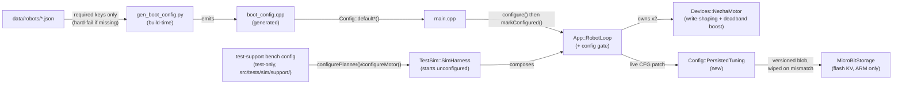

<!-- CLASI: Before changing code or making plans, review the SE process in CLAUDE.md -->

# Sprint 114: Config-as-truth completion (no source defaults, fail-closed, version-erase) and motor deadband compensation

## Goals

Finish the config-as-truth ethic sprint 113 only partially delivered (113 shipped
*item 2 only* — "the sim configures-on-open" — and explicitly deferred items 1, 3,
and 4 to a follow-on sprint; this is that sprint), then fix the motor write-shaping
dead zone that currently strands small terminal corrections. Two issues, in a hard
order:

1. **Config-as-truth completion** — delete every remaining behavioral default from
   source (`sim_harness.h`, `gen_boot_config.py`, `nezha_motor.h`), make an
   unconfigured device/composition-root refuse motion while staying alive for
   config/STOP/PING, and version-stamp any persisted configuration so a reflash
   forces reconfiguration instead of silently carrying stale field semantics
   forward.
2. **Deadband compensation** — boost a small nonzero motor command up to the
   plant's real minimum instead of zeroing it, so a terminal heading/distance
   correction inside the ~15 mm/s dead zone still produces real motion and the
   move completes instead of holding flat for ~8s until an arrive-timeout: then
   re-validate the stakeholder's motion-shape acceptance bar against the
   *actually configured* plant (`vel_kp=0.002`, not the `0.003` the traces were
   tuned against before sprint 113 closed that gap).

Part 2 depends on Part 1: re-validating "the real configured values" is only
meaningful once source no longer has a competing hardcoded value to silently win.

## Problem

**Config-as-truth gap.** `src/sim/sim_harness.h::makeExecutorConfig()` still
hardcodes `velGains.kp = 0.003f` while `data/robots/tovez_nocal.json` says
`vel_kp = 0.002` — sprint 113's own ticket-005 test asserts this exact divergence
as expected/current behavior. That is one visible instance of a broader pattern:
`gen_boot_config.py` carries ~29 `*_DEFAULT` Python constants that silently
substitute a bench placeholder whenever a robot JSON omits a key (a *design
decision*, documented in `src/firm/config/DESIGN.md` §3: "missing/bad robot JSON
degrades to bench defaults, not a build failure"), and `nezha_motor.h` hardcodes
`kDefaultOutputDeadband = 0.03f` / `kDefaultReversalDwell = 100.0f`, substituted
whenever `MotorConfig`'s `Opt<float>` write-shaping fields arrive unset — which,
per `gen_boot_config.py`'s own generated comment, is *every* build today, on
purpose. None of this fails loud; all of it fails quiet. The stakeholder's own
framing (2026-07-20): "If you try to run it with those defaults, it throws an
error."

**Deadband gap.** `NezhaMotor::writeShapedDuty()` zeros any duty under
`outputDeadband_` (0.03 duty ≈ 15 mm/s — the documented "PD stalls below that"
threshold). Sprint 112-004 deleted the old min-speed floor and leaned on
`heading_kp=6` so `heading_kp × heading_dwell_tol ≥ omega_deadband` always held —
i.e., every above-tolerance correction was automatically big enough to clear the
dead zone. The model-reference feedback work lowered `heading_kp` to 2.5,
breaking that invariant: an ~11 mm/s residual correction now falls inside the
15 mm/s dead zone, the wheel gets nothing, the error never shrinks, and the
command holds flat for ~8s until an arrive-timeout gives up. The stakeholder's own
wheel-speed trace shows exactly this signature.

## Solution

**Config-as-truth (Part A, tickets 001-004).** A configuration-completeness gate
in `App::RobotLoop`: a composition root starts unconfigured and refuses MOVE/TWIST
(new `ErrCode::ERR_NOT_CONFIGURED`) until a complete config has landed, while
STOP/CONFIG/PING/ID stay live throughout. Real firmware satisfies this gate
immediately at boot (its build-time bake is tightened to *fail the build*, not
substitute a placeholder, when a required behavioral key is missing from the
active robot JSON) — no behavior change for a robot that ships today. The sim
composition root (`TestSim::SimHarness`) no longer self-configures at all; its
former hardcoded stand-in values move to an explicit, test-tree-only bench-config
helper the ~40 existing sim test harnesses opt into with one added line each.
`nezha_motor.h`'s own hardcoded write-shaping substitution is deleted the same
way, once `gen_boot_config.py` can guarantee `output_deadband`/`reversal_dwell_ms`
are always present. A new `Config::PersistedTuning` module (mirroring the
existing `radiochan::load()/save()` `MicroBitStorage`-backed precedent) persists
live-pushed `CFG` patches across a power cycle, stamped with a compiled
`kConfigSchemaVersion`; a version mismatch at boot wipes the whole store instead
of reapplying a patch whose field meanings may have changed.

**Deadband compensation (Part B, tickets 005-006).** Move the fix to
`NezhaMotor::writeShapedDuty()` itself: a *genuine* nonzero duty
(`0 < |duty| < outputDeadband_`) is boosted to `sign(duty) * outputDeadband_`
instead of being zeroed; an *exact* `duty == 0.0f` (a real "stop"/"on target"
command — Pilot already stages this exactly once on completion) stays an
immediate, unclamped hard zero. This sits inside the velocity PID's own
closed loop (the PID reads real measured velocity every tick), which is the
structural reason it does not reproduce 112-004's deleted min-speed floor
(that floor lived one layer up, in `App::Pilot`'s open-loop twist reference, with
no velocity feedback of its own — see Design Rationale Decision 4). Re-validate
the stakeholder's motion-shape acceptance bar (clean trapezoid, no oscillation,
no end bumps, correct zero-crossing pattern) in sim against the actually
configured plant, then hand the stakeholder a bench checklist (no agent hardware
access).

## Success Criteria

- Grepping source for a behavioral tunable's literal value finds it only in
  `data/robots/*.json` (or the documented structural-invariant list) — not in
  `sim_harness.h`, `gen_boot_config.py`'s `*_DEFAULT` constants, or
  `nezha_motor.h`'s `kDefault*` constants.
- An unconfigured composition root issuing a MOVE/TWIST gets a clear
  `ERR_NOT_CONFIGURED` refusal; STOP/CONFIG/PING/ID still work.
- A robot JSON missing a required behavioral key fails the `gen_boot_config.py`
  build loudly, not silently on a placeholder.
- A firmware-version bump wipes persisted live-tuned config at boot, forcing
  reconfiguration; an unchanged version preserves it across a power cycle.
- An ~11 mm/s terminal correction (inside the 15 mm/s dead zone) produces real
  wheel motion and the move completes promptly — no multi-second flat hold.
- The wheel-speed trace is a clean trapezoid (no oscillation, no end bumps); a
  straight never goes below zero; a turn has exactly one wheel entirely below
  zero — verified against the sim's actually-configured plant (`vel_kp=0.002`).
- A stakeholder-run bench checklist exists for the one thing no agent in this
  sprint can verify directly: the fix holds on the real robot on the stand.

## Scope

### In Scope

- `src/sim/sim_harness.h`: delete `makeExecutorConfig()`/`makeMotorConfig()`;
  `SimHarness` no longer self-configures.
- New test-only bench-config helper under `src/tests/sim/support/`; batch
  migration of every existing `src/tests/sim/**` harness that relies on
  `SimHarness`'s old implicit defaults.
- `App::RobotLoop`: a configuration-completeness gate guarding
  `handleTwist()`/`handleMove()`; `main.cpp` marks real firmware configured
  immediately after its (tightened) boot bake.
- `src/protos/envelope.proto` + regenerated `src/firm/messages/envelope.h`:
  new `ErrCode::ERR_NOT_CONFIGURED`.
- `src/scripts/gen_boot_config.py`: delete every `*_DEFAULT` behavioral
  fallback; hard-fail the build on a missing required key.
- `data/robots/robot_config.schema.json` + `tovez_nocal.json`/`tovez.json`/
  `togov.json`: extend with every required behavioral key currently supplied
  only by a Python-side default (value-preserving migration — same numeric
  values, so no robot's compiled behavior changes on the next reflash unless
  its own JSON already diverges), and repair the schema's stale `control`
  block (documents the legacy text-protocol key vocabulary, not the current
  binary-tree fields already in use since sprint ~098).
- `src/firm/devices/nezha_motor.h`/`.cpp`: delete
  `kDefaultOutputDeadband`/`kDefaultReversalDwell`; `Devices::MotorConfig`'s
  `reversalDwell`/`outputDeadband` become plain required floats, not
  `Opt<float>` ship-default fallbacks.
- New `src/firm/config/persisted_tuning.h`/`.cpp` (`Config::PersistedTuning`,
  `MicroBitStorage`-backed, mirrors `com/radio_channel.h`'s precedent):
  version-stamped persistence for live-pushed `CFG` patches.
- `NezhaMotor::writeShapedDuty()`: boost a genuine sub-deadband nonzero duty to
  the deadband floor instead of zeroing it; exact-zero stays an immediate hard
  stop.
- Sim re-validation of the motion-shape acceptance bar against the configured
  plant (`vel_kp=0.002`); a stakeholder-run bench checklist deliverable.

### Out of Scope

- Widening the live wire `PlannerConfigPatch`/`MotorConfigPatch` surface to
  cover every boot-only field (sprint 113's own Decision 1 already considered
  and rejected this; not reopened here — this sprint's persistence mechanism
  persists whatever is *already* live-tunable, it does not make more fields
  live-tunable).
- Wiring up `data/robots/*.json`'s `drive.motor_deadband` (mm/s) as a *separate*
  firmware-consumed field. It restates, in different units, the exact same
  physical floor `control.output_deadband` (duty) and `control.vel_kff` already
  encode once ticket 003 lands; giving it its own consumer would recreate a
  second source of truth for one physical fact — precisely the divergence this
  sprint exists to close (see Design Rationale Decision 5). It remains
  human/host-readable documentation.
- `togov` (mecanum)-specific `Drive::Limits` bench characterization — out of
  scope per the existing `config/DESIGN.md` Open Question; `togov.json` is
  touched only to keep it schema-complete, not bench-retuned.
- Any change to the `S`/`T`/`D`/`R`/`TURN`/`RT`/`G`/`VW` text-protocol verbs
  documented in `docs/protocol-v2.md` — that document describes the legacy
  `source/` tree; the current `src/firm/` binary `CommandEnvelope` tree this
  sprint touches is a separate command surface.
- Real-hardware bench verification of the deadband fix or the persisted-tuning
  flash round-trip — no agent in this sprint has hardware access; both ship as
  an explicit stakeholder-run checklist (ticket 006), not an agent-executed
  acceptance step.

## Test Strategy

- **Unit (C++, host-build)**: `NezhaMotor::writeShapedDuty()` targeted cases —
  exact `0.0f` stays a hard zero; `0 < |duty| < outputDeadband_` boosts to
  `sign(duty) * outputDeadband_`; `|duty| >= outputDeadband_` passes through
  unchanged; reversal-dwell interaction unchanged.
- **Unit (C++, host-build)**: `App::RobotLoop` configuration-completeness gate —
  unconfigured + MOVE/TWIST → `ERR_NOT_CONFIGURED`, no `Drive`/`Pilot` mutation;
  unconfigured + STOP/CONFIG → still `ACK_STATUS_OK`; after `markConfigured()`,
  MOVE/TWIST succeed.
- **Unit (Python)**: `gen_boot_config.py` — every required-key-missing case
  raises/exits the generator (one parametrized case per migrated `*_DEFAULT`);
  a fully-populated JSON still generates byte-identical output to today's
  defaults (regression pin, mirrors `test_gen_boot_config_planner.py`'s
  existing style).
- **Unit (C++, host-build, new)**: `Config::PersistedTuning`'s *pure* logic
  only — struct↔byte-blob serialization of the currently-live-tunable patch
  fields, and the version-compare-and-wipe-or-keep decision
  (`shouldWipe(storedVersion, currentVersion)`) — as free functions taking
  already-read bytes/versions, with **no** `MicroBitStorage` dependency at
  all. (Correction from an earlier draft of this doc: `com/radio_channel.h`
  is *not* actually a host-testable precedent — it `#include`s `MicroBit.h`
  directly, has no `HOST_BUILD` variant, and is not exercised by any host
  test today. This module does not claim more host-testability than its own
  pure-function split earns; the real flash read/write call stays a thin,
  ARM-only wrapper, untested by any agent.)
- **System (Python, sim, requires built sim lib)**: inject an
  ~11 mm/s-equivalent terminal heading correction against the sim, assert the
  wheel actually moves and the move completes inside a bounded time (not the
  ~8s arrive-timeout); sweep gain/error combinations that used to fall inside
  the dead zone and assert no oscillation (bounded overshoot, monotonic
  convergence into the dwell tolerance).
- **Regression (Python, sim)**: re-run the existing tour-closure / behavior-lock
  / turn-error-characterization suites (`test_tour_closure_gate.py`,
  `behavior_lock_harness.cpp`, `test_turn_error_characterization.py`) against
  the *configured* `vel_kp=0.002` plant — these were last validated against the
  hardcoded `0.003` sim-only value; re-baseline any threshold that assumed it.
- **Migration verification**: every one of the ~40 existing
  `src/tests/sim/**` C++ harnesses that constructs a bare `SimHarness` still
  compiles and passes after opting into the new bench-config helper (batch
  sweep, verified by a full targeted re-run, not spot-checked).
- Full suite: `uv run python -m pytest` (~7-13 min gate) before considering any
  ticket done; use targeted per-file runs (`uv run python -m pytest
  src/tests/sim/unit/test_X.py -v -s`) during ticket work per project convention.
- No ARM-hardware test exists for `Config::PersistedTuning`'s actual
  `MicroBitStorage` read/write round-trip or for the deadband fix's real-plant
  behavior — see the Bench Verification Checklist ticket 006 produces.

## Architecture

**Substantial** — 3+ modules touched with a genuinely new cross-module
dependency (`App::RobotLoop` → new `Config::PersistedTuning` →
`MicroBitStorage`) and a data-model change (`Devices::MotorConfig`'s
`reversalDwell`/`outputDeadband` collapse from `Opt<float>` to required `float`;
a new `ErrCode` enumerator). Full 7-step methodology, with a component diagram.

### Architecture Overview

**Step 1/2 — the problem and its responsibilities.** Two previously-separate
concerns turn out to share one root cause and therefore one fix locus each:

1. *Where does a behavioral value legitimately come from* (config-as-truth) —
   responsibilities: (a) build-time bake completeness (`gen_boot_config.py`
   must not paper over a missing key), (b) runtime configuration-completeness
   (a composition root must know, and enforce, whether it has actually been
   configured before it drives motors), (c) persistence-with-versioning (a
   live-tuned value that outlives a power cycle must not outlive a firmware
   upgrade that changed what the field means).
2. *What happens at the very bottom of the write path when a real, wanted,
   nonzero command is smaller than the plant can produce* (deadband
   compensation) — one responsibility, one locus: `NezhaMotor::writeShapedDuty()`.

**Step 3 — modules.**

| Module | Purpose (one sentence, no "and") | Boundary | Serves |
|---|---|---|---|
| `App::RobotLoop` (config gate) | Decides whether this composition root is allowed to drive motors yet. | Inside: the `configured_`/`markConfigured()`/`isConfigured()` state and the refusal branch in `handleTwist()`/`handleMove()`. Outside: *how* a caller becomes configured (that's `main.cpp`'s boot sequence or `SimHarness`'s explicit `configurePlanner()`/`configureMotor()` calls) and the config-patch application logic itself (already `handleConfig()`'s job, unchanged). | SUC-001 |
| `gen_boot_config.py` (tightened) | Turns a robot's JSON into the compiled boot defaults, or refuses to build. | Inside: reading `data/robots/*.json`, resolving every mapped key, failing loudly on an absent required one. Outside: what the values mean at runtime (that's `devices/`/`app/`'s job) and anything not sourced from JSON (the documented structural-invariant list). | SUC-002, SUC-004 |
| `Devices::MotorConfig`/`NezhaMotor` ctor (tightened) | Carries write-shaping calibration that must always be real. | Inside: the two fields becoming plain `float` (no substitution branch). Outside: the actual boosted-write behavior (that's `writeShapedDuty()`, a separate responsibility below). | SUC-002, SUC-004 |
| `TestSim::SimHarness` (relocated defaults) | Composes the real `App::RobotLoop` graph against a simulated bus, starting unconfigured. | Inside: construction/wiring, `configurePlanner()`/`configureMotor()` as the *only* way values enter. Outside: what those values are for a given test (that's the new test-support bench-config helper's job, or a real robot-JSON push via `configure_from_robot()`). | SUC-001, SUC-004 |
| `Config::PersistedTuning` (new) | Keeps a live-tuned config patch across a power cycle, honestly, or not at all. | Inside: serializing/deserializing the currently-live-tunable patch fields, the version stamp, the wipe-on-mismatch decision. Outside: the flash I/O primitive itself (a thin `MicroBitStorage&` seam, mirroring `radiochan::load()/save()`) and the wire dispatch that produces the patch in the first place (`RobotLoop::handleConfig()`, unchanged). | SUC-003 |
| `NezhaMotor::writeShapedDuty()` (compensated) | Turns a requested duty into the duty actually written to the bus. | Inside: the exact-zero/sub-deadband-boost/reversal-dwell decision tree. Outside: how the requested duty was computed (PID, open-loop kff, or raw passthrough — all three already funnel through this one function, unchanged) and the deadband *value* itself (config-sourced, ticket 003's concern, not this ticket's). | SUC-005 |

**Boundary list — behavioral (config-sourced, no source fallback) vs.
structural (compile-time, exempt).** This is the crux of "no defaults":

- **Behavioral, must come from `data/robots/*.json`, no code fallback**: every
  velocity-PID gain (`kp`/`ki`/`kff`/`i_max`/`kaw`/`filt`), per-drive-port
  `travel_calib`/`fwd_sign`, `trackwidth`, motor write-shaping
  (`output_deadband`, `reversal_dwell_ms`), heading/distance PD gains and
  dwell tolerances, lead-compensation deltas, the model-reference plant-lag
  time constants (`model_tau_lin`/`model_tau_ang`), motion-limit ceilings
  (`a_max`/`a_decel`/`v_body_max`/`yaw_rate_max`/`yaw_acc_max`/`j_max`/
  `yaw_jerk_max`), `actuation_lag`, `arrive_dwell`, OTOS lever-arm offset and
  linear/angular scale.
- **Structural, compile-time, exempt (not a hidden default in disguise)**:
  `kMotorConfigCount`/`K_MOTOR_COUNT` (array sizing, must track
  `main.cpp`'s own `static_assert`), the drive-pair `LEFT_PORT`/`RIGHT_PORT`
  wiring-fact constants and the I2C flip-flop poll-schedule membership
  (`polled_for_ports()` — a firmware-scheduling fact, never per-robot
  calibration, already documented as such), buffer/ring sizes
  (`Motion::kEventRingDepth`, queue depths), protocol/message wire-format
  version, math constants, and `App::kDistanceTrimCeiling` (already a
  deliberate fixed C++ constant, explicitly *not* a wire field, per its own
  existing doc comment — a correct precedent this sprint reinforces, not a
  target for removal).
- **Documented exception, not a loophole**: the calibration placeholders
  `FWD_SIGN`/`TRAVEL_CALIB_PLACEHOLDER` for the two motor ports the shipped
  drivetrain does not actually drive (ports 3/4 on a 2-wheel differential
  robot) stay code-side. They are provably inert — `polled_for_ports()`
  excludes them from the flip-flop schedule, so no live control path ever
  reads them — not a hidden behavioral guess for a port that matters. Every
  port the drivetrain *does* drive (`LEFT_PORT`/`RIGHT_PORT`) is required,
  no fallback.

**Step 4 — component diagram.** New cross-module dependency
(`RobotLoop` → `Config::PersistedTuning` → `MicroBitStorage`) plus 3+ modules
touched — diagram required:

`Config::PersistedTuning`/`MicroBitStorage` has no sim counterpart — the sim has
no flash. Sim parity for the persistence requirement (issue item 4) is therefore
vacuous by construction, not an oversight: there is nothing to persist or wipe
in a process that exits and loses all state anyway. This is stated explicitly so
it isn't later mistaken for a missed use case.

**Step 5 — What Changed / Why / Impact / Migration Concerns.**

*What changed*: (1) a runtime configuration-completeness gate now exists where
none did; (2) the build-time generator's fallback discipline inverts from
"degrade gracefully" to "fail loudly"; (3) `Devices::MotorConfig`'s two
write-shaping fields lose their `Opt`-based substitution; (4) a new
flash-backed persistence module exists; (5) the motor write path gains a
one-sided compensating floor.

*Why*: the stakeholder's own instruction (2026-07-20) — no code-side behavioral
guesses, ever; a device that would otherwise run on a guess must instead say so
and refuse. The deadband fix's own "why" is separate and narrower: the dead
zone was always there; sprint 112-004 only ever cleared it *incidentally*
(a gain product exceeding the deadband), and the model-reference feedback work
broke that incidental clearance. Fixing it at its actual source
(`writeShapedDuty()`) makes the clearance structural instead of incidental —
true "at any gain," exactly the issue's own acceptance bar.

*Impact on existing components*: `App::Pilot`/`Motion::Executor`/
`App::HeadingSource` are **unchanged** — the deadband fix is entirely below
them, in `NezhaMotor`; they never see or reason about the boosted duty, only
its resulting measured velocity next tick. `main.cpp`'s boot sequence gains one
new call (`markConfigured()`) but its existing `Config::default*()` sequence is
otherwise untouched. The ~40 existing `src/tests/sim/**` harnesses are the
largest blast radius — each needs exactly one new line (the bench-config
opt-in) to keep passing; this is mechanical, not a redesign, and ticket 001
scopes it as a batch sweep, not per-file bespoke work.

*Migration concerns*: see the dedicated section below.

### Design Rationale

**Decision 1 — The fail-closed gate is a single boolean on the composition
root, not a per-component checklist.** *Context*: `App::Pilot`, `Motion::
Executor`, `App::HeadingSource`, `App::Drive`, and two `NezhaMotor`s each have
their own `configure()`-shaped entry point; "is everything configured" could be
computed by polling all of them. *Alternatives*: (a) a distributed
per-component "have I been configured" query aggregated on demand; (b) one
flag, set exactly once, by the one code path (`main.cpp`'s boot sequence, or
`SimHarness`'s `configurePlanner()`+`configureMotor()` pair) that already
configures the whole graph atomically. *Why*: both existing boot paths already
configure everything in one atomic sequence — there is no real intermediate
state where some components are configured and others aren't, so (a) would add
bookkeeping to detect a state that structurally cannot occur. *Consequences*: a
future caller that configures the graph piecemeal (not through one of the two
existing atomic paths) would need to call `markConfigured()` itself once it
actually is complete — a documented contract, not an enforced one; acceptable
because no such caller exists today and both existing callers already satisfy
it trivially.

**Decision 2 — Real firmware's own "unconfigured" state is structurally
unreachable, by design, not by omission.** *Context*: the issue's acceptance
criterion reads "booting/opening unconfigured and issuing a motion command
yields a clear refusal" — real hardware, after this sprint's ticket 002 change,
can never produce a flashable image with an incomplete boot bake (the build
fails first). *Alternatives*: (a) make real hardware capable of booting
unconfigured too (e.g., strip `Config::default*()` calls out of `main.cpp` and
require a live post-boot push); (b) leave real hardware's boot-time bake as the
always-complete case it already is, and let the runtime gate's only real
"unconfigured" case be the sim/test composition root. *Why*: (a) would be a
regression — it turns an always-correct-by-construction robot into one that
depends on a host connecting and pushing config before it's safe to drive,
solving a problem (sim/test hardcoded defaults) real hardware never had.
(b) keeps the belt (build-time completeness) and adds suspenders (a runtime
gate that would catch a *future* composition root that skips the belt) without
manufacturing risk for the robot that ships today. *Consequences*: the gate is
real, shared, load-bearing code — not dead code — but its only observable
effect on real hardware is that `main.cpp` now makes one additional, always-
successful call.

**Decision 3 — Relocate the sim's hardcoded config to a test-tree bench-config
helper; do not delete it outright.** *Context*: ~40 existing
`src/tests/sim/**` harnesses depend on `SimHarness` self-configuring with
*some* reasonable stand-in values to exercise real jerk-limited motion; the
issue demands `SimHarness` itself stop hardcoding them. *Alternatives*: (a)
delete the values outright and let every affected test fail until someone
gives it real config (unbounded, undirected migration cost); (b) keep the
values, but move them out of `SimHarness` (production/shared composition-root
code, also reachable from the real ctypes/TestGUI path) into an explicit,
visibly-test-only header the affected harnesses opt into with one line each.
*Why*: (b) satisfies the issue's literal bar — grepping `src/sim/sim_harness.h`
for a hardcoded gain now finds nothing — while turning "~40 tests silently
break" into a single, mechanical, scriptable sweep (batch-add one call per
file), consistent with this project's established practice for renames/sweeps
of this shape. *Consequences*: the stand-in values still exist, now
unambiguously labeled as test fixtures rather than production fallbacks — a
future reader can no longer mistake them for what a real robot would run.

**Decision 4 — The deadband floor lives in `NezhaMotor::writeShapedDuty()`
(write-shaping layer), not in `App::Pilot`'s PD output (planner layer) —
this is why it does not reproduce 112-004's regression.** *Context*: 112-004
deleted exactly this shape of floor from `App::Pilot` because an
unconditional minimum-command clamp on the PD's *output* caused a sustained
terminal oscillation (the floor could push the commanded reference past what
the PD actually wanted, and `App::Pilot`'s twist reference has no velocity
feedback loop of its own — the next PD sample only ever sees the *reference*
it itself last set, not what the plant actually did). *Alternatives*: (a)
reinstate a floor at the planner/PD layer (rejected — the issue explicitly
forbids this, and it is the shape of the mechanism already known to hunt); (b)
raise `heading_kp` back up to clear the deadband algebraically (rejected — the
issue explicitly forbids this too, and it would undo the model-reference
work's own low-gain, stable design); (c) this sprint's choice: float the
boost at `NezhaMotor`'s own write-shaping stage, strictly below the velocity
PID. *Why*: `writeShapedDuty()` sits *inside* `NezhaMotor`'s velocity-PID
closed loop — the PID reads real measured velocity every tick and computes a
fresh error against it, so a boosted write is never "invisible" to the control
loop the way a planner-layer floor is; the very next tick's measurement already
reflects the boosted motion, and the PID's own proportional term shrinks
accordingly. It is also strictly one-sided (only ever lifts a nonzero command
toward the deadband threshold, never floors a genuinely-zero one), so it cannot
introduce a new zero-crossing the way a symmetric minimum-speed clamp can.
*Consequences*: correctness of "settles, does not hunt" rests on the dwell
tolerance carrying enough margin above one cycle's worth of floor-speed travel
— the same style of margin argument `gen_boot_config.py`'s own (now-superseded)
`MIN_SPEED_DEFAULT`/`HEADING_KP_DEFAULT` comments already used for the old
floor — verified empirically in sim (ticket 005's own acceptance criteria),
not merely asserted algebraically.

**Decision 5 — `drive.motor_deadband` (mm/s) stays host/documentation-only;
the boost target derives from `output_deadband` (duty), not a new field.**
*Context*: `tovez_nocal.json`'s `drive.motor_deadband: 15.0` already states
this same physical floor in mm/s, with its own comment noting "no code default
— config is the source of truth," and sprint 113 explicitly flagged wiring it
up as this sprint's work. *Alternatives*: (a) give `drive.motor_deadband` its
own firmware consumer, converted to duty via `vel_kff` at the boost site; (b)
derive the boost target directly from the now-required `output_deadband`
(duty) field ticket 003 introduces, leaving `drive.motor_deadband` as
documentation. *Why*: (a) creates two config-side descriptions of one physical
fact (a duty-domain field and an mm/s-domain field that must always compute to
the same floor) — exactly the two-numbers-one-name drift class the "why now"
evidence in the config-as-truth issue already caught once for `vel_kp`. (b)
keeps one source of truth in the units the write-shaping code actually
operates in. *Consequences*: `drive.motor_deadband` remains in the JSON as a
human-readable cross-check (and a natural value for a future host-side
diagnostic to assert against), but is not read by any firmware code path this
sprint adds.

### Migration Concerns

- **~40 existing sim test harnesses**: mechanical, one-line-per-file migration
  to the new bench-config helper (ticket 001) — a full targeted re-run is the
  verification, not a sample.
- **`data/robots/robot_config.schema.json` is already stale** relative to the
  binary-tree `control.*` fields in active use since sprint ~098
  (`heading_kp`/`distance_kp`/`model_tau_lin`/`model_tau_ang`/`actuation_lag`
  are already present in `tovez_nocal.json` today but not declared in the
  schema's `additionalProperties: false` `control` object — a pre-existing,
  non-blocking drift, since the schema is documentation only; `robot_config.py`
  validates via its own `pydantic` model, not this file). Ticket 002 repairs
  this as part of adding the sprint's own new required keys, rather than
  leaving a second, still-incomplete schema behind.
- **`tovez.json`/`togov.json` must gain the same required keys as
  `tovez_nocal.json`**, value-preserving (copy today's `*_DEFAULT` numbers in,
  verbatim), or the generator's hard-fail (ticket 002) breaks a build against
  either profile and the sim's own parity tests
  (`test_sim_boot_config_parity.py`) that already read both files.
- **No hardware bench gate is executable by any agent in this sprint** (no
  agent has hardware access). `Config::PersistedTuning`'s actual flash
  round-trip and the deadband fix's real-plant behavior are unverifiable by
  simulation alone in the flash-I/O case, and simulation-verified-but-not-
  bench-confirmed in the deadband case — see the standing hardware bench
  testing rule and ticket 006's stakeholder checklist deliverable.
- **No data migration** for existing persisted state — `Config::PersistedTuning`
  is new; there is no prior on-device store to migrate away from
  (`radio_channel.h`'s own persisted key is untouched, a separate concern).

### Open Questions

1. **Which live-tunable fields does `Config::PersistedTuning` actually
   persist?** This sprint scopes it to exactly the fields already curated as
   live-wire-tunable (`MotorConfigPatch`'s gains/`travel_calib`,
   `PlannerConfigPatch`'s `min_speed`/`heading_kp`/`heading_kd`/
   `arrive_dwell`/`distance_kp`, `OtosConfigPatch`'s scale/offset fields) —
   whatever a `CFG` patch can already change live, this module can already
   persist; it does not widen the live-tunable set (see Design Rationale,
   sprint 113's own Decision 1). If a future need arises to persist a
   boot-only field too, that is a live-wire-surface question first, a
   persistence question second.
2. **`kConfigSchemaVersion`'s bump discipline** — this sprint defines the
   constant and the wipe-on-mismatch mechanism; it does not establish a
   process for *when* a future ticket must bump it (e.g., "any
   `PlannerConfigPatch`/`MotorConfigPatch` field rename or unit change bumps
   it"). Flagged for a documentation follow-up, not blocking this sprint.
3. **Flash-write frequency / wear risk (found during self-review, not in
   either source issue)** — `Config::PersistedTuning` writes on a live `CFG`
   patch, but a bench-tuning session can push patches rapidly (e.g. a
   TestGUI slider streaming `SET` calls). Writing flash on every single patch
   risks both per-write latency inside a live control session and, over many
   sessions, page wear on a finite-endurance flash region shared with
   `radio_channel.h`'s own persisted key. This sprint does not resolve the
   exact policy (e.g. debounce, or only write when a value actually changed
   versus the last-persisted one) — ticket 004 must choose and justify one
   rather than writing on every patch unconditionally; flagged here so it
   isn't discovered as a bench surprise instead.
4. **Sim trackwidth source** — sprint 113's own Open Question 1
   (`sim_prefs`' persisted "error profile" vs. the robot JSON's
   `geometry.trackwidth`) is still open and out of scope here; not touched by
   this sprint's boundary list (trackwidth itself is already correctly
   behavioral/config-sourced — this is about *which* config source the sim
   picks it from, a separate, already-flagged question).

## Use Cases

### SUC-001: Unconfigured composition root refuses motion, stays alive for config/STOP/PING
Parent: (config-as-truth-completion-no-defaults-fail-closed-version-erase.md)

- **Actor**: Host (TestGUI, a headless `SimLoop`, or a future caller) talking to
  a freshly-constructed composition root (`TestSim::SimHarness`, or — vacuously,
  since it is always already configured by the time it can receive wire traffic
  — real firmware).
- **Preconditions**: The composition root has been constructed but
  `configurePlanner()`/`configureMotor()` (sim) — or, on real firmware, the
  always-run boot bake — has not yet completed.
- **Main Flow**:
  1. Host sends a MOVE or TWIST.
  2. `App::RobotLoop` checks its configuration-completeness gate; it is false.
  3. `RobotLoop` acks `ACK_STATUS_ERR` / `ErrCode::ERR_NOT_CONFIGURED`; `Drive`,
     `Pilot`, and the deadman lease are untouched.
  4. Host sends STOP, then a CONFIG patch, then PING; all three succeed
     normally.
  5. Host completes configuration (`configurePlanner()`+`configureMotor()`, or
     real firmware's boot sequence finishing); `markConfigured()` fires.
  6. Host resends the MOVE; it is now accepted normally.
- **Postconditions**: No motion occurred before step 6; no wire command other
  than MOVE/TWIST was ever refused for this reason.
- **Acceptance Criteria**:
  - [ ] MOVE/TWIST before configuration → `ERR_NOT_CONFIGURED`, zero motor
        writes.
  - [ ] STOP/CONFIG/PING/ID before configuration → succeed unchanged.
  - [ ] Real firmware's `markConfigured()` call is unconditional and
        immediate — no observable startup delay or new failure mode.

### SUC-002: A build fails loudly on a robot JSON missing a required behavioral key
Parent: (config-as-truth-completion-no-defaults-fail-closed-version-erase.md)

- **Actor**: A developer (or CI) running `gen_boot_config.py` against an
  incomplete robot JSON.
- **Preconditions**: `data/robots/<robot>.json` is missing at least one key
  this sprint moved from a Python `*_DEFAULT` constant to a required JSON key.
- **Main Flow**:
  1. `gen_boot_config.py` runs (directly, or via `build.py`'s codegen step).
  2. It resolves the active robot config and finds the required key absent.
  3. It fails the build with a clear message naming the missing key and the
     JSON file — it does not emit `boot_config.cpp` with a placeholder value.
- **Postconditions**: No firmware image can be produced with a silently
  incomplete calibration for a behavioral field.
- **Acceptance Criteria**:
  - [ ] Every migrated field's absence independently fails the generator
        (parametrized test, one case per field).
  - [ ] A fully-populated JSON (all three shipped profiles) still generates
        successfully, with byte-identical output to today's values.
  - [ ] The structural-invariant fields (Boundary list) are *not* required
        from JSON — they still resolve from firmware-side constants.

### SUC-003: A live-tuned parameter survives a power cycle but not a firmware upgrade
Parent: (config-as-truth-completion-no-defaults-fail-closed-version-erase.md)

- **Actor**: Stakeholder bench-tuning a gain live (e.g. `heading_kp` via
  `DEV M <n> CFG`/`PlannerConfigPatch`), on real hardware.
- **Preconditions**: Firmware is running at compiled version `V1`;
  `Config::PersistedTuning` is empty or holds a `V1`-stamped patch.
- **Main Flow**:
  1. Stakeholder pushes a live `CFG` patch; `RobotLoop::handleConfig()` applies
     it in RAM (unchanged) and `Config::PersistedTuning` persists it, stamped
     `V1`.
  2. Robot power-cycles (no reflash). Boot reads the store: version matches
     `V1`; the patch is reapplied automatically, before `markConfigured()`.
  3. Robot is reflashed with a new firmware build, version `V2` (any field
     rename/semantic change). Boot reads the store: version mismatch; the
     entire store is wiped; boot proceeds on the `V2` boot bake alone.
- **Postconditions**: A same-version power cycle never silently loses a bench
  tune; a version bump never silently misapplies a stale one.
- **Acceptance Criteria**:
  - [ ] Version-match round-trip: pushed patch value observed unchanged after
        a simulated reboot.
  - [ ] Version-mismatch: store wiped; boot bake values observed instead, not
        a partially-applied or misinterpreted stale patch.
  - [ ] The version-compare-and-wipe decision and the patch↔byte-blob
        serialization are pure functions, unit-testable with no
        `MicroBitStorage`/hardware dependency at all; the actual flash
        read/write call is a thin ARM-only wrapper, covered by the bench
        checklist (ticket 006), not by any agent-run test.

### SUC-004: Sim and real firmware share one mapping, with no sim-only fallback anywhere
Parent: (config-as-truth-completion-no-defaults-fail-closed-version-erase.md)

- **Actor**: Anyone comparing sim behavior to real-robot behavior for the same
  robot JSON (this sprint's own motivating "why now" evidence).
- **Preconditions**: `SimHarness`'s own hardcoded defaults are deleted
  (SUC-001's ticket); `gen_boot_config.py`'s fallback constants are deleted
  (SUC-002's ticket); `nezha_motor.h`'s ship-default substitution is deleted.
- **Main Flow**:
  1. A caller configures the sim from `tovez_nocal.json` via
     `configure_from_robot()` (sprint 113's existing mechanism, unchanged).
  2. The sim's live `PlannerConfig`/`MotorConfig` is read back.
  3. It is compared field-by-field against what `gen_boot_config.py` would
     bake for the same file (sprint 113's own parity-test pattern).
  4. Every field matches — there is no field where the sim's own hardcoded
     stand-in silently wins over the JSON value, because no such stand-in
     exists anymore in production code.
- **Postconditions**: The `vel_kp` 0.003-vs-0.002 divergence (and every field
  like it) cannot recur — there is no second source of truth left to drift.
- **Acceptance Criteria**:
  - [ ] `grep` for a `*_DEFAULT`-shaped behavioral literal in
        `src/sim/sim_harness.h` finds nothing.
  - [ ] The existing sim/boot-config parity test suite passes with zero
        hardcoded-fallback-sourced fields.

### SUC-005: A terminal correction inside the motor's dead zone still produces real motion, and settles
Parent: (deadband-compensation-small-commands-must-produce-real-motion.md)

- **Actor**: `App::Pilot`'s heading/distance PD, issuing a small residual
  correction near the end of a move.
- **Preconditions**: A move is in its terminal phase; the PD's commanded
  correction is nonzero but smaller than `outputDeadband_` (e.g. ~11 mm/s
  against a ~15 mm/s deadband).
- **Main Flow**:
  1. `NezhaMotor::writeShapedDuty()` receives the corresponding small nonzero
     duty.
  2. Because it is nonzero and below `outputDeadband_`, it is boosted to
     `sign(duty) * outputDeadband_` instead of zeroed.
  3. The wheel actually turns; next tick's measured velocity reflects it; the
     PID's own error shrinks accordingly.
  4. The error crosses into the dwell tolerance; `App::Pilot` stages an exact
     `0.0f` twist on completion (existing behavior, unchanged); `writeShapedDuty()`
     treats that exact zero as an immediate hard stop.
- **Postconditions**: No multi-second flat hold at a nonzero, ineffective
  command; the move completes via the dwell gate, not an arrive-timeout.
- **Acceptance Criteria**:
  - [ ] An ~11 mm/s correction against the shipped ~15 mm/s deadband produces
        nonzero measured wheel velocity within one tick.
  - [ ] The move completes inside a bounded time window, not via timeout.
  - [ ] Sweeping small residual errors near the dwell tolerance boundary shows
        monotonic convergence, not a sustained oscillation (bounded overshoot
        count).
  - [ ] An exact-zero command (STOP, or Pilot's own completion twist) is
        unaffected — still an immediate hard zero, no boost.

### SUC-006: The motion-shape acceptance bar holds against the actually configured plant
Parent: (deadband-compensation-small-commands-must-produce-real-motion.md)

- **Actor**: Stakeholder, evaluating a wheel-speed trace.
- **Preconditions**: The sim is configured from `tovez_nocal.json`
  (`vel_kp=0.002`, not the pre-113 hardcoded `0.003`); the deadband
  compensation (SUC-005) is in place.
- **Main Flow**:
  1. Run the sim's standard straight + turn scenarios against the configured
     plant.
  2. Capture wheel-speed traces.
  3. Verify: clean trapezoid (smooth ramp-up, hold, ramp-to-zero); no
     oscillations; no bumps at the end; a straight's trace never goes below
     zero; a turn's trace has exactly one wheel entirely below zero (the
     mirror wheel).
  4. Produce a stakeholder-run bench checklist for the one verification step
     no agent in this sprint can perform: confirming the same shape on the
     real robot on the stand.
- **Postconditions**: The acceptance bar is verified against reality
  (the configured plant), not against the stale hardcoded value the traces
  were originally tuned against.
- **Acceptance Criteria**:
  - [ ] Straight-line trace matches the shape bar against `vel_kp=0.002`.
  - [ ] Turn trace matches the shape bar (exactly one wheel below zero)
        against `vel_kp=0.002`.
  - [ ] Any threshold/tolerance in the existing regression suite that assumed
        the old `0.003` value is re-baselined, with the change explained.
  - [ ] A clearly-labeled, stakeholder-run bench checklist is delivered
        (not agent-executed) covering the hardware-bench-testing.md standing
        gate for this sprint's HAL/motor-control/protocol-adjacent changes.

## GitHub Issues

None.

## Definition of Ready

Before tickets can be created, all of the following must be true:

- [x] Sprint planning document is complete (sprint.md, including its
      Architecture and Use Cases sections)
- [x] Architecture review passed (or skipped, for changes with no
      architectural impact)
- [ ] Stakeholder has approved the sprint plan

## Tickets

| # | Title | Depends On |
|---|-------|------------|
| 001 | Config-completeness gate: fail-closed motion refusal + delete SimHarness's hardcoded planner/motor defaults | — |
| 002 | Eliminate gen_boot_config.py behavioral fallback defaults: extend robot JSON schema/profiles, hard-fail build on missing required key | — |
| 003 | Eliminate nezha_motor.h's write-shaping ship defaults: reversalDwell/outputDeadband become required config | 002 |
| 004 | Version-stamped persisted live-tuning store (Config::PersistedTuning, MicroBitStorage-backed) | 001 |
| 005 | Deadband compensation at motor write-shaping: boost sub-deadband nonzero commands, settle not hunt | 003 |
| 006 | Re-validate motion-shape acceptance bar against the configured plant + stakeholder bench checklist | 005 |

Tickets execute serially in the order listed.
