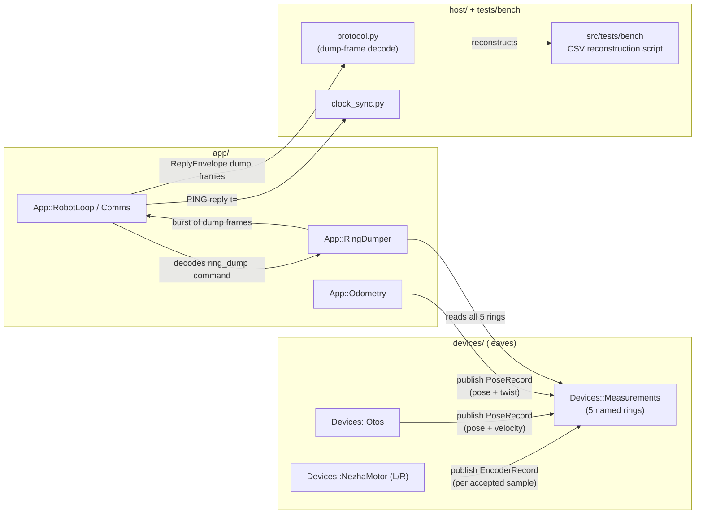

<!-- CLASI: Before changing code or making plans, review the SE process in CLAUDE.md -->

# Sprint 115: Measurements rings, ring-dump commands, and clock-sync revival

## Goals

Sprint 1 of the predict-to-now odometry arc (see
`clasi/issues/predict-to-now-odometry-estimator-ring-capture-dump-validation-trajectory-controller.md`
for the full arc). Build the on-chip `Devices::Measurements` container (five
per-source rings), wire real publishers into it at zero added I2C traffic,
add a debug ring-dump command arm so any ring can be pulled off the wire and
reconstructed to CSV host-side, activate the existing (complete,
unit-tested) host clock-sync estimator by echoing the robot clock in the
`PING` reply, add a compile-time capture-length build option for a future
long-duration bench capture (sprint 116), and clean up three small pieces of
debt found directly in this sprint's own neighborhood so the arc's sim-first
validation methodology has solid footing under it.

## Problem

Closing the two standing bench blockers (turn non-termination,
straight-leg terminal wedge) needs a trustworthy "where am I right now"
estimate built from real sensor history. Today nothing publishes into the
one ring type that exists (`measurement_ring.h` has zero call sites, per
the arc issue's own Cause section), `Devices::Otos::tick()` reads velocity
off the bus and immediately drops it, and there is no way to inspect raw
measurement history short of adding dedicated new telemetry fields for
every question a future analysis might ask. This sprint builds the
plumbing (rings, publishers, dump/reconstruct path, clock sync) the rest of
the arc depends on — it does not attempt fusion or estimation itself
(that is sprint 116).

## Solution

- `Devices::Measurements` — one container, five named per-source rings
  (`external`, `otos`, `encoderPose` as `PoseRecord`; `encoderLeft`,
  `encoderRight` as `EncoderRecord`), gap-write publish discipline
  borrowed from the existing `measurement_ring.h` template, per-ring
  compile-time slot counts.
- Publish wiring, zero added bus traffic: `NezhaMotor::tick()` publishes an
  `EncoderRecord` per accepted (non-glitch) sample; `Otos::tick()`
  publishes a `PoseRecord` per successful burst, **now including
  velocity** (currently read and dropped); encoder-odometry publishes a
  `PoseRecord` (pose + twist) into `encoderPose` once per cycle. The
  `external` ring is part of the container this sprint but has no
  publisher yet — that is sprint 118 (`PoseFix` revival).
  `HeadingSource`/`Odometry`/`Otos`'s existing TLM/consumer behavior is
  unchanged; the ring publish is purely additive.
- Debug ring-dump command arm: a new `CommandEnvelope` oneof arm selects
  one of the five rings; the reply is a burst of frames (one record per
  packet) over the existing host frame-drain path, terminated by a
  count/done frame. A new host bench script reconstructs the dump into a
  CSV.
- Clock sync: append `t=<robot ms>` to the `PING` reply — this alone
  activates `src/host/robot_radio/robot/clock_sync.py`'s existing
  min-RTT ping-pong estimator (it already parses this exact reply shape
  and has been waiting on the firmware side since it was written).
- `ROBOT_RING_CAPTURE` compile option growing the four high-rate rings for
  a future long-duration capture (exercised for real in sprint 116); this
  sprint verifies it builds and boots with a heap high-water check, not a
  full capture run.
- Three co-located issues, addressed as part of this sprint because they
  sit directly in the files this sprint touches or the validation
  methodology this sprint's gate depends on: the cycle-order-B accuracy
  decision (surfaced explicitly to the stakeholder, not silently
  adopted), the `kCycle`/`kPrimaryPeriod` doc/code mismatch, and the
  `SimLoop` hook-registration race (the arc's sim-first methodology leans
  on `SimLoop` stability).

## Success Criteria

- Sim run: dump every ring → reconstructed CSV with plausible records.
- Stand: spin wheels, dump, plausible timestamped records (climbing
  encoder positions, nonzero velocities).
- Clock sync converges over serial (host `clock_sync.py` produces a
  stable offset/skew estimate against the live `t=` pong replies).
- The cycle-order-B decision is explicitly presented to the stakeholder
  at sprint review — adopted only on explicit approval, not by default.
- `kCycle`/`kPrimaryPeriod` doc comments and code agree with each other
  and with reality.
- The `SimLoop` hook-registration race is either fixed and repro-tested,
  or a documented repro attempt is on record.

## Scope

### In Scope

- `Devices::Measurements` container + `PoseRecord`/`EncoderRecord` types.
- Publish wiring: `NezhaMotor` (L/R), `Otos` (incl. velocity),
  encoder-odometry.
- Ring-dump `CommandEnvelope`/`ReplyEnvelope` arms + firmware dispatch +
  host reconstruction (protocol decode + a new bench CSV script).
- `PING` reply `t=` field.
- `ROBOT_RING_CAPTURE` build option (builds/boots; no long-duration
  capture run required this sprint).
- `cycle-order-ab-verdict-e7fb9be2-is-worst-recommend-b.md` +
  `cycle-order-reorder-experiment-ab-before-hardware.md` (one decision,
  two issue files).
- `kcycle-kprimaryperiod-mismatch.md`.
- `sim-loop-hook-registration-race-with-tick-thread.md`.

### Out of Scope

- `App::StateEstimator` itself, fusion math, `wheelAt()`/`bodyAt()`/
  `whereAmI()` — sprint 116.
- Fake OTOS / `ROBOT_FAKE_OTOS` — sprint 117.
- `PoseFix` revival, `external` ring publisher, real external fusion —
  sprint 118.
- Trajectory controller, `Motion::Executor` completion-machinery changes
  — sprint 119. This sprint does not touch turn/straight termination
  behavior at all.

## Test Strategy

- New ring/publish/dump logic gets sim-suite unit coverage (ring
  gap-write behavior at the new per-ring capacities; publisher call
  sites; dump-frame encode/decode round trip).
- The sprint's own bench gate (sim first, then stand) is the acceptance
  test for the dump path and clock sync — see Success Criteria.
- The existing sim acceptance traces (D700 straight, 360° pivot) already
  used for the cycle-order A/B measurement are re-run to confirm variant
  B's numbers before any stakeholder decision, and again after adoption
  if approved.
- The `SimLoop` hook-registration fix attempts a tight-loop
  register/unregister repro against a busy tick thread, both before and
  after the fix, per the issue's own suggested next step.
- `uv run python -m pytest` + sim suite; `just build-clean`; `mbdeploy
  deploy` (hex by full UID); hardware bench gate per
  `.claude/rules/hardware-bench-testing.md`.

## Architecture

**Substantial** — 6+ modules touched across `devices/`, `app/`,
`messages/` (wire schema), and `host/` layers; introduces a new
cross-module dependency (three existing leaves plus one new `App` module
now depend on the new `Devices::Measurements` container, which did not
exist before); adds new wire messages. Full 7-step methodology below,
including the required component diagram (a new container is introduced
and multiple existing modules newly compose against it — squarely the
case the diagram exists for).

### Architecture Overview

**Step 1 — Understand the problem.** See this document's own Problem
section: nothing publishes into the one measurement-ring type that
exists, OTOS velocity is read and dropped, and there is no way to inspect
raw measurement history without adding bespoke telemetry fields per
question. This sprint's job is exactly and only: store real samples in
per-source rings, publish into them from the leaves/modules that already
compute those samples, and make any ring inspectable on demand. It
explicitly does not fuse, estimate, or extrapolate anything (sprint 116).

**Step 2 — Responsibilities.** Grouped by what changes for the same
reason:

1. **Measurement storage** — a bounded, gap-write, per-source ring
   holding timestamped records, capacity fixed at compile time per ring.
2. **Measurement publishing** — each existing sample-producing leaf/
   module writes its own already-computed sample into its own ring; zero
   new bus traffic, and only one new computation (the `encoderPose`
   twist, below).
3. **Ring-dump command handling** — decodes a wire command selecting one
   ring, serializes its currently-published records into a bounded burst
   of reply frames terminated by a done/count marker.
4. **Wire schema** — the new command/reply arms, a ring-selector enum,
   and the per-record wire shapes those arms carry.
5. **Host measurement tooling** — decodes the new reply arm off the
   existing frame-drain path, and a bench script that drives a
   dump-and-reconstruct exercise to CSV.
6. **Clock synchronization activation** — one field appended to an
   existing reply, activating already-complete host code.
7. **Capture-length build configuration** — a compile-time option
   controlling the four high-rate rings' capacity.
8. **Cycle-order-B decision** (independent, conditional on stakeholder
   approval), **loop-timing-constant correctness** (independent), and
   **`SimLoop` hook-registration thread-safety** (independent, host-only)
   — three small, unrelated fixes co-located with this sprint per the
   Goals section's own rationale. None of these three share a change
   reason with 1-7 or with each other; they are not modules in the
   diagram below.

**Step 3 — Modules.**

- `Devices::MeasurementRing<T, Slots>` (extended) — purpose: hold the
  last `Slots`-deep gap-write history of one measurement stream. Boundary:
  inside — publish/latest/sample/bracket, the immutability guarantee;
  outside — what `T` means, who calls `publish()`, what a caller does
  with a sample. Serves SUC-115-001/002. (The arc issue's "nothing
  publishes into it — zero call sites" refers to production/app-graph
  publish sites, verified: no non-test file references
  `MeasurementRing` today. There IS one existing unit test,
  `src/tests/sim/unit/measurement_ring_harness.cpp`, that directly
  instantiates `MeasurementRing<int>` with hardcoded expectations tied
  to the current 6-slot/5-published-depth behavior — the new `Slots`
  parameter must default to 6 so that test keeps compiling and passing
  unchanged; this is a real, verified constraint on the change, not a
  hypothetical one.)
- `Devices::PoseRecord` / `Devices::EncoderRecord` (new, devices/-local
  record types, mirroring the project's existing `PoseReading`
  precedent) — purpose: name the two record shapes every ring in this
  sprint holds. Boundary: inside — the field list only (`stamp` + data
  fields, no source field — the ring IS the source); outside — units
  conversion, fusion, anything computed. Serves SUC-115-001.
- `Devices::Measurements` (new) — purpose: own one named
  `MeasurementRing` per source. Boundary: inside — the five named
  members (`external`, `otos`, `encoderPose`, `encoderLeft`,
  `encoderRight`) and nothing else; outside — publishing into any of
  them (Responsibility 2's job) and reading/serializing any of them
  (Responsibility 3's job). Serves SUC-115-001/002/004.
- `Devices::NezhaMotor` / `Devices::Otos` (modified, not renamed) —
  purpose unchanged (drive one motor channel; read the OTOS chip); each
  gains exactly one new dependency, a reference to its own
  `MeasurementRing` member, and one new call (`publish()`) inside its
  existing `tick()`. Serves SUC-115-001.
- `App::Odometry` (modified) — purpose unchanged (integrate wheel motion
  into a world pose estimate); gains a `MeasurementRing<PoseRecord>&`
  dependency (the `encoderPose` ring) and a `nowUs` parameter so its
  per-cycle publish can stamp with the loop's real clock, matching
  `NezhaMotor`/`Otos`'s existing `tick(nowUs)` convention. Serves
  SUC-115-001.
- `App::RingDumper` (new) — purpose: serialize one `Devices::Measurements`
  ring into a bounded burst of `ReplyEnvelope` frames. Boundary: inside —
  the oldest-to-newest walk, the frame-per-record shape, the done/count
  terminator; outside — wire framing/transport (`Comms`, unchanged) and
  deciding what gets published into a ring (Responsibility 2's job — this
  module is read-only over `Measurements`). Serves SUC-115-002.
- `App::RobotLoop` / `App::Comms` (modified) — gains one new dispatch
  branch (decode a `ring_dump` `CommandEnvelope` arm, hand it to
  `RingDumper`) and one new reply field (`PING`'s `t=`). No change to any
  existing dispatch branch. Serves SUC-115-002/003.
- Host `protocol.py` (modified) — gains a decoder for the new reply arm,
  alongside the existing `TLMFrame` decoder, on the same underlying
  frame-drain loop. Serves SUC-115-002.
- Host bench script (new, `src/tests/bench/`) — purpose: drive a
  dump-and-reconstruct exercise end to end, write a CSV. Test/diagnostic
  tooling, so it lives under `src/tests/bench/`, not
  `src/host/robot_radio/` (matching this project's existing convention
  that diagnostic tooling is not host-package code). Serves SUC-115-002.

**Step 4 — Component diagram.** Required: a new container is introduced
and 3 existing modules + 2 new modules newly compose against it.

No entity-relationship diagram: every new type here is an in-memory ring
buffer, never persisted (no schema, no relational shape to draw). No
separate dependency-direction diagram: every new edge is same-layer
(`devices/`→`devices/`) or the existing, unchanged direction
(`app/`→`devices/`, wire→`app/`) — layering is unchanged, so the
component diagram above already shows everything a dependency graph
would add.

**Step 5 — What Changed / Why / Impact / Migration Concerns** — see the
dedicated subsections below.

#### What Changed

- New: `Devices::PoseRecord`, `Devices::EncoderRecord`,
  `Devices::Measurements`, capacity-parameterized
  `Devices::MeasurementRing<T, Slots>`, `App::RingDumper`.
- Modified: `Devices::NezhaMotor::tick()` (one new publish call inside
  the existing freshness-gated branch), `Devices::Otos::tick()` (one new
  publish call carrying the velocity it already reads and previously
  discarded at the ring layer only — `pose()`/TLM behavior unchanged),
  `App::Odometry::integrate()` (one new publish call + a `nowUs`
  parameter + one new `BodyKinematics::forward()` call over velocities
  instead of deltas, to get the twist), `App::Comms` (`PING` handler
  gains `t=`), `App::RobotLoop` (one new command-dispatch branch),
  `src/protos/envelope.proto` (one new `CommandEnvelope` oneof arm, one
  new `ReplyEnvelope` oneof arm, a ring-selector enum, per-record wire
  shapes — every new field number is fresh, never previously used or
  reserved), root `CMakeLists.txt` (`ROBOT_RING_CAPTURE` option),
  `src/host/robot_radio/robot/protocol.py` (new reply-arm decoder).
- Unrelated, co-located: `robot_loop.cpp`/`telemetry.h` (timing-constant
  doc fix), `robot_loop.cpp`/`DESIGN.md` (cycle-order-B, conditional),
  `src/host/robot_radio/io/sim_loop.py` (`set_read_hook`/`set_write_hook`
  threading fix).

#### Why

Every "New"/"Modified" item above exists because the arc's estimator
(sprint 116) cannot be built, let alone validated, without real recorded
measurement history and a way to inspect it. The three "unrelated,
co-located" items exist because they sit directly in files this sprint
already touches (`robot_loop.cpp`) or in infrastructure this sprint's own
gate leans on (`SimLoop` stability for the sim-first methodology) — see
this document's Goals section.

#### Impact on Existing Components

- `Devices::Otos`'s public `pose()`/`connected()`/`present()` surface and
  `App::Odometry`'s public `x()`/`y()`/`theta()`/`lastDistance()`/
  `lastHeadingDelta()` surface are unchanged — every existing caller
  (TLM staging, `HeadingSource`, `Pilot`) keeps working unmodified.
  `applyOtosSample()`/`Odometry::integrate()` themselves gain new
  dependencies (ring references, `nowUs`) but their existing return
  values/side effects on `Telemetry::Frame` are untouched.
  `HeadingSource::headingLead()` is unaffected this sprint (it is
  retired in sprint 116 when `App::StateEstimator` supersedes it, not
  here).
- `CommandEnvelope`/`ReplyEnvelope`'s existing arms (`config`, `stop`,
  `twist`, `move`, `ok`, `err`, `tlm`) are unaffected — the new arms use
  fresh field numbers, none of the `reserved` ranges are touched or
  reused.
- `measurement_ring.h`'s existing `MeasurementRing<T>` API
  (`publish`/`latest`/`sample`/`bracket`) keeps its exact signatures; the
  new `Slots` template parameter defaults to the current value (6), so
  `src/tests/sim/unit/measurement_ring_harness.cpp` — the one existing
  caller, a unit test with hardcoded 6-slot/5-published-depth
  expectations — keeps compiling and passing unchanged. There are no
  production/app-graph call sites to break (verified).
- `main.cpp` (composition root) gains the `Devices::Measurements`
  instance and the extra reference-wiring to hand each producer its own
  ring and `App::RingDumper` the whole container; no other composition
  changes.
- Sim (`src/sim/`) is unaffected beyond automatically inheriting the new
  command-dispatch branch — `App::RobotLoop`/`App::Comms` are the same
  compiled code on ARM and in `libfirmware_host.dylib` (per
  architecture-update-108.md's own "Impact on Existing Components":
  "`App::RobotLoop` is unaffected in its own logic; only what gets
  injected into its bus/clock/sleeper references changes... never inside
  `RobotLoop` itself" — the sim only supplies a different `I2CBus`/
  `Clock`, never a second copy of the app-layer logic), so no
  sim-specific reimplementation of the dump command is needed — only a
  sim-transport exercise of the existing bench script.

#### Migration Concerns

- **No persisted data-model change.** Every new type is an in-memory
  ring, never serialized to flash or a config file — no schema, no
  migration.
- **No new fail-closed config keys this sprint.** Ring slot counts are
  compile-time constants, not `data/robots/*.json` keys;
  `ROBOT_RING_CAPTURE` is a build-time CMake option, not a runtime
  config value. (Contrast with sprint 116, which does add live-tunable
  fusion-weight config keys.)
- **Wire stability preserved.** Every new field number (both proto
  messages) is fresh — the next unused `CommandEnvelope` number after
  `move=20`, the next unused `ReplyEnvelope` number after `reserved 5 to
  11` — never a reused reserved number, matching this file's own
  existing "reserved, not reused" discipline.
- **Deployment sequencing.** Firmware and host ship together (new proto
  arms need both sides regenerated); this is bench-only tooling with no
  other live consumer, so there is no partial-rollout window to manage.
- **CI.** New sim-suite coverage is additive; no existing test changes
  behavior (measurement_ring.h has zero existing callers to break; every
  other touched module's existing public surface is unchanged per
  "Impact on Existing Components" above).

### Design Rationale

**Decision 1 — Producers receive a reference to their own ring only, not
the whole `Measurements` container.**
- *Context*: `NezhaMotor`, `Otos`, and `Odometry` each need to publish
  into exactly one of the five rings.
- *Alternatives considered*: (a) inject a `MeasurementRing<T>&` for just
  the one ring each producer writes (chosen); (b) inject a
  `Devices::Measurements&` reference into every producer.
- *Why this choice*: (b) gives every leaf visibility into four rings it
  never touches — exactly the kind of unnecessary coupling this
  project's device leaves have consistently avoided elsewhere (see
  `otos.h`/`nezha_motor.h`'s own "Deliberate scope-downs" sections). (a)
  keeps each constructor's own signature an accurate statement of what
  it actually depends on.
- *Consequences*: `main.cpp` does slightly more wiring (four individual
  ring references instead of one container reference) — a one-time,
  compile-checked cost, not a runtime one.

**Decision 2 — `App::RingDumper` is a new, narrow module rather than
folding ring serialization into `RobotLoop`/`Comms` directly.**
- *Context*: someone has to walk a selected ring and turn it into reply
  frames.
- *Alternatives considered*: (a) a dedicated module, read-only over
  `Measurements` (chosen); (b) inline the serialization loop into
  `RobotLoop`'s existing command-dispatch switch.
- *Why this choice*: `RobotLoop`'s dispatch already does a lot; (b) would
  be exactly the "shotgun surgery landing in one god function" pattern
  this project's architecture reviews watch for. (a) passes the cohesion
  test cleanly ("serialize one Measurements ring into a bounded burst of
  reply frames" — one sentence, no "and") and is independently testable
  without a live `Comms`/transport.
- *Consequences*: one new file pair; `RobotLoop`'s dispatch switch gains
  exactly one new branch that delegates, matching its existing pattern
  for every other arm.

**Decision 3 — The `external` ring exists in `Measurements` this sprint
but gets no publisher until sprint 118.**
- *Context*: "one container, five named per-source rings" (`external`,
  `otos`, `encoderPose`, `encoderLeft`, `encoderRight`) is not this
  sprint's own invention — it is a stakeholder decision recorded
  verbatim in the arc issue itself ("Concrete rings, one ring per
  source, in a single measurements container... Debug commands dump
  each ring"). The planning question this sprint actually faces is only
  whether to build all five slots now or defer the fifth.
- *Alternatives considered*: (a) all five named members exist now,
  `external` permanently empty until 118 (chosen); (b) add `external` as
  part of 118 instead, so `Measurements` only has four members this
  sprint.
- *Why this choice*: (b) would mean 118 has to widen the container's own
  shape (and the ring-dump selector enum, and the dump command's own
  switch) instead of only adding a publisher into an already-declared
  slot — more churn later for no benefit now, since the five-ring shape
  is already fixed by the stakeholder decision regardless of which
  sprint allocates the member. (a) is therefore not speculative
  generality (inventing flexibility nobody asked for) — the shape is
  explicitly asked for, by name, in the ratified spec; deferring one
  named member to a later sprint would be the arbitrary choice here, not
  building it. The dump command already has to handle "zero published
  records" as a normal case regardless (a freshly-booted `otos`/
  `encoderPose` ring before the first sample lands looks identical), so
  (a) introduces no new edge case.
- *Consequences*: `external`'s dump always returns zero records until
  118 lands — expected, covered by SUC-115-002's own acceptance
  criteria, not a defect.

**Decision 4 — `Devices::MeasurementRing<T>` gets a capacity template
parameter rather than a second, parallel ring type for the capture
build.**
- *Context*: the capture build needs the four high-rate rings to hold
  thousands of records; the normal build needs ~8.
- *Alternatives considered*: (a) parameterize the existing template on
  capacity, defaulting to today's value (chosen); (b) write a second,
  larger-capacity ring type used only under `ROBOT_RING_CAPTURE`.
- *Why this choice*: (b) duplicates the gap-write publish/immutability
  logic this file's own header comment documents at length — two copies
  of subtle concurrency-adjacent logic to keep in sync is worse than one
  parameterized copy. (a) is safe today specifically because
  `measurement_ring.h` has zero existing call sites (per the arc issue's
  own Cause section) — there is no pre-sprint caller whose behavior
  could regress.
- *Consequences*: one template definition serves both builds; the
  capture build's actual capacities are a `ROBOT_RING_CAPTURE`-gated
  constant, not a second code path.

### Migration Concerns

None beyond what Step 5's "Migration Concerns" subsection above already
covers in full — that subsection is the authoritative statement for this
sprint; nothing further applies.

#### Open Questions

1. Exact proto field numbers for the new `CommandEnvelope`/
   `ReplyEnvelope` arms and per-record wire shapes are left to the
   ring-dump ticket's own implementation, following this file's existing
   "next fresh, never-before-used number" discipline — not pre-assigned
   here.
2. Whether a future sprint should track glitch-rejected (not just
   accepted) encoder samples in some form is left open; this sprint
   publishes only accepted samples, matching the spec's own wording.
3. The exact form of the `ROBOT_RING_CAPTURE` boot-time heap high-water
   check (a hard boot-refusal vs. a logged warning) is left to that
   ticket's own implementation judgment — the arc issue's own "Risks"
   section flags the underlying number as unverified, not a specific
   check mechanism.
4. Cycle-order-B's adoption is entirely conditional on stakeholder review
   at this sprint's own planning approval — not resolved by this
   document (see SUC-115-005 and ticket 003).

## Use Cases

Substantial sprint — full use cases below. All are new (SUC-115-NNN); none
supersede an existing use case (this sprint adds a parallel, additive
measurement/debug path — it does not change the behavior of any existing
drive/telemetry use case).

### SUC-115-001: Zero-added-traffic measurement history
Parent: (new capability — no prior parent UC)

- **Actor**: Firmware (the loop itself, as the sole writer)
- **Preconditions**: Robot is running (sim or ARM), motors/OTOS are
  ticking normally.
- **Main Flow**:
  1. `NezhaMotor::tick()` accepts a fresh, non-glitch encoder sample and
     publishes an `EncoderRecord{stamp, velocity, position}` into its own
     wheel's ring.
  2. `Otos::tick()` completes a successful position+velocity burst and
     publishes a `PoseRecord{stamp, v_x, v_y, omega, x, y, heading}`
     (velocity included, not dropped) into the `otos` ring.
  3. Encoder-odometry (`App::Odometry`) completes its per-cycle
     `integrate()` and publishes a `PoseRecord` (pose + twist, twist via
     `BodyKinematics::forward()` on the two wheels' filtered velocities)
     into the `encoderPose` ring.
- **Postconditions**: Each of the four active rings (`otos`,
  `encoderPose`, `encoderLeft`, `encoderRight`) holds its own most-recent
  published samples; no existing TLM field, consumer behavior, or I2C
  transaction count changes.
- **Acceptance Criteria**:
  - [ ] A sim run that spins the wheels and lets OTOS tick produces
        nonzero, monotonically-timestamped records in all four active
        rings.
  - [ ] I2C transaction count per cycle is unchanged from pre-sprint
        baseline (publish is a pure memory write).
  - [ ] `Otos`'s existing `pose()`/TLM `otos=` field behavior is
        unchanged — only the ring publish is new.

### SUC-115-002: On-demand ring dump and host reconstruction
Parent: (new capability — no prior parent UC)

- **Actor**: Bench operator / developer tooling
- **Preconditions**: Robot is running (sim or ARM) with a live command
  connection (serial, or sim transport); rings hold at least one
  published record each (may be empty for `external` this sprint).
- **Main Flow**:
  1. Operator's tool sends a `CommandEnvelope{ring_dump: {ring: <selector>}}`
     for one of the five ring selectors.
  2. Firmware serializes that ring's currently-published records, oldest
     to newest, one record per `ReplyEnvelope` frame, over the existing
     frame-drain path.
  3. Firmware emits a terminating frame carrying the total record count.
  4. Host tool drains the frames, reconstructs them into a CSV file (one
     row per record, columns matching the record's own fields).
- **Postconditions**: A CSV file exists host-side with the dumped ring's
  contents; the on-chip ring itself is unchanged (dump is read-only).
- **Acceptance Criteria**:
  - [ ] Dumping an empty ring (e.g. `external`, unpublished this sprint)
        yields a zero-record CSV plus a clean done/count terminator, not
        a hang or error.
  - [ ] Dumping a populated ring in sim yields a CSV with plausible,
        monotonically-increasing `stamp` values.
  - [ ] The same dump-and-reconstruct exercise, run against the robot on
        the stand with wheels spinning, yields a CSV with plausible
        climbing encoder positions and nonzero velocities.
  - [ ] The reconstruction tool lives under `src/tests/bench/` (test/
        diagnostic tooling), not `src/host/robot_radio/`; the low-level
        frame-decode addition lives in the host protocol library
        alongside the existing TLM frame decoders.

### SUC-115-003: Host-robot clock synchronization
Parent: (new capability — no prior parent UC; activates existing,
previously-inert host code)

- **Actor**: Host tooling (`clock_sync.py`), Firmware (`Comms`)
- **Preconditions**: A `PING`/pong exchange is possible over the active
  transport (serial at the bench).
- **Main Flow**:
  1. Host sends `PING`; firmware replies `OK pong t=<robot ms>`.
  2. Host's `ClockSync` records the min-RTT sample and updates its
     offset/skew estimate, exactly as `clock_sync.py`'s existing,
     already-unit-tested algorithm already implements.
- **Postconditions**: `ClockSync.to_host_time()`/`to_robot_time()`
  produce a valid, converged estimate after a burst of pings.
- **Acceptance Criteria**:
  - [ ] `OK pong t=<n>` matches the exact reply shape
        `clock_sync.py`'s `_parse_pong_t()` already parses (no host-side
        change required for this sprint).
  - [ ] A ping burst over live serial converges to a stable offset
        estimate (bounded by ~½ the minimum observed RTT, per the
        module's own documented accuracy bound).

### SUC-115-004: Capture-length build option
Parent: (new capability — no prior parent UC)

- **Actor**: Firmware build (developer invoking the build with
  `ROBOT_RING_CAPTURE` set)
- **Preconditions**: None beyond a normal build environment.
- **Main Flow**:
  1. Developer builds with `ROBOT_RING_CAPTURE` on.
  2. The four high-rate rings (`encoderLeft`, `encoderRight`,
     `encoderPose`, `otos`) compile at a much larger capacity; `external`
     stays at its normal small size.
  3. Firmware boots and logs a heap high-water check.
- **Postconditions**: The capture-build hex boots successfully on the
  stand; the normal (option off) build is unaffected — same ring
  capacities, same RAM footprint as before this sprint's other changes.
- **Acceptance Criteria**:
  - [ ] `ROBOT_RING_CAPTURE=ON` build compiles and boots on the stand
        with a logged heap high-water figure.
  - [ ] `ROBOT_RING_CAPTURE` off (default) produces a build with the
        normal (~8-slot) ring capacities and no RAM regression versus
        pre-sprint.

### SUC-115-005: Cycle-order-B is a recorded, deliberate decision
Parent: (process/quality use case; issues
`cycle-order-ab-verdict-e7fb9be2-is-worst-recommend-b.md` +
`cycle-order-reorder-experiment-ab-before-hardware.md`)

- **Actor**: Stakeholder (Eric), sprint-planner/team-lead
- **Preconditions**: The sim A/B/C verdict is already on record (variant
  B: `drive_.tick()` immediately after both motor ticks, best turn
  accuracy ~0.2–0.7°, per the issue).
- **Main Flow**:
  1. Sprint plan surfaces the decision explicitly at review (this
     document; ticket 003 is conditional on the outcome).
  2. Stakeholder approves or declines adopting variant B.
  3. If approved: `drive_.tick()` moves to just after both motor ticks;
     `pilot_.tick()`'s own comment and `src/firm/DESIGN.md`'s
     cycle-placement table are updated to match reality; the "experiment"
     framing is retired.
  4. If declined: no code change; the decision (and why) is recorded in
     the ticket/issue.
- **Postconditions**: Exactly one of {adopted-and-documented,
  explicitly-declined-and-recorded} is true — never a silent default.
- **Acceptance Criteria**:
  - [ ] The decision is presented in this sprint's own review, not
        buried in a ticket nobody reads before execution.
  - [ ] Whichever outcome occurs, code comments (`pilot_.tick()`) and
        `src/firm/DESIGN.md` agree with the shipped order.

### SUC-115-006: Loop timing constants and their doc comments agree
Parent: (process/quality use case; issue
`kcycle-kprimaryperiod-mismatch.md`)

- **Actor**: Any future developer reading `robot_loop.cpp`/`telemetry.h`
- **Preconditions**: `kCycle` (20ms) and `kPrimaryPeriod` (40ms) currently
  disagree with their own doc comments' claims (both mislabeled "~25Hz";
  the "matching by construction" claim is false at a 2:1 ratio).
- **Main Flow**:
  1. Decide whether `kCycle`/`kPrimaryPeriod` are meant to be 1:1 or a
     deliberate 2:1 relationship.
  2. Fix whichever side (code or comment) is wrong to match the decision.
  3. Fix both constants' own "~25Hz" mislabeling to their real rates
     (20ms ≈ 50Hz, 40ms ≈ 25Hz).
- **Postconditions**: `robot_loop.cpp`'s own doc comment accurately
  describes the shipped relationship between the two constants.
- **Acceptance Criteria**:
  - [ ] `robot_loop.cpp`'s doc comment and `kCycle`'s actual value agree.
  - [ ] `telemetry.h`'s `kPrimaryPeriod` doc comment states its actual
        rate correctly.
  - [ ] No behavior change unless the 1:1-vs-2:1 decision itself changes
        a constant's value (in which case that change is called out
        explicitly in the ticket).

### SUC-115-007: SimLoop hook registration is race-free
Parent: (process/quality use case; issue
`sim-loop-hook-registration-race-with-tick-thread.md`)

- **Actor**: Sim test suite (any test using `set_read_hook()`/
  `set_write_hook()`), the background tick thread
- **Preconditions**: A `SimLoop` instance is running its tick thread; a
  test registers/unregisters a read or write hook concurrently.
- **Main Flow**:
  1. `set_read_hook()`/`set_write_hook()` route through
     `_call_on_tick_thread()` like every other `SimLoop` mutator, instead
     of calling `sim_set_read_hook()`/`sim_set_write_hook()` directly on
     the calling thread.
  2. A tight register/unregister loop is run against a busy tick thread,
     before and after the fix, attempting to reproduce the one observed
     segfault.
- **Postconditions**: Hook registration no longer races a concurrent
  `sim_step()` call touching the same `std::function` member.
- **Acceptance Criteria**:
  - [ ] `set_read_hook()`/`set_write_hook()` are routed through
        `_call_on_tick_thread()`.
  - [ ] A tight-loop repro attempt is on record (pass or fail) both
        before and after the fix, per the issue's own suggested next
        step — if the repro still fails to trigger even before the fix,
        that is documented rather than treated as proof of safety.

## GitHub Issues

(GitHub issues linked to this sprint's tickets. Format: `owner/repo#N`.)

## Definition of Ready

Before tickets can be created, all of the following must be true:

- [x] Sprint planning document is complete (sprint.md, including its
      Architecture and Use Cases sections)
- [x] Architecture review passed (`architecture_review` gate recorded
      `passed` — see gate notes)
- [x] Stakeholder has approved the sprint plan (`stakeholder_approval`
      gate recorded `passed` 2026-07-21 — Eric approved the full
      10-ticket plan, including adoption of cycle-order variant B in
      ticket 003; see that gate's own recorded notes)

## Tickets

Ten tickets, materialized and dependency-ordered: three independent small
fixes (co-located issues), one now-unconditional decision ticket (003 —
stakeholder approved variant B at review, see ticket body), and six that
build the Measurements/ring-dump/clock-sync arc in dependency order.

| # | Title | Depends On | Issue |
|---|-------|------------|-------|
| [001](tickets/001-fix-simloop-hook-registration-race-with-the-tick-thread.md) | Fix `SimLoop` hook-registration race with the tick thread | — | `sim-loop-hook-registration-race-with-tick-thread.md` |
| [002](tickets/002-fix-kcycle-kprimaryperiod-doc-comment-and-mislabeling-mismatch.md) | Fix `kCycle`/`kPrimaryPeriod` doc-comment and mislabeling mismatch | — | `kcycle-kprimaryperiod-mismatch.md` |
| [003](tickets/003-adopt-cycle-order-variant-b-drive-tick-after-both-motor-ticks.md) | Adopt cycle-order variant B (drive_.tick() after both motor ticks) — stakeholder-approved, execute as designed | 002 | `cycle-order-ab-verdict-e7fb9be2-is-worst-recommend-b.md` + `cycle-order-reorder-experiment-ab-before-hardware.md` |
| [004](tickets/004-measurementring-capacity-parameter-poserecord-encoderrecord-devices-measurements-container.md) | `Devices::MeasurementRing` capacity parameter + `PoseRecord`/`EncoderRecord` + `Devices::Measurements` container | — | — |
| [005](tickets/005-publish-wiring-nezhamotor-otos-rings-incl-velocity.md) | Publish wiring: `NezhaMotor` + `Otos` rings (incl. velocity) | 004 | — |
| [006](tickets/006-publish-wiring-encoder-odometry-pose-twist-ring.md) | Publish wiring: encoder-odometry pose+twist ring | 004 | — |
| [007](tickets/007-ring-dump-command-arm-proto-firmware-dispatch-app-ringdumper.md) | Ring-dump command arm: proto + firmware dispatch (`App::RingDumper`) | 004, 005, 006 | — |
| [008](tickets/008-host-reconstruction-dump-frame-decode-bench-csv-script.md) | Host reconstruction: dump-frame decode + bench CSV script | 007 | — |
| [009](tickets/009-activate-clock-sync-ping-reply-t-field.md) | Activate clock sync: `PING` reply `t=` field | — | — |
| [010](tickets/010-robot-ring-capture-capture-length-build-option.md) | `ROBOT_RING_CAPTURE` capture-length build option | 004 | — |

Tickets execute serially in the order listed.
