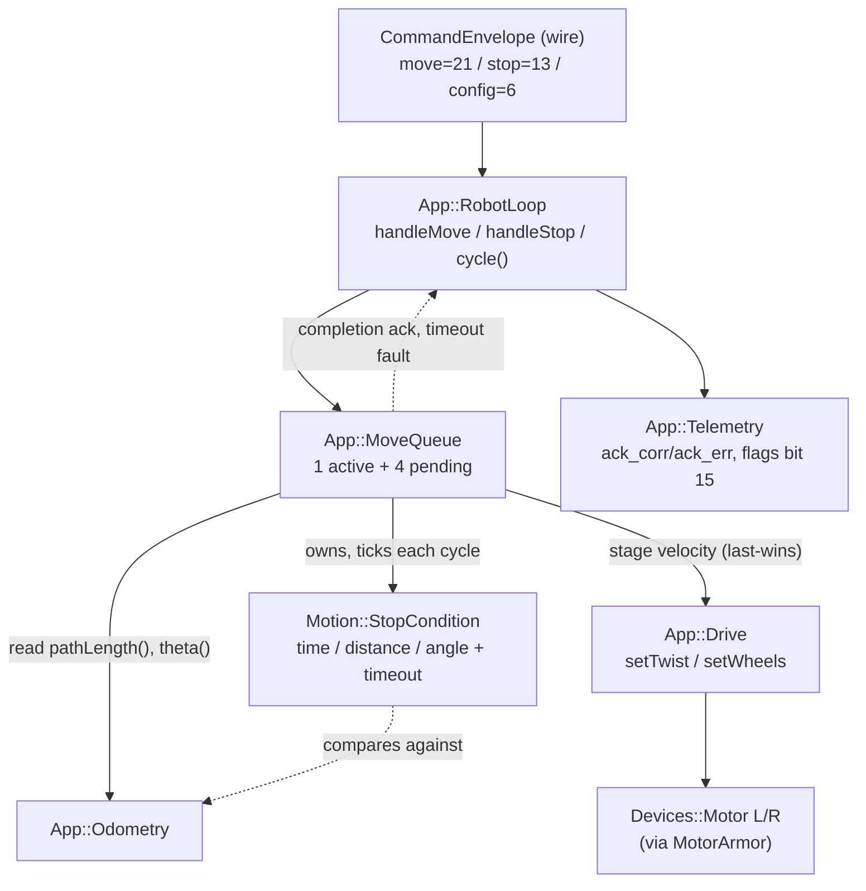

<!-- CLASI: Before changing code or making plans, review the SE process in CLAUDE.md -->

# Sprint 116: MOVE protocol cutover

## Goals

- Cut the command surface over to the bounded **MOVE** protocol per the
  protocol set-point issue: one `Move` command (twist|wheels velocity
  variant + time|distance|angle stop condition + required `timeout`
  backstop + `replace` flag against a 1-active + 4-pending queue) plus
  `STOP` as the immediate halt.
- Delete the legacy `Twist` arm and the `app/deadman.*` module — every
  motion becomes structurally self-bounding (stop condition or timeout),
  which supersedes the deadman rather than needing it alongside MOVE.
  This is sprint 115's deferred piece: S1 kept TWIST+deadman specifically
  so the robot stayed drivable at its own gate.
- Deliver the protocol document itself — the written command-surface
  contract (transport/framing, command table, response semantics, error
  taxonomy) matching the set-point issue — as the minimal firmware's set
  point when this sprint closes.

## Problem

The interim TWIST+deadman surface has two overlapping bounding mechanisms
(a per-command duration vs. a separate deadman lease) and two motion verbs
(a bare TWIST plus a planned, never-shipped, separate Wheels command)
where one bounded MOVE suffices. Host silence today only ends safely
because of the deadman watchdog; there's no queue, no distance/angle stop
condition, and no structural guarantee that a command completes on its
own terms.

## Solution

Add `Move` arm 21 (`MoveTwist{v_x, v_y, omega} | MoveWheels{v_left,
v_right}` velocity oneof + `time|distance|angle` stop oneof + required
`timeout` + `replace` + `id`), a new `Motion::StopCondition` object
(captures its baseline — activation time, odometry path length, odometry
heading — at activation, ticked every cycle) and `App::MoveQueue` (1
active + 4 pending; `replace=true` flushes and preempts; `replace=false`
enqueues, ERR_FULL past 4 pending; completion ack against `Move.id`;
timeout → stop + move-timeout fault flag). Delete `app/deadman.*`, the
`Twist` arm (reserve 19), and the `ConfigDelta.watchdog` arm (reserve 4).
The active MOVE's velocity stages through `Drive` (`setTwist`/`setWheels`,
last-wins) exactly as today — never a direct motor write. Host gets
`NezhaProtocol.move_twist(...)`/`move_wheels(...)`/`stop()`. The written
protocol document ships alongside the code as this sprint's other
deliverable — the converged contract the minimal firmware speaks once
this sprint closes.

## Success Criteria

- Full protocol gate passes on the stand: `HELLO`, `PING` (`t=` present),
  `CONFIG` patch persists across power-cycle, `MOVE` × both velocity
  variants × all three stop conditions, `STOP` — each acked with the
  correct `corr`/`err` via the single ack slot.
- Stop-condition behavior verified: a time MOVE ends on schedule; a
  distance/angle MOVE ends within tolerance of the commanded
  distance/heading change (measured via encoders, on the stand); a
  distance MOVE that cannot progress ends at `timeout` with the
  move-timeout fault flag set.
- Chaining verified: MOVE B (`replace=false`) sent while A runs hands off
  seamlessly at A's expiry; `replace=true` preempts mid-motion; a 5th
  pending MOVE gets `ERR_FULL`; an empty queue's expiry stops motors with
  **zero host traffic** (the no-deadman contract).
- 10-minute soak (≥5-10 Hz alternating MOVEs) clean: no reboot/lockup,
  seq monotonic, drop rate at or better than the sprint-115 baseline.
- The protocol document lands in `docs/` and matches the shipped contract
  exactly (command table, error taxonomy, response semantics).

## Scope

### In Scope

- `envelope.proto`: `Move` arm 21 (fresh; the old arc-Move's 20 stays
  reserved); delete `Twist` → reserve 19; delete `ConfigDelta.watchdog` →
  reserve 4.
- New `Motion::StopCondition` (kind + threshold + activation baselines
  from clock/`App::Odometry`; `tick()` → stop); `App::Odometry` gains a
  `pathLength()` accessor.
- New `App::MoveQueue` (1 active + 4 pending; replace/flush/ERR_FULL
  semantics; completion ack against `Move.id`; owned by `RobotLoop`,
  ticked where the deadman check used to live).
- Deletion of `app/deadman.*`.
- Host: `NezhaProtocol.move_twist(...)`/`move_wheels(...)`/`stop()`;
  `wait_for_ack` unchanged (still single-slot).
- Tests: stop-condition units (time/distance/angle + timeout), queue
  semantics (chain/replace/overflow/drain), robot_loop dispatch tests,
  sim system scenarios (seamless chaining, empty-queue stop).
- The protocol document (transport/framing, command table, response
  semantics, error taxonomy) as a delivered artifact.

### Out of Scope

- Estimator/state-prediction work (sprint 117) — this sprint only
  finishes the command-surface half of the gut; the telemetry frame it
  rides on (flags bit 15 for move-timeout) was already defined in
  sprint 115.
- Any host motion/tour code changes beyond what `protocol.py`'s move_*
  helpers force.
- Arc/segment moves, trajectory profiles, jerk limiting, heading cascade,
  pose-fix injection — explicitly out of the converged protocol per the
  set-point issue; recoverable from the `pre-gut-motion-stack` tag if
  ever needed.

## Test Strategy

`uv run python -m pytest` + sim suite green; `just build-clean`;
`mbdeploy deploy` (hex verified by full UID — robot, not the relay
dongle); then the hardware protocol gate on the stand: round-trip every
command (HELLO/PING/CONFIG/MOVE×variants×stop-conditions/STOP) with
correct acks; stop-condition behavior (time/distance/angle/timeout-fault);
chaining/preemption/overflow/no-deadman-expiry; a ≥10-minute soak at
alternating MOVE rates per the gut protocol's soak gate.

## Architecture

**Substantial** — this sprint deletes one module (`App::Deadman`), adds
two new ones (`Motion::StopCondition`, `App::MoveQueue`), changes the
dependency graph `App::RobotLoop` sits on top of (Deadman out, MoveQueue
+ StopCondition in), extends two existing modules' public interfaces
(`App::Drive::setWheels`, `App::Odometry::pathLength`), and changes the
wire schema (`envelope.proto`: new `Move` arm 21, deleted `Twist` arm,
deleted `ConfigDelta.watchdog` arm) plus its host-side consumer
(`protocol.py`). That is 3+ modules touched, a cross-module dependency
change, and a proto/data-shape change — comfortably past the compact
tier's "one module, no new dependency" ceiling. Full 7-step methodology,
diagram included.

### Architecture Overview

**Step 1 — the problem.** Today `App::RobotLoop` owns exactly one
actuation source (`Twist`, arm 19) and one bounding mechanism
(`App::Deadman`, a re-armed staleness timer): every `handleTwist()` call
stages a twist onto `Drive` and re-arms `deadman_` for `duration`; the
cycle body's own dispatch block (`robot_loop.cpp:477-498`) unconditionally
checks `deadman_.expired()` every cycle and calls `drive_.stop()` when it
has. This sprint replaces that one-shot-command-plus-external-watchdog
shape with **one bounded command**: `Move` carries its own stop condition
(time/distance/angle) AND a required `timeout` backstop, queued 1-active +
4-pending. The watchdog becomes unnecessary because every command is
self-bounding by construction — Eric's binding decision in the
protocol-set-point issue. The architectural question this sprint answers
is not "should we add a queue" (already decided) but **where the
bound-checking logic and the queue-lifecycle logic each belong**, and how
they wire into the one per-cycle schedule `RobotLoop::cycle()` already
owns (`runAndWait`/`sleepUntil`, `robot_loop.cpp:436-523`) without adding
a second, competing timing authority.

**Step 2 — responsibilities.** Seven distinct pieces of work are touched:

1. Decode and validate an inbound `Move` against the wire contract
   (velocity variant present, stop variant present, `timeout > 0`, the
   config-completeness gate) — stays `RobotLoop`'s own dispatch
   responsibility, the same altitude `handleTwist`/`handleConfig`/
   `handleStop` already occupy; not a new module.
2. Hold the 1-active+4-pending queue; apply `replace`/enqueue semantics;
   produce `ERR_FULL`; decide when to advance from the active `Move` to
   the next pending one — **new**, own responsibility.
3. Decide, every cycle, whether the currently-active `Move`'s stop
   condition or timeout has been met — **new**, a distinct responsibility
   from (2): (2) is queue bookkeeping, (3) is a pure comparison against a
   baseline. Splitting them keeps each independently testable (queue
   chain/replace/overflow vs. time/distance/angle/timeout math).
4. Stage the active `Move`'s velocity onto the two wheel leaves, whichever
   variant (twist or wheels) it is — extends `App::Drive`'s existing
   "convert an intent into wheel duty" responsibility; not a new module.
5. Supply the cumulative traveled-path measurement the distance stop
   condition needs — extends `App::Odometry`'s existing "integrate wheel
   motion into a pose estimate" responsibility; not a new module.
6. Report command outcomes (enqueue ack, completion ack against `Move.id`,
   the move-timeout fault bit) over the wire — `App::Telemetry`'s existing
   `ack()`/`setFlag()` interface, unchanged shape, new caller.
7. Document the converged wire contract — a docs artifact, not code.

**Step 3 — subsystems and modules.**

- **`App::MoveQueue`** (new, `src/firm/app/move_queue.{h,cpp}`). Purpose:
  owns the lifecycle of the robot's queued and active bounded motions.
  Boundary: inside — the 5-slot array, replace/flush/enqueue/`ERR_FULL`
  bookkeeping, advancing active→next-pending on stop/timeout, owning and
  driving one `Motion::StopCondition` for whichever `Move` is active;
  outside — deciding what a *valid* `Move` looks like (`RobotLoop::
  handleMove`'s job), how a velocity variant becomes wheel duty (`Drive`'s
  job), what "traveled far enough" means numerically (`StopCondition` +
  `Odometry`'s job). Constructor dependencies: `Drive&`, `Odometry&`,
  `const Devices::Clock&` — the same three collaborators `Deadman`
  (clock only) and `RobotLoop` (drive+odom, already) depend on today; no
  new dependency direction. Serves SUC-050, SUC-051, SUC-052, SUC-054,
  SUC-055.
- **`Motion::StopCondition`** (new, `src/firm/motion/stop_condition.{h,cpp}`
  — recreates a `motion/` directory containing only this one file plus its
  `DESIGN.md`, mirroring `kinematics/`'s existing small-pure-computation
  pattern; S1 deleted the *old* `motion/` wholesale, this is a fresh,
  much smaller directory, not a partial restoration). Purpose: reports
  whether one bounded motion's stop condition or timeout has been met.
  Boundary: inside — kind (TIME/DISTANCE/ANGLE) + threshold + the
  activation-time baselines (clock time, `Odometry::pathLength()`,
  `Odometry::theta()`) + the per-cycle comparison; outside — what happens
  when it reports true (`MoveQueue`'s job), where the readings it compares
  against come from (passed into `tick()`, never owned). No dependency on
  `MoveQueue`, `Drive`, or the wire types — pure comparison logic, testable
  standalone with hand-fed numbers, the same shape `BodyKinematics`
  already established for pure math in this tree. Serves SUC-050,
  SUC-051, SUC-052, SUC-054.
- **`App::Drive`** (extended, not new). Purpose unchanged: converts the
  active motion's velocity target into per-wheel duty. Boundary
  widens by exactly one staging path: `setWheels(v_left, v_right)`
  alongside the existing `setTwist(v_x, v_y, omega)` — last-wins between
  whichever was staged most recently, `tick()` computes from whichever
  path is live, `stop()` clears both to zero. Serves SUC-050, SUC-051.
- **`App::Odometry`** (extended, not new). Purpose unchanged: integrates
  wheel motion into a world-pose (and now also a cumulative-path)
  estimate. Boundary widens by one read-only accessor: `pathLength()`
  — `integrate()` already computes this cycle's `|distance|` internally
  (`odometry.cpp:24-26`, currently discarded after feeding `x_`/`y_`); it
  now also accumulates into a running total. `theta()` already exists and
  is verified UNWRAPPED (`theta_ += headingDelta`, no modulo anywhere in
  `odometry.cpp`) — the angle stop condition needs no new accessor and no
  wrap handling, it diffs `theta()` against its own activation-time
  baseline directly. Serves SUC-051, SUC-052.
- **`App::Deadman`** — **deleted** (`app/deadman.{h,cpp}`, both test
  harnesses, all construction-site wiring). Superseded structurally: every
  `Move` bounds itself (stop condition or `timeout`), so the "host went
  silent, stop the robot" property that `Deadman::expired()` used to
  provide is now an emergent consequence of `MoveQueue::tick()` running
  every cycle unconditionally and draining to `Drive::stop()` on an empty
  queue — not a second, independent staleness timer alongside the queue.

**Step 4 — diagram.** Component/dependency view (new composition — 6
nodes, a genuine cross-module dependency change from today's
Deadman-based graph, so this is squarely the "include it" case, not the
sprint-020 "nothing new is being composed" exception):

Dependency direction stays consistent with the project's existing
[Presentation/API] → [Domain] → [Infrastructure] convention:
`RobotLoop` (wire dispatch, the "API" layer for this boundary) →
`MoveQueue` (motion-lifecycle domain logic) → `{Drive, Odometry,
StopCondition}` (kinematics/pose domain logic) → `Devices::Motor`/
`Devices::Clock` (infrastructure). No cycle: nothing downstream of
`MoveQueue` depends back on it. Fan-out of `MoveQueue` is 3 (`Drive`,
`Odometry`, `Devices::Clock`) plus an owned (not injected) `StopCondition`
— within the 4-5 guidance.

No ERD: no persisted or relational data model changes. Verified against
`config/persisted_tuning.{h,cpp}` directly — neither the `Twist.duration`
field nor `ConfigDelta.watchdog` was ever part of `Config::TuningSnapshot`
(only motor gains/travel-calib and OTOS calibration are persisted), so
deleting both wire fields touches zero persisted bytes and needs no
schema-version bump (`kConfigSchemaVersion` stays at the value 115 set).

**Step 5 — What Changed / Why / Impact / Migration** below. **Step 6 —
Design Rationale** below. **Step 7 — Open Questions** below.

### What Changed

- `envelope.proto`: new `message Move` (`MoveTwist | MoveWheels` velocity
  oneof, `time | distance | angle` stop oneof, required `timeout`,
  `replace`, `id`) at fresh arm number **21** on `CommandEnvelope.cmd`;
  `Twist` (arm 19) deleted, folded into the `reserved` list; `ConfigDelta.
  watchdog` (field 4) deleted, folded into `reserved`  (`ConfigTarget.
  CONFIG_WATCHDOG` enum value left declared-unused, same precedent
  `CONFIG_PLANNER` already set in this file after 115). `python build.py`
  regenerates `msg::Move`/`msg::MoveTwist`/`msg::MoveWheels` and the
  `Comms`/`wire.h` codec from the edited protos — no hand-written codec
  changes.
- New `Motion::StopCondition` (`src/firm/motion/stop_condition.{h,cpp}` +
  `DESIGN.md`) and `App::MoveQueue` (`src/firm/app/move_queue.{h,cpp}` +
  `DESIGN.md`) — see Step 3 above for each module's purpose/boundary.
- `App::Drive` gains `setWheels(v_left, v_right)`; `App::Odometry` gains
  `pathLength()`.
- `App::Deadman` deleted (`app/deadman.{h,cpp}`); every construction site
  (`main.cpp`, `src/sim/sim_harness.h`) drops its `Deadman` instance and
  wires an `App::MoveQueue` instance into `RobotLoop`'s constructor
  instead.
- `App::RobotLoop`: `handleTwist()` replaced by `handleMove()` (same
  config-completeness gate, now validating a `Move`'s shape instead of a
  bare twist, then delegating to `moveQueue_.enqueue()`); `handleStop()`
  now also flushes `moveQueue_`; the cycle body's per-cycle, unconditional
  `deadman_.expired()` branch (`robot_loop.cpp:485-497`) is replaced by an
  unconditional `moveQueue_.tick(now, odom_)` call at the same schedule
  position; `frame_.mode`/`driving_` now derive from `moveQueue_.
  active()` instead of a hand-toggled bool; `kFlagFaultMoveTimeout`
  (already declared since 115, unwired) gets its first live `setFlag()`
  call.
- Host `protocol.py`: `NezhaProtocol.move_twist(...)`/`move_wheels(...)`
  added; `twist()` deleted (its wire arm is gone); `_DRIVE_MODE_CHAR`
  gains the missing `VELOCITY` entry (115 handoff item — mode was
  decoding as `"I"` while driving); `sTimeout`/`watchdog` removed from
  `config()`/`set_config()`'s curated key vocabulary (`_ALL_SET_KEYS`,
  its wire arm is gone) — same "no longer a valid key" treatment 115 gave
  the five deleted planner keys.
- `docs/protocol-v4.md` (new): the converged command-surface contract —
  transport/framing, command table, `Move` message shape, response
  semantics, error taxonomy — matching the set-point issue. `docs/
  protocol-v2.md` and `docs/protocol-v3.md` gain a superseded banner
  pointing at v4 (kept, not deleted — historical record of what shipped
  when).

### Why

The interim surface had two overlapping bounding mechanisms (a
per-command `duration` vs. a separate `Deadman` lease) and two motion
verbs where the protocol set-point issue calls for one. Collapsing onto a
single bounded `Move` makes "host silence always ends in stopped motors"
a structural property of every command instead of a property enforced by
a second, independently-timed watchdog module — one less moving part,
one less place the two mechanisms could disagree (e.g. a `duration` long
enough to outlive its own deadman lease was already possible before this
sprint). It also finally gives the host a queue and real stop conditions
(distance/angle measured from odometry), neither of which the bare
`Twist` arm could express at all.

### Impact on Existing Components

- **`App::RobotLoop`**: constructor signature changes (`Deadman&` param
  removed, `MoveQueue&` param added); every construction site updates
  together (see Migration Concerns).
- **`App::Drive`**: additive only — `setTwist()`/`stop()`/`tick()`
  signatures and behavior for existing callers are unchanged; `setWheels`
  is a new, independent entry point.
- **`App::Odometry`**: additive only — `integrate()`'s existing outputs
  (`x()`/`y()`/`theta()`) are unchanged; `pathLength()` is a new,
  independent accessor fed by a value `integrate()` already computes
  internally.
- **`App::Telemetry`**: no interface change. `kFlagFaultMoveTimeout` (bit
  15) has existed, declared-only, since 115; this sprint is its first
  live caller.
- **`Devices::MotorArmor`/wedge-latch policy**: unaffected. `MoveQueue`
  never touches a motor directly — it only ever stages through `Drive`,
  which only ever calls `setVelocity()` on the two `Devices::Motor&`
  references it was constructed with (armored in real firmware, bare in
  sim, exactly as today). The armor decorator sits below `Drive` and has
  no visibility into whether the velocity it's asked to hold came from a
  `Twist` or a `Move` — nothing about this sprint's change reaches that
  boundary.
- **CONFIG-mid-MOVE**: verified non-interaction, not just asserted.
  `RobotLoop::handleConfig()` (`robot_loop.cpp:222-275`) only ever touches
  `motorL_`/`motorR_`/`otos_`/`persistedTuning_` — it has no reference to
  `drive_`, `moveQueue_`, or `odom_` and never will need one (CONFIG
  patches motor gains and OTOS calibration, not motion targets). A
  `ConfigDelta` arriving mid-`Move` is therefore structurally incapable of
  disturbing the active motion's staged velocity or its `StopCondition`
  baseline — this is a property of the existing module boundary, not new
  code this sprint adds. Ticket coverage still asserts it with an explicit
  test (SUC-055) so the invariant is pinned down, not just argued.
- **Wire size budget**: `Move`'s worst-case encoded size needs
  re-measurement against `kMaxEnvelopeBytes` (`comms.h:79-89`, currently
  115 bytes for `CommandEnvelope`) once `gen_messages.py` regenerates —
  `Move` is a larger message than `Twist` (two nested oneofs + `id`), so
  ticket 001 must re-check the generated
  `kCommandEnvelopeMaxEncodedSize` constant and confirm the 256-byte
  `kArmoredBufSize` still has headroom (it does not automatically follow
  from 115's telemetry-side budget check, which was a different
  direction of traffic).

### Design Rationale

**Decision 1: `MoveQueue` owns and drives its own `StopCondition`,
rather than `RobotLoop` holding both as co-equal siblings.**
Context: the protocol issue leaves the split open ("new, tiny ... or
folded into the queue module"). Alternatives considered: (a) `RobotLoop`
owns a `StopCondition` directly and a separate, dumber `MoveQueue` that
only stores slots; (b) `MoveQueue` owns and internally drives one
`StopCondition` per its own active slot, exposing a single `tick()` to
`RobotLoop`. Why (b): matches the cohesion test — "manage the lifecycle of
queued/active bounded motions" already includes deciding when the active
one ends; splitting that decision out to `RobotLoop` would mean
`RobotLoop` reaching into `StopCondition` internals to decide whether to
tell `MoveQueue` to advance, which is feature envy on `MoveQueue`'s own
domain. Consequences: `RobotLoop::cycle()`'s dispatch block shrinks to one
call (`moveQueue_.tick(now, odom_)`), mirroring today's
`deadman_.expired()` one-liner almost exactly — the cycle body's shape is
barely disturbed even though what's behind the call changed completely.

**Decision 2: `Motion::StopCondition` is a separate module in a
recreated `motion/` directory, not a private helper folded into
`move_queue.cpp`.** Context: same either/or the issue leaves open.
Alternatives: (a) a private struct inside `move_queue.cpp`; (b) its own
small module, mirroring `kinematics/`'s existing pattern (pure functions/
structs, no I2C, no owned state beyond what's passed in, independently
unit-testable). Why (b): the three stop-condition kinds plus the timeout
backstop are exactly the kind of bounded, pure-comparison logic this tree
already keeps separate from stateful orchestration (see
`BodyKinematics`) — testing "does a DISTANCE condition fire at the right
threshold" should not require standing up `MoveQueue`'s enqueue/replace/
`ERR_FULL` machinery in the test fixture. Consequences: one more (small)
CMake-globbed directory and `DESIGN.md`; in exchange, the safety-critical
bound math is testable in total isolation from queue-management bugs, and
a future stop-condition kind (there will likely be more) has an obvious
home that isn't `MoveQueue`.

**Decision 3: `Drive::setWheels()` is a second, independent staging path,
not a translation into an equivalent twist via
`BodyKinematics::forward()`.** Context: on a differential base, any
`(v_left, v_right)` pair maps losslessly to exactly one `(v, omega)` body
twist, so translating `MoveWheels` into a `setTwist()` call was a live
option. Alternatives: (a) `MoveQueue` (or `RobotLoop`) converts
`MoveWheels` to a twist via `forward()` and reuses the single existing
`setTwist()` path; (b) `Drive` grows a second, symmetric staging path.
Why (b): `v_y` already rides `MoveTwist` wire-forward "for a future
holonomic base" (115's own documented rationale) — the wire's
twist-vs-wheels oneof exists specifically because a future non-
differential base's wheel speeds will NOT always correspond to one body
twist. Implementing `MoveWheels` as "secretly always a twist" today would
be the wrong direction to grow into that future: the honest
implementation of "the host already told us the wheel speeds it wants" is
to stage them directly, once, now, rather than force every wheels-variant
caller through a forward/inverse round trip that buys nothing on today's
differential base and would need un-doing later. Consequences: `Drive`
carries two staging paths instead of one, with a small last-wins flag
(whichever of `setTwist`/`setWheels` was called most recently is what
`tick()` computes from); `stop()` clears both regardless of which was
staged.

**Decision 4: the config-completeness gate (`ERR_NOT_CONFIGURED`) stays
at `RobotLoop::handleMove()`, matching `handleTwist()`'s existing
position, rather than moving into `MoveQueue::enqueue()`.** Context:
114-001 already built this fail-closed gate once, at the dispatch level,
for the single `TWIST` arm; `handleStop`/`handleConfig` stay unconditional
(existing asymmetry, unchanged). Alternatives: gate inside `MoveQueue`
instead, so any future second caller of `enqueue()` inherits the check
for free. Why keep it at dispatch level: there is no second caller today,
and moving the gate into `MoveQueue` would force it to know about a
composition-root-lifecycle concern (`configured_`) that has nothing to do
with queue management, widening its interface for a hypothetical.
Consequences: `MoveQueue` never needs to know a composition root can be
"unconfigured" at all — every `Move` `MoveQueue::enqueue()` ever sees is
already permitted, keeping its own interface narrower and its own tests
free of a configuration-gate dimension.

### Migration Concerns

- **Wire compat break, by design** — same posture the project has taken
  for every prior wire-shape change (095-100, 102, 115): `CommandEnvelope`
  arm 19 (`Twist`) and `ConfigDelta` arm 4 (`watchdog`) are `reserved`,
  not reused; any host build not regenerated from this sprint's protos
  cannot speak to post-cutover firmware (and vice versa) — firmware and
  host redeploy together, verified by the bench-gate ticket's own
  hex-by-UID + regenerated-`pb2` check, the same discipline 115 already
  established.
- **No data migration** — verified directly against `persisted_tuning.
  {h,cpp}`: neither `Twist.duration` nor `ConfigDelta.watchdog` was ever
  part of `Config::TuningSnapshot`. `kConfigSchemaVersion` does not bump;
  no wipe, no re-pick, no one-time bench side effect (unlike 115's own
  blob-layout change).
- **Deployment sequencing** — one coherent unit, same shape as 115's S1:
  no intermediate state where only half the cutover has landed should be
  merged to the sprint branch's own history in a way that leaves
  `handleTwist`/`handleMove` both partially present — ticket 006 (the
  `RobotLoop`/composition-root cutover) is the single ticket where the
  old and new dispatch paths cross over, and it depends on every module
  ticket ahead of it being complete first (see Tickets table).
  Independent verifiability per ticket (proto, `StopCondition`,
  `Odometry.pathLength`, `Drive.setWheels`, `MoveQueue`) is achieved by
  each of those being additive/standalone; only ticket 006 actually flips
  the switch.
- **Hardware presence at execution time is unknown** — the final ticket
  is structured to produce a real protocol gate if the robot is connected
  on the stand, or a full sim dry-run (the sim runs the real firmware
  through `SimPlant`, so every MOVE-protocol scenario — stop conditions,
  chaining, replace, overflow, no-deadman drain, timeout fault — is a
  hard, sim-executable acceptance criterion regardless of hardware
  presence) plus a written bench checklist for whenever hardware becomes
  available, matching 115's own `docs/bench-checklists/` precedent.

### Open Questions

1. **Full `ERR_BADARG` validation surface for a malformed `Move`.** The
   set-point issue explicitly names "missing/nonpositive timeout, no
   velocity variant" as `ERR_BADARG` triggers, but doesn't fully enumerate
   every malformed-stop-value case — e.g. is a zero-magnitude `distance`
   or `angle` threshold valid (a legitimate "stop immediately" idiom,
   symmetric with a very small `time`), or should it be rejected the same
   way a non-positive `timeout` is? Recommend mirroring `timeout`'s own
   "`> 0` required" rule for `distance`/`angle` (reject `<= 0`) unless
   `time` genuinely needs `>= 0` to allow a deliberate one-cycle no-op —
   ticket 002's own unit tests should pin down and document whichever
   convention is chosen, not leave it ambiguous at runtime. Flagged, not
   silently resolved.
2. **Completion-ack policy for a `Move` flushed while still pending.** The
   set-point issue specifies a completion ack "against `Move.id`" for a
   `Move` that activates and then meets its stop condition or times out —
   but says nothing about a `Move` that was enqueued (and acked at
   enqueue time), then flushed by a later `replace=true` before it ever
   activated. Recommend: no completion ack for a flushed-while-pending
   `Move` (the host already knows — it's the one that sent the
   `replace=true`); only an activated-then-ended `Move` gets a completion
   ack. Ticket 005's own queue tests should assert whichever convention is
   chosen explicitly, so this isn't left as untested, implicit behavior.

## Use Cases

### SUC-050: Command a bounded MOVE (twist or wheels velocity, time/distance/angle stop)
Parent: UC-001 (extends toward UC-002 "timed duration" and UC-003 "specific distance" — MOVE unifies what those two text-protocol commands did separately, plus a new angle stop condition neither covered)

- **Actor**: Python host
- **Preconditions**: Robot firmware running, connection established, composition root configured (`isConfigured()` true).
- **Main Flow**:
  1. Host sends `CommandEnvelope{move: Move{velocity: MoveTwist|MoveWheels, stop: time|distance|angle, timeout, replace, id}}`.
  2. `RobotLoop::handleMove()` validates shape (velocity variant present, stop variant present, `timeout > 0`) and the config-completeness gate; acks the envelope's `corr_id` via the single ack slot.
  3. `MoveQueue::enqueue()` stages the velocity through `Drive` (`setTwist`/`setWheels`) and captures the `StopCondition` baseline (activation time; `Odometry::pathLength()`; `Odometry::theta()`).
  4. Every cycle, `MoveQueue::tick()` advances `StopCondition` against the current clock/odometry reading.
  5. When the stop condition (or `timeout`) is met, the queue emits a completion ack against `Move.id` and, if the queue is now empty, calls `Drive::stop()`.
- **Postconditions**: For a TIME stop, elapsed time at completion ≈ commanded `time`. For a DISTANCE/ANGLE stop, `|pathLength() - baseline|`/`|theta() - baseline|` at completion is within tolerance of the commanded threshold.
- **Acceptance Criteria**:
  - [ ] A `MoveTwist` + TIME MOVE ends within one cycle period of the commanded `time`.
  - [ ] A `MoveWheels` + DISTANCE MOVE ends within tolerance of the commanded distance, measured via `Odometry::pathLength()`.
  - [ ] An ANGLE MOVE ends within tolerance of the commanded heading change, measured via unwrapped `Odometry::theta()`.
  - [ ] A `Move` with a missing velocity variant, missing stop variant, or non-positive `timeout` is rejected `ERR_BADARG` and never reaches the queue.
  - [ ] A `Move` sent before `isConfigured()` is refused `ERR_NOT_CONFIGURED`.

### SUC-051: MOVE chaining and replace against the 1-active+4-pending queue
Parent: UC-001

- **Actor**: Python host
- **Preconditions**: A MOVE is active (or the queue is empty).
- **Main Flow**:
  1. Host sends MOVE B with `replace=false` while MOVE A is active — B enqueues behind A.
  2. When A's stop condition/timeout fires, the queue activates B on the SAME cycle (seamless hand-off, no intervening zero-velocity cycle).
  3. Host sends MOVE C with `replace=true` while some MOVE is active — the queue flushes every pending slot and preempts the active one immediately; C starts this cycle.
- **Postconditions**: Exactly one MOVE is active (or none, if the queue drains empty); no motion gap between A's completion and B's activation in the chained case.
- **Acceptance Criteria**:
  - [ ] `replace=false` enqueues without disturbing the currently active MOVE.
  - [ ] Chained hand-off from A to B produces no intervening cycle with zero commanded velocity.
  - [ ] `replace=true` flushes all pending slots and preempts the active MOVE on the same cycle it arrives.

### SUC-052: A 5th pending MOVE is refused with ERR_FULL
Parent: UC-001

- **Actor**: Python host
- **Preconditions**: One MOVE active, 4 MOVEs already pending (queue at capacity).
- **Main Flow**:
  1. Host sends a 6th MOVE (5th pending) with `replace=false`.
  2. `MoveQueue::enqueue()` rejects it; `RobotLoop` acks `ERR_FULL`.
- **Postconditions**: The queue's existing 1 active + 4 pending contents are completely undisturbed by the rejected command.
- **Acceptance Criteria**:
  - [ ] A 5th pending enqueue attempt is acked `ERR_FULL` and dropped.
  - [ ] The 4 already-pending MOVEs and the active MOVE are unchanged after the rejection (byte-for-byte, not just "still 4 pending").

### SUC-053: Host silence after a MOVE's stop/timeout leaves motors neutral — no deadman needed
Parent: UC-004

- **Actor**: Python host (by its absence)
- **Preconditions**: A MOVE is active; the host sends nothing further.
- **Main Flow**:
  1. The active MOVE's stop condition or `timeout` fires.
  2. The queue is empty (nothing pending).
  3. `MoveQueue::tick()` calls `Drive::stop()`; both wheel velocity targets go to zero.
  4. No further host traffic arrives, and none is required for the robot to stay stopped.
- **Postconditions**: Motors remain at zero velocity indefinitely with zero host traffic — this is a structural property of every MOVE being self-bounded, not a watchdog timer's decision.
- **Acceptance Criteria**:
  - [ ] An empty-queue MOVE expiry stops motors within one cycle, with zero commands sent by the host after the expiring MOVE.
  - [ ] No `App::Deadman` class exists anywhere in the tree after this sprint (`app/deadman.h`/`.cpp` and both test harnesses deleted).

### SUC-054: A stalled MOVE ends at timeout with the move-timeout fault flag set
Parent: UC-004

- **Actor**: Python host / firmware safety backstop
- **Preconditions**: A DISTANCE or ANGLE MOVE is active whose stop condition cannot be reached (e.g. wheels physically stalled/wedged).
- **Main Flow**:
  1. `StopCondition::tick()` never reports the kind-specific condition met.
  2. Elapsed time since activation reaches `timeout`.
  3. The queue treats this as an ended command: completion ack against `Move.id` carries a nonzero outcome, and `Telemetry` flags bit 15 (`kFlagFaultMoveTimeout`) is set on that cycle.
  4. Motors stop (empty queue) or the next pending MOVE activates (non-empty queue) — timeout ends the current command the same way stop-condition-met does.
- **Postconditions**: The host can distinguish "ended because the stop condition was met" from "ended because it timed out" via the fault flag.
- **Acceptance Criteria**:
  - [ ] A DISTANCE MOVE with a threshold the robot cannot physically reach within `timeout` ends at `timeout`, not before, not after.
  - [ ] `kFlagFaultMoveTimeout` (bit 15) is set on the ending cycle and clears (or is not re-set) on the next cycle absent a further timeout.

### SUC-055: A CONFIG patch during an in-flight MOVE does not disturb it
Parent: UC-014

- **Actor**: Python host
- **Preconditions**: A MOVE is active.
- **Main Flow**:
  1. Host sends a `ConfigDelta` (motor gains or OTOS calibration) while the MOVE is active.
  2. `RobotLoop::handleConfig()` applies the patch to `motorL_`/`motorR_`/`otos_` and acks it, exactly as it does with no MOVE active.
  3. The active MOVE's staged velocity and its `StopCondition` baseline are untouched.
- **Postconditions**: The MOVE completes (or continues) exactly as if no CONFIG patch had arrived.
- **Acceptance Criteria**:
  - [ ] A CONFIG patch applied mid-MOVE does not change the active MOVE's completion time/distance/angle outcome.
  - [ ] The CONFIG patch's own ack is unaffected by a MOVE being active (still acked OK on the same cycle it's decoded).

## GitHub Issues

(GitHub issues linked to this sprint's tickets. Format: `owner/repo#N`.)

## Definition of Ready

Before tickets can be created, all of the following must be true:

- [ ] Sprint planning document is complete (sprint.md, including its
      Architecture and Use Cases sections)
- [ ] Architecture review passed (or skipped, for changes with no
      architectural impact)
- [ ] Stakeholder has approved the sprint plan

## Design Overlay

This sprint opted into the persistent per-subsystem design-doc set
(bootstrapped 2026-07-21, commit `3428fdd1`) after this sprint's detail
planning and ticketing were already complete. The overlay was seeded and
edited on `master` — before `acquire_execution_lock` branches the sprint
off it, per `seed_sprint_design_overlay`'s own "runs on main" contract —
in `clasi/sprints/116-move-protocol-cutover/design/`.

**Overlaid** (seeded pristine, edited in place to describe the post-116
design, diffed, and committed on `master`):
- `docs/design/design.md` (system doc) — command-surface description
  (MOVE/CONFIG/STOP replacing TWIST/CONFIG/STOP+deadman), subsystem map
  (new `motion/` row), dispatch flow, the deadman-removal invariant, the
  wire-boundary oneof.
- `src/firm/app/DESIGN.md` (co-located) — `MoveQueue`/`StopCondition`
  ownership, `App::Deadman` deletion, command dispatch,
  `Drive::setWheels`/`Odometry::pathLength`, `kFlagFaultMoveTimeout`
  wiring, and `kFlagEventDeadmanExpired` (bit 10)'s orphaning now that its
  producer is deleted.

**Not overlaid — edited directly on the canonical doc during execution,
by the ticket that owns the change.** The overlay mechanism seeds and
diffs a *flat* `design/` directory keyed only by filename, and every
co-located subsystem doc is named `DESIGN.md` — so at most one
subsystem-level `DESIGN.md` can occupy a sprint's overlay directory
without a silent copy-over collision (confirmed by reading
`clasi.design.overlay.seed_and_commit`: it writes each seeded file to
`design/<canonical_path.name>`, and every subsystem doc's `.name` is the
same string). `app/DESIGN.md` above is this sprint's one such slot;
`src/firm/messages/DESIGN.md` and `src/host/robot_radio/DESIGN.md` also
change this sprint but cannot share that slot, so they are edited
directly at their canonical path instead, same as any other source
change on the sprint branch:
- `src/firm/messages/DESIGN.md` — envelope arms table (`Move` at 21,
  `Twist`/`ConfigDelta.watchdog` reserved) and size figures. Owner:
  ticket 001 (own acceptance criterion added).
- `src/host/robot_radio/DESIGN.md` — live-surface flip (`twist()` →
  `move_twist()`/`move_wheels()`). Owner: ticket 007 (own acceptance
  criterion added).
- `src/firm/motion/DESIGN.md` (**new** — no canonical doc exists yet to
  seed an overlay from; `motion/` was deleted by sprint 115 and is
  recreated fresh by this sprint). Owner: ticket 002, which already
  carries "`src/firm/motion/DESIGN.md` written, matching the boundary
  description above" as an acceptance criterion.

At sprint close, `overlay.apply()` copies the two overlaid files above
onto their canonical targets; the three directly-edited docs are already
at their canonical location by then and need no apply step.

## Tickets

| # | Title | Depends On | Issue(s) |
|---|-------|------------|----------|
| 001 | `envelope.proto` MOVE arm cutover — `Move`/`MoveTwist`/`MoveWheels` (arm 21), delete `Twist` (reserve 19), delete `ConfigDelta.watchdog` (reserve 4); regenerate via `build.py`; re-measure `kMaxEnvelopeBytes`; update `wire_test_codec.h` armor helpers | — | protocol-set-point, gut |
| 002 | `Motion::StopCondition` — new module (`src/firm/motion/stop_condition.{h,cpp}` + `DESIGN.md`): time/distance/angle kinds + timeout backstop, activation baselines, `tick()`; unit tests for all 4 outcomes | 001 | protocol-set-point |
| 003 | `App::Odometry::pathLength()` — cumulative `\|distance\|` accumulator fed by `integrate()`'s existing per-cycle value; unit tests (straight travel, in-place turn ≈0 contribution, reverse travel still positive) | — | protocol-set-point |
| 004 | `App::Drive::setWheels()` — second staging path alongside `setTwist()`, last-wins, `stop()` clears both; unit tests | — | protocol-set-point |
| 005 | `App::MoveQueue` — new module (`src/firm/app/move_queue.{h,cpp}` + `DESIGN.md`): 1-active+4-pending array, enqueue/replace/flush/`ERR_FULL`, owns and drives one `StopCondition`, completion ack against `Move.id`, timeout→fault; unit tests for chain/replace/overflow/drain | 001, 002, 003, 004 | protocol-set-point, gut |
| 006 | `RobotLoop`/composition-root MOVE cutover — delete `app/deadman.{h,cpp}` + both test harnesses; `handleMove()` replaces `handleTwist()`; `handleStop()` flushes the queue; per-cycle unconditional `moveQueue_.tick()`; wire `kFlagFaultMoveTimeout`; update `main.cpp` and `src/sim/sim_harness.h` wiring (`injectMove` replacing `injectTwist`); `app_robot_loop` test sweep including the SUC-055 CONFIG-mid-MOVE non-interaction test | 001, 002, 003, 004, 005 | protocol-set-point, gut |
| 007 | Host `protocol.py` MOVE cutover — `move_twist()`/`move_wheels()` builders; delete `twist()`; fix `_DRIVE_MODE_CHAR` (add `VELOCITY`, 115 handoff item); remove `sTimeout`/`watchdog` from `config()`/`set_config()`'s key vocabulary; update/delete the now-invalid tests (`test_twist_stop_ack_matcher.py`, watchdog cases in `test_protocol_config.py`/`test_protocol_binary_client.py`); port the bench scripts ticket 010's gate depends on (`twist_drive.py` or equivalent) to `move_twist`/`move_wheels` | 001 | protocol-set-point, gut |
| 008 | Sim system tests for the MOVE protocol — new `src/tests/sim/system/test_move_protocol.py` (+ harness): stop-condition kinds, chaining/replace/overflow, empty-queue drain with zero host traffic, timeout fault, CONFIG-mid-MOVE | 006 | protocol-set-point |
| 009 | Protocol document — `docs/protocol-v4.md` (transport/framing, command table, `Move` shape, response semantics, error taxonomy, matching the set-point issue exactly as shipped); supersession banners on `docs/protocol-v2.md`/`docs/protocol-v3.md` | 006, 007 | gut, protocol-set-point |
| 010 | Full sweep + bench gate — `uv run python -m pytest` + sim suite green; `python build.py` clean; if hardware present: `just build-clean` + `mbdeploy deploy` (hex by full UID) + the real protocol gate (HELLO/PING/CONFIG-persist/MOVE×variants×stop-conditions/STOP, chaining/replace/`ERR_FULL`/timeout-fault, ≥10-min soak); if absent: `docs/bench-checklists/sprint-116-move-protocol.md` + full sim dry-run of the same scenarios | 006, 007, 008, 009 | gut, protocol-set-point |

Tickets execute serially in the order listed (001-004 have no
inter-dependency and could run in parallel if the sprint opts into
worktree execution; 005 needs all four; 006 is the integration point;
007 only needs the regenerated protos from 001; 008-010 need the
cutover complete).
