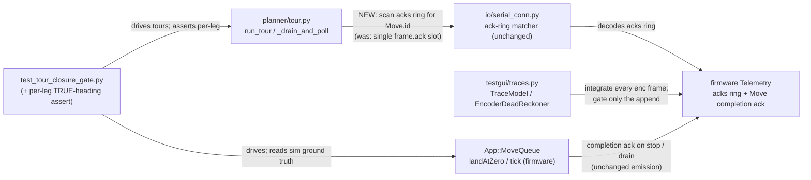

<!-- CLASI: Before changing code or making plans, review the SE process in CLAUDE.md -->

# Sprint 121: Tour completion, trace fidelity & land-at-zero boundaries

## Goals

Three defects, surfaced by the 2026-07-22 turn-execution review and the
sprint-120 bench session, that together keep a tour from executing cleanly and
being trusted when it does:

1. **Tours hang on the final leg.** A tour executes every leg but the last,
   then sits idle until the operator presses STOP, which retires the final
   leg. The final `Move`'s completion is not being recognized on its own.
2. **The encoder dead-reckoned trace/telemetry reads systematically short.**
   `encpose` runs ~10 deg short per 360 deg because the host dead-reckoner is
   frozen the instant a motion's `active` flag drops — it never ingests the
   motion tail. Display-only, but it makes the encoder trace look like a sensor
   disagreement that does not exist.
3. **Orthogonal chain boundaries add unwanted rotation.** Every straight
   following a turn gains ~+2.9 deg (TOUR_1 net +17.9 deg over 540 commanded)
   because a chained turn completes on the loosened chain margin with residual
   omega that decays into the next Move. Per the stakeholder decision, the
   ending axis must LAND AT ZERO at orthogonal boundaries.

This sprint is Sim-testable throughout; the firmware control change (defect 3)
additionally carries the standing hardware-bench verification gate
(`.claude/rules/hardware-bench-testing.md`).

## Problem

### Defect 1 — final-leg hang (tour-1-final-leg-completes-only-on-stop.md)

The tour runner (`run_tour()`, `src/host/robot_radio/planner/tour.py`) drives
one `Move` per leg with one-leg lookahead and ends each leg on that `Move`'s
own COMPLETION ack (`frame.ack.corr_id == Move.id`, `docs/protocol-v4.md`
§7.2). The filed issue offered a LEAD (sprint 120-001 replaced the single
telemetry ack slot with a bounded ack ring; the host may not recognize the
final completion ack from the new ring), explicitly labelled "a lead, not a
diagnosis — do not assume it before reproducing."

**What planning-time static analysis actually found (to be confirmed by the
ticket's reproduction step, NOT assumed):** the tour runner's completion-ack
consumer, `tour.py::_drain_and_poll()`, reads only the single scalar
"freshest ack" slot (`frame.ack`, valid only on the one frame whose `flags`
bit 5 / `ack_fresh` is set). It was NOT updated when 120-001 added the
depth-4 ack ring. `NezhaProtocol.wait_for_ack()` / `SerialConnection.
wait_for_ack()` WERE made ring-aware by 120-001 (they scan `frame.acks`); the
tour runner's bespoke poll loop is the one completion-ack consumer left on the
single-slot path the ring was built to replace. The host DESIGN.md §4 even
describes this ambiguously ("`tour.py`'s own `_drain_and_poll()` ... read that
slot"), while §5 documents that only `wait_for_ack()` scans the ring.

Consequence on the LOSSY BENCH LINK (~15 Hz host read against a ~25 Hz emit,
~40% frame loss, plus the separate dropped-envelope gap of sprint 125): the
final `Move`'s completion ack rides exactly ONE frame's fresh scalar slot. If
that single frame is dropped, the tour runner never observes the ack — while
the depth-4 ring, which it ignores, would have carried that same ack across
the next four frames. STOP then flushes the firmware queue and the runner's
`should_stop()` path retires the leg (as `STOPPED`), which is what the operator
sees as "STOP made it finish." The firmware DOES emit the final completion ack
on the move's own stop condition (verified in `robot_loop.cpp`'s pace block:
`tlm_.ack(moveResult.completion.moveId, 0)` fires whenever `moveQueue_.tick()`
reports `completed`, for the queue-drain / `pendingCount_ == 0` case exactly as
for a chain-advance) — so this is NOT a firmware "completion ack never emitted"
bug.

**Honest caveat the ticket must resolve first:** this single-slot mechanism
predicts a LOSSY-LINK (non-deterministic) hang. The deterministic Sim closure
gate drains every frame and completes tours 15/15, so under this mechanism the
hang should NOT reproduce in the deterministic Sim. The ticket must reproduce
Sim-first (both the deterministic stepper AND real-time TestGUI Sim mode): if
it does NOT reproduce deterministically but DOES on the bench, the single-slot
finding is confirmed and the fix is to make the tour runner ring-aware; if it
DOES reproduce deterministically, there is an ADDITIONAL firmware/host
completion-path cause (the issue's candidate #2) that must be root-caused
before a fix ships. State what is actually found vs. this hypothesis.

### Defect 2 — encpose frozen before motion ends (encpose-active-gate-...md)

`TraceModel.feed()` (`src/host/robot_radio/testgui/traces.py`) returns
immediately on `frame.active is False` (the OOP idle-trace-growth guard), so
`EncoderDeadReckoner` never ingests the tail of a motion: the taper end, the
final cycle between the last active frame and rest, and the plant coast —
roughly +-11 mm of wheel travel on a 360 deg turn. Reproduced headlessly to the
decimal: replaying one run's frames through `EncoderDeadReckoner(128)` gives
+359.4 deg fed EVERY frame vs +349.1 deg fed only `active=True` frames — exactly
what the GUI does. Real motion, counted by firmware odometry and OTOS/truth,
invisible to encpose. Display-only (no control consumes encpose), but it
accumulates across a tour and reads as a phantom sensor disagreement.

### Defect 3 — orthogonal chain boundaries (land-at-zero-...md)

With the 119-005 crab fix landed, TOUR_1 per-leg TRUE heading deltas isolate
all remaining tour error to chain-advance boundaries (deterministic sim, ideal
chip, 2026-07-23): leg 1 (straight from rest) is exactly +0.00 deg; every
straight FOLLOWING a turn gains +1.34..+4.24 deg (mean ~+2.9 deg/boundary — the
turn completes on the loosened chain margin `kStoppingMarginFactorChain` with
residual omega ~0.5-0.9 rad/s that decays into the next Move, which commands
omega=0, arcing the straight's entry); turns scatter -2.20..+2.06 deg. Tour
total +17.9 deg over 540 commanded, all boundary residue. A FINAL (unchained)
move under land-at-zero measures -0.3 deg on a 360 deg turn — crossing speed to
zero collapses the bias with no compensation. `MoveQueue::landAtZero()` /
`MoveQueue::tick()` (`src/firm/app/move_queue.cpp`) own this.

## Solution

### Defect 1 — make the tour runner ring-aware (host; root-cause first)

Reproduce Sim-first to isolate host-vs-firmware and confirm/refute the
single-slot hypothesis (above). Primary fix: route the tour runner's
completion-ack detection through the SAME ring-aware matcher
`wait_for_ack()`/`SerialConnection` already use since 120-001 — scan each
drained frame's `acks` ring for `corr_id == Move.id`, not only the single
`frame.ack` scalar slot. Keep the existing `Move.id` keying and the
`_TOUR_MOVE_ID_BASE` collision-avoidance contract. Optionally add a bounded
retry-on-missing-ack (re-send the same leg's `Move` if no completion/enqueue
ack is observed within the window) per 120-001's own forward note, to harden
against the separate dropped-ENVELOPE gap (sprint 125) without waiting on it.
If (and only if) reproduction shows a deterministic cause, root-cause and fix
that too; do not ship a fix past an unreproduced hypothesis.

### Defect 2 — gate the append, not the integrator (host, display-only)

In `TraceModel.feed()`, advance `EncoderDeadReckoner.update()` (and
`self.last_encpose`) on EVERY frame carrying `enc`, regardless of `active` —
the motion tail is real travel the integrator must not miss. Apply the
`active` / `_TRACE_IDLE_EPSILON_CM` gates only to the trace-point APPEND
(`_append_if_moved()`), exactly as today, so the idle-trace-growth problem the
`active is False` early-return was added to solve stays solved (the reckoner is
O(1) state; only the polylines grow). Equivalent alternative allowed: keep
integrating until both wheel velocities read zero.

### Defect 3 — land at zero at orthogonal boundaries (firmware; bench-gated)

Split boundary semantics by axis relationship in `MoveQueue::landAtZero()` /
`MoveQueue::tick()`:

- **Orthogonal boundary** (the ending `Move`'s stop-condition axis is NOT
  commanded by the incoming chained `Move` — turn->straight, straight->turn):
  the ending axis must LAND AT ZERO, using the SAME completion predicate as a
  FINAL move (the physical stopping-distance form with the final-move margin,
  no chain discretization term), so crossing speed to zero collapses the
  residual to ~0 with no compensation. There is no velocity worth carrying
  across an orthogonal boundary; a beat of corner dwell for exactness is
  accepted (stakeholder decision).
- **Same-axis compatible boundary** (next `Move` commands the same axis, same
  sign — e.g. two Distance legs): KEEP the velocity carry. This half is owned
  by sprint 122 (`chain-advance-reset-defeats-same-axis-compatible-leg-
  continuity.md`) and MUST NOT regress — `test_two_compatible_distance_legs_
  carry_velocity_through_the_boundary_at_tour_level` must still pass.

Detecting the boundary kind requires inspecting the incoming pending `Move`
(`pending_[0]` when `pendingCount_ > 0`): does it command the ending `Move`'s
own stop-kind axis (and sign)? If not, treat completion like a final move. No
FITTED constant. If a residual remains after landing at zero, compensate
ANALYTICALLY with the derived overshoot of crossing a threshold at rate omega
with cycle `T` and plant constant `tau`: `remaining <= |omega| * (T/2 + tau)`,
every term named and calibrated, direction-independent — the derived version
of the deleted `stop_lead_ms`. Expectation: after land-at-zero the residual
will not justify it.

## Success Criteria

- **SUC-072 (tours complete):** a tour runs every leg AND retires its FINAL leg
  on that leg's own completion ack, WITHOUT a STOP press — in the closure-gate
  Sim path and on the real bench link. The root cause is stated (what was found
  vs. the filed single-slot hypothesis).
- **SUC-073 (encpose fidelity):** after one managed 360 deg turn, `encpose`
  reads within ~1 deg of firmware `pose` (not ~10 deg short); the
  `encpose_check.py` all-frames vs. active-gated gap is closed; the idle-trace-
  growth guard is preserved.
- **SUC-074 (land at zero):** straights following turns gain <= 0.3 deg each
  (from ~+2.9 deg); turn legs |error| <= ~0.5 deg; TOUR_1 net heading
  540 deg +- ~1 deg; the same-axis carry test still passes; a per-leg
  TRUE-heading-delta assertion is added to the closure gate; verified on the
  real robot on the stand.

## Scope

### In Scope

- Host: tour-runner completion-ack consumption via the ack ring, plus optional
  bounded retry-on-missing-ack (`src/host/robot_radio/planner/tour.py`,
  reusing `io/serial_conn.py`'s ring matcher).
- Host: `TraceModel` encoder-dead-reckoner integrator/append gating
  (`src/host/robot_radio/testgui/traces.py`).
- Firmware: orthogonal-vs-same-axis boundary completion in
  `MoveQueue::landAtZero()`/`MoveQueue::tick()`
  (`src/firm/app/move_queue.cpp`).
- Tests: a per-leg TRUE-heading-delta assertion in the closure gate
  (`src/tests/testgui/test_tour_closure_gate.py`); a `traces.py` unit test for
  the integrator-tail/idle-append behavior; the ack-ring consumption path
  covered in Sim and confirmed on the bench.
- Real-hardware bench verification of the firmware change, robot on the stand.

### Out of Scope

- **Same-axis compatible-leg velocity carry** and the chain-margin re-sweep —
  sprint 122. 121 must NOT break the existing same-axis carry test, but does
  NOT fix its dip.
- **Heading-hold during Distance moves** — sprint 123 (needs 121's land-at-zero
  landed first so its acceptance measures the hold, not the boundary bug).
- **New tour patterns (TOUR_3/TOUR_4)** — sprint 124.
- **The dropped-ENVELOPE bench-link reliability gap** (some outbound commands
  never reach firmware) — sprint 125. 121's optional retry-on-missing-ack is a
  tour-runner mitigation, not a fix for that transport defect.
- Any wire-protocol/schema change: the ack ring already exists (120-001); this
  sprint changes only how the tour runner CONSUMES it. No firmware telemetry
  or `Move` schema change for defects 1/2.

## Test Strategy

Sim/unit coverage where it applies, plus the hardware bench gate for the
firmware control change:

- Defect 1: reproduce Sim-first (deterministic stepper AND real-time TestGUI
  Sim mode) to isolate host-vs-firmware; then verify a full tour completes
  without STOP in Sim and on the real bench link over
  `/dev/cu.usbmodem2121102`.
- Defect 2: a `test_traces.py` case feeding a frame sequence with a motion tail
  after `active` drops — assert the integrator ingested the tail (encpose
  reflects full travel) while the trace list did not grow during idle; plus the
  `encpose_check.py` replay (docs/code_review/2026-07-22-turn-execution-review-
  scripts/) matching all-frames == GUI-fed.
- Defect 3: the closure gate (`test_tour_closure_gate.py`) with the new per-leg
  TRUE-heading-delta assertion, on TOUR_1/TOUR_2 x ideal/realistic; then deploy
  to the robot on the stand and confirm on real hardware (sensors alive, wheels
  drive/encoders run, round-trip over the real link), not tests alone.

## Architecture

**Substantial.** Three modules across the two declared design-doc roots are
touched — `App::MoveQueue` (`src/firm`) plus the host tour runner and
`TraceModel` (`src/host/robot_radio`) — and one is a control-completion
behavior change (the orthogonal-boundary completion predicate), which by itself
crosses the substantial threshold. There is no data-model change and no new
module; the "cross-module dependency" that changes is a host CONSUMPTION edge
(the tour runner now reads the ack RING that `SerialConnection` already
exposes, instead of the single scalar slot). Full 7-step methodology, one
component diagram (justified: 3+ modules and a changed consumption edge).

### Step 1 — Understand the Problem

Three independent defects (Problem, above), each blocking or discrediting tour
execution. Defects 1 and 2 are host-side (completion-ack consumption; display
dead-reckoning); defect 3 is a firmware control-completion change. They share
no code and can land in any order; they are grouped because all three are "make
a tour execute cleanly and be trusted," and defect 3 is the prerequisite the
downstream roadmap (123/124) sequences behind.

### Step 2 — Identify Responsibilities

- **Recognizing a leg's completion under real link loss.** The tour runner must
  end a leg on its `Move`'s completion ack even when the single fresh-slot
  frame is dropped. Changes independently — a host consumption concern, no
  firmware change.
- **Faithfully dead-reckoning the encoder trace through a motion's tail.** The
  host trace model must integrate every enc-bearing frame while still not
  growing polylines at idle. Changes independently — a host display concern.
- **Completing a chained motion at zero across an orthogonal boundary.** The
  firmware move queue must land the ending axis at zero when the next `Move`
  does not command it, while preserving same-axis carry (122). Changes
  independently — a firmware control concern.

### Step 3 — Subsystems and Modules

- **`planner/tour.py` (`run_tour`/`_drain_and_poll`/`_wait_for_move_terminal`)**
  — Purpose: drive one `Move` per leg and end each leg on its completion ack.
  Boundary: owns per-leg sequencing/lookahead and completion detection; does
  NOT own the wire codec or the ack-ring scan algorithm (it reuses
  `SerialConnection`'s ring matcher). Serves SUC-072.
- **`testgui/traces.py` (`TraceModel`/`EncoderDeadReckoner`)** — Purpose:
  accumulate the four display polylines and the host encoder dead-reckoned
  pose. Boundary: owns display accumulation + host dead-reckoning; consumes
  no control state and feeds none. Serves SUC-073.
- **`App::MoveQueue` (`app/move_queue.cpp`)** — Purpose: run the 1-active +
  4-pending bounded-`Move` queue and decide when each `Move` completes.
  Boundary: owns the completion predicate (`landAtZero()`), the stop-condition
  backstop, chain-advance/drain, and shaper reset; the new orthogonal-vs-same-
  axis distinction lives here. Serves SUC-074.
- **`io/serial_conn.py` (ring matcher, `_match_ack_in_frames`)** — unchanged
  behavior; the tour runner becomes a NEW caller of its existing ring scan.
  Shown as a dependency, not a modified module.
- **`test_tour_closure_gate.py`** — gains a per-leg TRUE-heading-delta
  assertion (the "crab lesson": endpoint checks are blind to intra-leg drift).

### Step 4 — Diagram

No ERD (no persisted/relational entity changes). No separate dependency graph:
the only dependency-direction fact that changes is additive (the tour runner
gains an edge to an EXISTING `serial_conn.py` capability); no direction
reverses, no cycle is introduced.

### Step 5 — What Changed / Why / Impact / Migration Concerns

**What Changed**
- `planner/tour.py`: `_drain_and_poll()` (and the poll loop it feeds) scan the
  drained frames' `acks` ring for `corr_id == Move.id` instead of reading only
  the single `frame.ack` scalar slot; optional bounded retry-on-missing-ack.
- `testgui/traces.py`: the encoder dead-reckoner advances on every enc-bearing
  frame; the `active`/epsilon gate applies only to the trace-point append.
- `App::MoveQueue::landAtZero()`/`tick()`: completion at a chain boundary
  selects the FINAL-move predicate (land at zero) when the incoming pending
  `Move` does not command the ending axis (orthogonal), and keeps the chain
  (carry) predicate only for a same-axis compatible boundary.
- `test_tour_closure_gate.py`: a per-leg TRUE-heading-delta assertion.

**Why** — see Problem/Solution; each change closes exactly one filed defect.

**Impact on Existing Components**
- `NezhaProtocol.wait_for_ack()`/`SerialConnection`: unchanged — the tour
  runner joins their existing ring-aware path.
- Firmware `Telemetry`/ack ring/`Move` completion emission: UNCHANGED. Defect 1
  is a host consumption fix; the firmware already emits the completion ack for
  the final/drain case.
- Same-axis carry (`test_two_compatible_...`): explicitly preserved by the
  orthogonal-only scope of defect 3; it is a regression guard, not a target.
- `kStoppingMarginFactorChain`/`kDiscretizationCyclesChain`: after this sprint,
  these constants govern ONLY same-axis boundaries (land-at-zero replaces their
  orthogonal-boundary use) — this DECOUPLES them from orthogonal accuracy and
  hands their remaining tuning to sprint 122. Noted for the 122 plan.
- Downstream `encpose` consumers: only the display trace and telemetry breakout
  read it; no control loop does — defect 2 is display-only.

**Migration Concerns**
- No wire/schema change, no persisted-state change, no flag-day. The ack ring
  already ships (120-001); this is a host-consumer catch-up.
- Deployment sequencing: the firmware change (defect 3) is bench-verified on
  the stand before close; the two host changes are Sim/unit-verified and also
  exercised over the real link during the same bench session.

### Step 6 — Design Rationale

**Decision 1: fix defect 1 by making the tour runner consume the ack ring,
not by widening the single slot or by a firmware change.** Context: 120-001
already added the depth-4 ring precisely because the single slot loses
transient acks at 40 ms / ~15 Hz; `wait_for_ack()` already scans it. The tour
runner's bespoke `_drain_and_poll()` is the one consumer left behind.
Alternatives: (a) change the firmware to re-emit the final completion ack until
acknowledged — rejected, it invents a handshake the ring already obviates and
touches a proven-correct emission path; (b) rely on the `Move.timeout` backstop
to end a hung leg — rejected, that reports FAULT, not COMPLETED, and takes
seconds; (c) reduce the host poll interval / raise the read rate — rejected,
treats the symptom and couples to the separate TLM-rate issue. Chosen: reuse
the existing ring matcher. Consequence: the tour runner gets the same loss
tolerance every other ack consumer already has; the fix is additive and
carries no wire risk. Caveat carried into the ticket: confirm the mechanism by
Sim-first reproduction before shipping (the hypothesis predicts a lossy-link,
not deterministic, hang).

**Decision 2: gate the append, not the integrator (defect 2).** Context: the
`active is False` early-return was added to stop idle trace growth, but it also
starves the O(1) dead-reckoner of the motion tail. Alternatives: (a) drop the
idle guard entirely — rejected, reintroduces unbounded idle growth; (b) keep
integrating until both wheel velocities read zero — accepted as an equivalent
alternative. Chosen: advance the integrator on every enc frame, gate only the
polyline append. Consequence: encpose tracks real travel; idle growth stays
bounded; display-only, no control impact.

**Decision 3: distinguish orthogonal vs same-axis boundaries structurally, and
scope 121 to the orthogonal half only.** Context: the stakeholder decision
splits boundary semantics by axis relationship; the same-axis carry is a
separate, deferred concern (122) with its own regression test. Alternatives:
(a) keep sweeping the chain margin — rejected by the stakeholder (118-003
already established no broad plateau); (b) fix both halves here — rejected, the
same-axis reset/carry needs its own joint re-sweep of the chain constants and
would balloon this sprint. Chosen: land-at-zero for orthogonal boundaries now;
same-axis carry deferred. Consequence: the chain constants are decoupled from
orthogonal accuracy (they then govern only same-axis boundaries — 122's
concern); no fitted constant is introduced; the analytic `|omega|*(T/2+tau)`
form is the only sanctioned residual compensation if one is needed.

### Step 7 — Open Questions

1. **Orthogonal-boundary margin value.** The issue phrases the orthogonal
   predicate as "marginFactor=1.00 physical form," but the shipped final-move
   margin is `kStoppingMarginFactorFinal = 0.92` (re-swept 119-005). The
   orthogonal predicate should reuse the FINAL-move predicate; whether that is
   literally `kStoppingMarginFactorFinal` (0.92, no discretization term) or a
   distinct re-verified value is for ticket 003 to determine against the
   closure gate — the "1.00" phrasing predates the 0.92 re-sweep and must not
   be hardcoded. (Answer proposed: reuse `kStoppingMarginFactorFinal`; verify.)
2. **Does defect 1 reproduce deterministically in Sim?** If yes, there is a
   cause beyond the single-slot/lossy-link mechanism (issue candidate #2) that
   ticket 002 must root-cause before shipping. Resolved by the ticket's
   Sim-first reproduction step, not assumed here.
3. **Retry-on-missing-ack scope.** Whether ticket 002 includes the optional
   bounded retry (hardening against the sprint-125 dropped-envelope gap) or
   leaves it to 125 is the ticket's call — either satisfies SUC-072's "no STOP
   needed to complete a tour."

## Design Overlay

Design-docs opt-in is enabled. Source roots are `src/firm` and `src/host`
(never bare `src` — the `src/vendor` symlink breaks the validator). Per the
flat-overlay-slot precedent (sprints 116-120), this sprint touches two
subsystem `DESIGN.md` files but overlays one.

**Overlaid** (seeded pristine via `seed_sprint_design_overlay(sprint_id="121",
doc_names=["../../src/firm/app/DESIGN.md"])`, to be edited in place during
execution, diffed via `clasi.design.overlay.generate_diffs` and validated via
`clasi design validate --overlay` before close):

- `src/firm/app/DESIGN.md` — chosen because the orthogonal-boundary
  land-at-zero change is the sprint's most significant CONTRACT change (the
  completion-predicate semantics in §4, plus the note that
  `kStoppingMarginFactorChain`/`kDiscretizationCyclesChain` now govern only
  same-axis boundaries), the "most contract change" tie-breaker this project's
  overlay convention uses. Owner: ticket 003.

**Not overlaid — edited directly on the canonical doc during execution, by the
ticket that owns the change** (same convention 118-120 used):

- `src/host/robot_radio/DESIGN.md` — §4's `planner/tour.py` ack-consumption
  paragraph (currently ambiguous: it must state that the tour runner scans the
  `acks` ring, resolving the slot-vs-ring conflation against §5's
  `wait_for_ack()` note) and the `TraceModel`/`traces.py` note if the encoder
  dead-reckoner behavior is described there (owners: ticket 002 for the tour
  paragraph, ticket 001 for the trace note).
- `docs/protocol-v4.md` — NOT expected to change (no wire/schema change this
  sprint); a clarifying sentence in §7.2 that a completion ack is observable in
  the `acks` ring across subsequent frames (not only the single fresh slot) may
  be added directly by ticket 002 if it aids the contract, but this is a
  clarification, not a format change.
- `docs/design/design.md` — NOT overlaid (same call 119/120 made): verified no
  system-level claim this sprint contradicts; a one-line "121" summary bullet
  may be appended directly by the last ticket to land.

## Use Cases

### SUC-072: A tour completes its final leg without a STOP press
Parent: UC-003 (Drive a Bounded Motion), extends SUC-003 (chained-leg tour
execution).

- **Actor**: Bench operator / TestGUI tour runner driving TOUR_1/TOUR_2 over
  Sim or the real serial link.
- **Preconditions**: Robot booted, command loop running, telemetry streaming;
  a multi-leg tour queued via one `Move` per leg with one-leg lookahead.
- **Main Flow**:
  1. Each leg's `Move` runs to its own stop condition; firmware pushes that
     `Move`'s completion ack (`corr_id == Move.id`) onto the depth-4 ack ring
     (and the single freshest slot) on the cycle it completes — including the
     FINAL leg, which drains the queue and calls `Drive::stop()`.
  2. The tour runner drains pending telemetry frames and scans each frame's
     `acks` ring for `corr_id == Move.id`, ending the leg on the first match.
  3. On the final leg, the runner observes the completion ack from the ring
     even if the single fresh-slot frame carrying it was dropped on the link,
     and reports the tour COMPLETED.
- **Postconditions**: Every leg, including the last, retires on its own
  completion ack; no STOP press is needed to finish a tour; closure is computed.
- **Acceptance Criteria**:
  - [ ] The final-leg hang is reproduced Sim-first (deterministic stepper AND
        real-time Sim) and the actual root cause is stated vs. the filed
        single-slot hypothesis.
  - [ ] The tour runner ends every leg (final included) on the ack RING, not
        only the single scalar slot.
  - [ ] A full TOUR_1 completes without a STOP press in Sim AND over the real
        serial link on the stand; closure is reported.
  - [ ] If a deterministic cause is found, it is root-caused and fixed; no fix
        ships past an unreproduced hypothesis.

### SUC-073: The encoder dead-reckoned trace ingests a motion's full tail
Parent: UC-013 (Observe Telemetry Trace), display-side fidelity property.

- **Actor**: TestGUI operator watching the encoder trace / telemetry breakout.
- **Preconditions**: A managed motion (e.g. a 360 deg turn) runs to completion;
  telemetry carries cumulative `enc` every frame; `active` drops to False when
  the motion ends.
- **Main Flow**:
  1. `TraceModel.feed()` advances `EncoderDeadReckoner.update()` and
     `last_encpose` on every frame carrying `enc`, including the tail after
     `active` drops (taper end, final cycle, plant coast).
  2. The `active`/idle-epsilon gate is applied only to the trace-point append,
     so a genuinely idle connection still does not grow the polylines.
- **Postconditions**: After one managed 360 deg turn, `encpose` reads within
  ~1 deg of firmware `pose` (not ~10 deg short); the encoder trace no longer
  reads as a phantom sensor disagreement; idle growth stays bounded.
- **Acceptance Criteria**:
  - [ ] `encpose_check.py` replay shows all-frames == GUI-fed after the fix
        (the +359.4 vs +349.1 gap on a 360 deg turn is closed).
  - [ ] A `test_traces.py` case asserts the integrator ingests a motion tail
        after `active=False` while the trace list does not grow at idle.
  - [ ] Display-only: no firmware/wire change; no control consumer affected.

### SUC-074: A chained turn lands its ending axis at zero across an orthogonal boundary
Parent: UC-003 (Drive a Bounded Motion), refines the leg-handoff contract
(sprint 119 `specify-and-assert-the-leg-handoff-contract`).

- **Actor**: `App::MoveQueue` (internal), observed via the closure gate's
  per-leg TRUE-heading deltas and on the stand.
- **Preconditions**: A chained tour with alternating Distance/Angle legs
  (TOUR_1/TOUR_2); shaping enabled.
- **Main Flow**:
  1. On completing a `Move`, `MoveQueue` inspects the incoming pending `Move`
     (`pending_[0]`). If it does NOT command the ending `Move`'s stop-kind axis
     (orthogonal boundary), completion uses the FINAL-move predicate so the
     ending axis lands at zero.
  2. If the incoming `Move` commands the same axis and sign (compatible
     boundary), the chain (carry) predicate is kept — velocity carries through
     (owned by sprint 122; unchanged here).
- **Postconditions**: Orthogonal-boundary residue collapses to ~0; TOUR_1 net
  heading returns to ~540 deg; same-axis carry is preserved.
- **Acceptance Criteria**:
  - [ ] Straights following turns gain <= 0.3 deg each (from ~+2.9 deg); turn
        legs |error| <= ~0.5 deg; TOUR_1 net heading 540 deg +- ~1 deg (sim
        ground truth, ideal chip).
  - [ ] `test_two_compatible_distance_legs_carry_velocity_through_the_boundary_
        at_tour_level` still passes (same-axis carry not regressed).
  - [ ] A per-leg TRUE-heading-delta assertion is added to the closure gate.
  - [ ] No fitted constant; any residual compensation uses the analytic
        `|omega|*(T/2 + tau)` form with every term named/calibrated.
  - [ ] Deployed to the robot on the stand and confirmed on real hardware
        (standing verification gate), not tests alone.

## GitHub Issues

None — this sprint's three issues are tracked via `clasi/issues/` only (see the
`issues:` frontmatter above); no GitHub issue is linked.

## Definition of Ready

Before tickets can be created, all of the following must be true:

- [x] Sprint planning document is complete (sprint.md, including its
      Architecture and Use Cases sections)
- [x] Architecture review passed (or skipped, for changes with no
      architectural impact)
- [x] Stakeholder has approved the sprint plan

## Tickets

| # | Title | Depends On | Issue(s) |
|---|-------|------------|----------|
| 001 | encpose: feed the dead-reckoner on every frame, gate only the trace append | — | encpose-active-gate-freezes-dead-reckoner-before-motion-ends.md |
| 002 | Tour final-leg hang: root-cause, then make the tour runner consume the ack ring | — | tour-1-final-leg-completes-only-on-stop.md |
| 003 | Land at zero at orthogonal chain boundaries (firmware; bench-gated) | — | land-at-zero-at-orthogonal-chain-boundaries.md |

Tickets execute serially in the listed order (`worktree: false`). The three are
file-disjoint (`traces.py`, `tour.py`, `move_queue.cpp`) with no real
inter-ticket code dependency; they are ordered smallest / lowest-risk first
(001 display-only), the functional blocker next (002), and the meaty
bench-gated firmware control change last (003), per the stakeholder's suggested
order. Ticket 003's acceptance uses the closure gate, which ticket 002 keeps
healthy for the bench run (in deterministic Sim the gate already completes).
