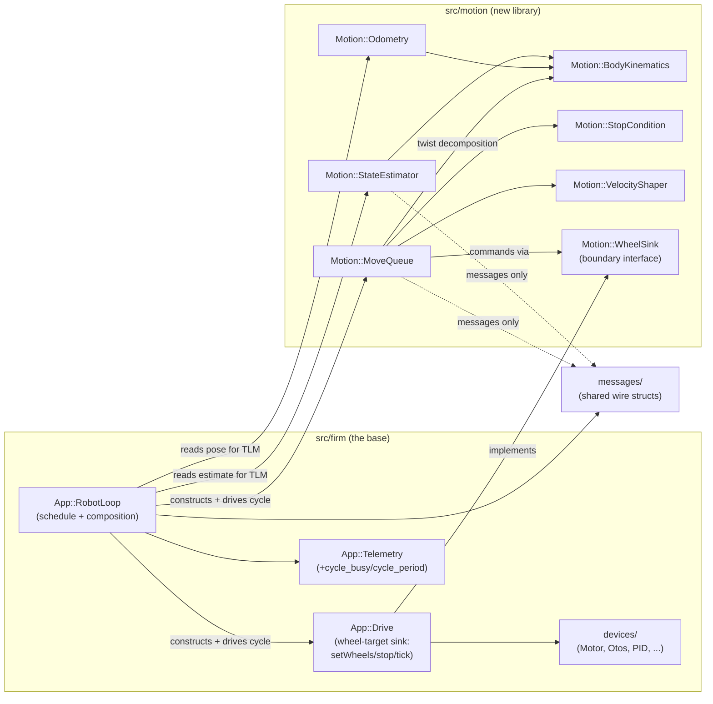
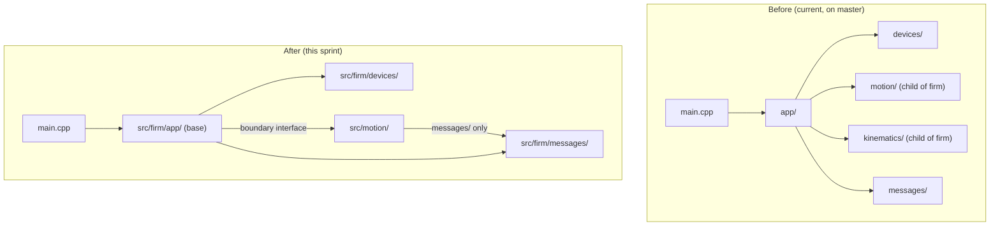

<!-- CLASI: Before changing code or making plans, review the SE process in CLAUDE.md -->

# Sprint 122: Motion-library extraction + loop-timing telemetry

## Goals

First of a two-sprint restructuring (stakeholder directive, 2026-07-24):
split the codebase into a hardened FIRMWARE BASE and a separate MOTION
LIBRARY that can be developed and tested independently. This sprint does
the mechanical extraction — moving the twist/kinematics/queue/estimator/
odometry code from `src/firm` to a new `src/motion` behind one narrow
velocity-sink boundary — plus one independent telemetry addition
(per-cycle loop-timing fields). Sprint 2 (base hardening: bounded wheel
moves + per-wheel command observer, tracked by
`clasi/issues/firmware-base-hardening-bounded-wheel-moves-and-wheel-observer.md`)
is explicitly NOT part of this sprint; this sprint's job is to make sure
the boundary it lands does not block that work.

## Problem

`src/firm` currently mixes two concerns that need to evolve at different
rates and eventually live in different repos: (1) the hardware-facing
base — buses, devices, the PID, the wire, the loop schedule — which the
stakeholder wants to freeze once hardened, and (2) the motion-control
logic — twist decomposition, shaping, queueing, estimation, odometry —
which is still under active development (goal-exact tours, same-axis
carry, heading hold, etc.) and needs a fast, Python-free, sim-free unit
test loop (`motion_tests`) to iterate against. Today that logic is
entangled with `App::RobotLoop` and only testable through the full sim
harness.

## Solution

Pure mechanical move, zero behavior change, zero wire change (except one
backward-compatible telemetry field addition):

1. Stand up `src/motion` with its own CMakeLists and DESIGN.md. Move the
   already-pure leaves (`stop_condition`, `velocity_shaper`,
   `body_kinematics`) first and get a standalone `motion_tests` target
   compiling and green with the existing StopCondition/VelocityShaper
   tests.
2. Move `move_queue`, `state_estimator`, `odometry`, and the TWIST half of
   `drive` (setTwist()/BodyKinematics staging) behind one narrow boundary
   header: a plain VELOCITY sink (`setWheels(vLeft, vRight)`/`stop()`/
   `tick()` writing motor velocity targets) — NOT a duty sink; that
   deferral belongs to sprint 2. `velocity_pid.*` and `NezhaMotor`'s PID
   ownership stay in the base, unchanged, this sprint (explicitly
   overriding the extraction issue's own REVISION note, which is deferred
   to sprint 2's duty-primitive rewrite). Rewire `RobotLoop`/`main.cpp`/
   `SimHarness` construction. Add the end-to-end two-chained-moves
   `motion_tests` scenario against the model plant
   (`src/tests/sim/plant/wheel_plant.*`).
3. Add `cycle_busy`/`cycle_period` (`uint32 [us]`) to the telemetry proto
   and `Telemetry::Frame` staging, base-side; regenerate codecs; expose on
   host `TLMFrame`; show one line in the TestGUI telemetry panel; sim
   unit test asserting exact virtual-clock values.
4. Reconcile `docs/design/design.md`, the co-located `src/firm` DESIGN.md
   set, and CLAUDE.md for the two-layer split so `close_sprint`'s design
   validation passes with no dangling or missing DESIGN.md.

The already-landed OTOS fake-seam refactor (`Devices::Otos` interface +
`RealOtos`/`FakeOtos`, commit 0773835b) needs no work here — noted as
landed context only.

## Success Criteria

- Full sim suite + closure gates green with numbers UNCHANGED from the
  pre-extraction baseline (baseline recorded before ticket 001 starts
  moving code; compared after ticket 002 lands).
- `motion_tests` builds/runs standalone (no SimHarness, no ctypes, no
  Python), carrying the StopCondition/VelocityShaper tests plus the
  end-to-end chained-moves scenario.
- `src/motion`'s include graph is clean — `firm/` appears only as
  `messages/` — and this is CI-greppable.
- Every telemetry frame carries `cycle_busy`/`cycle_period`; sim test
  asserts exact values; GUI shows them; the wire change is a
  backward-compatible proto field addition only.
- Design docs + CLAUDE.md updated for the two-layer split;
  `close_sprint`'s design validation passes.

## Scope

### In Scope

- New `src/motion` library: `stop_condition`, `velocity_shaper`,
  `body_kinematics`, `move_queue`, `state_estimator`, `odometry`, twist
  staging out of `drive`.
- One narrow velocity-sink boundary header (motion-owned, base-implemented).
- Standalone `motion_tests` CMake target + model-plant end-to-end scenario.
- `RobotLoop`/`main.cpp`/`SimHarness` rewiring to compose base + motion.
- `cycle_busy`/`cycle_period` telemetry fields (proto, frame staging,
  codec regen, host `TLMFrame`, TestGUI display, sim test).
- Design-doc reconciliation (`docs/design/design.md`, `src/firm` DESIGN.md
  set, new `src/motion/DESIGN.md`) and CLAUDE.md update.

### Out of Scope

- Sprint 2 (base hardening): bounded wheel moves as a base primitive,
  per-wheel command observer, the duty-sink boundary, moving
  `velocity_pid.*`/PID ownership out of the base. Tracked by
  `clasi/issues/firmware-base-hardening-bounded-wheel-moves-and-wheel-observer.md`
  and sketched in `docs/design/base-explicit-loop-sketch.md` — read for
  context, not planned here.
- Any accuracy/exactness work (terminal-settle completion, same-axis
  carry, heading hold, S-bar tuning) — deferred to the motion library's
  own plan per the extraction issue's Sequencing section.
- The OTOS fake-seam refactor — already done (commit 0773835b).
- Adding `src/motion` to `.clasi/config.yaml`'s `sources:` list — it stays
  outside the mechanically-validated design-doc-set roots
  (`[src/firm, src/host]`), documented but unvalidated, same treatment as
  `src/sim`/`src/protos`/etc.

## Test Strategy

Refactor-gate discipline throughout: this sprint proves absence of
behavior change, not new accuracy. Baseline the existing sim/closure test
suite's numeric outputs before any code moves (ticket 001), re-run after
the boundary is fully wired (ticket 002) and assert bit-for-bit/numeric
parity. `motion_tests` is new and additive — it must pass, but its
existence is the deliverable, not a behavior gate. The telemetry ticket
gets its own sim unit test asserting exact `cycle_busy`/`cycle_period`
values under the virtual clock (deterministic, not a range check).
`firmware`, `motion_tests`, and `libfirmware_host` (sim) all must build
and their respective suites pass before the sprint closes. No hardware
bench session is required for this sprint (pure refactor + additive
telemetry field, no HAL/motor-control/protocol semantics change) — bench
verification is deferred to sprint 2, which does touch the command
primitive.

## Architecture

**Substantial — introduces a new top-level subsystem (`src/motion`), moves
3+ existing modules across a tree boundary (MoveQueue, StateEstimator,
Odometry, BodyKinematics, StopCondition, VelocityShaper, plus the twist
half of Drive), and changes the module dependency direction between two
source trees (`src/firm` and `src/motion` become sibling trees related by
one narrow interface, in place of `motion/`/`kinematics/` being children
of `src/firm`).** Full 7-step methodology, with diagrams.

### Step 1 — Understand the Problem

`src/firm` today holds two things at once: a hardware-facing base
(buses, devices, PID, wire, loop schedule — meant to be frozen once
hardened) and motion-control logic (twist decomposition, queueing,
shaping, estimation, odometry — still under active development and
currently only testable through the full sim harness, `libfirmware_host`,
which requires the whole firmware graph, `ctypes`, and Python). The
extraction issue's own acceptance is explicit: zero behavior change, zero
wire change (bar one additive telemetry field), full sim-suite parity
before/after, and a new standalone `motion_tests` CMake target proving the
boundary is sufficient without any of that machinery. The telemetry item
is unrelated in mechanism but shares this sprint because it is small,
additive, and orthogonal — it does not touch the extraction's boundary.

### Step 2 — Identify Responsibilities

Four responsibility groups this sprint touches, each changing for its own
reason:

1. **Motion-control logic** (decides the commanded wheel velocity each
   cycle from a `Move` command and the current wheel/body estimate) — the
   whole reason the split exists; iterates fast against `motion_tests`,
   independent of hardware/wire/build concerns.
2. **The base's wheel-target sink** (accepts a commanded per-wheel
   velocity and stages it onto the two `Devices::Motor` leaves) — stays
   hardware-adjacent, frozen-candidate surface; shrinks, does not move.
3. **The boundary itself** (the interface motion calls to hand down a
   wheel command, and the interface the base implements) — new; the one
   piece of design work in the "pure mechanical move."
4. **Loop-timing observability** (reporting how long each cycle actually
   took) — independent of the above three; touches `telemetry.*` and the
   wire schema only, not the motion/base split.

Design-doc reconciliation is not a fifth code responsibility — it is
required bookkeeping so `close_sprint`'s mechanical validator stays green
once responsibility group 1 physically leaves the validated `src/firm`
root.

### Step 3 — Define Subsystems and Modules

| Module | Purpose (one sentence, no "and") | Boundary | Use cases served |
|---|---|---|---|
| **`src/motion`** (new) | Computes the commanded wheel velocity for the current cycle from a queued `Move` and the current wheel/body estimate. | Inside: `Motion::MoveQueue`, `Motion::StateEstimator`, `Motion::Odometry`, `Motion::BodyKinematics`, `Motion::StopCondition`, `Motion::VelocityShaper`, the twist-decomposition half of what is `App::Drive::setTwist()` today. Outside: hardware I/O, wire framing/codec (beyond `messages/` structs), telemetry emission, the velocity PID, anything that touches the I2C bus or sleeps. | SUC-001, SUC-002 |
| **Boundary interface** (new, motion-owned header, e.g. `motion/wheel_sink.h`) | Declares the one contract motion needs from whatever hosts it: a wheel-velocity command sink plus the per-wheel/body state motion reads. | Inside: the abstract sink type (`setWheels(vLeft, vRight)`/`stop()`), the per-wheel state struct motion consumes (position, velocity, sample time — matching what `Devices::Motor` already exposes), plain config (trackwidth, shaper limits) passed at construction. Outside: any concrete implementation (that is the base's job), any wire type beyond `messages/`. | SUC-001, SUC-002 |
| **`src/firm/app` — wheel-target sink** (existing, shrinks) | Stages a commanded per-wheel velocity onto the two `Devices::Motor` leaves. | Inside: `App::Drive`'s `setWheels()`/`stop()`/`tick()` (implements the boundary interface). Outside: `setTwist()`/`BodyKinematics` staging (moves to motion), the PID (already inside `Devices::NezhaMotor`, untouched). | SUC-002 |
| **`src/firm/app` — loop composition** (existing, changed includes/construction only) | Owns the cycle schedule and constructs/wires the base + motion objects every composition root already wires today. | Inside: `App::RobotLoop`'s dispatch, timing, and construction-time wiring. Outside: any motion decision logic (delegated) — per the extraction issue, "only include paths and construction change." | SUC-002 |
| **`src/firm/app/telemetry`** (existing, additive change) | Stages the outbound telemetry frame from the cycle's state. | Inside: the two new `cycle_busy`/`cycle_period` fields, sourced from `RobotLoop`'s existing `cycleStart` bookkeeping. Outside: everything else about frame content (unchanged). | SUC-003 |
| **`src/protos`, `messages/`, host `TLMFrame`, TestGUI panel** (existing, additive change) | Carries and displays the new timing fields end to end. | Inside: proto field addition, codegen regen, host decode, one GUI line. Outside: any other wire semantics. | SUC-003 |
| **`docs/design/`, `src/firm` DESIGN.md set, `src/motion/DESIGN.md`, `CLAUDE.md`** (reconciliation) | Documents the two-layer split accurately enough that the mechanical validator and a future reader agree with the code. | Inside: subsystem-map edits, DESIGN.md moves/rewrites, `src/motion/DESIGN.md` (new, unvalidated per the locked scope decision), CLAUDE.md's two-layer description. Outside: `.clasi/config.yaml`'s `sources:` list (stays `[src/firm, src/host]`, untouched). | SUC-004 |

### Step 4 — Diagrams

**Component diagram — required** (new cross-tree dependency introduced;
6 nodes touched). Shows the target state after this sprint:

**Dependency-direction diagram — required** (module dependency direction
changes: `motion/`/`kinematics/` stop being children of `src/firm` and
become a sibling tree the base depends on):

No entity-relationship diagram — no persisted/data-model change. The two
new telemetry fields are additional scalar fields on an existing wire
message, not a new entity or relationship (Step 4's ERD trigger is a data
model change; this is a wire-schema addition, already covered by the
component diagram above).

### Step 5 — Complete the Document

**What Changed**

- New `src/motion/` tree: own `CMakeLists.txt`, own `DESIGN.md`, holding
  `move_queue.*`, `state_estimator.*`, `odometry.*`, `body_kinematics.*`,
  `stop_condition.*`, `velocity_shaper.*`, and the twist-decomposition half
  of `drive.*` (renamed/split as the implementer sees fit — module-level
  boundary is normative, not the exact class/file names).
- One new boundary header, motion-owned: a wheel-command sink interface
  plus the per-wheel state struct motion reads, plain config passed at
  construction (trackwidth, shaper limits).
- `src/firm/app/drive.*` shrinks to the wheel-target sink only
  (`setWheels()`/`stop()`/`tick()`), implementing the boundary interface.
- `src/firm/app/robot_loop.{h,cpp}` and `main.cpp` change their includes
  (namespaced under `motion/` from the new tree) and construction wiring;
  the schedule and dispatch logic are unchanged.
- `src/sim/CMakeLists.txt`'s `MOTION_SOURCES` (and the sources currently
  under `APP_SOURCES` for `move_queue.cpp`/`odometry.cpp`/
  `state_estimator.cpp`) repoint at `src/motion/`; a new
  `src/motion/CMakeLists.txt` defines the standalone `motion_tests`
  target. The root `CMakeLists.txt`'s ARM build (`CODAL_APP_SOURCE_DIR =
  "src/firm"`, `RECURSIVE_FIND_FILE`/`RECURSIVE_FIND_DIR` over that one
  directory) must be extended to also glob `src/motion`, or the firmware
  image silently stops linking the motion library the moment its sources
  leave `src/firm` — this is a required, easy-to-miss build-system change,
  not an incidental one.
- `messages/telemetry.h` + `src/protos/*.proto` + generated codecs +
  `Telemetry::Frame` staging gain `cycle_busy`/`cycle_period`
  (`uint32 [us]`, additive fields). Host `TLMFrame` and the TestGUI
  telemetry panel expose them.
- `docs/design/design.md` (§2 subsystem map, §5 dependency diagram),
  `src/firm/app/DESIGN.md`, `src/firm/motion/DESIGN.md` and
  `src/firm/kinematics/DESIGN.md` (both now describe an empty/removed
  directory or are deleted, whichever the mechanical validator requires),
  a new `src/motion/DESIGN.md`, and `CLAUDE.md` are all updated together.

**Why**

Splitting a hardware-facing base the stakeholder intends to freeze from a
motion-control layer still under active development lets each evolve at
its own rate and, per the stakeholder's stated intent, eventually move to
its own repository via `git subtree split` with no further redesign. The
velocity-sink boundary (rather than the duty-sink boundary the extraction
issue's own REVISION note proposes) is deliberately the smaller of two
possible cuts — see Design Rationale below.

**Impact on Existing Components**

- `App::RobotLoop`: construction signature and includes change; cycle()
  body dispatch logic does not (calls the same conceptual methods on
  objects now living in a different namespace/tree).
- `App::Drive`: loses `setTwist()` and its `BodyKinematics` dependency;
  keeps `setWheels()`/`stop()`/`tick()`, now expressed against the
  boundary interface so `Motion::MoveQueue` can hold it by that interface
  rather than by concrete type.
- `src/sim/CMakeLists.txt` and the root `CMakeLists.txt`: source lists
  and include paths change to cover the new tree; no change to what
  actually links into either the ARM image or `libfirmware_host`.
- Existing `src/tests/sim/unit/motion_stop_condition_harness.cpp` /
  `motion_velocity_shaper_harness.cpp` / `app_move_queue_harness.cpp` /
  `app_state_estimator_harness.cpp` / `app_odometry_harness.cpp`: their
  `-I` include path moves from `src/firm` to `src/motion` for the
  relocated modules; scenario coverage is preserved, not rewritten.
- No change to `devices/`, `com/`, `config/`, `messages/` (beyond the two
  additive telemetry fields), or any wire-visible behavior.

**Migration Concerns**

- **Sequencing risk**: the extraction must not silently drop a source
  file from either build graph mid-move. Ticket 001 stands up the new
  tree and a compiling `motion_tests` using ONLY the already-pure leaves
  (stop_condition, velocity_shaper, body_kinematics) while leaving
  `move_queue`/`state_estimator`/`odometry`/`drive`'s twist half in place
  in `src/firm` — both the firmware and sim builds must remain green
  after ticket 001, with the boundary header existing but not yet load-
  bearing. Ticket 002 moves the remaining four and rewires; both builds
  must remain green after ticket 002 too. This two-step sequencing is
  itself the migration-safety mechanism — there is no single big-bang
  move.
- **Baseline-then-compare is the actual gate.** Record the pre-extraction
  suite's numeric outputs (ticket 001, before any file moves) and diff
  them against the post-extraction run (end of ticket 002) — see Test
  Strategy above. A refactor that "looks equivalent" without this
  recorded diff does not satisfy the sprint's acceptance.
- **No data migration** — no persisted state, no flash-format change,
  no wire-format change beyond one additive telemetry field (backward
  compatible: an old host decoder that does not know the new fields
  simply ignores the extra bytes, per protobuf-style field addition).
- **Deployment sequencing**: this sprint does not require a bench session
  (Test Strategy above) — the ARM `firmware` target must still build and
  the design docs must validate before `close_sprint`, but there is no
  hardware-behavior change to verify on the stand.

### Design Rationale

**Decision 1 — the boundary is a velocity sink, not a duty sink.**
- *Context*: the extraction issue's own REVISION note (2026-07-24) says
  `velocity_pid.*` moves to motion too and the base becomes a duty sink —
  driven by the companion base-hardening issue's separate PID-placement
  decision.
- *Alternatives considered*: (a) do the duty-sink rewrite in this sprint,
  folding sprint 2's PID-placement decision in now; (b) keep the
  velocity-sink boundary this sprint and defer the duty-sink rewrite to
  sprint 2.
- *Why this choice*: (a) bundles a behavior-changing rewrite (the PID
  moving consumers, the loop's actuation path changing shape) into a
  sprint whose entire acceptance is "zero behavior change" — mixing the
  two would make the refactor gate meaningless (you cannot both prove
  "nothing changed" and land a controller relocation in the same commit
  sequence). (b) keeps this sprint a pure reorganization and lets sprint 2
  own the one behavior-changing rewrite deliberately and gated on its own
  numeric acceptance (the base gate in
  `firmware-base-hardening-bounded-wheel-moves-and-wheel-observer.md`).
  This is a stakeholder-locked decision (2026-07-24), not a discretionary
  call this sprint reopened.
- *Consequences*: the boundary header this sprint defines will need a
  second, non-trivial revision in sprint 2 (velocity struct becomes a
  duty struct, `appliedDuty` feedback added, `MoveWheels` bounded-stop
  tracking moves up). That is expected and acceptable — sprint 2's own
  architecture step owns that revision; this sprint's job is only to not
  make it harder than necessary (e.g., don't hardcode "velocity" into the
  interface name in a way that fights a later rename).

**Decision 2 — `velocity_pid.*` and PID ownership stay in the base this
sprint.**
- *Context*: same REVISION note as Decision 1; the stakeholder's locked
  scope for this sprint explicitly keeps the PID in `devices/`, unchanged.
- *Alternatives*: move it now (rejected, same reasoning as Decision 1) vs.
  leave it (chosen).
- *Consequences*: `Devices::NezhaMotor` is unchanged this sprint; sprint
  2's "base hardening" plan is the one that shrinks it.

**Decision 3 — `src/motion` is a sibling of `src/firm`, not nested under
it.**
- *Context*: the stakeholder's stated intent is eventual separate-repo
  development; the extraction issue calls for `git subtree split`
  readiness.
- *Alternatives*: (a) nest as `src/firm/motion/` (larger than today's tiny
  `motion/`, just reorganized) — rejected, does not achieve subtree-split
  readiness since it would still live inside the `src/firm` tree; (b)
  sibling tree at `src/motion/` — chosen, matches the issue's own stated
  target path.
- *Consequences*: the ARM build's `CODAL_APP_SOURCE_DIR`-rooted recursive
  glob no longer automatically covers motion's sources — root
  `CMakeLists.txt` needs an explicit second glob/include-dir addition (see
  Step 5's Migration Concerns). `.clasi/config.yaml`'s `sources:` list
  stays `[src/firm, src/host]` (stakeholder-locked) — `src/motion` is
  real, current, but mechanically-unvalidated documentation, the same
  treatment `src/sim`/`src/protos`/`src/scripts` already get.

**Decision 4 — `motion_tests` is a standalone CMake target, not a
Python/pytest-subprocess harness like the existing
`src/tests/sim/unit/*_harness.cpp` pattern.**
- *Context*: the existing unit-test pattern (e.g.
  `test_motion_stop_condition.py`) compiles one throwaway binary per
  harness via `subprocess`, driven by pytest, `-I src/firm`. The
  extraction issue requires a target that proves "no SimHarness, no
  ctypes, no Python."
- *Alternatives*: (a) keep the pytest-subprocess pattern, just repointing
  `-I` at `src/motion` — simplest, but does not produce a CI-greppable,
  standalone build artifact a future separate-repo checkout could build
  with `cmake --build .` alone, and keeps Python in the loop for
  motion-only iteration; (b) a real `motion_tests` CMake
  executable/ctest target in `src/motion/CMakeLists.txt`, linking the
  moved modules + `wheel_plant.cpp` (reused from
  `src/tests/sim/plant/`), that a developer can build and run with no
  Python at all.
- *Why this choice*: (b) is what the issue's acceptance literally asks
  for ("no sim library and no Python") and is the whole point of the
  split — a fast, hardware- and Python-free iteration loop for the
  motion logic. `pytest` can still shell out to `ctest`/the built binary
  from `src/tests/sim/unit/` if a single `uv run pytest` invocation should
  keep covering it, but the underlying build/run no longer needs Python.
- *Consequences*: ticket 001 must write `src/motion/CMakeLists.txt` from
  scratch (no existing template in this repo builds a bare host
  executable outside `src/sim/CMakeLists.txt`'s shared-library shape);
  the existing `test_motion_stop_condition.py`/
  `test_motion_velocity_shaper.py` pytest wrappers get repointed at the
  new location (either still compiling ad hoc with `-I src/motion`, or
  invoking the new CMake target — implementer's choice, module boundary
  is what's normative here).

### Migration Concerns

None beyond what Step 5 already covers above (repeated here only because
the template asks for the field explicitly) — no data migration, no
persisted-state change, no deployment-sequencing risk beyond the two-step
build-graph sequencing already described.

### Open Questions

1. **Exact names for the boundary interface and the moved classes'
   namespace/file layout** are left to ticket 001/002's implementer —
   this document is normative on the module boundary (what's inside vs.
   outside `src/motion`, and the interface's In/Out shape per the
   extraction issue), not on class names. A reasonable starting point:
   keep `Motion::MoveQueue`/`Motion::StateEstimator`/`Motion::Odometry`/
   `Motion::BodyKinematics`/`Motion::StopCondition`/`Motion::VelocityShaper`
   names as-is (just re-namespaced/relocated), and name the new interface
   something like `Motion::WheelSink` — but this is a naming suggestion,
   not a requirement.
2. **Whether `App::Drive` keeps its name** once it only implements the
   wheel-target sink (losing `setTwist()`), or is renamed to make the
   narrowed responsibility explicit (e.g. something like
   `App::WheelDrive`) — left to the ticket; either is coding-standard
   compliant, this is a naming call, not an architectural one.
3. **Whether the existing `src/tests/sim/unit/motion_*_harness.cpp` pytest
   wrappers get retired in favor of `ctest`, or kept as thin subprocess
   wrappers pointed at the new path** — either satisfies this sprint's
   acceptance (StopCondition/VelocityShaper coverage preserved); left to
   ticket 001.
4. **Whether `src/firm/motion/DESIGN.md` and `src/firm/kinematics/DESIGN.md`
   are deleted outright (their subsystems no longer exist under `src/firm`)
   or folded into a short redirect note** once their directories empty out
   — ticket 004 (design-doc reconciliation) decides based on what
   `clasi.design.validator` actually requires; either is consistent with
   this architecture.

## Use Cases

Substantial sprint — full use-case treatment.

### SUC-001: Motion library builds and tests standalone
Parent: (none — this is new sprint-level infrastructure, not a
consumer-facing use case with an existing parent UC)

- **Actor**: Firmware developer iterating on motion-control logic
  (queueing, shaping, estimation, odometry).
- **Preconditions**: `src/motion/` exists with its own `CMakeLists.txt`;
  the relocated modules and `src/tests/sim/plant/wheel_plant.*` are
  available to it.
- **Main Flow**:
  1. Developer runs the `motion_tests` build (plain `cmake`/`make`, no
     Python, no `libfirmware_host`).
  2. The build compiles `src/motion`'s sources plus the model plant and
     links a test executable (or set of executables/ctest targets).
  3. Running the result executes the StopCondition/VelocityShaper unit
     scenarios plus one end-to-end scenario: enqueue two chained moves
     against the model plant and verify the completion sequence.
  4. All scenarios pass; the process exits 0.
- **Postconditions**: A developer can validate a motion-logic change
  without touching hardware, the sim library, `ctypes`, or Python.
- **Acceptance Criteria**:
  - [ ] `motion_tests` builds with plain CMake and no Python in the
        build/run path.
  - [ ] StopCondition and VelocityShaper scenario coverage present and
        passing.
  - [ ] The two-chained-moves end-to-end model-plant scenario present and
        passing.
  - [ ] `src/motion`'s include graph contains no `src/firm` header except
        under `messages/` (grep-verifiable).

### SUC-002: Firmware behavior is unchanged after the extraction
Parent: (refactor-gate use case, no existing consumer-facing parent)

- **Actor**: The sprint's own refactor gate (executed by whoever closes
  the sprint; not a human end-user scenario).
- **Preconditions**: Pre-extraction baseline of the full sim/closure
  suite's numeric outputs has been recorded (ticket 001, before any code
  moves).
- **Main Flow**:
  1. Ticket 002 completes the move and rewires `RobotLoop`/`main.cpp`/
     `SimHarness` to compose base + motion through the boundary.
  2. The full sim suite and closure gates are re-run.
  3. Outputs are diffed against the recorded baseline.
- **Postconditions**: Every compared number is unchanged; `firmware`,
  `motion_tests`, and `libfirmware_host` all build and their suites pass.
- **Acceptance Criteria**:
  - [ ] Baseline recorded before ticket 002 begins moving the remaining
        modules.
  - [ ] Post-move suite run produces numerically identical results to the
        baseline (or an explained, reviewed exception — not a silent
        drift).
  - [ ] `firmware` (ARM), `motion_tests`, and `libfirmware_host` (sim) all
        build green.

### SUC-003: Loop timing is visible in telemetry
Parent: (diagnostic/observability use case, no prior parent UC)

- **Actor**: Bench diagnostician / firmware developer reading telemetry.
- **Preconditions**: `RobotLoop` already tracks `cycleStart` per cycle
  (it does today).
- **Main Flow**:
  1. Each cycle, the base computes `cycle_busy` (elapsed `cycleStart` to
     end-of-work, measured at frame staging) and `cycle_period` (this
     `cycleStart` minus the previous one).
  2. Both are staged as `uint32 [us]` fields on every outbound telemetry
     frame.
  3. Host `TLMFrame` decodes them; the TestGUI telemetry panel displays
     one line (e.g. `loop 3.2ms / 40.0ms`).
- **Postconditions**: Every frame, sim or hardware, carries truthful
  per-cycle timing; a host consumer can compute real achieved rate
  instead of assuming the nominal 40 ms.
- **Acceptance Criteria**:
  - [ ] Every telemetry frame carries both fields.
  - [ ] A sim unit test asserts EXACT values under the deterministic
        virtual clock (not a range/tolerance check).
  - [ ] Host `TLMFrame` exposes both fields; TestGUI shows one line.
  - [ ] The proto change is additive/backward-compatible (old decoders
        ignore the new bytes).

### SUC-004: Design documentation matches the two-layer split
Parent: (process/documentation use case, no prior parent UC)

- **Actor**: `close_sprint`'s mechanical design validator; a future
  maintainer or agent reading `docs/design/`.
- **Preconditions**: The extraction (SUC-001/SUC-002) has landed;
  `src/firm/app`, `src/firm/motion`, `src/firm/kinematics` no longer
  contain the moved modules.
- **Main Flow**:
  1. `docs/design/design.md`'s subsystem map and dependency description
     are updated to show the two-layer split.
  2. `src/firm/app/DESIGN.md` is updated for its narrowed contents;
     `src/firm/motion/DESIGN.md` / `src/firm/kinematics/DESIGN.md` are
     updated or removed to match their (now empty or removed) directories.
  3. A new `src/motion/DESIGN.md` is written (real, current, but outside
     the validated `sources:` roots per the locked scope decision).
  4. `CLAUDE.md` is updated to name the base/motion layers and the
     boundary.
  5. `close_sprint`'s design validation runs and passes.
- **Postconditions**: No dangling required-DESIGN.md for a subsystem that
  no longer exists under a declared root; no missing DESIGN.md for one
  that remains.
- **Acceptance Criteria**:
  - [ ] `docs/design/design.md` reflects the split.
  - [ ] Co-located `src/firm` DESIGN.md set has no orphaned/missing entries.
  - [ ] `src/motion/DESIGN.md` exists and is accurate.
  - [ ] `CLAUDE.md` names both layers and the boundary.
  - [ ] `close_sprint`'s design validation passes.

## GitHub Issues

(GitHub issues linked to this sprint's tickets. Format: `owner/repo#N`.)

## Definition of Ready

Before tickets can be created, all of the following must be true:

- [x] Sprint planning document is complete (sprint.md, including its
      Architecture and Use Cases sections)
- [x] Architecture review passed (or skipped, for changes with no
      architectural impact)
- [x] Stakeholder has approved the sprint plan (locked scope decisions,
      2026-07-24, provided directly in this sprint's planning brief —
      recommend Eric/team-lead confirm this reading explicitly before
      execution begins; see this report's Risks section)

## Tickets

| # | Title | Depends On |
|---|-------|------------|
| 001 | Stand up src/motion: boundary header + pure-leaf move + motion_tests skeleton | — |
| 002 | Move MoveQueue/StateEstimator/Odometry/twist-Drive behind the boundary; rewire composition roots | 001 |
| 003 | Telemetry: cycle_busy/cycle_period loop-timing fields end to end | 002 |
| 004 | Design-doc and CLAUDE.md reconciliation for the two-layer split | 003 |

Tickets execute serially in the order listed.
