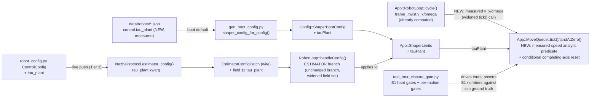

<!-- CLASI: Before changing code or making plans, review the SE process in CLAUDE.md -->

# Sprint 122: Analytic completion & same-axis carry — margin machinery deleted

> Re-planned per `clasi/issues/replan-sprints-122-plus-to-close-goal-exact-tours.md`
> and sprint 121-003's close-out finding (2026-07-23). This sprint is the S1
> keystone: it deletes every completion margin constant, replaces them with
> one derived rule, restores same-axis carry, and hardens the S1 gates.

## Open Decision (stakeholder — surfaced at sprint START, per the replan's standing rule 4)

**This is not resolved yet. It is surfaced here, prominently, because it must
be visible before execution, not discovered mid-ticket.**

**Question:** ticket 002 (same-axis carry-through) re-verifies the
`sameAxisCompatible()`-gated conditional completing-axis reset against ticket
001's NEW analytic completion predicate and the tour-closure gate. If that
re-verification finds the conditional reset REGRESSES chain-turn accuracy —
the way the structurally-similar `pendingCount()`-gated variant already did
once (118-003's own record: best worst-case 2.932° vs. the shipped 2.323° at
the time — reverted, kept unconditional) — does the stakeholder accept a
BOUNDED same-axis carry *dip*, replacing
`test_two_compatible_distance_legs_carry_velocity_through_the_boundary_at_tour_level`'s
existing 90%-of-`v_max` no-dip floor with a stated, bounded recovery-time
assertion instead (cycles/ms)? This is the exact escape clause
`chain-advance-reset-defeats-same-axis-compatible-leg-continuity.md` already
writes into its own Acceptance section.

**Why this can't be answered in advance:** ticket 001 deletes the margin
machinery the 118-003 regression finding was measured against and replaces it
with the analytic `|measured|*(kCycle/2+tauPlant)` rule. Whether the SAME
regression recurs against the NEW predicate is an empirical question ticket
002 must actually run — it is not a re-statement of the old sweep result, and
pre-deciding it here would be guessing.

**Resolution path:** team-lead auto-resolves this under auto-approve mode if
and when ticket 002 actually hits the regression — see ticket 002's
Acceptance Criteria below, which state BOTH outcomes explicitly (no-dip floor
intact, or the named bounded-recovery alternative with its stated window) and
require ticket 002 to report which one occurred, with measured numbers,
before the sprint is treated as closeable. If ticket 002 does NOT hit the
regression, this decision is moot and is recorded as such (no action needed
from the stakeholder).

## Goals

Three jobs, one theme — completion semantics become physics, not tuning:

1. **Analytic completion replaces ALL margin machinery.** 121-003 proved
   (and the team-lead boundary trace confirmed, numbers below) that no
   fraction of a COMMANDED-speed envelope can represent the PLANT's coast:
   under the taper the plant lags the command by `alpha_decel * tau_plant`
   (7 x 0.13 ~= 0.9 rad/s — measured 0.96–1.34 rad/s at the ack instant), so
   a tight margin crosses the threshold "at cmd ~= 0" yet still coasts ~7deg
   (the 0.92 -> 8deg inversion), and a loose one fires early and leaks
   2–4deg into the next leg. Replace `kStoppingMarginFactorChain` (0.48),
   `kStoppingMarginFactorOrthogonal` (0.67 — 121-003's own labeled interim
   defect marker), `kStoppingMarginFactorFinal` (0.92), and
   `kDiscretizationCyclesChain` with ONE derived firing rule on MEASURED
   speed:

       Angle:    remaining <= |omega_measured| * (kCycle/2 + tau_plant)
       Distance: remaining <= |v_measured|     * (kCycle/2 + tau_plant)

   applied uniformly to final, orthogonal-chain, and (as the terminal
   condition under carry) same-axis boundaries. `tau_plant` enters the robot
   JSON as ONE new named, bench-derived constant (plant_harness
   characterization 0.12–0.14 s) — a measured physical quantity per the
   replan's standing rule 3, not a swept margin. **No sweeping anywhere in
   this sprint: if the analytic form misses its numbers, the model is wrong —
   re-derive (e.g. a second-order coast term), never tune.**
2. **Same-axis carry restored.** The unconditional completing-axis shaper
   reset defeats SUC-003/SUC-051 (dip to 24 mm/s at a compatible
   Distance->Distance boundary vs the 90%-of-v_max floor). Make the reset
   conditional on the incoming Move sharing the ending Move's stop-kind axis
   and sign (the `sameAxisCompatible()` split 121-003 already landed is the
   scaffolding).
3. **S1 gate ratchet.** With 1–2 landed, convert the ideal-chip gates to
   permanent hard asserts at the goal-doc S1 bar (per-motion <=0.1deg/<=1mm;
   tour net <=0.5deg, closure <=5mm, per-leg straight gain <=0.1deg) — see
   the ratchet issue for the named-floor escape (stakeholder adjudicates;
   tolerances never loosen).

## Problem

Current measured state (deterministic sim, ideal chip, HEAD=121-003 commit
81fa7858): TOUR_1 net +21.0deg over 540; straights after turns +1.2–2.8deg
each; turns +0.7–2.3deg; single-boundary trace: predicate fires at +90.95
with plant omega 1.34 rad/s, coasts to +93.7. Root cause per Goals-1:
commanded-envelope margins cannot express plant coast. Separately, same-axis
boundaries dip to 16% of v_max (reset defeats carry). Both are
completion/hand-off semantics — the last error sources standing between this
codebase and S1.

## Solution (plan of record)

- `MoveQueue::landAtZero()` -> analytic completion: fire when remaining is
  inside the measured-speed coast envelope (formulas above). Measured speed
  comes from the same-cycle odometry twist the tick already has (post-118
  ordering). Delete the four margin constants and their comment archaeology;
  `move_queue.cpp`'s anonymous-namespace sweep history moves to DESIGN.md as
  a closed chapter.
- Conditional reset per Goals-2; orthogonal boundaries keep the reset (the
  residual is near-zero once analytic completion fires correctly).
- Gate work per Goals-3, including per-motion gates (90/360 turn, 700 mm
  straight) alongside the tour gates.

## Success Criteria

- The margin/discretization constants NO LONGER EXIST in firmware; grep-clean.
- Deterministic sim, ideal chip: straights following turns gain <=0.3deg
  each; turn legs |error| <=0.5deg; TOUR_1 net 540deg +-1deg — and then the
  ratchet: S1 bar met (<=0.1deg/motion, tour <=0.5deg) or the physical floor
  is named with a measurement and stakeholder sign-off.
- `test_two_compatible_distance_legs_carry_velocity_through_the_boundary_at_tour_level`
  passes with the 90% no-dip floor intact (or an explicit stakeholder-accepted
  bounded-recovery alternative).
- 121's orthogonal land-at-zero behavior strictly improves (per-boundary
  leak <=0.3deg, from measured 2–4deg).
- Full suite green; S1 gates run hard (no xfail) in the default suite.

## Scope

### In Scope

- `App::MoveQueue` completion predicate + reset conditionalization
  (`src/firm/app/move_queue.cpp`); `tau_plant` config key + boot plumbing;
  gate hardening in `src/tests/testgui/test_tour_closure_gate.py` plus a new
  per-motion gate file.

### Out of Scope

- Heading-hold (123); new tours (124); any host/tour-runner change beyond
  gate tests; OTOS fusion (126-replanned).

## Dependencies / Sequencing

- After 121 closes (stakeholder decision 2026-07-23: Accept + defer, with
  the amendment recorded in 121's close-out).
- Blocks 123/124's acceptance numbers; independent of 125.

## Architecture

**Substantial.** Sizing rationale: this is not "one firmware module, one
config key" as the roadmap sketch guessed — threading a single new physical
constant (`tauPlant`) live-tunably from the robot's committed JSON through to
`App::MoveQueue`'s completion decision touches the wire schema
(`EstimatorConfigPatch`, a genuine data-model addition — new field 11), the
boot-config generator and struct (`Config::ShaperBootConfig`), host config
(`robot_config.py`/`gen_boot_config.py`/`NezhaProtocol`), AND requires a new
cross-module data flow inside `app/` itself (`App::RobotLoop` must hand
`App::MoveQueue::tick()` the same-cycle MEASURED body twist it already
computes for telemetry, which `MoveQueue` has never consumed before). That is
5+ modules and a wire-schema change — squarely past the substantial
threshold on two independent grounds (module count, data-model change), not
just "borderline." Full 7-step methodology, with a component diagram
(justified: a new cross-module data flow plus 3+ modules touched).

### Step 1 — Understand the Problem

121-003 proved empirically (full `[0.00,1.00]` sweep of
`kStoppingMarginFactorOrthogonal`, `move_queue.cpp`'s own "HONEST RESIDUAL"
comment) that no fraction of the taper's own commanded-speed stopping
envelope can represent the real plant's post-reset momentum decay — low
margins minimize cruise-leak but blow up turn-error via backstop overshoot;
high margins minimize net-heading closure but blow up turn-error via
undershoot that a following leg's own compensating overshoot happens to
cancel (a two-wrongs-cancel artifact, not a fix). The margin family
(`kStoppingMarginFactorChain`/`Final`/`Orthogonal`,
`kDiscretizationCyclesChain`) is therefore not under-tuned — it is the wrong
SHAPE of predicate: a fraction of a KINEMATIC quantity (the taper's own
`commandedSpeed`) can never stand in for a PHYSICAL time constant (how long
the real plant keeps coasting after the kinematic target already reset to
zero). The derived fix names that time constant directly (`tauPlant`) and
fires the completion predicate off MEASURED speed, not commanded speed.
Separately, `chain-advance-reset-defeats-same-axis-compatible-leg-
continuity.md` documents an independent defect in the SAME function
(`tick()`'s unconditional completing-axis reset) that defeats SUC-003/SUC-051
for the one case TOUR_1/TOUR_2 never exercise (a same-axis, same-sign
same-`v_max` chain boundary). Both live in `MoveQueue::tick()`/`landAtZero()`
but change independently — the analytic predicate applies uniformly
regardless of which axis relationship a boundary has (Goals-1: "applied
uniformly to final, orthogonal-chain, and... same-axis boundaries"), and the
reset conditionalization is a SEPARATE decision about whether the shaper's
running state carries forward, orthogonal to how completion itself is
detected. The S1 gate ratchet (issue 3) is a third, purely observational
concern: once 1 and 2 land, the ideal-chip gates must become permanent hard
asserts at the goal-doc bar, or an honestly-named floor.

### Step 2 — Identify Responsibilities

- **Deciding when a Move has physically finished, from measured (not
  commanded) speed.** `App::MoveQueue::landAtZero()`'s whole reason for
  existing. Changes independently of every other responsibility below — it
  is pure firmware control-completion logic with no config/wire footprint of
  its own beyond consuming `tauPlant` and the measured twist it is handed.
- **Supplying the one new physical constant into the firmware's existing
  live-tunable shaper arm.** Spans the wire schema
  (`EstimatorConfigPatch`), the boot-config generator/struct
  (`Config::ShaperBootConfig`), and host config plumbing
  (`robot_config.py`/`gen_boot_config.py`/`NezhaProtocol.estimator_config()`)
  plus the robot JSON itself. Changes independently — pure config plumbing,
  no control-logic content, following the SAME arm the six existing shaper
  ceilings already ride (no new `ConfigTarget`/message pair).
- **Getting MEASURED body twist to the completion decision.** `App::
  RobotLoop::cycle()` already computes `frame_.twist.v_x`/`omega` from
  `motorL_.velocity()`/`motorR_.velocity()` via `BodyKinematics::forward()`
  every cycle, before `moveQueue_.tick()` runs (118's own reorder). This
  responsibility is purely "widen one already-existing call site to pass a
  value that already exists" — changes independently of the predicate's own
  math and of the config plumbing above.
- **Carrying velocity through a same-axis compatible chain boundary.**
  `MoveQueue::tick()`'s completing-axis reset, conditioned on the EXISTING
  `sameAxisCompatible()` predicate (121-003 scaffolding). Changes
  independently of the completion predicate itself — resetting-or-not is a
  question about whether the SHAPER's running state survives a boundary;
  WHEN that boundary is detected as "complete" is the predicate's own
  question (responsibility 1). Sequenced after responsibility 1 only because
  its own re-verification needs a stable predicate to verify against, not
  because the two are structurally coupled.
- **Hardening the ideal-chip gates to the S1 bar, permanently.** Pure test
  infrastructure — `test_tour_closure_gate.py` (+ new per-motion gate
  coverage). Changes independently; produces no production code.

### Step 3 — Subsystems and Modules

- **`App::MoveQueue`** (`src/firm/app/move_queue.{h,cpp}`) — Purpose: decide
  when the active `Move` has finished. Boundary: owns `landAtZero()`'s
  completion predicate, the same-axis-compatible-vs-orthogonal boundary
  classification, the completing-axis reset, and chain-advance/drain
  hand-off; does NOT own where `tauPlant` comes from or where the measured
  twist it is handed originates (both are inputs). Serves SUC-075, SUC-076,
  refines SUC-074.
- **`App::RobotLoop`** (`src/firm/app/robot_loop.{h,cpp}`) — Purpose: run the
  one cooperatively-timed cycle in visible call order. Boundary: owns the
  schedule and call order (unchanged — `frame_.twist` is already computed
  before `moveQueue_.tick()`); the only change is WIDENING the `tick()` call
  to pass a value already computed for telemetry. Does not own completion
  logic or the twist computation's own math (both pre-exist, unchanged).
- **`messages::EstimatorConfigPatch`** (`src/firm/messages/config.h`,
  `src/protos/config.proto`) **+ `Config::ShaperBootConfig`**
  (`src/firm/config/boot_config.{h,cpp}`) — Purpose: carry `tauPlant` from
  the robot's committed JSON, live-tunable, through the SAME arm the six
  existing shaper ceilings already ride. Boundary: wire shape + boot default
  only; no control-logic content, no interpretation of what `tauPlant` means
  physically.
- **Host config plumbing** (`src/host/robot_radio/config/robot_config.py`,
  `src/scripts/gen_boot_config.py`, `src/host/robot_radio/robot/
  protocol.py`) — Purpose: read/validate/push `tauPlant` from the robot JSON
  through the existing Tier-3 `estimator_config()` path. Boundary: config
  plumbing only; does not characterize or interpret the value.
- **`test_tour_closure_gate.py`** (+ a new per-motion gate) — Purpose: assert
  the S1 bar as a permanent, non-xfail gate against sim ground truth.
  Boundary: test-only; asserts, never tunes; never a source of a shipped
  constant.

### Step 4 — Diagram

No ERD in the relational sense (no persisted/relational entities), but the
robot-JSON `control.tau_plant` key IS a genuine data-model addition (a new
required field in `robot_config.schema.json`) — noted here rather than as a
separate diagram, since it is a single scalar field, not a new entity or
relationship. No separate dependency-direction graph: every new edge above
is additive along an EXISTING direction (config → App, or App-internal
loop → module); no direction reverses and no cycle is introduced —
`App::MoveQueue` still depends on nothing upstream of it in `app/`, and
`App::RobotLoop` still depends on `App::MoveQueue`, never the reverse.

### Step 5 — What Changed / Why / Impact / Migration Concerns

**What Changed**
- `move_queue.cpp`: `kStoppingMarginFactorChain`/`Final`/`Orthogonal` and
  `kDiscretizationCyclesChain` deleted; `landAtZero()` fires on
  `remaining <= |measuredSpeed| * (kCycle-or-dt/2 + tauPlant)` uniformly;
  `tick()`'s completing-axis reset becomes conditional on
  `sameAxisCompatible()`.
- `move_queue.h`: `tick()`'s signature widens to accept the measured body
  twist; `ShaperLimits` gains `tauPlant`.
- `robot_loop.cpp`: the one `moveQueue_.tick(...)` call site widens to pass
  `frame_.twist.v_x`/`omega`.
- `config.proto`/`config.h`: `EstimatorConfigPatch` gains field 11
  `tau_plant`.
- `boot_config.h`/`.cpp`, `gen_boot_config.py`, `robot_config.py`,
  `protocol.py`, `data/robots/*.json`, `robot_config.schema.json`: the
  plumbing chain for the new field, end to end.
- `test_tour_closure_gate.py`: S1 gates promoted from aspirational `xfail` to
  hard asserts (or an honestly-named floor); new per-motion gates added; the
  same-axis no-dip test's `xfail` is resolved one way or the other (see the
  Open Decision above).

**Why** — see Problem/Solution above; each change closes exactly one of the
three linked issues.

**Impact on Existing Components**
- `Motion::StopCondition`, `Drive`, `Odometry`: UNCHANGED — the analytic
  predicate consumes `Odometry::pathLength()`/`theta()` exactly as before,
  plus the two new measured-twist parameters; no new dependency on either.
- `App::StateEstimator`: UNCHANGED and NOT reactivated — the measured twist
  comes from `frame_.twist` (computed via `BodyKinematics::forward()` over
  raw motor velocities), not from `StateEstimator::bodyAt()`, which stays
  quarantined (`DESIGN.md`'s own "no firmware production consumer" note is
  still accurate after this sprint).
- Every OTHER `EstimatorConfigPatch` consumer (`weight_heading_otos`/
  `weight_omega_otos`/`staleness_ms`/the five existing shaper fields):
  UNCHANGED — field 11 is additive; `RobotLoop::handleConfig()`'s present-
  field merge convention means a patch omitting `tau_plant` behaves exactly
  as today.
- `App::MoveQueue`'s own unit/system test harnesses
  (`test_app_move_queue.py`/`app_move_queue_harness.cpp`,
  `src/tests/sim/system/test_move_queue.py`): their `tick()` call sites need
  the widened signature — a mechanical ripple, not a behavior change for any
  scenario that doesn't touch the completion predicate.
- Realistic-error-profile (S2) gates: UNCHANGED and untouched — S2 is gated
  on OTOS fusion (sprint 126), out of this sprint's scope.

**Migration Concerns**
- Wire-schema change (new field 11 on `EstimatorConfigPatch`): additive,
  append-only-safe — a legacy client omitting it behaves exactly as today
  (present-field merge); no flag day.
- Robot-JSON schema change (new required `control.tau_plant`): every
  committed robot JSON (`tovez.json`, `tovez_nocal.json`, `togov.json`,
  `active_robot.json`) must gain the key before `gen_boot_config.py`'s own
  `_require()` gate accepts it — a fail-closed requirement, matching the
  project's existing "no source defaults" convention (sprint 114).
- Deployment sequencing: ticket 1 (predicate + plumbing) before ticket 2
  (reset conditionalization) before ticket 3 (gate ratchet) — enforced via
  ticket `depends-on`. The firmware change is bench-verified on the stand
  before this sprint is treated as done (deferred to a team-lead hardware
  session, marked explicitly in tickets 1/2's own acceptance boxes).

### Step 6 — Design Rationale

**Decision 1: measured twist is threaded into `MoveQueue::tick()` as two new
parameters sourced from `frame_.twist`, not from a new owned collaborator or
from `StateEstimator`.** Context: Goals-1 states "measured speed comes from
the same-cycle odometry twist the tick already has (post-118 ordering)" —
but `Odometry` itself has no velocity accessor (only `x()`/`y()`/`theta()`/
`pathLength()`); the actual measured twist lives in `frame_.twist`, computed
by `RobotLoop` via `BodyKinematics::forward()` over `motorL_.velocity()`/
`motorR_.velocity()`, one call before `moveQueue_.tick()` runs. Alternatives:
(a) give `MoveQueue` its own `Devices::Motor&` references and recompute the
twist itself — rejected, duplicates `App::Drive`'s existing ownership of the
motor leaves and violates `MoveQueue`'s own "hand-fed readings, no owned
collaborator" boundary (the same shape `Motion::StopCondition` already
keeps); (b) read `App::StateEstimator::bodyAt()` — rejected, that module is
explicitly quarantined with no firmware production consumer
(`DESIGN.md`'s own note); reactivating it is a materially bigger change than
this sprint's scope and belongs to the later trajectory-controller sprint
that note already anticipates; (c) recompute velocity inside `MoveQueue`
itself from `Odometry::pathLength()`/`theta()` deltas divided by `dt` —
rejected, this duplicates exactly what `frame_.twist` already computed one
call earlier from the SAME motor velocities via the SAME
`BodyKinematics::forward()`, a redundant, potentially divergent
computation for no benefit. Chosen: pass `frame_.twist.v_x`/`omega` as two
new `tick()` parameters. Consequence: `tick()`'s signature widens (a small,
mechanical ripple to its one production call site and to every test harness
that calls it directly); no new class-level dependency is created —
`MoveQueue` still owns no bus/motor reference.

**Decision 2: `tauPlant` rides the EXISTING `EstimatorConfigPatch`/
`ShaperLimits` arm (new field 11), not a dedicated message/`ConfigTarget`
pair.** Context: `config.h`'s own doc comment already states the
"smallest coherent path" reasoning for `a_max`/`a_decel`/`alpha_max`/
`alpha_decel`/`j_max`/`yaw_jerk_max` — `CONFIG_ESTIMATOR` is already the
live-tune arm for `MoveQueue`-owned, non-`FusionWeights` state.
Alternatives: (a) a dedicated `PlantConfigPatch` — rejected, invents a fifth
patch/`ConfigTarget` pair for one scalar; (b) bake `tauPlant` into
`ShaperBootConfig` with no live-tune path — rejected, breaks this project's
"everything tunable live" convention (the same one `velocity_step_
response.py`'s own module docstring cites) and blocks re-characterization on
the stand without a reflash. Chosen: field 11 on `EstimatorConfigPatch`,
`App::ShaperLimits::tauPlant`, applied by the SAME `handleConfig()`
`ESTIMATOR` branch, never persisted (identical volatile contract to its five
siblings). Consequence: one new wire field, additive; bench
characterization (128, later) can be pushed live and re-verified without a
rebuild.

**Decision 3: `tauPlant`'s VALUE must come from an independent step-response
characterization, never a sweep against the tour-closure gate.** Context:
this is this sprint's entire reason for existing — 121-003 traced every one
of its four now-deleted constants to exactly this shortcut (fit a scalar
until the gate passes). Alternatives: (a) sweep `tauPlant` against
`test_tour_closure_gate.py` like the deleted constants were — rejected
outright by the replan's non-negotiable #3 and by this sprint's own Goals-1
("No sweeping anywhere in this sprint: if the analytic form misses its
numbers, the model is wrong — re-derive, never tune"); (b) derive `tauPlant`
purely analytically from the velocity PID's own closed-loop gains
(`kp`/`ki`/`kff`) with no empirical step at all — considered valid IF exact
and named, but the closed-loop pole also depends on plant parameters (wheel
inertia, friction) this project has never independently measured, so a
step-response measurement is more honest than a first-principles guess from
tunable gains alone. Chosen: characterize `tauPlant` via a dedicated
step-response test against the SAME sim plant the closure gate itself runs
(mirroring `velocity_step_response.py`'s bench method and `tune_velocity_
pid.py`'s sim-side precedent) — measuring the commanded-to-achieved speed
lag directly, independent of any tour or turn-accuracy assertion — then
committing that one measured number to the robot JSON. Consequence: ticket 1
must produce (or cite) this characterization as a reviewable artifact with a
named method, not a number that appears with no derivation; the same method
transfers to real-hardware characterization later (128).

**Decision 4: the same-axis reset conditionalization (ticket 2) is
SEQUENCED after the analytic predicate (ticket 1), not structurally coupled
to it.** Context: the two responsibilities (Step 2) are independent —
`sameAxisCompatible()` already exists (121-003); nothing about the reset
condition depends on HOW completion is detected. Alternatives: (a) do them
in one ticket — rejected, conflates two independently-testable changes and
makes a regression (the very risk the Open Decision above names) harder to
isolate to its actual cause; (b) do ticket 2 first — rejected, its own
re-verification needs a STABLE completion predicate to measure against, and
ticket 1 changes that predicate. Chosen: ticket 1 then ticket 2 then ticket
3. Consequence: if ticket 2's re-verification regresses, the regression is
unambiguously attributable to the reset change alone, against an already-
landed and already-tested predicate.

### Step 7 — Open Questions

1. **The half-cycle term's exact source.** Is it a literal
   `App::RobotLoop::kCycle` constant (would require `App::MoveQueue` to
   depend on `App::RobotLoop`, inverting the existing dependency direction —
   `RobotLoop` depends on `MoveQueue`, never the reverse), or the SAME
   per-call `dt` `tick()`/`shapeAndStage()` already compute locally (self-
   scaling, cadence-transferable, matching `kDiscretizationCyclesChain`'s own
   "not a compile-time cadence constant" precedent in this same file)?
   Ticket 1 decides and states which, with the same self-scaling
   justification `move_queue.cpp` already uses for the (retained,
   same-axis-only) discretization term. Recommendation: reuse the local
   `dt` — it avoids inverting the dependency direction and keeps the
   predicate "self-scaling," honoring the sprint's own phrasing.
2. **Does the analytic form apply to same-axis-compatible boundaries too?**
   Goals-1 says "applied uniformly to final, orthogonal-chain, and (as the
   terminal condition under carry) same-axis boundaries" — ticket 1 must
   state explicitly what "terminal condition under carry" means
   operationally: the SAME measured-speed predicate still decides when a
   same-axis-compatible `Move`'s OWN stop condition is satisfied (even though
   the shaper state is NOT reset at that boundary, per ticket 2). Ticket 1
   states this explicitly in its own implementation comment rather than
   leaving it to be inferred.
3. **The same-axis carry-dip acceptance question** — see the prominent Open
   Decision block above; not re-stated here to avoid two sources of truth.

## Design Overlay

Design-docs opt-in is enabled. Source roots are `src/firm` and `src/host`
(never bare `src`). Per the flat-overlay-slot precedent (sprints 116-121),
this sprint touches several files but overlays the ONE doc whose CONTRACT
changes most.

**Overlaid** (seed via `seed_sprint_design_overlay(sprint_id="122",
doc_names=["../../src/firm/app/DESIGN.md"])`, edited in place during
execution, diffed via `clasi.design.overlay.generate_diffs` and validated via
`clasi design validate --overlay` before close):

- `src/firm/app/DESIGN.md` — chosen because the analytic completion
  predicate and the conditional reset are this sprint's most significant
  CONTRACT changes (§4's land-at-zero paragraph and the completing-axis
  reset paragraph), the same "most contract change" tie-breaker 118-121 all
  used. Owners: ticket 1 (predicate + `tick()` signature), ticket 2 (reset
  conditionalization).

**Not overlaid — edited directly on the canonical doc during execution, by
the ticket that owns the change** (same convention 118-121 used):

- `src/firm/messages/DESIGN.md` — the `EstimatorConfigPatch` field-11
  addition, mirroring how `a_max`/`a_decel`/etc. are already documented
  there. Owner: ticket 1.
- `src/firm/config/DESIGN.md` — `Config::ShaperBootConfig::tauPlant` and
  `gen_boot_config.py`'s new `control.tau_plant` read. Owner: ticket 1.
- `docs/design/goal-exact-tours.md` — NOT a subsystem `DESIGN.md` (it is a
  top-level project goal doc, outside the `src/firm`/`src/host` source
  roots), so it is never overlaid under this project's convention; its
  "Current position vs the bars" section is updated directly by ticket 3
  once the actual S1 numbers (met, or met-at-floor) are known.
- `docs/design/design.md` — NOT overlaid (same call 119-121 made): no
  system-level claim this sprint contradicts.

## Use Cases

Refines SUC-003/SUC-051 (seamless same-axis hand-off, sprints 109/116) and
SUC-074 (land at zero, sprint 121) — SUC-074's accuracy numbers transfer here
and tighten to the S1 bar. Three new living use cases (next available
numbers after SUC-074):

### SUC-075: A chained or final motion completes at the physically-derived coast boundary, not a swept margin
Parent: UC-003 (Drive a Bounded Motion), extends SUC-074 (closes its own
"honest residual" clause).

- **Actor**: `App::MoveQueue` (internal), observed via the closure gate's
  per-leg TRUE-heading deltas and the goal-doc S1 bar.
- **Preconditions**: A `Move`'s stop-condition axis is shaping-enabled;
  `App::ShaperLimits::tauPlant` is set from a bench/sim-characterized value,
  never a value fitted to this test.
- **Main Flow**:
  1. Each cycle, `MoveQueue::landAtZero()` compares `remaining` against
     `|measuredSpeed| * (kCycle-or-dt/2 + tauPlant)`, where `measuredSpeed`
     is the SAME-cycle measured `v_x`/`omega` (`frame_.twist`), not the
     taper's own commanded speed.
  2. This applies uniformly across final (drain), orthogonal-chain, and
     same-axis-chain boundaries — no per-boundary-kind margin fraction.
  3. On firing, the Move completes exactly as today (chain-advance or
     `Drive::stop()`).
- **Postconditions**: Per-motion heading/position error is at or inside the
  S1 per-motion bar (`docs/design/goal-exact-tours.md`: heading ≤0.1°,
  position ≤1mm) on the deterministic sim, ideal chip — OR a named,
  measured physical floor is recorded (SUC-077) if it is not.
- **Acceptance Criteria**:
  - [ ] `tauPlant`'s value is traceable to an independent step-response
        characterization (named method/script), never a fit against this
        or any tour-closure assertion.
  - [ ] Deterministic sim, ideal chip: single 90° turn, single 360° turn,
        single 700mm straight each measure ≤0.1° / ≤1mm against sim ground
        truth (S1 per-motion bar) — or the achieved number is stated
        honestly and handed to SUC-077 as a floor candidate.
  - [ ] TOUR_1/TOUR_2, ideal chip: net heading ≤0.5°, closure ≤5mm, per-leg
        straight heading gain ≤0.1° (S1 tour bar) — or, again, an honestly
        stated achieved number.
  - [ ] No fitted constant: `tauPlant` is the only new constant and its
        physical derivation is named in the implementation.

### SUC-076: A same-axis compatible chain boundary carries velocity through without an unconditional reset
Parent: UC-051 (MOVE chaining, sprint 116), restores SUC-003's own
"no dip to zero at a compatible same-`v_max` boundary" property.

- **Actor**: `App::MoveQueue` (internal), observed via
  `test_two_compatible_distance_legs_carry_velocity_through_the_boundary_at_tour_level`.
- **Preconditions**: Two chained `Move`s command the SAME stop-kind axis in
  the SAME sign (e.g. two forward Distance legs at the same `v_max`);
  `sameAxisCompatible()` (121-003) evaluates true at the boundary.
- **Main Flow**:
  1. On completion, `MoveQueue::tick()` checks `sameAxisCompatible(pending_
     [0])`.
  2. If true, the completing axis's shaper state is NOT reset — the
     incoming `Move` inherits the running `commandedSpeed`/`commandedAccel`
     pair and continues its ramp without a hard-zero step.
  3. If false (orthogonal, or draining), the reset behavior is UNCHANGED
     from today.
- **Postconditions**: Velocity at the boundary never dips below 90% of
  `v_max` (SUC-003's own acceptance wording) — or, if the stakeholder
  accepts a bounded dip (Open Decision, above), a stated bounded-recovery-
  time property holds instead.
- **Acceptance Criteria**:
  - [ ] `test_two_compatible_distance_legs_carry_velocity_through_the_
        boundary_at_tour_level` passes with the 90%-of-`v_max` no-dip floor
        intact, `xfail` removed — OR the stated bounded-recovery-time
        alternative is in place, with the accepted window recorded.
  - [ ] TOUR_1/TOUR_2 (100% orthogonal boundaries by construction) are
        unaffected by this change — verified, not assumed.

### SUC-077: The S1 accuracy bar is a permanent, hard, non-xfail gate
Parent: UC (project goal), operationalizes `docs/design/goal-exact-tours.md`'s
own "numbers are gates, not aspirations" rule for the S1 row.

- **Actor**: The test suite itself, observed by any engineer running
  `pytest` or reviewing `test_tour_closure_gate.py`.
- **Preconditions**: Tickets 1 and 2 have landed and been measured.
- **Main Flow**:
  1. Every ideal-chip accuracy assertion in `test_tour_closure_gate.py`
     (per-motion and per-tour) runs as a hard assert in the default suite —
     no `xfail`, no `skip`.
  2. Each asserted number is either the S1 bar itself (if met, with real
     margin stated) or a named, measured physical floor (if not), with the
     mechanism and magnitude recorded and flagged for stakeholder
     adjudication.
  3. The gate file's own header states the ratchet rule: numbers here only
     ever tighten.
- **Postconditions**: A future change that regresses any S1 number fails
  `pytest` by default; no tolerance in this file is ever loosened to make a
  later sprint's tests pass.
- **Acceptance Criteria**:
  - [ ] `pytest` (no `--runxfail`) fails on any S1 regression; zero
        `xfail`/`skip` markers remain on ideal-chip accuracy assertions.
  - [ ] New per-motion gates (isolated 90°/360° turn, 700mm straight) exist
        and assert the S1 per-motion bar.
  - [ ] Any named floor is recorded with its mechanism, magnitude, and a
        flag for stakeholder sign-off — never silently accepted.
  - [ ] Realistic-error-profile (S2) gates are explicitly untouched and
        out of scope.

## Tickets

Created (`stakeholder_approval` gate recorded by team-lead; sprint advanced
to `ticketing`). Execute in this order — each depends on the prior:

| # | Title | depends-on | issue | use-cases |
|---|---|---|---|---|
| [001](tickets/001-analytic-completion-measured-speed-coast-rule-tau-plant-characterization-plumbing-margin-constant-deletion.md) | Analytic completion: measured-speed coast rule, `tau_plant` characterization + plumbing, margin-constant deletion | — | `chain-advance-completion-margin-narrow-pocket.md` | SUC-075 |
| [002](tickets/002-same-axis-carry-through-conditional-completing-axis-reset.md) | Same-axis carry-through: conditional completing-axis reset | 001 | `chain-advance-reset-defeats-same-axis-compatible-leg-continuity.md` | SUC-076 |
| [003](tickets/003-s1-gate-ratchet-hard-per-motion-tour-gates-at-the-goal-bar.md) | S1 gate ratchet: hard per-motion + tour gates at the goal bar | 001, 002 | `s1-gate-ratchet-harden-ideal-chip-gates-at-goal-bars.md` | SUC-077 |
