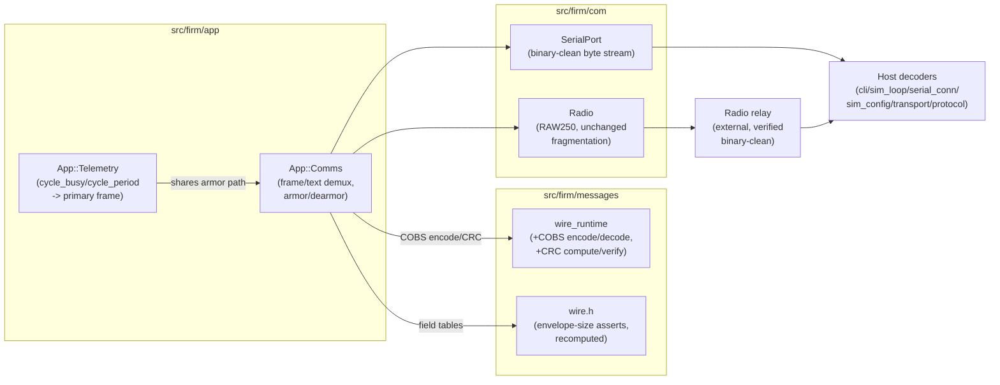

<!-- CLASI: Before changing code or making plans, review the SE process in CLAUDE.md -->

# Sprint 123: Firmware base hardening: COBS+CRC binary framing + telemetry migration

## Goals

Leadoff sprint of the firmware-base-hardening restructuring (first of
three: 123 → 124 → 125). Replaces the wire's base64 line-armor with
COBS framing + a CRC, and migrates the sprint-122 interim
`cycle_busy`/`cycle_period` loop-timing fields from the secondary
diagnostic frame back to the per-cycle primary `Telemetry` frame now
that the freed headroom makes room for them. This unblocks sprint 124's
wider per-wheel telemetry (commanded duty + observed + raw encoder state
per wheel) and gives the base the wire integrity its "never lies, never
hides latency, never ships corruptible frames" contract has never
actually had.

## Problem

The wire framing today is `*B` + `base64(protobuf envelope)` + `\r\n`
(`Comms::sendReply()`/`decodeArmoredLine()`, `src/firm/app/comms.cpp`;
mirrored on the host in `io/{cli,sim_loop,serial_conn,sim_config}.py`,
`testgui/transport.py`, `robot/protocol.py`). Two costs, both real today:

1. **Base64 expands payload by 33%**, and the USB-CDC serial path already
   sits on a hard, non-tunable vendor ceiling (`SerialPort::begin()`'s
   `setTxBufferSize(255)`, a `uint8_t` max — 254 usable bytes, ASYNC mode
   silently truncates mid-line on overflow). The primary telemetry
   frame's armored envelope already sits 1 byte under its own 186-byte
   budget — this is why sprint 122's `cycle_busy`/`cycle_period` fields
   could not land on the primary frame and went to `TelemetrySecondary`
   as a stated interim (`src/firm/app/DESIGN.md`'s own "122-003" note,
   `docs/design/design.md`'s own "122" note — both explicitly point at
   this sprint as the fix).
2. **There is no integrity check anywhere on the wire.** On the
   documented-lossy radio relay, a corrupted envelope either fails
   protobuf parse and vanishes silently or (worse) mis-parses. A base
   whose whole contract is "never lies" has no way to know a frame lied
   to it.

## Solution

Per `clasi/issues/cobs-crc-binary-framing-replace-base64-armor.md`:

1. Add COBS (Consistent Overhead Byte Stuffing, ~0.4% overhead, `0x00`
   frame delimiter, self-resynchronizing on byte loss) + a CRC to
   `wire_runtime.{h,cpp}` as new, schema-agnostic byte primitives —
   the same layer that already holds varint/zigzag/base64 today.
2. Rewire `App::Comms` (`comms.cpp`) and the two transports
   (`com/serial_port.*`, `com/radio.*`) from line-buffered `*B<base64>\r\n`
   armor to a binary-clean byte stream that demuxes `0x00`-delimited COBS
   frames from `\r\n`-terminated text lines (the HELLO/PING safety rump —
   the one hard coexistence constraint the issue flags explicitly).
   Recompute `wire.h`'s envelope-size budget asserts against COBS+CRC
   overhead instead of base64's.
3. Update every host decoder (`io/cli.py`, `io/sim_loop.py`,
   `io/serial_conn.py`, `io/sim_config.py`, `testgui/transport.py`,
   `robot/protocol.py`) to the same framing, and confirm the radio relay
   passes COBS+CRC frames through unchanged (binary-clean, RAW250
   fragmentation untouched).
4. Migrate `cycle_busy`/`cycle_period` off `TelemetrySecondary` onto the
   per-cycle primary `Telemetry` frame, now that removing base64's
   expansion restores primary-frame headroom.
5. Reconcile the design docs this change touches (`docs/design/design.md`,
   `src/firm/com/DESIGN.md`, `src/firm/messages/DESIGN.md`,
   `src/firm/app/DESIGN.md`, `src/host/DESIGN.md`,
   `src/host/robot_radio/DESIGN.md`).
6. Bench-verify on the real link (serial + radio relay) per
   `.claude/rules/hardware-bench-testing.md` — this changes the actual
   wire, not just its content.

## Success Criteria

- Serial + radio-relay round-trips carry envelopes larger than today's
  252-byte armored ceiling without truncation.
- A corrupted frame (fault-injected bit flip/truncation) is detected by
  CRC and dropped — on both the firmware decode path and the host decode
  path — never silently mis-parsed.
- `wire.h`'s `kReplyEnvelopeMaxEncodedSize`/`kTelemetrySecondaryMaxEncodedSize`
  (and `kCommandEnvelopeMaxEncodedSize`) are recomputed for COBS+CRC
  overhead; primary-frame headroom is restored and measured.
- The HELLO/PING text safety rump still works, interleaved with binary
  frames, on both transports.
- `cycle_busy`/`cycle_period` are staged on the primary `Telemetry` frame
  every cycle (not just at `TelemetrySecondary`'s ~5 Hz cadence); a sim
  test asserts exact per-cycle values under the virtual clock.
- Full sim suite green; host + TestGUI decode the new framing; bench
  gate passed on the stand (sensors alive, wheels drive and encoders
  run, real-link round-trip on both serial and radio relay, corrupted-
  frame fault injection confirmed on real hardware).
- Design docs reconciled; `close_sprint`'s design validation passes.

## Scope

### In Scope

- COBS + CRC primitives (`wire_runtime.{h,cpp}`).
- Firmware framer rewrite: `comms.cpp`, `com/serial_port.*`,
  `com/radio.*` — binary-clean byte stream, text/binary demux.
- `wire.h` envelope-size budget recompute (and the generator, if the
  budget constants are generated — confirm at ticket time).
- Host decoder rewrite: every `*B<base64>` producer/consumer
  (`io/cli.py`, `io/sim_loop.py`, `io/serial_conn.py`, `io/sim_config.py`,
  `testgui/transport.py`, `robot/protocol.py`).
- Radio-relay binary-clean verification.
- `cycle_busy`/`cycle_period` migration: `TelemetrySecondary` → primary
  `Telemetry` frame (proto, frame staging, codec regen, host `TLMFrame`,
  TestGUI display).
- Design-doc reconciliation for every doc this change touches.
- Bench verification (stand-mounted, both transports, fault injection).

### Out of Scope

- The explicit-dataflow loop rewrite, the duty-boundary migration, the
  per-wheel command observer, and the `NezhaMotor` shrink — sprint 124's
  scope entirely; this sprint touches none of the motor/observer stack.
- Characterization, the base gate, and the freeze declaration — sprint
  125's scope, gated on sprint 124 landing first.
- Any protocol VERSION negotiation or dual-stack (old-armor / new-armor)
  transition period — this is planned as a single flag-day cutover (see
  Migration Concerns), matching how the MOVE protocol cutover (sprint
  116) and the protocol-v3 cutovers before it were done.
- Any change to `CommandEnvelope`/`ReplyEnvelope`/`TelemetrySecondary`'s
  own schema (field shapes) beyond the size-budget recompute and the
  `cycle_busy`/`cycle_period` frame relocation — this sprint changes how
  bytes are framed and protected, not what they mean.

## Test Strategy

Three layers, matching the issue's own acceptance criteria:

1. **Unit (firmware, host-buildable):** COBS encode/decode round-trip
   (including the `0x00`-only-as-delimiter property), CRC detection on
   fault-injected corruption (bit flip, truncation, over-length), text-
   line-vs-binary-frame demux on a synthetic mixed byte stream.
2. **Integration (sim):** full sim suite must stay green — this is a
   framing-layer change, not a schema change, so every existing
   scenario's assertions on decoded message CONTENT are unaffected;
   what changes is provably only the bytes on the wire. The
   `cycle_busy`/`cycle_period` migration gets its own sim test asserting
   exact per-cycle values on the primary frame (mirroring sprint 122
   ticket 003's own virtual-clock assertion, relocated).
3. **Bench (real hardware, required — this changes the actual wire):**
   serial + radio-relay round-trip at envelope sizes above today's
   252-byte ceiling; a fault-injection test that corrupts a real frame in
   transit and confirms the firmware/host both drop it and count the
   fault rather than mis-parsing; the standing hardware-bench-testing.md
   checklist (sensors alive, wheels drive and encoders run in both
   directions, round-trip over both transports) since this sprint touches
   the transport layer directly.

No behavior-parity baseline is needed the way sprint 122's pure-move
tickets needed one — this sprint's job is a wire-format change with an
explicit before/after (byte overhead, integrity), not a zero-behavior-
change refactor.

## Architecture

**Substantial — touches 4+ modules across both firmware and host
(`messages/wire_runtime`, `app/comms` + the two `com/` transports,
`messages/wire.h`'s size budget, `app/telemetry`, six host decoder
files), and introduces a new cross-cutting mechanism (COBS framing +
CRC integrity) that did not exist on this wire before.** Full 7-step
methodology, with a component diagram; the dependency-DIRECTION diagram
is omitted with reason (see Step 4) since no module's dependency
direction changes — only the encoding within the existing
transport→codec→application chain changes.

### Step 1 — Understand the Problem

The wire's armor (`*B<base64>\r\n`) was chosen years ago for
text-channel coexistence with the HELLO/PING safety rump, at a time when
neither the 33% base64 expansion nor the total absence of an integrity
check had yet become a measured cost. Sprint 122 hit the expansion cost
directly (`cycle_busy`/`cycle_period` had nowhere to land on the primary
frame) and stated this sprint as the fix. The lack of a CRC is a
standing gap against the base's own "never lies, never hides latency"
contract, unrelated to sprint 122 but equally overdue given the
documented-lossy radio relay. Both costs share one root cause (the armor
scheme itself) and one fix (COBS+CRC), so they belong in one sprint
rather than two.

### Step 2 — Identify Responsibilities

Four responsibility groups, each changing for its own reason:

1. **Byte-level framing primitives** (COBS encode/decode, CRC
   compute/verify) — schema-agnostic, reusable, the same layer
   `wire_runtime` already occupies for varint/zigzag/base64.
2. **Frame/text demux and dispatch** (`Comms`, the two transports) —
   decides, on a shared byte stream, whether the next complete unit is a
   `0x00`-delimited binary frame or a `\r\n`-terminated text line, and
   routes each to the right decode path.
3. **The envelope-size budget** (`wire.h`'s static-asserted constants) —
   a pure bookkeeping consequence of primitive 1's overhead replacing
   base64's; no schema change, only the constant and its derivation.
4. **Loop-timing telemetry placement** (`cycle_busy`/`cycle_period`) —
   independent of 1-3 in mechanism (it is a frame-content relocation, not
   a framing-format change) but causally unblocked by them (there is no
   room for these fields on the primary frame until the armor's expansion
   is gone).

Host decoder updates and design-doc reconciliation are not separate
responsibilities — they are propagation of responsibility groups 1-2 to
every consumer.

### Step 3 — Define Subsystems and Modules

| Module | Purpose (one sentence, no "and") | Boundary | Use cases served |
|---|---|---|---|
| **`wire_runtime`** (`src/firm/messages/wire_runtime.{h,cpp}`, changed) | Supplies COBS encode/decode and CRC compute/verify as raw, schema-agnostic byte primitives alongside the existing varint/zigzag primitives. | Inside: COBS frame encode/decode, CRC-16 or CRC-32 compute/verify (width TBD, see Design Rationale), no field-number or `msg::` knowledge. Outside: frame/text demux (that's `Comms`'s job), schema tables (`wire.h`). | SUC-001, SUC-002 |
| **`Comms` + transports** (`src/firm/app/comms.cpp`, `src/firm/com/serial_port.*`, `src/firm/com/radio.*`, changed) | Turns a shared byte stream into either a decoded `CommandEnvelope` or a recognized text-rump line, and the reverse for outbound frames. | Inside: `0x00`-delimited binary frame recognition, `\r\n` text-line recognition on the SAME stream, dearmor/armor calls into `wire_runtime`, dispatch to `wire.h`'s encode/decode. Outside: schema field tables, the HELLO/PING command semantics themselves (unchanged), RAW250 fragmentation internals (unchanged, `Radio` still reassembles before `Comms` ever sees a line). | SUC-001, SUC-002, SUC-003, SUC-004 |
| **Wire budget** (`src/firm/messages/wire.h`, `scripts/gen_messages.py` if generated, changed) | States, and asserts at build time, the worst-case encoded size of each envelope kind against the transport's real ceiling. | Inside: the three `kXxxMaxEncodedSize` constants and their `static_assert`s, recomputed for COBS+CRC overhead. Outside: the encode/decode logic itself (primitive 1's job), the schema shapes (unchanged). | SUC-001, SUC-005 |
| **`Telemetry` frame staging** (`src/firm/app/telemetry.{h,cpp}`, `protos/telemetry.proto`, changed) | Stages the outbound frame's content, including — after this sprint — `cycle_busy`/`cycle_period` on the primary frame rather than the secondary. | Inside: the two fields' relocation, `RobotLoop`'s existing `previousCycleStartUs_`/`everCycled_` bookkeeping (unchanged, sprint 122's own mechanism, only the destination frame moves). Outside: framing/armor (module 2's job), any other frame content. | SUC-005 |
| **Host decoders** (`src/host/robot_radio/io/{cli,sim_loop,serial_conn,sim_config}.py`, `testgui/transport.py`, `robot/protocol.py`, changed) | Decode/encode the same wire semantics through the new COBS+CRC framing instead of `*B<base64>`. | Inside: framing/armor logic only. Outside: everything above the framing layer (`NezhaProtocol`'s command builders, `TLMFrame`'s field semantics, TestGUI panels) — all unchanged, since this sprint changes bytes-on-the-wire, not message content. | SUC-001, SUC-002, SUC-003, SUC-005 |
| **Radio relay** (external firmware, verified not modified) | Forwards raw bytes between host and robot inside the data plane (`!GO`) unchanged. | Inside (verification only): confirming RAW250 fragmentation stays binary-clean under COBS's `0x00` delimiter. Outside: any code change to the relay itself — out of this repo. | SUC-004 |

### Step 4 — Diagrams

**Component diagram — required** (4+ modules touched, new cross-cutting
mechanism introduced):



**Dependency-direction diagram — omitted.** No module's dependency
DIRECTION changes: `com/` still has zero dependency on `app/`/
`messages/`, `app/comms.cpp` still depends on `messages/` (never the
reverse), and the host still depends on the firmware's wire schema
(never the reverse). Only the ENCODING wire_runtime/Comms produce and
the host decodes changes — a diagram of unchanged dependency arrows would
add nothing the component diagram above doesn't already show.

**Entity-relationship diagram — not applicable.** No data-model/entity
change; `CommandEnvelope`/`ReplyEnvelope`/`TelemetrySecondary`'s own
field shapes are untouched by this sprint (only their encoded framing
and, for the two timing fields, which frame they ride on).

### Step 5 — Complete the Document

**What Changed:** The line-armor scheme (`*B<base64>\r\n`) is replaced
end-to-end (firmware encode, firmware decode, both transports, every host
decoder, the relay verified compatible) with COBS framing (`0x00`
delimiter, ~0.4% overhead) plus a CRC (width decided at ticket time — see
Design Rationale). The envelope-size budget is recomputed against the new
overhead. `cycle_busy`/`cycle_period` move from `TelemetrySecondary` to
the primary `Telemetry` frame, riding the restored headroom.

**Why:** Base64's 33% expansion was the direct cause of sprint 122's
telemetry fields being unable to land where they belong (the primary,
per-cycle frame); the wire has never had any integrity check, a real gap
against the base's "never lies" contract on a documented-lossy radio
link.

**Impact on Existing Components:** `Comms`'s dearmor/armor call sites
change their byte-level implementation but keep their existing
signatures and call-site contract (`sendReply()`/`decodeArmoredLine()`
equivalents) — callers elsewhere in `app/` (Telemetry, RobotLoop) are
unaffected beyond the one frame-placement change (`cycle_busy`/
`cycle_period`). `SerialPort`/`Radio` gain binary-clean byte handling but
keep their existing `send()`/`sendReliable()`/`readLine()`/`poll()`
call-site contracts per `com/DESIGN.md`'s own invariant table (a
non-blocking, bounded-wait pair of senders) — the framing they carry
changes, not their own API. Every host module that touches `*B<base64>`
today changes its decode/encode implementation but not its own
higher-level API (`NezhaProtocol`'s command builders, `TLMFrame`'s
fields).

**Migration Concerns:** This is a wire-format change with no backward
compatibility and no version negotiation — planned as a single flag-day
cutover (firmware + host are always built and deployed together in this
project's bench workflow; there is no independently-versioned external
consumer of this wire format known today). A mid-cutover mismatch
(new firmware + old host, or vice versa) will not decode at all — this
is the same posture the MOVE protocol cutover (sprint 116) and the
protocol-v3 cutovers took, not a new risk this sprint introduces. Flagged
as an assumption to confirm with the stakeholder (Open Question 4 below)
rather than silently assumed.

### Step 6 — Design Rationale

**Decision: COBS + CRC, not a checksum-inside-the-envelope or SLIP-style
escaping.**
- *Context:* the issue names COBS+CRC directly; alternatives are worth
  recording since the choice trades off differently.
- *Alternatives considered:* (a) keep base64, add a checksum FIELD inside
  the protobuf envelope — rejected: does nothing for the 33% expansion,
  and only protects the payload, not the framing/armor bytes themselves;
  (b) a length-prefixed binary framing with no delimiter byte — rejected:
  a single dropped/corrupted length byte desyncs every subsequent frame
  with no resynchronization point, unlike COBS's self-resynchronizing
  `0x00` delimiter, which matters specifically because the radio relay is
  documented-lossy; (c) SLIP-style byte escaping — rejected: variable,
  content-dependent overhead (worse worst-case than COBS's fixed ~0.4%)
  for the same resynchronization property COBS already gives for less.
- *Why this choice:* fixed, low, deterministic overhead; self-
  resynchronizing framing that tolerates the lossy relay; a CRC that
  finally gives the wire the integrity check it has never had.
- *Consequences:* both firmware and host need a binary-clean framer that
  demuxes `0x00`-delimited frames from `\r\n` text lines on the same
  stream (bounded, well-scoped work — text lines never contain `0x00`;
  COBS frames never contain `0x00` except the delimiter, by construction).

**Decision: keep the text safety rump (HELLO/PING) coexisting on the same
channel, rather than moving it to a binary command or a second channel.**
- *Context:* the issue explicitly flags this as "the one real design
  constraint — do not rediscover painfully": base64 was originally chosen
  FOR this coexistence property.
- *Alternatives considered:* moving HELLO/PING onto the binary command
  plane — rejected by the issue itself: the whole point of the text rump
  is answering "is anything alive on this port, in a form a human can
  type" before a decoder needs to understand the binary schema at all;
  removing HELLO/PING's text form loses that.
- *Why this choice:* preserves a human-typeable liveness/identify path
  independent of the binary schema, unchanged from today.
- *Consequences:* the framer must recognize both frame kinds on one byte
  stream — real work, but bounded and already scoped into ticket 002.

### Step 7 — Open Questions

1. **CRC width (16 vs. 32 bits).** The issue names both as candidates.
   Recommendation: CRC-16/CCITT — frames here are small (well under 256
   B even before this change), and a 16-bit CRC gives strong detection at
   half the per-frame overhead of CRC-32. Decided at ticket 001 time,
   informed by the fault-injection test's actual miss-rate measurement,
   not assumed.
2. **Does `Radio`'s existing RAW250 length-prefixed reassembly need its
   OWN CRC in addition to COBS's frame-level CRC, or does the datagram
   framing's existing reassembly make a second check redundant?** The
   issue raises this explicitly without deciding. Ticket 002's bench
   fault-injection test (corruption injected at the relay-transport
   level, not just the byte-stream level) should settle this empirically.
3. **Exact new envelope-budget numbers** depend on the CRC-width decision
   above; ticket 002/003 compute and record the final
   `kReplyEnvelopeMaxEncodedSize`/`kTelemetrySecondaryMaxEncodedSize`/
   `kCommandEnvelopeMaxEncodedSize` values against the real overhead, not
   an estimate.
4. **Should `cycle_busy`/`cycle_period` be REMOVED from
   `TelemetrySecondary` once they ride the primary frame, or kept on both
   temporarily?** Recommendation: remove from secondary — two frames
   independently reporting the same fields risks them silently
   diverging (different cadence, different staleness) with no benefit;
   ticket 004 should confirm this with the stakeholder rather than
   assume it.
5. **Single flag-day cutover, confirmed?** Migration Concerns above
   assumes no external, independently-versioned consumer of this wire
   format exists. Confirm before ticket 002 starts changing bytes that
   are backward-incompatible by construction.

## Use Cases

### SUC-001: Firmware frames replies and telemetry with COBS+CRC instead of base64 armor
Parent: UC (base wire contract)

- **Actor**: Firmware (`App::Comms`/`App::Telemetry`)
- **Preconditions**: A `ReplyEnvelope` or `TelemetrySecondary` frame is
  ready to send.
- **Main Flow**:
  1. `Telemetry`/`Comms` builds the frame's schema-encoded bytes via
     `wire.h`'s `encode()`.
  2. `wire_runtime` COBS-encodes the payload and appends the CRC.
  3. `Comms` hands the framed bytes to the transport (`SerialPort`/
     `Radio`) as a single `0x00`-delimited write.
- **Postconditions**: The host receives a frame that decodes to the same
  message content as before, at ~0.4% overhead instead of 33%.
- **Acceptance Criteria**:
  - [ ] Envelope-budget headroom measured and asserted (`wire.h`).
  - [ ] Byte-for-byte message-content parity vs. the pre-change baseline
        (decoded content unchanged; only the wire bytes differ).

### SUC-002: A corrupted frame is detected via CRC and dropped, not silently mis-parsed
Parent: UC (base wire contract)

- **Actor**: Firmware and host decoders
- **Preconditions**: A frame is corrupted in transit (bit flip,
  truncation).
- **Main Flow**:
  1. The receiver COBS-decodes the frame.
  2. The CRC is recomputed and compared against the received value.
  3. On mismatch, the frame is dropped and a fault is counted (mirroring
     `Comms::malformedCount()`'s existing pattern).
- **Postconditions**: No corrupted content reaches the application layer;
  the drop is observable via a counter/telemetry bit.
- **Acceptance Criteria**:
  - [ ] Fault-injection test (bit flip) confirms drop + counter increment
        on the firmware decode path.
  - [ ] Equivalent fault-injection test on the host decode path.

### SUC-003: Host decoders decode COBS+CRC frames and still recognize the HELLO/PING text rump on the same channel
Parent: UC (base wire contract)

- **Actor**: Host operator / host software (`rogo repl`, TestGUI, bench
  scripts)
- **Preconditions**: Robot connected via serial or radio relay.
- **Main Flow**:
  1. The host reads raw bytes off the transport.
  2. It demuxes `0x00`-delimited binary frames from `\r\n`-terminated
     text lines on the same stream.
  3. Each is decoded on its own path (binary schema decode, or plain text
     line).
- **Postconditions**: `rogo repl`/TestGUI/bench scripts work unchanged
  from the operator's perspective; HELLO/PING still function.
- **Acceptance Criteria**:
  - [ ] Host round-trip test against real firmware passes.
  - [ ] A test interleaving HELLO/PING text lines with binary frames on
        the same connection passes on both transports.

### SUC-004: The radio relay passes COBS-framed binary payloads and CRC bytes through unchanged
Parent: UC (base wire contract)

- **Actor**: Radio relay (external, unmodified)
- **Preconditions**: Relay in data-plane mode (post-`!GO`).
- **Main Flow**:
  1. The relay forwards raw bytes between host and robot unchanged
     (existing RAW250 fragmentation, untouched by this sprint).
  2. A COBS frame (which never contains a `0x00` byte except its own
     delimiter) traverses the relay intact.
- **Postconditions**: Bench round-trip over the relay succeeds at parity
  with the serial path.
- **Acceptance Criteria**:
  - [ ] Radio-relay round-trip bench test passes.
  - [ ] Corrupted-frame-over-relay fault-injection test passes (dropped,
        counted, not mis-parsed).

### SUC-005: `cycle_busy`/`cycle_period` ride the primary per-cycle Telemetry frame
Parent: UC (base wire contract)

- **Actor**: Firmware (`App::Telemetry`) and host telemetry consumers
- **Preconditions**: COBS+CRC framing has landed and restored primary-
  frame headroom.
- **Main Flow**:
  1. `RobotLoop` stages `cycle_busy`/`cycle_period` into the primary
     `Frame` every cycle (unchanged bookkeeping, sprint 122's own
     mechanism — only the destination frame moves).
  2. `Telemetry::emitPrimary()` serializes them onto the primary frame.
  3. Host `TLMFrame`/TestGUI read them every cycle instead of at
     `TelemetrySecondary`'s ~5 Hz cadence.
- **Postconditions**: Every primary frame carries fresh per-cycle timing
  data, not just roughly 1-in-N secondary frames.
- **Acceptance Criteria**:
  - [ ] Sim test asserts exact per-cycle `cycle_busy`/`cycle_period`
        values on the primary frame under the virtual clock.
  - [ ] `TelemetrySecondary`'s copy of the fields is removed or
        explicitly retained, per Open Question 4's resolution — not left
        ambiguous.

## GitHub Issues

(GitHub issues linked to this sprint's tickets. Format: `owner/repo#N`.)

## Definition of Ready

Before tickets can be created, all of the following must be true:

- [ ] Sprint planning document is complete (sprint.md, including its
      Architecture and Use Cases sections)
- [ ] Architecture review passed (or skipped, for changes with no
      architectural impact)
- [ ] Stakeholder has approved the sprint plan

## Tickets

**Tooling note:** this deployed CLASI version's phase order is
`planning-docs → architecture-review → stakeholder-review → ticketing →
executing` (verified against `state_db_class.py`), and `create_ticket` is
gated to `ticketing` phase or later. Advancing out of `stakeholder-review`
requires the `stakeholder_approval` gate, which this planning pass is
explicitly instructed not to record. The six tickets below are therefore
fully specified here, in `sprint.md`, but not yet materialized as
individual `tickets/NNN-*.md` files — once the stakeholder approves and
the phase advances to `ticketing`, call `create_ticket` six times with
the content below (verbatim) to materialize them; no re-planning is
needed at that point.

| # | Title | Depends On | Use Cases |
|---|-------|------------|-----------|
| 001 | COBS + CRC wire-runtime primitives | — | SUC-001, SUC-002 |
| 002 | Firmware framer integration (Comms + transports + wire budget) | 001 | SUC-001, SUC-002, SUC-004 |
| 003 | Host decoder rewrite | 002 | SUC-001, SUC-002, SUC-003 |
| 004 | Telemetry migration: cycle_busy/cycle_period to primary frame | 002, 003 | SUC-005 |
| 005 | Design-doc reconciliation | 002, 003, 004 | SUC-001 – SUC-005 (documentation only) |
| 006 | Bench hardware verification gate | 003, 004 | SUC-002, SUC-003, SUC-004 |

Tickets execute serially in the order listed. All six carry
`issue: cobs-crc-binary-framing-replace-base64-armor.md` (the sprint's
one linked issue — `create_ticket`'s auto-link applies since exactly one
issue is linked).

---

### Ticket 001 — COBS + CRC wire-runtime primitives

```yaml
id: "001"
title: COBS + CRC wire-runtime primitives
status: open
use-cases: [SUC-001, SUC-002]
depends-on: []
issue: cobs-crc-binary-framing-replace-base64-armor.md
```

**Description:** Add COBS frame encode/decode and CRC compute/verify as
new, schema-agnostic byte primitives in `src/firm/messages/wire_runtime.{h,cpp}`
— the same layer that already holds varint/zigzag/fixed32/base64 today.
Decide the CRC width (Open Question 1: recommend CRC-16/CCITT) based on
measured overhead vs. detection strength for this frame size range.

**Acceptance Criteria:**
- [ ] `wire_runtime.h`/`.cpp` gain `cobsEncode()`/`cobsDecode()` and
      `crcCompute()`/`crcVerify()` (or equivalent names following the
      project's lowerCamelCase convention), with the same
      never-partially-write-or-read contract every other `wire_runtime`
      primitive already has (`.claude/rules/coding-standards.md`; no
      `#include` of any other `messages/*.h`, no naming of a `msg::`
      type).
  - [ ] COBS round-trip test: encode then decode recovers the original
        payload exactly, including payloads containing `0x00` bytes and
        payloads at/near the COBS block-size boundary (254 bytes).
  - [ ] CRC test: detects single-bit flip, byte truncation, and
        over-length corruption; a clean frame passes.
  - [ ] CRC width decision recorded with its rationale (measured
        overhead vs. detection strength), not left as an assumption.
  - [ ] Existing `wire_runtime` tests (varint/zigzag/base64 — base64
        stays present for now, removed in ticket 002 once no longer the
        active armor) remain green.

**Implementation Plan:**
- *Approach:* Add the two primitive pairs alongside the existing
  varint/base64 functions; keep base64 in place until ticket 002 cuts
  over (avoids a half-migrated intermediate state within this ticket).
- *Files:* `src/firm/messages/wire_runtime.h`, `wire_runtime.cpp`, new
  unit test file(s) under the existing `src/tests/` tree mirroring how
  `wire_runtime`'s existing primitives are tested today.
- *Testing:* Host-buildable unit tests (no hardware needed for this
  ticket — pure byte-manipulation logic).
- *Docs:* None yet — `messages/DESIGN.md` update rides ticket 005.

---

### Ticket 002 — Firmware framer integration

```yaml
id: "002"
title: Firmware framer integration (Comms + transports + wire budget)
status: open
use-cases: [SUC-001, SUC-002, SUC-004]
depends-on: ["001"]
issue: cobs-crc-binary-framing-replace-base64-armor.md
```

**Description:** Rewire `App::Comms` (`comms.cpp`) and the two transports
(`com/serial_port.*`, `com/radio.*`) from `*B<base64>\r\n` line-armor to a
binary-clean byte stream that demuxes `0x00`-delimited COBS frames from
`\r\n`-terminated text lines (the HELLO/PING rump) on the same channel.
Recompute `wire.h`'s envelope-size budget constants/static_asserts for
COBS+CRC overhead in place of base64's.

**Acceptance Criteria:**
- [ ] `Comms` sends/receives via COBS+CRC instead of base64 armor;
      `sendReply()`/`decodeArmoredLine()`-equivalent call sites keep
      their existing signatures per Impact on Existing Components.
- [ ] A synthetic mixed byte stream (interleaved binary frames and text
      lines) demuxes correctly — text lines never misread as partial
      binary frames and vice versa.
- [ ] `SerialPort`/`Radio` confirmed binary-clean (no assumption that
      the byte stream is line-buffered ASCII); `Radio`'s existing RAW250
      fragmentation is unchanged (Open Question 2 — whether it also
      needs its own CRC — resolved here, informed by ticket 006's
      fault-injection data if sequencing allows, otherwise flagged
      forward).
- [ ] `wire.h`'s `kCommandEnvelopeMaxEncodedSize`/
      `kReplyEnvelopeMaxEncodedSize`/`kTelemetrySecondaryMaxEncodedSize`
      recomputed against real COBS+CRC overhead (not estimated) and
      `static_assert`s pass at the new, larger achievable envelope size.
- [ ] Base64 armor path removed once the cutover is confirmed working
      (no dual-stack left behind — Migration Concerns' flag-day
      cutover).
- [ ] Full sim suite green.

**Implementation Plan:**
- *Approach:* Single flag-day cutover per Migration Concerns/Open
  Question 5 (confirm with stakeholder before starting). Replace armor
  calls in `Comms` first behind the new primitives from ticket 001, then
  confirm both transports pass raw framed bytes through without
  reinterpreting them as text lines.
- *Files:* `src/firm/app/comms.{h,cpp}`, `src/firm/com/serial_port.{h,cpp}`,
  `src/firm/com/radio.{h,cpp}`, `src/firm/messages/wire.h` (and
  `scripts/gen_messages.py` if the budget constants are generated —
  confirm at ticket start).
- *Testing:* Sim suite (full regression — decoded message CONTENT must
  be unaffected); a new demux test for the mixed binary/text stream.
- *Documentation:* `com/DESIGN.md`, `app/DESIGN.md`, `messages/DESIGN.md`
  updates ride ticket 005 (kept together so the reconciliation ticket
  sees the final, settled implementation rather than an in-progress one).

---

### Ticket 003 — Host decoder rewrite

```yaml
id: "003"
title: Host decoder rewrite
status: open
use-cases: [SUC-001, SUC-002, SUC-003]
depends-on: ["002"]
issue: cobs-crc-binary-framing-replace-base64-armor.md
```

**Description:** Update every host consumer/producer of `*B<base64>` to
the COBS+CRC framing: `io/cli.py`, `io/sim_loop.py`, `io/serial_conn.py`,
`io/sim_config.py`, `testgui/transport.py`, `robot/protocol.py`. Preserve
every higher-level API (`NezhaProtocol`'s command builders, `TLMFrame`'s
field semantics) unchanged — only the framing/armor layer changes.

**Acceptance Criteria:**
- [ ] Each of the six files decodes/encodes via COBS+CRC; no remaining
      `base64.b64decode`/`b64encode` call on the wire path (confirm via
      grep, mirroring `messages/DESIGN.md`'s own existing grep-
      verifiable-invariant style).
  - [ ] `SerialConnection`/`NezhaProtocol`/`sim_loop`/TestGUI's
        `transport.py` all pass their existing higher-level test suites
        unchanged (command builders, `TLMFrame` field access untouched).
  - [ ] HELLO/PING text rump still decodes correctly when interleaved
        with binary frames on the same connection (host-side half of
        SUC-003's acceptance).
  - [ ] Fault-injection test: a corrupted frame is dropped on the host
        decode path with a counted fault, not silently mis-parsed
        (host-side half of SUC-002).

**Implementation Plan:**
- *Approach:* Port the firmware's COBS+CRC scheme byte-for-byte
  (same algorithm, same CRC width) to Python; centralize the framing
  logic in one place (`io/serial_conn.py` looks like the natural home,
  given it already owns "byte-level transport concerns" per
  `src/host/robot_radio/DESIGN.md`) rather than duplicating it across
  all six call sites.
- *Files:* `src/host/robot_radio/io/cli.py`, `io/sim_loop.py`,
  `io/serial_conn.py`, `io/sim_config.py`, `testgui/transport.py`,
  `robot/protocol.py`.
- *Testing:* Host-side unit tests for the new framer (round-trip,
  fault-injection); existing host test suite must stay green (`uv run
  python -m pytest`, per the project's own pytest/uv gotcha).
- *Documentation:* `src/host/DESIGN.md`, `src/host/robot_radio/DESIGN.md`
  updates ride ticket 005.

---

### Ticket 004 — Telemetry migration: cycle_busy/cycle_period to primary frame

```yaml
id: "004"
title: Telemetry migration - cycle_busy/cycle_period to primary frame
status: open
use-cases: [SUC-005]
depends-on: ["002", "003"]
issue: cobs-crc-binary-framing-replace-base64-armor.md
```

**Description:** Move `cycle_busy`/`cycle_period` (added to
`TelemetrySecondary` as an interim placement by sprint 122 ticket 003)
onto the primary per-cycle `Telemetry` frame, now that COBS+CRC has
restored primary-frame headroom. Resolve Open Question 4 (remove from
secondary, or keep on both) with the stakeholder before finishing this
ticket.

**Acceptance Criteria:**
- [ ] `cycle_busy`/`cycle_period` present on the primary `Telemetry`
      frame every cycle (proto field addition, `Frame` staging using the
      existing `previousCycleStartUs_`/`everCycled_` bookkeeping —
      unchanged mechanism, only destination frame moves).
- [ ] Sim test asserts exact per-cycle values under the virtual clock
      (mirroring sprint 122 ticket 003's own test, relocated).
- [ ] Host `TLMFrame` and the TestGUI telemetry panel read the fields
      from the primary frame.
- [ ] `TelemetrySecondary`'s copy is removed (or explicitly retained
      with a stated reason) per Open Question 4's resolution — not left
      ambiguous.

**Implementation Plan:**
- *Approach:* Straightforward field relocation now that ticket 002 has
  freed the headroom; reuses sprint 122's existing bookkeeping without
  change.
- *Files:* `src/firm/protos/telemetry.proto`, `src/firm/app/telemetry.{h,cpp}`,
  regenerated `messages/telemetry.h`/`wire.cpp`, host `TLMFrame` decode,
  TestGUI telemetry panel display line.
- *Testing:* Sim unit test (exact virtual-clock values); TestGUI manual
  check that the panel line still displays.
- *Documentation:* `app/DESIGN.md`'s "122-003" interim-placement note
  updated to reflect the completed migration, ride ticket 005.

---

### Ticket 005 — Design-doc reconciliation

```yaml
id: "005"
title: Design-doc reconciliation
status: open
use-cases: [SUC-001, SUC-002, SUC-003, SUC-004, SUC-005]
depends-on: ["002", "003", "004"]
issue: cobs-crc-binary-framing-replace-base64-armor.md
```

**Description:** Update every design doc this sprint's changes touch, so
`close_sprint`'s design validation passes and a future reader finds the
docs accurate: `docs/design/design.md` (§5 "Wire boundary" and the "122"
note's own forward-reference to this sprint), `src/firm/com/DESIGN.md`
(transport binary-cleanliness), `src/firm/messages/DESIGN.md` (base64
invariant replaced by COBS+CRC invariant, budget recompute reflected),
`src/firm/app/DESIGN.md` (Comms framing, telemetry migration completed —
resolves the "122-003" interim-placement note), `src/host/DESIGN.md` and
`src/host/robot_radio/DESIGN.md` (host decoder framing).

**Acceptance Criteria:**
- [ ] All six docs above updated to describe COBS+CRC as the CURRENT
      framing (not "planned" or "interim") once tickets 002-004 land.
- [ ] `messages/DESIGN.md`'s §3 base64-alphabet invariant either removed
      or clearly marked historical/superseded.
- [ ] `close_sprint`'s design validation (`validate_design`) passes with
      no dangling or missing `DESIGN.md`.
- [ ] `docs/design/design.md`'s own "122 (motion-library extraction...)"
      note, which explicitly forward-references "a future COBS+CRC
      framing rework," is updated to point at this sprint as landed,
      not future.

**Implementation Plan:**
- *Approach:* One documentation-only ticket, sequenced last among the
  code tickets so it reconciles against the FINAL, settled
  implementation (mirroring sprint 122 ticket 004's own precedent for
  this exact kind of ticket).
- *Files:* the six docs named above.
- *Testing:* `clasi design validate` (or the `validate_design` MCP tool).
- *Documentation:* this ticket IS the documentation update.

---

### Ticket 006 — Bench hardware verification gate

```yaml
id: "006"
title: Bench hardware verification gate
status: open
use-cases: [SUC-002, SUC-003, SUC-004]
depends-on: ["003", "004"]
issue: cobs-crc-binary-framing-replace-base64-armor.md
```

**Description:** Deploy to the robot on its stand and exercise the new
wire framing on the real link, per
`.claude/rules/hardware-bench-testing.md`'s standing bench gate (this
sprint touches the transport layer directly). Includes the sensors-
alive/wheels-and-encoders/round-trip checklist AND the COBS+CRC-specific
fault-injection check on real hardware (not just sim/unit fault
injection).

**Acceptance Criteria:**
- [ ] Sensors alive: encoders, OTOS, line sensor, color sensor, digital/
      analog ports all respond with plausible, changing values over the
      new framing.
- [ ] Wheels drive and encoders increment correctly (both directions) —
      confirms the new framing carries MOVE commands correctly.
- [ ] Round-trip confirmed over BOTH transports: USB serial at the bench
      AND the radio relay (SUC-004).
- [ ] Envelope sizes above the old 252-byte armored ceiling transmit
      without truncation on both transports.
- [ ] A real, fault-injected corrupted frame (e.g. a deliberately
      bit-flipped test frame, or induced via a lossy-link stress test)
      is dropped and counted on real hardware, not just in the unit/sim
      fault-injection tests from tickets 001-003 (SUC-002).
- [ ] HELLO/PING text rump confirmed working interleaved with binary
      frames on real hardware, both transports (SUC-003).

**Implementation Plan:**
- *Approach:* Follow the Quick Smoke Sequence
  (`.claude/rules/hardware-bench-testing.md`) using `mbdeploy deploy
  --build`, then bench scripts under `src/tests/bench/` (extend or add a
  COBS+CRC-specific fault-injection bench script alongside the existing
  `move_protocol_bench.py`/`tlm_log.py` catalog).
- *Files:* possibly a new `src/tests/bench/cobs_crc_bench.py`; no
  production firmware/host changes expected in this ticket (verification
  only) unless the bench run surfaces a real defect, in which case it is
  fixed here before the gate can pass.
- *Testing:* the bench run itself IS the test; document results (pass/
  fail per checklist item) in the ticket on completion.
- *Documentation:* none beyond recording the bench results.
