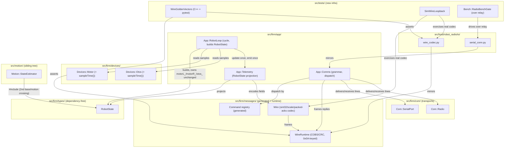
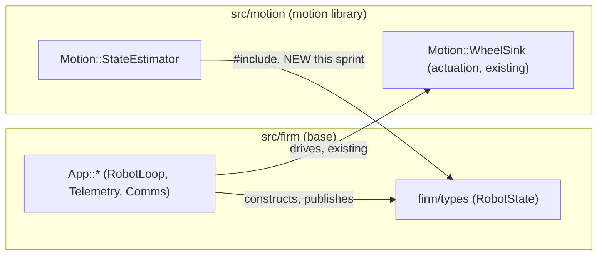

<!-- CLASI: Before changing code or making plans, review the SE process in CLAUDE.md -->

# Sprint 124: Protocol v5, RobotState blackboard, and radio bench gate

## Goals

Land **protocol v5** (one-line-per-packet grammar, `0x0A`-safe COBS,
CRC scope extended to the command name, restored `ID`/`VER`/`PONG`
replies, packed fixed-point telemetry) and the **`RobotState`
blackboard** (one dependency-free struct in `src/firm/types/` that
becomes the sole cross-subsystem and cross-tree data contract, with
`Telemetry` as its lean projection and `TelemetrySecondary` deleted) as
**one atomic wire cutover** — plus fix the relay connect-handshake false
trip and confirm move/config enqueue-ack observability is genuinely
fixed post-123-006. First of the three firmware-base-hardening sprints
(**124 wire/state** → 125 duty boundary/observer → 126
characterization/gate/freeze).

This maps directly onto the stakeholder's stated priority order: (1)
radio commands running reliably, (2) telemetry/state revised, (3) basic
start/stop-the-wheels motion with position telemetry over the radio —
all three are exercised by this sprint's own acceptance gate, run over
the radio relay.

## Problem

Sprint 123 proved the COBS+CRC binary framing sound in principle but
left four compounding problems live on the wire, three of them
hardware-proven:

1. **Two guess-based demuxers, one per language, with no shared vector
   forcing them to agree.** `0x0A` is not COBS-excluded the way `0x00`
   is; firmware's `readLine()` recognizes text by an exact 2-entry
   literal-command match, host's `_looks_like_text()` recognizes it by a
   printable-ASCII content guess. Both are heuristics about the SAME
   byte stream, and their disagreement is exactly what let a
   `move_wheels` envelope containing a literal `0x0A` fail 0/10 on
   hardware (fixed narrowly in 123-006's `febfb450`, but the class of
   defect — two demuxers with no shared contract — is not fixed by one
   patch).
2. **The device announcement, `ID`, and `VER` are incomplete.** Boot
   emission is now restored (123-006, in flight, not re-planned here),
   but `ID`/`VER` don't exist in firmware and the reply grammar
   (`OK pong t=<ms>`) doesn't follow the same rule its own commands do.
3. **Telemetry duplicates state across three consumers by hand-copy**
   (`Frame`, `StateEstimator::Input`, ten scattered `setFlag()` calls)
   from the same primary sources, and `TelemetrySecondary` emits nothing
   of value (no firmware caller populates it beyond `now`) while still
   costing wire budget and tie-break machinery.
4. **The relay path is unmeasured and mistrusts itself before any
   application command runs** — `kFaultCommsMalformed` trips on a clean
   `!GO` connect with zero commands sent, only over the relay, never
   over direct USB. And two USB-only findings from 123's own overnight
   bench work — a residual ~5-11% CRC-caught physical-layer corruption,
   and a since-denied claim about move/config enqueue acks — have never
   been re-measured against the relay path or re-confirmed post-123-006.

Sim did not catch either of 123's hardware-only wire bugs, because
`sim_ctypes` bypasses the real encoder/demux/decoder entirely and passes
envelopes directly — the exact gap the two REQUIRED tickets below close.

## Solution

- **Uniform packet grammar**, both directions, text or binary:
  `<COMMAND>[':' <data>]'\n'`. `0x0A` becomes an unconditional
  terminator — no heuristics, either language, either direction.
- **COBS keyed on `0x0A`** (an XOR over the existing `0x00`-keyed
  encoder's output, parameterized as a delimiter argument on
  `cobsEncode()`/`cobsDecode()` rather than duplicated).
- **CRC input extended to cover `COMMAND ':'`**, not just the payload,
  closing the "bit-flip lands on another valid verb" gap.
- **The reply plane adopts the identical grammar**: `PONG:t=<ms>` (was
  `OK pong t=<ms>`), new `ID:<fields>` and `VER:<version>` handlers, the
  existing `DEVICE:` banner unchanged (it already conforms).
- **A generated command-name registry** (Open Question 2) is the single
  source firmware dispatch, the host codec, and the published protocol
  doc are all generated from or checked against — closing the 3-way
  drift risk a hand-maintained verb list invites.
- **Packed telemetry**: `sint32`/zigzag fixed-point fields (a new
  generator scalar type), a generated `(scale)` field option (not
  hand-honoured documentation — Open Question 8), `age`-not-`time`
  per-sample timestamps (enabled by a new `sampleTime()` accessor on
  `Devices::Motor`/`Devices::Otos`), and packed `acks` (the engine's
  first real `kRepeatedScalar` use).
- **`RobotState`** (`src/firm/types/robot_state.h`, dependency-free,
  float-typed): the one blackboard every subsystem publishes its
  per-cycle section to and the one source `Telemetry::update(state)`
  projects from. `TelemetrySecondary` is deleted outright — frame type,
  wire arm, and tie-break/alternation machinery.
- **Two REQUIRED, non-negotiable test-infrastructure tickets**: shared
  cross-language golden byte vectors (the structural fix for "two
  demuxers, no shared contract"), and a sim/loopback path that exercises
  the REAL encoder→demux→decoder chain off-hardware (the structural fix
  for "sim never caught it").
- **Relay handshake fix**: stop `kFaultCommsMalformed` from tripping on
  a clean connect before any application command.
- **Measure, don't chase**: characterize both USB and relay physical
  paths, state a loss budget for each; this is a measurement ticket, not
  an unbounded hardware investigation (residual USB corruption is
  already 100% CRC-caught — the link is safe, just lossy).

## Success Criteria

All checkable, and the bench gate runs over the **radio relay**, not USB
(per stakeholder directive — a sprint is not done on tests alone):

- [ ] Cross-language golden vectors (all-`0x0A`, all-`0x00`,
      `0x00..0xFF` sweep, empty payload) pass byte-identically in both
      the C++ and pytest suites.
- [ ] Sim/loopback framing test exercises the real wire codec end to
      end (not `sim_ctypes`'s envelope bypass) off-hardware.
- [ ] `move_wheels` embedding a literal `0x0A` executes 10/10 over the
      radio relay (the 123-006 hardware repro, now over relay).
- [ ] `DEVICE:` banner observed at boot on a fresh relay connect with no
      `HELLO` sent; `HELLO`→`DEVICE:`, `PING`→`PONG:`, `ID`→`ID:`,
      `VER`→`VER:` all answer over the relay.
- [ ] `kFaultCommsMalformed` stays clear through a fresh relay connect
      with zero application commands sent.
- [ ] Encoder positions climb in telemetry while a move runs, over the
      relay; enqueue and completion acks are both observed.
- [ ] A `wire_truth`-equivalent wire-quality measurement runs over the
      relay with a stated loss budget, alongside the equivalent USB
      measurement (both paths characterized, neither investigated
      open-endedly).
- [ ] `cycle()` contains exactly one `tlm_.update(state)` call and zero
      `setFlag()` calls (grep-enforceable).
- [ ] `TelemetrySecondary`'s frame type, wire arm, and tie-break
      machinery are gone from the diff, not just unused.
- [ ] Regenerated `kReplyEnvelopeMaxEncodedSize` ≤ 130 B.
- [ ] A wheel's position never silently clips: `RobotLoop` calls the
      *existing, unmodified* `Motor::rebaseline()` (never
      `resetPosition()`) when position nears the `±32 m` wire bound, and
      an observable `positionEpoch` lets the host detect the rebase — no
      device command is ever sent to perform it.
- [ ] `Devices::Motor`/`NezhaMotor`/`MotorArmor` are unmodified by this
      sprint (grep-enforceable — the offset/rebaseline mechanism they
      already carry is reused as-is).

## Scope

### In Scope

- The full atomic wire cutover: framing grammar, `0x0A`-safe COBS,
  extended CRC scope, reply-plane grammar (`PONG`/`ID`/`VER`), the
  command-name registry.
- Packed telemetry: `sint32`/zigzag, `(scale)` option, packed `acks`,
  `age` timestamps (+ the `sampleTime()` accessor prerequisite), bound
  fixes (`flags`, `ack_err`).
- The `RobotState` struct, `Telemetry` as its projection,
  `TelemetrySecondary` deletion, primary-frame pruning.
- Cross-language golden vectors and the sim/loopback framing path
  (REQUIRED, non-negotiable).
- Relay handshake fix (`kFaultCommsMalformed` false trip).
- Physical-layer measurement (both USB and relay) with a stated loss
  budget; confirmation (or fix) of move/config enqueue-ack
  observability post-123-006.
- The standing radio-relay bench gate.
- `RobotLoop`'s `cycle()` restructured enough to build `RobotState` once
  and call `Telemetry::update()`/`emit()` once — **without** requiring
  the Drive/Sensors device-ownership reshuffle (see Design Rationale,
  Decision 1 — the scope valve).

### Out of Scope (deferred to sprint 125)

- The Drive/Sensors device-ownership reshuffle: named bus-phase methods
  (`requestLeft()`/`collectLeft()`/`requestRight()`/`collectRight()`)
  and `RobotLoop` owning no devices at all. **Valve pulled — deferred.**
  See Design Rationale, Decision 1, for the reasoning.
- The duty-primitive migration, the per-wheel command observer, and the
  `NezhaMotor` shrink (125's own scope).
- Any motion-library semantics: twist decomposition, kinematics,
  odometry/pose, estimator/OTOS fusion, shaping, chain hand-off, settle
  completion, heading hold, tours.
- Characterization battery, numeric gate, and freeze declaration (126).

## Test Strategy

- **Unit/property, both languages**: known-answer COBS vectors (all-
  `0x0A`, all-`0x00`, `0x00..0xFF` sweep, empty payload), a property test
  (random payloads ≤251 B round-trip and never contain `0x0A`), grammar
  edge cases (data containing `:`, data containing `0x00`, a stray
  trailing `:` on a no-data verb, an unknown command, a truncated line).
- **Differential test**: the same fixture vectors produce byte-identical
  frames from the firmware and host codecs — this is the cross-language
  golden-vector ticket, not a nice-to-have.
- **CRC-scope test**: identical payload under two different command
  names must produce two different CRCs; a mutated command byte must
  fail verification, not dispatch.
- **`sint32`/scale round-trip**: negative values at each declared bound
  encode to the documented width (a regression test against the
  `int32` sign-extension trap); scale round-trip within the declared
  quantum across the full range including both bounds and zero.
- **Timestamp independence**: a sim run shows `enc_left.age` and
  `enc_right.age` differing by roughly the `kClear`+`kSettle`
  separation, never equal, never zero.
- **Sim/loopback framing** (REQUIRED): the real encode→COBS→decode chain
  exercised off-hardware, closing the gap that let both of 123's wire
  bugs reach hardware before being caught.
- **Bench, over the radio relay** (per
  `.claude/rules/hardware-bench-testing.md`): banner-at-connect,
  `HELLO`/`PING`/`ID`/`VER`, `move_wheels` start/stop with climbing
  encoders, enqueue+completion ack observability, and a wire-quality
  measurement against a stated loss budget. Also re-run direct-USB
  equivalents for comparison, not as a substitute for the relay gate.
- **Fault injection**: bit-flip and truncation tests on both the
  firmware and host decode paths, confirming drop + counted fault, never
  silent mis-parse or crash.

## Architecture

#### Revision 1 (team-lead review, 2026-07-25)

The original Decision 6 below incorrectly asserted that firmware already
zeroes encoders per drive/move command, based on a stale project memory
(`encoder-odometry-drive-reset.md`) describing pre-gut firmware. Verified
against the current tree: `grep -rn "resetPosition" src/` (excluding
`src/archive/`) returns zero production callers — every hit is
device-layer plumbing (`Devices::Motor`/`MotorArmor`) or test harnesses;
`grep -n "reset" src/firm/app/robot_loop.cpp` returns nothing. The
115-117 minimal-firmware program removed the call path the memory
described, and it was never restored. `EncoderReading.position`
therefore accumulates monotonically for the **entire session**, exactly
the case Q9 itself flagged. Decision 6 was first corrected to a
wire-projection-only rebaseline living inside `Telemetry` — see Revision
2 below, which supersedes that first correction with a stakeholder
ruling and a materially better mechanism this sprint doesn't even need
to build.

#### Revision 2 (stakeholder ruling, 2026-07-25)

Stakeholder ruling, verbatim in substance: firmware must never issue a
device command to reset the encoder — the vendor motor controller
doesn't do that either, it reads raw accumulated ticks and holds a
**software** offset, reporting `raw - offset`; rebaselining must be a
pure subtraction, zero bus traffic, because the loop's bus budget
(the brick holds exactly one pending read; L-settle/clear/R-settle are
already the tight part of the cycle) cannot afford an extra per-move
device command.

This overrides Revision 1's mechanism, and, on inspection of the actual
device layer, turns out to already exist: `Devices::Motor::rebaseline()`
(`src/firm/devices/motor.h:99`, `"software-only re-anchor; no bus
traffic"`) and `NezhaMotor::softRebaseline()`
(`src/firm/devices/nezha_motor.cpp:859-880`) already fold the current
cached position back into `encOffset_` (`int32_t`, raw tenths-of-degree
units) and zero the local cache — **issuing no I2C transaction at all**.
`MotorArmor::processResetIfPending()` already knows the difference
between this and a real hard reset: a staged `resetPosition()` dispatches
`inner_.resetPosition()` (hard, bus-touching) only at verified standstill,
and `inner_.rebaseline()` (soft) otherwise. All of this is built and
tested (`tests/sim/unit/devices_motor_harness.cpp`) — it is simply
**uncalled from any production code path** today (matching the earlier
finding that `MotorCommand.reset_position` has no firmware handler).

Decision 6 is corrected in place below a second time: the mechanism is
the *existing, unmodified* `rebaseline()` primitive, called directly
(never through the staged `resetPosition()` path, which can still choose
a hard bus-touching reset at standstill — forbidden outright by this
ruling), from a new caller in `RobotLoop` that decides *when*. No changes
to `Devices::Motor`/`NezhaMotor`/`MotorArmor` are needed at all. The
Success Criteria, Migration Concerns, and Step 3 module table below are
updated to match.

**Substantial** — this sprint rewrites the wire grammar across every
layer of the comms stack (transport, framing, CRC scope, message
encoding) on both firmware and host, introduces a new dependency-free
shared-state type (`RobotState`) that crosses the base↔motion boundary
a *second* time alongside `Motion::WheelSink`, deletes an entire message
type (`TelemetrySecondary`) and its associated machinery, and adds two
new pieces of test infrastructure. This is well past "one new module, no
new cross-module dependency" — it is a new cross-module dependency
(`src/motion` ← `src/firm/types`), a data-model change (the wire
schema), and 8+ touched modules. The full 7-step methodology applies.

#### Step 1: Understand the Problem

Covered above (Problem/Solution). The two issues driving this sprint
(`protocol-v5-...md`, `robot-state-blackboard-...md`) already state
their wire changes must land as one atomic cutover — this section turns
that combined plan into module boundaries and resolves the open
questions both issues left unanswered.

#### Step 2: Identify Responsibilities

Distinct responsibilities this sprint introduces or changes, grouped by
what changes together:

- **The command-name registry** — the closed verb set and its
  binary/cleartext discriminator. Changes only when a new verb is added;
  independent of framing mechanics.
- **Framing mechanics** (COBS delimiter, CRC scope, grammar parse/emit)
  — changes only when the wire's own byte-level contract changes.
- **Physical transport delivery** (`SerialPort`/`Radio`: one line in,
  one line out) — changes only for transport reasons (buffer sizing,
  terminator convergence), never for grammar reasons.
- **Message field encoding** (`sint32`/zigzag, `(scale)`, packed
  `acks`, bound validation) — changes when the schema's field types
  change; independent of framing.
- **`RobotState`'s shape and lifecycle** — what belongs in the
  blackboard, who publishes which section when. Changes when a
  subsystem's shared data needs change.
- **Telemetry-as-projection** (`Telemetry::update()`/`emit()`, flag
  derivation, `TelemetrySecondary` deletion) — changes when what the
  host needs from `RobotState` changes; independent of `RobotState`'s
  own construction.
- **Cross-language wire-correctness test infrastructure** (golden
  vectors, sim/loopback path) — changes when a new wire behavior needs a
  shared assertion; this is genuinely new infrastructure, not a
  extension of existing per-language unit tests.
- **Relay connect-handshake correctness** — an independent defect
  (predates this sprint, unrelated to the framing grammar) that happens
  to gate this sprint's own acceptance criterion (a clean relay bench
  run).
- **Physical-layer measurement** — an independent, bounded
  measurement/characterization task, explicitly not a debugging
  expedition.

#### Step 3: Define Subsystems and Modules

**`Firm::Types::RobotState`** — `src/firm/types/robot_state.h` (new).
Purpose: holds one cycle's worth of shared robot state as the sole
cross-subsystem and cross-tree data contract. Boundary: inside —
per-section plain-data structs (time, per-wheel sensed+commanded,
otos, perception, pose, estimate, command, health); cstdint-level
includes only, no `msg::`/`messages/` types, no methods beyond trivial
accessors. Outside — config/calibration/persisted tuning, ack
bookkeeping (protocol concern, not robot state), anything not per-cycle
dynamics. Serves: state-single-source SUC, the base↔motion `RobotState`
crossing.

**Command-name registry** (new, generated) — a new schema (e.g.
`src/protos/commands.proto`) processed by `gen_messages.py`. Purpose:
declares the closed verb set and, per verb, whether its data is binary
or cleartext. Boundary: inside — verb name/doc/binary-flag; outside —
the actual codec (`wire_runtime`/`wire`), grammar parsing (`Comms`), and
dispatch behavior (`Comms`/`RobotLoop`). Serves: registry SUC (closes
the firmware/host/doc 3-way drift risk).

**`Firm::Messages::WireRuntime`** (modified) —
`src/firm/messages/wire_runtime.{h,cpp}`. Purpose: performs
delimiter-parameterized COBS encode/decode and CRC compute. Boundary:
inside — `cobsEncode()`/`cobsDecode()` taking a delimiter parameter
(default `0x00`; callers pass `0x0A`), `crc16`, `zigzagEncode32/64`
(existing, currently unused, now wired up). Outside — command-name
parsing, frame-level grammar, scalar field packing policy. Serves:
`0x0A`-safe framing SUC.

**`Firm::Messages::Wire` + `gen_messages.py`** (modified codegen) —
`src/firm/messages/wire.{h,cpp}`, `src/scripts/gen_messages.py`.
Purpose: encodes/decodes typed message fields to/from the wire's
schema-described byte layout. Boundary: inside —
`ScalarType::kSint32` + generated `(scale)` conversion, the engine's
first real `FieldKind::kRepeatedScalar` use (packed `acks`), bound
validation fixes. Outside — the COBS/CRC layer beneath it, the
command-name grammar above it. Serves: packed-telemetry SUC.

**`App::Comms`** (modified) — `src/firm/app/comms.{h,cpp}`. Purpose:
parses/emits exactly one wire line per packet: command prefix, CRC
scope, dispatch of text vs. binary by registry lookup. Boundary: inside
— the `<COMMAND>[':' data]'\n'` grammar, CRC-over-command-and-payload,
the reply-plane grammar (`PONG`/`ID`/`VER`/`DEVICE`), `malformedCount()`.
Outside — device state, physical transport framing, telemetry content.
Serves: uniform-grammar SUC, `ID`/`VER`/`PONG` SUC.

**`Com::SerialPort` / `Com::Radio`** (modified transports) —
`src/firm/com/serial_port.cpp`, `src/firm/com/radio.{h,cpp}`. Purpose:
deliver/emit exactly one `\n`-terminated line per packet over a
physical channel. Boundary: inside — buffering/reassembly, unconditional
`\n` split (deletion of `kTextCommands[]`/`isRecognizedTextCommand()`),
`send()`/`sendText()` terminator convergence. Outside — deciding what a
line means. Serves: uniform-grammar SUC.

**`App::Telemetry`** (modified) — `src/firm/app/telemetry.{h,cpp}`.
Purpose: projects `RobotState` into the wire `Telemetry` message.
Boundary: inside — `update(const RobotState&)` (flag derivation, scaled
field conversion, `age` timestamps), `emit(now)`. Outside —
`RobotState`'s own construction, COBS/CRC framing. `TelemetrySecondary`
and its tie-break/alternation machinery are deleted, not deprecated.
Serves: state-as-telemetry-source SUC, secondary-frame-deletion SUC.

**`App::RobotLoop`** (modified) — `src/firm/app/robot_loop.{h,cpp}`.
Purpose: runs one cycle: read primaries into `RobotState` once,
dispatch commands, publish each section at its coherence point, call
`Telemetry::update()`/`emit()` exactly once. Boundary: inside — the
cycle's phase sequencing; **device ownership (`motorL_`/`motorR_`/
`otos_`/`line_`/`color_` as direct `RobotLoop` members) is UNCHANGED
this sprint** — see Decision 1. New this sprint: the per-wheel
position-rebaseline trigger (calls the existing `Motor::rebaseline()`
directly when a wheel's position nears the wire bound, owns the
`positionEpoch` counter — Decision 6). Outside — the Drive/Sensors
ownership reshuffle (125), packed-field encoding (`Telemetry`'s job).
Serves: state-single-source SUC, position-rebaseline policy.

**`Devices::Motor` / `Devices::Otos`** (modified) — add a `sampleTime()`
[us] accessor (the `nowUs` of the tick that produced the current
reading). Boundary: inside — this one accessor; outside — everything
else about their existing generic API. **Unchanged by this sprint**: the
existing `rebaseline()`/`softRebaseline()` software-only offset
mechanism (`encOffset_`) — see Decision 6 — is reused as-is, with no new
device-layer code. Serves: independent-timestamps SUC (the enabling
change for `age` fields — must land first), position-rebaseline policy
(Decision 6).

**`Motion::StateEstimator`** (modified, sibling tree) —
`src/motion/state_estimator.h`. Purpose: consumes `RobotState`
(replacing its private, near-duplicate `Input` struct) to produce the
fused pose/twist estimate. Boundary: inside — the estimator's own
algorithm, now `#include`-ing `src/firm/types/robot_state.h`. Outside —
how `RobotState` gets filled (the base's job). Serves: the base↔motion
`RobotState` crossing.

**Host `wire_codec.py` / `serial_conn.py`** (modified) — mirrors the
`WireRuntime`/`Wire`/`Comms`/transport changes above; deletes
`_looks_like_text()`/`_TEXT_SAFE_BYTES` and the dead `TLM`/`EVT`/
`OK|ERR|CFG|ID` text-branch routing; adds `PONG:`/`ID:`/`VER:` handling.

**`Tests::WireGoldenVectors`** (new, REQUIRED) — a shared fixture of
framed byte strings, asserted identically by a C++ test and a pytest.
Boundary: inside — the vector data and minimal per-language harness
glue; outside — the codecs themselves (already covered above). This is
the structural fix for "two demuxers, no shared contract."

**`Tests::SimWireLoopback`** (new, REQUIRED) — exercises the real
encode→COBS→decode chain off-hardware, distinct from `sim_ctypes`'s
envelope-bypass path. Boundary: inside — a harness that serializes
through the real wire codec and feeds the resulting bytes back through
the real demux/decoder; outside — plant physics (`SimPlant`'s job,
untouched). This is the structural fix for "sim never caught it."

**Relay handshake fix** — site TBD pending the ticket's own
investigation (most likely `serial_conn.py`'s relay-connect path, per
the issue's own "Direction" section; possibly the relay dongle's own
firmware if the artifact proves to be leaked control-plane bytes rather
than a host-side race). Boundary: inside — whatever settle/drain fix
the investigation lands on; outside — the wire grammar itself (an
unrelated bug class this sprint happens to also need clean for its own
bench gate).

**`Tests::Bench::RadioBenchGate`** (new/extended bench script,
promoting the scratchpad `wire_truth.py`-style probe into
`src/tests/bench/`) — this sprint's acceptance gate, run over the radio
relay: banner, `HELLO`/`PING`/`ID`/`VER`, `move_wheels` start/stop with
climbing encoders, enqueue+completion acks, and a wire-quality
measurement against a stated loss budget.

#### Step 4: Diagrams

**Component diagram** — required: 3+ modules touched, plus a new
cross-module dependency (`src/motion` ← `src/firm/types`).

**Dependency graph** — the base↔motion crossing this sprint adds,
alongside the existing `Motion::WheelSink` actuation crossing:

No cycles: `firm/types` has zero outward dependencies (a pure data
leaf, same shape as `Motion::WheelSink`); `Motion::StateEstimator`
depends on it one-way, same direction as the existing `WheelSink`
crossing. Fan-out stays within the 4-5 no-justification bound
everywhere except `App::Comms` (registry, `WireRuntime`, `SerialPort`,
`Radio` — 4, at the bound) and `App::RobotLoop` (`RobotState`, `Motor`,
`Otos`, `Telemetry` — 4, at the bound; unchanged from today since device
ownership doesn't move this sprint).

No entity-relationship diagram: the data-model change here is a wire
*schema* change (field types and packing), not a relational entity
model — it is already fully captured by the component diagram's `Wire`
node and the issue's own size-accounting tables; an ERD would add
nothing beyond restating those tables as boxes.

#### Step 5: What Changed / Why / Impact / Migration Concerns

See Design Rationale and Migration Concerns below, and the Solution
section above for the "what changed" inventory. Impact on existing
components: every device leaf below `Motor`/`Otos` is unaffected beyond
the new accessor; `planner`/`tour.py`/TestGUI are unaffected in their
own logic, only in the wire bytes they send/receive (mirrored codec
changes); `SimPlant`/`sim_ctypes` physics are untouched — only the new
`SimWireLoopback` path is additive alongside them, not a replacement.

### Design Rationale

**Decision 1 — Pull the scope valve: defer the Drive/Sensors
device-ownership reshuffle to sprint 125.**
- *Context*: the `robot-state-blackboard` issue's own "Target cycle
  body" sketch illustrates `drive_.requestLeft()`/`collectLeft()`/
  `requestRight()`/`collectRight()` and "RobotLoop owns no devices at
  all" as part of achieving a sparse cycle body. The stakeholder
  directive explicitly offers a valve: keep the wire cutover + `RobotState`
  struct + telemetry projection + `TelemetrySecondary` deletion in 124;
  defer the device-ownership reshuffle to 125, "where the loop gets
  rewritten anyway."
- *Alternatives considered*: (a) pull the valve — defer the reshuffle to
  125 (chosen); (b) do the full reshuffle now, matching the blackboard
  issue's own illustrated target shape in one pass.
- *Why this choice*: 124 is already the largest kind of sprint this
  process sizes for — an atomic wire-grammar rewrite across every comms
  layer, a new cross-tree data type, deletion of an entire message type,
  TWO required new pieces of test infrastructure, a relay-handshake
  fix, a physical-layer measurement ticket, and a bench gate that must
  run clean over the relay. `RobotState`'s actual acceptance bar (one
  `tlm_.update(state)` call, zero scattered `setFlag()`s, `RobotState`
  read once per cycle) does **not** require moving device OWNERSHIP out
  of `RobotLoop` — only that state assembly stop being a 10-argument
  hand-copy. `RobotLoop` can keep its current `motorL_`/`motorR_`/
  `otos_`/`line_`/`color_` references and still satisfy every acceptance
  criterion in the protocol-v5 issue's Part B (items 12-19 are about
  wire encoding and assembly-point discipline, not object ownership).
  Sprint 125 already rewrites the loop's bus-phase choreography once
  more for the duty-primitive/observer migration — doing the ownership
  move there means the bus-phase choreography is restructured exactly
  once, not twice. (b) would grow 124 further for a benefit (avoiding a
  second loop-body touch) that is real but smaller than the cost of
  making an already-substantial sprint larger, and "prefer smaller,
  focused sprints" is the standing default absent a reason to override
  it.
- *Consequences*: 125's own scope explicitly absorbs this reshuffle (see
  its roadmap stub); 124's `RobotLoop` diff is smaller and its own
  acceptance criteria are unaffected by the deferral. The blackboard
  issue's illustrated cycle-body sketch is a **target**, not this
  sprint's literal deliverable — 125 is where it is fully realized.

**Decision 2 — Command registry: generate one table from one schema
(Open Question 2).**
- *Context*: firmware dispatch, the host codec, and the published
  protocol doc are today three independent places a verb (and its
  binary/cleartext discriminator) can drift.
- *Alternatives considered*: (a) a new generated schema (e.g.
  `src/protos/commands.proto`) processed by `gen_messages.py`, emitting
  a firmware dispatch table and a host-consumable constant set (chosen);
  (b) a hand-maintained table in one language with the other language
  and the doc kept in sync by convention/review.
- *Why this choice*: (b) is exactly the failure mode this sprint exists
  to close elsewhere (two demuxers, no shared contract) — applying it to
  the verb table would just move the drift risk, not remove it.
  `gen_messages.py` already exists and already generates cross-language
  artifacts from one source; extending it to the verb table is the same
  pattern, not a new one.
- *Consequences*: adding a future verb means editing one schema file;
  "which verbs take binary data" is a field on that schema, not a
  parallel decision made twice.

**Decision 3 — `(scale)` is a generated conversion, not hand-honoured
documentation (Open Question 8).**
- *Context*: `options.proto`'s existing `(units)` option is explicitly
  documentation-only; B3 of the protocol-v5 issue assumes `(scale)` is
  generated but leaves it a stakeholder call.
- *Alternatives considered*: (a) generated — the schema carries the
  scale, code generation emits the multiply/divide on both sides
  (chosen); (b) documentation-only — the schema declares a plain integer
  field, and the projection function applies the scale by hand,
  trusting the comment.
- *Why this choice*: (b) reproduces the exact bug class B3 itself
  warns about — "a scale mismatch between the projection function and
  the host decoder is the classic fixed-point bug: silent, and it looks
  like a calibration error." (a) costs more generator work once and
  removes the possibility of that mismatch entirely, the same trade this
  sprint already makes for the command registry (Decision 2) and the
  golden vectors (Decision 5).
- *Consequences*: `gen_messages.py` needs a new code-generation path for
  `(scale)`; every scaled field's constant is generated, not
  hand-transcribed, on both firmware and host.

**Decision 4 — `ID:` carries configured-robot identity; `VER:` carries
build identity (Open Questions 3 and 4).**
- *Context*: `DEVICE:NEZHA2:robot:<name>:<serial>` already reports
  hardware identity at boot. The host's dead pre-v4 `ID` branch expected
  `ID model=... #<corr>`, which is not reusable (corr-ids are a
  binary-plane concept now). Nothing established what `ID:` should carry
  that `DEVICE:` doesn't, or where `VER:`'s content comes from.
- *Alternatives considered for `VER`*: (a) read the existing generated
  build-version constant already produced by `src/firm/types/
  version_generated.h` (the same source `close_sprint`'s version-bump
  cadence stamps) — chosen; (b) invent a new runtime version-tracking
  mechanism.
- *Why this choice (VER)*: (b) duplicates infrastructure that already
  exists and is already the project's single source of build-version
  truth; wiring `VER:` to the existing generated constant is zero new
  infrastructure.
- *Alternatives considered for `ID`*: (a) `ID:` reports
  configured/calibration identity — drivetrain type (e.g. Tovez vs.
  Togov) and the loaded calibration-profile name/version — distinct from
  `DEVICE:`'s hardware identity (chosen, shape only; exact field list
  finalized during ticket implementation); (b) leave `ID:` a no-op
  echo of `DEVICE:`'s content.
- *Why this choice (ID)*: (b) makes `ID` pointless — a verb that repeats
  another verb's answer answers no question a host didn't already have.
  (a) answers the question "am I talking to the robot I think, configured
  how I think" — a genuinely different axis (hardware identity vs.
  configured/calibration identity) from what `DEVICE:` already reports.
- *Consequences*: `ID:`'s exact field list (drivetrain type + calibration
  profile name/version, cleartext, colon-joined per the grammar) is
  finalized during implementation, not re-litigated as an open question;
  this is enough specificity to unblock ticketing.

**Decision 5 — Atomic cutover confirmed; no relay firmware change needed
for the framing grammar itself (Open Question 1).**
- *Context*: 123 was atomic (no version byte, both sides change
  together); the same argument applies here — a mixed-version pair
  produces garbage either way, so a negotiation byte buys nothing. The
  relay sits in the path for the acceptance gate, so whether it needs a
  corresponding change is load-bearing, not academic.
- *Analysis*: the relay's `!GO` data-plane mode is a transparent RAW250
  byte pass-through — it does not parse frame content, only forwards
  bytes. Since v5's framing changes are entirely inside the byte content
  the relay already forwards opaquely (delimiter choice, CRC scope,
  grammar), the relay dongle's own firmware needs **no change** for the
  framing grammar itself.
- *Consequence*: the one relay-side risk this sprint carries is the
  separate, pre-existing connect-handshake defect
  (`relay-handshake-trips-comms-malformed.md`) — its root cause (leaked
  control-plane bytes vs. a host-side timing race) is still open and
  will be settled by that ticket's own investigation, not assumed here.
  If it turns out to require a relay firmware change, that is new
  information the ticket surfaces, not a contradiction of this decision
  (which only concerns the framing grammar).

**Decision 6 (REVISED TWICE — see Revisions 1 and 2 above) — reuse the
existing, unmodified `Motor::rebaseline()` primitive from a new
`RobotLoop`-level trigger; never reset; pin the wire bound against a
quantified realistic session (Open Question 9).**
- *Context*: `EncoderReading.position` accumulates monotonically for the
  entire session (Revision 1's finding, unchanged). `validateBounds()`
  runs only on decode, never on encode (B6 makes exactly this point
  about the other two bound violations this sprint already fixes), so an
  exceeded bound would clip **silently** if nothing is done. The
  stakeholder ruling (Revision 2) forbids any device-touching reset,
  ever, and specifies the model to follow: read raw, hold a software
  offset, report `raw - offset` — which the device layer already
  implements.
- *Two different ranges, kept explicitly distinct, per the ruling*:
  - **Storage** — `NezhaMotor::encOffset_` is `int32_t`, raw
    tenths-of-degree units. Realistic ceiling: `int32_t` max ≈
    2.147×10⁹ tenths-of-degree ≈ 596,000 wheel revolutions — at a ~65 mm
    wheel diameter (≈204 mm circumference) that is roughly **121 km** of
    wheel travel before this counter could ever overflow. No session
    approaches this; the raw side is already wide enough by a margin of
    many orders of magnitude, and needs no widening.
  - **Wire** — the `sint32`/zigzag fixed-point field is bounded to
    `(abs_max) = 32000` (±32 m at 1 mm scale) for wire-cost reasons (B3),
    not a hardware limit. This is the tight constraint, and it is the one
    that needs a policy: a multi-hour characterization session (sprint
    126's own step-response battery — several speeds, both directions,
    many repeats) can plausibly accumulate tens of meters of *net signed*
    wheel travel if direction isn't perfectly balanced across the
    session. "Never rebaseline" is not a safe assumption to make
    silently for a session this sprint's own successor explicitly plans.
- *Mechanism (no new device-layer code)*: `Devices::Motor::rebaseline()`
  / `NezhaMotor::softRebaseline()` (`motor.h:99`,
  `nezha_motor.cpp:859-880`) already fold the current position back into
  `encOffset_` and zero the cache, issuing **no I2C transaction** — this
  is exactly the vendor-firmware model the ruling describes, already
  built and tested. `RobotLoop` (unchanged ownership per Decision 1)
  calls this directly — **never** the staged `Motor::resetPosition()` /
  `MotorArmor::processResetIfPending()` path, which can still dispatch a
  real bus-touching hard reset if the wheel happens to be at verified
  standstill; that path is explicitly off-limits for this policy under
  the ruling, staged-safety notwithstanding. The trigger: each cycle,
  after a wheel's position is read into `RobotState`, if `|position()|`
  is within a stated margin of the wire bound (e.g. 30,000 mm, a 2,000 mm
  margin), `RobotLoop` calls `.rebaseline()` on that wheel and increments
  a small per-wheel `positionEpoch` counter (new; lives in `RobotState`
  and rides the wire alongside `position`) that it owns itself —
  `Devices::Motor`/`NezhaMotor`/`MotorArmor` need no new counter or any
  other change.
- *Alternatives considered*: (a) **the mechanism above** (chosen). (b)
  wire up the dead `MotorCommand.reset_position` field to the staged
  `resetPosition()` path, letting a host explicitly request a reset —
  rejected outright by the ruling (still risks a hard reset at
  standstill, and requires new dispatch wiring the field doesn't have
  today). (c) make `position` a genuine per-cycle delta with accumulation
  moved host-side — rejected as abandoning the B3/B5 size-accounting
  analysis and redefining `position` for every existing consumer, a much
  larger change than a bound-pinning question warrants.
- *Bound-exceeded fallback*: the 2,000 mm safety margin dwarfs one
  cycle's worst-case travel (wheel speeds in the low hundreds of mm/s at
  ~25 Hz ⇒ tens of mm per cycle at most), so the bound is not expected to
  be reached in normal operation. As a defensive fallback only — not the
  expected path — the fixed-point encode step clamps `position` to
  `±32000` rather than wrapping, and sets an observable fault/flag bit,
  matching B6's standing complaint that silent wraparound is never
  acceptable.
- *Host reconciliation*: on an epoch change, the host knows a rebase
  occurred even if it missed the exact boundary frame — it may either
  ignore the discontinuity (accepting at most one cycle's worth of
  uncertainty at the boundary) or sum each epoch's final observed value
  into a running total if it cares about total travel since connect.
  Firmware promises only "the epoch changed, position restarted within
  it," not perfect continuity across the boundary.
- *Consequences*: one new small field, `positionEpoch` (an 8-bit
  wrap-around counter suffices), added to `RobotState::Wheel` and the
  wire `EncoderReading`; owned and incremented by `RobotLoop`, not by the
  device layer. `Devices::Motor`/`NezhaMotor`/`MotorArmor` are unchanged
  by this sprint. The dead `MotorCommand.reset_position` field stays
  unwired — flagged in Open Questions below, not solved here, and not a
  defect this sprint introduces. This policy is independent of the
  duty-primitive migration (125): the per-cycle position-read point
  where the trigger lives carries forward unchanged regardless of
  whether the underlying command primitive is speed-based (today) or
  duty-based (125).

### Migration Concerns

- **Atomic cutover, both languages, both directions, in one sprint** —
  matching 123's own precedent. No version negotiation byte; a
  mixed-version pair (old firmware / new host, or vice versa) produces
  garbage on either side, which is accepted exactly as it was for 123.
- **CI goes red then green within this sprint, by design** (matching
  108's own precedent for a comparable structural change): once the
  framing grammar changes, every test still asserting the old
  `kTextCommands[]`/`_looks_like_text()` heuristics or the old
  `TelemetrySecondary` wire arm goes red until the corresponding ticket
  lands; the ARM firmware build stays green throughout (only wire
  content changes, not the build graph). Called out here so a mid-sprint
  CI failure is not mistaken for a regression.
- **No persisted data-migration concern** — the wire is not a persisted
  format; a robot and host must simply be flashed/updated together
  (already true for 123).
- **Deployment sequencing**: the relay dongle needs no firmware change
  for the grammar (Decision 5); if the relay-handshake ticket's root
  cause turns out to require one, that is a new deployment step this
  sprint's closing notes must surface explicitly, not silently absorb.
- **`docs/protocol-v4.md` becomes `docs/protocol-v5.md`** (or is revised
  in place with a version bump in its own title) and
  https://robots.jointheleague.org/'s protocol page — both are
  wire-visible published contracts and must be updated as part of this
  sprint's own closing, not deferred.
- **`positionEpoch` is additive wire growth** (a few bits per wheel) —
  already accounted for inside the packed-telemetry size budget (B5);
  it does not threaten the ≤130 B target since it replaces no existing
  field and costs less than the corrected bound's precision is worth.
- **No new bus traffic, ever, for position bookkeeping** — the
  rebaseline trigger (Decision 6) calls the existing software-only
  `Motor::rebaseline()`, never a device command; this is a hard
  constraint from the stakeholder ruling, not a performance nicety, and
  any future change to this policy must preserve it.

### Open Questions

- **Relay-handshake root cause** (Decision 5's consequence): whether the
  `kFaultCommsMalformed` false trip is leaked relay control-plane bytes
  or a host-side connect-timing race is genuinely unresolved until that
  ticket's own investigation runs; this sprint's architecture does not
  presuppose the answer, only that the framing grammar itself needs no
  relay firmware change.
- **`ID:`'s exact field list** (Decision 4): the shape (configured
  identity: drivetrain type + calibration profile) is decided; the
  precise field names/order are left to ticket implementation, same as
  any other sprint's routine field-naming work — not a blocking
  ambiguity.
- **`MotorCommand.reset_position` stays dead** (Decision 6): the schema
  field and its generated struct member exist with no firmware handler
  behind them, and the stakeholder ruling makes it unlikely this is ever
  wired to the staged (potentially bus-touching) `resetPosition()` path
  for routine use — that path is now explicitly off-limits for anything
  routine. Whether a future sprint ever wires it for a genuinely
  deliberate, rare use (e.g. an explicit service-mode hardware zero) is
  left open — not this sprint's job, and not currently blocking anything.

## Use Cases

### SUC-001: Every packet, text or binary, in both directions, is one `\n`-terminated line with no terminator ambiguity
Parent: UC (base wire contract)

- **Actor**: Firmware (`App::Comms`, transports) and host
  (`wire_codec.py`, `serial_conn.py`)
- **Preconditions**: A command or reply is ready to send, over either
  transport (serial or radio relay).
- **Main Flow**:
  1. The sender frames `<COMMAND>[':' <data>]'\n'`, COBS-keyed on
     `0x0A` when `<data>` is binary.
  2. The transport delivers the line unconditionally split on `0x0A` —
     no text/binary heuristic at the transport layer.
  3. The receiver's `Comms` layer decides text vs. binary purely from
     the parsed command (registry lookup), never from the data's own
     bytes.
- **Postconditions**: A binary payload embedding a literal `0x0A` byte
  (post-XOR, pre-transmission a literal `0x00`) survives intact; no
  demuxer guesses.
- **Acceptance Criteria**:
  - [ ] The 123-006 hardware repro (`move_wheels` embedding `0x0A`)
        executes 10/10 over both USB and the radio relay.
  - [ ] `kTextCommands[]`/`isRecognizedTextCommand()` and
        `_looks_like_text()`/`_TEXT_SAFE_BYTES` are deleted, not just
        unused.
  - [ ] Host reads the wire via plain `readline()` in at least one test
        path.

### SUC-002: A shared cross-language vector set catches any framing disagreement before hardware does
Parent: UC (base wire contract)

- **Actor**: C++ test suite and pytest suite (CI)
- **Preconditions**: The new `0x0A`-keyed COBS + extended-CRC-scope
  codec exists on both sides.
- **Main Flow**:
  1. A shared fixture (all-`0x0A`, all-`0x00`, `0x00..0xFF` sweep, empty
     payload, plus a CRC-scope vector) is asserted byte-for-byte
     identical by both a C++ test and a pytest.
  2. Either suite fails if the two codecs ever produce different bytes
     for the same input.
- **Postconditions**: The class of defect that shipped in 123 (two
  demuxers, no shared contract) has a standing, automated tripwire.
- **Acceptance Criteria**:
  - [ ] Golden vectors live in one place, consumed by both suites (not
        duplicated by hand into each language).
  - [ ] A deliberately-broken one-sided change (manual sanity check
        during ticket review) fails the shared vector test.

### SUC-003: The real wire codec is exercised end to end off-hardware
Parent: UC (base wire contract)

- **Actor**: Sim/loopback test harness
- **Preconditions**: The framing/codec changes have landed.
- **Main Flow**:
  1. A test constructs a command/reply, encodes it through the REAL
     encoder (not `sim_ctypes`'s envelope bypass).
  2. The resulting bytes are fed through the REAL demux/decoder.
  3. The decoded content is asserted equal to the original.
- **Postconditions**: A framing regression (like both of 123's wire
  bugs) is catchable in CI, not only on the bench.
- **Acceptance Criteria**:
  - [ ] The sim/loopback path is distinct from and additional to
        `sim_ctypes`'s existing envelope-passing tests — it does not
        replace them, and it must actually invoke the byte-level
        codec, not stub around it.
  - [ ] A deliberately-reintroduced 0x0A-in-binary-frame bug (manual
        sanity check during ticket review) fails this test.

### SUC-004: `RobotState` is built once per cycle and telemetry is its one-line projection
Parent: UC (base wire contract)

- **Actor**: Firmware (`App::RobotLoop`, `App::Telemetry`)
- **Preconditions**: Primary sources (encoders, OTOS, line/color) have
  been sampled this cycle.
- **Main Flow**:
  1. Each subsystem publishes its section of `state_` at the earliest
     point it is internally coherent, exactly once per cycle (wheels
     after both L/R collects, sensors/odom/estimate in dependency
     order).
  2. `RobotLoop` calls `tlm_.update(state_)` exactly once.
  3. `Telemetry::update()` derives every flag from state fields and
     applies generated `(scale)` conversions; `tlm_.emit(now)` sends the
     frame.
- **Postconditions**: No hand-copied parallel struct (`Frame`,
  `StateEstimator::Input`) exists; no scattered `setFlag()` calls exist
  outside `Telemetry::update()`.
- **Acceptance Criteria**:
  - [ ] `cycle()` contains exactly one `tlm_.update(state)` call and
        zero `setFlag()` calls (grep-enforceable).
  - [ ] `Motion::StateEstimator` consumes `RobotState` directly (no
        private near-duplicate `Input` struct remains).

### SUC-005: `TelemetrySecondary` is gone; the primary frame carries what the host actually uses
Parent: UC (base wire contract)

- **Actor**: Firmware (`App::Telemetry`) and host telemetry consumers
- **Preconditions**: `RobotState`-derived projection has landed.
- **Main Flow**:
  1. `Telemetry` no longer holds a `SecondaryFrame` or emits a secondary
     wire arm.
  2. Any secondary-frame field the host genuinely used (per the
     blackboard issue's own review) is folded into the pruned primary
     frame instead.
  3. Host tools read only the primary frame; no tie-break/alternation
     logic remains on either side.
- **Postconditions**: One lean primary frame, running as fast as
  possible, replaces two parallel frame types.
- **Acceptance Criteria**:
  - [ ] `TelemetrySecondary`'s frame type, wire schema arm, and
        tie-break/alternation machinery are removed from the diff.
  - [ ] Regenerated `kReplyEnvelopeMaxEncodedSize` ≤ 130 B.

### SUC-006: `enc_left`/`enc_right`/`otos` report real, independent capture-time skew, not a repeated `now`
Parent: UC (base wire contract)

- **Actor**: Firmware (`Devices::Motor`/`Devices::Otos`,
  `App::Telemetry`)
- **Preconditions**: `sampleTime()` accessors exist on `Motor`/`Otos`.
- **Main Flow**:
  1. Each device reports the `nowUs` of the tick that produced its
     current reading.
  2. `Telemetry::update()` computes `age = now - sampleTime`, packs it
     as `sint32`/zigzag, `(max) = 255`.
- **Postconditions**: `enc_left.age` and `enc_right.age` differ by
  roughly the `kClear`+`kSettle` separation and are never equal, never
  zero.
- **Acceptance Criteria**:
  - [ ] A sim run under the virtual clock asserts the expected age
        differential directly.
  - [ ] A test asserting `enc_left.age == enc_right.age` is treated as
        the bug it would be, not the spec.

### SUC-007: A `0x0A`-embedding move starts and stops the wheels reliably over the radio relay, with position telemetry and both acks observed
Parent: UC-002 (basic motion over the radio), UC-001 (radio commands
running reliably)

- **Actor**: Host operator (bench script) over the `!GO` radio-relay
  data plane
- **Preconditions**: Robot mounted on the stand, relay connected and in
  data-plane mode (per `.claude/rules/hardware-bench-testing.md`).
- **Main Flow**:
  1. Connect via the relay; observe the `DEVICE:` banner with zero
     `HELLO` polling fallback and `kFaultCommsMalformed` clear.
  2. Send `move_wheels`; observe the enqueue ack.
  3. Encoder positions climb in telemetry while the move runs.
  4. The move completes; observe the completion ack; `stop()` halts the
     wheels; encoders hold.
- **Postconditions**: The stakeholder's stated priority order (1:
  reliable radio commands, 2: revised telemetry/state, 3: basic
  start/stop-with-position-telemetry) is demonstrated together, on the
  stand, over the actual acceptance transport.
- **Acceptance Criteria**:
  - [ ] 10/10 over the relay for a `move_wheels` envelope embedding a
        literal `0x0A`.
  - [ ] Enqueue and completion acks both observed via the packed `acks`
        ring.
  - [ ] A `wire_truth`-equivalent quality measurement runs alongside,
        with a stated loss budget for the relay path.

### SUC-008: A clean relay connect never falsely reports a malformed frame before any application command
Parent: UC-001 (radio commands running reliably)

- **Actor**: Host (`SerialConnection.connect()`, relay mode) and
  firmware (`App::Comms`)
- **Preconditions**: Fresh clean-boot firmware, relay dongle connected,
  `!GO` data-plane entry.
- **Main Flow**:
  1. Host opens the relay connection and enters the data plane via
     `!GO`.
  2. Zero application commands are sent.
  3. Telemetry is observed for a settle window.
- **Postconditions**: `kFaultCommsMalformed` stays clear — the
  handshake itself never trips the robot's own malformed-frame counter.
- **Acceptance Criteria**:
  - [ ] Reproduces the fix against the exact isolated-test sequence the
        issue itself records (fresh boot, relay-only, zero application
        commands, 1 s settle, inspect `fault_bits`).
  - [ ] The root cause (leaked control-plane bytes vs. a timing race) is
        stated explicitly in the ticket's closing notes, whichever it
        turns out to be.

## GitHub Issues

(GitHub issues linked to this sprint's tickets. Format: `owner/repo#N`.)

## Definition of Ready

Before tickets can be created, all of the following must be true:

- [ ] Sprint planning document is complete (sprint.md, including its
      Architecture and Use Cases sections)
- [ ] Architecture review passed (or skipped, for changes with no
      architectural impact)
- [ ] Stakeholder has approved the sprint plan

## Tickets

| # | Title | Depends On |
|---|-------|------------|
| 001 | Command-name registry: generated schema for the closed verb set | — |
| 002 | Devices::Motor / Devices::Otos: `sampleTime()` accessor for age-based telemetry | — |
| 003 | COBS delimiter parameterization (0x0A) and CRC scope extension to the command name | — |
| 004 | Cross-language golden vector suite (REQUIRED): shared byte-string fixtures for C++ and pytest | 003 |
| 005 | Framing grammar cutover: uniform command/reply lines, PONG/ID/VER, deletion of the old text/binary heuristics | 001, 003 |
| 006 | Sim/loopback byte-level framing path (REQUIRED): exercise the real encoder/demux/decoder off-hardware | 005 |
| 007 | RobotState struct: `src/firm/types/robot_state.h`, the dependency-free blackboard | 002 |
| 008 | Packed telemetry field encoding: sint32/zigzag, generated (scale), packed acks, bound fixes, and the position-rebaseline policy | 001, 007 |
| 009 | RobotLoop/Telemetry restructure: one-assembly-point state→update→emit, TelemetrySecondary deletion | 007, 008 |
| 010 | Relay connect-handshake fix: stop kFaultCommsMalformed from tripping before any application command | — |
| 011 | Move/config enqueue-ack observability: confirm the post-123-006 fix, or fix if not | 005, 008 |
| 012 | Physical-layer measurement: USB and relay wire quality, stated loss budget (measurement only, no debugging expedition) | 005, 010 |
| 013 | Radio-relay standing bench gate: banner, HELLO/PING, move_wheels start/stop, encoder climb, acks, wire-quality vs budget | 005, 006, 008, 009, 010, 011, 012 |
| 014 | Documentation update: protocol-v5 doc, design.md/DESIGN.md, published protocol page | 013 |

Tickets execute serially in the order listed.
