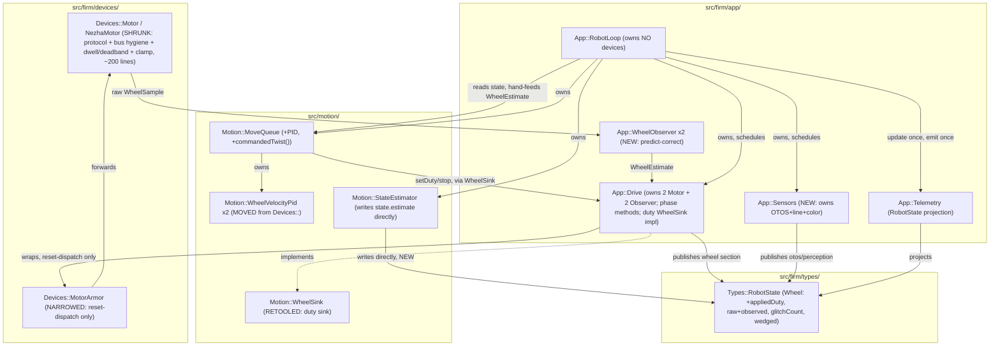
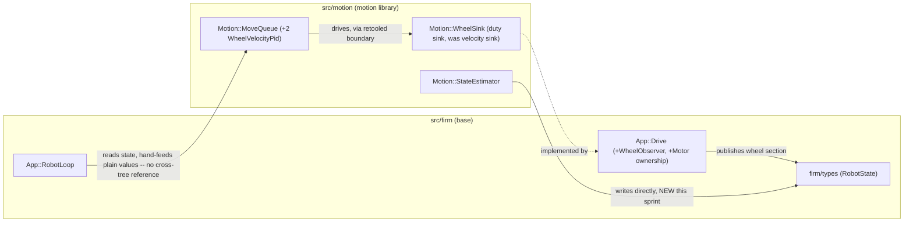

<!-- CLASI: Before changing code or making plans, review the SE process in CLAUDE.md -->

# Sprint 125: Duty boundary, wheel observer, and NezhaMotor shrink

## Goals

Rewrite the firmware base's command primitive from bounded wheel-speed
moves to per-wheel **duty** (`[-1,1]`), add the per-wheel command
observer (predict-correct wheel state from commanded duty + encoder
samples), and shrink `NezhaMotor` to its base-contract residue
(protocol + dwell/deadband + clamp, ~200 lines) — with `MotorVelocityPid`
and the bounded `MoveWheels` primitive relocating up into the motion
library, which owns velocity tracking now that duty is the boundary
primitive. Second of the three firmware-base-hardening sprints
(124 wire/state → **125 duty boundary** → 126 characterization/gate/
freeze).

Also absorbs whatever sprint 124's architecture defers from its own
scope valve (candidate: the Drive/Sensors device-ownership reshuffle —
named bus-phase methods `requestLeft()`/`collectLeft()`/`requestRight()`/
`collectRight()`, `RobotLoop` owning no devices) — see 124's
architecture for the actual valve decision and rationale; this sprint's
own detail-planning pass will confirm what actually lands here once 124
is closed.

## Problem

Today the base's command primitive is a bounded wheel-SPEED move
(`MoveWheels` + stop conditions + timeout), with the velocity PID
resident in `NezhaMotor`. Motor residency keeps `NezhaMotor` doing two
jobs (hardware protocol AND velocity control) that change for different
reasons. [NOTE 2026-07-26: the original rate argument here — "the PID
cannot update faster than the loop, encoder freshness ~80 ms bounds it"
— was measured FALSE: the register is live at ≤ 16 ms
(`docs/design/encoder-refresh-characterization.md`); the relocation
stands on the separation-of-concerns and one-estimate-one-controller
grounds.] Separately, the base has no per-wheel command observer: encoder
samples can repeat relative to the loop, and between fresh samples the base
has no principled estimate of what the wheel is actually doing — three
prior open-loop predictors (stop_lead, margins, analytic coast) tried to
patch this from outside and failed; a predict-correct observer inside
the base is the fix a bare open-loop predictor cannot be.

## Solution

- Command primitive becomes per-wheel **duty** (`[-1,1]`), one visible
  write per wheel per cycle. Safety: zero-on-silence (a cycle with no
  duty write commands zero) plus a plausibility clamp (`|duty| ≤ 1`,
  NaN → 0).
- A per-wheel command observer (dead time, rise shape, deadband floor,
  characterized against hardware) predicts wheel state between encoder
  samples and corrects on each real sample — model error survives at
  most one encoder interval. Reports both the observer estimate and the
  raw encoder value; consumers (motion library) choose which to trust.
- `NezhaMotor` shrinks to protocol + dwell/deadband + clamp.
  `MotorVelocityPid` and the bounded `MoveWheels` primitive relocate to
  the motion library's lowest tier, which is statically linked into the
  same firmware image.
- `appliedDuty` feedback: the base reports the actually-written duty
  (post dwell/deadband shaping) so the motion-side PID's anti-windup
  sees actuator truth, not the commanded value.
- Primary design reference: `docs/design/base-explicit-loop-sketch.md`
  (full `NezhaMotor` inventory with KEEP/MOVE/DELETE verdicts, boundary
  structs, resolved/open questions) — carried forward from before the
  split, now built atop 124's wire/`RobotState` schema instead of the
  old frame shape.

## Success Criteria

Marked by where each is actually provable, per this sprint's own honesty
requirement (no criterion may pass on the mere absence of a bad
observation — see Use Cases SUC-001/SUC-004 for the paired "and we saw
the good thing" companion assertions):

- **[stand-required, USB]** A `move_wheels`-shaped duty command runs to
  completion on the stand; the wheel starts and stops on command, both
  directions. **[stand-required, relay-dongle-required]** the same, over
  the radio relay, kept distinct — a USB pass is never read as relay
  acceptance.
- **[off-hardware]** The observer's estimate tracks `TestSim::WheelPlant`
  exactly (the plant is first-order by construction); a sim scenario
  proves predict-correct behavior (continues predicting through a frozen
  encoder, corrects on the next fresh sample) — see SUC-002.
  **[stand-required, USB]** Raw and observed values are both visible in
  telemetry, per wheel, every frame, and visibly diverge during a real
  glitch/dropout, not just present as two identical copies.
- **[off-hardware]** Zero-on-silence is demonstrated in sim: an idle
  queue (no `Move` enqueued) asserts the wheel receives exactly duty 0
  every cycle, not merely "no crash observed" — see SUC-001.
  **[stand-required, USB]** The same property demonstrated live on the
  stand.
- **[off-hardware]** `NezhaMotor` measured at roughly its ~200-line
  target (grep-enforceable); `grep` for `MotorVelocityPid`/`setVelocity`/
  `velFiltAlpha`/`dutyAvgWindow` under `src/firm/devices/` returns zero
  hits; the relocated `Motion::WheelVelocityPid` carries the SAME
  control-law unit test in `motion_tests`, not a rewritten one.
- **[stand-required, USB]** The first `MOVE` after a fresh connect never
  drops silently, 5/5 runs (ticket 001/SUC-009 — hardware-confirmed
  defect, 2026-07-26, 100% reproducible pre-fix).
- **[stand-required, USB]** A `TURN` at the session's own baseline target
  stays within a stated delta of the confirmed ~0.70 rad / +41% baseline
  — a non-regression check, not a fix (Design Rationale Decision 9).
- **[stand-required, USB]** Bench gate (per
  `.claude/rules/hardware-bench-testing.md`) exercised on the stand — now
  genuinely runnable (robot confirmed reachable over USB, 2026-07-26; see
  ticket 012). **[stand-required, relay-dongle-required]** the
  relay-specific half of the gate stays unverified until a dongle is
  connected — disclosed, not silently implied complete by the USB pass.
- **[off-hardware]** The slew cap's disposition is visible, not silently
  landed either way: unmodified code, a new present-and-uncharacterized
  flag, the bench test itself explicitly NOT run this sprint and NOT
  claimed done (deferred to 126 by design, independent of hardware
  availability) — see SUC-008.

## Scope

### In Scope

- Per-wheel duty command primitive + zero-on-silence + plausibility clamp.
- Per-wheel command observer (predict-correct), consuming commanded duty
  + encoder samples, built on 124's `RobotState`.
- `NezhaMotor` shrink; relocation of `MotorVelocityPid` and `MoveWheels`
  to the motion library.
- `appliedDuty` reporting.
- Whatever 124's scope valve explicitly defers here (see 124's
  architecture Design Rationale for the actual decision).

### Out of Scope

- Twist semantics, kinematics, odometry/pose, estimator/OTOS fusion,
  shaping, chain hand-off, settle completion, heading hold, tours — all
  motion-library territory, unaffected by this sprint's base-contract
  change.
- Characterization battery, numeric gate, and freeze declaration — split
  to sprint 126, which depends on this sprint landing first.
- The wire/state schema itself — that is 124's completed scope; this
  sprint builds on it, not concurrently with it.

## Test Strategy

Two genuinely different regimes, kept explicit rather than blurred (this
sprint's own honesty requirement — see Architecture, Migration Concerns):

- **Off-hardware (this sprint can actually deliver this)**: `motion_tests`
  unit test for the relocated `Motion::WheelVelocityPid` (byte-identical
  assertions to the pre-move `Devices::MotorVelocityPid` test — zero
  behavior change, verified not assumed); a sim scenario against
  `TestSim::WheelPlant` proving the observer's predict-correct behavior
  (exact tracking in steady state; continues predicting through a frozen
  encoder, corrects on the next fresh sample); a `motion_tests` chained-
  `Wheels`-Move scenario exercising the full shape→PID→duty path end to
  end; an idle-queue sim test proving zero-on-silence positively (duty
  reads exactly 0, not merely "no crash"); an `appliedDuty` anti-windup
  regression test that fails on a deliberately-reverted build (a real
  tripwire, not a vacuous pass); a sim re-run of the existing pairing-
  skew/straight-leg-crab suite proving the Drive/Sensors ownership move
  is a pure mechanical relocation.
- **Stand-required (cannot be proven any other way — genuinely unverified
  until hardware is reachable, per this session's `pyocd list`/no-USB-
  device status)**: the `move_wheels`-shaped duty bench gate itself
  (start/stop both directions, encoders climbing), raw-vs-observed
  telemetry actually diverging during a live glitch/dropout (not just
  present), and the slew-cap step-response bench test — explicitly NOT
  attempted this sprint, deferred to 126 by design (see Architecture
  Design Rationale).

Bench step-response characterization for real dead-time/deadband/tau
(feeding the observer's model with hardware-fitted constants rather than
the sim-matched defaults this sprint ships with) is sprint 126's own job,
not this sprint's — this sprint's observer model defaults are proven
exact against `WheelPlant` only, not yet against real hardware.

## Architecture

**Substantial** — this sprint changes the base's command primitive
(velocity → duty) across every layer that touches a wheel, introduces a
new base-side subsystem (the per-wheel command observer) that folds three
existing ad hoc mechanisms into one, relocates a control-law module
(`MotorVelocityPid`) across the base↔motion boundary (a dependency-
direction-relevant change to the `Motion::WheelSink` boundary interface's
own data shape — velocity sink → duty sink), and — carrying forward two
items 124 explicitly deferred here — adds a new base subsystem
(`App::Sensors`) and reassigns device ownership (`App::Drive` takes both
motors) plus completes `RobotState::Command`/`Estimate` population. That
is 3+ modules touched, a changed cross-module dependency (the `WheelSink`
boundary's data shape), and two new subsystems — the full 7-step
methodology applies, diagrams included.

#### Step 1: Understand the Problem

Today `Devices::NezhaMotor` (885 lines/channel) is a hardware protocol
leaf, a velocity controller, and an ad hoc state-conditioning pipeline
all at once: the PID+kff mapping (velocity → duty), a freshness gate
(the 0x46 register refreshes ~80 ms vs. the ~40 ms loop), source-side
glitch rejection, and a live-switchable EMA/least-squares velocity
estimator pair — three independent mechanisms answering the same
underlying question ("what is this wheel actually doing between
infrequent samples") with no shared model. `App::Drive` stages a velocity
target onto the two leaves and is the concrete implementation of
`Motion::WheelSink`, the one interface the motion library (`src/motion`)
is allowed to command wheels through. `Motion::MoveQueue` already owns
the bounded-motion lifecycle (chain-advance, land-at-zero, `VelocityShaper`
axis shaping) and already computes wheel-space velocity targets via
`BodyKinematics::inverse()` — it hands them to the sink verbatim, doing
no closed-loop tracking of its own, because the sink's contract has
always been "give me a velocity, I'll make it happen."

124 landed `Types::RobotState` (the dependency-free blackboard,
`src/firm/types/robot_state.h`) and restructured `RobotLoop::cycle()`
around single-assembly-point telemetry, but deliberately deferred two
things "where the loop gets rewritten anyway": the `Drive`/`Sensors`
device-ownership reshuffle (named bus-phase methods, `RobotLoop` owning
no devices), and finishing `RobotState::Command.v_x`/`omega` and
`RobotState::Estimate` (both defined, both unpopulated — `MoveQueue`
exposes no accessor for its staged twist; `StateEstimator` keeps its
fused results in private members queried via `wheelAt()`/`bodyAt()`
rather than writing them back into the blackboard). This sprint is
exactly that "loop gets rewritten anyway" moment, so both land here.

The stakeholder's rate argument (issue REVISION, 2026-07-24) settles
where the PID lives: encoder freshness (~80 ms) bounds its effective
update rate at or below the loop rate regardless of residency, so motor
residency buys nothing, and motion residency gives ONE velocity estimate
(the observer's) feeding ONE controller, unit-tunable in `motion_tests`
with no hardware. The base's command primitive becomes per-wheel duty;
the base's own job narrows to "run the commanded duty to the wire
safely, predict-correct what actually happened, report truthfully" —
never deciding a velocity.

**Revision (hardware reachable, 2026-07-26): USB confirmed, relay still
not.** The robot was plugged in and flashed with v5 after the planning
pass above was written. `wire_truth.py` ran 577 lines over USB with
**0 `cobs_malformed`, 0 `crc_mismatch`**, budget PASS on all three;
`HELLO`→`DEVICE:` classified the banner (`role=NEZHA2, name=tovez,
serial=2314287040`), `PING`→`PONG:` answered; the wheels variant drove
both wheels in opposite directions with encoders moving, chaining handed
off with no idle gap, and preemption/`ERR_FULL`/timeout-fault/STOP-mid-
motion/CONFIG-mid-move all pass — the first hardware confirmation of the
entire v5 cutover. **No relay dongle is connected this session** —
`radio_bench_gate.py` is relay-only by design and remains unrun; every
relay-path criterion below stays `[stand-required, relay-dongle-required]`,
distinct from and never substituted by a USB pass (same discipline the
brief's own warning about vacuous acceptance demands — a working USB
leg proves nothing about the relay leg).

This same bench session surfaced two real defects, both bearing directly
on this sprint's own scope:

1. **The first `MOVE` after connect is silently dropped, 5/5 runs, 100%
   reproducible.** `move_protocol_bench.py`'s opening
   `scenario_distance_stop` gets `ack=None` and the encoders read `(0,
   0)` both before and after — the COMMAND was lost, not merely its ack;
   the very next `MOVE` (`corr_id=3`) acks and runs fine. Additional
   enqueue-ack losses appear intermittently later (34/43-39/43 across
   five runs). Confirmed NOT physical-layer corruption (the same link
   measured 0% corrupted the same session) — the shape points at a
   startup race: `HELLO`/`PING` already answer during `boot()` (123-006
   put `comms_.pump()` inside the boot loop), so a `MOVE` arriving before
   the configuration-completeness gate opens or before the queue is live
   may be consumed and discarded with no `ERR_NOT_CONFIGURED` ack either
   — silent, not merely unlucky. An issue already existed for this shape
   (`clasi/issues/later/bench-move-commands-intermittently-never-reach-
   firmware.md`, filed 2026-07-23, now promoted out of `later/` and
   linked to this sprint) — this is squarely "radio commands running
   reliably," the stakeholder's #1 priority, and this sprint rewrites the
   exact loop (`boot()`/`processMessage()`/the cycle's own command-decode
   path) where it lives. Ticket 001 (below) root-causes and fixes it,
   landed FIRST and independent of the duty/observer work, so every later
   bench-gate ticket in this sprint runs against a loop that no longer
   drops its own first command.
2. **Turn over-rotation**: ~0.70 rad against a 0.5 rad target (+41%),
   outside the bench's ±25% tolerance, reproducible across runs — the
   known turn-accuracy family (heading-loop tuning; project knowledge:
   "RT open-loop broken, TURN closed-loop fine," "outer PD loop solves
   turn accuracy"). See Design Rationale Decision 9 for the explicit
   scope call: this sprint does not attempt to fix it (heading-hold
   tuning is already Out of Scope, and the characterization/gate work
   that would properly diagnose it is 126's), but IS required to prove
   it does not get WORSE as a side effect of relocating the wheel PID —
   a non-regression check, not a fix, folded into ticket 012's bench
   gate.

Every stand-required criterion below is now genuinely runnable over USB
and is written to require POSITIVE evidence (a nonzero frame count, a
measured encoder delta, an observed ack) alongside any "we never saw the
bad thing" assertion — the 124 lesson (a bench gate reported PASS for a
fault-free session having observed zero telemetry frames, the same shape
then found two levels deeper) applies with full force now that the gate
can actually run.

#### Step 2: Identify Responsibilities

Distinct responsibilities this sprint introduces or changes, grouped by
what changes together:

- **Hardware protocol + write hygiene + brick protection** (Nezha
  register map, split-phase 0x46 sequencing, bus/write hygiene, reversal
  dwell + output deadband) — changes only for hardware-specific reasons;
  entirely unaffected by whether the command that arrives is a velocity
  or a duty.
- **Per-wheel state estimation** (freshness gating, glitch rejection,
  velocity estimation, wedge detection) — today three independent
  mechanisms inside `NezhaMotor` plus one inside `MotorArmor`; this
  sprint's thesis is that these are ONE responsibility (predict-correct
  wheel state) answered by one model, not four.
- **Closed-loop velocity tracking** (the PID + kff mapping, and the
  `WHEELS`/`TWIST`-kind `Move`'s closed-loop duty output) — a control
  DECISION, changes for tuning/accuracy reasons, not hardware reasons.
- **The base↔motion actuation boundary's own shape** (`Motion::WheelSink`)
  — changes only when what crosses that boundary changes (velocity →
  duty), independent of what either side does internally.
- **Device ownership and bus-phase sequencing** (which class holds
  `Devices::Motor&`/`Devices::Otos&`/etc., and in what order the
  request/settle/collect choreography is exposed) — changes only for
  loop-composition reasons; carried forward from 124.
- **Non-wheel sensing** (OTOS + line/color sampling and alternation) —
  changes only for sensor-cadence reasons; carried forward from 124
  alongside device ownership since both land in the same reshuffle.
- **Blackboard completeness** (`RobotState::Command`/`Estimate`
  population) — changes only when a section's writer/consumer contract
  changes; carried forward from 124, landing here because `MoveQueue`'s
  own duty-output rewrite (this sprint) is the natural place to also add
  its twist accessor, and `StateEstimator`'s wheel-peer basis now has a
  cleaner source (the observer) to read from.
- **Loop-visible dataflow** (`RobotLoop::cycle()`'s own statement
  ordering) — changes only when the sense→observe→decide→act→report
  shape itself changes; the seam every other responsibility above is
  threaded through.

#### Step 3: Define Subsystems and Modules

**`Devices::Motor` / `Devices::NezhaMotor`** (modified, SHRUNK) —
`src/firm/devices/{motor.h, nezha_motor.{h,cpp}}`. Purpose: writes a
commanded duty to the Nezha brick safely and reports what the encoder
actually said. Boundary: inside — split-phase 0x46 protocol, hardReset()
median-of-3, connected()/failure-hold, bus/write hygiene (fwdSign, clamp
±100%, integer-% quantization, write-on-change, NAK retry, write-rate
throttle), the slew cap (KEPT, unmodified, flagged — see Design
Rationale Decision 5), reversal dwell + output deadband
(`writeShapedDuty()`), `wheelTravelCalib`. Outside — `setVelocity()`, the
embedded PID, kff, the freshness gate, glitch rejection, the EMA/
least-squares estimator pair, duty-boxcar smoothing (all deleted or
folded into the observer below). Target size ~200 lines (from 885). The
same ticket trims `Devices::MotorConfig` (`device_config.h`) alongside
it — `velGains`, `velFiltAlpha`, `velDeadband` become dead fields the
instant no `NezhaMotor` code reads them, so they are deleted from the
struct, not left as unused config surface; `slewRate`/`outputDeadband`/
`reversalDwell`/`wheelTravelCalib`/`port`/`fwdSign`/`polled` all stay
(Decision 5 keeps `slewRate` unmodified). Serves: base-contract
SUC-001/SUC-003.

**`App::WheelObserver`** (NEW) — `src/firm/app/wheel_observer.{h,cpp}`,
two instances, owned by `App::Drive`. Purpose: predicts one wheel's
state from its last commanded duty and corrects it on each fresh encoder
sample. Boundary: inside — the freshness gate (7), glitch/innovation
rejection (8), the velocity estimate (9, replacing the EMA/least-squares
A/B pair with one model), and wedge detection as an innovation outcome
(commanded ≠ moving for N samples — folding 12's wedge-detection half
out of `MotorArmor`). Outside — the hardware write path (Motor's job),
the closed-loop PID (motion's job), reset dispatch (the narrowed
`MotorArmor`'s job). Zero bus traffic — pure computation over a
`WheelSample` (raw position/fresh/appliedDuty/t/busOk) each cycle.
Serves: SUC-002.

**`App::Drive`** (modified, ownership REASSIGNED) —
`src/firm/app/drive.{h,cpp}`. Purpose: owns both wheels and runs the
one visible per-wheel actuation write. Boundary: inside — owns the two
`Devices::Motor` (moved from being `RobotLoop`-owned back onto `Drive`,
matching how it was named before 122-002's narrowing) and the two
`WheelObserver` instances; exposes named phase methods
(`requestLeft()`/`collectLeft(nowUs)`/`requestRight()`/
`collectRight(nowUs)`, self-evidently ordered, never `tick1/2/3`);
implements the RETOOLED `Motion::WheelSink` as a duty sink
(`setDuty(left, right)`/`stop()`); owns the zero-on-silence default and
the `|duty|<=1`/NaN→0 plausibility clamp (defense-in-depth, mirroring
`clampToPositionWireBound()`'s existing posture); publishes the
`RobotState` wheel section (raw + observed + `appliedDuty` +
`positionEpoch` + glitch/wedge) once, immediately after BOTH collects —
same coherence point 124 already established, now inside `Drive` instead
of `RobotLoop`. Outside — the PID (motion's job), bus protocol
mechanics (`NezhaMotor`'s job). Serves: SUC-001, SUC-006.

**`App::Sensors`** (NEW) — `src/firm/app/sensors.{h,cpp}`. Purpose: owns
non-wheel sensing and reports it once per cycle. Boundary: inside — the
OTOS leaf, the line/color leaves, the alternation cursor (moved verbatim
from `RobotLoop`'s own inline logic, unchanged cadence); one
`update(RobotState&, nowUs)` entry point publishing the otos/perception
sections. Outside — wheel state (Drive's job), pose integration
(`Motion::Odometry`'s job, unaffected by this sprint). Serves: SUC-006.

**`App::MotorArmor`** (modified, NARROWED) —
`src/firm/devices/motor_armor.h`. Purpose: dispatches a staged position
reset only at verified standstill. Boundary: inside — 
`processResetIfPending()`, rest tracking (`updateRestTracking()`).
Outside — wedge detection (`updateWedgeDetector()`, `wedged()`,
`wedgeSuspect()` — DELETED; `WheelObserver`'s innovation logic is now
the one wedge signal, read by `Drive` and published into `RobotState`
directly). Serves: SUC-002 (its narrowing is the direct consequence of
`WheelObserver` absorbing wedge detection); the reset-dispatch half
serves the same standstill-guard safety property as today (still zero
production callers, unchanged — not a defect this sprint introduces or
fixes).

**`Motion::WheelSink`** (modified, RETOOLED boundary) —
`src/motion/wheel_sink.h`. Purpose: the one interface the motion library
commands wheels through. Boundary: inside —
`setDuty(left, right)`/`stop()` (replacing `setWheels(v_left, v_right)`);
`WheelEstimate` (replacing the unused `WheelState`) as the plain struct
`Drive`'s published `RobotState` wheel-section values get read into
before being hand-fed to `MoveQueue` — mirrors what `Devices::Motor`
used to expose, now sourced from the observer instead. Outside — no
concrete implementation lives here (`Drive`'s job, as before); the read
path stays a hand-fed parameter into `MoveQueue::tick()`, not a second
interface method, matching `MoveQueue`'s existing `(now, odom)`
hand-fed-reading convention rather than adding a live cross-tree
reference. Serves: SUC-001 (the base↔motion actuation crossing, now
duty-shaped).

**`Motion::WheelVelocityPid`** (NEW location for existing control law) —
`src/motion/wheel_velocity_pid.{h,cpp}`, moved verbatim (rename only,
`Devices::` → `Motion::`) from `src/firm/devices/velocity_pid.{h,cpp}`.
Purpose: the closed-loop velocity control law. Boundary: unchanged from
today — inside is the same PID/anti-windup math; outside is everything
about what feeds it or what it's for. Two instances, owned by
`Motion::MoveQueue`. Serves: SUC-003.

**`Motion::MoveQueue`** (modified) — `src/motion/move_queue.{h,cpp}`.
Purpose: tracks a bounded per-wheel motion command to completion.
Boundary: inside — UNCHANGED lifecycle/chain-advance/land-at-zero/
shaping, PLUS (this sprint) two `WheelVelocityPid` instances invoked in
`shapeAndStage()` to convert the shaped velocity target into a
`DutyCommand` using hand-fed `WheelEstimate` feedback (measured velocity)
and `appliedDuty` (anti-windup) before calling `sink_.setDuty()`; PLUS a
new `commandedTwist()` accessor (`v_x`/`omega`) for `RobotState::Command`
— TWIST moves return the shaped `cruiseVX`/`cruiseOmega` directly, WHEELS
moves derive the equivalent via `BodyKinematics::forward(cruiseVLeft,
cruiseVRight, trackWidth)` (the same function already used elsewhere for
the fused actual twist), so the field is populated uniformly regardless
of `Move` kind. Outside — the observer (base's job), the PID's own
control law (delegated to `WheelVelocityPid`, not reimplemented here).
`tick()`'s signature gains explicit `WheelEstimate` parameters, matching
its existing hand-fed-reading convention (`now`, `odom`) rather than a
new held reference. Serves: SUC-003, SUC-004, SUC-007. Cohesion note:
PID tracking stays IN `MoveQueue` rather than a new wrapping module —
"tracks a bounded wheel-velocity command to completion" already covers
"and actuates it," and a thin pass-through wrapper class would add a
module for no boundary gain (see Design Rationale Decision 1).

**`Motion::StateEstimator`** (modified) — `src/motion/state_estimator.h`.
Purpose: predicts wheel/body state to an arbitrary instant from the
latest published basis. Boundary: inside — `update()` now WRITES
directly into `state.estimate.wheelLeft/wheelRight/body/innovations`
(the caller's `RobotState&`) instead of private members;
`wheelAt()`/`bodyAt()`/`whereAmI()`/`wheelNow()` become FREE FUNCTIONS
over `RobotState::Estimate` data (a caller holding a COPIED `RobotState`
extrapolates with no live `StateEstimator` in scope — "the query
interface dissolves into data," per the 124 blackboard issue's own
phrasing). The class itself retains only `weights_` (config, stays OUT
of `RobotState` per that struct's own rule). Outside — deciding when to
call `update()` (`RobotLoop`'s job, unchanged position: after
`odom_.integrate()`/the OTOS tick). Serves: SUC-007.

**`Types::RobotState`** (modified schema) —
`src/firm/types/robot_state.h`. Wheel section gains: `appliedDuty`
[-1,1] (post-shaping, the anti-windup feedback value), `glitchCount`
(cumulative, from `encGlitchCount_`'s old home), `wedged` (bool, now
observer-sourced instead of `MotorArmor`-sourced), and a raw-vs-observed
pair for `position`/`velocity` (exact field split finalized during
ticket implementation — the base contract's "commanded AND observed AND
raw, all visible" requirement, issue item 3). `cmdVelocity` is renamed/
repurposed to `cmdDuty` [-1,1] (the primitive changed; the field's
role — "what `Drive` last staged" — does not). `Command.v_x`/`omega` and
every `Estimate` field go from defined-but-unpopulated to genuinely
written, per the two modules above. Serves: SUC-001, SUC-002, SUC-004,
SUC-007.

**`App::Telemetry`** (modified) — `src/firm/app/telemetry.{h,cpp}`.
Purpose: projects `RobotState` into the wire frame — unchanged role,
new fields. Boundary: inside — scaled-field conversion for the new
Wheel-section fields above; a `CONFIG`-patch routing split (same wire
fields — `kp`/`ki`/`kff`/`i_max`/`kaw`/`travel_calib` — but `kp`/`ki`/
`kff`/`i_max`/`kaw` now route to `MoveQueue`'s `WheelVelocityPid`
instances while `travel_calib` stays with `Devices::Motor::applyGains()`,
narrowed to just that one field — no wire/protocol schema change, only
application-side routing). Outside — the framing/CRC layer (123/124's
completed scope, untouched). Serves: SUC-001, SUC-002, SUC-008 (the
slew-cap present-and-uncharacterized marker).

**`App::RobotLoop`** (modified) — `src/firm/app/robot_loop.{h,cpp}`.
Purpose: runs one cycle: sense, observe, decide, act, report, in that
value order. Boundary: inside — the schedule (`kSettle`/`kClear`/
`kPace`, unchanged timing budget), command dispatch, the
`stateEstimator_.update()`/`tlm_.update()`/`tlm_.emit()` call sites.
Outside — device ownership: `RobotLoop` holds ONLY subsystems
(`Drive&`, `Sensors&`, `Comms&`, `Telemetry&`) and motion objects
(`MoveQueue&`, `Odometry&`, `StateEstimator&`) — zero `Devices::*`
members, once the full reshuffle lands (see Design Rationale Decision 6
for the sequencing/valve option on exactly when). Serves: SUC-005,
SUC-006.

#### Step 4: Diagrams

**Component diagram** — required: 3+ modules touched, new subsystems
(`WheelObserver`, `Sensors`), and a changed cross-module dependency (the
`WheelSink` boundary's own data shape).

**Dependency graph** — the `WheelSink` crossing's data shape changes
(velocity → duty); no new crossing direction.

No cycles: `firm/types` stays a pure data leaf (only written to, never
depended on outward); `src/motion` still imports nothing from
`src/firm` except `messages/` and `firm/types/` (122/124's existing
invariant, unchanged by this sprint); the ONE base-implements-motion's-
interface relationship (`Drive` implements `WheelSink`) is the same
dependency-inversion pattern already in place today, just with a
different payload type. Fan-out: `RobotLoop` → {`Drive`, `Sensors`,
`Comms`, `Telemetry`, `MoveQueue`, `Odometry`, `StateEstimator`} is at
or slightly above the 4-5 no-justification bound — unchanged in kind
from today's `RobotLoop`, which already exceeds it (accepted there,
accepted here, same reasoning: a single cooperatively-timed loop
genuinely coordinates this many collaborators by design, per
`src/firm/app/DESIGN.md`).

No entity-relationship diagram: the data-model change here is
`RobotState` struct fields (a schema change already fully captured by
the component diagram's `RobotState` node and Step 3's field list above),
not a relational entity model — matching 124's own stated reasoning for
omitting one.

#### Step 5: What Changed / Why / Impact / Migration Concerns

See Design Rationale and Migration Concerns below, and Steps 1-3 above
for the "what changed" inventory. Impact on existing components:
`Motion::StopCondition`/`VelocityShaper`/`BodyKinematics`/`Odometry` are
untouched (their own inputs/outputs are unaffected by whether the sink
below them takes velocity or duty); `TestSim::WheelPlant` needs NO change
(already duty-native — `step(appliedDuty, dt)` — confirming the sketch's
own claim that "the sim boundary gets cleaner" under this migration);
host tools that read `MotorConfigPatch.kp`/`ki`/`kff`/`i_max`/`kaw` are
unaffected on the wire (same fields), only firmware's internal routing of
those fields changes.

### Design Rationale

**Decision 1 — PID tracking stays inside `MoveQueue` itself; no new
wrapping controller module.**
- *Context*: the duty-sink rewrite needs somewhere for "shaped velocity
  target → PID → duty" to live. `MoveQueue` already owns the shaping
  step (`VelocityShaper`) immediately upstream of it.
- *Alternatives considered*: (a) two `WheelVelocityPid` instances as
  direct `MoveQueue` members, invoked at the end of `shapeAndStage()`
  (chosen); (b) a new `Motion::WheelController` wrapper `MoveQueue`
  delegates to.
- *Why this choice*: (b) adds a module boundary for no cohesion gain —
  `MoveQueue`'s own purpose ("tracks a bounded wheel-velocity command to
  completion") already covers actuating that command, the same way it
  already covers shaping it; a thin pass-through wrapper would just be
  `MoveQueue`'s own logic with an extra hop. (a) keeps the PID's own
  control law isolated and independently unit-tested
  (`Motion::WheelVelocityPid`, its own file, its own `motion_tests`
  target) without inventing a second class whose only job is holding two
  PID instances.
- *Consequences*: `MoveQueue::tick()`'s signature grows two hand-fed
  `WheelEstimate` parameters (matching its existing `now`/`odom`
  convention); its own cohesion test ("tracks a bounded wheel-velocity
  command to completion") still holds without "and."

**Decision 2 — Resolve the PID-vs-armor-policy tension: the boundary
shifts from "base vs. leaf" to "protection vs. control," not abandoned.**
- *Context*: the standing rule ("motor armor policy lives in the base;
  the PID stays leaf") is directly contradicted by moving the PID out of
  the base entirely — the rule as literally stated cannot survive this
  sprint unchanged.
- *Alternatives considered*: (a) restate the rule around what it was
  actually protecting — hardware-safety-critical behavior (dwell,
  deadband, reset-guard, wedge detection) stays base-side; control
  DECISIONS (PID, shaping, chain-advance) live wherever they can be
  tuned/tested fastest, which was already true for shaping/chain-advance
  before this sprint (chosen); (b) keep some fragment of the PID
  base-side (e.g., only the integrator) to preserve the letter of the
  old rule.
- *Why this choice*: (b) reintroduces exactly the "PID split across two
  residencies" problem the stakeholder's rate argument already settled —
  there is no rate benefit to any base-side PID residency, partial or
  whole. (a) is not a new principle, just the existing one's boundary
  drawn correctly: dwell/deadband stay in `NezhaMotor` (protection,
  unchanged this sprint), reset-guard stays in the narrowed `MotorArmor`
  (protection, unchanged), and wedge DETECTION moves to `WheelObserver`
  — still base-side, still protection, just relocated to where the
  freshness/glitch logic it depends on already has to live. Every
  protection mechanism stays in the base; only the one genuine control
  decision (PID) leaves it.
- *Consequences*: the standing rule's wording should be updated (a
  documentation fix, not a scope item) to "hardware protection lives in
  the base; control decisions live in motion" — the newer, more accurate
  statement of what was always intended.

**Decision 3 — `StateEstimator` becomes a stateless (config-only)
updater; ZOH queries become free functions over `RobotState::Estimate`.**
- *Context*: 124's own architecture already named this as the target
  shape ("those become the CANONICAL shape once ticket 009 threads this
  section through") but didn't land it; the carried-over gap this
  sprint absorbs.
- *Alternatives considered*: (a) `update()` writes directly into the
  caller's `RobotState&`; `wheelAt()`/`bodyAt()`/`whereAmI()`/
  `wheelNow()` become free functions taking `const RobotState::Estimate&`
  (or the whole state) plus a query time (chosen); (b) keep the
  instance-method query surface, just ALSO write a copy into
  `RobotState` (both live, kept in sync).
- *Why this choice*: (b) reintroduces the exact "two parallel copies of
  the same fact" problem `RobotState` exists to kill (the dual `frame_`/
  `StateEstimator::Input` history this same blackboard replaced). (a)
  means a consumer holding a COPIED `RobotState` (e.g. a future
  trajectory controller, or a bench tool replaying recorded telemetry)
  gets extrapolation for free with no live `StateEstimator` instance in
  scope — exactly the blackboard issue's own stated goal.
- *Consequences*: `StateEstimator` retains only `weights_` (config,
  correctly excluded from `RobotState` per that struct's own rule);
  `update()`'s signature is unchanged (`RobotState&`, `now`) but its
  effect changes from "cache privately" to "write through."

**Decision 4 — `MoveQueue::commandedTwist()` derives a twist for WHEELS
moves via `BodyKinematics::forward()`, matching the fused-actual-twist
convention already in use.**
- *Context*: `RobotState::Command.v_x`/`omega` needs a value regardless
  of which `Move` kind (`TWIST` or `WHEELS`) is active; only TWIST moves
  natively have a body-frame twist.
- *Alternatives considered*: (a) TWIST returns `cruiseVX`/`cruiseOmega`
  directly, WHEELS derives via `BodyKinematics::forward(cruiseVLeft,
  cruiseVRight, trackWidth)` (chosen); (b) leave the field unpopulated
  for WHEELS moves (matching the field's own current honest-gap
  precedent from 124).
- *Why this choice*: (b) just re-creates the exact gap this sprint exists
  to close, for one `Move` kind out of two. (a) costs nothing new —
  `BodyKinematics::forward()` is the SAME function `RobotLoop` already
  calls to fuse the two leaves' MEASURED velocities into telemetry; using
  it for the COMMANDED pair is the identical computation over different
  inputs, not new machinery.
- *Consequences*: `RobotState::Command.v_x`/`omega` is populated and
  correct for both `Move` kinds; no wire/schema change (the field already
  exists, per 124).

**Decision 5 — Slew cap: keep unmodified, mark visibly open, defer the
delete-or-characterize call to 126.**
- *Context*: the issue's own item 5 asks for a bench decision
  ("characterize or delete... not both, not hidden"); no hardware is
  reachable this sprint.
- *Alternatives considered*: (a) leave the code path byte-for-byte
  unmodified and add a visible "present, uncharacterized" state/telemetry
  marker so the gap is honest rather than silent (chosen); (b) delete it
  now on the recommendation alone ("recommend delete-if-bench-allows");
  (c) fold an UNvalidated characterization guess into the observer's
  model now.
- *Why this choice*: (b) is exactly "deciding by assertion" the
  stakeholder brief explicitly warns against — deleting a physical
  actuator shaper with zero bench evidence risks a real wedge/brick
  incident the shaper may be silently preventing today. (c) is worse: an
  unvalidated model constant would look authoritative in telemetry while
  being a guess, the precise "silent, looks like a calibration error"
  failure mode 124's own Decision 3 (the `(scale)` field) already
  rejected in a different context. (a) is the only option that is both
  safe (zero behavior change) and honest (the open decision is visible,
  not buried).
- *Consequences*: sprint 126 inherits a concrete, bounded decision (bench
  step-response test, then delete or characterize) instead of an
  unstated one; this sprint's own observer model is proven exact against
  `WheelPlant` (which has no slew-cap analogue) but NOT yet validated
  against real hardware's actual (slew-shaped) response — stated
  explicitly in Test Strategy, not implied to be broader than it is.

**Decision 6 — Size/valve: sequence the duty-boundary/observer core
first; the ownership-reshuffle tail is separable and deferrable to a
125b if schedule or bench access is tight.**
- *Context*: this sprint absorbs four items of its own PLUS two 124
  explicitly deferred here — 124's own Design Rationale called itself
  "already the largest kind of sprint this process sizes for," and 125
  is now larger in scope than 124 while facing the SAME zero-hardware
  constraint 124 closed under.
- *Alternatives considered*: (a) one undivided sprint, tickets sequenced
  so the duty/observer/`NezhaMotor`-shrink core (the base-hardening
  program's actual stated purpose) lands first and is independently
  stand-testable, with the `Drive`/`Sensors` ownership reshuffle +
  `RobotState::Command`/`Estimate` population as a clearly separable
  tail — continue within 125 if time/bench allow, or split to a quick
  125b if not (chosen, see the Tickets proposal in this sprint's
  planning report); (b) defer the ownership reshuffle to 126 or later,
  repeating 124's own valve a second time; (c) drop scope from the
  architecture now and re-plan later.
- *Why this choice*: (b) directly fights the reasoning 124 itself used
  to place the reshuffle here ("the loop gets rewritten anyway" — true
  for 125, since this sprint rewrites `cycle()` regardless; deferring
  again means rewriting the bus-phase choreography a THIRD time across
  the whole program, the exact cost 124's Decision 1 argued to avoid).
  (c) contradicts this sprint's own explicit brief ("fold both into this
  sprint's architecture as first-class scope, not footnotes"). (a) keeps
  the architecture whole (every module boundary above accounts for the
  full scope, so tickets can be derived against a complete design either
  way) while giving the team-lead a genuine, low-cost pull point at
  ticketing time: the reshuffle tail is PURELY internal wiring with no
  wire-visible or user-visible behavior change (unlike the duty/observer
  core, which IS the sprint's actual purpose and the highest-risk,
  bench-critical part), so pulling it costs nothing except deferring
  ITS OWN stand verification, not the core's.
- *Consequences*: the ticket proposal (this sprint's planning report,
  not `sprint.md` — tickets are not created this phase) marks a valve
  line; the team-lead decides whether to cross it based on how the core
  tickets land and whether bench access returns.

**Decision 7 — `CONFIG` patch routing splits (`kp`/`ki`/`kff`/`i_max`/
`kaw` → `MoveQueue`'s PID; `travel_calib` → `Devices::Motor`); the wire
schema itself does not change.**
- *Context*: `MotorConfigPatch` (config.proto) carries both gain fields
  and `travel_calib` today, all applied to `Devices::Motor::applyGains()`.
  Once gains move to `MoveQueue`, that single apply point no longer makes
  sense for all six fields.
- *Alternatives considered*: (a) keep the wire message AS-IS; split
  `RobotLoop::handleConfig()`'s application-side routing so gain fields
  reach `MoveQueue`'s PID instances and `travel_calib` reaches the
  narrowed `Devices::Motor::applyGains()` (chosen); (b) a new wire
  message (`WheelVelocityPidPatch` or similar) separating the two
  concerns on the wire too.
- *Why this choice*: (b) is a real wire/protocol change with no
  behavioral justification — nothing about WHERE gains are applied
  internally requires the HOST to send them differently; the existing
  "gains mirror onto both bound motors" merge behavior
  (`mergeMotorGainsPatch()`) already matches a single shared PID pair
  better than two independently-configured motor-side PIDs ever did. (a)
  is a zero-wire-cost, application-only change.
- *Consequences*: no host tool, no protocol doc, no persisted-tuning
  format changes; `persisted_tuning.h`'s `TuningSnapshot` shape is
  unaffected (same fields, same slots) — only WHERE `RobotLoop` applies
  them at boot/live-tune time changes.

**Decision 8 — Keep `MotorArmor` as a decorator (narrowed, not deleted),
despite the sketch's "no reference webs" principle.**
- *Context*: the loop-rewrite sketch's stated principle is "objects in
  the main loop are constructed independently and coordinated AT the
  loop" — a decorator that wraps a `Motor` and forwards most calls could
  read as exactly the kind of hidden indirection that principle targets.
- *Alternatives considered*: (a) keep `MotorArmor`, narrowed to
  reset-dispatch + rest-tracking only (chosen); (b) delete it, folding
  the standstill-guard directly into `Drive`'s own phase methods
  (loop-visible, no decorator).
- *Why this choice*: the "no reference webs" principle targets the
  LOOP's own composition (no `Drive(motorL, motorR)`-shaped multi-object
  webs threaded through construction) — it is not a blanket ban on every
  decorator. `MotorArmor` wraps exactly one `Motor` transparently,
  implementing the SAME interface it wraps; nothing about it hides
  cross-object wiring FROM the loop the way e.g. the old
  `MoveQueue(drive, odom, clock, estimator)` shape did. (b) would be a
  real, unforced rewrite of an orthogonal, already-narrow, already-tested
  mechanism for a principle it does not actually violate — not worth the
  risk this sprint, which already touches enough. Its production
  caller count (zero, confirmed pre-124) is unchanged either way and not
  a defect this sprint fixes.
- *Consequences*: `Devices::MotorArmor` keeps its current construction
  shape (`explicit MotorArmor(Motor& inner)`); only its wedge-detection
  methods are deleted.

**Decision 9 — Turn over-rotation (+41%, confirmed on hardware
2026-07-26) is NOT this sprint's to fix; this sprint owns a
non-regression check only.**
- *Context*: the bench that confirmed the v5 cutover on USB also measured
  a reproducible ~0.70 rad actual against a 0.5 rad `TURN` target,
  outside the ±25% tolerance — the known turn-accuracy family (heading-
  loop tuning, per project knowledge: RT open-loop is the broken path,
  `TURN`'s closed-loop heading hold is not; an outer PD loop is what
  solves turn accuracy). This sprint's own Scope already places "heading
  hold" and "characterization battery, numeric gate, and freeze
  declaration" out of scope / in 126 — but this sprint DOES relocate the
  wheel PID and add the observer, both of which sit underneath the
  heading loop in the control stack, so silence on this finding would be
  a real gap, not a non-issue.
- *Alternatives considered*: (a) explicitly out of scope to FIX, but
  explicitly in scope to NOT REGRESS — ticket 012's bench gate measures
  the same turn maneuver post-125 and requires the result stay within a
  stated band of this session's own +41% baseline, not that it lands in
  tolerance (chosen); (b) attempt a fix this sprint, since the PID/
  observer work is already touching the actuation path; (c) say nothing,
  leaving 126 to discover whether 125 changed the number at all.
- *Why this choice*: (b) is heading-loop tuning work this sprint was
  never scoped or architected for — the fix (if the root cause even
  turns out to be wheel-velocity-tracking fidelity rather than something
  in the outer PD loop itself) belongs with 126's characterization
  battery, which is explicitly designed to gate and tune exactly this
  class of number. (c) risks exactly the failure mode this sprint's own
  honesty requirement exists to prevent: 126 inheriting a confounded
  baseline with no way to tell whether the PID relocation moved the
  number. (a) costs one extra bench measurement in a ticket that already
  runs a full move on the stand, and gives 126 a clean, dated baseline
  either way.
- *Consequences*: ticket 012 (below) gains one concrete acceptance
  criterion: a `TURN` maneuver at the SAME target used this session,
  measured post-125, within a stated delta of the ~0.70 rad / +41%
  baseline (e.g. ±15 percentage points) — NOT within the original ±25%
  bench tolerance, which remains 126's problem to close. Sprint 126
  inherits a dated, confirmed-stable-or-changed number instead of an
  unstated one.

**Decision 10 — The first-MOVE-after-connect loss is root-caused and
fixed as the FIRST core ticket, independent of and before the duty/
observer work.**
- *Context*: the same session found the first `MOVE` after connect
  silently dropped, 5/5 runs — a pre-existing, `later/`-filed defect
  (`bench-move-commands-intermittently-never-reach-firmware.md`,
  2026-07-23) now confirmed reproducible against the v5 cutover, likely a
  startup race between `boot()`'s own `comms_.pump()` (123-006) and the
  configuration-completeness gate/queue readiness `handleMove()` checks.
- *Alternatives considered*: (a) a dedicated, self-contained ticket,
  landed FIRST in the core sequence, independent of the duty/observer
  work (chosen); (b) fold the fix into whichever loop-rewrite ticket
  happens to touch `boot()`/`processMessage()` anyway; (c) leave it for a
  future sprint, since it predates 125 and isn't strictly required by the
  duty-boundary contract.
- *Why this choice*: (c) is unacceptable given the stakeholder's own
  stated priority order (radio commands running reliably is #1) and the
  fact that THIS sprint is rewriting the exact loop the race lives in —
  deferring it means rewriting `boot()`/`processMessage()` once now and
  again later to actually fix it. (b) risks the fix landing coupled to
  duty-specific code, and risks every OTHER core ticket's own bench/sim
  verification being confounded by a known dropped-first-command defect
  if the fix lands late. (a) gives every subsequent ticket in this sprint
  (including the sim/`motion_tests` battery and the bench gate) a loop
  that already doesn't drop its own first command, and is independently
  verifiable in isolation before any duty-boundary code changes at all.
- *Consequences*: ticket 001 (below) is scoped narrowly — comms/boot race
  only, no duty-primitive dependency — so it can be verified against the
  CURRENT (pre-duty) tree first, then carried forward unchanged in
  effect through the rest of the sprint's loop rewrites.

### Migration Concerns

- **CI goes red then green mid-sprint, by design** (124/108's own
  precedent): once `Devices::Motor::setVelocity()` is deleted, every
  test still calling it (and every test asserting `MotorArmor::wedged()`
  before `WheelObserver` exists to replace its source) goes red until
  the corresponding ticket lands. Called out here so a mid-sprint CI
  failure is not mistaken for a regression.
- **No wire/protocol schema change** for the `CONFIG` patch routing
  split (Decision 7) — a host tool sending `MotorConfigPatch` today needs
  no update; only firmware's internal application-side routing changes.
- **Telemetry is additive wire growth** (`appliedDuty`, raw-vs-observed
  pair, `glitchCount`, `wedged` — a handful of bytes per wheel), same
  posture as 124's `positionEpoch` addition — budget-aware, not
  budget-threatening.
- **No persisted-tuning format change** — `Config::TuningSnapshot`'s
  `motorL`/`motorR` slots keep their current field shape; only WHERE
  `RobotLoop::handleConfig()` applies the gain subset of those fields
  changes (Decision 7).
- **Bench partially available, as of 2026-07-26: USB confirmed, relay
  still not.** The robot is on the stand and reachable over USB (v5
  flashed, `wire_truth.py`/`move_protocol_bench.py` both run clean of
  physical-layer corruption); no relay dongle is connected. Every
  stand-required criterion below is now genuinely runnable over USB and
  is written to require POSITIVE evidence, not merely the absence of a
  fault. Every relay-path criterion stays `[stand-required,
  relay-dongle-required]` and unverified until a dongle is available —
  same disclosure posture 124 used for its own unrun bench gate, now
  scoped to just the relay leg rather than the whole bench. The
  off-hardware proof this sprint also delivers (sim/`motion_tests`)
  remains real and independently valuable as a regression net, but a USB
  stand pass is the stronger claim now available and should be used
  wherever a criterion can actually be run that way; it still says
  nothing about the relay leg specifically (transparent RAW250 passthrough
  in principle, per 124's own Decision 5, but unconfirmed for THIS
  cutover until actually run over the dongle).
- **`docs/design/design.md` and every touched `DESIGN.md`
  (`src/firm/devices/DESIGN.md`, `src/firm/app/DESIGN.md`,
  `src/motion/DESIGN.md`) need reconciliation** before `close_sprint`'s
  design-doc validation will pass (`design_docs: enabled` in
  `.clasi/config.yaml`) — a required closing-time ticket, not optional
  cleanup.
- **`src/motion`'s own `motion_tests` build gains a new source file**
  (`wheel_velocity_pid.{h,cpp}`) and a new `CMakeLists.txt` test target
  — both additive, no change to the existing three `ctest`-registered
  scenarios' own behavior.

### Open Questions

- **The observer's exact model shape** (dead-time constant, rise-shape
  parameterization) — this sprint ships a reasonable default matching
  `TestSim::WheelPlant`'s own first-order `(dutyVelMax, tau)` model
  (proven exact against sim by construction), NOT yet hardware-fitted;
  sprint 126's bench step-response characterization is where real
  dead-time/deadband/tau replace the sim-matched defaults.
- **Slew-cap disposition** (Decision 5) — explicitly punted to 126;
  this sprint's only obligation is to keep the gap visible, not to
  resolve it.
- **Whether the ownership-reshuffle tail (Decision 6) ships within 125
  or splits to a 125b** — left to the team-lead/stakeholder at ticketing
  time, based on how the core tickets land.
- **`MotorArmor`'s reset-dispatch remaining a zero-production-caller
  mechanism** — unchanged by this sprint (Decision 8); whether a future
  sprint ever wires a caller to it is out of scope here, same posture
  124 already recorded for the identical fact.
- **When a relay dongle becomes available** — every
  `[relay-dongle-required]` criterion stays open until then; not blocking
  this sprint's own close (matching 124's precedent of closing with
  disclosed-unverified bench criteria), but not to be silently dropped
  either.
- **Whether the turn over-rotation's root cause lives in wheel-velocity-
  tracking fidelity (this sprint's own territory) or purely in the outer
  heading PD loop (126's)** — genuinely unknown until 126's
  characterization work runs; Decision 9's non-regression check is
  deliberately silent on WHERE the ~0.70 rad number comes from, only
  that 125 must not move it further from tolerance.

## Use Cases

### SUC-001: Duty is the base's one command primitive; zero-on-silence and the plausibility clamp are its only two safety properties
Parent: UC (base contract, firmware-base-hardening program)

- **Actor**: `Motion::MoveQueue` (decides), `App::Drive` (acts),
  `Devices::NezhaMotor` (writes)
- **Preconditions**: `RobotState` wheel section wired; `MoveQueue` runs
  every cycle unconditionally (today's existing contract, unchanged).
- **Main Flow**:
  1. `MoveQueue::shapeAndStage()` computes a per-wheel duty via its own
     `WheelVelocityPid` instances and calls `sink_.setDuty(left, right)`.
  2. `Drive::setDuty()` clamps (`|duty| <= 1`, NaN → 0) and stages
     `lastCmd_`; a cycle with no `setDuty()`/`stop()` call defaults to
     zero, inherited from `MoveQueue`'s own unconditional per-cycle tick
     (which already ends every cycle in either a shaped `setDuty()` call
     or `stop()` on an empty queue — no new watchdog logic needed).
  3. `NezhaMotor`'s own collect step writes the staged duty through
     dwell/deadband shaping.
- **Postconditions**: The motor never receives a raw velocity target
  again; every write traces to an explicit duty value; silence, not a
  stale hold, is the default.
- **Acceptance Criteria**:
  - [ ] **[off-hardware]** `Devices::Motor::setVelocity()` no longer
        exists on the interface (grep-enforceable); a `motion_tests`
        scenario drives a chained `WHEELS` `Move` end to end and asserts
        the sink only ever receives `setDuty()`/`stop()` calls.
  - [ ] **[off-hardware]** A sim test with NO `Move` enqueued asserts the
        wheel receives exactly duty 0 every cycle — the positive
        "we saw the good thing" companion to zero-on-silence, not just
        "no crash observed."
  - [ ] **[stand-required, USB]** A `move_wheels`-shaped duty command
        starts and stops the physical wheel on command, both directions
        — positive evidence: a nonzero, direction-correct encoder delta
        observed for each direction, not merely "no error returned."
  - [ ] **[stand-required, relay-dongle-required]** The same command,
        run over the radio relay data plane once a dongle is available —
        kept explicitly distinct from the USB criterion above; a USB
        pass must never be read as satisfying this one.

### SUC-002: The per-wheel command observer predicts between samples and corrects on each fresh one
Parent: UC (base contract)

- **Actor**: `App::WheelObserver`, `App::Drive`
- **Preconditions**: Observer constructed with the sim-matched default
  model (Open Questions); `Devices::Motor::sample()`-shaped raw reading
  available each cycle.
- **Main Flow**:
  1. `Drive` collects a raw `WheelSample` (position, fresh flag,
     `appliedDuty`, `t`, `busOk`) from each motor.
  2. The observer predicts from the last commanded duty and this wheel's
     own prior estimate; on a fresh sample, corrects it (an innovation
     bound rejects an implausible step, streak-of-3 re-accept — the same
     shape as today's glitch logic, now unified).
  3. `Drive` publishes both the raw sample and the corrected estimate
     into `RobotState`'s wheel section, once, after both collects.
- **Postconditions**: Model error survives at most one encoder interval
  before a fresh sample trims it; wedge is one of the observer's own
  innovation outcomes (commanded ≠ moving for N samples), not a separate
  mechanism.
- **Acceptance Criteria**:
  - [ ] **[off-hardware]** Against `TestSim::WheelPlant` (first-order
        duty→velocity, exact by construction), the observer's
        steady-state velocity estimate matches the plant's true velocity
        within a stated tolerance.
  - [ ] **[off-hardware]** A sim scenario using the plant's existing
        freeze-position fault knob shows the observer's estimate
        CONTINUES from the predict step (not frozen at the last raw
        value) until a fresh sample resumes correcting it — proves
        predict-correct, not predict-and-forget.
  - [ ] **[stand-required, USB]** Raw and observed values are both
        visible in telemetry, per wheel, every frame, and visibly diverge
        from each other during a real bench glitch/dropout — not merely
        present as two identical copies; positive evidence is a captured
        frame pair showing a nonzero raw/observed delta, not just two
        populated-but-untested fields.

### SUC-003: `NezhaMotor` is protocol + dwell/deadband + clamp only; the PID and wheel-speed closed-loop tracking no longer live in the base
Parent: UC (base contract)

- **Actor**: `Devices::NezhaMotor`, `Motion::MoveQueue`,
  `Motion::WheelVelocityPid`
- **Preconditions**: The relocation (Step 3 above) has landed.
- **Main Flow**: `NezhaMotor` writes exactly the duty it is given, through
  dwell/deadband/clamp; `MoveQueue` runs the relocated PID against
  observer feedback to decide that duty.
- **Postconditions**: The base has one job per wheel-write; the control
  decision lives one layer up, tunable without hardware.
- **Acceptance Criteria**:
  - [ ] **[off-hardware]** `nezha_motor.cpp` measured at or near the
        ~200-line target (from 885); `grep -rn
        "MotorVelocityPid\|setVelocity\|velFiltAlpha\|dutyAvgWindow"
        src/firm/devices/` returns zero hits.
  - [ ] **[off-hardware]** `motion_tests` exercises the relocated
        `Motion::WheelVelocityPid` with the SAME control-law assertions
        the pre-move `Devices::MotorVelocityPid` test had — zero
        behavior change, verified, not assumed.
  - [ ] **[stand-required, USB]** A step-duty command on the stand
        produces a real wheel response through the unchanged dwell/
        deadband/clamp path — positive evidence: measured encoder
        movement matching the pre-relocation baseline within a stated
        tolerance, not just "no error."

### SUC-004: `appliedDuty` feedback lets the motion-side PID's anti-windup see actuator truth, not the commanded value
Parent: UC (base contract)

- **Actor**: `App::Drive` (publishes), `Motion::WheelVelocityPid` (reads)
- **Preconditions**: Wheel section carries `appliedDuty` (post-dwell/
  deadband).
- **Main Flow**: The PID's anti-windup term reads `appliedDuty`, not its
  own last commanded output.
- **Postconditions**: A dwell-shaped or deadband-boosted write no longer
  desynchronizes the PID's integrator from what the actuator actually did.
- **Acceptance Criteria**:
  - [ ] **[off-hardware]** A `motion_tests` scenario forces a
        dwell-shaped write (a commanded reversal) and asserts the PID's
        integrator behavior reflects the SHAPED `appliedDuty`, not the
        pre-shaping commanded value.
  - [ ] **[off-hardware]** The same scenario, run against a deliberately-
        reverted build (feedback wired to the commanded value instead),
        FAILS the assertion — proves the test is a real tripwire, not a
        vacuous pass.

### SUC-005: The cycle reads sense → observe → decide → act → report, with every cross-object value a printable cycle-local
Parent: UC (loop-schedule truth, base-hardening program)

- **Actor**: `App::RobotLoop`
- **Preconditions**: `Drive`/`Sensors` publish their sections at the
  correct coherence points (Step 3).
- **Main Flow**: `cycle()`'s statement order follows the base-explicit-
  loop-sketch's normative VALUE ordering (temporal adjacency to the bus
  schedule is explicitly not required to match, per the sketch's own
  caveat — the interleaved request/settle/collect timing stays real).
- **Postconditions**: A reviewer can read `cycle()` top to bottom and
  know what happened this cycle, in order, with no hidden reference webs.
- **Acceptance Criteria**:
  - [ ] **[off-hardware]** Once the full ownership reshuffle lands (see
        Design Rationale Decision 6's valve),
        `App::RobotLoop`'s header declares zero `Devices::*` members
        (grep-enforceable). If the reshuffle tail is deferred to 125b,
        this criterion is explicitly N/A for 125's own close and is
        re-asserted at 125b's close instead — not silently dropped.
  - [ ] **[off-hardware]** A sim re-run of the existing pairing-skew/
        straight-leg-crab regression suite (121-005-class same-generation
        L/R telemetry) passes unchanged post-rewrite.
  - [ ] **[stand-required, USB]** The stand bench gate (ticket 012)
        exercises a full move under the rewritten loop with no regression
        against those same invariants, live, PLUS: (a) the first `MOVE`
        after a fresh connect acks and executes, 5/5 runs (ticket 001's
        fix, re-verified under the final duty-based loop, not just at the
        point it was originally fixed); (b) a `TURN` at the session's own
        baseline target stays within a stated delta of the ~0.70 rad /
        +41% baseline measured 2026-07-26 (Design Rationale Decision 9 —
        a non-regression check, not a tolerance-pass requirement).

### SUC-006: `Drive` owns both wheels behind named phase methods; `Sensors` owns OTOS/line/color behind one update call
Parent: UC (device-ownership reshuffle, carried from 124)

- **Actor**: `App::Drive`, `App::Sensors`
- **Preconditions**: Part of Design Rationale Decision 6's valve — may
  land in 125 or split to 125b.
- **Main Flow**: `requestLeft()`/`collectLeft(nowUs)`/`requestRight()`/
  `collectRight(nowUs)` replace `RobotLoop`'s direct motor calls;
  `Sensors::update(state, nowUs)` replaces `RobotLoop`'s inline OTOS/
  line/color block, alternation cursor unchanged.
- **Postconditions**: Device ownership matches the "loop coordinates,
  doesn't hold" principle; bus timing is byte-for-byte unchanged (a pure
  mechanical relocation).
- **Acceptance Criteria**:
  - [ ] **[off-hardware]** The four phase methods exist on `App::Drive`
        with those exact names; `App::Sensors::update()` exists and
        internally alternates line/color at the same cadence as today
        (unit-tested).
  - [ ] **[off-hardware]** A sim regression re-run of the existing
        pairing-skew/straight-leg-crab suite passes unchanged — proves
        the ownership move is mechanical, not a behavior change.

### SUC-007: `RobotState::Command` carries the actually-commanded twist for both Move kinds; `RobotState::Estimate` is populated directly, queryable as pure data
Parent: UC (blackboard completeness, carried from 124)

- **Actor**: `Motion::MoveQueue`, `Motion::StateEstimator`
- **Preconditions**: Part of Design Rationale Decision 6's valve.
- **Main Flow**: `MoveQueue::commandedTwist()` feeds
  `state.command.v_x`/`omega`; `StateEstimator::update()` writes directly
  into `state.estimate`.
- **Postconditions**: Both fields are genuinely populated (not
  defined-but-zero); a copied `RobotState` extrapolates via free
  functions with no live `StateEstimator` in scope.
- **Acceptance Criteria**:
  - [ ] **[off-hardware]** A sim test drives one `TWIST` and one `WHEELS`
        `Move` in turn and asserts `state.command.v_x`/`omega` is
        nonzero and correct in both cases.
  - [ ] **[off-hardware]** A test constructs a `RobotState`, calls
        `StateEstimator::update()` once, COPIES the state, and calls the
        free-function `wheelAt()`/`bodyAt()` against the COPY with no
        live `StateEstimator` in scope — proving the query genuinely
        dissolved into data.

### SUC-008: The slew cap's disposition is visible, not silently landed either way
Parent: UC (base contract, honest-acceptance requirement)

- **Actor**: `Devices::NezhaMotor`, `App::Telemetry`
- **Preconditions**: A bench IS reachable as of 2026-07-26 (USB), but the
  step-response characterization this decision needs is deferred to 126
  by design (Decision 5), not by hardware absence — the two are
  independent facts and neither excuses the other.
- **Main Flow**: The slew-cap code path ships byte-for-byte unmodified; a
  new state/telemetry marker reports it present-and-uncharacterized.
- **Postconditions**: Sprint 126 inherits a stated, bounded decision, not
  a silently-resolved one.
- **Acceptance Criteria**:
  - [ ] **[off-hardware]** A diff against pre-sprint `nezha_motor.cpp`'s
        `writeRawDuty()` slew section shows no change.
  - [ ] **[off-hardware]** The new present-and-uncharacterized marker is
        readable in `RobotState`/telemetry every frame.
  - [ ] **NOT claimed this sprint**: the bench step-response test that
        would let 126 actually decide delete-vs-characterize does not
        run — stated here as a known, deliberate gap (scope, not
        hardware availability), not implied done.

### SUC-009: The first `MOVE` after connect is never silently dropped
Parent: UC-001 (radio commands running reliably, stakeholder's #1
priority)

- **Actor**: Host operator (bench script), `App::Comms`, `App::RobotLoop`
  (`boot()`/`processMessage()`)
- **Preconditions**: Fresh clean-boot firmware; a `MOVE` sent as the
  FIRST command after connect, over USB (confirmed reproducible 5/5,
  2026-07-26, `move_protocol_bench.py`'s `scenario_distance_stop`).
- **Main Flow**:
  1. Host connects and immediately sends a `MOVE`.
  2. Root cause (ticket 001) is confirmed and fixed — most likely the
     race between `boot()`'s own `comms_.pump()` (123-006) and the
     configuration-completeness gate/queue-readiness `handleMove()`
     checks, per this session's own analysis, but the ticket's own
     investigation is what confirms it, not this architecture.
  3. The `MOVE` acks (enqueue ack, `corr_id` matching) and the encoders
     move.
- **Postconditions**: No `MOVE` is ever silently consumed and discarded
  with no ack of any kind (neither a success ack nor `ERR_NOT_CONFIGURED`)
  — a lost command is either accepted and run, or explicitly rejected
  with a reason, never simply gone.
- **Acceptance Criteria**:
  - [ ] **[off-hardware]** A sim/`motion_tests` regression test
        constructs the same race window (a `MOVE` arriving during
        `boot()`'s own pump window, before `configured_` flips true) and
        asserts either a clean ack+execute or an explicit
        `ERR_NOT_CONFIGURED` — never a silent drop with no ack at all.
  - [ ] **[stand-required, USB]** `move_protocol_bench.py`'s
        `scenario_distance_stop` (the exact reproducer) acks and executes
        on the first `MOVE` after a fresh connect, 5/5 runs — positive
        evidence: 5 observed acks + 5 observed nonzero encoder deltas,
        not "0 failures observed in N attempts" alone.
  - [ ] **[stand-required, USB]** A full `move_protocol_bench.py` run
        shows zero unexplained enqueue-ack losses across all scenarios
        (this session's baseline: 34/43-39/43 across five runs) — the
        full-run tally, not just the opening scenario, since the session
        noted additional intermittent losses beyond the reproducible
        first-command case.
  - [ ] **[stand-required, relay-dongle-required]** The same
        first-`MOVE`-after-connect check, run over the radio relay once a
        dongle is available — kept distinct; the race this ticket fixes
        is boot-timing, not transport-specific, but is unconfirmed over
        relay until actually run there.

## GitHub Issues

(GitHub issues linked to this sprint's tickets. Format: `owner/repo#N`.)

## Definition of Ready

Before tickets can be created, all of the following must be true:

- [x] Sprint planning document is complete (sprint.md, including its
      Architecture and Use Cases sections)
- [x] Architecture review passed (or skipped, for changes with no
      architectural impact) — recorded `passed`, full five-category
      substantial-tier self-review, verdict APPROVE
- [x] Stakeholder has approved the sprint plan — full scope approved
      (valve at ticket 12, PID-vs-armor reframed as protection-vs-
      control, slew cap kept/flagged/deferred to 126), plus the
      hardware-confirmed additions (first-MOVE-loss ticket, turn
      non-regression check) folded in above

## Tickets

**Core — duty boundary / observer / shrink / reliability (this sprint's
own stated purpose; tickets 001-012):**

| # | Title | Depends On |
|---|-------|------------|
| 001 | Fix silent first-MOVE-after-connect command loss (boot/comms race) | — |
| 002 | Retool `Motion::WheelSink` as a duty sink (`WheelEstimate` replaces `WheelState`) | — |
| 003 | Shrink `Devices::Motor`/`NezhaMotor` to duty-only protocol + bus hygiene + dwell/deadband + clamp | 002 |
| 004 | Add `App::WheelObserver`: per-wheel predict-correct command observer | 003 |
| 005 | Relocate `MotorVelocityPid` to `Motion::WheelVelocityPid` | 002 |
| 006 | `Motion::MoveQueue` duty output: PID against `WheelEstimate` feedback, `appliedDuty` anti-windup | 004, 005 |
| 007 | `App::Drive` duty wiring: implement the duty `WheelSink`, own `WheelObserver` pair (motor ownership unchanged) | 002, 003, 004, 006 |
| 008 | `RobotState` wheel-section schema + `Telemetry` projection; split `CONFIG`-patch routing | 006, 007 |
| 009 | Narrow `MotorArmor`: delete wedge detection, keep standstill-guarded reset dispatch | 004 |
| 010 | Slew-cap disposition: unmodified code, visible present-and-uncharacterized marker | 003 |
| 011 | Sim/`motion_tests` acceptance battery for the duty/observer/PID core | 005, 006, 007, 008 |
| 012 | Stand bench gate: duty command, observer telemetry, zero-on-silence, first-MOVE re-verify, turn non-regression (USB); relay leg tracked separately | 001, 008, 009, 010, 011 |

**Valve line** (Design Rationale Decision 6) — purely internal wiring, no
wire/user-visible behavior change; deferrable to a 125b if the core above
ran long or bench access became unavailable again:

| # | Title | Depends On |
|---|-------|------------|
| 013 | `App::Drive` takes motor ownership; named bus-phase methods (`requestLeft`/`collectLeft`/`requestRight`/`collectRight`) | 007 |
| 014 | Add `App::Sensors`: owns OTOS/line/color, runs the alternation cursor | 013 |
| 015 | `App::RobotLoop::cycle()` final rewrite: drop all `Devices::*` members | 013, 014 |
| 016 | Populate `RobotState::Command`/`Estimate`: `MoveQueue::commandedTwist()`, `StateEstimator` writes directly | 006, 015 |
| 017 | Reconcile `DESIGN.md` set for the new module boundaries (devices/app/motion) | 011, 012, 015, 016 |

Tickets execute serially in the order listed. Ticket 001's `issue:`
frontmatter carries the primary base-hardening issue via single-issue
auto-link (set at creation time, before the first-MOVE-loss defect issue
was linked to this sprint) — once the team-lead promotes
`bench-move-commands-intermittently-never-reach-firmware.md` out of
`later/` and links it to sprint 125, attach it to ticket 001 via
`add_issue_ref()` (see the note left in that ticket's own body).
