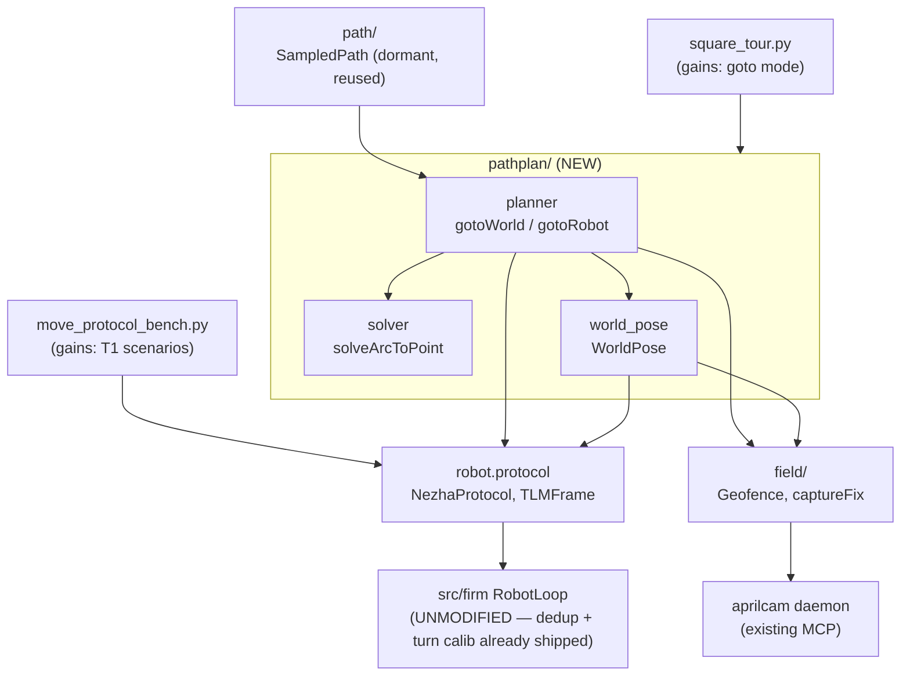

<!-- CLASI: Before changing code or making plans, review the SE process in CLAUDE.md -->

# Sprint 127: Host-side path planner — goto and path following

## Goals

Give sprint 126's now camera-calibrated OTOS a consumer: a **host-side outer
position loop** that owns the world-frame pose, drives the firmware by
continuously replacing the in-flight `Move` (`replace=True`), and exposes
`gotoWorld(x, y, theta)` / `gotoRobot(x, y, theta)`. Path following (a
lookahead target-picker over a `SampledPath` instead of a fixed goal) is a
small increment on top, delivered in the same sprint. The firmware is not
touched — no wire change, no protobuf regeneration.

This sprint also closes a real, previously-unverified safety gap that a
continuously-replacing planner would otherwise trip immediately: the
firmware's `Move.id` dedup (already implemented, never verified) that
prevents a lost-ack retry from double-executing a move.

## Problem

Sprint 126 turned the OTOS into a calibrated instrument but fused it into
nothing — nothing on the robot uses world-frame position today. Getting a
world-frame `gotoWorld()` requires:

1. A trustworthy way to know where the robot is in world coordinates between
   camera fixes, built from telemetry the firmware already sends (encoder
   pose, OTOS reading), re-anchored at each camera observation.
2. A way to compute, then continuously re-compute, the single relative move
   that closes the gap to a goal — without violating the two untested edges
   in the firmware's `Move` `replace=True` preemption path that the design
   issue's investigation surfaced (an axis change at speed, and a large
   curvature step at speed).
3. Confidence that the mechanism this loop leans on hardest —
   replacing a move by re-sending its `Move.id` — cannot silently
   double-execute a move if an enqueue ack is lost, which is exactly the
   failure mode `duplicate-move-enqueue-on-ack-loss-retry.md` already
   reported on hardware. The fix for that shipped in sprint 126's own
   `robot_loop.cpp` work as a side effect (`alreadyAccepted()`/
   `recordAccepted()`/`acceptedMoveIds_[16]`, confirmed present at
   `src/firm/app/robot_loop.cpp:224-248`) but has **never been verified** —
   no sim test, no hardware run with a logged retry. A path planner that
   replaces the in-flight move on every control cycle is the single
   heaviest user of this exact mechanism in the codebase, so shipping it
   on an unverified dedup is the highest-consequence gap in this design.

## Solution

New package `src/host/robot_radio/pathplan/` (`planner/` is taken by
trajectory profiles from the pre-gut era; `path/` is taken by pure curve
geometry). Work items, T1-T8 per the design issue, mapped onto ticket
numbers below:

- **T1 — Characterize `replace` preemption** (ticket 001). Sim + bench
  scenarios for the five cases the issue's investigation identified:
  same-curvature at speed (baseline), a large curvature step at speed
  (Edge B — sizes the solver's curvature slew limit), an axis change at
  speed (Edge A), an axis change from rest (sanity), and high-rate
  (~20 Hz) replacement. This is the foundation ticket: its Edge-B
  measurement is a direct input to T4's solver limits.
- **Dedup verification** (ticket 002, folds in
  `duplicate-move-enqueue-on-ack-loss-retry.md`). The firmware fix is
  already shipped; this ticket only verifies it — id-0 exemption, the
  window outliving move completion, `ERR_FULL` non-recording, and a
  hardware run that captures a real logged retry. Reuses ticket 001's
  harness rather than building a second one.
- **T2 — Promote camera-fix + geofence helpers** (ticket 003). Move
  `Geofence`/`GeofenceViolation`/`checkPlayfieldLights`/`captureFix`/
  `captureFixWithRetry` out of `square_tour.py` and into the already-live
  `robot_radio/field/` package (which currently holds only
  `playfield.py`), re-point `square_tour.py` and
  `otos_calibration_bench.py`, delete the latter's `sys.path` hack. Fixes
  one wrap-unsafe median-of-raw-yaw bug in transit. Independent of T1 —
  runs in parallel.
- **T3 — `WorldPose`** (ticket 004). Host-side `T_world_from_odom`
  tracker, re-anchored from camera fixes, consuming `TLMFrame.pose` and
  `TLMFrame.otos_reading`. Adds a host receive timestamp to `TLMFrame`
  (does not exist today — confirmed only one call site,
  `NezhaProtocol.read_pending_binary_tlm_frames()`, builds a `TLMFrame`
  off the wire). By-product: encoder-vs-OTOS divergence tracked for free,
  which is what T7 uses to recommend a re-anchor cadence.
- **T4 — Goto solver** (ticket 005). `solveArcToPoint(currentPose,
  targetPoint, limits) -> (v_x, omega, arcLength)`, pure functions, no
  I/O, fully unit-testable. Enforces the curvature slew limit (sized by
  ticket 001) and a target-behind guard (stop-then-turn, safe because the
  axis change then happens from rest).
- **T5 — `gotoWorld`/`gotoRobot`** (ticket 006). The planner loop:
  telemetry in, `WorldPose` update, solve, `move_twist(...,
  stop_distance=arcLength, replace=True)` out. Throttled replacement,
  explicit termination (tolerance + give-up, never an infinite null-the-
  error loop), geofence checked inside the ~10 Hz time-advance primitive,
  every halt via `estop()`.
- **T6 + T7 — verification gates** (ticket 007) — **re-expressed from the
  design issue; see Design Rationale Decision 2.** The issue proposed new
  files under `src/tests/sim/system/`. That directory is explicitly
  scheduled for deletion by a separate, later, stakeholder-directed sprint
  (`square-tour-is-the-one-system-test-sim-bench-playfield.md`), which
  also states plainly: "New coverage belongs either in a unit test or as
  an expansion of the square tour... not as a new system test." This
  sprint obeys that directive now rather than adding work the later sprint
  would have to delete. Concretely: add a `goto`-driven mode to the
  existing `src/tests/bench/square_tour.py` (same 8-segment square, driven
  through `gotoWorld()` instead of open-loop `WHEELS` commands), run at
  sim tier (`--sim`, asserting convergence/closure/no-stall, plus
  behavior under `SimLoop.set_otos_drift()`/`set_enc_slip()`), then at
  bench tier (T1's stand scenarios), then at playfield tier (camera-
  verified goto targets, per-boundary camera fixes, PNG chart, minimum
  reliable move distance/turn angle measured, encoder-vs-OTOS divergence
  rate reported).
- **T8 — Path following** (ticket 008). Swap the target-picker: instead of
  "the goal," pick the lookahead point on a `SampledPath`
  (`src/host/robot_radio/path/sampled_path.py`, already present, pure,
  dormant). Lookahead floor ~100-150 mm (actuation-delay analysis in the
  issue). Verified the same way as T6/T7 — no new system-test file.

## Success Criteria

1. `uv run python -m pytest` passes, including new unit-tier coverage for:
   the solver's arc math and curvature slew limit, `WorldPose`'s transform
   and re-anchor logic, throttled-replacement logic, and all four dedup
   rules (id-0 exemption, window-outlives-completion, `ERR_FULL` not
   recorded, ordinary duplicate suppressed).
2. `just build-sim && uv run python -m pytest src/tests/sim` passes with
   the real firmware loop compiled in.
3. On the stand: all five of ticket 001's replace-preemption cases pass,
   and ticket 002's hardware run captures at least one real logged retry
   that is correctly deduped (exactly-once execution, confirmed by
   encoder-derived move count/geometry, not just an ack count).
4. On the playfield, lights confirmed via `Switch.GetStatus` first:
   `square_tour.py --sim`/`--port` in `goto` mode closes the square within
   a stated tolerance; a followed path (T8) completes; per-segment-
   boundary camera fixes are logged; `estop()` fires in a `finally` on
   every run; a PNG chart is produced.
5. `estimator.weight_heading_otos` / `weight_omega_otos` are confirmed
   still `0.0` and `geometry.otos_untrusted` is confirmed untouched —
   sprint 128's remount gate is not crossed.
6. No change to any firmware source file, wire message, or `.proto`
   definition anywhere in the sprint diff.

## Scope

### In Scope

- New package `src/host/robot_radio/pathplan/` (solver, `WorldPose`,
  planner loop).
- Promoting `Geofence`/camera-fix helpers from `square_tour.py` into
  `robot_radio/field/`.
- One new optional field on `TLMFrame` (a host receive timestamp) and the
  one call site that populates it.
- Expanding `square_tour.py` with a `goto`-driven mode (reusing its
  existing `_Backend` sim/hardware split) and expanding
  `move_protocol_bench.py` with the T1 replace-preemption scenarios.
- Verifying (not re-implementing) the firmware's already-shipped
  `Move.id` dedup.

### Out of Scope

- **The square-tour consolidation itself** — merging
  `square_tour.py`/`wheels_square_tour.py`/`planner_square_tour.py`,
  deleting the scattered `src/tests/sim/system/` collection, golden-trace
  infrastructure, and the circle tier
  (`square-tour-is-the-one-system-test-sim-bench-playfield.md`). This
  sprint only takes the one piece of that issue's directive it must obey
  now (no new system tests) and adds the minimal `goto` mode its own gate
  needs; it does not attempt the consolidation. The circle tier naturally
  sequences after this sprint, since it needs path following to exist.
- **`set-pose` wire command** — not needed; the host maintains its own
  `T_world_from_odom` and re-anchors from camera fixes without ever
  telling the firmware anything. Becomes relevant only if a path planner
  ever moves into firmware (not this sprint, not proposed here).
- **Firmware-side path planning, or any firmware change at all** — hard
  constraint for this sprint. If a ticket seems to need one, it stops and
  flags rather than doing it.
- **OTOS fusion into `Motion::Planner`**, or any change to
  `estimator.weight_heading_otos` / `weight_omega_otos` /
  `geometry.otos_untrusted` — this design is explicitly the alternative to
  fusion; touching those settings would pre-empt sprint 128's remount
  gate.
- **`ClockSync` activation** — blocked on a separate, pre-existing
  `serial_conn.py` corr-id bug; `WorldPose` uses frame-age extrapolation
  (`t - age`) instead, the same pattern `hil_drive.py` already uses.
- **Terminal-theta honoring in the solver** — `solveArcToPoint` ignores
  the target's final heading (documented at the signature); a terminal
  turn-from-rest is a separate, later increment.
- **Rewriting `docs/usecases.md`'s UC-015/016/017** — see Architecture
  Open Question 1.

## Test Strategy

Three tiers, matching the repo's existing convention
(`src/tests/CLAUDE.md`), plus a pure-unit tier for the new package's math:

- **Unit** (`uv run python -m pytest`, no hardware, no sim binary): solver
  arc math and curvature slew limit, `WorldPose` transform/re-anchor
  logic, throttled-replacement threshold logic, and the four dedup rules
  — the last via a `SimApi`-style harness against the real
  `App::RobotLoop`, following `src/tests/sim/unit/test_app_robot_loop.py`'s
  existing pattern (one `*_harness.cpp` + `test_*.py` pair), **not** a new
  `src/tests/sim/system/` file.
- **Sim** (`just build-sim && uv run python -m pytest src/tests/sim`):
  goto convergence through the real firmware loop, using
  `SimLoop.get_true_pose()` as ground truth, plus behavior under
  `set_otos_drift()`/`set_enc_slip()`. Delivered as `square_tour.py
  --sim`'s new `goto` mode (self-scoring exit code, the same idiom the
  script already uses), not a new pytest-collected system test — matching
  the standing directive.
- **Bench** (HITL, stand, wheels free): ticket 001's five replace-
  preemption cases in `move_protocol_bench.py`; ticket 002's dedup
  hardware run; `square_tour.py --port ... --mode goto` bench pass.
- **Playfield** (HITL, camera-supervised): `square_tour.py --port ...
  --mode goto` and the T8 path-following run, both camera-verified,
  per-`.claude/rules/playfield-testing.md` (lights via
  `Switch.GetStatus` first, geofence checked inside the ~10 Hz
  time-advance primitive, `estop()` on every halt path, camera fix at
  every segment boundary at rest).

## Architecture

**Substantial** — introduces a new host-side subsystem
(`src/host/robot_radio/pathplan/`) that composes three existing modules
(`field/`, `path/`, `nav/pose.py`) and one wire adapter (`robot/
protocol.py`) through a new cross-module dependency that did not exist
before this sprint. 3+ modules touched (`pathplan/` new,
`field/` gains new exports, `robot/protocol.py` gains a field,
`square_tour.py`/`move_protocol_bench.py` gain new modes/scenarios), and a
genuine new cross-module dependency (`pathplan` → `field`, `pathplan` →
`path`, `pathplan` → `protocol`). Full 7-step methodology, component
diagram included.

### Step 1: Understand the Problem

Covered above (Problem). The core tension the design resolves: the
firmware's `Move` primitives are relative and bounded by construction (no
world frame, no hold-velocity command — see project memory
`minimal-firmware-move-is-always-bounded.md`), while `gotoWorld()` is
inherently a world-frame concept. Fusing OTOS into `Motion::Planner` to
give the firmware a world frame was considered and rejected by the design
issue on four counts (relative-move executor stays simple, defuses
`geometry.otos_untrusted` instead of requiring OTOS to be trustworthy over
a whole tour, path following falls out of the same solver for free, and it
deletes a firmware control loop instead of adding one). This sprint does
not re-litigate that call — it implements it.

### Step 2: Identify Responsibilities

1. **Know where the robot is in the world**, between camera fixes, from
   telemetry the firmware already sends. (→ `WorldPose`)
2. **Compute the one relative move that closes the gap to a target point**,
   respecting the firmware's `replace` preemption hazards. (→ solver)
3. **Drive that computation continuously against the wire**, throttled,
   with explicit termination and a hard geofence. (→ planner loop)
4. **Reuse, not fork, the existing safety/camera tooling** three-plus bench
   scripts already duplicate. (→ `field/` promotion)
5. **Verify the firmware mechanism the planner loop leans on hardest**
   (`Move.id` dedup under `replace`) before building a continuous consumer
   of it. (→ dedup verification)
6. **Prove the whole stack converges**, at three tiers, without adding a
   fourth scattered system test. (→ `square_tour.py` `goto` mode)
7. **Generalize the target from a point to a lookahead point on a path.**
   (→ path following)

These group into two independently-changing units: the **planning math**
(responsibilities 1-2, 7 — changes when the geometry/control approach
changes) and the **operational harness** (responsibilities 3-6 — changes
when how the loop is driven/verified changes). That split is exactly
`pathplan/`'s internal shape (solver + `WorldPose` as pure/stateful-but-
I/O-light pieces, the loop as the thin composition) versus what stays
outside it (`field/`, the bench-script expansions).

### Step 3: Define Subsystems and Modules

- **`pathplan.solver`** — Computes the single circular arc from a pose to
  a target point. Boundary: pure functions, no I/O, no wire types in, no
  wire types out (plain floats/`Pose`). Serves SUC-005.
- **`pathplan.world_pose`** (`WorldPose`) — Tracks the transform between
  the firmware's own reported pose and the world frame. Boundary: reads
  `TLMFrame` fields and camera fixes (via `field/`'s promoted helpers),
  owns `T_world_from_odom`, exposes the current world pose and the
  encoder-vs-OTOS divergence signal; does not talk to the wire directly and
  does not compute moves. Serves SUC-004.
- **`pathplan.planner`** (`gotoWorld`/`gotoRobot`) — Drives the outer
  position loop. Boundary: composes `solver` + `WorldPose` + `field.
  Geofence` + `NezhaProtocol`, and (from ticket 008 on) `path.SampledPath`
  for the target-picker; owns the replace-throttling and termination
  policy; contains no arc math and no pose-transform math of its own (both
  delegated). Five collaborators is at the fan-out guideline's edge
  (4-5 without justification); accepted because each is a distinct,
  non-overlapping axis (arc math, pose tracking, safety, transport, path
  geometry) rather than five ways of doing the same thing — a fan-out
  smell would be five collaborators any one of which could absorb
  another's job. Serves SUC-006, and SUC-008 once the target-picker is
  swapped for path following.
- **`field`** (existing, gains exports) — Playfield/camera/geofence access
  over the AprilCam daemon. Boundary: no firmware wire dependency, no
  planning logic; already "Live" per `robot_radio/DESIGN.md`'s own
  inventory. Serves SUC-003, and indirectly every SUC that runs on the
  playfield.
- **`robot.protocol`** (existing, gains one field) — `TLMFrame` gains a
  host receive timestamp populated at the single point frames are drained
  off the wire. No new responsibility, one additive field. Serves SUC-004.
- **Firmware `RobotLoop`'s `Move.id` dedup** (existing, unmodified,
  gains verification) — Not part of this sprint's design surface; the
  sprint adds tests, not code, against it. Serves SUC-001, SUC-002.

### Step 4: Diagrams

Component diagram — required: this sprint introduces a new module
(`pathplan/`) and a new cross-module dependency (`pathplan` → `field`/
`path`/`protocol`) that did not exist before.

Dependency direction: `pathplan/` (the new, actively-developed
application-level module) depends on `field/`, `path/`, and
`robot.protocol` (established, lower-churn host infrastructure) — never the
reverse. No cycles: `field/` and `robot.protocol` have no knowledge of
`pathplan/`'s existence.

No entity-relationship diagram — no persisted data model changes anywhere
in this sprint (the one `TLMFrame` field addition is an in-memory
dataclass field, not a schema).

### Step 5: What Changed / Why / Impact / Migration

**What Changed**: one new package (`pathplan/`, three internal modules:
solver, world_pose, planner), one existing package gains exports
(`field/`, receiving `Geofence` and friends from `square_tour.py`), one
existing dataclass gains one optional field (`TLMFrame.recvTime`), two
existing bench scripts gain new modes/scenarios (`square_tour.py`,
`move_protocol_bench.py`), and one existing, already-shipped firmware
mechanism (`RobotLoop`'s `Move.id` dedup) gains its first test coverage.

**Why**: covered in Problem/Step 1 above — this is the consumer sprint 126
left unbuilt, structured as an outer loop specifically to avoid touching
firmware or the wire.

**Impact on Existing Components**:
- `field/`: additive only (new exports); its existing `playfield.py`
  surface is untouched.
- `robot.protocol`: additive only (`TLMFrame.recvTime`, default `None`,
  set at the one point frames are drained); every existing consumer of
  `TLMFrame` is unaffected (matches the dataclass's own documented
  convention that a frame not built via `from_pb2()` leaves every field at
  its `None` default).
- `square_tour.py`: its existing wheel-command mode, backend split, and
  Geofence-consumer call sites are preserved; `Geofence` itself moves out
  to `field/` and is re-imported, not redefined.
- `otos_calibration_bench.py`: its `sys.path` hack is deleted; it imports
  `Geofence`/`checkPlayfieldLights` from `field/` instead.
- `RobotLoop`/firmware: **zero code impact** — this sprint only writes
  tests against existing, already-shipped behavior.
- `Motion::Planner`, `estimator.*`, `geometry.otos_untrusted`: untouched,
  confirmed by ticket 007's acceptance run (Success Criterion 5).

**Migration Concerns**: None requiring data migration or a deployment
sequencing change. The two changes with any "migration" shape at all:
(1) `TLMFrame.recvTime` is additive and optional — no consumer breaks;
(2) `Geofence`'s import path changes from `square_tour.Geofence` to
`field.Geofence` — both of its only two known call sites
(`square_tour.py` itself, `otos_calibration_bench.py`'s `sys.path` hack)
are repointed in the same ticket (003) that moves it, so there is no
window where an importer is broken. No wire/protocol/firmware change, so
no reflash-sequencing concern of the kind sprint 126 had with
`tovez.json`.

### Design Rationale

**Decision 1: Outer host-side position loop, not firmware OTOS fusion.**
- *Context*: `gotoWorld()` needs a world frame; the firmware has none.
- *Alternatives considered*: (a) an outer loop on the host that re-anchors
  from camera fixes and replaces the in-flight `Move` (chosen — this is
  the design issue's own proposal, not re-litigated here); (b) fuse OTOS
  into `Motion::Planner` so the firmware carries a world frame internally.
- *Why this choice*: (b) requires OTOS to be trustworthy over an entire
  tour with mount compliance invisible to the control loop, adds a second
  heading source fighting `rotational_slip`, and needs wrap discipline
  inside a P-loop — all avoided by (a), where OTOS only has to be good
  between re-anchors and is checked against the camera at every one.
  (a) also gets path following for free (same solver, different
  target-picker) and keeps sprint 128's remount gate (`geometry.
  otos_untrusted`) intact instead of pre-empting it.
- *Consequences*: the firmware stays a pure relative-move executor for the
  whole sprint (Out of Scope, hard constraint); all new complexity lives
  in `pathplan/`, which is exactly why this sprint sizes as substantial
  despite touching no firmware.

**Decision 2: T6/T7 re-expressed as a `square_tour.py` expansion, not new
`src/tests/sim/system/` files — a deliberate deviation from the design
issue.**
- *Context*: the design issue (written before the square-tour consolidation
  directive was fully internalized into sprint scoping) proposes new files
  under `src/tests/sim/`/`src/tests/bench/` for the sim and bench/playfield
  gates. Separately, `square-tour-is-the-one-system-test-sim-bench-
  playfield.md` records a stakeholder directive: stop creating new system
  tests, and states plainly that new coverage "belongs either in a unit
  test or as an expansion of the square tour." That issue also lists
  `src/tests/sim/system/`'s current scattered contents as slated for
  deletion by a later, separate sprint.
- *Alternatives considered*: (a) follow the design issue exactly, adding
  new `src/tests/sim/system/` files for T6 and a new bench/playfield
  script for T7 (rejected); (b) fold T6/T7 into a `goto` mode on the
  existing `square_tour.py`, which already has the sim/hardware `_Backend`
  split T6/T7 need, plus new scenarios in the existing
  `move_protocol_bench.py` for T1's bench characterization (chosen).
- *Why this choice*: (a) would add exactly the kind of test this sprint's
  own team-lead scoping was explicit about avoiding, and would very likely
  need to be deleted or migrated by the later consolidation sprint before
  that sprint even finishes — net negative work. (b) produces the same
  verification (sim convergence, bench characterization, playfield
  camera-verified goto) while composing with, rather than duplicating,
  the square tour's existing safety/backend plumbing, and leaves the later
  consolidation sprint a `goto` mode it can build its circle tier on top
  of instead of a fourth driver script to reconcile.
- *Consequences*: ticket 007 is scoped as an expansion ticket, not a new-
  file ticket. The design issue's own T6/T7 prose (file table row
  `src/tests/sim/system/`) is superseded by this decision; the issue is
  not edited (out of scope for a sprint-planning pass), but this
  Architecture section is the authoritative statement of what actually
  ships.

**Decision 3: Dedup verification is its own ticket (002), not folded
entirely into ticket 001.**
- *Context*: the design issue's own T1 already lists "verify the
  duplicate-id no-op" as one of its five bench cases. The team-lead's
  scoping brief additionally names `duplicate-move-enqueue-on-ack-loss-
  retry.md` as a linked issue this sprint owns closing out, with its own
  four-rule verification contract (id-0 exemption, window-outlives-
  completion, `ERR_FULL` non-recording, ordinary suppression) that goes
  well beyond a single bench no-op check.
- *Alternatives considered*: (a) one ticket covering both T1's
  characterization and the full dedup verification contract (rejected);
  (b) ticket 001 for T1's five replace-preemption cases, ticket 002 for
  the dedup issue's own four-rule contract plus its hardware acceptance
  run, sharing ticket 001's harness (chosen).
- *Why this choice*: the dedup issue has its own acceptance criteria,
  its own linked-issue traceability requirement, and is independently
  citable as "closed" once its four rules are verified — collapsing it
  into T1 would either under-verify it (if T1's scope stayed at "one
  no-op case") or silently inflate T1's own scope past what the design
  issue asked for. Splitting keeps both tickets' acceptance criteria
  honest and keeps the issue link precise.
- *Consequences*: ticket 002 depends on ticket 001 for its harness but is
  a separate, independently-closeable unit of work.

**Decision 4: Curvature slew limit is measured before being used; minimum-
reliable-move-distance is measured and fed back to tune an initially
provisional constant, because the ticket graph puts its consumer BEFORE
its measurement.**
- *Context*: the design issue explicitly flags both as unmeasured
  ("Reasoned from code, not measured" for the curvature-step discontinuity;
  "unmeasured and set the hard floor on achievable accuracy" for minimum
  move distance/turn angle). The two cases are not symmetric in this
  sprint's own ticket graph, and an earlier draft of this decision
  incorrectly treated them as if they were: ticket 001 (replace-preemption
  characterization) genuinely precedes ticket 005 (the solver that
  consumes its Edge-B measurement) — 005 depends on 001. But ticket 007
  (the sim/bench/playfield convergence gate that measures the minimum
  reliable move distance/turn angle) depends on **006** (the planner
  loop), not the other way around — 006 cannot wait on a measurement its
  own dependency graph places after it.
- *Alternatives considered*: (a) pick conservative constants for both up
  front from reasoning alone (rejected — throws away the point of
  measuring at all); (b) reorder the tickets so a measurement ticket
  always precedes its consumer, i.e. move a minimum-reliable-distance
  measurement ahead of ticket 006 (rejected — that measurement is only
  meaningful once `gotoWorld`/`gotoRobot` exists to actually attempt
  short moves under the real throttling/termination logic; measuring it
  in isolation before the loop exists would mean re-measuring it again
  once 006 lands anyway); (c) ticket 001 → 005 stays a hard sequencing
  dependency (unchanged); ticket 006 ships a **provisional** termination
  tolerance/give-up constant, clearly isolated and marked
  provisional-pending-007 at its definition site, and ticket 007 measures
  the real actuation floor and **tunes that constant** as part of its own
  acceptance, rather than only reading it (chosen).
- *Why this choice*: (b) would force a measurement to run against
  scaffolding instead of the real loop, which is exactly the kind of
  premature/disposable measurement this decision is trying to avoid in
  the first place. (c) keeps the ticket graph as-is (006 before 007, which
  is otherwise correct — 007 is the gate that exercises 006's finished
  loop) while being honest that 006's initial termination constant is a
  placeholder, not a measured value, until 007 closes the loop on it.
- *Consequences*: ticket 006's implementation must isolate the
  provisional constant (one named value, one location, a comment flagging
  it as provisional-pending-007) so ticket 007 has one obvious place to
  update it. Ticket 007's acceptance criteria explicitly include updating
  that constant with the measured value and recording the measurement in
  the ticket's own notes — 007 is not "done" merely by reporting the
  number, it must also close the loop by writing it back. Ticket 005
  (solver) has no such split: ticket 001's Edge-B measurement is a genuine
  precondition, not a provisional-then-tuned value, so 005 cannot begin
  implementing the slew limit until 001 reports its number.

### Migration Concerns

None beyond what Step 5 already states — no persisted schema change, no
wire/protocol change, no firmware change, and the one import-path move
(`Geofence`) is repointed atomically within the ticket that makes it.

## Use Cases

`docs/usecases.md`'s UC-015 ("Drive to Relative XY Position") and UC-016
("Path Following with PurePursuit") are the closest existing top-level use
cases in *intent* — this sprint delivers the world-frame-goto and
lookahead-path-following behaviors they describe — but both UCs' own Main
Flow steps describe a pre-gut firmware architecture
(`CommandProcessor`/`ArcComputer`/`MotorController`/a firmware-resident
`PathFollower`) that no longer exists (see `robot_radio/DESIGN.md` and
`src/firm`'s current architecture). The SUCs below are parented to those
UCs for continuity of intent; see Architecture Open Question 1 for the
stale-doc note.

### SUC-001: Replace-Preemption Characterized (Five Cases)
Parent: UC-015

- **Actor**: Bench operator / sim CI (`move_protocol_bench.py`, sim unit
  harness)
- **Preconditions**: Robot on the stand, wheels free (bench); `just
  build-sim` current (sim).
- **Main Flow**: Drive same-curvature-at-speed, large-curvature-step-at-
  speed, axis-change-at-speed, axis-change-from-rest, and ~20 Hz
  high-rate-replacement scenarios via `replace=True` `move_twist()` calls;
  measure per-wheel command continuity/discontinuity at each transition.
- **Postconditions**: Edge A (axis-change-at-speed) is confirmed benign or
  hazardous with numbers; Edge B's curvature-step discontinuity is
  measured and yields the curvature slew limit constant ticket 005
  consumes; high-rate replacement runs with no pathological queue
  behavior.
- **Acceptance Criteria**:
  - [ ] All five cases produce a PASS/FAIL result with printed measurements
        (not narrative-only).
  - [ ] Edge B's measured per-wheel discontinuity yields a specific,
        documented curvature slew limit value.
  - [ ] High-rate (~20 Hz) replacement shows smooth wheel motion with no
        queue pathology across several seconds.

### SUC-002: Move.id Dedup Verified Under Ack Loss
Parent: UC-015

- **Actor**: Sim CI, bench operator (`duplicate-move-enqueue-on-ack-loss-
  retry.md`'s own verification contract)
- **Preconditions**: Ticket 001's harness available. Robot on the stand
  for the hardware leg.
- **Main Flow**: Sim — enqueue the same non-zero `Move.id` twice (queue
  depth rises by exactly one, both ack `err==0`); two `Move.id==0` moves
  both enqueue; a duplicate id arriving after the first move's completion
  is still suppressed; an `ERR_FULL`-rejected id is not recorded and
  re-enqueues cleanly once the queue drains. Hardware — run a script that
  reproduces a lost enqueue ack (or waits for a naturally-occurring one)
  until at least one run logs a real retry; confirm exactly-once execution
  from encoder-derived geometry (not just the ack count).
- **Postconditions**: All four dedup rules hold; a real hardware retry is
  captured and shown to execute the move exactly once.
- **Acceptance Criteria**:
  - [ ] All four sim assertions pass (duplicate suppressed, id-0 exempt,
        window outlives completion, `ERR_FULL` not recorded).
  - [ ] At least one hardware run logs `(retry N for move …)` and that
        run's encoder-derived move count/geometry matches the intended
        single execution (not a doubled runaway or an extra turn).

### SUC-003: Geofence and Camera-Fix Helpers Reusable From `field/`
Parent: UC-015

- **Actor**: Bench/playfield operator (any script using geofencing or
  per-segment camera fixes)
- **Preconditions**: `field/` package exists (it does — `playfield.py`).
- **Main Flow**: `Geofence`/`GeofenceViolation`/`checkPlayfieldLights`/
  `captureFix`/`captureFixWithRetry` move into `field/`; `square_tour.py`
  and `otos_calibration_bench.py` import from there instead of defining
  or `sys.path`-hacking their way to them; `captureFix`'s per-axis median
  switches from raw-yaw averaging to the circular mean
  `testkit/camera.read_camera_pose` already implements.
- **Postconditions**: One geofence/camera-fix implementation, not two+;
  no `sys.path` hack remains in the tree; the wrap-unsafe yaw-averaging
  bug is fixed for every caller at once.
- **Acceptance Criteria**:
  - [ ] `grep -rn "class Geofence"` finds exactly one definition, in
        `field/`.
  - [ ] `otos_calibration_bench.py` has no `sys.path.insert` call.
  - [ ] `square_tour.py` and `otos_calibration_bench.py` both still pass
        their own existing checks after re-pointing.

### SUC-004: World-Frame Pose Tracked From Camera Re-Anchors
Parent: UC-007

- **Actor**: `pathplan.planner` (internal consumer), bench/playfield
  operator (via printed divergence report)
- **Preconditions**: `TLMFrame.recvTime` populated; a camera fix
  available for re-anchoring.
- **Main Flow**: `WorldPose` maintains `T_world_from_odom`; consumes
  `TLMFrame.pose`/`TLMFrame.otos_reading` (using their own `age` fields
  plus `recvTime` for extrapolation, `hil_drive.py`'s existing pattern);
  re-anchors on each camera fix; separately tracks an encoder-pose
  transform and an OTOS-pose transform, exposing their divergence.
- **Postconditions**: `world_pose = T ∘ firmware_pose` is available to the
  planner at every control cycle; encoder-vs-OTOS divergence rate is
  measured, not assumed, feeding ticket 007's re-anchor-cadence
  recommendation.
- **Acceptance Criteria**:
  - [ ] Unit tests cover the transform math and re-anchor logic with no
        hardware/sim dependency.
  - [ ] `TLMFrame.recvTime` is populated at
        `read_pending_binary_tlm_frames()` and defaults to `None`
        elsewhere (no consumer breakage).
  - [ ] Encoder-vs-OTOS divergence is printed/logged during any bench or
        playfield run using `WorldPose`.

### SUC-005: Single-Arc Solver Computes a Move to a Target Point
Parent: UC-015

- **Actor**: `pathplan.planner` (internal consumer)
- **Preconditions**: None — pure function.
- **Main Flow**: `solveArcToPoint(currentPose, targetPoint, limits)`
  computes the one circular arc through the target tangent to the current
  heading, applies the curvature slew limit (SUC-001's measured value) and
  the target-behind guard (stop-then-turn when the target is behind),
  returns `(v_x, omega, arcLength)` as a Distance-stopped twist.
- **Postconditions**: Given the same inputs, the same arc every time (no
  I/O, no hidden state); curvature never steps; a behind-target case never
  produces an axis change while moving.
- **Acceptance Criteria**:
  - [ ] Unit tests cover: on-heading target, off-heading target, target
        directly behind (triggers stop-then-turn), and a rapid successive-
        call sequence that exercises the slew limit.
  - [ ] The solver never emits an Angle-stopped move (always Distance
        Linear-axis, per the design issue's "never change axis while
        moving" constraint).
  - [ ] Final `theta` is documented as ignored at the function signature.

### SUC-006: `gotoWorld` / `gotoRobot` Drive the Robot to a World Target
Parent: UC-015

- **Actor**: Bench/playfield operator, sim CI
- **Preconditions**: `WorldPose` and solver available; robot connected
  (sim or hardware).
- **Main Flow**: Loop: read telemetry → update `WorldPose` → solve →
  issue `move_twist(..., stop_distance=arcLength, replace=True)` when the
  solution has moved materially (throttled); geofence checked inside the
  ~10 Hz time-advance primitive; terminate on tolerance or give-up, never
  an infinite null-the-error loop; `estop()` on every halt path.
- **Postconditions**: Robot converges to the target within stated
  tolerance, or gives up explicitly and reports why.
- **Acceptance Criteria**:
  - [ ] `gotoRobot` composes through `gotoWorld` via `T_world_from_odom`
        (one implementation, two entry points, not two implementations).
  - [ ] Replacement is measurably throttled (command rate drops when the
        solution is not moving materially) — printed/logged.
  - [ ] A give-up case (target unreachable within N attempts/time) is
        reachable and reported explicitly, not silently retried forever.

### SUC-007: Goto Convergence Gated at Sim, Bench, and Playfield Tiers
Parent: UC-015

- **Actor**: Sim CI, bench/playfield operator
- **Preconditions**: Tickets 001-006 complete.
- **Main Flow**: `square_tour.py`'s new `goto` mode drives the existing
  8-segment square via `gotoWorld()` instead of open-loop `WHEELS`
  commands, at all three tiers: sim (`--sim`, ground truth
  `get_true_pose()`, plus `set_otos_drift()`/`set_enc_slip()` injection),
  bench (stand), and playfield (camera-verified, per-boundary fixes, PNG
  chart).
- **Postconditions**: Convergence, closure, and no-stall confirmed at all
  three tiers; minimum reliable move distance/turn angle measured;
  encoder-vs-OTOS divergence rate reported.
- **Acceptance Criteria**:
  - [ ] Sim: closure within a stated tolerance, bounded overshoot, no
        stall, sane behavior under injected OTOS drift/encoder slip.
  - [ ] Bench: same square, encoder-judged.
  - [ ] Playfield: camera-verified closure, per-boundary fixes logged, PNG
        chart produced, minimum reliable move distance/turn angle stated
        with the measurement that established them.
  - [ ] No new file under `src/tests/sim/system/`.

### SUC-008: Path Following via Lookahead Target-Picker
Parent: UC-016

- **Actor**: Bench/playfield operator, sim CI
- **Preconditions**: SUC-006 (goto) working; a `SampledPath` available
  (`path/sampled_path.py`).
- **Main Flow**: The planner loop's target-picker is swapped from "the
  goal" to "the point on the path a lookahead distance ahead"; everything
  else (solver, `WorldPose`, throttling, termination, geofence) is
  unchanged.
- **Postconditions**: Robot follows a sampled path with the same
  convergence/safety properties SUC-006/SUC-007 already established for a
  single goal.
- **Acceptance Criteria**:
  - [ ] Unit tests cover lookahead-point selection on a `SampledPath` in
        isolation (no robot).
  - [ ] Lookahead distance floor (~100-150 mm) is enforced and documented
        against the actuation-delay analysis.
  - [ ] A bench and a playfield smoke run (reusing ticket 007's harness
        and safety plumbing) each complete a followed path with `estop()`
        confirmed on the halt path.

## GitHub Issues

(None — this sprint is driven by
`clasi/issues/sprint-127-host-side-path-planner-goto-path-following.md`
and `clasi/issues/duplicate-move-enqueue-on-ack-loss-retry.md`, neither a
GitHub issue.)

## Definition of Ready

Before tickets can be created, all of the following must be true:

- [x] Sprint planning document is complete (sprint.md, including its
      Architecture and Use Cases sections)
- [x] Architecture review passed (or skipped, for changes with no
      architectural impact)
- [x] Stakeholder has approved the sprint plan

## Tickets

| # | Title | Depends On |
|---|-------|------------|
| 001 | Replace-preemption characterization (T1: five cases, sim + bench) | — |
| 002 | Move.id dedup verification (closes `duplicate-move-enqueue-on-ack-loss-retry.md`) | 001 |
| 003 | Promote Geofence/camera-fix helpers into `robot_radio/field/` (T2) | — |
| 004 | `TLMFrame` host receive timestamp + `WorldPose` tracker (T3) | 003 |
| 005 | Goto solver: `solveArcToPoint` (T4) | 001 |
| 006 | `gotoWorld`/`gotoRobot` planner loop (T5) | 003, 004, 005 |
| 007 | `square_tour.py` goto-mode: sim/bench/playfield convergence gate (T6+T7) | 002, 006 |
| 008 | Path following via lookahead target-picker (T8) | 006, 007 |

Tickets execute serially in the order listed. 003 may run in parallel with
001/002 (no shared files, no dependency either direction).
