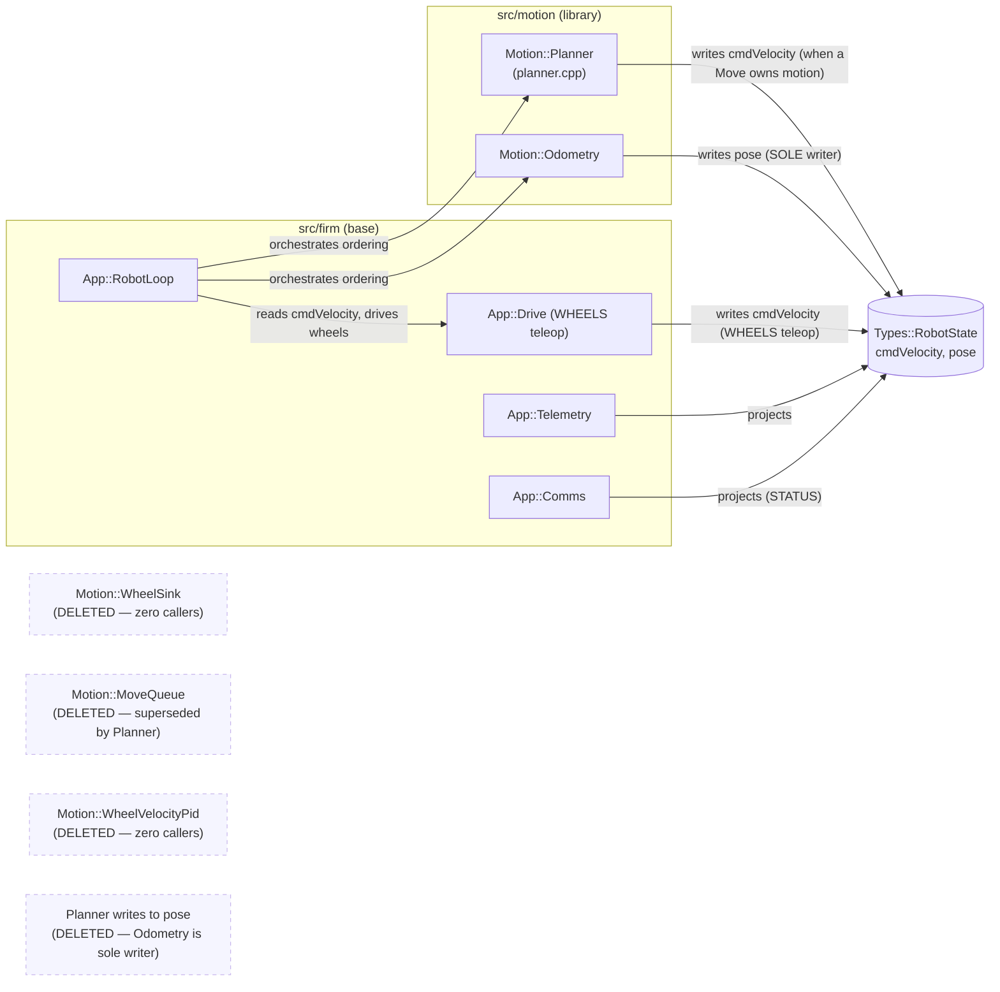

<!-- CLASI: Before changing code or making plans, review the SE process in CLAUDE.md -->

# Sprint 128: Complexity reduction: delete dead code, unburden the robot loop, fix bit rot

> **Executing this sprint? Read [`EXECUTION.md`](EXECUTION.md) FIRST.** This
> sprint runs in a separate clone, not the main checkout; its `.clasi`
> database is forked, so ticket status moves differently; and the test
> baseline is RED with six known pre-existing failures. None of that is
> guessable from this file.

## Goals

Collect and close out every issue from the 2026-07-30 craftsmanship review
that reduces complexity rather than adding capability: delete dead firmware
and host code, move telemetry/status policy out of the robot loop into the
modules that actually own it, and fix bit rot (stale docs, a wire-format
crash, unsafe halt paths) — per stakeholder framing 2026-07-31. This sprint
adds no new capability; every ticket either deletes code, relocates
responsibility to its rightful owner, or fixes a defect the review found.

## Problem

The 2026-07-30 code review found the same failure shape repeatedly across
the tree: code that *looks* load-bearing but has zero live callers (the
`WheelSink`/`MoveQueue` generation, `WheelVelocityPid`, `sensors/`'s dead
trackers, `StreamingExecutor`, duplicate lookahead geometry, the GUI's
`binary_bridge` translation layer, keyboard-drive teleop); loop-schedule
code doing another module's policy job (the TLM mode switch and STATUS
projection sitting inline in `RobotLoop::tick()`); a genuine safety defect
repeated at 6+ call sites (`stop()` used where `estop()` was meant, several
with the failure swallowed); and a wire-format crash that kills the one
interactive tool used to *find* firmware bugs (`repl.py`'s `confirm()`
reading a deleted `TLMFrame.ack` field). Left alone, each of these is a
false lead for the next bug hunt, and the halt-path defect is the kind that
has already produced a real incident (a fence that detected correctly and
stopped nothing).

## Solution

Eighteen issues, grouped into five themes (A: move things out of the robot
loop; B: delete dead firmware/motion code; C: delete dead host code; D: bit
rot / misplacement; E: coupled P0 safety fixes that are also
simplifications), executed as ~16 tickets batched by mechanical similarity
and file locality, in dependency order. Firmware-boundary decisions (issues
3 and 4) are planned against their issue's own stated recommendation but
flagged prominently below for stakeholder override at the approval gate.
Two issues (10, 12) required verifying what actually landed in sprint 127
before planning — see their entries in Design Rationale below; both
resolved to straightforward deletions once verified.

## Success Criteria

- All 18 linked issues are either closed by a ticket or explicitly
  deferred with a recorded reason (none are expected to be deferred; the
  team-lead's exclusion list already carved out everything not in scope).
- `grep` acceptance checks named in each source issue pass (each ticket
  inherits its issue's own acceptance criteria verbatim where applicable).
- Full clean build (`just build-clean`) + `motion_tests` + the planner
  `ctest` suite + firmware pytest tiers pass, with zero behavior change on
  the deletions (the deleted code was unwired — a behavior change on
  deletion means something was live, and that ticket stops and
  investigates rather than proceeding).
- `uv run python -m pytest` green on the host side; GUI-touching tickets
  additionally pass `test_gui_button_acceptance.py`.
- The sprint closes with the standing hardware bench-verification gate run
  on the stand (`.claude/rules/hardware-bench-testing.md`): sensors alive,
  wheels drive with encoders incrementing, and a round trip over the real
  link — via `radio_bench_gate.py` and/or `move_protocol_bench.py` — since
  this sprint touches firmware HAL/motor-control/loop/protocol-adjacent
  code (the TLM/STATUS relocation, the WheelSink/MoveQueue deletion, the
  IRQ guard removal).
- Every "halt now" call site in the tree calls `estop()`, and no halt call
  anywhere in `src/host` is wrapped in a bare `except Exception: pass`
  without a log line (issue 18's own acceptance, sprint-wide).

## Scope

### In Scope

Exactly the 18 linked issues, grouped:

**A. Move things out of the robot loop**
1. `tlm-mode-switch-belongs-in-telemetry-not-the-loop.md`
2. `status-projection-belongs-in-comms-not-the-loop.md`

**B. Delete dead firmware/motion code**
3. `wheelsink-boundary-decision-delete-the-movequeue-generation.md`
4. `delete-wheel-velocity-pid-and-decide-the-duty-stage.md`
5. `robot-state-pose-needs-exactly-one-writer.md`
6. `make-irq-guard-off-permanent-and-reconcile-the-docs.md`

**C. Delete dead host code**
7. `delete-dead-sensors-modules-k-command-calibration-and-trackers.md`
8. `delete-binary-bridge-dead-half-and-direct-call-the-survivors.md`
9. `testgui-keyboard-drive-is-dead-port-to-move-twist-or-delete.md`
10. `streaming-executor-delete-or-adopt-for-pathplan.md`
11. `nav-goto-stack-is-dead-gate-it-loudly-then-rebuild-or-delete.md`
12. `path-geometry-is-already-solved-reuse-it-for-ticket-008.md`

**D. Bit rot / misplacement**
13. `repl-confirm-reads-deleted-ack-slot-scan-the-ack-ring.md`
14. `doc-rot-and-minor-sweep-from-2026-07-30-review.md`
15. `relocate-testkit-and-motion-bench-artifacts-out-of-product-trees.md`
16. `relocate-turn-shape-and-collapse-to-one-capture-path.md`

**E. Coupled P0 safety fixes that are also simplifications**
17. `testgui-stop-paths-must-halt-through-the-transport-not-the-dead-bridge.md`
18. `halt-now-call-sites-must-use-estop-and-never-swallow-failure.md`

### Out of Scope

Explicitly excluded (not planned, not linked, per stakeholder direction
2026-07-31): `rebuild-nezha-facade-on-the-v5-binary-surface.md`,
`rewrite-io-calibrate-on-the-v5-binary-surface.md`,
`decompose-testgui-main-into-controller-classes.md`,
`main-cpp-constants-move-to-robot-config.md`,
`square-tour-is-the-one-system-test-sim-bench-playfield.md`,
`measure-actuation-floor-and-set-termination-tolerance.md`,
`path-following-hardware-gaps.md`,
`host-side-ack-drop-fault-injection-for-deterministic-retry-path-testing.md`,
`surface-i2c-error-counts-through-the-bus-interface.md`,
`vision-config-robot-tag-id-must-fail-closed.md`, and everything in
`clasi/issues/later/`. These are capability work, hardware-characterization
work, or explicitly deferred future issues — none of them are complexity
reduction and none were pulled in scope-creep.

Also out of scope for **this sprint's tickets**, though touched by
Design Rationale below: issue 11's rebuild-or-delete decision for `nav/`'s
goto stack (only the loud front-door gate is planned; the actual
rebuild-on-pathplan-or-delete rides a separate future sprint, per the
issue's own two-step split) and issue 15's testkit-vs-delete final call
(planned as delete-by-default, pending stakeholder confirmation called out
in Design Rationale).

## Execution Context

All ticket implementation happens in a **git worktree** on the
`sprint/128-complexity-reduction-delete-dead-code-unburden-the-robot-loop-fix-bit-rot`
branch, created via `acquire_execution_lock` after the stakeholder-approval
gate. This checkout
(`/Volumes/Proj/proj/RobotProjects/radio-robot-elite`) stays on `master`
throughout planning and is not used for implementation.

## Test Strategy

- **Firmware tickets** (Architecture group B and the loop-relocation
  tickets in group A): sim unit-test harnesses per the touched module
  (`app_comms_harness.cpp`, `app_telemetry_harness.cpp`,
  `motion_move_queue_chained_tests`, etc.), `motion_tests` (standalone
  CMake target, `src/motion/`), the planner `ctest` suite
  (`src/motion/planner/`), and firmware pytest tiers. Any ticket that
  changes a shared header (`robot_state.h`, `telemetry.h`, or similar)
  must do a full **clean build** (`just build-clean`), not incremental —
  per project memory, a stale incremental build after a shared-header
  change produces a boot HardFault indistinguishable from power loss.
- **Host tickets**: `uv run python -m pytest`. GUI-touching tickets
  (`binary_bridge`, `testgui/drive.py`, `Transport.halt()`,
  `turn_shape.py`'s relocation) additionally require
  `test_gui_button_acceptance.py` — the project's Sim-only GUI test gap is
  exactly what let the STOP-button defect (issue 17) ship undetected, so
  its own ticket must add a hardware-transport-shaped test (mocked
  `NezhaProtocol`), not just rely on the Sim suite.
- **Sprint-level acceptance** (not per-ticket): the standing hardware
  bench-verification gate (`.claude/rules/hardware-bench-testing.md`) —
  deploy to the robot on the stand and run `radio_bench_gate.py` and/or
  `move_protocol_bench.py` — because this sprint's firmware changes touch
  the HAL/motor-control/loop/protocol surface (TLM/STATUS relocation,
  WheelSink/MoveQueue deletion, IRQ guard removal). This is baked into the
  sprint's own acceptance, not repeated per ticket.
- Every deletion ticket's acceptance includes the specific `grep`
  invariant its source issue names (e.g. `grep -rn "WheelSink\|MoveQueue"
  src/firm src/motion` returns only the design-history doc reference) —
  these are cheap, sprint-wide regression guards against a deletion being
  reverted or a reference surviving.

## Architecture

**Sizing: Substantial.** Touches the firmware base (`src/firm/app`,
`src/firm/devices`), the motion library (`src/motion`, including its own
`planner/` sub-tree), and at least eight host-side packages (`testgui/`,
`planner/`, `path/`, `nav/`, `sensors/`, `io/`, `robot/`, `testkit/`).
Two of the eighteen issues are genuine structural changes — issue 3
deletes a documented cross-module boundary interface
(`Motion::WheelSink`) and promotes a shared-struct field
(`Types::RobotState::Wheel::cmdVelocity`) to be the boundary instead, and
issue 5 changes which module has write authority over
`RobotState::pose` — both are exactly the "dependency-direction change" /
"data-model change" triggers that mandate the substantial tier regardless
of how the other sixteen, lower-risk issues would size individually. This
mirrors sprint 020's own precedent: a large batch of independent
bugfix/cleanup issues touching many existing modules, substantial by
count and by the two structural items embedded in it, but — per Step 4
below — most of the batch needs no diagram because nothing new is being
composed.

### Step 1 — Understand the Problem

See Problem above. The unifying pattern across all 18 issues: code that
compiles and looks alive but has zero live callers (dead code), code that
runs but computes a value nobody reads (dead computation — the discarded
duty stage, the unconsumed `StateEstimator`), and code whose *location*
implies an ownership it doesn't have (the loop doing telemetry's policy
job; three independent pose estimators with no declared owner). Each
issue traces to a `01`-through-`05`-numbered review document; none of
them originated from a stakeholder feature request.

### Step 2 — Identify Responsibilities

Six responsibility groups, each changing for its own reason:

1. **Loop-schedule vs. telemetry/comms policy** (issues 1, 2) — the loop
   should say *when*, not *what*; `Telemetry`/`Comms` should own their own
   projections.
2. **The firm↔motion actuation and pose-ownership boundary** (issues 3, 4,
   5) — which struct field is the real boundary, which module writes it,
   and what happens to the three superseded wheel-control/pose-estimation
   generations sitting beside the live one.
3. **A hardware-errata workaround whose cost now outweighs its benefit**
   (issue 6) — a stakeholder-decided deletion, not a design debate; this
   sprint executes it.
4. **Host-side dead code with zero live callers** (issues 7, 8, 9, 10, 12)
   — five independent packages (`sensors/`, `testgui/binary_bridge.py`,
   `testgui/drive.py`, `planner/executor.py`, `path/`), each with its own
   proof of zero callers and its own deletion or port decision.
5. **A safety-critical idiom used inconsistently** (issues 17, 18) — one
   correct halt idiom (`estop()`, retried, loud on failure) replacing six-
   plus divergent call sites, one of which routes through a permanently
   dead translation layer.
6. **Documentation and placement rot** (issues 11 partial, 14, 15, 16) —
   stale docs, code in the wrong tree, committed measurement output,
   three divergent implementations of "what does a turn look like."

### Step 3 — Define Subsystems and Modules

| Module | Purpose (one sentence) | Boundary | Use cases served |
|---|---|---|---|
| `App::Telemetry` (`src/firm/app/telemetry.{h,cpp}`) | Owns telemetry mode and frame-emission policy. | Reads `RobotState` and a `TlmAction`; writes wire frames. Gains `applyAction()`; loses nothing. | SUC-001 |
| `App::Comms` (`src/firm/app/comms.{h,cpp}`) | Owns the STATUS reply's projection from `RobotState`. | Reads `RobotState` (+ `Telemetry`'s two sourced fields); writes the `Status` reply struct. Gains `updateStatus()`. | SUC-001 |
| `App::RobotLoop` (`src/firm/app/robot_loop.cpp`) | Sequences the cycle; owns no domain policy of its own. | Calls into `Telemetry`/`Comms`/`Motion::Planner`/`Motion::Odometry` in documented order; shrinks by ~40 lines this sprint. | SUC-001, SUC-002 |
| `Motion::Planner` (`src/motion/planner/planner.cpp`) | Computes the active `Move`'s commanded wheel velocities and (dormant) duty stage. | Writes `RobotState::Wheel::cmdVelocity` (sole writer alongside `App::Drive`'s WHEELS-teleop path, arbitrated by loop ordering); no longer writes `RobotState::pose`. | SUC-002 |
| `Motion::Odometry` (`src/motion/odometry.{h,cpp}`) | Integrates encoder deltas into the trip-odometer pose. | Sole writer of `RobotState::pose`. | SUC-002 |
| `Motion::WheelSink`/`Motion::MoveQueue` (`src/motion/wheel_sink.h`, `move_queue.{h,cpp}`) | **Deleted.** Was: an alternate, uncalled generation of the actuation boundary. | N/A after this sprint. | SUC-002 |
| `Motion::WheelVelocityPid` (`src/motion/wheel_velocity_pid.{h,cpp}`) | **Deleted.** Was: an alternate, uncalled wheel-velocity control law. | N/A after this sprint. | SUC-002 |
| `Motion::StateEstimator` (`src/motion/state_estimator.{h,cpp}`) | Predict-to-now peer estimate. | Retired from the live loop tick (deleted or parked with a named DESIGN.md owner — stakeholder call, see Design Rationale). | SUC-002 |
| `Devices::I2CBus` (`src/firm/devices/microbit_i2c_bus.{h,cpp}`) | Owns bus transaction sequencing. | Loses the full-transaction IRQ guard (`irqGuard_`); keeps the per-device clearance wait and the re-entrancy flag, which do different jobs. | SUC-003 |
| `robot_radio.robot` (`halt.py`, new) | Owns the one correct halt-now idiom. | New `halt_now(proto)` helper (retry-3x, raise-loud); called from `io/cli.py`, `io/repl.py`, `io/calibrate.py`, `robot/cutebot.py`, `field/geofence.py`. | SUC-004 |
| `robot_radio.io.repl` | Owns the REPL's ack-wait. | `confirm()` scans the `acks` ring instead of the deleted scalar `TLMFrame.ack` slot. | SUC-004 |
| `robot_radio.testgui.transport` | Owns the GUI's transport-level halt. | New `Transport.halt()` ABC method; `_HardwareTransport`/`SimTransport` implement it over `estop()`. | SUC-004, SUC-005 |
| `robot_radio.testgui.binary_bridge` | Owns GUI-verb-to-wire translation for the verbs that still have a wire meaning. | Loses its entire dead dispatch tail (`_LEGACY_TRANSLATION_AVAILABLE` gate and everything behind it); gains direct-call helpers for the survivors. | SUC-005 |
| `robot_radio.sensors` | Owns pose tracking and calibration. | Loses `calibration.py`, `cam_tracker.py`, `odom_tracker.py` (dead, zero callers); keeps `odometry.py::Odometry` as the one pose-tracking module. | SUC-006 |
| `robot_radio.testgui.drive` | Owns keyboard teleop, if kept. | Deleted (Option B — see Design Rationale) rather than ported. | SUC-006 |
| `robot_radio.planner.executor` | Owns the streaming-executor loop, if adopted. | Deleted (zero production callers confirmed; `pathplan.planner`/`tour.py` each built their own loop independently). | SUC-006 |
| `robot_radio.path` | Owns path geometry. | Loses `arc.py` (dead, superseded by `pathplan.solver.solveArcToPoint`) and the dead lookahead functions in `catmull_rom.py` (superseded by `pathplan.solver.pursuitTarget`, built independently by sprint 127 ticket 008). | SUC-006 |
| `robot_radio.nav` | Owns world-frame goto/navigation, when rebuilt. | Gains a loud `NotImplementedError` at the front door of `camera_goto.py`/`navigator.py`'s dead entry points; MCP tools catch and report honestly. Full deletion/rebuild is future work. | SUC-007 |
| `robot_radio.testkit`, `src/motion/planner/bench` | Own bench/diagnostic tooling. | Relocated out of the importable/product trees to `src/tests/` (or deleted where zero live callers, pending stakeholder confirmation). | SUC-008 |
| `robot_radio.testgui.turn_shape` | Owns turn-shape diagnostic capture. | Relocated to `src/tests/sim/`; collapses from three capture paths to (at most) two, one explicitly demoted. | SUC-008 |

### Step 4 — Diagrams

**One dependency-graph diagram is warranted**: the firm↔motion actuation/
pose boundary (issues 3 and 5 change dependency shape and data-write
ownership — the two genuinely structural items in this sprint).

**No component diagram for the host-side dead-code removals (Steps
2's groups 4-6, issues 7-16 minus 11's gate).** Sixteen of the eighteen
issues here are independent deletions or relocations across packages that
already exist and are not gaining any new composition — the same shape
sprint 020 documented and explicitly declined to diagram. A diagram of
"module X loses a dead file" repeated eleven times would not clarify
anything a bullet list doesn't already say; see Step 3's table for the
per-module detail instead.

**No ERD.** No issue in this sprint changes a persisted/serialized data
model (the `RobotState::pose` ownership change is an in-memory write-path
change, not a schema change; wire formats are untouched).

### Step 5 — What Changed, Why, Impact, Migration Concerns

**What Changed**: see Step 3's table, row by row.

**Why**: see Problem above and each issue's own "What is wrong" section
(not re-derived here — the issues are the source of truth and are linked
in this sprint's frontmatter).

**Impact on Existing Components**: Purely subtractive or relocating for
everything except issues 1, 2, 3, 5, and 17. Issues 1/2 change
`RobotLoop::tick()`'s internal structure but not its externally observed
timing or ordering (both issues explicitly preserve the STATUS-after-
TLM-switch and projection-before-`sendTlmReply()` ordering constraints).
Issue 3 changes which header a reader consults to find the actuation
boundary (`robot_state.h`'s own field comment, not a separate interface
header) — a real but narrow blast radius, confined to `main.cpp`,
`drive.{h,cpp}`, and the four build-source-list locations issue 3's own
text warns about. Issue 5 changes telemetry's pose source only in the
case `headingOtosWeight > 0` is ever set nonzero — today it defaults to
0.0, so no observed behavior changes, but the change closes a latent
"telemetry flips pose source silently" hazard. Issue 17 changes STOP's
actual wire behavior on hardware (today it silently no-ops) — this is a
bug fix disguised as a simplification, and its bench check will show a
real behavior change (the robot now actually stops), which is expected
and desired, unlike every other deletion ticket where a behavior change
means stop-and-investigate.

**Migration Concerns**: None are data-migration concerns (no persisted
schema changes). Sequencing concerns:
- Issue 17 (`Transport.halt()`) must land before or with issue 8
  (`binary_bridge` deletion) — the GUI's STOP currently routes through
  that bridge; deleting the bridge first, before the halt path is
  rewired onto `Transport.halt()`, would leave a window with no working
  halt path on hardware at all.
- Issue 11's loud-gate step should land early and standalone — it is
  pure risk reduction (turning a mid-loop `AttributeError` into a
  front-door `NotImplementedError`) with no dependency on anything else
  in this sprint.
- Issues 3, 4, and 5 all touch `src/motion/planner/planner.cpp` (a
  different file from the host-side `planner/` package — this is
  `src/motion/planner/`, the C++ motion planner, not
  `src/host/robot_radio/planner/`) and `robot_loop.cpp`; sequencing them
  3 → 5 and 3 → 4 (both after 3) avoids one ticket's diff colliding with
  another's in the same region, even though execution is serial in one
  worktree, not literally concurrent.
- Any ticket touching `robot_state.h` (issue 5's writer-comment fix,
  issue 3's boundary-documentation comment) must do a clean build
  (`just build-clean`), per the shared-header-change hazard in Test
  Strategy above.

### Step 6 — Design Rationale

**Decision 1 — the firm↔motion actuation boundary (issue 3).**
FLAGGED FOR STAKEHOLDER OVERRIDE — see the callout below.
- **Context**: `Motion::Planner::update()` writes
  `RobotState::Wheel::cmdVelocity` directly and `RobotLoop::cycle()`
  consumes it directly; `Motion::WheelSink` (the documented boundary
  interface) has zero callers — confirmed via `drive.h:125-132`'s own
  comment and this sprint's own verification against HEAD `1bc6ce35`.
- **Alternatives considered**: (a) promote the `RobotState` field to be
  the documented boundary and delete `WheelSink`/`MoveQueue` outright
  (issue's own recommendation); (b) restore `WheelSink` as the seam and
  route `Planner` through it.
- **Why (a)**: it already IS the real boundary — (b) would be adding
  code back to match a document, rather than fixing the document to
  match the code that already works. Absent a concrete reason to keep an
  interface object between two trees that already share `RobotState`,
  (a) is strictly less code for the same behavior.
- **Consequences**: ~1,500 lines deleted
  (`wheel_sink.h`/`move_queue.{h,cpp}`/`stop_condition.{h,cpp}`/
  `velocity_shaper.{h,cpp}`, their `motion_tests` targets, and
  `test_app_move_queue.py`); the land-at-zero margin derivation in
  `move_queue.cpp` is preserved as dated design history before deletion,
  not lost; three design docs (`docs/design/design.md` §5,
  `src/firm/app/DESIGN.md`, `src/motion/DESIGN.md`) require rewriting to
  match; `CLAUDE.md`'s stale "velocity PID is part of the frozen base"
  claim is fixed in the same pass.

**Decision 2 — the discarded duty stage (issue 4).**
FLAGGED FOR STAKEHOLDER OVERRIDE — see the callout below.
- **Context**: `Motion::WheelPid`/`Planner::stageDuty()` runs a full
  per-wheel PID every cycle (~21 evaluations/s) whose output
  `main.cpp:408-412` says is "computed every tick and DISCARDED." Only
  `Motion::WheelTrim` actually reaches the wheels.
- **Alternatives considered**: **park** (stop calling `stageDuty()` from
  the live tick; keep the class + its ctest tiers; add a DESIGN.md note
  naming intent and owner) vs. **adopt** (state the duty-sink cutover is
  actually near and leave it computing, with the "DISCARDED" comment
  becoming a dated plan-of-record).
- **Why park (recommended)**: nothing in this sprint's scope brings the
  duty-sink cutover closer; parking stops spending cycle budget on a
  value nobody reads and stops a profiler/reader from finding a
  live-looking controller that does nothing, while keeping the validated
  class and its tests warm for whenever that cutover actually happens.
- **Consequences**: `WheelVelocityPid` (zero instantiations, a fully
  separate class from `WheelPid`/`stageDuty()`) is deleted outright
  regardless of the park/adopt call — that part is unambiguous. The
  park/adopt call only affects whether `stageDuty()` keeps running;
  either way, `src/motion/DESIGN.md` gains the "wheel control
  generations" note issue 4 specifies.

**Decision 3 — IRQ guard deletion (issue 6).** Already stakeholder-decided
2026-07-30 ("we should have no IRQ guard... we just remove the whole
system"), not a design choice this sprint reopens. This sprint executes
the recorded decision: delete `irqGuard_` and `setIrqGuard()`/`irqGuard()`
from `microbit_i2c_bus.{h,cpp}`, `main.cpp:213`'s call site, and the
documented surface in `i2c_bus.h`/`devices/DESIGN.md`; keep the per-device
clearance wait and the re-entrancy flag, which the issue's own analysis
shows do unrelated jobs. Consequence: restores inbound command throughput
to ~0% loss (from ~7-8% with the guard on), trading a reduced-but-bounded
wedge risk (now caught by the mandatory `MOVE` timeout, which did not
exist when the guard was made "non-negotiable") for a reliable command
channel.

**Decision 4 — StreamingExecutor: delete, not adopt (issue 10).**
- **Context**: the issue was written before sprint 127 ticket 006 landed;
  it asked whoever built ticket 006's `pathplan` planner loop to check
  whether `StreamingExecutor`'s shape fit before choosing.
- **Verified this sprint** (not re-derived from the issue's own
  speculation): `grep -rn "StreamingExecutor(" src/` (construction, not
  just docstring mentions) returns zero results anywhere in the tree,
  including `src/tests/`. Sprint 127's `pathplan/planner.py` built its
  own `gotoWorld`/`followPath` loop from scratch — `StreamingExecutor`
  was not adopted, by omission, not by a recorded decision.
- **Why delete**: the loop this issue offered as reusable was never
  actually reused; keeping it beside the new one is exactly the "one
  continuously-replacing executor loop, never a dead one beside a new
  one" failure the issue itself warns against. Delete `executor.py`;
  keep the `RunOutcome`/`RunState`/`TickResult` shells `tour.py` still
  imports (move them into `tour.py` if that reads cleaner at ticket
  time).
- **Consequences**: `heading.py`/`model.py`/`profile.py` (dependencies of
  the deleted executor, already independently dormant per
  `robot_radio/DESIGN.md`) become candidates for the same treatment, but
  are not in this sprint's scope — not touched unless a ticket finds
  they are now fully orphaned as a direct consequence of this deletion,
  in which case note it as a follow-up issue rather than silently
  expanding ticket scope.

**Decision 5 — path geometry: delete, not adapt (issue 12).**
- **Context**: the issue's own framing (written before ticket 008
  landed) recommended adapting `path/catmull_rom.py`'s
  `find_lookahead_target`/`circle_intersections` into `pathplan/` for
  ticket 008's target-picker.
- **Verified this sprint**: ticket 008 is DONE (not "in exception" as the
  issue's stale framing said — sprint 127 closed 2026-07-31). Reading
  ticket 008 directly: it shipped its own `solver.pursuitTarget()`
  (lookahead-circle pure pursuit against the waypoint polyline, committed
  `8e38b2b6`, 64 unit tests, A/B-validated in sim), independently of
  `path/catmull_rom.py`'s functions — confirmed by `grep`:
  `find_lookahead_target`/`circle_intersections` have no callers outside
  their own definition file; `path/arc.py`'s `compute_arc` likewise has
  no callers (superseded by ticket 005's `solver.solveArcToPoint`,
  already noted in the issue).
- **Why delete, not adapt**: there is nothing left to adapt — the
  adaptation this issue asked for already happened independently, via a
  different, from-scratch implementation. The only remaining action is
  deleting the now-confirmed-dead duplicate and leaving the
  acknowledgment pointer in `pathplan/solver.py`'s header the issue
  itself specifies.
- **Consequences**: one circle-intersection implementation in the tree
  afterwards (`pathplan/solver.py`), as the issue's acceptance criterion
  requires — achieved by deletion rather than the originally-imagined
  migration.

**Decision 6 — keyboard-drive teleop: plan against Option B (delete)
(issue 9).** Not one of the two decisions flagged for stakeholder
override (those are Decisions 1 and 2 above) — this is a planning default
within the sprint-planner's own authority, made explicit here so it is
visible and overridable at approval time like anything else in the plan.
- **Context**: the issue requires "stakeholder pick required between A
  (port to the Move surface) and B (delete); do not leave the file
  as-is."
- **Why B by default**: gamepad and preset-button teleop already cover
  the live driving workflow (per `robot_radio/DESIGN.md`'s own testgui
  row); arrow-key drive has been fully dead in both Sim and hardware
  since the MOVE-protocol cutover, with no reported user demand for its
  return. Porting it (Option A) is real, scoped work (a `replace=True`
  bounded-Move keepalive) that adds a maintained surface for a workflow
  nobody has asked to keep. Absent a stated need, deletion matches this
  sprint's own charter (delete dead code) more directly than reviving it
  would.
- **Consequences**: if Eric wants the teleop workflow kept, this is the
  cheapest item in the whole sprint to flip to Option A at the
  ticket-review stage — the ticket's acceptance criteria already cover
  both options in the source issue.

**Decision 7 — testkit/ and motion-bench relocation: plan as delete
sensors[wire-independent utility kept], relocate the rest (issue 15).**
The issue itself says "zero live callers means deletion is the honest
default; confirm with the stakeholder before keeping" — planned that way;
`read_camera_pose` (the one real caller, `testgui/transport.py`) moves
with its caller rather than being deleted. This is flagged again in Open
Questions below since it is a case where the safe default is destructive
(deleting bench harness code) and worth one explicit confirmation before
the ticket executes it.

### Step 7 — Open Questions / Flagged for Stakeholder Input

**>>> TWO DECISIONS — RESOLVED 2026-07-31, both approved exactly as
recommended <<<**

1. **Issue 3 — the firm↔motion boundary. RESOLVED: option (a).** Promote
   `Types::RobotState::Wheel::cmdVelocity` to be the documented actuation
   boundary and delete the `WheelSink`/`MoveQueue` generation outright
   (~1,500 lines, three design docs rewritten). Encoded as settled
   plan-of-record in ticket 014 — no longer presented as an open option
   there.

2. **Issue 4 — the duty stage. RESOLVED: PARK.** Stop calling
   `stageDuty()` from the live tick, keep the `WheelPid` class and its
   ctest tiers, add a DESIGN.md note naming intent and owner.
   `WheelVelocityPid` is deleted unconditionally either way. Encoded as
   settled plan-of-record in ticket 015 — no longer presented as an open
   option there.

Other open items (not stakeholder-override-flagged, but worth surfacing):

3. Issue 9's Option A/B pick (port vs. delete keyboard-drive teleop) —
   planned as delete (Design Rationale Decision 6); cheap to flip if
   wrong.
4. Issue 15's testkit/ deletion — planned as delete-by-default per the
   issue's own stated bar; worth one confirmation since it destroys bench
   harness code (`SafeRun`/`BenchRun`/`Dashboard`), not just dead product
   code.
5. Issue 11's nav/ rebuild-or-delete decision is explicitly NOT part of
   this sprint (only the loud gate is) — flagged so it isn't mistaken for
   scope creep if a future sprint picks it up.
6. Issue 14's own open item — whether the line sensor's dead parity-tick
   is fixed in this sprint's doc-rot ticket or deferred to its own issue.
   Recommend deferring to a fresh issue (it's a firmware behavior fix, not
   a doc-rot item, despite living in that issue's checklist) — flag at
   ticket-creation time.

## Use Cases

Nine sprint-level use cases, one per responsibility group from
Architecture Step 2/3, covering all 18 linked issues between them.

### SUC-001: The robot loop delegates telemetry-mode and STATUS policy to their owning modules
Parent: N/A (internal maintainability — no end-user-facing parent use case)

- **Actor**: A firmware engineer reading or modifying `RobotLoop::tick()`.
- **Preconditions**: `TlmAction`→`setMode()` dispatch and the field-by-field
  `Comms::Status` assembly currently sit inline in the loop body
  (`robot_loop.cpp`, ~541-583).
- **Main Flow**:
  1. `Telemetry::applyAction(TlmAction)` absorbs the mode-change switch and
     the "force a frame" decision.
  2. `Comms::updateStatus(state_, tlm_)` absorbs the STATUS projection.
  3. The loop shrinks to calling both in the same relative order as today
     (mode switch, then STATUS refresh, then `sendTlmReply()`), preserving
     the two documented ordering constraints.
- **Postconditions**: the loop states *when* telemetry/status run; the
  owning modules state *what* they mean. A new `RobotState`/`Status` field
  added later cannot be silently forgotten by a loop-level assignment list.
- **Acceptance Criteria**:
  - [ ] `grep -n "TlmAction\|status\." src/firm/app/robot_loop.cpp` no
        longer shows a switch or an 8-line field-by-field STATUS assembly.
  - [ ] `app_comms_harness.cpp`/`app_telemetry_harness.cpp` assertions
        move to driving the new entry points directly with a synthesized
        `RobotState`.
  - [ ] Same-cycle mode-change-visible-in-STATUS ordering is preserved
        (existing test coverage, re-pointed, still passes).

### SUC-002: The firm↔motion actuation boundary and pose ownership are unambiguous
Parent: N/A (internal architecture correctness)

- **Actor**: A firmware/motion engineer investigating "which controller
  actually reaches the wheels" or "which module owns `pose`."
- **Preconditions**: `Motion::WheelSink`/`MoveQueue` exist uncalled beside
  the real boundary (`RobotState::cmdVelocity`); `WheelVelocityPid` exists
  uncalled beside `WheelPid`/`WheelTrim`; `Planner`'s `PoseTracker` writes
  `state.pose` in addition to `Odometry`, ordering-dependent on which runs
  first each cycle.
- **Main Flow**:
  1. Delete `WheelSink`/`MoveQueue`/`StopCondition`/`VelocityShaper` (per
     Design Rationale Decision 1, flagged for override) and document
     `cmdVelocity` as the boundary on the field itself.
  2. Delete `WheelVelocityPid`; park or adopt `stageDuty()` (Decision 2,
     flagged for override).
  3. Delete the `state.pose` write in `Planner::update()`; `Odometry`
     becomes pose's sole writer. Retire (delete or park with a named
     owner) `StateEstimator`'s every-cycle call.
  4. Fix the stale writer comments in `robot_state.h` (`pose`,
     `cmdVelocity`) and update `src/motion/DESIGN.md`'s estimator roster.
- **Postconditions**: "which pose is the robot's pose" and "which
  controller reaches the wheels" each have a one-line, code-verifiable
  answer.
- **Acceptance Criteria**:
  - [ ] `grep -rn "WheelSink\|MoveQueue\|move_queue\|stop_condition\|velocity_shaper" src/firm src/motion`
        returns only the design-history doc reference.
  - [ ] `grep -rn "WheelVelocityPid" src/` returns nothing.
  - [ ] `grep -n "state.pose" src/motion/planner/planner.cpp` shows reads
        only.
  - [ ] A firmware test asserts a full cycle leaves `state.pose` equal to
        `Odometry`'s integration even with `headingOtosWeight > 0`
        configured.
  - [ ] Bench: `twist_drive.py` smoke behavior unchanged.

### SUC-003: The I2C bus runs without the retired full-transaction IRQ guard
Parent: N/A (already stakeholder-decided; this sprint executes it)

- **Actor**: A firmware engineer relying on inbound command reliability.
- **Preconditions**: `irqGuard_` defaults `true`; `main.cpp:213` sets it
  `false` with a `TEMPORARY` comment, after two days of guard-off
  camera-verified operation with no runaway.
- **Main Flow**:
  1. Delete `setIrqGuard()`/`irqGuard()`/`irqGuard_` from
     `microbit_i2c_bus.{h,cpp}`.
  2. Delete `main.cpp:213`'s call site and its `TEMPORARY` comment.
  3. Drop the surface from `i2c_bus.h`/`devices/DESIGN.md`; keep a short
     note recording the errata and why the guard was removed.
- **Postconditions**: inbound command loss stays at the guard-off level
  (~0%, vs. ~7-8% with the guard on); the per-device clearance wait and
  re-entrancy flag (different mechanisms) are unaffected.
- **Acceptance Criteria**:
  - [ ] `grep -rn "irqGuard\|setIrqGuard" src/` returns nothing outside
        history.
  - [ ] Bench gate passes on the stand; wedge-latch/bus-error counters no
        worse than the guard-off baseline.

### SUC-004: Every "halt now" path calls estop(), fails loudly, and the bench REPL survives every motion verb
Parent: N/A (P0 safety)

- **Actor**: Any operator or automated caller (CLI, REPL, geofence,
  Ctrl-C handler) that needs the robot stopped NOW.
- **Preconditions**: six-plus call sites use the PLANNED `stop()` where
  the context means "halt now" (measured 39.8 cm/5.9 s vs. 2.9 cm/0.10 s
  for `estop()`), several swallowing the call's own failure; separately,
  `repl.py`'s `confirm()` reads a deleted `TLMFrame.ack` field and crashes
  the REPL on the first ack-bearing frame of any motion verb.
- **Main Flow**:
  1. Add a shared `halt_now(proto)` helper (retry 3x, raise loud on total
     failure) modeled on `field/geofence.py::Geofence._halt()`.
  2. Convert every table-listed site (`io/robot_mcp.py`, `io/cli.py`,
     `io/repl.py`, `io/calibrate.py`, `robot/cutebot.py`) to call it;
     cleanup paths that must not raise still log, never bare-`pass`.
  3. Rewrite `repl.py`'s `confirm()` to scan the `acks` ring instead of
     the deleted scalar slot; fix the stale pump() docstring; fix
     `RogoSession.close()`'s swallowed `stop()` in the same touch.
  4. Have `Geofence._halt()` delegate to the shared helper.
- **Postconditions**: one halt idiom, used everywhere; the interactive
  REPL survives every command-issuing verb.
- **Acceptance Criteria**:
  - [ ] `grep -rn "proto\.stop()\|robot\.stop()\|_robot\.stop()" src/host/robot_radio/{io,robot}`
        finds only sites whose surrounding comment states a genuinely
        planned, sequenced stop.
  - [ ] No halt call in `src/host` is wrapped in bare `except Exception:
        pass` without a log line.
  - [ ] `rogo repl` survives `twist`/`stop`/`config`/`raw` against the
        bench robot; a unit test pins `confirm()`'s ring-scan and
        empty-ring-timeout behavior.
  - [ ] Bench: Ctrl-C during `rogo drive` halts wheels within ~0.1 s.

### SUC-005: The GUI's dead command-translation layer is removed; every reachable verb direct-calls a live protocol method
Parent: N/A (sequencing note: this SUC's own `Transport.halt()` step — issue
17, ticket 003 — must land before its `binary_bridge` deletion step —
issue 8, ticket 004; not a dependency on SUC-004, which is the unrelated
CLI/REPL-side `halt_now()` helper)

- **Actor**: A GUI operator clicking STOP, or an engineer tracing any GUI
  command path.
- **Preconditions**: `testgui/operations.py`'s `on_stop()` sends the
  string `"STOP"` through `binary_bridge.translate_command()`, an
  unconditional dead stub — the robot keeps driving; `binary_bridge.py`
  is otherwise ~40% unreachable code by its own admission.
- **Main Flow**:
  1. Add `Transport.halt()` to the ABC (`_HardwareTransport` calls
     `estop()`; `SimTransport` calls `SimLoop.stop()`).
  2. Rewire `on_stop()`, `_safe_stop()`, `_set_origin()` onto
     `transport.halt()`, logging `[ERROR] HALT FAILED` on a raise rather
     than logging success on faith.
  3. Delete `binary_bridge.py`'s dead dispatch tail and the four
     unreachable `_handle_*` functions; direct-call the survivors
     (`STREAM`→`tlmOn()`/`tlmOff()`, etc.); delete the dead COMMANDS rows
     (`S`/`T`/`R`/`TURN`/`G`) and the hidden panel construction.
- **Postconditions**: "does STOP work" is answerable by reading three
  short methods; no GUI path can send a verb that yields a polite,
  ignored `ERR`.
- **Acceptance Criteria**:
  - [ ] `grep -rn "command(\"STOP\"\|send(\"STOP\"" src/host/robot_radio/testgui/`
        returns nothing; `grep -rn "estop"` shows the ABC + backends +
        call sites.
  - [ ] `grep -n "_LEGACY_TRANSLATION_AVAILABLE\|legacy_verbs\|legacy_render" src/host/robot_radio/testgui/`
        returns nothing.
  - [ ] A hardware-transport-shaped test (mocked `NezhaProtocol`) asserts
        STOP produces exactly one `estop()` call, and a raising `estop()`
        produces an `[ERROR]` log, added to
        `test_gui_button_acceptance.py`.
  - [ ] Bench: STOP during a Managed move halts wheels within one cycle;
        disconnecting the link and clicking STOP shows the FAILED log,
        not success.

### SUC-006: Dead or half-dead host modules are removed or given an explicit, recorded decision
Parent: N/A (internal maintainability)

- **Actor**: An engineer searching the host tree for "the" implementation
  of sensor tracking, teleop, a streaming executor, or lookahead geometry.
- **Preconditions**: `sensors/calibration.py`/`cam_tracker.py`/
  `odom_tracker.py` are dead beside their live replacements;
  `testgui/drive.py`'s keyboard teleop is dead in both Sim and hardware;
  `planner/executor.py`'s `StreamingExecutor` has zero production callers
  (confirmed this sprint, superseding the issue's own "check first"
  framing — sprint 127 built its own loop); `path/arc.py` and
  `path/catmull_rom.py`'s lookahead functions are dead, superseded by
  `pathplan/solver.py`'s independently-built `solveArcToPoint`/
  `pursuitTarget` (also confirmed this sprint).
- **Main Flow**:
  1. Delete `sensors/calibration.py`, `cam_tracker.py`, `odom_tracker.py`
     and their `__init__.py` exports.
  2. Delete `testgui/drive.py` and its call sites (Design Rationale
     Decision 6 — Option B; flip to a port if overridden).
  3. Delete `planner/executor.py` (`StreamingExecutor`); keep the
     `RunOutcome`/`RunState`/`TickResult` shells `tour.py` imports.
  4. Delete `path/arc.py`; delete the dead lookahead functions in
     `path/catmull_rom.py`; add the acknowledgment pointer to
     `pathplan/solver.py`'s header.
- **Postconditions**: every one of these packages offers exactly one
  answer to "which implementation is live," not two.
- **Acceptance Criteria**:
  - [ ] `grep -rn "cam_tracker\|odom_tracker\|sensors.calibration" src/ --include=*.py`
        returns nothing outside `src/archive`.
  - [ ] `grep -rn "DEV DT" src/host/robot_radio/` returns nothing.
  - [ ] `grep -rn "StreamingExecutor" src/` shows no construction, only
        the historical docstring mentions already present, minus the
        deleted file itself.
  - [ ] `grep -rn "circle_intersections\|find_lookahead_target\|compute_arc" src/host`
        returns nothing.
  - [ ] Full pytest suite passes; `test_gui_button_acceptance.py` passes
        for the drive.py removal.

### SUC-007: The dead nav/ goto stack fails loudly at the front door instead of crashing mid-loop
Parent: N/A (P0 risk reduction; full rebuild/delete is future work)

- **Actor**: `rogo goto`/`rogo turnto` callers and the MCP
  `navigate`/`follow_path`/`visit_tags` tools, including an LLM operator.
- **Preconditions**: `nav/camera_goto.py`/`navigator.py` call deleted
  `NezhaProtocol` methods (`drive()`/`go_to()`), crashing with an
  `AttributeError` three frames deep, mid-loop.
- **Main Flow**:
  1. Add a `NotImplementedError` at the top of `go_to_world_camera`/
     `Navigator.navigate`/`follow_path`/`visit_tags`, naming the
     replacement (`pathplan.gotoWorld`) and this tracking issue.
  2. MCP tools catch it and return an honest "not available" result
     rather than stack-tracing.
- **Postconditions**: the dead surface fails at the front door, not
  mid-drive; nothing about the rebuild-or-delete decision is resolved by
  this ticket (explicitly out of scope — future sprint).
- **Acceptance Criteria**:
  - [ ] `rogo goto 30 10` prints the `NotImplementedError` message
        immediately, no traceback mid-drive.
  - [ ] MCP `navigate` returns the honest error; a unit test asserts both.

### SUC-008: Bench/test tooling and diagnostic capture scripts live outside the importable product trees
Parent: N/A (internal maintainability)

- **Actor**: An engineer auditing the importable product surface, or
  running a bench/diagnostic script.
- **Preconditions**: `testkit/` (bench harness code) sits inside the
  importable host package with one real caller (`read_camera_pose`);
  `src/motion/planner/bench/` + `py/` (2,229 lines) and ~9 MB of committed
  CSV/PNG captures sit inside the C++ library tree; `testgui/turn_shape.py`
  (364 lines, three sim-capture paths) sits in the shipped GUI package.
- **Main Flow**:
  1. Move `read_camera_pose` into `testgui/transport.py` (its real
     caller); relocate the rest of `testkit/` to `src/tests/tools/` or
     delete it (delete-by-default per Design Rationale Decision 7,
     pending one stakeholder confirmation — see Open Questions).
  2. Move `src/motion/planner/bench/`+`py/` to `src/tests/bench/`; move
     or delete the committed CSV/PNG captures (regenerate on demand if
     deleted, noting the generating script + date if history matters).
  3. Move `turn_shape.py` to `src/tests/sim/`; keep only
     `capture_turn_gui()` as the source of truth, demoting or deleting
     the other two capture paths.
- **Postconditions**: the importable product trees contain only product
  code; bench/diagnostic tooling lives in `src/tests/`.
- **Acceptance Criteria**:
  - [ ] `src/host/robot_radio/testkit/` no longer exists (or contains
        only what the stakeholder explicitly kept, with a stated reason).
  - [ ] `git ls-files src/motion/planner | grep -E "\.py$|\.csv$|\.png$"`
        returns nothing.
  - [ ] `src/host/robot_radio/testgui/turn_shape.py` is gone;
        `grep -rn "turn_shape" src/host/` returns nothing.
  - [ ] Relocated scripts run from their new home (spot-check one
        hardware script against the stand, one sim script); a standard
        90° turn-shape capture matches pre-move values.

### SUC-009: Stale documentation, unit-suffixed identifiers, and small contract stragglers are swept in one batch
Parent: N/A (internal maintainability; mechanical batch per project convention)

- **Actor**: Any engineer reading `DESIGN.md` rows, docstrings, or
  parameter names touched by the 2026-07-30 review's MINOR/NOTE findings.
- **Preconditions**: the doc-rot issue's own checklist (stale DESIGN.md
  rows, a wrong docstring number, unit-suffixed parameters surviving the
  rename sprints, a fail-open config default, duplicated helper logic, a
  cross-package-boundary private import, landmine annotations needed,
  small decisions needing one line of stakeholder input).
- **Main Flow**: one mechanical-sweep ticket, batched per the project's
  established mechanical-sprint pattern — each checkbox in the source
  issue done or explicitly struck with a reason.
- **Postconditions**: every item in the issue's checklist is resolved or
  explicitly deferred with a reason recorded in the issue file itself.
- **Acceptance Criteria**:
  - [ ] Each checkbox in `doc-rot-and-minor-sweep-from-2026-07-30-review.md`
        is done or struck with a stated reason.
  - [ ] `uv run python -m pytest` green; spot-check `grep`s per item.
  - [ ] The line-sensor dead-parity-tick item (Open Questions item 6) is
        deferred to its own fresh issue rather than silently fixed or
        silently dropped here.

## GitHub Issues

None — this sprint's scope is entirely CLASI issue files under
`clasi/issues/`, no linked GitHub issues.

## Definition of Ready

Before tickets can be created, all of the following must be true:

- [x] Sprint planning document is complete (sprint.md, including its
      Architecture and Use Cases sections)
- [x] Architecture review passed (self-review recorded via
      `record_gate_result`)
- [x] Stakeholder has approved the sprint plan — **including an explicit
      call on the two flagged decisions** (Architecture Step 7: issue 3's
      firm↔motion boundary, issue 4's duty-stage park/adopt call).
      Approved 2026-07-31: option (a) for issue 3, PARK for issue 4, both
      exactly as recommended. `stakeholder_approval` gate recorded
      `passed`; sprint phase advanced to `ticketing`, then to the 16
      created tickets below.

## Planned Ticket Breakdown (pre-approval preview — not yet created)

Ticketing is blocked on the stakeholder-approval gate above. This is the
cut the sprint-planner intends to create once unblocked, for Eric's
review before that happens. ~16 tickets, batched by mechanical similarity
and file locality, sequenced by dependency. Every ticket will carry an
explicit `issue=` frontmatter back-reference (this sprint has 18 linked
issues, so `create_ticket`'s single-issue auto-link does not fire).

| # | Title | Issue(s) | Depends On |
|---|-------|----------|------------|
| 001 | REPL ack-ring fix + `halt_now()` sweep across host call sites | 13, 18 | — |
| 002 | `nav/` goto stack: loud front-door gate (Step 1 only) | 11 (partial) | — |
| 003 | testgui `Transport.halt()` + rewire STOP/`_safe_stop`/`_set_origin` | 17 | — |
| 004 | Delete `binary_bridge.py`'s dead half; direct-call survivors; delete dead COMMANDS rows | 8 | 003 |
| 005 | testgui keyboard-drive: delete (Option B, or port if overridden) | 9 | 004 |
| 006 | Delete `sensors/` dead modules (calibration.py, cam_tracker, odom_tracker) | 7 | — |
| 007 | Delete `StreamingExecutor` (`planner/executor.py`) | 10 | — |
| 008 | Delete duplicate path geometry (`path/arc.py`, dead `catmull_rom.py` lookahead fns) | 12 | — |
| 009 | Doc-rot and minor sweep batch | 14 | 006, 007, 008 |
| 010 | Relocate `testkit/` + `src/motion/planner` bench artifacts out of product trees | 15 | 003, 004 |
| 011 | Relocate `turn_shape.py`; collapse to one capture path | 16 | 004 |
| 012 | Firmware: TLM mode switch → `Telemetry`; STATUS projection → `Comms` | 1, 2 | — |
| 013 | Firmware: delete the full-transaction I2C IRQ guard | 6 | — |
| 014 | Firmware: firm↔motion boundary — promote `cmdVelocity`, delete WheelSink/MoveQueue generation (per Decision 1, pending stakeholder confirmation) | 3 | 012 |
| 015 | Firmware: delete `WheelVelocityPid`; park/adopt `stageDuty()` (per Decision 2, pending stakeholder confirmation) | 4 | 014 |
| 016 | Firmware: `RobotState::pose` single writer; retire `StateEstimator` from the loop | 5 | 014 |

Tickets 001-011 (host-side) have no dependency on 012-016 (firmware-side)
and vice versa — they may execute in either relative order; the numbering
above groups host-first only for readability. Ticket 009 depends on
006-008 so its DESIGN.md-row updates describe the post-deletion state
rather than needing a second pass. The sprint's own bench-verification
gate (standing rule, not a ticket) runs after 012-016 land.

**Superseded by the table below** — this preview is kept for the
planning-time record (including the sizing/dependency reasoning above),
but the actual created tickets are the ones in `## Tickets`.

## Tickets

Stakeholder approval recorded 2026-07-31: both flagged decisions
(Architecture Step 7) approved exactly as recommended — issue 3's
firm↔motion boundary as option (a), issue 4's duty stage as PARK. Both
are encoded as settled plan-of-record in tickets 014 and 015
respectively (no longer open questions in those tickets' own text).

| # | Title | Depends On |
|---|-------|------------|
| 001 | REPL ack-ring fix + halt_now() sweep across host call sites | — |
| 002 | nav/ goto stack: loud front-door gate (Step 1 only) | — |
| 003 | testgui Transport.halt() + rewire STOP/_safe_stop/_set_origin | — |
| 004 | Delete binary_bridge.py's dead half; direct-call the survivors | 003 |
| 005 | testgui keyboard drive: delete (dead in Sim and hardware) | 004 |
| 006 | Delete sensors/ dead modules: K-command calibration.py, cam_tracker, odom_tracker | — |
| 007 | Delete StreamingExecutor (zero production callers) | — |
| 008 | Delete duplicate path geometry (path/arc.py, dead catmull_rom.py lookahead functions) | — |
| 009 | Doc-rot and minor sweep from the 2026-07-30 craftsmanship review | 006, 007, 008 |
| 010 | Relocate testkit/ and src/motion/planner bench artifacts out of product trees | 003, 004 |
| 011 | Relocate turn_shape.py out of testgui; collapse to one capture path | 004 |
| 012 | Firmware: move TLM mode switch into Telemetry, STATUS projection into Comms | — |
| 013 | Firmware: delete the full-transaction I2C IRQ guard | — |
| 014 | Firmware: promote RobotState wheel targets as the firm/motion boundary; delete WheelSink/MoveQueue generation | 012 |
| 015 | Firmware: delete WheelVelocityPid; park stageDuty() from the live tick | 014 |
| 016 | Firmware: RobotState::pose single writer; retire StateEstimator from the loop | 014 |

Tickets execute serially in the order listed above; 003→004 is the
safety-critical edge (`Transport.halt()` must exist before
`binary_bridge`'s dead half is deleted). The sprint's own
bench-verification gate (standing rule, not a ticket) runs once after
012-016 land — no per-ticket hardware bench gate is required.
