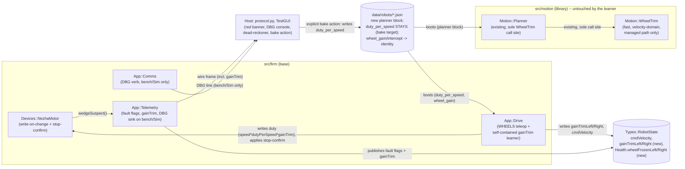

<!-- CLASI: Before changing code or making plans, review the SE process in CLAUDE.md -->

# Sprint 129: Actuation correctness and safety: fix the 35% speed deficit, make ESTOP unlosable, and consolidate configuration

## Goals

Make the actuation path trustworthy end to end: an ESTOP (or any lost duty
write) can never again leave the robot latched at a nonzero speed; a
stalled/frozen wheel is visible to the operator within half a second instead
of silently invisible; the commanded-speed-to-duty map reflects the real
plant instead of three constants that disagree by up to 2.34x; the unmanaged
`WHEELS` teleop path gains closed-loop trim instead of running fully open
loop; and the tuning/configuration values currently scattered as inline
literals across `main.cpp` and the host GUI move to their proper config
homes. Per stakeholder framing 2026-07-31, the actuation-safety and
plant-accuracy work is the priority (a real runaway happened this session);
the configuration and comment sweeps are real but mechanical and run last.

## Problem

2026-07-31 produced a real incident and a real measurement, both with the
same root shape: **a value the firmware believes is true has silently
diverged from the value that is physically true, and nothing was watching.**

- **The runaway.** `Devices::NezhaMotor::write()` suppressed any duty write
  equal to the last one it had *attempted* (`pct == lastWrittenPct_`). The
  Nezha brick **latches** its last commanded speed and does not reset on an
  nRF52 reset — only power does. A single lost zero write is therefore
  permanent: the host believes the stop was sent, the motor keeps spinning
  forever, and every subsequent ESTOP is suppressed as a no-op because
  `lastWrittenPct_` already says 0. 13 ESTOPs, a `WHEELS(0,0)`, and a reset
  all failed; the stakeholder stopped the robot by cutting power. A fix was
  built and hardware-verified the same session (kept the wheel spinning at
  0 vel/enc for 3s after ESTOP across 10 consecutive trials) and then
  abandoned along with the rest of that session's uncommitted work — this
  sprint re-lands it, cleanly, as the sprint's first and safety-critical
  ticket.
- **The speed deficit.** The unmanaged `WHEELS` path is open loop by
  design — `App::Drive`'s own header says so — so speed accuracy there is
  entirely the calibration. Three constants (`duty_per_speed`, `vel_kff`,
  and `vel_kff`'s own derivation note) each claim to encode the same
  physical plant gain and disagree by up to 2.34x; `wheel_gain`/
  `wheel_intercept` was fitted against `duty_per_speed`, which was fitted
  against it, and on tovez the correction now points the wrong way,
  compounding rather than correcting the error. Net effect measured on the
  bench: a 150 mm/s request produces ~52 mm/s (ratio 0.347).
- **A companion visibility gap.** The stall/wedge detector for a frozen
  wheel (`NezhaMotor::wedgeSuspect()`) already existed in the abandoned
  session's work and had zero consumers — nothing published it to
  telemetry, nothing showed it in the GUI. The same "live value, no
  display" shape that made the OTOS-frozen defect
  (`otos-frozen-at-a-constant-on-tovez`) expensive to find.
- **Configuration drift.** `main.cpp` assembles the entire
  `Motion::PlannerLimits` struct — including the very plant-gain constant
  implicated above (`kPlantGain = 1370.0f`) — as C++ literals, while the
  surrounding lines source everything else from real per-robot JSON. This
  directly contradicts the project's sprint-114 convention (config is
  fail-closed truth from `data/robots/*.json`, no behavioral defaults baked
  into source) and recreates the exact "one robot's numbers become every
  robot's" failure already paid for once. Similar drift is scattered
  through the host GUI (spinbox thresholds, retry counts, staleness
  windows) as bare literals mid-function.
- **Two TestGUI defects**, both introduced the same session: a 150 ms
  drive-lease refresh margin too tight, dropping both wheels mid-leg at
  four points on a 700 mm drive; and a per-wheel independent ease-out that
  turned a straight-leg distance equalizer into a terminal pivot, erasing a
  27-degree heading error from the encoder record while leaving it in the
  physical path. Separately, the GUI's host-side dead-reckoner integrated
  pose with the raw caliper trackwidth while the firmware integrates with
  the effective (slip-corrected) trackwidth — invisible on a straight leg,
  710 mm/15 deg of drift after a session of turns.

## Solution

Eleven issues, sequenced so the safety-critical fix lands first regardless
of how much of the sprint completes, the plant-accuracy work builds on a
corrected static baseline before the adaptive layer goes on top of it, and
the two purely mechanical sweeps (comments, configuration) run last so they
don't collide with tickets that are still actively editing the same files:

1. **ESTOP unlosable** (07) — re-land the hardware-verified fix: never
   suppress a zero write while the wheel is still moving; Drive re-asserts
   a commanded stop until it is *observed*, not until it is *sent*.
2. **Wheel-frozen fault visibility** (wheel-frozen-fault-flag) — publish
   the existing (gated) stall detector to telemetry and the GUI as a red,
   per-wheel banner. The direct regression guard for (1): if a write is
   ever silently lost again, this is what makes it visible in seconds
   instead of requiring another incident to notice.
3. **DBG debug channel** (05) — a compiled-conditional (bench/Sim only)
   firmware-to-host debug message channel, landed early because the duty
   sweep and calibration work in (4)-(6) below wants it.
4. **Two independent TestGUI defect fixes** — drive-lease expiry margin
   and the terminal-pivot equalizer (testgui-unmanaged-drive-lease-expiry),
   and the host dead-reckoner's raw-vs-effective trackwidth
   (testgui-host-dead-reckoner). Neither depends on the actuation work
   above or on each other.
5. **Static plant-gain reconciliation** (06, plus the small
   bench-duty-readers-see-zero residual folded in) — set `wheel_gain`/
   `wheel_intercept` to identity, measure the real per-wheel plant gain
   with an open-loop duty sweep on the stand, and reconcile `duty_per_speed`
   and `vel_kff` against the measurement. This is the corrected static
   baseline the adaptive layer in (6) needs to converge *from*, not away
   from.
6. **Continuous duty-per-speed calibration** (04) — stakeholder-settled
   2026-08-01, revising the shape planned during architecture review:
   `App::Drive` grows its own per-wheel multiplicative `gainTrim`
   (`duty = speed * dutyPerSpeed * gainTrim`) — Drive maintaining its own
   calibration from its own knowledge (its map, its command, the encoder
   measurement), not a `Motion::WheelTrim` instance and not a motion-side
   calibrator. It is a **calibration**, not a control loop: a slow
   (~60 s of driven time) asymmetric learner (learns up slowly, relaxes
   toward 1.0 about 5x faster) that is deliberately too slow to react to a
   momentary load, so it cannot be confused with — or fight — the fast
   loop (`Motion::WheelTrim`, unchanged, still the managed path's own
   velocity-domain corrector). `gainTrim` is RAM-only and boot-resets to
   1.0; the firmware persists nothing. The host, not the firmware, is
   responsible for carrying learning forward: an explicit save/bake
   action (not periodic auto-save) folds the observed `gainTrim` into
   `duty_per_speed_left/right` in the robot's config, so a calibration
   drive session with a host attached improves the config every
   autonomous/hostless run starts from thereafter.
7. **Configuration consolidation** (03, generalized by 02) — move the
   `main.cpp` `PlannerLimits` literal block to a new `planner` block in
   `data/robots/*.json`, fail-closed on a missing block; then sweep the
   remaining scattered hard-coded tuning values (host GUI panel
   parameters, retry counts, staleness windows) to their proper named
   constants or config homes. Sequenced last because it is the widest-
   touching, most mechanical work and would otherwise collide with every
   other ticket's diff.
8. **Comment reduction** (01) — one sweep across `src/firm`, comment-only,
   diff-verified against a clean build. Sequenced last for the same
   collision-avoidance reason, and because it is easiest to judge "is this
   comment still load-bearing" once every other change in the tree has
   already landed.

## Success Criteria

- All 11 linked issues are closed by a ticket; none are deferred.
- The safety-critical fix (07) is bench-verified independently of every
  other ticket in this sprint: ESTOP mid-leg at 150 mm/s stops encoders
  advancing within 0.15 s and holds for 3 s, repeated 10x consecutively
  without a power cycle, plus a firmware unit test proving a dropped write
  still re-asserts zero on the next tick while velocity is nonzero.
- The wheel-frozen fault flag sets within ~0.5 s on a physically stalled
  wheel and stays clear through one full healthy 700 mm leg (both checked
  explicitly — a false positive here is worse than no flag).
- The unmanaged `+500` button meets the stakeholder-agreed acceptance
  spec from issue 06 (cruise 150 mm/s ±10%, ripple ≤±10 mm/s, |vL−vR| ≤
  10 mm/s, elapsed ~4 s, encoders 500±15 mm, heading ≤3 deg, camera-measured
  travel 500±25 mm — encoders are not allowed to be right on their own).
- `duty_per_speed` remains a maintained config key (now measured
  accurately by ticket 006's duty sweep, not hand-derived). `App::Drive`
  additionally learns a RAM-only, boot-reset multiplicative `gainTrim`
  per wheel — clamped [0.8, 1.25] (widened to [0.5, 2.0] only if it were
  ever adapting against an unmeasured baseline, which this sprint's
  sequencing prevents — see Design Rationale), asymmetric (slow up, ~5x
  faster relax-down), gated off during transients and on a stalled wheel,
  and observable live in telemetry and the GUI. A physically loaded wheel
  (grabbed for ~10 s on the stand) moves the learned value negligibly and
  it relaxes back after release.
- An explicit host-side "bake" action (GUI button or CLI command) folds
  the currently-observed `gainTrim` into `duty_per_speed_left/right` in
  the robot's `data/robots/*.json` and resets the expectation that future
  boots start closer to truth — this is a deliberate save step, not
  periodic auto-persistence, and the firmware itself never writes flash.
- `main.cpp` contains no numeric planner/tuning literal (grep-verified);
  booting a `planner`-less robot JSON raises the configured boot fault;
  booting `tovez.json` yields byte-identical `PlannerLimits` to today's
  literals.
- Full clean build (`just build-clean`) + `motion_tests` + the planner
  `ctest` suite + firmware pytest tiers pass; `uv run python -m pytest`
  green on the host side, excluding the two known pre-existing baselines
  below.
- The sprint closes with the standing hardware bench-verification gate run
  on the stand (`.claude/rules/hardware-bench-testing.md`), plus the
  issue-specific bench measurements each ticket's acceptance names (duty
  sweep, +500 accuracy spec, wheel-frozen stall test, 10x ESTOP repeat).

## Scope

### In Scope

Exactly the 11 linked issues:

**Actuation safety**
1. `07-estop-did-not-stop-write-on-change-vs-latching-brick.md`
2. `wheel-frozen-fault-flag-in-telemetry.md`

**Bench/debug tooling**
3. `05-dbg-debug-message-channel-for-bench-and-sim.md`

**TestGUI defects**
4. `testgui-unmanaged-drive-lease-expiry-and-terminal-pivot.md`
5. `testgui-host-dead-reckoner-used-raw-not-effective-trackwidth.md`

**Plant-gain / duty calibration**
6. `06-duty-per-speed-and-wheel-gain-disagree-with-the-plant.md`
7. `bench-duty-readers-see-zero-after-stageduty-park.md`
8. `04-continuous-duty-per-speed-calibration.md`

**Configuration consolidation**
9. `03-main-cpp-constants-move-to-robot-config.md`
10. `02-move-hard-coded-values-to-configuration.md`

**Comment reduction**
11. `01-reduce-to-minimum-useful-comments-across-src-firm.md`

### Out of Scope

- **Firmware flash persistence** of the learned `gainTrim` — stakeholder,
  2026-08-01: "we're not ready for the complexity of storing it." The
  firmware is RAM-only, always; this is unchanged and non-negotiable for
  this sprint. (Host-side write-back, by contrast, is now IN scope via
  the explicit bake action — see Solution point 6 and Design Rationale;
  this reverses issue 04's originally recorded "RAM-only, relearned each
  boot, no write-back at all" framing on the write-back half only.)
- Periodic/automatic host-side persistence — the bake step is a
  deliberate, explicit action (button or command), not a background
  auto-save.
- Deleting the `wheel_gain`/`wheel_intercept` mechanism (set to identity
  and left inert, per issue 04's own exclusion).
- `src/motion`'s own comment sweep (issue 01 is `src/firm` base tree only
  by its own scope statement; `src/motion` can follow in a later pass).
- The four sim-tour turn-undershoot test failures and the two standalone-
  harness include-path failures already on `master` — tracked separately,
  not this sprint's to fix, and excluded from this sprint's "full suite
  green" bar.
- Anything in `clasi/issues/later/` — the sprint's own linked-issue list is
  the complete scope.
- A full PID controller for the unmanaged `WHEELS` path (issue 06's open
  question) — resolved by issue 04's closed-loop trim, not a full PID; see
  Design Rationale.

## Test Strategy

- **Firmware tickets** (07's fix, the wheel-frozen flag, the DBG channel,
  the duty-per-speed reconciliation/adaptation, the config consolidation):
  sim unit-test harnesses per touched module (`app_drive_harness.cpp`,
  the planner `ctest` suite's `wheel_trim_test.cpp`), `motion_tests`
  (standalone, Python-free), and firmware pytest tiers. Any ticket
  touching a shared header (`robot_state.h`, `telemetry.h`, `boot_config.h`)
  must do a full **clean build** (`just build-clean`) — a stale
  incremental build after a shared-header change produces a boot HardFault
  indistinguishable from power loss.
- **Host tickets** (both TestGUI defect fixes, the DBG host-side handler,
  the config sweep's host-side portion): `uv run python -m pytest`.
  GUI-touching tickets additionally exercise `test_gui_button_acceptance.py`
  where applicable, and the DBG ticket specifically needs a test proving a
  malformed/oversized DBG line does not disturb telemetry frame delivery
  (a `_log` NameError in an earlier attempt at this killed the reader
  thread mid-session).
- **Sim-vs-bench parity**: issue 04's `gainTrim` learner must be
  demonstrated in Sim first (a straight leg with deliberately mismatched
  L/R plant gains converges to two different learned values and drives
  straight — the exact case that failed repeatedly on the real bench),
  per the standing SIM-equals-bench rule, before the bench trial. The
  bench trial itself has two parts, both required: freewheeling
  convergence (matches `duty_sweep.py`'s measured line), and a physical
  load test (grab/load one wheel for ~10 s on the stand — the learned
  value must move negligibly during the load and relax back after
  release, proving the ~60 s time constant actually rejects a disturbance
  rather than chasing it). The managed path's interplay also needs
  verification on the stand, not just an assertion: `Motion::WheelTrim`
  (fast, velocity-domain) and `App::Drive`'s `gainTrim` (slow, duty-domain)
  run simultaneously during a `Move`, at different timescales, both
  clamped — confirm they converge together rather than fighting.
- **Host-side bake step**: a host unit test asserting the bake action
  correctly folds the currently-observed `gainTrim` into
  `duty_per_speed_left/right` and that the action is explicit (never
  triggered by a periodic timer or a background thread).
- **Bench, on the stand** (robot mounted, wheels free — safe to drive):
  every actuation-path ticket in this sprint (07, wheel-frozen, 06, 04)
  requires bench measurement as part of its own acceptance, not deferred
  to a single end-of-sprint gate — most of these fixes are meaningless
  without a measurement proving the physical plant actually changed
  behavior. `duty_sweep.py` (new, issue 06/04) is the shared measurement
  tool for both the static reconciliation and the post-adaptation
  re-verification.
- **Known baseline on `master`**: exactly 6 pre-existing failures (4
  sim-tour turn-undershoot tests, tracked separately and not in this
  sprint's scope; 2 standalone-harness include-path failures,
  pre-existing). No ticket's acceptance requires these to turn green, and
  no ticket may introduce new failures beyond this baseline.
- **Sprint-level acceptance** (not per-ticket): the standing hardware
  bench-verification gate (`.claude/rules/hardware-bench-testing.md`) —
  sensors alive, wheels drive with encoders incrementing in the expected
  direction and proportion, and a round trip over the real link — run once
  after all tickets land, because this sprint's changes touch the HAL/
  motor-control/actuation surface throughout.
- Every deletion-adjacent ticket includes the specific `grep` invariant
  its source issue names as a cheap regression guard (e.g. no remaining
  hard-coded `128.0` trackwidth literal, no `WheelSink`/`MoveQueue`-style
  reference left after a deletion).

## Architecture

**Sizing: Substantial.** Three-plus modules are touched with genuine
data-model and cross-layer consequences, not just a batch of independent
same-shape edits: `Devices::NezhaMotor` (write-integrity fix, wedge
detection), `App::Drive` (stop-enforcement, and a new stateful per-wheel
`gainTrim` learner — Drive's own calibration, entirely self-contained,
no new cross-tree dependency), `Types::RobotState` (new telemetry-
projected `gainTrim` fields and two new `Health` fault bits),
`App::Telemetry`/`App::Comms` (new fault-flag publication, new DBG sink
wiring), the wire protocol (`commands.proto` gains verb 18),
`data/robots/*.json` and its generation chain (a new `planner` config
block; `duty_per_speed` stays a maintained key but is now also a
host-bake write target), and multiple host packages
(`testgui/transport.py`, `testgui/telemetry_panel.py`,
`robot_radio/protocol.py`, and a new host-side bake action touching
`data/robots/*.json`). The one genuinely structural question this sprint
raised at planning — whether the adaptive layer would live inside
`App::Drive` by consuming `Motion::WheelTrim` (a new firm→motion
compile-time dependency) — was settled by the stakeholder 2026-08-01 in
favor of a third option neither planning-time alternative anticipated:
the learner lives entirely inside `App::Drive`, using only Drive's own
state, so **no new cross-tree dependency is created at all**. See Design
Rationale, Decision 1.

### Step 1 — Understand the Problem

See Problem above. The unifying pattern: values the firmware treats as
known truth (the plant gain, the last-written duty, "this is a straight
leg," "this is the real trackwidth") have silently diverged from physical
reality, in several independent places, for several independent reasons —
a latching actuator paired with write-on-change, three uncoordinated
constants for one physical quantity, a per-wheel independent control law,
two different trackwidth values feeding two integrators. Each fix closes
one divergence; the DBG channel and the wheel-frozen flag are the
observability infrastructure that would have caught several of these
faster; the configuration sweep addresses the structural reason values
drift unnoticed in the first place (no single declared home).

### Step 2 — Identify Responsibilities

Seven responsibility groups, each changing for its own reason:

1. **Actuator write integrity and stop confirmation** (issue 07) — the
   physical guarantee that a commanded stop is asserted until observed,
   not until sent.
2. **Actuator stall/freeze observability** (wheel-frozen-fault-flag) — the
   telemetry and GUI surface for "a wheel was commanded to move and
   didn't," gated to avoid false positives on healthy moves.
3. **Bench/Sim debug channel** (05) — a firmware-to-host message channel
   that costs nothing in the shipped ARM build, needed by the calibration
   work below.
4. **TestGUI unmanaged-drive host-loop correctness** (testgui-unmanaged-
   drive) — lease timing margin and a common-speed-plus-bounded-trim
   equalizer, replacing an independent-per-wheel profile that produced a
   terminal pivot.
5. **TestGUI dead-reckoning geometry correctness** (testgui-host-dead-
   reckoner) — one source of truth for effective trackwidth, shared by
   both host-side dead-reckoner instances.
6. **Plant-gain measurement and reconciliation, static then adaptive**
   (06, bench-duty-readers residual, 04) — first correct the compiled
   baseline with a real measurement, then let the robot refine it per
   wheel at runtime from information the closed-loop controller already
   computes.
7. **Configuration-as-truth and comment hygiene** (03, 02, 01) — every
   tuning value has one declared home and reads from it; every comment
   left in `src/firm` states something the code cannot show on its own.

### Step 3 — Define Subsystems and Modules

| Module | Purpose (one sentence) | Boundary | Use cases served |
|---|---|---|---|
| `Devices::NezhaMotor` (`src/firm/devices/nezha_motor.{h,cpp}`) | Owns the write-on-change/slew/throttle path to one physical wheel controller. | Gains a stop-not-taken exemption to write-on-change and the wedge/stall detector's publication point; loses nothing. | SUC-001, SUC-002 |
| `App::Drive` (`src/firm/app/drive.{h,cpp}`) | Owns the WHEELS teleop command lifecycle, open-loop actuation, and — new — its own slow adaptive calibration. | Gains stop re-assertion for N cycles after `estop()` and unconditionally while either wheel is still moving; gains `tick(speedLeft, speedRight, measuredLeft, measuredRight)` (measured speeds added to the signature) and a per-wheel `gainTrim` learner entirely self-contained in Drive — no external controller class, no cross-tree call. `duty = speed * dutyPerSpeed * gainTrim`. The header's "there is no controller here" claim is rewritten to describe the slow adaptive feedforward honestly. | SUC-001, SUC-006, SUC-007 |
| `App::RobotLoop` (`src/firm/app/robot_loop.cpp`) | Sequences the cycle. | Gains the plumbing that reads measured wheel speeds off `RobotState` and passes them into `Drive::tick()`, and projects `Drive::gainTrimLeft()`/`gainTrimRight()` into `RobotState` for telemetry. | SUC-007 |
| `Types::RobotState` (`src/firm/types/robot_state.h`) | The blackboard shared between firm and motion. | Gains telemetry-projected `gainTrimLeft`/`gainTrimRight` fields (written by `App::Drive` via `RobotLoop`) and `Health::wheelFrozenLeft`/`wheelFrozenRight`. No motion-owned field is touched by the calibration work — it is entirely a firm-side addition. | SUC-002, SUC-007 |
| `App::Telemetry` (`src/firm/app/telemetry.{h,cpp}`) | Owns telemetry mode and frame-emission policy, including fault-flag publication. | Gains `kFlagFaultWheelFrozenLeft`/`Right` (bits 19/20), live `gainTrimLeft`/`Right` fields, and, on bench/Sim builds only, the DBG sink wiring. | SUC-002, SUC-003, SUC-007 |
| `App::Comms` (`src/firm/app/comms.{h,cpp}`) | Owns wire dispatch, including the new cleartext DBG verb on bench/Sim builds. | Gains `App::setDebugSink()` plumbing; no change on the shipped ARM build (compiled out). | SUC-003 |
| `Motion::WheelTrim` (`src/motion/planner/wheel_trim.h`) | The closed-loop velocity-domain trim controller for the **managed** (Planner-owned) path. | **Unchanged** — stakeholder-settled 2026-08-01: the unmanaged-path learner does not use `WheelTrim` and is not instantiated inside `App::Drive`. `WheelTrim` keeps its one existing call site in `Motion::Planner`; no new cross-tree dependency is created anywhere in this sprint. | SUC-007 (by contrast — the fast loop this sprint's slow loop must not fight) |
| `data/robots/*.json` + generation chain (`config/robot_config.py`, `src/scripts/gen_boot_config.py`, `src/firm/config/boot_config.{h,cpp}`) | Per-robot fail-closed configuration truth. | Gains a `planner` block (issue 03); `duty_per_speed_left/right` **stays** a maintained key (measured accurately by ticket 006, and now also the host bake action's write target); `wheel_gain_*`/`wheel_intercept_*` set to identity (issue 06) but the mechanism stays. | SUC-006, SUC-007, SUC-008 |
| `src/firm/main.cpp` | Composition root. | Loses the `PlannerLimits` C++ literal block (issue 03); gains `Config::defaultPlannerLimits()`. `duty_per_speed` config read is untouched (the key is not removed). | SUC-008 |
| Host bake action (new; exact home — a TestGUI button or a `rogo`/CLI command — is the implementing ticket's call) | Owns the deliberate, explicit "carry the learned trim forward" step. | Reads the currently-observed `gainTrimLeft/Right` off the live telemetry stream; writes `duty_per_speed_left/right = duty_per_speed_left/right * gainTrim` (folding the correction in) into the robot's `data/robots/*.json`. Never runs on a timer or in a background thread — one explicit user action per bake. | SUC-007 |
| `src/protos/commands.proto` / generated wire code | Wire command/verb registry. | Gains `DBG = 18` (cleartext), compiled in only under `ROBOT_DEBUG`/`HOST_BUILD`. | SUC-003 |
| `robot_radio.testgui.transport` (`src/host/robot_radio/testgui/transport.py`) | Owns the GUI's unmanaged distance-drive host loop. | Lease 300 ms / re-arm 60 ms (was 150 ms/120 ms); common-speed-plus-bounded-differential-trim equalizer replacing the independent per-wheel profile. | SUC-004 |
| `robot_radio.testgui` dead-reckoner call sites (`__main__.py`'s `_on_robot_changed`, `TurnGraphPanel`'s `recorder`) | Host-side pose dead-reckoning for the Playfield/Turn-graph tabs. | Both sourced from `_effective_track_width(cfg)` instead of raw `cfg.trackwidth` / a hard-coded `128.0` literal. | SUC-005 |
| `robot_radio.protocol` (`src/host/robot_radio/robot/protocol.py`) | Wire-level command/reply decode. | Gains DBG decode/dispatch to an `on_debug` callback, exception-proofed. | SUC-003 |
| `src/tests/bench/duty_sweep.py` (new) | Open-loop duty-vs-speed measurement tool. | New; measures the corrected `duty_per_speed` default per wheel; reused for post-adaptation re-verification. | SUC-006 |
| `src/tests/bench/hil_drive.py`, `square_tour_sim.py` | Bench diagnostic tools reading the (parked) duty stage. | Residual fix from `bench-duty-readers-see-zero`: call `stageDuty()` explicitly before reading, or warn, rather than silently reporting zero. | SUC-006 |

### Step 4 — Diagrams

**Component/dependency diagram — required.** Even with Decision 1 settled
in the no-new-dependency direction, the diagram still earns its keep: the
actuation-safety chain (`NezhaMotor` → `App::Drive` → `RobotState`)
changes both write-suppression logic and what gets published to `Health`,
and the calibration loop now spans firmware RAM, telemetry, and a new
host-side write path back into config — worth showing as one picture so
it's visible that `Motion::WheelTrim` sits outside that loop entirely.

**No ERD.** No *persisted* schema redesign in the firmware sense — the
firmware writes nothing to flash. `gainTrimLeft/Right` and the two new
`Health` fault bits are in-memory blackboard fields; the JSON `planner`
block and the bake action's write to `duty_per_speed_left/right` are both
additive/in-place updates to the existing config schema, not a structural
redesign.

**No separate dependency graph beyond the component diagram above.**
Decision 1's resolution means this sprint changes zero module-to-module
dependency edges inside `src/firm`/`src/motion` — the new edge in the
diagram is Host → Config (the bake action), a data-flow addition at the
config-file boundary, not a code dependency.

### Step 5 — What Changed, Why, Impact, Migration Concerns

**What Changed**: see Step 3's table, row by row.

**Why**: see Problem above and each issue's own root-cause section (the
issues are the source of truth and are linked in this sprint's
frontmatter).

**Impact on Existing Components**: Additive for the fault-flag and DBG
work (new bits, new compiled-conditional code path, zero behavior change
on the shipped ARM build). Behavior-changing by design for the safety fix
(issue 07 — ESTOP will now actually and reliably stop the robot, a real
and desired behavior change verified by bench measurement, unlike a
deletion ticket where a behavior change would mean stop-and-investigate),
the plant-gain reconciliation (06 — the +500 button's measured speed
changes from ~52 mm/s toward the 150 mm/s target), and the adaptive
calibration (04 — `App::Drive` now applies a slow, self-learned
multiplicative correction on top of the (now-accurate) static
`dutyPerSpeed`; `Drive::tick()`'s signature changes to take measured
speeds, which is an internal-interface change, not a wire change). The
configuration consolidation (03, 02) is designed to be behavior-preserving
— moved values keep their current defaults — verified per-ticket by a sim
run matching pre-change closure numbers.

**Migration Concerns**: No *persisted* data migration in the firmware
sense — the firmware writes nothing to flash, ever, for this sprint's
calibration work (stakeholder, 2026-08-01: "we're not ready for the
complexity of storing it"). There is **no config-schema breaking change**
either, unlike the shape planned during architecture review: `duty_per_speed_
left/right` stays exactly where it is in `robot_config.schema.json`'s
`control` block, and the new host bake action *writes* to that same key
rather than requiring a new one — no `_require()` chain, no schema field
removal, no `additionalProperties: false` hard-fail risk. The only config-
schema addition in this sprint is issue 03's new `planner` block (ticket
009), which is purely additive. Sequencing concerns, encoded directly in
the ticket dependency graph below:
- Issue 07's fix and the wheel-frozen flag both touch `nezha_motor.{h,cpp}`
  — sequenced back-to-back to avoid one ticket's diff colliding with the
  other's, and because the wheel-frozen flag is the direct regression
  guard the safety fix's own acceptance criteria depend on being visible.
- The static plant-gain reconciliation (06) must land, and be bench-
  verified, before the adaptive calibration (04) — 04's learner needs an
  accurate `dutyPerSpeed` to learn a *residual* correction around, not to
  compensate for a baseline still carrying the 2.9x compounded error.
  Because 006 always precedes 007 in execution, ticket 007 ships directly
  with the tighter [0.8, 1.25] clamp (the wider [0.5, 2.0] contingency
  discussed during planning is moot given this ordering).
- The host-side bake ticket (008) depends on 007 — it reads a telemetry
  field 007 introduces.
- Both bench-heavy tickets (006, 007) are sequenced after the ESTOP fix
  (001/issue 07) — driving the stand for a duty sweep or a calibration
  trial without a reliable halt is the exact hazard this sprint opened by
  fixing.
- The configuration consolidation (009 then 010) is sequenced last of the
  firmware-touching work. This is no longer forced by a `main.cpp`/
  `duty_per_speed` collision (that collision doesn't exist now that
  `duty_per_speed` isn't removed) — it remains last because it is the
  widest-touching, most mechanical work in the sprint and would otherwise
  collide with any ticket still actively editing the same files.
- The comment sweep (011) is sequenced last of all `src/firm`-touching
  tickets — it is comment-only and its own acceptance requires an
  identical-behavior clean build, which is easiest to judge once nothing
  else in the tree is still moving.
- Any ticket touching `robot_state.h`, `telemetry.h`, or `boot_config.h`
  requires a clean build (`just build-clean`), per the shared-header
  hazard in Test Strategy.

### Step 6 — Design Rationale

**Decision 1 — the adaptive duty-per-speed correction lives entirely
inside `App::Drive`. SETTLED (stakeholder, 2026-08-01).**
This decision went through three stages before landing; all three are
recorded here because the reasoning at each stage is why the final shape
looks the way it does.

- **Stage 1 — planning-time flag**: the unmanaged `WHEELS` path is open
  loop end to end (`App::Drive`'s own header: "There is no controller
  here"). Two options were considered for closing the loop: (a) reuse
  `Motion::WheelTrim` inside `App::Drive`, gated by the existing `owns()`
  check (issue 04's own recommendation); (b) a base-side duplicate of the
  same control law so `src/firm` never depends on `src/motion`. Both were
  flagged for stakeholder override because either one changes something
  structural — (a) a new firm→motion compile-time dependency, (b) a
  fourth wheel-control generation after sprint 128 spent real effort
  collapsing three into one.
- **Stage 2 — settled with a third option neither planning-time
  alternative anticipated**: the learner needs only `App::Drive`'s own
  knowledge — its calibrated map, its commanded speed, and the encoder
  measurement RobotLoop already has. That is Drive maintaining its own
  calibration, not motion planning, so it belongs entirely inside
  `App::Drive`: no `Motion::WheelTrim` instance, no motion-side
  calibrator, no new dependency in either direction. `Drive::tick()`
  gains measured wheel speeds in its signature
  (`tick(speedLeft, speedRight, measuredLeft, measuredRight)`); private
  members `gainTrimLeft_`/`gainTrimRight_` (boot-reset to 1.0, `[1]`,
  dimensionless) are learned in place; `duty = speed * dutyPerSpeed *
  gainTrim`; accessors `gainTrimLeft()`/`gainTrimRight()` are projected
  into `RobotState` by `RobotLoop` so telemetry carries the learned
  values. `Motion::WheelTrim` is untouched — it keeps its one existing
  call site in `Motion::Planner` and remains the managed path's fast,
  velocity-domain corrector.
- **Why this is a genuine third option, not a compromise between (a) and
  (b)**: it keeps (b)'s property (zero new cross-tree dependency) without
  paying (b)'s cost (a duplicate control law) — because it isn't a
  duplicate of `WheelTrim` at all, it is a different kind of correction
  (a slow multiplicative *calibration* gain in the duty domain) solving a
  different problem (a systematically wrong map) than `WheelTrim` solves
  (fast velocity-domain disturbance rejection). The two were never really
  the same lever; Stage 1's framing (reuse `WheelTrim` vs. duplicate it)
  presupposed they were.
- **Timescale separation is the design's core**, not an implementation
  detail: `gainTrim` learns on a ~60 s time constant of *driven* time
  (learn-eligible cycles only — `lambda ≈ 1/(60·loopHz)`), so a hand
  loading a wheel for a few seconds barely moves it; disturbance
  rejection stays entirely `Motion::WheelTrim`'s job on the managed path.
  Rates are asymmetric — learn upward (more duty needed) at the slow τ,
  relax back toward 1.0 about 5x faster — because loads only ever push
  duty *up*; a slow-up/fast-down asymmetry sheds transient pollution
  without a symmetric learner's tendency to drift down from noise.
  Learning is gated off below a minimum commanded speed, when measured
  speed is ≈0 (that is the wheel-frozen fault — ticket 002 — not a gain
  lesson), during command transients (a steady-command gate), and, on the
  managed path, when `Motion::WheelTrim`'s own velocity trim is large
  relative to command (a successfully-compensating fast loop would
  otherwise be misread by the slow loop as a gain error). Clamp is
  [0.5, 2.0] only as a planning-time contingency for adapting against an
  unmeasured baseline; because ticket 006 (static reconciliation) is
  sequenced strictly before ticket 007 (the learner) in this sprint, the
  shipped clamp is the tighter [0.8, 1.25] from the start.
- **Persistence — a second, related reversal, also settled 2026-08-01**:
  the decision trail here is RAM-only → considered flash → settled on
  telemetry + host-bake. Issue 04 originally recorded "RAM-only,
  relearned each boot, nothing persisted" as a blanket statement covering
  both the firmware and any write-back. The firmware half of that stands
  and is non-negotiable this sprint (stakeholder: "we're not ready for
  the complexity of storing it" — no flash writes, ever, from
  `App::Drive`). But a 60 s time constant makes boot-relearn-from-scratch
  costly in practice, so the write-back half is reversed: `gainTrim` is
  already in telemetry (needed for observability regardless), and the
  **host** is given an explicit, deliberate bake action (button or CLI
  command — implementer's choice) that folds the currently-observed
  `gainTrim` into `duty_per_speed_left/right` in the robot's
  `data/robots/*.json`, restarting `gainTrim` at 1.0 conceptually (the
  correction is absorbed into the constant it corrects). This is
  explicitly **not** periodic auto-save — a background timer writing
  config files during a drive session is a different, riskier design that
  was considered and rejected. The operational model: a calibration
  session runs WITH a host attached (plenty of time to observe
  convergence), the host bakes the result into config, and subsequent
  autonomous/hostless runs start from that improved baseline — the
  robot's own memory stays exactly as simple as before (RAM-only), and
  the config file is where accumulated learning actually lives, same as
  every other calibrated value in this project.
- **Consequences**: zero new module-to-module dependency anywhere in
  `src/firm`/`src/motion` (Stage 1's structural risk is fully avoided);
  `App::Drive` gains real internal complexity (a stateful learner with
  five distinct gating conditions) that Decision 1's Stage 1 alternatives
  would not have required Drive itself to own; a new host-side
  responsibility (the bake action) that did not exist in any prior plan
  for this issue.

**Decision 2 — re-adopt the previously hardware-verified ESTOP fix
verbatim, rather than re-deriving it.**
- **Context**: a fix for issue 07 was already built and bench-verified
  this session (vel/enc held at 0 for 3 s after ESTOP, 10x) before being
  abandoned with the rest of that session's uncommitted work.
- **Alternatives considered**: (a) re-implement the same two-part fix
  (`stopNotTaken` exemption in `nezha_motor.cpp`, `kStopEnforceTicks`
  re-assertion in `drive.{h,cpp}`) as documented in the issue; (b) design
  a different mechanism, e.g. a bus-level write-acknowledgment protocol
  that reads back the brick's actual state.
- **Why (a)**: it is already measured correct on the real hardware; (b)
  would require a physical read-back capability the Nezha brick may not
  expose over this bus, and is a materially larger change for a fix that
  already works. Re-deriving from scratch also risks landing a subtly
  different, unverified variant of a P0 safety fix.
- **Consequences**: fast, low-risk to re-land; the 10x-repeat and dropped-
  write unit test from the issue's own acceptance criteria are the
  regression guard against this fix silently regressing again.

**Decision 3 — `wheel_gain`/`wheel_intercept` set to identity, mechanism
kept but inert, not deleted.**
- **Context**: the mechanism is actively wrong on tovez today (compounds
  rather than corrects the plant error) and issue 04 explicitly scopes
  deleting it as out of scope.
- **Alternatives considered**: (a) set to identity (gain 1, intercept 0)
  and leave the code path in place; (b) delete `setWheelCorrection()` and
  the whole correction table outright.
- **Why (a)**: the stakeholder-scoped issue explicitly defers (b) to a
  future sprint; identity values neutralize today's compounding error
  with a one-line config change and zero code deletion risk, and preserve
  the option to re-enable a *correctly re-derived* correction later
  without re-adding the mechanism from scratch.
- **Consequences**: `App::Drive::correctedCommand()` still runs every
  cycle, now as a no-op affine identity — a small, intentional amount of
  dead-weight computation kept for optionality, not a design flaw.

**Decision 4 — split the configuration-consolidation work into two
tickets by area (firmware composition root vs. the broader sweep),
despite issues 02/03 being one coherent effort.**
- **Context**: issue 02 explicitly generalizes issue 03 and asks that they
  be planned as one effort, not two overlapping sweeps.
- **Alternatives considered**: (a) one ticket covering both; (b) two
  tickets, sequenced back-to-back, split by area (main.cpp's `PlannerLimits`
  block first, since it is precisely scoped and already fully specified by
  issue 03; then the broader src/firm + src/host literal sweep second).
- **Why (b)**: issue 03's scope is large on its own (a ~100-line literal
  block, a new JSON schema block, a fail-closed boot-fault path, and a
  chain of ~10 files to update) — bundling the open-ended "grep for all
  similar values" sweep from issue 02 into the same ticket risks an
  unreviewably large diff. Splitting by area keeps "one coherent effort,
  not two overlapping sweeps" (issue 02's own instruction) while keeping
  each ticket a single focused session; the two tickets do not overlap in
  which files they touch.
- **Consequences**: two tickets instead of one; both close out issue 02
  and/or 03 as appropriate (see ticket table), with `add_issue_ref` used
  if the split leaves a back-reference incomplete after the first lands.

### Step 7 — Open Questions (all resolved 2026-08-01; kept for the record)

1. **RESOLVED.** Decision 1 (the adaptive correction's home) is settled:
   entirely inside `App::Drive`, no `Motion::WheelTrim` involvement, no
   new cross-tree dependency in either direction. See Design Rationale,
   Decision 1.
2. **RESOLVED.** Issue 06's "locked in with a PID controller" expectation
   is satisfied by Drive's own slow adaptive calibration plus
   `Motion::WheelTrim`'s existing fast velocity-domain loop on the
   managed path — the stakeholder confirmed this resolution is
   sufficient; no full PID is being added.
3. **RESOLVED.** `DBG` keeps wire verb 18 — stakeholder-confirmed, no
   collision with other in-flight work.
4. **RESOLVED, with a numeric revision.** Issue 04's clamp/lambda values
   stand as the general shape (asymmetric rate, rate-limited, clamped),
   but the concrete numbers are refined per Decision 1's final write-up:
   τ≈60s of driven time for the learn-up rate, ~5x faster relax-down, and
   a clamp of [0.8, 1.25] (not the wider [0.5, 2.0] planning-time
   contingency, moot given this sprint's 006-before-007 sequencing).
5. **New from the settlement, not previously open**: the mechanical form
   of the host bake action (a specific button vs. a CLI command; whether
   it writes `duty_per_speed_left/right` directly or via an intermediate
   `learned` block) is explicitly left to the implementing ticket's own
   judgment — the stakeholder specified the *recommended* form (fold
   into `duty_per_speed_left/right` directly) but not a hard requirement,
   and whether ticket 007's firmware learner and ticket 008's host bake
   action are one ticket or two was left to the sprint-planner's
   judgment (split, given the two are genuinely different layers — see
   the ticket table).

## Use Cases

Nine sprint-level use cases, one per module-facing concern from
Architecture Step 2/3, covering all 11 linked issues between them.

### SUC-001: ESTOP is unlosable — a dropped write cannot become a permanent runaway
Parent: N/A (P0 safety — internal)

- **Actor**: Any operator or automated caller issuing `estop()` (CLI,
  geofence, Ctrl-C handler, panic path).
- **Preconditions**: `NezhaMotor::writeRawDuty()` suppresses a write equal
  to the last *attempted* value; the Nezha brick latches and does not
  reset on an nRF52 reset — only power does.
- **Main Flow**:
  1. `NezhaMotor` never suppresses a zero write while the wheel is still
     reporting motion above `kStopConfirmVelocity` (8.0 mm/s).
  2. `App::Drive` re-asserts the commanded stop for `kStopEnforceTicks`
     (30) cycles after `estop()`, and unconditionally while either wheel
     is above `kRestVelocity` (8.0 mm/s) — a stop is asserted until it is
     *observed*, not until it is *sent*.
- **Postconditions**: a lost write can no longer become permanent; the
  next cycle re-asserts.
- **Acceptance Criteria**:
  - [ ] Drive at 150 mm/s, `estop()` mid-leg: encoders stop advancing
        within 0.15 s and stay stopped for 3 s, repeated 10x consecutively
        without a power cycle.
  - [ ] Firmware unit test: a motor whose write is dropped still
        re-asserts zero on the next tick while velocity is nonzero.

### SUC-002: A frozen wheel raises a fault visible within half a second
Parent: N/A (P0 safety companion — internal)

- **Actor**: The stand operator, and the host drive loop deciding whether
  to keep driving a leg.
- **Preconditions**: `NezhaMotor::wedgeSuspect()` (gated: commanded
  nonzero duty for N consecutive cycles with no encoder change) is
  computed but has zero consumers.
- **Main Flow**:
  1. `robot_loop.cpp` publishes `motorL_.wedgeSuspect()`/
     `motorR_.wedgeSuspect()` into `RobotState::Health`.
  2. `App::Telemetry` sets `kFlagFaultWheelFrozenLeft`/`Right` (bits
     19/20) in the wire frame.
  3. Host `protocol.py` decodes the flags; the TestGUI shows a red banner
     naming which wheel; the host drive loop aborts the leg rather than
     driving on.
- **Postconditions**: a stalled wheel is visible in seconds, not
  discovered after the fact.
- **Acceptance Criteria**:
  - [ ] Physically stall one wheel on the stand: the correct per-wheel
        flag sets within ~0.5 s and the GUI names the wheel.
  - [ ] A full healthy 700 mm leg raises neither flag (checked explicitly).

### SUC-003: Firmware engineers get a debug channel that costs nothing on the shipped ARM build
Parent: N/A (internal tooling)

- **Actor**: A firmware/bench engineer diagnosing a live defect.
- **Preconditions**: no firmware-to-host free-text channel exists today;
  bugs are diagnosed from wire frames and inference alone.
- **Main Flow**:
  1. `commands.proto` gains `DBG = 18` (cleartext).
  2. `App::debugf()`/`DBG_EVERY`/`DBG_MILLI` (no-op unless `ROBOT_DEBUG`;
     `HOST_BUILD` implies it) format and send DBG lines through
     `App::setDebugSink()`.
  3. Host `serial_conn.py`/`SimLoop` route DBG lines to an exception-proof
     `on_debug` callback; the TestGUI console displays them.
- **Postconditions**: bench and Sim builds carry a debug channel; the
  shipped ARM release build has zero flash cost and zero wire traffic
  from it.
- **Acceptance Criteria**:
  - [ ] ARM release build: `DBG` compiles out entirely (grep-verified,
        binary-size comparison).
  - [ ] Sim/bench builds: `debugf()` lines arrive host-side and appear in
        the GUI console.
  - [ ] A malformed or oversized DBG line does not interrupt telemetry
        frame delivery (regression test for the `_log` NameError that
        killed a reader thread this session).

### SUC-004: Unmanaged distance drive never drops both wheels mid-leg and never pivots at the end
Parent: N/A (internal correctness)

- **Actor**: The TestGUI operator driving an unmanaged distance leg.
- **Preconditions**: a 150 ms lease refreshed on a 120 ms sleep (1.25x
  margin) let the deadman fire under scheduler jitter; an independent
  per-wheel ease-out let the leading wheel stop first, producing a
  terminal pivot that erased a 27-degree heading error from the encoder
  record.
- **Main Flow**:
  1. Lease extended to 300 ms, re-armed every 60 ms (5x margin; documented
     rule "refresh interval ≤ lease/4" kept at the constant).
  2. Independent per-wheel profiles replaced with a common speed plus a
     bounded differential trim (gain 2.0 mm/s per mm, ±40 mm/s limit),
     applied continuously from the first frame.
- **Postconditions**: both wheels are always driven; no terminal pivot;
  no mid-leg dropout under normal scheduling jitter.
- **Acceptance Criteria**:
  - [ ] 700 mm unmanaged leg: zero frames where both wheels report
        <5 mm/s mid-leg.
  - [ ] Zero commands where one wheel is 0 while the other is nonzero.
  - [ ] Camera-measured cross-track ≤30 mm, net heading ≤3 deg.

### SUC-005: The GUI's dead-reckoned pose uses the same trackwidth the firmware uses
Parent: N/A (internal correctness)

- **Actor**: The TestGUI operator comparing the Fused and Encoder traces
  on the Playfield/Turn-graph tabs.
- **Preconditions**: `_on_robot_changed` feeds the host `EncoderDeadReckoner`
  the raw caliper `cfg.trackwidth`; `TurnGraphPanel`'s own recorder is
  constructed with a hard-coded `128.0` literal; the firmware integrates
  with the effective (slip-corrected) trackwidth. Error is proportional to
  accumulated rotation — invisible on a straight leg, 710 mm/15 deg after
  a session of turns.
- **Main Flow**:
  1. Both host dead-reckoner instances are sourced from
     `_effective_track_width(cfg)`, set at the same time from the same
     per-robot config.
- **Postconditions**: the two integrators agree to within measurement
  noise regardless of how much rotation has accumulated.
- **Acceptance Criteria**:
  - [ ] A session containing multiple turns: Fused and Encoder traces stay
        within the pre-existing straight-leg agreement bound (~0.1 deg)
        rather than diverging with accumulated rotation.
  - [ ] `grep` confirms no remaining hard-coded `128.0`/raw-trackwidth
        literal feeds either dead-reckoner instance.

### SUC-006: The commanded-speed-to-duty map reflects the measured plant, not three disagreeing constants
Parent: N/A (internal correctness — precedes SUC-007)

- **Actor**: A firmware/motion engineer trusting `duty_per_speed` to mean
  what it says.
- **Preconditions**: `duty_per_speed`, `vel_kff`, and `vel_kff`'s own
  derivation note disagree by up to 2.34x; `wheel_gain`/`wheel_intercept`
  was fitted against `duty_per_speed`, which was fitted against it, and
  now points the wrong way on tovez.
- **Main Flow**:
  1. Set `wheel_gain_* = 1.0`/`wheel_intercept_* = 0.0` (identity) first.
  2. `duty_sweep.py` (new) sweeps ~0.10–0.60 duty both directions, dwells
     to steady state, fits `speed = m*duty + b` per wheel; new default is
     `1/m`.
  3. Reconcile `vel_kff` to the measured gain, or record why it is
     deliberately below it (resonance detuning history preserved).
  4. Fix the residual bench-tooling reads (`hil_drive.py --duty`,
     `square_tour_sim.py`) that see zero after the 128-015 duty-stage
     park — call `stageDuty()` explicitly before reading, or warn.
- **Postconditions**: one measured, internally consistent plant-gain
  baseline; the +500 button's speed deficit is corrected at the static
  layer, before any adaptive correction is layered on top.
- **Acceptance Criteria**:
  - [ ] `duty_sweep.py` reports `m`, `b`, and the L/R spread as a
        measurement, not an inference.
  - [ ] The +500 button meets the full acceptance spec from issue 06 (see
        Success Criteria above).
  - [ ] `hil_drive.py --duty`/`square_tour_sim.py` no longer silently
        report zero.

### SUC-007: Drive learns its own duty-per-speed correction (slow, RAM-only, host-bakeable)
Parent: N/A (internal correctness — builds on SUC-006)

- **Actor**: The unmanaged `WHEELS` teleop caller (TestGUI, `rogo`, or any
  future direct-drive client) for the learning itself; the TestGUI
  operator (or a CLI user) for the bake action; both the managed
  (Planner-owned) and unmanaged paths benefit from the corrected
  `dutyPerSpeed` a bake leaves behind.
- **Preconditions**: `App::Drive`'s open-loop map is calibrated (ticket
  006's measured `dutyPerSpeed`) but still drifts from the real plant
  over time/wear/battery state, and nothing today lets Drive correct
  itself from the encoder measurement it already has.
- **Main Flow**:
  1. `RobotLoop` passes measured wheel speeds into
     `Drive::tick(speedLeft, speedRight, measuredLeft, measuredRight)`.
  2. Per wheel, `App::Drive` maintains `gainTrim` (boot-reset to 1.0,
     dimensionless): `duty = speed * dutyPerSpeed * gainTrim`.
  3. Learning runs on a ~60 s time constant of *driven* time, asymmetric
     (learn up slowly, relax to 1.0 ~5x faster), gated off below a
     minimum commanded speed, when measured speed ≈0 (wheel-frozen fault,
     not a gain lesson), during command transients, and — on the managed
     path — when `Motion::WheelTrim`'s own velocity trim is already doing
     the correcting.
  4. Clamp [0.8, 1.25] (ticket 006 always precedes this ticket, so the
     tighter post-reconciliation bound ships from the start); reset to
     1.0 on `estop()`.
  5. `gainTrimLeft`/`gainTrimRight` are projected into `RobotState` and
     published live in telemetry and the TestGUI.
  6. A separate, explicit host bake action reads the currently-observed
     `gainTrim` and folds it into `duty_per_speed_left/right` in the
     robot's `data/robots/*.json` — never automatic, never on a timer.
  7. `drive.h`'s "there is no controller here" comment is rewritten to
     describe the slow adaptive feedforward honestly.
- **Postconditions**: Drive's duty map improves while driving without
  ever writing flash; a deliberate host action, not firmware persistence,
  is what carries the improvement across boots; the managed path's fast
  loop (`Motion::WheelTrim`) and Drive's slow loop never fight because
  they operate at deliberately separated timescales.
- **Acceptance Criteria**:
  - [ ] Unit: a known plant-gain error converges `gainTrim` toward truth
        at the slow rate; the clamp holds against a divergent error; duty
        is continuous across an update.
  - [ ] Sim: mismatched L/R plant gains converge to two different
        `gainTrim` values and the leg drives straight.
  - [ ] Bench, freewheeling: `gainTrim` converges toward the value
        `duty_sweep.py` would independently measure.
  - [ ] Bench, load test: physically grab/load one wheel for ~10 s on the
        stand — `gainTrim` moves negligibly during the load and relaxes
        back after release.
  - [ ] Bench, managed-path interplay: during a `Move`, `Motion::WheelTrim`
        and Drive's `gainTrim` both converge without oscillation or
        fighting — verified on the stand, not just asserted.
  - [ ] `gainTrimLeft/Right` are visible live in the TestGUI.
  - [ ] Host bake action: a deliberate save writes the observed `gainTrim`
        into `duty_per_speed_left/right`; the action never fires on a
        timer or in a background thread (test asserts this explicitly).

### SUC-008: Tuning and configuration values have one declared home, not a scattered literal
Parent: N/A (internal maintainability)

- **Actor**: An engineer asking "what were the gains?" after a motion bug.
- **Preconditions**: `main.cpp:341-433` assembles the entire
  `Motion::PlannerLimits` struct — including the plant-gain constant this
  sprint's own duty work measures — as C++ literals, while the surrounding
  lines source everything else from real per-robot JSON; similar drift
  exists in host GUI panel parameters, retry counts, and staleness
  windows.
- **Main Flow**:
  1. Add a `planner` block to `data/robots/*.json` carrying every value
     currently in `main.cpp`'s literal block, `[unit]`-documented; derived
     values (`velKff`, `velKaff`, `trimKaff`) computed in the loader from
     measured primitives.
  2. `Config::defaultPlannerLimits()` replaces the literal block; a
     `planner`-less robot JSON raises a boot fault rather than inheriting
     another robot's plant measurements.
  3. Sweep remaining hard-coded tuning values across `src/firm`/`src/host`
     (host GUI spinbox thresholds, staleness windows, retry counts) —
     classify each as true config (moves to a config surface), a named
     `k`-constant with a `[unit]` tag, or genuinely local math (left
     alone) — and record the classification per file touched.
- **Postconditions**: `main.cpp` contains no numeric planner/tuning
  literal; every moved value has one declared, diffable-per-robot home.
- **Acceptance Criteria**:
  - [ ] `grep` for `plannerLimits.` assignments in `main.cpp` shows only
        `trackWidth`/`velocityFilterWeight` plumbing from other config.
  - [ ] Booting a `planner`-less JSON raises the configured boot fault;
        booting `tovez.json` yields byte-identical `PlannerLimits` to
        today's literals (host-side test comparing loader output to
        recorded values).
  - [ ] One square-tour sim run matches pre-change closure numbers (no
        behavior change from the move itself).
  - [ ] The sweep records, per file touched, which values were moved vs.
        left and why.

### SUC-009: src/firm carries only load-bearing comments
Parent: N/A (internal maintainability — mechanical, last)

- **Actor**: An engineer reading `src/firm` after this sprint.
- **Preconditions**: narrative change-log comments, restated-adjacent-code
  comments, and stale references have accumulated across many sprints.
- **Main Flow**:
  1. One sweep across `src/firm` (base tree only) deleting comments that
     narrate history, restate the adjacent code, or justify a change to a
     long-gone reviewer.
  2. Keep and sharpen the load-bearing minimum: `[unit]` tags, documented
     ordering constraints, hardware errata notes, boundary/writer
     documentation, public-API doc comments.
- **Postconditions**: the diff is comment-only; a clean build is
  behaviorally identical.
- **Acceptance Criteria**:
  - [ ] Diff is comment-only (zero object-code change; clean build passes
        the same tests).
  - [ ] Each kept comment states something the code cannot: a unit, an
        ordering constraint, an invariant, an erratum, or a public-API
        contract.
  - [ ] No `[unit]` tag, LOAD-BEARING note, or errata note is lost.

## GitHub Issues

(None linked — this sprint's scope is entirely CLASI-tracked issues in
`clasi/issues/`.)

## Definition of Ready

Before tickets can be created, all of the following must be true:

- [x] Sprint planning document is complete (sprint.md, including its
      Architecture and Use Cases sections)
- [x] Architecture review passed (self-review recorded via
      `record_gate_result`)
- [x] Stakeholder has approved the sprint plan, including an explicit
      call on the flagged decision — Decision 1 settled 2026-08-01: the
      adaptive duty-per-speed correction lives entirely inside
      `App::Drive` (no `Motion::WheelTrim` involvement, no new firm→motion
      dependency), persistence is telemetry + an explicit host bake
      action (firmware stays RAM-only, no flash writes), and the three
      other open items (trim-not-PID satisfies issue 06; DBG keeps wire
      verb 18; clamp/lambda shape stands, numbers refined to τ≈60s /
      [0.8, 1.25]) are all confirmed. `stakeholder_approval` gate recorded
      `passed`.

## Tickets

Stakeholder approval recorded 2026-08-01: Decision 1 settled (adaptive
duty-per-speed correction lives entirely inside `App::Drive`; persistence
is telemetry + explicit host bake, firmware stays RAM-only) and all three
other open items confirmed (trim-not-PID satisfies issue 06; DBG keeps
wire verb 18; clamp/lambda shape stands, numbers refined to τ≈60s /
[0.8, 1.25]). `stakeholder_approval` gate recorded `passed`. Ticket 007
(firmware learner) and ticket 008 (host bake action) are split — genuinely
different layers (firmware RAM state vs. a host config-write action) —
per the sprint-planner's own judgment, as the stakeholder left that split
decision open. Every ticket carries an explicit `issue=` frontmatter
back-reference (this sprint has 11 linked issues, so `create_ticket`'s
single-issue auto-link does not fire).

| # | Title | Issue(s) | Depends On |
|---|-------|----------|------------|
| 001 | ESTOP unlosable: stop-not-taken write exemption + Drive stop re-assertion, bench-verified 10x | 07 | — |
| 002 | Wheel-frozen fault flag: telemetry bits + host decode + red GUI banner | wheel-frozen-fault-flag-in-telemetry | 001 |
| 003 | DBG debug message channel (bench/Sim only), exception-proof host handler | 05 | — |
| 004 | TestGUI unmanaged drive: lease timing fix + common-speed/bounded-trim equalizer | testgui-unmanaged-drive-lease-expiry-and-terminal-pivot | — |
| 005 | TestGUI host dead-reckoner: use effective (not raw) trackwidth in both instances | testgui-host-dead-reckoner-used-raw-not-effective-trackwidth | — |
| 006 | Plant-gain reconciliation: identity wheel correction, duty_sweep.py, reconcile vel_kff; fix zero-reading bench duty tools | 06, bench-duty-readers-see-zero-after-stageduty-park | 001 |
| 007 | Drive-owned adaptive duty-per-speed trim (gainTrim): slow asymmetric learner, RAM-only, telemetry-projected | 04 | 006 |
| 008 | Host-side bake action: fold learned gainTrim into duty_per_speed config | 04 | 007 |
| 009 | Config consolidation: main.cpp PlannerLimits → data/robots/*.json planner block | 03, 02 | 007 |
| 010 | Config consolidation: sweep remaining hard-coded values across src/firm and src/host | 02 | 009 |
| 011 | Comment reduction sweep across src/firm (comment-only, clean-build verified) | 01 | 001, 002, 003, 006, 007, 009, 010 |

Tickets execute serially in the order listed above. 001→002 avoids two
tickets' diffs colliding in `nezha_motor.{h,cpp}` and gives 002 something
real to guard. 006→007 is the static-before-adaptive ordering Design
Rationale explains — 007's learner corrects a residual around an already-
accurate baseline, not a still-wrong one. 001 gates both 006 and 007
because both require bench driving on the stand, which should not happen
before the safety fix lands. 007→008 is a data dependency (008 reads a
telemetry field 007 introduces), not a file-collision one. 007→009: no
`main.cpp`/`duty_per_speed` collision exists anymore (the key is never
removed), but 009 stays sequenced after the calibration work as the start
of the "mechanical sweeps run last" grouping. 009→010 keeps the two
configuration tickets from touching the same files out of order. 011
depends on every other `src/firm`-touching ticket (001, 002, 003, 006,
007, 009, 010 — not 008, which is host-only) so the comment sweep judges
"still load-bearing" against the tree's final state, not a mid-sprint
snapshot. 003, 004, and 005 have no dependency on the actuation-safety or
plant-gain work and may in principle execute in any relative order among
themselves; the numbering above groups them for readability only.
