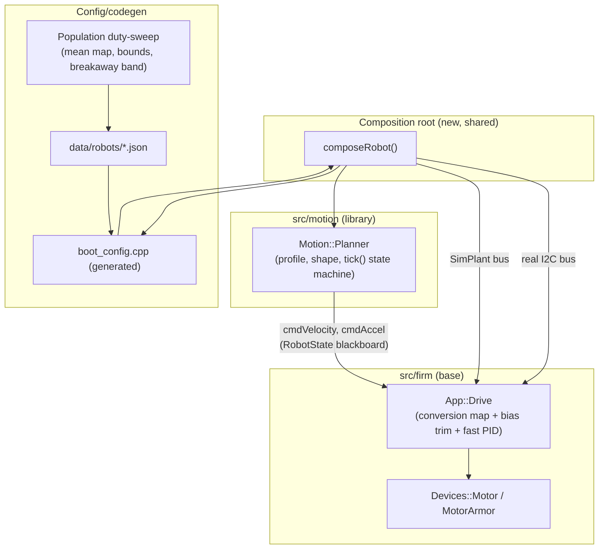
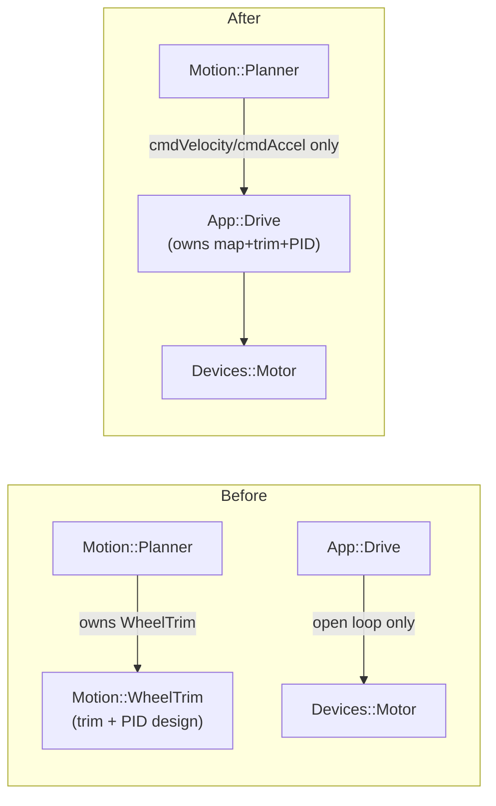

<!-- CLASI: Before changing code or making plans, review the SE process in CLAUDE.md -->

# Sprint 130: Wheels-solid: one wheel-speed controller in Drive, planner honesty pass, one composition root

## Goals

1. Establish the "wheels-solid" contract: **one** unified wheel-speed
   controller (calibrated conversion map + bounded slow-timescale
   intercept trim + small-authority fast PID) lives in `App::Drive`, so
   every `cmdVelocity` writer — planner Moves and WHEELS teleop alike —
   gets a wheel that holds the speed it was told to hold. (DECIDED,
   stakeholder 2026-08-01 — not a design option.)
2. Ground that controller's defaults and adaptation bounds in a
   **population** duty sweep, not a single robot's guesswork, and make
   the sweep protocol honest about the power-delivery ceiling sprint
   129 ticket 006 already found.
3. Make the planner's own timing and lifecycle **honest**: one 50 ms
   period everywhere (sim and hardware), `tick()` as an explicit state
   machine instead of eight interacting booleans, `PlannerLimits`
   reduced from 34 fields to the 23 actually used, and the parked duty
   stage deleted outright now that the trim/controller is the proven
   law.
4. **Unify the sim and robot composition roots** so the controller
   above (and everything else) is wired through one shared dependency
   graph — the only difference between the two builds is which I2C bus
   gets constructed — closing the exact class of drift (trim gains left
   at zero in sim while live on hardware) that has bitten this project
   before.
5. Opportunistically close two smaller, well-understood defects while
   this code is already open: the deterministic sim turn-shaping
   undershoot, and the host's still-provisional actuation-floor
   termination tolerance.

## Problem

The robot currently runs its two wheels through **two different,
incompatible actuation paths**. `App::Drive`'s WHEELS teleop path is
pure open loop — duty is `speed * kDutyPerSpeed`, no feedback, so a
loaded wheel simply falls short with nothing correcting it. `Motion::
Planner`'s Move path additionally runs `Motion::WheelTrim`, a velocity-
domain PI+feedforward corrector that evolved planner-side by accident
during the parked duty-stage experiments, not by design. Two consumers
of the same physical wheel get two different behaviors, and the trim
that does exist sits in the wrong architectural layer relative to
where sprint 122's own base/motion charter put "the velocity PID."

Layered on top of that: `duty_per_speed`, `wheel_gain`, and `wheel_
intercept` have a well-documented history of being circularly
calibrated against each other (each fitted against the other's error),
which is exactly how the tree arrived at a config that commanded 35%
of the requested speed. That has since been substantially corrected on
the bench (see "Measured facts" below) but the fix so far is a single
robot's numbers hand-baked into one constant — not a population-
measured default with known adaptation bounds, and not yet reflected in
a unified controller that every writer shares.

Separately, the planner's own control-loop timing is dishonest: the
"47 ms" period baked into `boot_wiring` is an overrun artifact of a 40
ms `kCycle` the loop cannot fit inside, not a chosen number, and the
sim steps at yet a third value (40 ms) — three numbers for one physical
quantity, echoing the exact duty_per_speed/wheel_gain/vel_kff pattern
above at the timing layer instead of the gain layer. `tick()`'s ~240
lines of interacting booleans and `PlannerLimits`' 34 fields (11 of
them dead — duty-stage-only, feature-off, or otherwise unused) carry
the same kind of accumulated, undocumented complexity.

Finally, the sim and hardware composition roots have already been
caught drifting once: the sim's own `simPlannerLimits()` boots the
wheel-trim gains at their fail-closed all-zero default while hardware
boots them live — meaning the exact controller this sprint centralizes
was **silently disabled in every sim session** while live on every
hardware session. Landing a unified controller without first closing
that gap would just relocate the drift, not close it.

## Solution

Five coherent bodies of work, sequenced so each protects the ones after
it (full rationale in Architecture, below):

1. **Phase 0 — population duty sweep** (`src/tests/bench/duty_sweep.py`
   extended): sweep a population of motors, both directions, full duty
   range (not just the 0.04-0.60 band the single-robot sweep used) AND
   a simultaneous-both-wheels variant (129-006's finding: two wheels
   loaded together underperform one wheel alone — a suspected shared
   power-delivery ceiling the single-wheel protocol cannot see). Output:
   population-mean baked map, population-spread adaptation bounds
   (`biasMax`, `vMin`), and an explicit verdict on the power ceiling.
2. **Unify the composition roots** (`unify-sim-and-robot-composition-
   roots.md`): one shared `composeRobot()`, `boot_config.cpp` linked
   host-side, one shared control-period constant — done **before** the
   controller lands, so the controller's config is wired through ONE
   path instead of two and cannot silently drift the way the trim gains
   already did.
3. **Move the wheel controller into `Drive`** (`wheel-speed-controller-
   moves-into-drive.md`): extend the `tick()`/`update()` interface to see
   measured velocity and commanded accel, implement the three-timescale
   controller (map, bias trim, fast PID), then move it so every
   `cmdVelocity` writer shares it. `04-continuous-duty-per-speed-
   calibration.md` is superseded by this issue's Stage C (see Design
   Rationale) — one adaptation charter, not two.
4. **Planner honesty pass** (`planner-honesty-pass-...md`): delete the
   parked duty stage (dissolving `bench-duty-readers-see-zero-after-
   stageduty-park.md` as a side effect), adopt one 50 ms period
   everywhere, rewrite `tick()` as an explicit state machine, and shrink
   `PlannerLimits` 34 → 23 — done AFTER the controller move so the trim
   gains have already left `PlannerLimits` for Drive/robot-JSON and are
   not reshaped twice.
5. **Two independent, opportunistic fixes**: the deterministic sim
   turn-shaping undershoot (`sim-tour-turn-shaping-undershoots-90-
   degree-turns.md`), fixed once the planner's structure is settled;
   and the host actuation-floor/termination-tolerance measurement
   (`measure-actuation-floor-and-set-termination-tolerance.md`), run on
   the playfield once the new controller's speed-floor behavior is
   bench-proven.

## Success Criteria

- A WHEELS teleop command demonstrably holds its commanded speed under
  applied drag (it does not today); a bench A/B (old additive trim vs.
  new map adaptation) shows closure and per-leg speed tracking at least
  as good, and the right-wheel affine residual closes across all four
  measured speeds, not just one.
- `pid.*` CONFIG wire keys route to the live controller's gains or
  return an explicit error — no silent no-op remains anywhere.
- Sim and hardware boot through the same `composeRobot()`; the
  wheel-trim gains (and every other boot constant) are identical in
  both, by construction, not by two hand-kept literals agreeing today.
- `cycle_period` telemetry reads 50 ms ± jitter, stable under load, on
  both sim and hardware; `tick()`'s lifecycle is an explicit, readable
  state machine; `PlannerLimits` carries 23 fields, grouped, with the
  ctypes mirror and offset guards regenerated and passing.
- The four sim turn-shaping tests pass with a stated root cause (or a
  measured, explained re-derivation of tolerance — not a widened
  tolerance papering over an unexplained defect).
- `planner.py`'s `TERMINATION_TOLERANCE` carries a measured value with
  its provenance, and the goto-mode playfield gate passes against it.

## Scope

### In Scope

- `App::Drive`: the unified wheel-speed controller (conversion map,
  bias trim, fast PID), its interface extension, WHEELS-teleop and
  Move-path unification, wire-key repointing, telemetry/TestGUI
  observability of live bias/trim values.
- `Motion::Planner`/`Motion::WheelTrim`: shedding the trim entirely,
  deleting the parked duty stage, the `tick()` state-machine rewrite,
  the `PlannerLimits` field reduction and ctypes-mirror regeneration.
- The composition roots: `main.cpp`, `TestSim::SimHarness`, a new
  shared `composeRobot()`, `boot_config.cpp` linked host-side, one
  shared control-period constant.
- `data/robots/*.json`, `robot_config.schema.json`, `gen_boot_config.py`,
  `config_sync_allowlist.json`: the calibration/adaptation-bound schema
  changes the controller and the population sweep require.
- `src/tests/bench/duty_sweep.py` (population + simultaneous-wheel
  extension), `src/tests/bench/square_tour.py --mode actuation-floor`,
  `hil_drive.py`, `square_tour_sim.py` (duty-read residual).
- The sim turn-shaping defect in the planner's shaping/profile code.
- `src/host/robot_radio/pathplan/planner.py`'s `TERMINATION_TOLERANCE`.

### Out of Scope

- Flash persistence of the adapted bias (stays RAM-only, relearned each
  boot — stakeholder decision already on record for the superseded
  issue 04, carried forward unchanged into this sprint's Stage C).
- The `estop-settle-time-floor-is-the-loop-cycle-not-the-write-path.md`
  residual (see Risks & Dependencies) — flagged, not pulled into scope;
  the stakeholder's call.
- `estimator-v2`/OTOS-fusion work (the cut `PlannerLimits` OTOS-blend
  fields' concern is explicitly tracked in `clasi/issues/later/`).
- Path-following curvature feed-forward and the streaming-demo gap
  (`path-following-hardware-gaps.md`) — untouched.
- Any change to the wire protocol's verb surface (MOVE/CONFIG/STOP) —
  only CONFIG's `pid.*` key *routing* changes, not the wire grammar.

## Test Strategy

- **Unit/sim (motion_tests + planner ctest suites)**: the controller's
  three stages (map, PID, bias trim) get direct unit coverage
  (convergence under a known plant-gain error, clamp behavior, bumpless
  duty continuity across a bias update); `planner_scenarios_test` and
  `planner_noise_test` remain the primary exactness/behavior guard for
  the `tick()` rewrite; a straight-leg sim scenario with deliberately
  mismatched L/R plant gains must converge to different per-wheel
  corrections and drive straight (the standing SIM-equals-bench case
  that has failed on the bench before).
- **Composition-root parity**: a test (or documented manual check) that
  sim and hardware boot the identical `PlannerLimits`/drive-calibration
  values via `composeRobot()`, closing the exact WheelTrim-gains-zero-
  in-sim gap this sprint's Architecture calls out.
- **Bench, on the stand** (`.claude/rules/hardware-bench-testing.md`):
  every ticket that commands motion gets a stand run — the population
  duty sweep itself, the A/B controller acceptance, WHEELS-holds-speed-
  under-drag, the +500 acceptance spec re-verification, the 50 ms/
  state-machine bench square tour re-blessing.
- **Playfield** (`.claude/rules/playfield-testing.md`): the actuation-
  floor sweep (`square_tour.py --mode actuation-floor`, camera-fenced)
  and the goto-mode re-run against the measured `TERMINATION_TOLERANCE`.
- **Regenerated artifacts must pass their own gates**: the
  `planner_harness.py` ctypes mirror's offset guards after the
  `PlannerLimits` reshape; `config_sync_allowlist.json`/schema
  round-trip after any robot-JSON key changes.

## Architecture

**Sizing: Substantial/structural.** This sprint touches 5+ modules
(`App::Drive`, `Motion::Planner`, `Motion::WheelTrim`'s lineage, the
composition roots, the config/codegen chain, the host path planner),
introduces a new cross-module dependency shape (the wheel-control
responsibility relocates wholesale from the motion library to the
firmware base — see Design Rationale), changes the data model
(`PlannerLimits` 34→23 fields, an ABI-breaking ctypes-mirror
regeneration; robot-JSON schema changes removing `duty_per_speed_*` and
adding population-bound keys), and changes the boot-time dependency
graph itself (composition-root unification). Full 7-step methodology,
diagrams included.

### Architecture Overview

**Responsibilities this sprint introduces or changes**, grouped:

1. **Unified wheel-speed control** (conversion map + bias trim + fast
   PID) — currently split between `App::Drive` (map only, open loop)
   and `Motion::Planner`/`Motion::WheelTrim` (trim, Move-path only).
   Unifies wholesale into `App::Drive`.
2. **Population calibration protocol** — determines the baked default
   map, the adaptation bounds (`biasMax`, `vMin`), and the breakaway/
   power-ceiling envelope that responsibility #1 consumes as
   configuration. Currently a single-robot, single-wheel-at-a-time ad
   hoc measurement.
3. **Composition-root parity** — construct one identical dependency
   graph for both the real-bus and `SimPlant` roots, so #1's
   configuration cannot drift between sim and hardware the way it
   already has once (WheelTrim gains zero-in-sim).
4. **Planner control-loop honesty** — one 50 ms period, an explicit
   `tick()` state machine, a right-sized `PlannerLimits` — a
   planner-internal responsibility, coupled to #1 only through the
   trim-gain fields that #1 relocates out of `PlannerLimits`.
5. **Duty-stage retirement** — deleting `WheelPid`/`stageDuty()` once
   responsibility #1 is the proven, shipped law; dissolves the
   bench-duty-reader residual as a side effect.
6. **Two independent bugfixes** — the sim turn-shaping undershoot (a
   pre-existing profiler/shaping defect, unrelated to wheel control)
   and the host actuation-floor/termination-tolerance measurement (a
   host-side arrival-detection concern that consumes #2's breakaway
   numbers and #1's speed-floor policy).

**Modules** (purpose in one sentence, no "and"; boundary; use cases
served):

- **`App::Drive`** (`src/firm/app/drive.{h,cpp}`) — Purpose: own the
  complete wheel-speed actuation contract for every writer. Boundary:
  inside — the conversion map, the bias trim, the fast PID, the crawl
  shaper, the WHEELS lifecycle; outside — deciding *where* the robot
  should be going (that's `Motion::Planner`) and the I2C/device leaves
  (`Devices::Motor`). Serves SUC-001, SUC-003.
- **`Motion::Planner`** (`src/motion/planner/`) — Purpose: decide the
  commanded wheel velocity and acceleration each tick from the active
  Move's profile. Boundary: inside — profiling, shaping, the move
  lifecycle state machine, queue management; outside, after this
  sprint — all wheel actuation (no trim, no duty, no PID). Serves
  SUC-001 (publishes `cmdVelocity`/`cmdAccel` for Drive to consume),
  SUC-004, SUC-005.
- **Composition root** (`src/firm/app/boot_wiring.{h,cpp}`, new — the
  file this sprint creates; `src/firm/main.cpp`,
  `src/sim/sim_harness.h`) — Purpose: construct one dependency graph,
  parameterized only by which bus/config gets built. Boundary: inside
  — wiring and boot-time constant selection; outside — anything that
  runs after boot. Serves SUC-003.
- **Config/calibration chain** (`data/robots/*.json`,
  `src/scripts/gen_boot_config.py`, `src/firm/config/boot_config.{h,cpp}`,
  `robot_config.py`, `config_sync_allowlist.json`) — Purpose: carry the
  population-measured defaults and bounds as generated, fail-closed
  build-time constants plus the wire-tunable gains. Boundary: schema
  and codegen only, no runtime control logic. Serves SUC-002, SUC-001.
- **`planner_harness.py` ctypes mirror** (`src/tests/sim/`) — Purpose:
  keep the host-side test harness's `PlannerLimits` layout byte-
  identical to the firmware struct. Boundary: pure mechanical mirror.
  Serves SUC-004 (as a regenerated artifact, not a design decision).
- **Host path planner** (`src/host/robot_radio/pathplan/planner.py`)
  — Purpose: decide when a goto-mode leg has arrived. Boundary:
  host-side only; consumes the measured actuation floor, does not
  measure it itself. Serves SUC-006.

**Component diagram** (post-sprint shape; dashed = existing/unchanged,
solid = new or relocated this sprint):

**Dependency-direction diagram** (before/after this sprint — the change
that matters for the base/motion split):

The "after" diagram is the point: `Motion::Planner` loses a dependency
(it no longer owns any wheel-actuation code) and `App::Drive` gains
responsibility, not a new *cross-tree* dependency — `src/firm` still
imports nothing from `src/motion` for this feature. See Design
Rationale for why this is a responsibility relocation, not a base→motion
dependency.

**No ERD** — no persisted entity model changes (the robot-JSON schema
changes are config keys, not entities); the `PlannerLimits` reshape is
a flat struct regrouping, not a relational model, and is shown above at
the module level, not as an ERD.

### Design Rationale

**Decision 1 — Composition-root unification lands *before* the
controller move, not after.**
Context: the controller's configuration (map gain/intercept, `biasMax`,
`vMin`, PID gains) must reach both sim and hardware identically for the
standing SIM-equals-bench rule to hold. Alternatives considered: (a)
move the controller first, wire its config through `main.cpp` and
`SimHarness` by hand, unify composition roots afterward; (b) unify
first. (a) is rejected because it is the exact pattern that already
produced a live defect — `simPlannerLimits()`'s wheel-trim gains
silently boot at their fail-closed zero default while hardware boots
them live (`unify-sim-and-robot-composition-roots.md`, item 1) — hand-
wiring the SAME kind of config through two places a second time
invites the same drift. (b) costs one extra ticket up front and removes
the class of bug entirely: the new controller's config is written into
`composeRobot()` exactly once. Consequence: tickets 003-006 (the
controller work) depend on ticket 002 (composition root) landing first.

**Decision 2 — the wheel controller's code relocates from `Motion::`
to `App::`; this is not a base-depends-on-motion violation.**
Context: `wheel-speed-controller-moves-into-drive.md` itself raises
this tension — "this places a motion-library class inside the firm
base." Alternatives considered: split the feature (keep adaptation in
Drive, leave the PID in the planner) — explicitly rejected by the
stakeholder (2026-08-01, not this sprint's call to revisit); duplicate
a base-side controller alongside the motion-library one — rejected,
same reasoning sprint 128 already used to delete/park two prior wheel-
control generations (a third live implementation is worse than one
relocation). Resolution: `Motion::WheelTrim`'s control-law *code*
becomes an `App::`-owned class inside Drive; `Motion::Planner` is left
with zero wheel-actuation code of any kind. The dependency graph is
UNCHANGED in direction — `src/firm` still does not import from
`src/motion` for this feature — because the code moved with the
responsibility rather than being called across the boundary. This
satisfies sprint 122's own charter ("the firmware base owns... THE
VELOCITY PID") retroactively, per `wheel-speed-controller-moves-into-
drive.md`'s own "receipt" argument. Consequence: ticket 005 deletes
`Motion::WheelTrim`'s file(s) from `src/motion` entirely rather than
leaving a redirect stub — there is no future caller.

**Decision 3 — adaptation targets the map's intercept (`bias`), not
`dutyPerSpeed` itself; issue 04 is superseded, not run in parallel.**
Context: two competing adaptation charters existed — `04-continuous-
duty-per-speed-calibration.md` (scale `dutyPerSpeed` itself, clamped
[0.5x, 2.0x], rate-limited) and `wheel-speed-controller-moves-into-
drive.md`'s Stage C (adapt the map's `bias`/intercept, clamped to the
population spread, `tauAdapt`-slow). Alternatives considered: run both
(rejected outright by both issues' own text — "do not run two competing
adaptation designs"); keep 04's gain-scaling approach (rejected —
issue 1's parallel-lines evidence from the population sweep says
variation across motors is intercept-dominated, matching the physical
model that constant-torque loads droop speed by a constant, not a
slope; intercept-only adaptation is also single-speed observable,
avoiding a multi-speed excitation requirement). Resolution: Stage C
(bias/intercept adaptation) is the shipped mechanism; issue 04 is
superseded by it. 04's two most valuable provisions are folded in
rather than dropped: its bumpless-transfer requirement (duty must not
step when the adapted parameter updates — Stage C achieves this via a
hard hold on the SLOPE and only ever nudging the additive intercept, so
duty is continuous by construction, a stronger property than 04's own
bleed-the-integral formula for a gain-scaled parameter) and its
observability mandate ("ships with the feature, not after it" — live
`bias`/trim values in telemetry and the TestGUI, folded into ticket
005's acceptance criteria). Consequence: ticket 005 is where issue 04
is marked addressed/superseded; no ticket implements 04's own gain-
scaling formula.

**Self-review note — `App::Drive`'s growing size is deliberate, not an
unnoticed god-component drift.** `Drive` accumulates the map, the bias
trim, the fast PID, the crawl shaper, and the WHEELS lifecycle — more
code than it holds today. The cohesion test still holds ("own the
complete wheel-speed actuation contract for every writer," one
sentence, no "and") because every one of those pieces is the SAME
concern (actuation) at a different timescale, not several unrelated
concerns sharing a class by accident — and the stakeholder's decision
to unify here (2026-08-01) is not this planning pass's to revisit.
Mitigation kept in the ticket breakdown rather than the module
boundary: Stage A/B/C stay separately named, separately unit-tested
methods/fields (tickets 003-004 test each stage's convergence/clamp
behavior independently), so the concentration is legible and testable
even though it is one class.

**Decision 4 — the planner honesty pass's duty-stage deletion happens
AFTER the controller move, not before or in parallel.**
Context: deleting `WheelPid`/`stageDuty()` also means deciding where
the `pid.*` CONFIG wire keys route (today a silent no-op onto the
parked stage). Alternatives considered: delete the duty stage first,
route `pid.*` to nothing (an explicit error) as an interim state, then
land the controller. Rejected: it produces a sprint-internal window
where `pid.*` has no sane destination, and (more importantly) the
`PlannerLimits` trim-gain fields (`trimKp`/`trimKi`/`trimIMax`/
`trimKaff`/`trimMax`) would have to be reshaped once for the honesty
pass's 34→23 cut and then reshaped AGAIN when the controller move
relocates them out of `PlannerLimits` entirely — `wheel-speed-
controller-moves-into-drive.md`'s own text calls this out ("coordinate
so the fields are reshaped once, not twice"). Resolution: controller
move first (tickets 003-006), so by the time the honesty pass's
`PlannerLimits` ticket (009) runs, the trim fields are simply gone
already — one reshape, not two.

**Decision 5 — the population duty sweep (ticket 001) explicitly
inherits the 129-006 power-ceiling constraint, not a fresh single-
wheel protocol.**
Context: `duty-sweep-single-wheel-vs-simultaneous-current-limit-129-
006.md` found the plant saturates and DECLINES above duty ~0.30-0.40,
and that two wheels driven together underperform one wheel alone at
the identical command — a suspected shared power-delivery ceiling the
original one-wheel-at-a-time sweep methodology cannot characterize.
Alternatives considered: run the population sweep single-wheel-only (as
originally scoped in `wheel-speed-controller-moves-into-drive.md`'s
Phase 0) and treat the power-ceiling finding as a separate follow-on.
Rejected: `biasMax`/`pidMax` derived from a single-wheel-only population
sweep would promise recovery authority the two-wheels-simultaneous case
cannot actually deliver — the controller would wind up against a
current-limit wall it cannot climb, exactly the risk 129-006 itself
warns about for the (now-superseded) 129-007 adaptive-learner design.
Resolution: ticket 001's protocol adds a simultaneous-both-wheels sweep
grid alongside the per-motor single-wheel sweep, re-run against a
verified/freshly-charged battery to separate a session artifact from a
hard ceiling, with an explicit verdict recorded before ticket 004
consumes the bounds.

### Migration Concerns

- **`PlannerLimits` ABI break, deliberate, once.** The 34→23 field
  reduction breaks the append-only ctypes-mirror constraint
  (`planner_harness.py`) on purpose (planner-honesty-pass's own
  framing). Every composition root and test harness that constructs a
  `PlannerLimits` (`boot_wiring`/`composeRobot()`, `simPlannerLimits()`,
  `benchLimits()`) must be updated in the same ticket as the mirror
  regeneration, or host tests silently read misaligned memory.
- **Robot-JSON schema changes, three files, in lockstep.** Removing
  `duty_per_speed_left`/`_right` (already ignored by `main.cpp` but
  still required by the schema) and adding the population-bound keys
  (`biasMax`, `vMin`, `tauAdapt`, `aSteady`, `deficitThreshold`/
  `deficitWindow`) touches `data/robots/{tovez,togov,tovez_nocal}.json`,
  `robot_config.schema.json` (`additionalProperties: false` hard-fails
  on a stale key), `robot_config.py`, and `gen_boot_config.py`
  (`_require()`s the removed key today — the build aborts until
  updated) together, in one ticket, not staggered.
- **Wire-key repoint is a behavior change, not a rename.** `pid.*`
  CONFIG keys currently route to `applyVelGains()` (the parked duty
  stage) — a silent no-op today. Repointing them to the new controller's
  gains changes what a live `SET pid.kp` on the bench actually does.
  Anyone with a stand-tuning muscle-memory habit from before the duty
  stage was parked needs this called out at bench-verification time,
  not discovered mid-tour.
- **Sim-behavior test fallout from composition-root unification is
  already partially observed** (12 failures reported in `unify-sim-
  and-robot-composition-roots.md` from adopting real shaping/trim/
  heading-hold/dutyFloor defaults in sim) — ticket 002 must triage and
  resolve these as part of its own acceptance, not defer them.
- **No flash/persistence migration** — the adapted `bias` is RAM-only
  by stakeholder decision (carried forward from superseded issue 04);
  nothing to migrate across a reboot or a firmware upgrade.

### Open Questions

Carried forward from `wheel-speed-controller-moves-into-drive.md`'s own
"Open decisions," unresolved by this planning pass — flagged for the
implementing ticket or a stakeholder call, not silently decided here:

1. `bias` per-wheel vs. per-wheel-per-direction (ticket 004).
2. Speed-floor policy: round a sub-`vMin` command up to `vMin`, or
   refuse it outright (ticket 004; also feeds SUC-006's termination-
   tolerance work).
3. `dutyPerSpeed` — stays one value for both wheels (current baked
   constant, 1.9% L/R spread) or goes per-direction once the
   population sweep's higher-duty-range data is in (ticket 001's
   verdict feeds this).
4. Whether the per-tick fast PID needs any kp at all, or whether the
   profiler's every-tick re-plan-from-measured-position already
   supplies equivalent correction at the planning layer (ticket 004,
   explicitly flagged as an implementation-time judgment call in the
   source issue).

### Risks & Dependencies

- **A CRITICAL-sounding dependency named in this sprint's own briefing
  does not exist as described, and the underlying defect is already
  fixed — verified against the current tree, not assumed.**
  `estop-did-not-stop-write-on-change-vs-latching-brick.md` is not a
  file in `clasi/issues/`. The defect it describes (a suppressed
  duty-write-on-change permanently latching a runaway on the Nezha
  brick) was sprint 129 ticket 001's own SUC-001 and **is fixed and
  merged into `master`**: `Devices::NezhaMotor::writeRawDuty()`'s
  write-on-change guard is `stopNotTaken`-exempt (never suppresses a
  zero write while a wheel still measures above `kStopConfirmVelocity`),
  and `App::Drive::estop()` re-asserts its commanded zero for
  `kStopEnforceTicks` (30) cycles and unconditionally while either wheel
  reads above `kRestVelocity` — both confirmed present by direct source
  read (`src/firm/devices/nezha_motor.cpp:337-338`,
  `src/firm/app/drive.{h,cpp}`), and by today's repair commit
  `6a3452a7` ("restore ESTOP re-assertion members lost in the origin/
  master merge") showing the fix surviving a merge conflict intact.
  Sprint 129's own bench measurement: 10/10 consecutive stop trials,
  zero relapses. The ONLY open residual in the issue pool is
  `estop-settle-time-floor-is-the-loop-cycle-not-the-write-path.md`
  (priority **medium**, not critical): settle time floors at ~0.19 s
  against a stated 0.15 s bound, attributed to the 40 ms loop cycle and
  COAST-not-BRAKE stopping, not to any write-suppression defect. This
  sprint does not pull that issue into scope (not this planning pass's
  call), but flags it: several tickets here (001, 006, 011, 012) command
  the wheels on the stand/playfield repeatedly, and a ~0.19 s settle
  time is a known, bounded, already-measured quantity to plan bench
  sessions around — it is not the unbounded-runaway risk the sprint
  briefing's framing implied.
- **Power-delivery ceiling risk carries into the controller's promised
  authority.** If ticket 001's re-verification confirms a hard
  simultaneous-wheel current-limit ceiling (not a session/battery
  artifact), ticket 004's `biasMax`/`pidMax` must be derated so the
  controller never advertises recovery authority the power budget
  cannot deliver — see Design Rationale Decision 5. This is a
  measurement-gated decision, not yet resolvable at planning time.
- **`PlannerLimits` ABI break is intentionally disruptive** — any
  other in-flight branch touching `planner_harness.py` or
  `PlannerLimits` construction will conflict; this sprint should not run
  concurrently with such work (none is known active — `list_sprints`
  shows no active sprint at this sprint's creation).
- **Sim-behavior test fallout (12 known failures) is a real,
  non-trivial cost inside ticket 002**, not a footnote — budget for it
  explicitly rather than treating composition-root unification as a
  pure refactor.

## Use Cases

Six sprint-level use cases, one per responsibility group from
Architecture Step 2/3, covering all nine linked issues between them.

### SUC-001: Every wheel-speed writer gets a wheel that holds its commanded speed
Parent: N/A (P0 actuation-correctness — user-visible)

- **Actor**: Any `cmdVelocity` writer — `Motion::Planner` running a
  Move, or `App::Drive`'s own WHEELS teleop command.
- **Preconditions**: Population duty-sweep defaults and adaptation
  bounds exist (SUC-002); the composition roots are unified (SUC-003)
  so the controller's configuration is identical in sim and hardware.
- **Main Flow**:
  1. `App::Drive::tick()` converts a commanded wheel velocity to duty
     through the calibrated map (Stage A), corrected by the current
     bias trim (Stage C) and a small-authority fast PID (Stage B).
  2. The bias trim adapts, bounded by the population spread, only in
     steady state (`|a_cmd| < aSteady`, `|v_cmd| >= vMin`, fresh sample).
  3. A WHEELS teleop command and a planner Move both reach this same
     path; neither gets a privileged or degraded actuation path.
- **Postconditions**: commanded and actual wheel speed track within the
  controller's stated authority (`biasMax + pidMax`); outside that
  authority the robot runs slow, loudly (a deficit fault flag), never
  silently.
- **Acceptance Criteria**:
  - [ ] A WHEELS teleop command under applied drag holds its commanded
        speed (bench, on the stand).
  - [ ] Bench A/B: new map-adaptation controller vs. the old additive
        trim, same tour — closure and per-leg speed tracking at least as
        good.
  - [ ] The right-wheel affine residual (ab303ee3's measured table)
        measurably closes across all four measured speeds, not one.
  - [ ] `SET pid.kp`/`pid.ki`/etc. over the wire visibly tunes the live
        controller, or returns an explicit error — no silent no-op.
  - [ ] The +500 button acceptance spec (06-duty-per-speed-and-wheel-
        gain-disagree-with-the-plant.md) re-verified: cruise plateau,
        ripple, L/R agreement, taper, and endpoint criteria all pass.

### SUC-002: A population duty sweep, not a single robot's guess, sets the controller's defaults and bounds
Parent: N/A (calibration foundation — internal)

- **Actor**: The stakeholder (physically swaps motors on the bench),
  the duty-sweep tool.
- **Preconditions**: `wheel_gain`/`wheel_intercept` at identity (no
  circular calibration); a verified/freshly-charged battery.
- **Main Flow**:
  1. Sweep each motor, both directions, across the FULL duty range
     (not just 0.04-0.60), fitting the affine duty-speed line and
     capturing breakaway.
  2. Sweep a simultaneous-both-wheels grid to characterize the 129-006
     power-delivery-ceiling finding, distinguishing a hard ceiling from
     a session/battery artifact.
  3. Population mean -> baked default map; population spread -> the
     adaptation bounds (`biasMax`, `vMin`); breakaway spread -> the
     deadband/floor constants.
- **Postconditions**: generated constants replace single-robot guesses;
  the per-motor dataset and derived values are committed, chart
  included.
- **Acceptance Criteria**:
  - [ ] Per-motor sweep dataset (CSV) and chart committed.
  - [ ] Population mean map, spread-derived `biasMax`/`vMin`, and
        breakaway band recorded as generated values the boot config
        bakes.
  - [ ] An explicit verdict on the power-delivery ceiling (hard limit
        vs. session artifact), recorded with its evidence.

### SUC-003: Sim and hardware boot through one composition root
Parent: N/A (structural parity — internal)

- **Actor**: `main.cpp` (hardware), `TestSim::SimHarness` (sim).
- **Preconditions**: none additional to today's tree.
- **Main Flow**:
  1. Both roots call one shared `composeRobot(bus, clock, sleeper,
     serial, radio, tuningStore*)`, parameterized only by which I2C bus
     implementation (`Devices::MicroBitI2CBus` vs. `TestSim::SimPlant`)
     is constructed.
  2. `boot_config.cpp` is linked into the host build too, so both roots
     bake the same robot-JSON calibration by default.
  3. The control period is derived from one shared constant in both
     roots.
- **Postconditions**: a boot-time constant (e.g. wheel-trim gains) can
  no longer differ between sim and hardware except at an explicit,
  commented override at the sim call site.
- **Acceptance Criteria**:
  - [ ] `SimHarness` boots through `bootPlannerLimits()`/
        `installShaperLimits()`/`installRotationCalibration()`/
        `installDriveCalibration()`, not its own hand-wired literals.
  - [ ] The 12 known sim-behavior test failures from adopting real
        shaping/trim/heading-hold/dutyFloor defaults are triaged and
        resolved (documented override or updated expectation).
  - [ ] A parity check confirms sim and hardware construct identical
        `PlannerLimits`/drive-calibration values by default.

### SUC-004: The planner's control loop is honest about its own timing and lifecycle
Parent: N/A (planner internal-quality — internal)

- **Actor**: `Motion::Planner::tick()`, the bench/sim test suites.
- **Preconditions**: the wheel controller (SUC-001) already owns the
  trim gains, so `PlannerLimits` no longer needs to carry them.
- **Main Flow**:
  1. `App::RobotLoop::kCycle` becomes 50 ms (from 40, which the loop
     could not fit inside); `bootPlannerLimits()`/`simPlannerLimits()`
     derive `controlPeriod`/`actuationDelay` from the same constant.
  2. `tick()` dispatches over an explicit lifecycle enum (`Idle`,
     `Draining`, `Breakaway`, `Tracking`, `Stopping`) instead of eight
     interacting booleans.
  3. The parked duty stage (`WheelPid`, `stageDuty()`) is deleted
     outright; `PlannerLimits` drops from 34 to 23 fields, grouped into
     `ceilings`/`plant`/`landing`/`tracking` sub-structs; the ctypes
     mirror and offset guards are regenerated.
- **Postconditions**: `cycle_period` telemetry reads 50 ms ± jitter,
  stable under load; the move lifecycle has one visible transition
  table; the two bench tools reading the now-deleted duty stage
  (`bench-duty-readers-see-zero-after-stageduty-park.md`) either read
  a real value or print an explicit "removed" message, never a silent
  zero.
- **Acceptance Criteria**:
  - [ ] All `planner_tests` ctest suites green; `planner_scenarios_test`
        exactness gates pass.
  - [ ] `cycle_period` measured 50 ms ± jitter on the bench, stable
        under load.
  - [ ] Bench square tour closure at 50 ms at least as good as the
        47 ms baseline before re-blessing tuned constants.
  - [ ] `PlannerLimits` carries 23 fields; ctypes mirror and offset
        guards regenerated and passing.
  - [ ] `hil_drive.py --duty`/`square_tour_sim.py`'s duty read no
        longer silently reports zero.

### SUC-005: Sim tours turn the commanded angle
Parent: N/A (deterministic bugfix — user/test-visible)

- **Actor**: The sim-mode test suites (`test_gui_button_acceptance.py`,
  `test_sim_transport_tour1.py`, `test_tour_closure_gate.py`).
- **Preconditions**: the planner's lifecycle rewrite (SUC-004) has
  landed, so the turn-shaping fix is made against the final `tick()`
  structure rather than code about to be replaced.
- **Main Flow**:
  1. Bisect the deterministic −10.8°/−20.8° per-turn undershoot across
     sim/planner shaping history.
  2. Root-cause and fix, or re-derive tolerances from a measured,
     explained sim behavior.
- **Postconditions**: all four affected tests pass.
- **Acceptance Criteria**:
  - [ ] Root cause identified and fixed (preferred), or tolerances
        re-derived from a measured, explained sim behavior — not
        widened to paper over an unexplained defect.
  - [ ] All four named tests green.

### SUC-006: The host's arrival tolerance reflects a measured actuation floor
Parent: N/A (host-side measurement — user-visible)

- **Actor**: The stakeholder (playfield sweep operator), the goto-mode
  path planner.
- **Preconditions**: the new wheel controller's speed-floor policy
  (Open Question 2) is implemented and bench-proven (SUC-001), so the
  measured floor reflects the system this sprint ships, not the old
  open-loop path.
- **Main Flow**:
  1. Run the camera-fenced `square_tour.py --mode actuation-floor`
     sweep of decreasing commanded distances/angles.
  2. Record the smallest commanded distance/angle the drivetrain
     reliably executes.
  3. Replace `planner.py:108`'s `TERMINATION_TOLERANCE = 100.0
     # PROVISIONAL` with the measured value and its provenance.
- **Postconditions**: the goto-mode convergence gate passes against the
  measured tolerance; a target 250 mm away is no longer counted as
  arrived at 96.8 mm (a 39% shortfall).
- **Acceptance Criteria**:
  - [ ] The sweep's raw data recorded, not just the chosen number.
  - [ ] `planner.py:108` carries a measured value with its provenance,
        PROVISIONAL marker removed.
  - [ ] The goto-mode playfield gate re-run and passing.

## GitHub Issues

(None — all nine source issues are CLASI-local `clasi/issues/` files,
not GitHub issues.)

## Definition of Ready

Before tickets can be created, all of the following must be true:

- [x] Sprint planning document is complete (sprint.md, including its
      Architecture and Use Cases sections)
- [x] Architecture review passed (or skipped, for changes with no
      architectural impact)
- [x] Stakeholder has approved the sprint plan (see gate note —
      recorded from the sprint-initiation brief itself; no separate
      approval exchange occurred)

## Tickets

| # | Title | Depends On |
|---|-------|------------|
| 001 | Population duty-sweep protocol: baked defaults + adaptation bounds | — |
| 002 | Unify sim and robot composition roots | — |
| 003 | Drive controller interface extension (measured velocity + commanded accel) | 002 |
| 004 | Wheel-speed controller algorithm: conversion map + fast PID + bias trim | 001, 003 |
| 005 | Move the unified controller into Drive for every writer; wire-key repoint + observability | 004 |
| 006 | Bench acceptance: controller A/B, WHEELS-holds-speed-under-drag, +500 spec re-verification | 005 |
| 007 | Delete the parked duty stage; one 50 ms control-period constant | 005, 002 |
| 008 | `tick()` explicit move-lifecycle state machine | 007 |
| 009 | `PlannerLimits` 34 → 23, grouped, ctypes mirror regenerated | 008 |
| 010 | Fix the deterministic sim turn-shaping undershoot | 008 |
| 011 | Bench re-verification: 50 ms period, tick() state machine, PlannerLimits reshape | 007, 008, 009 |
| 012 | Playfield actuation-floor measurement; replace provisional TERMINATION_TOLERANCE | 006 |

Tickets execute serially in the order listed.
