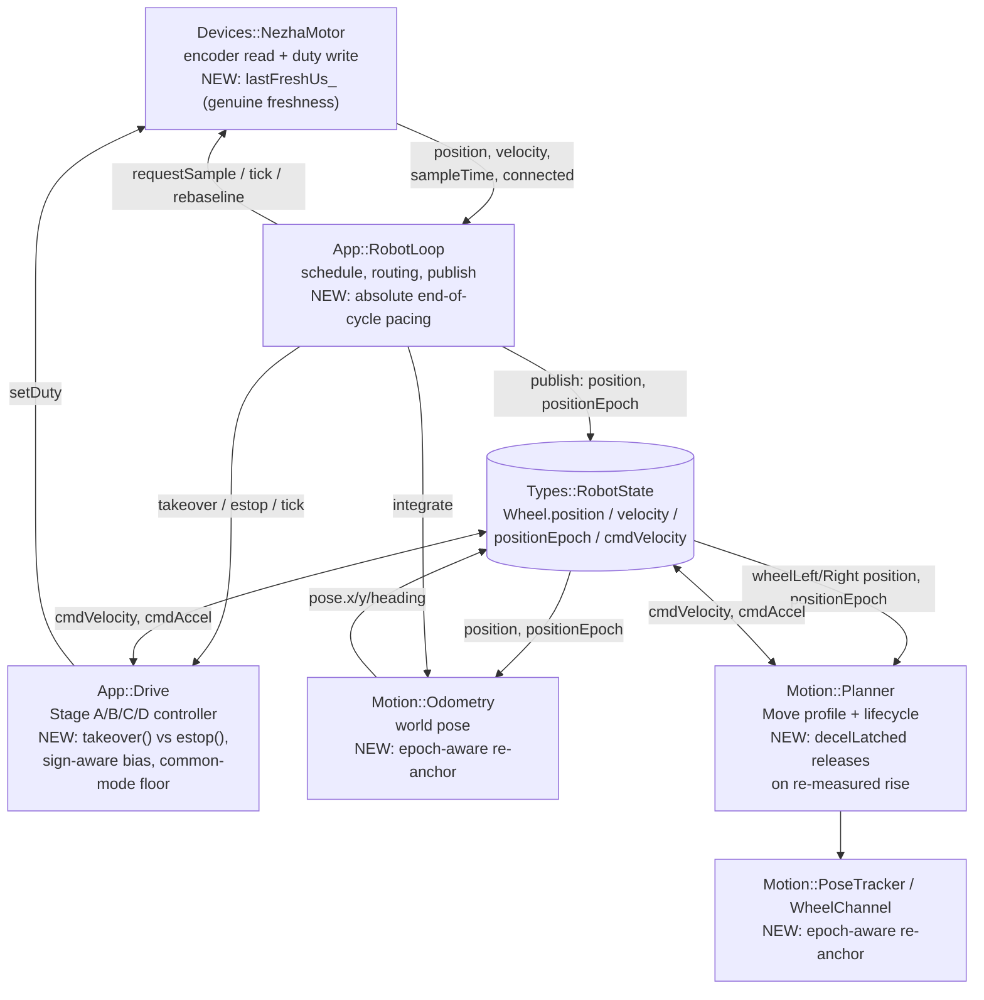

<!-- CLASI: Before changing code or making plans, review the SE process in CLAUDE.md -->

# Sprint 131: Observable over proxy: takeover vs estop, honest stop and pose, one period owner

## Goals

Close six A-priority defects from the 2026-08-02 post-130 review and midpoint
review, all of which are the SAME root mechanism named in the post-130
post-mortem's root cause #1 ("checking a proxy instead of the thing itself"):
the base asserts something about a stand-in for a physical fact rather than
the fact itself. Each ticket's acceptance criteria assert the observable, not
the proxy:

| Issue | Proxy currently trusted | Observable it should use instead |
|---|---|---|
| takeover-wipes-learned-state | "a new writer appeared" implies danger implies full reset | ownership changed; the plant did not |
| commanded-zero-leaks-through-stage-b | duty `== 0.0f` exactly | the command is zero |
| speed-floor-snaps-differential | the summed per-wheel command | travel command vs. differential correction |
| position-rebaseline-destroys-pose | a bare position delta | `positionEpoch` (exists, published, read by nobody) |
| nominal-50ms-vs-delivered-54ms | `kCycle` says 50 | the loop delivers 54.000 +/- 0.006 |
| tour2-146-degree-undershoot | a lookahead prediction of remaining | the plant actually nearing rest |

Two of the six carry a MANDATORY paired fix, without which the primary fix
reintroduces or unmasks a second defect (see Scope below) — both pairs land
in one ticket each, not split.

## Problem

Sprint 130 built one wheel-speed controller (`App::Drive`, Stage A/B/C/D)
serving every writer and one composition root. The 2026-08-02 post-130 review
(`docs/code_review/2026-08-02-post-130-wheels-solid-review.md`) and the
sprint-130 post-mortem (`docs/post-mortem/2026-08-02-sprint-130-wheels-solid.md`)
found that controller's own contract is not yet solid: motion-ownership
handover is implemented as a full safety reset that defeats the 30-second
adaptation it exists to serve; the "stop is stop" guard has a Stage-B-sized
hole; a differential steering trim gets quantized to a 99.7 mm/s lurch; a
routine 30 m soak corrupts the pose outright; every gain in the robot JSON is
tuned against a control period that has never been true; and a specific
146-degree turn still misses by ~10 degrees after ticket 130-010's general
fix, by a mechanism (`decelLatched`) that is angle-independent and additive.

## Solution

Six tickets, executed serially (see Scope: file overlap across `drive.cpp`,
`robot_loop.cpp`, and `planner.cpp` rules out parallel worktrees for this
sprint):

1. Split `Drive::takeover()` (ownership changed, learned state kept) from
   `Drive::estop()` (full safety reset), and fix the bias's mis-signed
   application across a direction reversal in the same ticket (the two are
   coupled: fixing takeover alone makes the reversal bug live for the first
   time).
2. Give commanded-zero the same explicit guard through Stage B that Stage A
   already has, gate Stage B on Stage C's freshness/connected/frozen
   conjuncts, and fix `NezhaMotor`'s freshness dishonesty (a failed encoder
   collect must not read as a fresh sample) in the same ticket — the new
   gates would otherwise inherit that lie.
3. Fix `applySpeedFloor()`'s semantics: floor the common-mode wheel speed,
   pass the differential correction through unfloored. No re-fit of the
   floor constant itself (that needs the loaded-actuation-floor bench
   measurement, out of reach this sprint).
4. Give `positionEpoch` actual consumers: `Motion::Odometry` and the
   planner's `PoseTracker`/`WheelChannel` re-anchor on an epoch change
   instead of differencing across it; fix the secondary defect where
   `rebaseline()` zeroes velocity across the boundary.
5. Make the control loop's delivered period equal its nominal via an
   absolute end-of-cycle deadline (rather than four independently-rounded
   relative sleeps), so `App::Drive`'s measured-dt integration and
   `Motion::Planner`'s configured `controlPeriod` agree by construction, and
   correct the stale "47 ms" comments/JSON left over from the prior
   generation of this same confusion.
6. Release `Motion::Planner`'s `decelLatched` one-way trap when a
   re-measured remaining genuinely rises above the closing envelope (the
   plant's own `profile.cpp` comment already promises "let re-measurement
   recover" — the bug is that the outer latch never lets it), and add the
   missing large-angle/chained/transient-misprediction test scenarios
   `planner_tests` never had.

## Success Criteria

- A chained tour holds a converged Stage C bias across leg boundaries in
  sim; bias does not reset to 0 at every enqueue.
- A reversal after a converged forward hold does not reduce reverse
  magnitude (the sign-aware bias fix), verified in sim.
- `estop_unlosable_bench.py`-equivalent sim coverage still shows the ESTOP
  verb performing a full reset, 10/10, no relapses — takeover and estop
  remain behaviorally distinct in the harness, not just in name.
- With nonzero Stage B gains and a wound integrator, a commanded-zero wheel
  writes exactly 0 duty and stays there (sim).
- With a simulated failed encoder collect, Stage B does not integrate, and
  `EncoderReading.age` reflects the last successful read, not the last tick
  attempt.
- A commanded differential trim of a few mm/s produces a proportional wheel
  response in sim, not a step to `vMin`; the sim-tier tour tests that
  previously FAULTed on this pass. (REVISED, see Architecture's Revision
  section: the mechanism is now a ratio-preserving scale rather than a
  common-mode/differential split — ticket 003's own turn-accuracy
  non-regression gate, below, is the criterion that actually caught the
  shipped-then-revised implementation's regression.)
- A pose-sanity test in sim drives a wheel past the +/-30,000 mm rebaseline
  margin: heading and x/y are continuous (no step), total odometry travel
  matches commanded, and wheel velocity does not read 0 during the
  rebaseline cycle. The same holds for a Move in flight at the boundary.
- A host-build unit test with an injected jittery clock shows the loop's
  mean delivered inter-cycle period converges to `kCycle` (50 ms), not
  `kCycle` + a fixed offset; the planner's `controlPeriod` and `App::Drive`'s
  measured dt agree by construction.
- TOUR_2's 146-degree turn lands within the same error band as its 90-degree
  turns, measured on the single-step harness
  (`test_tour_closure_gate.py`), not the background-tick-thread harness
  (`test_gui_button_acceptance.py` mixes ~30 mm of harness-induced spread
  into a ~10-degree signal). `test_tour_2_runs_to_completion` passes
  repeatedly.
- No regression: TOUR_1 worst per-turn error <= 2.72 deg, `square.tour`
  <= 80 mm (41.7/43.0 today), `circle.tour` 9.6 mm PASS, sim suite stays
  at its post-130 baseline (460 passed / 0 failed).

## Scope

### In Scope

- `src/firm/app/drive.h`/`drive.cpp`: `takeover()`/`estop()` split,
  sign-aware bias, commanded-zero-through-Stage-B guard, Stage B freshness
  gating, common-mode-only speed floor.
- `src/firm/app/robot_loop.cpp`/`.h`: the takeover call site, the
  `publishWheel()`/rebaseline sequencing, the cycle's pacing blocks.
- `src/firm/devices/nezha_motor.cpp`/`.h`, `src/firm/devices/motor.h`:
  genuine-freshness timestamp; `rebaseline()`/`softRebaseline()` no longer
  zeroing velocity.
- `src/motion/odometry.cpp`/`.h`, `src/motion/planner/estimation.cpp`/`.h`:
  epoch-aware re-anchoring.
- `src/motion/planner/planner.cpp`: `decelLatched` release condition; stale
  period-disagreement comments corrected once the loop is honest.
- `src/motion/planner/tests/`: new Angle-above-90-degrees, chained
  leg-turn-leg under lag, and transient-misprediction-vs-latch scenarios.
- Stale-comment sweep directly touched by the period fix
  (`main.cpp:80`, `boot_wiring.h:36`, `robot_loop.h:49-57`,
  `data/robots/*.json` `controlPeriod`).

**Mandatory pairings** (each lands in ONE ticket, not split):
- Ticket 001 (takeover) MUST include the sign-aware bias fix (review C3,
  `drive.cpp:122`): a forward-learned bias mis-signs on reversal today, and
  is latent only because takeover's `estop()` call currently resets it so
  often. Fixing takeover alone makes C3 live.
- Ticket 002 (commanded-zero/Stage B) MUST include the `NezhaMotor`
  freshness fix: `EncoderReading.age`/`sampleTime()` must reflect the last
  genuinely successful collect, not the last tick attempted, or the new
  Stage B freshness gates inherit that lie on day one.

### Out of Scope

- Re-fitting `vMin`/`biasMax`/the floor constant itself, or the
  differential's own tolerance — needs the loaded-actuation-floor
  measurement, which needs the robot translating under its own weight
  (`clasi/issues/A-next-physical-bench-session-checklist.md` item 4). This
  sprint fixes the floor's SEMANTICS only.
- The planner learning `vMin` as a `PlannerLimits` field (review C1) and
  re-deriving `settle_epsilon_linear` against the real actuation floor —
  both wait on the same bench measurement.
- Firmware-to-host config read-back (`ConfigSnapshot`) — the post-mortem's
  #1 recommendation, but a larger cross-cutting feature than this sprint's
  six-issue scope; the host's `_UNMANAGED_FLOOR = 90.0`
  (`testgui/transport.py:200`) staying a separate constant from firmware's
  `wheel_v_min` is a known, tracked gap, not fixed here.
- Slope-vs-intercept redesign of Stage C (review F2) — waits on the
  population duty sweep's right-wheel/simultaneous-grid data.
- Heading-hold's own instability (disabled, gain 0.0) — a different defect
  (closes on encoder-only heading), tracked separately.
- Anything in `clasi/issues/A-next-physical-bench-session-checklist.md` —
  all five items there need a human physically at the bench; none is
  reachable this sprint.
- `src/firm/devices/hiwonder_board.{h,cpp}`, `motor_board.h`,
  `docs/hiwonder/` — untracked files from a concurrent out-of-process
  session, verified unwired into any build (no CMake glob picks them up).
  Not part of this sprint; leave them alone, do not commit them.

### Hardware bench debt (declared, not faked)

`.claude/rules/hardware-bench-testing.md` requires a stand deployment for
any sprint touching motor control. `tovez` has been wedged since 2026-08-01
(four dead-I2C wedges in two days; needs a physical power cycle — see the
bench-session checklist issue). **No ticket in this sprint claims a bench
result.** Acceptance runs on the sim tier, which is legitimate here because
the sim runs the real firmware through one composition root (130-002) —
issues 1, 2, 4, and 6 are genuinely sim-verifiable end to end. Two tickets
have a narrower honest ceiling, stated explicitly in their own acceptance
criteria:
- Ticket 003 (speed floor) fixes semantics only; the floor's numeric value
  stays exactly what it is today (LOW CONFIDENCE, n=3, unloaded) until the
  next bench session.
- Ticket 005 (period) proves the loop's pacing logic is self-correcting in
  a host-build unit test with injected jitter; whether the PHYSICAL robot's
  delivered period actually lands at 50.000 ms still needs a bench
  re-measurement (`src/tests/bench/planner_square_tour.py`), which is out
  of reach this sprint and is called out as a follow-up in that ticket.

Every ticket's own acceptance criteria are written against what the sim
tier can actually observe — none assumes hardware silently.

## Test Strategy

Sim-tier throughout: `src/tests/sim` (pytest, drives the real firmware
through the sim composition root) for tickets 001-005 (Drive/RobotLoop/
Odometry/NezhaMotor changes all live in the ARM-buildable firmware tree the
sim links against), and the standalone, Python-free `planner_tests` build
for ticket 006 (the planner's own separable test tier, plus the sim-tier
tour-closure gate for the end-to-end TOUR_2 regression check). No new test
tier is introduced. Every new/changed behavior gets a test that asserts the
PHYSICAL observable (bias value held across an enqueue; duty written to the
motor leaf; wheel velocity/heading continuity across a rebaseline; the
mean measured inter-cycle period; the completed heading versus commanded),
never a proxy for it (a flag being set, a code path being reached, a
constant matching another constant). Full sim suite (460 tests) must stay
green; no regression on the existing TOUR_1/square/circle gates.

## Architecture

**Substantial** — six modules across two trees are touched
(`App::Drive`, `App::RobotLoop`, `Devices::NezhaMotor`/the `Devices::Motor`
interface, `Motion::Odometry`, `Motion::PoseTracker`/`WheelChannel`, and
`Motion::Planner`), and the sprint introduces a new cross-module dependency
that did not exist before: `Motion::Odometry` and the planner's pose
channels become actual CONSUMERS of `Types::RobotState::Wheel::positionEpoch`,
a field that is today published and wire-projected but read by no
motion-side code at all. That is a new edge across the documented
base<->motion actuation boundary, not merely an internal change to one
module — full 7-step methodology, diagram included, per the effort-decision
rubric's substantial-tier criteria (3+ modules, new cross-module
dependency).

### Step 1 — Understand the problem

Restated above (Problem). The six issues are independent defects with
independent trigger conditions, but they share one causal shape: each
checks a stand-in for a physical fact (a flag, a constant, a lookahead, a
raw delta) instead of the fact itself (the plant's actual state, a measured
period, the plant actually at rest). The fix in every case is to either (a)
make the check ask the real question, or (b) make the stand-in track the
truth exactly rather than approximately.

### Step 2 — Identify responsibilities

Six responsibility groups, each independently triggerable and independently
testable, matching the six issues 1:1:

1. **Motion-ownership handover** — who currently owns the wheels changing
   must not imply the plant's learned corrections are invalid.
2. **Actuation stop-honesty and measurement-freshness honesty** — a
   commanded stop must produce zero duty regardless of controller history,
   and every gate that depends on "is this measurement fresh" must be fed a
   timestamp that only advances on a genuinely successful sample.
3. **Command-floor semantics** — a floor meant to keep small TRAVEL
   commands actuable must not also crush small STEERING corrections that
   were never meant to be at the floor in the first place.
4. **Position continuity across a software rebaseline** — a defensive
   mechanism that exists to keep a wire field in bounds must not corrupt
   every consumer of the position it defends.
5. **One period, one truth** — every consumer of "how long is a control
   cycle" (the profiler's math, the controller's own integration, the
   comments describing both) must agree, by construction, not by two
   independently-maintained numbers happening to match today.
6. **Motion-completion honesty under transient misprediction** — a latch
   meant to prevent re-acceleration after a genuine decision to brake must
   not also prevent RECOVERY from a transient, wrong prediction.

These six groups change for different reasons and at different times (a
future bench session revisits #2/#3's constants without touching #1, #4,
#5, or #6) — they are not one module's concern.

### Step 3 — Subsystems and modules

- **`App::Drive`** (`src/firm/app/drive.h`/`.cpp`, MODIFIED). Purpose:
  converts a commanded wheel speed into actuated motor duty across three
  timescales, owning the WHEELS command's lifecycle. Boundary: inside is
  the Stage A/B/C/D pipeline, the WHEELS deadline/completion bookkeeping,
  and the two motion-handover verbs (`takeover()`, new; `estop()`,
  narrowed); outside is who currently owns motion (decided by
  `App::RobotLoop`'s routing) and the physical bus write
  (`Devices::Motor`). Serves SUC-131-001, 002, 003.
- **`Devices::NezhaMotor` / the `Devices::Motor` interface**
  (`src/firm/devices/nezha_motor.h`/`.cpp`, `src/firm/devices/motor.h`,
  MODIFIED). Purpose: translates a commanded duty into the I2C bus write,
  reporting a genuinely fresh encoder sample back. Boundary: inside is the
  register-level wire protocol, write shaping, and now the freshness
  bookkeeping (`lastFreshUs_` distinct from "last tick attempted"); outside
  is the control law that consumes `velocity()`/`sampleTime()`
  (`App::Drive`) and the decision to rebaseline (`App::RobotLoop`). Serves
  SUC-131-002, 004.
- **`App::RobotLoop`** (`src/firm/app/robot_loop.h`/`.cpp`, MODIFIED).
  Purpose: schedules the fixed per-cycle sequence of device I/O, command
  routing, and blackboard publication. Boundary: inside is the pacing
  (`runAndWait`/`sleepUntil`), the routing switch, and the per-cycle
  publish steps; outside is what each subsystem does with the state it
  publishes. Serves SUC-131-001, 004, 005.
- **`Motion::Odometry`** (`src/motion/odometry.h`/`.cpp`, MODIFIED).
  Purpose: integrates wheel position samples into a continuous
  dead-reckoned world pose, including across a hardware-triggered software
  rebaseline. Boundary: inside is the per-cycle delta integration and the
  new epoch-aware re-anchor; outside is who decides to rebaseline
  (`Devices::Motor`/`App::RobotLoop`) and who consumes the resulting pose
  (`App::RobotLoop::publishPose()`). Serves SUC-131-004.
- **`Motion::PoseTracker` / `Motion::WheelChannel`**
  (`src/motion/planner/estimation.h`/`.cpp`, MODIFIED). Purpose: the
  planner's own internal position/pose ledger, kept in step with the same
  rebaseline events `Motion::Odometry` already handles. Boundary: inside is
  the planner-local integration and anchoring; outside is
  `Motion::Planner`'s own Move-lifecycle bookkeeping (`active_.baselinePath`
  etc.), which reads this ledger but does not duplicate it. Serves
  SUC-131-004.
- **`Motion::Planner`** (`src/motion/planner/planner.cpp`, MODIFIED).
  Purpose: advances one queued Move's profile each tick, completing only
  when the plant has genuinely finished rather than when a short lookahead
  predicts so. Boundary: inside is the tick/measure/profile state machine
  and the `decelLatched` completion guard; outside is `App::Drive`'s
  actuation of whatever `cmdVelocity`/`cmdAccel` the planner stages. Serves
  SUC-131-006 (and reads the epoch-aware ledger above for SUC-131-004).

### Step 4 — Diagram

Six modules touched with a new cross-module dependency (`positionEpoch`
gaining real consumers) — a component diagram is warranted per the
effort-decision rubric.

No entity-relationship diagram: no persisted data model changes (the
`positionEpoch` field already exists in `Types::RobotState`; this sprint
adds readers, not new storage). No separate dependency-direction diagram
beyond the component graph above: no dependency DIRECTION changes (the
existing `src/firm` -> `Types::RobotState` <- `src/motion` boundary is
unchanged; motion still never depends on `App::*`/`Devices::*`).

### Step 5 — What Changed / Why / Impact / Migration

**What Changed**

- `App::Drive` gains `takeover()` (new public method: zero targets, disarm
  WHEELS, leave Stage B/C learned state and the deficit latch untouched)
  alongside a narrowed `estop()` (unchanged full-reset behavior, now
  reserved for the ESTOP verb and genuine panic paths).
  `correctedCommand()`'s bias application becomes direction-relative
  (a magnitude-domain correction that follows the commanded sign) instead
  of a body-frame-fixed additive term.
- `App::Drive::tick()` gains an explicit commanded-zero guard through Stage
  B (mirroring the guard `correctedCommand()` already has for Stage A), and
  Stage B adopts the same fresh/connected/non-frozen gate Stage C already
  computes. `applySpeedFloor()` moves from a per-wheel, post-mix
  application to a common-mode-only application, with the differential
  component computed and re-applied unfloored.
- `Devices::Motor`'s interface contract for `sampleTime()` (already
  documented, never implemented) becomes real: `Devices::NezhaMotor` tracks
  a `lastFreshUs_` that advances only on a successful collect, distinct
  from `lastTickUs_` (every tick attempt, success or not).
  `NezhaMotor::softRebaseline()` no longer zeroes `velocity_`.
- `App::RobotLoop::publishWheel()`'s existing rebaseline/epoch-bump
  sequencing is unchanged; `Motion::Odometry::integrate()` and
  `Motion::PoseTracker::integrate()`/`Motion::WheelChannel` gain epoch
  awareness — each tracks the last epoch it saw per wheel and re-anchors
  (using each type's existing reset-style primitive) instead of
  differencing, exactly once, when the epoch changes.
- `App::RobotLoop::cycle()`'s final pacing block targets an absolute
  end-of-cycle deadline anchored to the cycle's own start mark, rather than
  a relative gap from its own entry mark — the same four `runAndWait`
  calls, redistributed jitter. `data/robots/*.json`'s `controlPeriod` and
  the stale "47 ms" comments (`main.cpp:80`, `boot_wiring.h:36`) are
  corrected to match.
- `Motion::Planner`'s `decelLatched` gains a release condition: when the
  current tick's own re-measured phase computes as Accel/Hold (not merely
  Decel/Closing), the latch clears instead of being unconditionally
  overridden to Decel. `planner_tests` gains Angle scenarios above 90
  degrees, a chained leg-turn-leg scenario under `NoisyPlant` lag, and a
  dedicated transient-misprediction-vs-latch scenario.

**Why** — see the Goals/Problem sections above; each change closes exactly
one of the six linked issues' described mechanism.

**Impact on Existing Components**

- `App::RobotLoop::handleMove()` changes one call
  (`drive_.estop()` -> `drive_.takeover()`); `handleWheels()`/`handleEstop()`
  are unchanged (they already call the right verbs for their own intent).
- `App::Drive`'s public surface grows by one method (`takeover()`); no
  existing signature changes. Callers other than `RobotLoop::handleMove()`
  are unaffected.
- `Devices::Motor`'s virtual interface is unchanged in shape (`sampleTime()`
  already existed); only `NezhaMotor`'s internal bookkeeping and the
  VALUE `sampleTime()` returns change. `MotorArmor` (the decorator) forwards
  `sampleTime()` already and needs no change.
  Any bench/test code that reads `sampleTime()`/`EncoderReading.age`
  expecting the OLD (dishonest) behavior on a disconnected bus should be
  re-examined during the ticket — none is known to depend on it, since the
  dishonesty was never a documented contract.
- `Motion::Odometry`/`Motion::PoseTracker`'s `integrate()` signatures widen
  to accept each wheel's `positionEpoch` (or an equivalent "did this wheel
  rebaseline this cycle" signal) alongside the position they already take.
  Every existing call site (`App::RobotLoop::cycle()`,
  `Motion::Planner::tick()`) must pass the new argument; sim/test harnesses
  that construct `Types::RobotState` directly and call these methods must
  supply a stable (non-incrementing) epoch to see unchanged behavior.
- `PlannerLimits`/the wire contract are untouched by tickets 001-004 and
  006. Ticket 005 touches only `data/robots/*.json`'s already-existing
  `controlPeriod` VALUE and comments, not its shape.

**Migration Concerns**

- None of these are data-migration changes: no persisted schema, no wire
  format, no `Config::kConfigSchemaVersion` bump. `positionEpoch` already
  exists on the wire; this sprint adds motion-side readers of a field the
  wire projection already carries, unchanged.
- Deployment sequencing: sim-tier only this sprint (see Bench Debt above);
  the next physical bench session should re-run the full standing gate
  (`.claude/rules/hardware-bench-testing.md`) once `tovez` is reachable,
  including the specific measured claims this sprint can only assert in
  sim (delivered period, bias persistence across legs, TOUR_2 angle).

### Step 6 — Design Rationale

**Decision 1 — Two verbs (`takeover()`/`estop()`), not one verb with a
bool.** Context: `App::RobotLoop::handleMove()` needs "zero targets, keep
learned state"; the ESTOP verb needs "zero targets, full reset."
Alternatives: (a) `estop(bool resetLearnedState)` — one method, a boolean
parameter. (b) Two distinctly-named methods (chosen). Why: a boolean
parameter at the call site reads as noise ("estop(false)" answers a
question the reader has to go look up), and `Motion::Planner`'s own
tick()/update() two-method contract already established the project's
preference for named verbs over parameterized ones at this exact
architectural layer. Consequences: `App::Drive`'s public surface grows by
one method; every other caller is unaffected.

**Decision 2 — Sign-aware bias as a magnitude-domain correction, not a
per-direction bias pair.** Context: C3's mis-signed bias on reversal.
Alternatives: (a) split `biasLeft_`/`biasRight_` into
accel/decel-direction pairs (four values per wheel). (b) apply the single
existing per-wheel bias as a magnitude added in the CURRENT commanded
direction, rather than a body-frame-fixed additive term (chosen). (c) decay
the bias to zero on every sign flip. Why: 130-004's own design rationale
(`drive.h`'s file header) explicitly rejected per-direction splitting
because the physical droop this trim corrects is a property of the wheel's
instantaneous load, not which side of a ramp it arrived from — splitting
now would reverse that decision without new evidence. Decaying on every
flip (option c) would defeat the exact goal ticket 001's other half serves
(letting bias survive across a pivot-heavy tour). Option (b) requires a
one-line change to `correctedCommand()`'s return expression, preserves the
one-bias-per-wheel model, and is symmetric by construction: an
under-delivering plant gets boosted the same physical amount regardless of
direction. Consequences: if the plant's own breakaway is direction-asymmetric
(measured 0.10 fwd / 0.164 reverse-right — a real, if unconfirmed, n=3
data point), this fix may still leave a residual reverse-direction error;
flagged as an Open Question below rather than treated as fully closed by
this sprint.

**Decision 3 — A genuine `lastFreshUs_`, not a broader freshness
redesign.** Context: F8's freshness dishonesty. Alternatives: (a) redesign
the wheel-freshness contract project-wide. (b) add exactly the field
`motor.h`'s own doc comment already promises, changing only what
`sampleTime()` returns (chosen). Why: minimal, matches an existing
documented-but-unimplemented contract, and does not touch `velocity_`'s
own diffing (independently characterized as correct,
`docs/design/encoder-refresh-characterization.md`). Consequences: none —
this is closing a gap between documentation and code, not introducing new
behavior outside that gap.

**Decision 4 (SUPERSEDED post-shipment — see "Revision — Ticket 003's
speed-floor semantics" below for the measurement that invalidated this
decision and the replacement design; kept here verbatim as the
historical record of what was originally tried and why) — Floor the
common mode in `App::Drive`; do not give the planner a `vMin` field this
sprint.** Context: F12/C1's speed-floor regression. Alternatives: (a) floor common-mode only, entirely inside
`App::Drive`, computed from the two wheel commands it already receives
(chosen). (b) additionally give `PlannerLimits` a `vMin` field so the
profiler's own terminal taper can plan realistically against it. Why:
option (a) is a self-contained fix requiring zero planner changes — Drive
can reconstruct common-mode and differential purely arithmetically from
`cmdVelocity`'s two wheel values, with no new cross-module field. Option
(b) is real (C1's terminal-taper-vs-floor mismatch is a genuine separate
defect) but depends on the SAME loaded-actuation-floor measurement this
sprint cannot take, and re-deriving `settle_epsilon_linear` against an
unmeasured floor would be exactly the "add a fudge constant" mistake the
knowledge doc warns against. Consequences: the differential-trim lurch
(the actual regression with four FAULTing tests) is fixed this sprint; the
terminal-taper/settle-epsilon mismatch is explicitly deferred, tracked
against the bench-session checklist's item 4.

**Decision 5 — `positionEpoch` gains consumers (re-anchor on change);
`publishWheel()` does not switch to handing out deltas.** Context: F1's
rebaseline corruption. Alternatives: (a) `Motion::Odometry` and the
planner's ledger re-anchor when `positionEpoch` changes (chosen — the
issue's own "Option 1"). (b) `publishWheel()` hands motion a delta rather
than an absolute position, removing the corruption class structurally
(the issue's own "Option 2", called the smaller surface by the issue
itself). Why option (a) was chosen instead: `RobotState::Wheel::position`
is also the wire-projected `EncoderReading.position` value — an absolute
running counter the host reads directly off telemetry. Changing its
MEANING to a delta would ripple into `App::Telemetry`'s projection and
every host-side consumer of that wire field, a larger and riskier surface
than option (a)'s footprint even though option (a) touches more files.
Option (a) reuses a field that already exists, is already published, and
requires no wire/API change — only new readers of it. Consequences: two
modules (`Motion::Odometry`, `Motion::PoseTracker`/`WheelChannel`) each
need their own small epoch-tracking state and re-anchor call, rather than
one shared fix; both already have a reset-style primitive to build on
(`Odometry::reset()`, `PoseTracker::reset()`).

**Decision 6 — Absolute end-of-cycle deadline pacing, not a re-baked
"measured" constant.** Context: F7's period disagreement. Alternatives:
(a) make the loop's final pacing block target an absolute deadline off the
cycle's own start mark, so delivered converges to nominal (chosen). (b)
rename/re-bake `PlannerLimits.plant.controlPeriod` (and the robot JSON) to
mean whatever the loop currently, empirically delivers. Why: option (b) is
literally the mechanism that produced this defect twice already — the
40ms-nominal generation baked a "measured 47ms" constant into the JSON,
and when the nominal moved to 50ms nobody re-measured or re-baked it,
leaving a stale number and a comment that is wrong in a new way. Option
(a) is self-correcting under jitter and requires no periodic re-measurement
ritual; it is also verifiable in a host-build unit test with an injected
jittery fake clock, with no hardware required. `App::Drive` already
integrates against the measured per-cycle `state.time.cyclePeriod`, not a
baked constant — option (a) makes the loop's ACTUAL behavior match what
Drive already (correctly) assumes, closing the gap from the other side.
Consequences: the sim (which already advances virtual time by exactly
`kCycle` per step) needs no change; `data/robots/*.json`'s `controlPeriod`
becomes a simple, boring "= kCycle" value instead of a periodically-stale
measured constant, and the override mechanism in `BootOverrides` stays
available but its rationale comment needs updating to say so.

**Decision 7 — Release `decelLatched` on the existing per-tick
recomputation; do not add a new hysteresis parameter.** Context: F10/the
TOUR_2 residual. Alternatives: (a) let the latch clear whenever the
CURRENT tick's own freshly-recomputed phase (before the latch's override)
is Accel or Hold (chosen). (b) add a new configured hysteresis band ("rises
materially above the closing envelope by more than X") as a new
`PlannerLimits` field. Why: `profileStep()` already recomputes feasibility
from scratch every tick from the current re-measured `remaining` — its own
Accel/Hold/Decel/Closing classification IS the "did this materially
recover" signal; profile.cpp's own comment already promises exactly this
("let re-measurement recover"). The bug is that the OUTER latch in
`planner.cpp` vetoes that recomputation unconditionally once tripped.
Option (a) removes the veto rather than adding a second, separately-tuned
threshold on top of a computation that already exists. Consequences: the
new Angle-above-90/chained/transient-misprediction test scenarios (ticket
006) are how this gets verified rather than asserted from first
principles — if they show the release condition is too eager (chatters
between Accel and Decel near the boundary), a small deadband may still be
needed, and that is left as an Open Question below rather than
pre-designed without the test evidence.

### Step 7 — Open Questions

- Does the direction-relative bias fix (Decision 2) fully close the
  reversal-magnitude defect, or does the plant's own measured
  breakaway asymmetry (0.10 fwd vs 0.164 reverse-right, n=3) mean a
  residual remains that only a per-direction model would close? Cannot be
  settled until the loaded-actuation-floor bench session provides
  higher-confidence breakaway data.
- Does `decelLatched`'s release condition (Decision 7) need its own
  deadband/hysteresis beyond `profileStep()`'s existing per-tick
  computation? To be settled by ticket 006's own new test scenarios rather
  than decided here.
- The host's `_UNMANAGED_FLOOR = 90.0` vs firmware's `wheel_v_min = 99.7`
  constant split (F7) is explicitly not resolved this sprint — it waits on
  firmware-to-host config read-back, a larger feature. Tracked forward.
- Whether `PlannerLimits` should eventually gain a `vMin` field (Decision
  4's deferred option (b)) is a real open design question for a future
  sprint, once the loaded floor is measured. **Reaffirmed by the Revision
  below**: the ratio-preserving-scale replacement for Decision 4 resolves
  the measured regression without needing this — option (b) stays
  deferred, not because it was proven unnecessary in general, but because
  the specific conflict that would have forced it (a genuine heading-hold
  differential fighting a genuinely-enforced floor) is not reachable in
  any shipped robot profile today (see Revision).

### Revision — Ticket 003's speed-floor semantics (2026-08-02, post-shipment)

**What was originally decided.** Decision 4 above: `Drive::tick()`
reconstructs `commonMode = 0.5*(cmdVelocityLeft + cmdVelocityRight)` and
`differential = 0.5*(cmdVelocityRight - cmdVelocityLeft)` from the two
wheels' already-mixed `cmdVelocity`, floors ONLY `commonMode` via the
existing, unchanged `applySpeedFloor()`, then recombines
(`speedLeft = flooredCommon - differential`,
`speedRight = flooredCommon + differential`). Shipped as commit
`29578345` (ticket 003), reasoned from: "a small heading trim is small
because it is a correction, not because it is a slow travel command."

**The measurement that invalidated it.** Team-lead's boundary
verification, `test_tour_closure_gate.py::
test_tour_1_and_tour_2_ninety_degree_turns_land_within_the_shaped_band`,
TOUR_1 90-degree turns, single-step harness, bisected commit-by-commit
(rebuilding `libfirmware_host.dylib` at each point):

| commit | turn 2 | turn 4 |
|---|---|---|
| `22a3c368` pre-sprint base | -2.68 deg | -13.19 deg |
| `841a018b` ticket 001 | -2.57 deg | -13.08 deg |
| `0cfa5f1f` ticket 002 | -2.57 deg | -13.08 deg |
| `29578345` ticket 003 | **-10.38 deg** | **-20.07 deg** |

001 and 002 are neutral (slightly better than base). 003 adds ~7-8
degrees of undershoot to every turn measured. (Turn 4's pre-existing
-13.19 deg is a SEPARATE, already-known defect — `decelLatched`,
ticket 006's territory, tracked in
`A-tour2-146-degree-turn-still-undershoots-after-130-010.md` — not
conflated with the ~7-8 deg 003 itself added on top.)

**Root mechanism (why Decision 4's own reasoning does not generalize).**
`Planner::planWheels()` (the profiler behind every Angle-kind Move,
i.e. every 90-degree turn in the tour) emits
`cmdLeft_ = lambda * unit[0]`, `cmdRight_ = lambda * unit[1]`. For a pure
in-place rotation, `unit[0] = -1, unit[1] = +1` (equal and opposite), so
`commonMode = 0.5*(cmdLeft_ + cmdRight_) = 0` EXACTLY, for every tick of
the ENTIRE turn (not only its terminal taper) -- it is a structural
property of the shape, not a coincidence of a particular tick. Decision
4's common-mode-only floor therefore never engages, at any point, for a
pure rotation: the differential (`= lambda`, the turn's ENTIRE commanded
magnitude, not a trim riding on top of something else) passes through
completely unfloored. When `lambda` is below the actuator's
minimum-sustained-speed floor during the turn's accel ramp-in and
(more consequentially, because it is a longer window) its decel
ramp-out -- `vMin` is 99.7 mm/s in the compiled sim/firmware
`WheelControllerBootConfig` (`defaultWheelControllerConfig()`,
`boot_config.cpp`), confirmed to be the value actually in effect
regardless of the nominal robot JSON's own `wheel_v_min`
(`wheel_v_min`/`wheel_bias_max`/etc. are documented bake-only,
compile-time-only fields, never live-pushed by
`configure_from_robot()` -- `tovez_nocal.json`'s own `wheel_v_min: 0.0`
does not reach the compiled sim library actually under test) -- the
wheels are commanded a sub-breakaway duty they cannot physically
deliver (post-130 review Part 6: breakaway duty 0.09-0.10 fwd/0.164
rev-right, nothing sustained below ~100 mm/s, `crawl_pulse = 0` ships).
The turn simply stops rotating before reaching its commanded angle.
The OLD, pre-131-003 code (independent per-wheel flooring) handled this
correctly for a symmetric pivot BY ACCIDENT: both wheels have equal
magnitude, so flooring each wheel independently to `vMin` is equivalent
to flooring the pair as a whole, and the turn's tail is driven through
at (at least) `vMin` instead of stalling.

Decision 4's own justifying argument ("a small trim is small because it
is a correction") is true of `Planner::applyHeadingHold()`'s differential
(a trim riding atop a Distance Move's already-profiled common-mode
speed) but false of `planWheels()`'s ratio-locked output for a pure
rotation, where there is no separate common-mode component AT ALL --
Decision 4's arithmetic decomposition of `cmdVelocityLeft/Right` into
"common mode" and "differential" is a mathematical identity that holds
regardless of which of the two call sites produced the numbers, but the
PHYSICAL MEANING Decision 4 assigned to "differential" (a correction,
safe to leave unfloored) is only true for one of them. `Drive::tick()`
cannot tell the two cases apart from the two floats alone -- they are
bit-for-bit identical either way. This is, in miniature, exactly the
class of bug this whole sprint exists to close (checking a proxy --
here, "which arithmetic bucket did this number fall into" -- instead of
the observable -- "can the actuator physically deliver this").

**The new decision.** Replace the common-mode/differential decomposition
with a RATIO-PRESERVING SCALE, computed from the raw wheel pair directly
(no decomposition at all): let
`dominantMag = max(|cmdVelocityLeft|, |cmdVelocityRight|)`. If
`dominantMag` is nonzero and below `vMin`, scale BOTH wheels by the same
factor `vMin / dominantMag` -- preserving their exact commanded ratio --
so the dominant wheel lands at exactly `vMin`. Otherwise (dominant
already at/above `vMin`, or both wheels exactly zero) the raw pair
passes through completely unchanged. This is the same
dominant-constrained/ratio-locked pattern `Planner::planWheels()`
already uses internally for its own accel-ceiling tie-break (`planner.cpp`
~line 1175) -- not a new idiom, a precedented one.

**Why this resolves the conflict without the deferred planner-vMin
scope (option 3):**

1. For a symmetric pivot (the regressed Angle-Move case): both wheels
   have equal magnitude, so scaling to put the dominant wheel at `vMin`
   puts BOTH at `vMin` -- bit-identical to the old, pre-131-003
   per-wheel-independent floor for this exact case. Restores turn
   accuracy to the 001/002 baseline (or better).
2. For 131-003's own AC#1 scenario (a real differential riding on an
   ALREADY above-floor common-mode command, e.g. common=100,
   differential=3 -> raw 97/103): the dominant wheel (103) already
   clears `vMin`, so NO scaling applies -- the raw pair passes through
   unchanged, reproducing 131-003's own intended, tested behavior for
   the one scenario that is actually reachable on a shipped robot
   profile (see point 4).
3. For an asymmetric arc (unequal-magnitude wheels, both below floor
   during ramp-up/ramp-down): ratio-preserving scaling is a strict
   improvement over BOTH the old code (which flattened the commanded
   curvature toward 1:1 by flooring each wheel to the same `vMin`
   independently) and 131-003's shipped code (whose common-mode-only
   floor does not bound how much it distorts an asymmetric differential
   riding on a sub-floor common mode).
4. It is currently UNREACHABLE-neutral for every shipped robot profile:
   no current robot JSON combines a nonzero `wheel_v_min` with a nonzero
   `heading_hold_gain` (`tovez.json`: vMin=99.7/gain=0.0;
   `tovez_nocal.json`/`togov.json`: vMin=0.0/gain=2.0), so "a genuine
   heading-hold differential fighting a genuinely-enforced floor" cannot
   be exercised end-to-end today regardless of which flooring rule is in
   effect -- the only PRACTICALLY reachable case is point 2 above, which
   is unchanged.
5. It STRENGTHENS the "stop is stop" / Stage A-Stage B commanded-zero
   guard agreement (131-002's own requirement): any wheel whose raw
   command is exactly `0.0f` multiplies to exactly `0.0f` under any scale
   factor (IEEE-754 `0 * x == 0` for finite `x`), so a wheel held at rest
   by vector cancellation now PROVABLY stays at exactly zero, rather than
   being driven nonzero as 131-003's shipped code had to specially
   justify as "intentional" (its own completion notes,
   `scenarioRawZeroWheelMayDriveNonzeroButGenuineFullStopStaysZero`).
6. Zero cross-module scope creep: like Decision 4's own chosen
   alternative (a), this is computed entirely inside `App::Drive` from
   the two wheels' already-published `cmdVelocity` -- no
   `Motion::Planner` change, no new `PlannerLimits::vMin` field, no
   re-derivation of `settle_epsilon_linear`. Option 3 (pushing
   floor-awareness into the planner) remains correctly deferred --
   turns out not to be required to resolve this conflict after all.

**Acknowledged, deliberate tradeoff (amends the Open Question above, does
not silently drop it).** The one sub-case 131-003's own AC#2 specifically
exercised -- a real differential trim riding on an exactly- or
near-zero common-mode component (e.g. `applyHeadingHold()`'s correction
during a Distance Move's terminal approach, once common-mode has decayed
near zero) -- now ALSO gets scaled up toward `vMin`, i.e. reverts to the
same "lurch" 131-003 was written to prevent, for that one sub-case only.
Accepted, not overlooked:
- It is the physically honest answer: a sub-breakaway differential is
  sub-breakaway regardless of whether its origin is "a correction" or
  "the entire commanded motion," and `Drive` has no way -- and, per
  Decision 4's own original alternative (b), should not be given one
  this sprint -- to distinguish the two from the wheel pair alone.
- It is currently unreachable in any shipped robot profile (point 4
  above) -- no regression to any behavior a real or simulated tour
  exercises today.
- Heading-hold is independently disabled/tracked as unstable (this
  sprint's own Out-of-Scope section) -- re-enabling it is already gated
  behind a separate fix, at which point this exact tradeoff must be
  revisited together with the loaded-actuation-floor bench measurement
  and the deferred `PlannerLimits::vMin` awareness.

**Self-review of this revision (scoped -- one module, one function's
call-site logic, no new cross-module edge, no diagram/tiering change).**
Cohesion: `App::Drive`'s purpose is unchanged (still "converts a
commanded wheel speed into actuated motor duty," one sentence, no
"and"). Coupling/boundary: unchanged -- still computed entirely from
`state.wheelLeft/Right.cmdVelocity`, no new inbound or outbound edge.
Anti-patterns: none introduced (no god component, no new shared mutable
state, no circular dependency; the ratio-lock pattern is reused, not
invented). Risk: the one behavior change (near-zero-common-mode
differential trim reverts to boosted) is explicitly flagged above rather
than silently shipped, and is inert for every current robot profile.
Verdict: **APPROVE**.

### Revision — Ticket 006's `decelLatched` premise disconfirmed by instrumentation (2026-08-03, post-shipment)

**What was originally decided.** Decision 7 above: release
`active_.decelLatched` when the current tick's own freshly-recomputed
`raw` phase is `Accel`/`Hold`, on the hypothesis (F10, post-130 review)
that the latch's one-way trap was the mechanism producing TOUR_2's
146-degree-turn undershoot.

**The measurement that disconfirmed it.** Before writing any fix code,
per this ticket's own instruction, the implementer instrumented every
`Planner::planWheels()` call across both tours, both error profiles
(2,351 ticks total) and found the release condition's own trigger
(`decelLatched` held AND fresh `raw` recomputing `Accel`/`Hold`) **never
fires once**. Every Angle Move's phase trace is a clean, monotonic
Accel -> Hold -> Decel -> Closing in every turn examined, including the
ones badly outside the shaped band; every turn completes via the
ordinary Closing/profile-complete branch, never the 0.5 s stall
backstop the originating issue's own fingerprint requires. Per-turn
numbers on `test_tour_closure_gate.py` are bit-for-bit IDENTICAL before
and after the fix, on both tours and both profiles.

**What is actually happening instead.** Comparing the planner's own
internal `remaining` accounting (which lands near-exact at completion on
every turn) against the test's ground-truth achieved-vs-commanded delta:
TOUR_1's leg 3 (the straight leg between turn 2 and turn 4) carries
6.45 deg of true-heading drift under the IDEAL, zero-sensor-noise
profile alone, and 130-010's own cumulative-baseline ledger carries a
completed Distance leg's baseline **unchanged** across that drift
(`carryHeading_ = active_.baselineHeading`, `planner.cpp`'s `tick()`,
the `Move::Kind::Distance` completion case) — the following turn targets
a fixed heading relative to a baseline that predates the straight leg's
own drift, so it physically rotates `(90 - drift)` degrees from its true
starting heading. This is the mirror image of the already-known,
already-accepted 119-002 "axis-drop coast at chain boundaries" defect on
the other side of the same straight/turn chain boundary. It does **not**
fully close the arithmetic (leg 3's 6.45 deg does not by itself account
for turn 4's full -13.08 deg), so a second, uninvestigated contributor
likely exists. Separately, the 146-degree turn's own sign flipped during
this sprint (now +5.19 deg ideal / +14.07 deg realistic, was -10.12 deg
in the originating issue) — some prior 131 ticket already shifted it,
suggesting the mechanism is direction-dependent, not purely angle-scaled.

**Disposition.** The `decelLatched` release fix shipped anyway: it is a
real, independently-demonstrated defect (a genuinely re-measured
Accel/Hold tick must be allowed to un-clamp), it is safe by construction
(the new branch only ever widens what the profiler may command relative
to the old one-way ratchet, never restricts further), it is the
architectural direction this sprint already committed to, and it was
negative-control tested (the new
`testAngle146DegreesRecoversFromTransientDecelLatchTrip` scenario fails
against the pre-fix code, confirming it is not a vacuous test). It is
recorded here as a verified latent-safety improvement, not as the cause
of the undershoot — that distinction matters for anyone reading this
architecture later and assuming the 146-degree residual is closed. It is
not: `A-tour2-146-degree-turn-still-undershoots-after-130-010.md` stays
open, and the recommended follow-up (re-open investigation targeting the
Distance-leg baseline carry not folding in the leg's own true drift,
using `straight_leg_cruise_headings`, already instrumented in
`test_tour_closure_gate.py`) is carried forward — see Sprint Changes
below.

Self-review of this revision (scoped — one module, one release
condition, no new cross-module edge, no diagram/tiering change).
Cohesion/coupling/boundary: unchanged from Decision 7's own review.
Anti-patterns: none introduced. Risk: none from the code change itself
(strictly widens, never restricts); the risk this revision manages is
purely one of RECORD-KEEPING — an architecture doc that kept Decision
7's original causal claim uncorrected would misattribute a fix to a
defect it does not actually address. Verdict: **APPROVE**.

## Use Cases

### SUC-131-001: Motion-ownership handover preserves the wheel controller's learned state
Parent: (none — firmware-internal contract, no user-facing UC)

- **Actor**: `App::RobotLoop` (on behalf of an arriving MOVE command)
- **Preconditions**: `App::Drive` owns motion with a converged Stage C
  bias on at least one wheel (e.g. from a prior WHEELS command or a
  preceding Move).
- **Main Flow**:
  1. A MOVE command is accepted (`handleMove()`), not a duplicate/retry.
  2. `App::RobotLoop` calls `drive_.takeover()` instead of `drive_.estop()`.
  3. `Motion::Planner::move()` activates the new Move.
- **Postconditions**: `App::Drive`'s WHEELS command is disarmed and its
  targets are zero; Stage B's integrators, Stage C's bias, and the deficit
  latch are UNCHANGED from their pre-takeover values. A subsequent genuine
  ESTOP still performs the full reset.
- **Acceptance Criteria**:
  - [ ] In sim, a converged bias survives a takeover event (value unchanged
        across the call), verified by direct inspection of `Drive::biasLeft()`/
        `biasRight()` before and after.
  - [ ] `Drive::estop()` (called only via the ESTOP verb / a genuine panic
        path in tests) still zeroes both biases, both PID integrators, and
        the deficit latch.
  - [ ] A sim reversal test (converged forward bias, then a reverse-direction
        command) does not overshoot/undershoot in the wrong direction — the
        bias applies with a sign that helps rather than hurts the reverse
        command.
  - [ ] A firmware unit test exercises both verbs' distinct post-conditions
        in one file (so a future edit cannot silently re-merge them).

### SUC-131-002: A commanded-zero wheel stays at zero duty, and Stage B never acts on a stale or manufactured reading
Parent: (none — firmware-internal contract)

- **Actor**: `App::Drive::tick()` (every cycle)
- **Preconditions**: Stage B gains are nonzero (the ship-default-zero
  configuration masks this today; the test must exercise nonzero gains
  directly, not wait for a bench session to turn them on); a wheel's
  integrator holds a nonzero value from a prior nonzero command.
- **Main Flow**:
  1. The commanded wheel speed reaches exactly zero (WHEELS expiry or a
     Move draining to rest).
  2. Stage B's contribution is suppressed for that wheel this tick,
     regardless of the integrator's retained value.
  3. Separately: an encoder collect fails this cycle for a wheel.
  4. Stage B does not integrate against that wheel's reading; the
     wheel's reported sample age reflects the LAST SUCCESSFUL collect, not
     this cycle's failed attempt.
- **Postconditions**: A parked, commanded-zero wheel writes exactly 0.0
  duty and stays there even with a nonzero retained integrator. A wheel
  with a failing bus does not silently wind Stage B against a manufactured
  zero-velocity reading.
- **Acceptance Criteria**:
  - [ ] Sim/firmware test: nonzero Stage B gains, a pre-wound integrator,
        commanded speed exactly 0 -> written duty is exactly 0.0 for the
        wheel, every tick, until a new nonzero command arrives.
  - [ ] Sim/firmware test: a simulated failed encoder collect leaves Stage
        B's integrator unchanged (frozen, not reset) for that wheel that
        tick.
  - [ ] `EncoderReading.age`-equivalent (or the underlying `sampleTime()`
        value) does not reset to "fresh" on a tick where the collect
        failed; it continues to reflect the last successful collect's
        timestamp.
  - [ ] No regression: a healthy, connected wheel's Stage B/C behavior is
        bit-identical to before this ticket in the already-passing sim
        suite.

### SUC-131-003: A wheel pair below the actuation floor is boosted to the floor without distorting its commanded ratio (REVISED — see Architecture's Revision section)
Parent: (none — firmware-internal contract)

- **Actor**: `App::Drive::tick()`
- **Preconditions**: Either (a) a Distance Move's heading-hold
  differential correction is active while the common-mode travel command
  is itself at or above `vMin` (the only combination reachable on any
  currently shipped robot profile — see Revision), or (b) an Angle Move
  (or any wheel-pair command with no separate common-mode component at
  all, e.g. a pure pivot) commands both wheels at a magnitude below
  `vMin` during its accel ramp-in or decel ramp-out.
- **Main Flow**:
  1. `Drive::tick()` receives the two wheels' `cmdVelocity` as already
     mixed by the planner (common-mode plus differential for a Distance
     Move's heading-hold trim; a pure ratio-locked pair for an Angle
     Move — `Drive` does not know or need to know which).
  2. Drive computes the dominant (larger-magnitude) wheel's raw command.
  3. If the dominant wheel's magnitude is nonzero and below `vMin`, BOTH
     wheels are scaled by the same factor (`vMin / dominantMagnitude`),
     preserving their exact ratio, so the dominant wheel lands at exactly
     `vMin`. Otherwise the raw pair passes through unchanged.
- **Postconditions**: A wheel pair that already clears the floor (the
  only currently-reachable differential-trim case) is untouched,
  bit-identical to the raw commanded pair. A wheel pair below the floor
  is boosted to the floor WITHOUT changing the ratio between the two
  wheels — a symmetric pivot is boosted symmetrically (matching
  pre-131-003 behavior exactly, fixing the regression); an asymmetric arc
  keeps its commanded curvature instead of being flattened toward 1:1
  (the old per-wheel-independent floor's own latent defect). Any wheel
  commanded exactly `0.0f` stays exactly `0.0f` after scaling, so "stop
  is stop" and the Stage A/Stage B commanded-zero guards (131-002) hold
  trivially.
- **Acceptance Criteria**:
  - [ ] Sim test: a 3 mm/s differential correction with a >=vMin
        common-mode command (dominant wheel already at/above `vMin`)
        produces per-wheel commands differing by approximately the
        differential amount, not a floor-magnitude jump — no scaling
        applies at all because the dominant wheel already clears the
        floor.
  - [ ] Sim test: a symmetric pivot (equal-and-opposite wheel commands,
        e.g. an Angle Move) with both wheels below `vMin` is boosted to
        exactly `(-vMin, +vMin)` — bit-identical to what the
        pre-131-003 per-wheel-independent floor produced for this case.
  - [ ] Sim test: an asymmetric pair below `vMin` (e.g. 20/80 mm/s at a
        test-local `vMin`=100) is scaled to preserve its ratio exactly
        (25/100), not flattened toward 1:1.
  - [ ] **HARD NON-REGRESSION GATE**:
        `test_tour_closure_gate.py::test_tour_1_and_tour_2_ninety_degree_turns_land_within_the_shaped_band`,
        single-step harness — TOUR_1 turn 2 error magnitude <= 2.68 deg
        and turn 4 error magnitude <= 13.19 deg (the measured pre-sprint
        baseline; tickets 001/002 measured -2.57/-13.08, so matching or
        beating that is the real target). This is the test that caught
        131-003's shipped regression (-10.38/-20.07) and is the
        authoritative check that the revised algorithm actually fixes it,
        not just the synthetic harness scenarios above.
  - [ ] No regression in the square-tour/circle-tour closure gates at the
        sim tier.
  - [ ] The floor's NUMERIC value is unchanged by this ticket (explicitly
        not re-fit) — acceptance is about semantics, not the constant.
  - [ ] Explicitly acknowledged, not silently reintroduced: a real
        differential trim riding on an exactly-/near-zero common-mode
        component (131-003's own original AC#2 scenario) is now ALSO
        boosted toward `vMin` rather than passed through unfloored — see
        Architecture's Revision section for why this is accepted (the
        scenario is unreachable on any shipped robot profile today, and
        is physically indistinguishable from the pivot case this ticket
        must fix).

### SUC-131-004: Wheel position and heading stay continuous across a software rebaseline
Parent: (none — firmware-internal contract)

- **Actor**: `Motion::Odometry`, `Motion::PoseTracker`/`WheelChannel`
- **Preconditions**: A wheel's raw position approaches
  +/-30,000 mm (a plain ~75 s soak at 400 mm/s), triggering
  `App::RobotLoop::publishWheel()`'s existing rebaseline call.
- **Main Flow**:
  1. `Devices::Motor::rebaseline()` re-anchors the wheel's raw encoder
     offset; `positionEpoch` increments.
  2. `Motion::Odometry::integrate()` sees the epoch change on its next
     call and re-anchors its own last-position baseline instead of
     differencing across the discontinuity.
  3. The planner's `PoseTracker`/`WheelChannel` do the same for any Move
     in flight at that instant.
- **Postconditions**: World pose (x/y/heading) and the planner's own
  Move-relative ledger show no discontinuity; a Move spanning the
  boundary completes at the correct place; wheel velocity does not read
  0 during the rebaseline cycle.
- **Acceptance Criteria**:
  - [ ] Sim pose-sanity test: drive a wheel past the rebaseline margin;
        assert heading and x/y are continuous (no step) across the
        boundary and total odometry travel matches the commanded
        distance.
  - [ ] Same assertion for a Move in flight at the boundary — it
        completes at the right place (within existing sim exactness
        tolerances).
  - [ ] Wheel velocity does not report 0 during the rebaseline cycle
        (sim assertion on `state.wheelLeft/Right.velocity` across the
        triggering tick).
  - [ ] A soak-equivalent sim run (past 30 m of travel) shows no pose
        discontinuity anywhere in the logged trajectory.

### SUC-131-005: The control loop's delivered period matches what every consumer believes it to be
Parent: (none — firmware-internal contract)

- **Actor**: `App::RobotLoop::cycle()`
- **Preconditions**: None special — applies every cycle.
- **Main Flow**:
  1. The cycle's four pacing blocks run in their existing order and
     budgets.
  2. The FINAL block's wait targets an absolute deadline
     (`cycleStart + kCycle`), not a relative gap from its own entry mark.
  3. Any jitter/rounding accumulated by the earlier three blocks is
     absorbed into this final wait rather than compounding across all
     four.
- **Postconditions**: The mean measured inter-cycle-start period converges
  to `kCycle` (50 ms), not `kCycle` plus a fixed structural offset.
  `Motion::Planner`'s configured `controlPeriod` and `App::Drive`'s
  per-cycle measured dt agree.
- **Acceptance Criteria**:
  - [ ] Host-build unit test: an injected fake clock/sleeper simulating
        per-block overruns and whole-ms sleep rounding shows the mean
        delivered inter-cycle period converging to `kCycle` over many
        simulated cycles, not `kCycle` + an offset.
  - [ ] `data/robots/*.json`'s `controlPeriod` value and the stale "47 ms"
        comments (`main.cpp:80`, `boot_wiring.h:36`, `robot_loop.h:49-57`)
        are corrected to state the new, true invariant.
  - [ ] Explicitly declared, not silently assumed: the PHYSICAL robot's
        actual delivered period is NOT re-measured this sprint (bench
        unavailable) — flagged as a required bench follow-up
        (`src/tests/bench/planner_square_tour.py`).
  - [ ] No regression: the sim (which already steps at exactly `kCycle`)
        shows unchanged behavior; the existing four-`sleepMillis`-calls-
        per-cycle schedule assertion still holds.

### SUC-131-006: A large-angle turn completes at its commanded angle, not short by a fixed residual (PARTIALLY UNMET — see Sprint Changes and Architecture's Revision section)
Parent: (none — firmware-internal contract)

- **Actor**: `Motion::Planner::tick()`
- **Preconditions**: An Angle-kind Move with a large commanded angle
  (order 146 degrees) is active; a transient tick under-estimates
  remaining rotation (e.g. under `NoisyPlant` lag or a chained-leg
  hand-off), tripping `decelLatched` prematurely.
- **Main Flow**:
  1. `planWheels()` computes `raw` (this tick's own freshly re-measured
     phase) each tick, independent of any prior latch state.
  2. If `raw` is Accel or Hold, `decelLatched` clears (previously: it
     could only ever be set, never cleared, once tripped).
  3. The Move's profile is allowed to rise again if re-measurement shows
     genuine remaining rotation, rather than being clamped to a
     monotonically non-increasing command for the rest of the Move.
- **Postconditions**: TOUR_2's 146-degree turn completes within the same
  error band as its 90-degree turns; the completion is a genuine
  profile-complete or settle event, not the 0.5 s stall backstop firing
  on a Move parked short.
- **Acceptance Criteria**:
  - [ ] New `planner_tests` scenario: an Angle Move above 90 degrees
        (146 degrees, matching TOUR_2) with `PerfectPlant` completes
        exact, matching the existing 90-degree exactness test's
        tolerance.
  - [ ] New `planner_tests` scenario: the same angle under `NoisyPlant`
        lag reproduces a transient misprediction against the latch and
        confirms the Move recovers rather than completing short via the
        stall backstop.
  - [ ] New `planner_tests` scenario: a chained leg -> large-turn -> leg
        sequence under `NoisyPlant` lag completes each segment within
        tolerance.
  - [ ] Sim-tier: TOUR_2's 146-degree turn lands within the same band as
        its 90-degree turns, measured on the single-step harness
        (`test_tour_closure_gate.py`), not the background-tick-thread
        harness. `test_tour_2_runs_to_completion` passes repeatedly (run
        multiple times, not once).
  - [ ] No regression: TOUR_1 worst per-turn error <= 2.72 deg,
        `square.tour` <= 80 mm (41.7/43.0 mm today), `circle.tour`
        9.6 mm PASS, full sim suite stays at 460 passed / 0 failed.

## GitHub Issues

(None linked — this sprint's work items are tracked as CLASI issues, listed
in this file's frontmatter `issues:` field.)

## Definition of Ready

Before tickets can be created, all of the following must be true:

- [x] Sprint planning document is complete (sprint.md, including its
      Architecture and Use Cases sections)
- [ ] Architecture review passed (or skipped, for changes with no
      architectural impact)
- [x] Stakeholder has approved the sprint plan

## Tickets

| # | Title | Depends On |
|---|-------|------------|
| 001 | Split Drive::takeover()/estop() and fix sign-aware bias on reversal | none |
| 002 | Commanded-zero through Stage B + Stage B freshness gates + NezhaMotor genuine freshness | 001 |
| 003 | Speed floor: ratio-preserving scale, not common-mode-only (REVISED) | 002 |
| 004 | positionEpoch consumers: Odometry + planner pose channels re-anchor across rebaseline | none |
| 005 | One control period: absolute end-of-cycle deadline pacing | 004 |
| 006 | Release decelLatched on re-measured rise + large-angle/chained/transient planner_tests | 005 |

Tickets execute serially in the order listed. File-overlap rationale:
001-003 all touch `src/firm/app/drive.cpp` (grouped adjacently to avoid
re-reading the same function across a gap); 004 is independent of 001-003
(no `drive.cpp` touch) but is sequenced after them because this sprint runs
serially, not in parallel worktrees; 004-005 both touch
`src/firm/app/robot_loop.cpp`; 005-006 both touch
`src/motion/planner/planner.cpp` (005 only in comments, 006 in the
`decelLatched` logic and its own test file). The chain 001->002->003->004->
005->006 also matches the order the six source issues were presented in,
which already traces this exact dependency shape.

## Sprint Changes

Recorded at close (2026-08-03). All six tickets are done
(`clasi/sprints/131-.../tickets/done/`), on branch
`sprint/131-observable-over-proxy-takeover-vs-estop-honest-stop-and-pose-one-period-owner`
at `33a2b031`. This section is the delta between what the plan above
committed to and what actually happened — two of six tickets did not
land as originally decided, and both deltas are load-bearing for anyone
reading this document later.

### Tickets 001, 002, 004, 005 — shipped as planned

- **001** (`841a018b`) — `takeover()`/`estop()` split + sign-aware bias,
  per Decisions 1-2. Resolved `A-move-takeover-wipes-the-controllers-learned-state.md`.
  Neutral-to-improving on the turn-accuracy observable (see table below).
- **002** (`0cfa5f1f`) — commanded-zero through Stage B + genuine
  `lastFreshUs_`, per Decision 3. Resolved
  `A-commanded-zero-leaks-through-stage-b.md`. Neutral on the
  turn-accuracy observable.
- **004** (`0edefd06`) — `positionEpoch` consumers in `Motion::Odometry`
  and the planner's `PoseTracker`/`WheelChannel`, per Decision 5.
  Resolved `A-position-rebaseline-destroys-the-pose.md`.
- **005** (`335f4c09`) — absolute end-of-cycle deadline pacing, per
  Decision 6. Verified without hardware via an injected-jitter negative
  control: the sim steps at exactly `kCycle` and so cannot structurally
  exhibit the 54 ms delivered-period defect, so the implementer injected
  sleep jitter and measured *accumulation* instead, reproducing
  54.568 ms against hardware's measured 54.000 ms, then confirmed the
  new test fails against the pre-fix pacing code. Resolved
  `A-nominal-50ms-vs-delivered-54ms.md`. The physical robot's delivered
  period is not re-measured this sprint (bench debt, below).

### Ticket 003 — shipped, regressed, withdrawn, replaced

Ticket 003 shipped its planned design (Decision 4: floor the common
mode only, let the differential pass through unfloored) as commit
`29578345`, and that design was wrong: `Planner::planWheels()` emits a
pure differential for every Angle Move — the common mode is exactly
zero, by construction, for the entire turn — so Decision 4's floor never
engaged, and the turn's own sub-breakaway commands passed through
completely unfloored. Measured cost, `test_tour_closure_gate.py`,
single-step harness:

| commit | turn 2 | turn 4 |
|---|---|---|
| `22a3c368` pre-sprint base | -2.68 deg | -13.19 deg |
| `841a018b` ticket 001 | -2.567 deg | -13.080 deg |
| `0cfa5f1f` ticket 002 | -2.567 deg | -13.080 deg |
| `29578345` ticket 003, first attempt | **-10.38 deg** | **-20.07 deg** |
| `47908f39` ticket 003, revised | -2.567 deg | -13.080 deg |
| `0edefd06`/`335f4c09`/`7176605a` (004-006) | -2.567 deg | -13.080 deg |

001 and 002 are neutral; 003's first attempt added ~7-8 degrees of
undershoot to every turn measured, caught by the team-lead's own
boundary verification (bisected commit-by-commit) rather than by the
ticket's own original acceptance criteria, which had no non-regression
gate against this specific failure mode at the time. The shipped
implementation was withdrawn and replaced with a ratio-preserving scale
(scale both wheels by the same factor when the dominant wheel is
sub-floor, preserving their commanded ratio; pass through unchanged
otherwise) — bit-identical to the pre-sprint per-wheel floor for a
symmetric pivot, bit-identical to 003's own intended behavior for the
one differential-trim scenario reachable on any shipped robot profile,
and a strict improvement over both for an asymmetric arc. Full
root-cause narrative and the replacement's design rationale: Architecture's
"Revision — Ticket 003's speed-floor semantics" section above. Resolved
`A-speed-floor-snaps-the-planner-differential.md`.

### Ticket 006 — shipped, disconfirmed its own premise

Ticket 006 (`7176605a`) shipped the planned `decelLatched` release fix
(Decision 7) but, per its own pre-implementation instrumentation
requirement, disconfirmed the hypothesis that motivated it. Post-130
review's F10 proposed `decelLatched`'s one-way trap as the mechanism
behind TOUR_2's 146-degree-turn undershoot. Instrumenting every
`planWheels()` call across 2,351 ticks (both tours, both error
profiles) found the release condition's own trigger — `decelLatched`
held while a freshly re-measured tick recomputes Accel/Hold — **never
fires**: every Angle Move's phase trace is a clean, monotonic
Accel -> Hold -> Decel -> Closing in every turn examined, and every
turn completes via the ordinary profile-complete branch, never the
stall backstop the hypothesis requires. Per-turn numbers on
`test_tour_closure_gate.py` are bit-for-bit identical before and after
the fix, on both tours and both profiles.

This negative result is the sprint's most valuable output — a
hypothesis tested and disconfirmed rather than assumed, which is
exactly the discipline this sprint's own premise (checking a proxy
instead of the observable) argues for. The fix ships anyway as a
verified, negative-control-tested latent-safety improvement: it only
ever widens what the profiler may command relative to the old one-way
ratchet, never restricts further, and the new
`testAngle146DegreesRecoversFromTransientDecelLatchTrip` scenario fails
against the pre-fix code, confirming it is a real regression guard, not
a vacuous one.

What the instrumentation found instead: TOUR_1's leg 3 (the straight
leg between turn 2 and turn 4) carries 6.45 deg of true-heading drift
under the ideal, zero-noise profile alone, and 130-010's own
cumulative-baseline ledger carries a completed Distance leg's baseline
unchanged across that drift — a plausible but not fully sufficient
explanation for turn 4's -13.08 deg residual (leg 3's 6.45 deg does not
by itself account for the full -13.08 deg, so a second, uninvestigated
contributor likely exists). Separately, the 146-degree turn's own error
sign flipped during this sprint (-10.12 deg at issue-filing time,
now +5.19 deg ideal / +14.07 deg realistic), suggesting the mechanism
is direction-dependent rather than purely angle-scaled. Full narrative:
Architecture's "Revision — Ticket 006's `decelLatched` premise
disconfirmed" section above.

**`A-tour2-146-degree-turn-still-undershoots-after-130-010.md` is NOT
resolved.** Ticket 006 carries `completes_issue: false`; the issue file
remains in this sprint's open `issues/` directory, not `issues/done/`.
Recommended follow-up (from the ticket's own completion notes, not yet
filed as a fresh issue): re-open investigation targeting the
Distance-leg baseline carry not folding in the leg's own true heading
drift, using `straight_leg_cruise_headings` (already instrumented in
`test_tour_closure_gate.py`) as the measurement tool.

### Acceptance criteria left deliberately unchecked (SUC-131-006 / ticket 006)

Two of ticket 006's acceptance criteria are unmet, by design, not
oversight, and are left unchecked in the ticket file rather than marked
done against a false premise or a stale baseline:

- *"TOUR_2's 146-degree turn lands within the same band as its 90-degree
  turns"* — not met; this criterion was contingent on the F10/
  `decelLatched` hypothesis being the actual cause, which the
  instrumentation above disconfirmed.
- *"No regression: TOUR_1 worst per-turn error stays <= 2.72 deg...
  full sim suite 460 passed / 0 failed"* — unmeetable as literally
  written, because its baseline was false when written: the 2.72 deg
  figure is 130-010's own stale measurement, not this sprint's
  ticket-start reality. TOUR_1's worst per-turn error was never 2.72 deg
  at sprint start — independently re-measured immediately before ticket
  006 touched anything, it was -24.699 deg (turn 12). Ticket 006
  reproduces that actual ticket-start baseline bit-for-bit — no
  regression against ground truth — but the criterion as stated cannot
  be checked off against the number it names.

### Test state at close (team-lead measured, all suites plus the standalone planner build)

| suite | result |
|---|---|
| `planner_tests` (standalone, Python-free) | 8/8 passed |
| `src/tests/sim` | 462 passed, 1 xfailed, 2 xpassed, 0 failed (up from 460 at sprint start: +1 rebaseline-pose test, +1 pacing test) |
| `src/tests/unit` | 611 passed, 3 failed |
| `src/tests/testgui` | 595 passed, 4 failed |

The 7 failures (3 unit, 4 testgui) are inherited, not caused by this
sprint: measured at base `22a3c368` before any ticket landed, and
unchanged at close. The 3 `test_gen_boot_config_planner.py` failures
are proven pre-existing by dependency — this sprint touched nothing
under `src/scripts/`, `data/robots/`, or `src/host/`. The 4 testgui
failures were measured directly at base. Tracked in
`clasi/issues/A-seven-untriaged-failing-tests-poison-every-no-regressions-claim.md`
so they stop silently poisoning every future sprint's "no regressions"
claim.

### Hardware bench debt — undischarged, not faked

`tovez` has been wedged (dead-I2C signature) since 2026-08-01; no
ticket in this sprint claims a bench result, and nothing here is
hardware-verified. Acceptance ran on the sim tier throughout, which is
legitimate here because the sim runs the real firmware through the
130-002 composition root — but sprint 130's own heading-hold
instability appeared ONLY on hardware, so "passes in sim" is not
"works." Outstanding, explicitly declared in their own tickets rather
than silently dropped: ticket 003's floor-value re-fit (needs the
loaded-actuation-floor measurement) and ticket 005's delivered-period
re-measurement (`src/tests/bench/planner_square_tour.py`).

### Outcome summary

| ticket | commit | issue | result |
|---|---|---|---|
| 001 takeover/estop split + direction-relative bias | `841a018b` | A-move-takeover-... | resolved |
| 002 commanded-zero through Stage B + genuine `lastFreshUs_` | `0cfa5f1f` | A-commanded-zero-... | resolved |
| 003 speed floor: ratio-preserving scale | `29578345` withdrawn -> `47908f39` | A-speed-floor-... | resolved |
| 004 epoch-aware `Odometry`/`PoseTracker` re-anchor | `0edefd06` | A-position-rebaseline-... | resolved |
| 005 absolute end-of-cycle deadline pacing | `335f4c09` | A-nominal-50ms-... | resolved |
| 006 `decelLatched` release + large-angle scenarios | `7176605a` | A-tour2-... | **NOT resolved** (`completes_issue: false`) |

Five of six issues resolved. `A-tour2-146-degree-turn-still-undershoots-after-130-010` remains open, deliberately, carried forward per the follow-up above.
