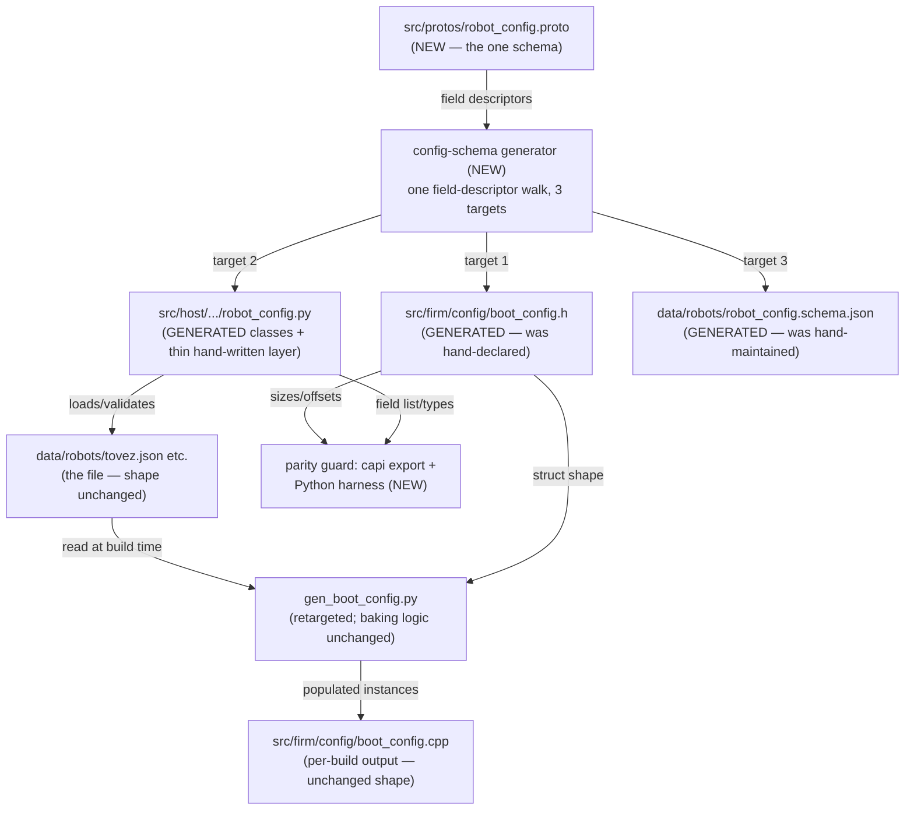
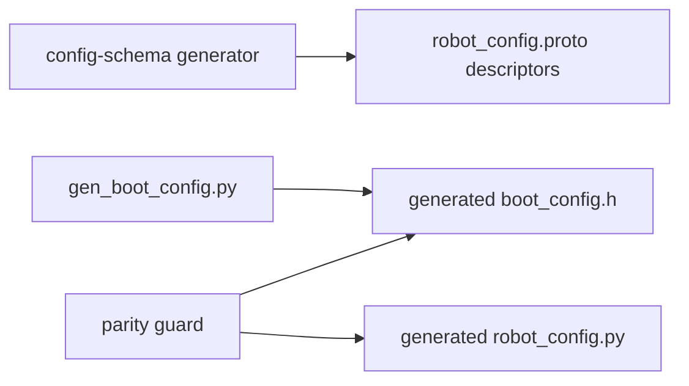

<!-- CLASI: Before changing code or making plans, review the SE process in CLAUDE.md -->

# Sprint 132: Configuration schema unification: one .proto generates the C++, pydantic, and JSON config surface

**Re-planned in place, 2026-08-03.** This sprint's original architecture
(read-back + per-wheel drive calibration over the wire) is superseded
wholesale by stakeholder direction the same day
([[the-configuration-object]]): the whole configuration surface becomes one
object, one owner, fed from baked values or the wire. No branch was ever
created for this sprint and zero tickets existed under the old plan, so
nothing is lost — this document replaces the old plan entirely rather than
migrating it. Its previous three linked issues
(`per-wheel-drive-calibration-as-runtime-configuration.md`,
`simplify-configuration-to-a-struct.md`,
`A-no-firmware-to-host-config-readback.md`) are now closed, each explicitly
absorbed into [[the-configuration-object]] (see each file's own closure
note in `clasi/issues/done/`); this sprint is unlinked from them and linked
to `the-configuration-object.md` instead. The `architecture_review` gate
recorded against the old design is invalid and is re-run below against the
new one.

**Scope cut, stated up front**: [[the-configuration-object]] lists six
sequencing steps. This sprint is **Step 1 only** — "One schema: `.proto`
generates everything." Step 2 (`Config::Robot` + `Configurator` ownership,
`RobotGraph::Resolved`'s removal, subsystem `configure()` methods) was
in this sprint's original brief but is cut out here: designing and
authoring a full 13-section, ~118-field schema that three independent
generator targets (C++, pydantic, JSON Schema) must emit correctly, while
holding boot behaviour byte-identical, is already a complete, independently
useful, and independently testable sprint by the issue's own sequencing
text ("each step is independently useful; stopping after any leaves the
tree better"). Folding Step 2's object-ownership rework on top would risk
exactly the kind of silent overfill the stakeholder has twice asked this
process not to do. Steps 2-6 remain [[the-configuration-object]]'s open
scope for a follow-on sprint. See Scope below and the report returned to
team-lead for the full reasoning.

## Goals

- Collapse the configuration surface's **four independent definitions**
  (`.proto` → wire messages only; `gen_boot_config.py`'s hand-declared
  `boot_config.h`; the hand-maintained `data/robots/robot_config.schema.json`;
  the hand-written `robot_config.py` pydantic model) into **one**: a new
  `.proto` schema that generates the C++ boot-config structs, the host
  pydantic model, and the JSON schema, all three from a single source.
- Delete `check_config_sync.py` and its 58-entry allowlist — the lint whose
  entire job was noticing drift between hand-maintained definitions that,
  after this sprint, cannot drift from each other by construction.
- Fix the **measured drift** this duplication already produced: the host
  pydantic model silently drops 18 of the JSON's 53 `control` fields,
  including two (`control.output_deadband`, `control.reversal_dwell_ms`)
  the firmware generator *requires* and refuses to build without.
- Take a single config field from **16 touchpoints, 9 hand-edited, across 5
  languages** (measured against `7256e22f`, a 4-field change touching 29
  files) down to **2**: edit the proto, edit the robot JSON.
- Do all of this with **no behaviour change** — boot must be byte-identical
  before and after, proven by the existing composition-root parity harness.

## Problem

Configuration is defined four times, not twice, and nothing but a
hand-curated lint (`check_config_sync.py`, 58 allowlist entries) notices
when the copies disagree:

| definition | source | generated from `.proto`? |
|---|---|---|
| wire messages | `.proto` → `gen_messages.py` | — |
| C++ boot structs | robot JSON → `gen_boot_config.py`, targeting hand-declared `boot_config.h` | **no** |
| `data/robots/robot_config.schema.json` | **hand-maintained** | **no** |
| `robot_config.py` pydantic model | **hand-written** | **no** |

The JSON schema's own `$comment` calls itself "the single source of truth"
via a custom `firmware` keyword pointing at `source/robot/DefaultConfig.cpp`,
`scripts/gen_default_config.py`, and `source/robot/ConfigRegistry.cpp` —
**all deleted in the 077 rebuild.** It documents a pipeline that no longer
exists.

The cost is measured, not estimated: adding one config field touches 16
places, 9 hand-edited, across 5 languages; `7256e22f` (4 fields) touched 29
files. And the four definitions have already drifted: the host pydantic
model has 36 `control` fields where the JSON has 53, silently dropping 18
via `extra='ignore'` — including `control.output_deadband` and
`control.reversal_dwell_ms`, which `gen_boot_config.py`'s own fail-closed
`_require()` calls make mandatory for a firmware build. 17 `control` keys
are read by nothing at all. `ShaperBootConfig` is generated, baked, and read
by no code.

This is the structural precondition for [[the-configuration-object]]'s
whole design (`Config::Robot`, one owner, one fan-out) — that design
presupposes exactly one schema exists to build the object from. Building
the object before unifying its schema would mean building it against one
of four already-disagreeing definitions.

## Solution

Author one new `.proto` schema (`src/protos/`) that transcribes — not
reshapes — today's robot-JSON shape: all 13 top-level sections (identity,
connection, vision, geometry, wheels, encoders, drive, gripper,
peripherals, calibration, control, estimator, planner), field-for-field,
type-for-type, default-for-default, with no behavioural change. Extend the
generator tooling with a new, dedicated multi-target codegen script that
walks this one schema's field descriptors once and emits three artifacts:
the C++ boot-config struct headers (replacing `boot_config.h`'s hand
declarations for the ~6 firmware-consumed groups), the host pydantic model
(replacing `robot_config.py`'s hand-written classes), and the JSON Schema
document (replacing the hand-maintained, stale-pointing file). Retarget
`gen_boot_config.py` — whose fail-closed value-baking logic is otherwise
unchanged — at the newly generated header. Add a generated parity guard
(the same sizes/offsets-export pattern `src/motion/planner/capi.cpp`
already uses) that mechanically proves the generated C++ struct and the
generated pydantic model have not drifted from each other, replacing
`check_config_sync.py`'s hand-curated comparison with a structural
guarantee. Delete `check_config_sync.py` and `config_sync_allowlist.json`
once the guard is in place.

No wire message changes. No `Config::Robot`. No `Configurator` rework. The
existing binary CONFIG plane (`MotorConfigPatch` and siblings in
`config.proto`) is a completely separate, curated schema for a different
purpose and is untouched.

## Success Criteria

- **One schema, three generated targets.** The C++ boot-config structs, the
  host pydantic model, and `robot_config.schema.json` are all generated
  from the same new `.proto` — none is hand-maintained or hand-generated
  by a bespoke script any more.
- **16 touchpoints → 2, demonstrated.** Adding a throwaway config field
  touches exactly the `.proto` and a robot JSON — nothing else.
- **`check_config_sync.py` and `config_sync_allowlist.json` are deleted**,
  along with any CI reference to them, and nothing takes their place except
  the generated parity guard.
- **The 18-field host pydantic drift is closed** — the generated model
  carries every `control.*` field the JSON does, including
  `output_deadband`/`reversal_dwell_ms`.
- **Boot behaviour is byte-identical.** `composition_root_parity_harness.cpp`
  passes unchanged; no baked value differs from what the pre-sprint pipeline
  produced for the same robot JSON.
- **Generated parity guard, working.** A struct-size/field-offset export
  (mirroring `plannerStructSizes()`/`plannerLimitsOffsets()`,
  `capi.cpp:69,93`) plus a Python harness (mirroring
  `planner_harness.py:207-212`) that walks it and cross-checks against the
  generated pydantic model's own field list, proving the two generated
  projections agree structurally.
- **ARM build succeeds** with the new generated header — several existing
  boot-config constraints (struct layout, no STL/exceptions/RTTI) are
  invisible under `HOST_BUILD` alone.
- **No regression** against the sim baseline (484 passed / 2 known
  failures: `test_clock_sync_activation.py`, `test_fake_transport.py`),
  established first per [[A-seven-untriaged-failing-tests-poison-every-no-regressions-claim]].
- **Existing host tooling keeps working** unmodified against the generated
  `robot_config.py` — TestGUI, bench scripts, and `calibration/push.py`
  import the same class/function names they do today.
- **Hardware smoke, `tovez`, on the stand** (addressed by UID per
  `.claude/rules/hardware-bench-testing.md`): boot and confirm unchanged
  behaviour. There is no new wire capability this sprint adds, so there is
  no new motion acceptance to invent — a boot-and-run smoke is the honest
  bar.

## Scope

### In Scope

- A new `.proto` schema declaring the robot JSON's full field set (all 13
  sections), transcribed faithfully from today's shape — no reshaping, no
  field renames, no new validation beyond what already exists.
- A new, dedicated codegen script emitting three targets from that one
  schema: C++ boot-config structs, host pydantic model, JSON Schema.
- Retargeting `gen_boot_config.py` at the generated C++ header (its own
  field-mapping/fail-closed logic unchanged).
- A generated parity guard (capi struct-size/offset export + Python
  harness) proving the C++ and pydantic projections agree structurally.
- Deleting `check_config_sync.py` and `config_sync_allowlist.json`,
  including any CI reference.
- One new step inserted into `build.py`'s generation pipeline, ahead of
  `gen_boot_config.py`.
- Fixing the measured 18-field host pydantic drift as a structural
  consequence of generation (not a hand patch to the old file).

### Out of Scope

- **[[the-configuration-object]]'s Step 2** — building `Config::Robot`,
  making `Configurator` its owner, deleting `RobotGraph::Resolved`, and
  giving subsystems a `configure(const Config::Robot&)` entry point. This
  was this sprint's original brief; cut here (see the note at the top of
  this document) as its own follow-on sprint. The issue stays open.
- **Steps 3-6** of the same issue: whole-group set/get over the wire and
  read-back (Step 3 — this is what the sprint's *original* per-wheel
  Stage-A-over-the-wire and `Get`/`ConfigSnapshot` goals become once
  `Config::Robot` exists; neither is built here), the generic
  `(target, field_number)` single-value wire setter (Step 4), retiring the
  patch surface and migrating OTOS/TestGUI (Step 5), and the cleanup sweep
  — the pre-`begin()` OTOS ordering bug, the `scaleToRegister()` domain
  mismatch, `extra='forbid'` on the host model, the 17 unread `control`
  keys, dead `ShaperBootConfig`, dead `CONFIG_PLANNER`/`CONFIG_WATCHDOG`
  (Step 6). All deferred; the issue stays open for each.
- **Reshaping the robot JSON's `control` section** into
  [[the-configuration-object]]'s consumer-grouped `Config::Robot` layout
  (Geometry/Motors/Drive/WheelControl/Planner/Otos/Estimator). That reshape
  breaks all three existing robot JSONs and needs a one-time migration —
  explicitly a Step-2-and-later concern, not this sprint's (see Design
  Rationale Decision 2).
- **Any wire/protocol change whatsoever.** The existing binary CONFIG plane
  (`MotorConfigPatch`, `DrivetrainConfigPatch`, `OtosConfigPatch`,
  `EstimatorConfigPatch` — `config.proto`) is untouched. No new command, no
  new reply arm.
- **Per-wheel Stage A drive calibration going live over the wire** — the
  original sprint's headline goal. It becomes straightforward once
  `Config::Robot`'s drive group exists (Step 2/3); building a one-off wire
  arm for it now would be exactly the kind of parallel mechanism the
  stakeholder's configuration-discipline rule exists to prevent.
- Deleting genuinely-dead fields (the 17 unread `control` keys, dead
  `ShaperBootConfig`). This sprint declares them faithfully (matching
  today's shape); Step 6 is where they're removed.

## Test Strategy

**Establish the sim baseline first**, before any generator change lands:
`uv run python -m pytest src/tests/sim -q`, expected 484 passed / 2 known
failures. Every ticket's acceptance is judged against this baseline.

- **Schema** (ticket 001): the `.proto` itself has no runtime behavior to
  test; its acceptance is that every field in every current robot JSON
  (`data/robots/*.json`) has a corresponding schema field, verified by a
  round-trip parse.
- **C++ generation + parity export** (ticket 002): the generated
  `boot_config.h` compiles under both `HOST_BUILD` and the ARM toolchain;
  `gen_boot_config.py`'s existing baking logic requires no field-mapping
  changes (its `_require()` calls target the same struct/field names).
- **Pydantic generation** (ticket 003): existing host pytest coverage for
  `robot_config.py` (loader, `list_robots()`, cross-field validators such
  as `rotational_slip`'s `{0} ∪ [0.5,1.0]` domain) passes unmodified
  against the generated model; a new test asserts the 18 previously-dropped
  `control` fields are now present.
- **JSON Schema generation** (ticket 004): the generated schema validates
  every current robot JSON with no new errors; the stale `firmware`
  `$comment` pointing at deleted generators is gone.
- **Build wiring + parity guard** (ticket 005): `build.py`'s new step runs
  before `gen_boot_config.py`; the parity harness (mirroring
  `planner_harness.py:207-212`) walks the capi export and cross-checks
  against the generated pydantic model's field list/types, and is proven
  to actually catch a drift (a deliberately introduced mismatch in a throwaway
  branch, reverted before landing, or an equivalent structural proof).
- **Lint deletion + full regression** (ticket 006): repo-wide grep confirms
  no remaining reference to `check_config_sync.py`/
  `config_sync_allowlist.json` (including CI config); full sim suite at or
  above the established baseline; `composition_root_parity_harness.cpp`
  passes; ARM build succeeds; the 16→2 touchpoint demonstration (add a
  throwaway field, diff the change against the proto + one robot JSON
  only); bench boot-and-run smoke on `tovez` (by UID,
  `.claude/rules/hardware-bench-testing.md`).

## Architecture

**Substantial** — touches 5+ areas (`src/protos`, a new `src/scripts`
generator, `src/firm/config`'s generated header, `src/host/robot_radio/config`'s
generated pydantic model, `data/robots/robot_config.schema.json`) and
changes a real data model (the host pydantic model's own field set closes
an 18-field drift). No new *runtime* cross-module dependency is introduced
— nothing on the robot's actuation path changes at all — but the
*build-time* generation graph changes shape (a new schema-generation step
now precedes two existing ones, and a whole hand-maintained/hand-generated
definition disappears in favor of a generated one), which is exactly the
kind of structural change the substantial tier exists to cover. The full
7-step methodology applies, diagrams included.

### Step 1: Understand the Problem

See Problem above. Concretely, two things are missing and one thing is
provably harmful:

1. There is no single declaration of the robot JSON's field set. Three
   independent artifacts each declare an overlapping-but-different view of
   it: `gen_boot_config.py`'s hand-written `_require()` calls (which fields
   the firmware bakes), `robot_config.py`'s hand-written pydantic classes
   (which fields the host validates), and `robot_config.schema.json`'s
   hand-maintained JSON Schema (which fields are documented/lint-checked).
2. `check_config_sync.py` exists only because of (1) — it hand-curates a
   `PATCH_TO_PYDANTIC` mapping to notice when the *wire* Patch surface and
   the pydantic model disagree, and separately allowlists 58 known
   pydantic-vs-hand-declared-struct gaps. It cannot notice drift it wasn't
   told to look for (the 18-field `control` gap existed silently until this
   sprint's own investigation measured it).
3. The JSON schema's `$comment` claims authority it has not had since the
   077 rebuild deleted the pipeline it names — a stale claim is worse than
   an absent one, because it actively misdirects a reader trying to find
   the real source of truth.

### Step 2: Identify Responsibilities

- **Declaring the schema** — the field set, types, nesting, defaults, and
  (where expressible) bounds every one of the robot JSON's ~118 fields
  carries. Changes only when a config field is added, removed, or retyped.
- **Generating the C++ boot-config struct shape** from that schema.
  Changes only when the C++ target's own output conventions change
  (naming, POD layout, which of the 13 sections the firmware-consumed
  subset covers).
- **Generating the host pydantic model shape** from that schema.
  Independent of the C++ target — changes only when the Python target's
  own conventions change (nesting, `Optional` handling, validator
  generation).
- **Generating the JSON Schema document** from that schema. Independent of
  both other targets.
- **Baking per-robot VALUES** from the active robot JSON into a populated
  C++ struct instance — the existing, unchanged responsibility
  `gen_boot_config.py` already owns; only what it targets moves (a
  generated header, not a hand-declared one).
- **Proving the three generated projections have not drifted from each
  other** — a new responsibility (the parity guard), replacing
  `check_config_sync.py`'s hand-curated, allowlist-escapable comparison
  with a structural one.
- **Ceasing to exist** — the machinery that only ever existed to notice
  drift between hand-maintained definitions has nothing left to do once
  there is one definition; this is a deletion, not a live responsibility.

### Step 3: Define Subsystems and Modules

**`robot_config.proto`** (new, `src/protos/`)
Purpose: declares every field the robot JSON may carry.
Boundary: inside — the full 13-section field set (identity, connection,
vision, geometry, wheels, encoders, drive, gripper, peripherals,
calibration, control, estimator, planner), transcribed 1:1 from today's
hand-maintained JSON schema/pydantic model, no reshaping. Outside — the
wire config plane's curated Patch messages (`config.proto`'s existing
`MotorConfigPatch`/`DrivetrainConfigPatch`/`OtosConfigPatch`/
`EstimatorConfigPatch`, untouched — a different schema, a different
purpose) and any field this schema declares but no generator target
consumes (declared faithfully, per Design Rationale Decision 3).
Serves: SUC-001, SUC-002, SUC-005.

**Config-schema generator** (new, `src/scripts/` — a dedicated script, not
an extension of `gen_messages.py`; see Design Rationale Decision 1)
Purpose: turns the one schema into three generated artifacts.
Boundary: inside — three emission targets sharing one field-descriptor
walk: C++ POD struct headers (the ~6 firmware-consumed groups: Otos,
Estimator, Shaper, Drive, WheelController, Planner boot configs), a
pydantic `BaseModel` hierarchy (all 13 groups), and a JSON Schema document
(all 13 groups). Outside — baking per-robot VALUES (`gen_boot_config.py`'s
job, logic unchanged) and wire-message generation (`gen_messages.py`'s
existing, separate job — untouched).
Serves: SUC-001, SUC-003, SUC-005.

**Generated C++ boot-config header** (`src/firm/config/boot_config.h`, now
generated, not hand-declared)
Purpose: declares the firmware-consumed config struct types.
Boundary: inside — struct field names/types/defaults, reproduced exactly
from today's hand-declared version so `gen_boot_config.py` needs no
field-mapping changes. Outside — `msg::MotorConfig`/`msg::DrivetrainConfig`
(already generated via the existing, separate `gen_messages.py` +
`motor.proto`/`drivetrain.proto` path — untouched by this sprint).
Serves: SUC-001, SUC-002.

**`gen_boot_config.py`** (existing, retargeted)
Purpose: bakes the active robot JSON's values into a populated
`boot_config.cpp`.
Boundary: inside — the `_require()`/fail-closed field-mapping logic
(unchanged), now targeting the generated header's struct declarations
instead of the hand-declared ones. Outside — the struct SHAPE itself (the
generator's job) and any new validation beyond "is the key present"
(none added this sprint).
Serves: SUC-002.

**Generated host pydantic model** (`src/host/robot_radio/config/robot_config.py`,
generated data classes + a thin hand-written accessor layer)
Purpose: the host's typed, validated view of a robot JSON.
Boundary: inside — the `BaseModel` class hierarchy (generated). Outside —
the loader/singleton resolution order and any genuinely cross-field
validation rule the schema cannot express (hand-written, thin, unchanged
behavior — see Design Rationale Decision 4).
Serves: SUC-001, SUC-005.

**Generated JSON Schema** (`data/robots/robot_config.schema.json`, now
generated, not hand-maintained)
Purpose: declares the shape every robot JSON must conform to.
Boundary: inside — property declarations for all 13 sections. Outside —
the stale `firmware` `$comment` keyword pointing at deleted generators,
which disappears with the hand-maintained file it lived in.
Serves: SUC-001, SUC-005.

**Generated parity guard** (new `extern "C"` export in `src/firm/config/` +
a Python harness)
Purpose: mechanically proves the generated C++ struct and the generated
pydantic model have not drifted from each other.
Boundary: inside — struct sizes/per-field offsets exported the same way
`plannerStructSizes()`/`plannerLimitsOffsets()` already do
(`src/motion/planner/capi.cpp:69,93`), and a Python harness walking them
against the pydantic model's own field list/types (mirroring
`planner_harness.py:207-212`). Outside — everything
`check_config_sync.py` used to check that this sprint deletes outright
(the hand-curated `PATCH_TO_PYDANTIC` map, the wire-Patch-vs-pydantic
comparison — a different, untouched schema).
Serves: SUC-003, SUC-004.

**`check_config_sync.py` + `config_sync_allowlist.json`** (deleted)
Purpose (historical): noticed drift between hand-maintained definitions.
Boundary: N/A — deleted, along with any CI reference.
Serves: SUC-004 (by ceasing to exist).

**`build.py`** (existing, one new step inserted)
Purpose: orchestrates the generation pipeline in dependency order.
Boundary: inside — the one new pipeline step (schema generation, ahead of
`gen_boot_config.py`). Outside — every other existing step (`gen_messages.py`,
`gen_pb2.py`, the version bump), unchanged.
Serves: SUC-002.

Quality check: every module traces to at least one SUC below; the wire
Patch messages (`config.proto`) are untouched by any module above; no
cycles — the schema is a build-time leaf both the C++ and Python targets
depend on, `gen_boot_config.py` depends only on the generated header, and
the parity guard depends on both generated targets while nothing depends
on it.

### Step 4: Diagrams

**Component diagram.** 9 nodes — within range for the new build-time
generation graph this sprint introduces. An ERD is not warranted: this is
a schema/struct unification, not a relational/entity data model change
(no new tables, no new relationships) — omitted, same reasoning sprint
124's own architecture used for the same call.

`check_config_sync.py` is not drawn — it is deleted, not a live component.

**Dependency graph** (fan-out check — no module exceeds 2, well inside the
4-5 no-justification-needed bound):

No cycles: the schema is a shared leaf both the C++ and Python generation
targets depend on; `gen_boot_config.py` depends only on the generated
header; the parity guard depends on both generated targets and nothing
depends on it.

### Step 5: What Changed / Why / Impact / Migration

**What Changed**

- `src/protos/robot_config.proto` (new): the full robot-JSON field set,
  all 13 sections, transcribed from today's shape.
- A new codegen script under `src/scripts/` (exact name/location a ticket
  002 implementation call, per Design Rationale Decision 1): emits
  generated `boot_config.h` (C++), `robot_config.py` (pydantic classes),
  and `robot_config.schema.json` from the one schema.
- `src/firm/config/boot_config.h`: regenerated, not hand-declared;
  field-for-field identical to today's version for the ~6 firmware-consumed
  struct types.
- `src/scripts/gen_boot_config.py`: retargeted at the generated header; its
  own `_require()` field-mapping logic is unchanged.
- `src/host/robot_radio/config/robot_config.py`: regenerated classes +
  thin hand-written loader/validator layer, replacing the fully
  hand-written file; the 18-field `control` drift closes as a structural
  consequence.
- `data/robots/robot_config.schema.json`: regenerated, replacing the
  hand-maintained file and its stale `firmware` `$comment`.
- A new `extern "C"` capi export (struct sizes/field offsets) in
  `src/firm/config/`, plus a Python parity harness.
- `check_config_sync.py` and `config_sync_allowlist.json`: deleted, along
  with any CI reference.
- `build.py`: one new pipeline step, the schema generator, inserted ahead
  of `gen_boot_config.py`.

**Why**

Per [[the-configuration-object]]'s own Step 1 and the stakeholder's
2026-08-03 configuration-discipline rule: "there's one file for it, and
that file is the one used for baking." Four independent hand-maintained/
hand-generated definitions cannot honor that — they have already drifted
(the measured 18-field pydantic gap), and the tooling that exists to
notice drift (`check_config_sync.py`) can only catch what it was told to
look for. One schema generating all three removes the drift as a
possibility rather than policing it after the fact — the precondition
[[the-configuration-object]]'s own `Config::Robot` design (Step 2, out of
scope here) needs before it can be built against a single source of truth.

**Impact on Existing Components**

- `gen_boot_config.py`: modified (retargeted; field-mapping logic
  unchanged).
- `check_config_sync.py` + `config_sync_allowlist.json`: deleted.
- `robot_config.py`: replaced — public API preserved (class names,
  `get_robot_config()`, `list_robots()`); class BODIES become generated.
  Consumers (TestGUI, bench scripts, `calibration/push.py`) are unaffected
  as long as import paths/attribute names stay identical (ticket 003's own
  acceptance criterion).
- `data/robots/robot_config.schema.json`: replaced (generated); stale
  `firmware` `$comment` removed.
- `build.py`: one new pipeline step inserted.
- `boot_wiring.cpp`/`.h`, `Configurator`, `RobotGraph::Resolved`: **untouched**
  this sprint (Step 2 deferred).
- Wire `config.proto` (`MotorConfigPatch` and siblings): **untouched** —
  different schema, different purpose.
- `data/robots/tovez.json`/`togov.json`/etc.: unchanged in shape (Design
  Rationale Decision 2); may need re-validation against the newly generated
  schema, not a content change.

**Migration Concerns**

- **No wire-format change at all.** The existing binary CONFIG plane is
  completely untouched, so there is no coordinated firmware/host
  deployment concern for this sprint specifically (unlike this sprint's
  original scope, which did touch the wire).
- **Boot behaviour must be byte-identical** — `composition_root_parity_harness.cpp`
  is the existing proof; no struct VALUES change, only their declaration
  mechanism, so there is no new numerical hazard.
- **ARM build must succeed** — the generated C++ header must compile under
  the same CODAL/`-fno-rtti`/`-fno-exceptions` constraint the existing wire-
  message generator already targets; this is a ticket-002 acceptance
  criterion, not inferred from a green host build.
- **Host tooling migration risk.** Any hand-written behavior in today's
  `robot_config.py` (cross-field validators, computed properties, the
  loader's resolution-order logic) that is NOT mechanically re-derivable
  from the schema must survive in the thin hand-written layer (Design
  Rationale Decision 4) — dropping it silently would be a real behavior
  regression even though "boot behaviour" itself stays byte-identical.
  Ticket 003's acceptance requires the full existing host pytest suite to
  pass unmodified against the generated replacement.
- **CI wiring.** `check_config_sync.py` may be referenced directly by a CI
  workflow file; ticket 006 must find and remove that reference alongside
  the script deletion, or CI breaks on a missing script rather than
  cleanly dropping a lint that no longer has a job to do.

### Step 6: Design Rationale

**Decision 1 — A new, dedicated codegen script, not an extension of
`gen_messages.py`.**
Context: `gen_messages.py` already parses `.proto` via `grpcio-tools` and
walks field descriptors to emit C++; it is already 3040 lines and single-
purpose (CODAL-constrained wire messages: CRC/COBS-aware, chainable
setters, wire codec). This sprint's generator emits three NON-wire targets
(a plain POD struct, a pydantic model, a JSON Schema document) sharing no
wire-envelope concerns with that job.
Alternatives: (a) a new sibling script, reusing shared field-walking
helpers where practical [chosen]; (b) bolt three new emission modes onto
`gen_messages.py` directly.
Why: the project's own precedent already draws this line —
`gen_boot_config.py`'s file header explicitly separates itself from
`gen_default_config.py` because the two "target different C++ types" and
are "deliberately separate" — the same cohesion argument applies here,
more strongly: (b) would grow an already-large, already-single-purpose
file with three emission targets that have nothing to do with wire
envelopes. A new script keeps "what emits wire messages" and "what emits
the robot-config data model, three ways" as two things that each pass the
one-sentence cohesion test on their own.
Consequences: some field-walking/type-mapping logic may end up duplicated
or partially shared between the two generators — a candidate for later
consolidation, not required this sprint (ticket 002's own implementation
call).

**Decision 2 — The new schema mirrors today's robot-JSON shape exactly; no
reshaping.**
Context: [[the-configuration-object]]'s own end-state design (`Config::Robot`,
grouped by consumer, retiring the `control` dumping ground) is Step 2/3
work; Step 1's own sequencing text says "No behaviour change."
Alternatives: (a) the proto mirrors today's 13-section shape exactly,
deferring the consumer-grouped reshape to the sprint that builds
`Config::Robot` [chosen]; (b) do the reshape now, since the schema is
being rewritten anyway.
Why: (b) breaks all three existing robot JSONs and needs a one-time
migration script plus a re-bake (per the issue's own text) — conflating a
purely definitional change (one schema replaces four) with a structural
one (regrouping fields) doubles this sprint's risk and directly
contradicts Step 1's own "no behaviour change" framing. An unreshaped
schema makes the generated pydantic/JSON-Schema/C++-struct outputs a
mechanical, verifiable transcription of what exists today, so the
regression tests can assert byte-identical behavior with no judgment calls
about what changed.
Consequences: the `control` section's 53-field mess, including its 17 dead
keys, persists through this sprint exactly as it exists today — reshaping
into `Config::Robot`'s per-consumer groups is explicitly Step 2-and-later.

**Decision 3 — The generated schema declares every field, including the
17 the issue itself documents as read by nothing.**
Context: an audit already found 17 `control` keys with no live consumer,
and a whole dead struct (`ShaperBootConfig`).
Alternatives: (a) declare every field faithfully, dead ones included
[chosen]; (b) quietly drop the dead fields while unifying the schema,
since they're already known to be dead.
Why: (b) is a behavior/data change disguised as a mechanical unification —
exactly the kind of drift this sprint exists to eliminate, just introduced
by the sprint itself instead of by accretion. "Delete it, don't wire it"
(the configuration-discipline rule) is real guidance, but it is Step 6's
job ("cleanups the audit surfaced"), not Step 1's — deleting a field is a
decision with its own blast radius (three robot JSONs currently carry it)
that deserves its own ticket and its own review, not a side effect of a
schema-generation sprint.
Consequences: the generated pydantic model and JSON Schema both still
declare the 17 dead `control` keys and `ShaperBootConfig`'s six fields;
removing them is explicitly out of scope here (see Scope, and the issue's
own Step 6).

**Decision 4 — The generated pydantic model keeps a thin, hand-written
accessor/validation layer around it.**
Context: `robot_config.py` today is not just field declarations — it has
module-level functions (`get_robot_config()`, `list_robots()`), a
resolution-order/caching singleton, and cross-field `model_validator`s
(e.g. `rotational_slip`'s non-contiguous `{0} ∪ [0.5,1.0]` domain) that
aren't declarative field-by-field concerns.
Alternatives: (a) generate the `BaseModel` class hierarchy only; keep the
loader/singleton/validator logic hand-written in a thin wrapper importing
the generated classes [chosen]; (b) attempt to generate everything,
including custom validators, from proto options.
Why: (b) requires the schema DSL to express arbitrary cross-field Python
validation logic, which proto has no clean way to encode — `config.proto`'s
own file header already gives the identical reasoning for NOT wire-
encoding `validateCandidate()`'s business rules (a non-contiguous domain no
single `(min)`/`(max)` pair can express). Splitting generated-data from
hand-written-behavior mirrors the C++ side's own existing split (a
generated struct SHAPE, a hand-written `gen_boot_config.py` doing the
BEHAVIOR of baking).
Consequences: a future field needing custom cross-field validation still
requires a hand-written addition to the thin wrapper, same as today — this
sprint reduces touchpoints for an ordinary field from 16 to 2, not to 1 for
every conceivable kind of field.

**Decision 5 — `check_config_sync.py` is deleted outright, not narrowed or
kept as a redundant check.**
Context: the lint's whole purpose was noticing drift between hand-
maintained definitions; with one schema generating all three, the sides it
used to compare cannot disagree by construction.
Alternatives: (a) delete outright, replaced by the generated parity guard
[chosen]; (b) keep it running alongside the new guard, for defense in
depth.
Why: (b) is duplicate machinery proving the same thing two different ways
— the new parity guard is a strictly stronger guarantee (byte-for-byte
generated-code comparison) than `check_config_sync.py`'s hand-curated
`PATCH_TO_PYDANTIC` map and 58-entry allowlist ever gave, and the issue
explicitly calls for deletion ("Delete `check_config_sync.py` and its
allowlist — with one definition there is nothing left to keep in sync").
Consequences: `config_sync_allowlist.json`'s 58 entries are deleted with
it; none of that curated-mapping machinery survives into this design.

### Step 7: Open Questions

1. **Exact name/location for the new generator script** (`gen_robot_config_schema.py`
   under `src/scripts/`, or an equivalent) — left to ticket 002's own
   implementation call, per Decision 1's reasoning (a separate script,
   sharing helpers with `gen_messages.py` where practical).
2. **Whether cross-field validation rules that ARE expressible as a simple
   range** (unlike `rotational_slip`'s non-contiguous domain) should be
   generated via a `(min)`/`(max)`/`(abs_max)`-style proto option
   extension (extending `options.proto`, whose extension mechanism already
   exists), reserving the hand-written wrapper only for genuinely
   non-contiguous cases — left to ticket 003.
3. **Whether `data/robots/*.json`'s three files should be re-validated
   against the newly generated JSON Schema** as part of this sprint (a
   cheap, low-risk check), or whether "compiles + boots byte-identical" is
   sufficient proof on its own — left to ticket 006's own bench judgment.
4. **Step 2 and beyond** — `Config::Robot`, `Configurator` ownership,
   wire-level read-back, the generic field setter, patch-surface
   retirement, and the cleanup sweep — all deferred; the issue stays open
   for each, per Scope above.

## Use Cases

### SUC-001: One schema change reaches all three generated representations
Parent: None — new capability; the whole point of this sprint.

- **Actor**: Firmware/host developer
- **Preconditions**: Tickets 001-004 landed.
- **Main Flow**:
  1. Developer adds a new field to `robot_config.proto`, with a comment.
  2. Developer runs `python build.py` (or the schema generator directly).
  3. The generated C++ boot-config struct, the generated pydantic model,
     and the generated JSON Schema all reflect the new field with no other
     source file touched.
  4. Developer adds the field's value to the relevant robot JSON(s).
- **Postconditions**: The field is fully wired through all three
  projections from exactly two edits.
- **Acceptance Criteria**:
  - [ ] Adding a throwaway config field touches exactly the `.proto` and a
        robot JSON — demonstrated directly (ticket 006).
  - [ ] The generated C++ struct, pydantic model, and JSON Schema all carry
        the new field with matching name/type after one generator run.

### SUC-002: Boot behaviour is unchanged after the schema unification
Parent: None — regression-prevention use case.

- **Actor**: CI / a developer running the sim and ARM build
- **Preconditions**: Tickets 001-005 landed.
- **Main Flow**:
  1. Build the firmware from an existing robot JSON (e.g. `tovez.json`)
     through the new pipeline (schema generation → `gen_boot_config.py` →
     compile).
  2. Run `composition_root_parity_harness.cpp`.
  3. Compare every baked value against the pre-sprint pipeline's output for
     the same robot JSON.
- **Postconditions**: Every baked value is identical; no field silently
  changed meaning, type, or default during the schema migration.
- **Acceptance Criteria**:
  - [ ] `composition_root_parity_harness.cpp` passes with no new failures.
  - [ ] Sim baseline holds at 484 passed / 2 known failures or better.
  - [ ] ARM build succeeds.

### SUC-003: The generated parity guard proves the C++ and pydantic projections agree structurally
Parent: None — new capability, replaces `check_config_sync.py`'s job.

- **Actor**: CI / developer
- **Preconditions**: Ticket 005 landed.
- **Main Flow**:
  1. The C++ side exports struct sizes and per-field offsets via
     `extern "C"` (mirroring `plannerStructSizes()`/`plannerLimitsOffsets()`).
  2. The Python harness walks the export and cross-checks it against the
     generated pydantic model's own field list and types.
  3. Both are regenerated from the same `.proto` on every build, so they
     cannot structurally disagree — the harness's role is to make that
     guarantee mechanically checkable, not to catch drift after the fact.
- **Postconditions**: A structural mismatch (e.g. a hand-edit to the
  generated header, or a generator bug that omits a field on one target)
  fails the harness loudly.
- **Acceptance Criteria**:
  - [ ] The harness passes against the current generated pair.
  - [ ] The harness is demonstrated to fail on an intentionally introduced
        structural mismatch (a throwaway branch, reverted before landing,
        or an equivalent structural proof).

### SUC-004: `check_config_sync.py`'s job is gone, not just quiet
Parent: None — deletion use case.

- **Actor**: developer/CI
- **Preconditions**: Ticket 006.
- **Main Flow**:
  1. `check_config_sync.py` and `config_sync_allowlist.json` are deleted.
  2. Any CI workflow reference to either file is removed.
  3. A repo-wide search confirms no remaining reference outside git
     history.
- **Postconditions**: CI is green with no lint step for a problem that no
  longer exists.
- **Acceptance Criteria**:
  - [ ] `check_config_sync.py` and `config_sync_allowlist.json` do not
        exist on disk.
  - [ ] No CI workflow file references either filename.
  - [ ] CI (or the local equivalent) runs green without them.

### SUC-005: Existing host tooling keeps working against the generated pydantic model
Parent: None — regression-prevention use case for the host side.

- **Actor**: Bench operator / TestGUI / calibration scripts
- **Preconditions**: Ticket 003 landed.
- **Main Flow**:
  1. Run the existing host pytest suite (including TestGUI acceptance
     coverage and anything depending on `calibration/push.py` or
     `get_robot_config()`/`list_robots()`) against the generated
     `robot_config.py`.
  2. Confirm every existing import (`RobotConfig`, `get_robot_config`,
     `list_robots`, nested model class names) still resolves.
  3. Confirm the 18 previously-dropped `control` fields are now present
     and populated for a robot JSON that sets them.
- **Postconditions**: No consumer of the pydantic model needs to change;
  the drift this sprint set out to close is measurably closed.
- **Acceptance Criteria**:
  - [ ] Existing host pytest suite passes unmodified against the generated
        model.
  - [ ] A new test asserts `control.output_deadband`/
        `control.reversal_dwell_ms` (and the other 16 previously-dropped
        fields) are present on the generated model.

## GitHub Issues

(GitHub issues linked to this sprint's tickets. Format: `owner/repo#N`.)

## Definition of Ready

Before tickets can be created, all of the following must be true:

- [x] Sprint planning document is complete (sprint.md, including its
      Architecture and Use Cases sections)
- [x] Architecture review passed (or skipped, for changes with no
      architectural impact)
- [ ] Stakeholder has approved the sprint plan

## Tickets

| # | Title | Depends On |
|---|-------|------------|

Tickets execute serially in the order listed.
