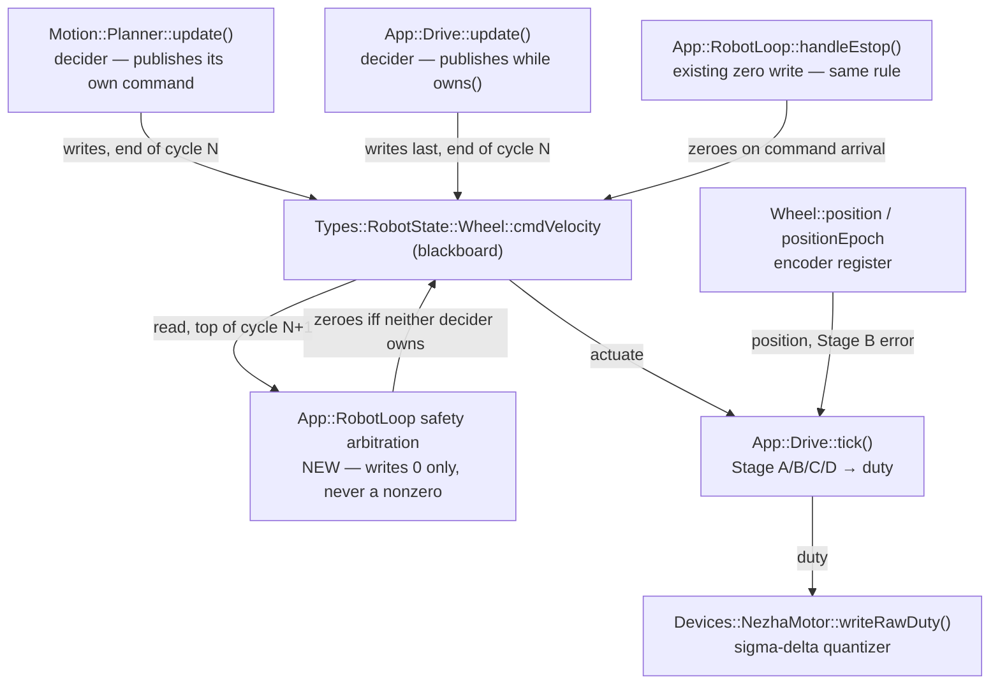
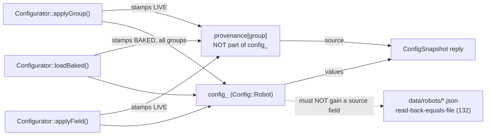

<!-- CLASI: Before changing code or making plans, review the SE process in CLAUDE.md -->

# Sprint 133: Stop-path safety, wheel-velocity position loop, and honest config provenance

## Goals

Land four already-measured findings as merged, architecturally-honest code, in
one short sprint, so the stakeholder can get hands on the wheel controller and
test it.

Every change in this sprint has **already been built and measured** on a
throwaway branch (`position-pid` in the `radio-robot-elite-vmin` worktree) or on
the bench. Nothing here is a hypothesis. The sprint's job is to re-apply the
work properly — resolving the one architectural violation that kept it out of
master — verify it on `tovez`, and stop there.

Ordering is stakeholder-mandated: **stop fix first, then controller.** The stop
defect is a safety defect, and it is also a *measurement* defect: before it is
fixed, every "overshoot" number the controller work produces contains a tail
that is a runaway rather than a control error.

## Problem

Four defects, all measured, none fixed on master.

**1. A single commanded stop does not reach the motor** (safety). Measured on
`vevov`: a host that issues a stop once and goes quiet gets **936 mm of
continued travel with no decay**, still going when the capture ended.
`estop()` failed **5 of 6** attempts. Only repetition stops the wheels. The
Nezha brick physically latches its last commanded speed and does not reset on an
nRF52 reset, so a lost zero write is permanent, not transient. Both existing
defences — `NezhaMotor::writeRawDuty()`'s re-issue and `Drive::tick()`'s stop
re-assertion window — gate on the **encoder**, so both are disarmed by a wheel
that reads at rest. Above them, ownership handoff leaves a gap nothing covers:
`Drive::update()` publishes one zero pair on the expiry cycle and then returns
early forever, and `Planner::update()` republishes only its own command. Nothing
ever states *"no one is driving, so the speed is zero."*

**2. The wheel controller's I term is a position term computed the worst
possible way.** `integral += ki · err · dt`, with `err` in mm/s, accumulates
**millimetres** — the velocity loop always contained a position controller. It
just built its position estimate by summing a *derived, quantized* velocity
(sd 8.0 mm/s) instead of reading the encoder's position register, so every
dropped or manufactured-zero sample permanently deleted real distance. A
unit-domain bug falls out: `iMax` clamps `ki · error`, so the maximum position
error the loop could **remember** was `iMax / ki` mm — at ki=6/iMax=20 that is
**3.3 mm**, smaller than every residual being chased, and raising `ki` made the
memory *shorter*. Separately, duty reaches the brick as an integer percent with
`kDutyPerSpeed = 0.001182`, so **one duty count is 8.46 mm/s** — 5.6% of a
150 mm/s command. The left/right imbalance being chased was 0.43 of ONE count.
No gain can command a value the output cannot represent, which is why three
sweeps returned nothing.

**3. Sprint 132 shifted the sim turn-error distribution** (turn 2: −2.6° →
−8.6°; turns 6/8/10: ~−12° → ~−21°). Real and reproduced via a pre-sprint
worktree A/B, **not root-caused**.

**4. A live config push is silently wiped by the next reconnect.**
`SerialConnection.connect()` pulses DTR on every direct-USB open, resetting the
MCU (`PONG:t=817843` → `PONG:t=3085`, the clock going *backwards*), and `DRIVE`
is not flash-persisted. Together: a push is erased by the very next connection,
with no error and no indication. The reset also buys nothing — `HELLO` already
elicits the `DEVICE:` banner with `dtr = False`. Today **you cannot observe a
robot without rebooting it**; every host connection disturbs the thing it
measures.

## Solution

**Stop path.** Apply the measured two-part fix, but land the unowned-motion
guard in an architecturally legitimate home rather than as the loose blackboard
write the issue was filed over. `cmdVelocity` keeps exactly one *decider* per
cycle; `RobotLoop` gains one named, monotone-toward-zero **safety arbitration**
step that runs immediately before actuation and may only ever write zero. See
Design Rationale Decision 1 — this is the tension the issue asked to be
resolved, and it is resolved by making the existing rule honest rather than by
adding an idle owner. Arm the stop re-assertion on the commanded nonzero→zero
transition of the duty pair rather than only on `estop()`, so re-assertion
depends on what was **commanded**, not on what the encoder claims happened.

**Wheel controller.** Replace the accumulator with a direct encoder-position
read (same control law, same units, same output — the loop still commands
velocity, which is all the motor takes), clamped in **millimetres** by a new
`posErrMax`, leaving `iMax` as what it always honestly was: an output clamp.
Add a sigma-delta on the duty rounding residual so commands below one duty count
are represented over time, with the carry **discarded on commanded zero** (a
residual from the last nonzero duty would round to ±1 and creep a stopped wheel,
re-creating problem 1). Ship the RAM-only `DBG` tuning verbs and the
velocity-profile-gate flags so the stakeholder can tune live.

**Turn regression.** Verify first, root-cause only if needed. Re-run the
worktree A/B after the controller work lands and check whether the distribution
returns to its pre-sprint shape. Only if it does not do we spend tickets
bisecting.

**Config provenance.** Stop asserting DTR (per-role if the relay turns out to
need it), stamp per-group provenance in `applyGroup()`/`applyField()` only —
the two paths that mutate `config_` — and carry it on the `ConfigSnapshot`
**reply**, never as a config-struct field. Make read-back automatic with a
`verify=True` push path. Explicitly do **not** persist `DRIVE` to flash.

## Success Criteria

- A stop issued **once** stops the wheels, on every path — silent host, one
  `estop()`, one `wheels(0,0)` — measured on `tovez`, with no failures across
  the repeat set.
- The left/right imbalance on the standing velocity-profile gate is at or near
  **1.00** on both profiles on `tovez`, down from the shipped ~1.06.
- `posErrMax` reaches the robot through **both** a runtime path and a bake path,
  from the same file (`.claude/rules/configuration-discipline.md` invariant 2).
- `tovez`'s own tuned values are promoted into `data/robots/tovez.json`. The
  `vevov` numbers in the issue are bare-motor **starting points**, not answers.
- The sim turn-error distribution is re-measured against the pre-132 merge-base
  and the result — restored or not — is recorded with evidence.
- A `DRIVE` push survives a reconnect and reports `LIVE`; after a power cycle it
  reports `BAKED`. The loss is visible, not silent.
- Test suite identity matches the master baseline (see Test Strategy) at the end
  of the sprint.
- The four known-unknowns the wheel-controller issue flags are carried forward
  as **open**, not quietly declared solved.

## Scope

### In Scope

- `App::RobotLoop` — named safety-arbitration step; ownership-invariant
  documentation brought into line with what the code actually does.
- `App::Drive` — commanded-stop re-assertion arming; position-domain Stage-B
  I term (`PositionRef`, `positionError()`, `fastPid()`); `posErrMax` bound and
  setter; `cmdAccel` on the WHEELS path (inert at `kff = 0`, carried as
  unvalidated).
- `Devices::NezhaMotor` — sigma-delta duty quantizer, carry discarded on
  commanded zero.
- Config surface — `WheelControl.pos_err_max` through the proto, the generated
  boot config, `data/robots/*.json`, and the live wire path.
- `App::Comms` / `DBG` channel — four RAM-only tuning verbs (`vmin`, `gain`,
  `asteady`, `pos`), `ROBOT_DEBUG` builds only.
- `App::Configurator` — per-group provenance stamped at the two mutation
  points; provenance on the `ConfigSnapshot` reply message.
- Host `io/serial_conn.py` — DTR policy; `robot/protocol.py` — `verify=True`
  push path and the corrected `wheels()` docstring.
- Bench tooling — `velocity_profile_gate.py` flags; `tail_forensics.py` and its
  plotters; **minimal** `.config()` repair of `velocity_step_response.py` and
  `wheel_controller_ab_bench.py` only.
- Bench acceptance on `tovez`, by UID.
- Sim A/B of the turn-error distribution against the pre-132 merge-base.
- Doc corrections: `NezhaProtocol.wheels()`'s "a dead host can never mean a
  runaway" claim, and `.claude/rules/playfield-testing.md`'s single-`estop()`
  measurement.

### Out of Scope

- **An encoder-independent lowest-layer stop.** `writeRawDuty()`'s
  `stopNotTaken` exemption still gates on measured velocity; ticket 001 covers
  it from above for 30 cycles, but a stop lost *after* that window with a dead
  encoder would still be permanent. The real answer is a stop the brick
  acknowledges, or a periodic zero heartbeat while at rest. Recorded as residual
  risk, not fixed here.
- **Making the stop fast.** A stop still takes ~1.2 s and ~35 mm on bare
  motors. That is the write shaping — slew cap and output deadband in
  `writeShapedDuty()` — not the stop path. Now bounded and consistent; not fast.
- **Persisting `DRIVE` to flash.** Explicit non-goal (issue 4). Persistence
  reintroduces exactly the ambiguity sprint 132 removed — a robot booting tuned
  values nobody in the room knows about.
- **Restructuring Stage B as an explicit outer position stage.** The issue's
  own open decision 1 (composing onto a HiWonder/Yahboom board whose velocity
  PID becomes the inner loop). The in-place version is what was measured; that
  is what ships. The outer-stage question is deferred.
- **Retiring `aSteady` and the deficit-flag policy.** Vestigial for Stage B once
  there is no accumulator to gate, but Stage C still uses `aSteady`. Deletion is
  a separate sweep.
- **Adopting `B-sprint-132-capability-gaps-and-broken-bench-scripts.md`
  wholesale.** Only the two scripts a wheel-controller tuning session actually
  reaches for get repaired, inside the ticket that needs them.
- **Re-tuning `kff` under load, reversals, and the unexplained 3–4% square
  overshoot.** Carried as open questions with owners, not closed here.

## Test Strategy

**Baseline is identity, not counts.** Master is 5 failed / 1856 passed /
3 skipped / 12 xfailed / 2 xpassed. The 5 pre-existing failures, by name:

- `test_gen_boot_config_planner.py::test_planner_config_for_config_reads_tovez_json`
- `test_gen_boot_config_planner.py::test_generate_emits_default_planner_limits_byte_identical_to_pre_ticket_literals`
- `test_gui_button_acceptance.py::test_tour_1_runs_to_completion`
- `test_gui_button_acceptance.py::test_tour_2_runs_to_completion`
- `test_tour_closure_gate.py::test_tour_1_and_tour_2_ninety_degree_turns_land_within_the_shaped_band`

A ticket that changes this set must name every entry that moved and why. A
count that matches while the *set* has changed is a regression that has been
hidden by a coincidence — measuring one slice and generalizing has burned this
project twice, so the **full collection** is required:
`testpaths = ["src/tests/sim", "src/tests/unit", "src/tests/testgui"]`, ~11 min.

**Per-tier coverage.**

| tier | what it proves | where |
|---|---|---|
| host unit | proto/JSON/boot-config round trip for `pos_err_max`; provenance stamping; `verify=True` mismatch raises | `src/tests/unit` |
| sim | the safety-arbitration step zeroes on the unowned cycle; position-domain I term is exercised through `SimLoop` | `src/tests/sim` |
| testgui | the turn-error distribution A/B against a pre-132 merge-base worktree | `src/tests/testgui` |
| bench (`tovez`) | stop lands on every path; imbalance → 1.00; `posErrMax` reaches the robot both ways | `src/tests/bench` |

**Mid-sprint green is not required.** Per the stakeholder's standing direction
(carried from sprint 132): system tests are not required every ticket, and
functionality need not be preserved between tickets. It must work at the **END**.
Do not spend tickets keeping the tree green mid-sprint.

**Bench discipline.** Acceptance is on **`tovez` only**, UID
`9906360200052820a8fdb5e413abb276000000006e052820`. Address by UID, never by
port — ports move on re-enumeration, and other robots on the hub belong to other
people. Two build traps, both of which have already cost real time and both of
which belong in the firmware tickets themselves:

- A plain `just build` **compiles the DBG channel OUT**; the gate then aborts on
  an unconfirmed `DBG:vmin`. Always `--robot-debug`.
- Adding a member to `Drive` in `drive.h` needs `just build-clean`. An
  incremental build links stale objects against the old class layout, and the
  encoders then read a manufactured zero that looks **exactly like a dead bus**.

**Reuse the harness that already exists.** `src/tests/bench/estop_unlosable_bench.py`
is on master and already proves the closest neighbouring property — one
`estop()` per trial, ten consecutive trials on the same boot, encoders must stop
within a bound and stay stopped. It does **not** cover the silent-host or
one-`wheels(0,0)` tails, and it does not measure travel accumulated after
commanded zero. **Extend it** with those cases rather than writing the issue's
`tail_forensics.py` from scratch — that script and its plotters are not on
master and are not recoverable from `src/tests/bench/output/tuned_20260803/`
(which holds only data and the two patches). A fresh harness is the fallback,
not the plan; this sprint is meant to be short.

**Never use `git stash`** — two long-lived stashes hold other people's WIP.

## Architecture

**Sizing: substantial.** Five modules change (`App::RobotLoop`, `App::Drive`,
`Devices::NezhaMotor`, `App::Configurator`, host `io`/`robot`), the wire data
model changes twice (a new `WheelControl` field, a new provenance field on the
`ConfigSnapshot` reply), and the sprint changes a **cross-module contract** —
who may write `Types::RobotState::Wheel::cmdVelocity`. A component diagram is
warranted for exactly that reason: the sprint alters a composition, not just
five independent interiors.

### Architecture Overview

#### Responsibilities this sprint introduces or changes

| responsibility | home | boundary |
|---|---|---|
| Decide this cycle's commanded wheel speed | `Motion::Planner` **or** `App::Drive` | exactly one of them per cycle; unchanged |
| Guarantee no wheel inherits a stale command from a decider that stopped publishing | `App::RobotLoop` (**new** safety arbitration) | may write **only** `0.0f`; runs after every decider, before actuation |
| Convert commanded speed to duty, closing on encoder **position** | `App::Drive` | Stage B only; Stages A/C/D unchanged |
| Represent sub-count duty commands over time | `Devices::NezhaMotor` | inside `writeRawDuty()`; carry cleared on commanded zero |
| Report where each config group's current values came from | `App::Configurator` | stamped at the two mutation points; reported on the **reply**, never stored in `config_` |
| Reach the robot without rebooting it | host `SerialConnection` | DTR policy, per-role |

#### The `cmdVelocity` write path (the changed composition)

The edge the sprint adds is `SA → BB`, and it is the only new one. Note that
`handleEstop()` **already** writes the blackboard from the loop and is already
documented as legitimate ("an emergency stop should not depend on the rest of
the schedule running to completion to take effect"). The new arm is the same
kind of write, given a name and a stated contract — see Decision 1.

#### The provenance path (the changed data model)

Provenance is a property of the **answer**, not of the configuration. Keeping it
off `config_` is what preserves sprint 132's headline read-back-equals-file
property: a file can never carry a runtime-assigned value.

### Design Rationale

#### Decision 1 — `cmdVelocity` ownership: the loop is a safety arbiter, not a third owner

**Decision.** Keep exactly **one decider** per cycle (`Motion::Planner` or
`App::Drive`), and state explicitly that `App::RobotLoop` holds a **safety
arbitration** role whose writes to `cmdVelocity` are restricted to `0.0f` and
which supersedes every decider. The unowned-motion guard lands as a named
`RobotLoop` step with that contract, not as a loose write in `cycle()`. The
revised invariant, to be documented at `publishWheels()` and in `drive.h`:

> `cmdVelocity` has exactly one **decider** per cycle — `Motion::Planner::
> update()` or `App::Drive::update()` — and exactly one **safety arbiter**,
> `App::RobotLoop`, whose writes are restricted to zero, which runs after every
> decider and before actuation, and which supersedes all deciders. No other
> writer exists.

**Context.** The issue was filed rather than merged specifically because the
guard "writes `cmdVelocity` from the loop, violating the 'one writer owns
`cmdVelocity`' rule," and named "an explicit idle owner" as the proper home.
That framing must be resolved, not patched around.

**Alternatives considered.**

1. *An explicit idle owner* — a third subsystem that acquires motion ownership
   when neither decider holds it and publishes zero. **Rejected.** Ownership
   would then be acquired and released, which adds a **third handoff edge** —
   and a handoff gap is precisely the defect being fixed. It also creates a new
   way to be unowned: the interval between Drive releasing and Idle acquiring.
   Worse, an idle owner cannot help in the failure mode that actually matters, a
   decider that has silently *stopped publishing*: an owner that must be told to
   take over cannot cover a peer that has stopped talking. Idleness must be
   **derived** (`!planner_.active() && !drive_.owns()`), never announced.
2. *Merge the guard into `Drive::update()`* — drop the `if (!owned) return;`
   early exit and let Drive publish zero forever once unowned. **Rejected.**
   It leaves the planner-inactive/Drive-never-armed case uncovered at boot, and
   it makes Drive responsible for a global safety property it cannot observe
   (whether the planner owns motion), which is feature envy across the
   Drive/Planner boundary.
3. *Leave the rule as written and accept the violation* — i.e. merge the hack.
   **Rejected**; this is what the issue explicitly refused.

**Why this choice.** The literal "one writer" rule was already false on master —
`handleEstop()` writes the blackboard from the loop today, with a comment
explaining why that is correct. So the honest invariant was never "one writer";
it was "one decider, plus a safety override." Making that explicit costs one
named method and two doc-comment updates, converts an undocumented exception
into a stated rule, and brings `handleEstop()` under the same rule instead of
leaving it an unexplained special case. Crucially, the monotone contract — the
arbiter may only ever *remove* motion — is what makes a loop-level write safe:
it cannot originate motion, cannot fight a decider for control, and cannot
produce a value no decider asked for.

**Consequences.** `RobotLoop` gains a stated safety responsibility, which is
correct for a scheduler that already owns `handleEstop()` and the actuation
call. Anyone adding a future `cmdVelocity` writer must be either a decider or a
zero-only arbiter — a rule a reviewer can apply without reading the whole loop.
The dependency direction is unchanged: `RobotLoop` already depends on both
`Drive` and `Planner`; no new edge is introduced between the deciders, and
neither decider learns about the other.

#### Decision 2 — `posErrMax` in millimetres alongside `iMax`, not replacing it

**Decision.** Add `WheelControl.pos_err_max` [mm] clamping the **input**
(position error) and keep `pid_i_max` [mm/s] clamping the **output**
(`ki · posError`).

**Context.** The issue describes `posErrMax` as replacing `iMax`, on the ground
that `iMax` "is in the wrong units and shrinks the position memory as `ki`
rises." That diagnosis is right about the *bug* — with only `iMax`, the
rememberable position error is `iMax / ki` mm — but the two clamps are not the
same clamp. Once the position error is clamped in mm, `iMax` stops being a
disguised position limit and becomes what it always honestly was: a bound on how
much velocity authority the I term may demand. Both are load-bearing; the
measured settings use both (`posErrMax 5, iMax 100`).

**Alternatives.** Delete `iMax` — rejected, it removes the only bound on I-term
output authority and the measured configuration relies on it.

**Consequences.** One new config field, not a rename, so no field-number
churn on `WheelControl`. Both fields must carry a `// [unit]` tag and clear
doc comments saying which domain each clamps, because the confusion between
them is the original defect.

#### Decision 3 — the sigma-delta carry is cleared on commanded zero

**Decision.** `dutyCarry_ = 0.0f` on `duty == 0.0f`, before the quantizer runs.

**Context.** A residual left over from the last nonzero duty would round to ±1
count and creep a wheel that has been commanded to stop — re-creating this
sprint's own headline safety defect from inside the fix for a different one.

**Consequences.** Sub-count fidelity is not maintained across a stop. That is
the correct trade: stop is stop.

#### Decision 4 — `posErrMax` gets a bake path in the same ticket as its runtime path

**Decision.** The new field lands in the proto, the generated boot config, the
robot JSON, **and** the live wire path together — never runtime-only.

**Context.** `.claude/rules/configuration-discipline.md` invariant 2: every
value in the file reaches the robot, with a runtime path *and* a bake path
reading the same file. A `posErrMax` that exists only as a `DBG` verb is exactly
the "all tuning is RAM-only" state the issue lists under "what is still wrong."

#### Decision 5 — sequencing: config provenance goes last, not first

**Decision.** The DTR fix and provenance work (issue 4) is the **last** ticket,
after bench acceptance.

**Context.** There is a real argument for the reverse: the DTR fix means a push
survives a reconnect, which would make the wheel-controller tuning session
easier. **Rejected** because it changes the *measurement transport* immediately
before the sprint's critical measurement. `velocity_profile_gate.py` already
carries the working alternative — it asserts config **after** connect, which is
the only place it survives today — so the tuning session is not blocked.
Changing how every bench script reaches the robot, on the eve of the run the
stakeholder is waiting for, trades a convenience for a class of confounds.

### Migration Concerns

- **Wire compatibility.** `WheelControl` gains field 12 and `ConfigSnapshot`
  gains a provenance field; both are additive proto3 fields, so an older host
  reading a newer robot simply does not see them. No field is renumbered or
  reused.
- **Robot JSON.** Every `data/robots/*.json` gains `wheel_control.pos_err_max`.
  `tovez.json` also receives whatever the bench session lands on — and the
  `vevov` values in the issue (`vmin 20, kp 1.0, ki 12, posErrMax 5, iMax 100,
  kaw 100, kff 0`) are **bare-motor** figures from a different robot.
  `tovez.json` currently ships `v_min: 99.7` and every `pid_*` at 0. Copying the
  `vevov` numbers across without re-measuring would be exactly the kind of
  unmeasured inheritance the issue warns about (`kff = 0` in particular is
  called out as a bare-motor answer).
- **Persisted-blob ceiling.** The `static_assert` on the 128 B ceiling lives
  inside `#ifndef HOST_BUILD`, so an overflow is invisible to host tests and only
  breaks at ARM build time. This sprint does not add to the persisted set
  (`DRIVE` stays unpersisted, by decision), but any ticket touching persistence
  must build for ARM to learn the truth.
- **Behavioural change on reconnect.** After the DTR change, connecting no
  longer reboots the robot. Tooling that quietly assumes a fresh boot on connect
  will change behaviour. The bench scripts are believed to get their cold boot
  from reflashing rather than connecting, but that assumption tends to live in a
  script's timing, not its comments — it must be checked, not assumed. The
  relay path (`_relay_handshake()`) was never tested; a per-role DTR policy is
  an acceptable answer.
- **Deployment sequencing.** `pos_err_max` must be present in the JSON *and* the
  generator before a firmware image that reads it is flashed; a mismatch fails
  closed at build, not at runtime.

### Open Questions

Carried forward as **open**. None is closed by this sprint, and no ticket may
declare them solved.

1. **The square runs ~3–4% long, only partly explained.** It survived sweeps of
   `posErrMax`, `ki`, `kp` and `kff`. Only `kaw` moved it, and `kaw` clamps
   P + FF + I together — yet each of the three was individually ruled out. On
   the loaded rig, splitting at the command-zero moment shows 444 mm delivered
   (98.7%) with 21 mm of genuine inertial coast after, so there at least much of
   the excess is physics the loop has no authority over.
2. **`cmdAccel` on the WHEELS path is unvalidated.** Correct on its own terms —
   the field genuinely was never set — but the sweep on top of it returned ~50%
   dead runs. Inert at `kff = 0`, which is the only reason it is safe to land.
3. **`kff = 0` is a bare-motor answer** and must be re-tuned under load, not
   inherited.
4. **Reversals are untested.** Nothing in the measurement exercised a direction
   change, where the reversal dwell and output deadband live.
5. **Both stop defences remain encoder-dependent at the lowest layer** (Out of
   Scope, above). A stop lost after the 30-cycle window, with a dead encoder,
   would still be permanent.
6. **Does the relay path need the DTR reset?** Only direct USB was tested. To be
   answered by measurement in ticket 006, with a per-role policy as an
   acceptable answer.
7. **Only `vevov` was measured for the stop defect.** The mechanism is generic to
   the firmware and the Nezha brick, so other robots are very likely affected,
   but that is an inference. Ticket 004 makes it a measurement on `tovez`.

## Use Cases

### SUC-001: A stop issued once stops the wheels
Parent: None — safety capability, [[A-stop-path-runaway-single-stop-does-not-land]].

- **Actor**: Any host or on-robot path that halts motion — a geofence, a Ctrl-C
  handler, a `wheels()` command reaching its duration, a `Move` completing.
- **Preconditions**: The robot is driving. The host issues exactly one stop, or
  goes silent, and does not repeat it.
- **Main Flow**:
  1. The stop arrives, or the active command's duration expires, or the host
     falls silent.
  2. The owning decider releases motion ownership.
  3. On the next cycle, `RobotLoop`'s safety arbitration observes that neither
     decider owns motion and writes `cmdVelocity = 0` before actuation, and
     continues to do so every cycle thereafter.
  4. `Drive::tick()` observes the commanded nonzero→zero transition of the duty
     pair and arms the stop re-assertion window, repeating the zero write for
     `kStopEnforceTicks` cycles regardless of what the encoder reports.
- **Postconditions**: The wheels stop and stay stopped, with no further host
  traffic. No wheel retains a stale target from a decider that stopped
  publishing.
- **Acceptance Criteria**:
  - [ ] With a silent host, travel after commanded zero is bounded and the
        wheels come to rest, rather than running on indefinitely.
  - [ ] One `estop()` stops the wheels, on every attempt in the repeat set.
  - [ ] One `wheels(0,0)` stops the wheels, on every attempt in the repeat set.
  - [ ] Re-assertion is armed by the **commanded** duty transition, not by a
        measured velocity, and therefore still fires when the encoder reads at
        rest.
  - [ ] `cmdVelocity` has exactly one decider per cycle; the arbiter's writes
        are provably restricted to zero.

### SUC-002: The wheel controller closes on position, and the actuator's resolution stops being the floor
Parent: None — the sprint's headline capability, [[B-wheel-controller-position-loop-and-tuning]].

- **Actor**: Any `cmdVelocity` writer — WHEELS teleop or a planner `Move`.
- **Preconditions**: A nonzero wheel speed is commanded; the wheel is connected
  and its position epoch is stable.
- **Main Flow**:
  1. Stage B integrates the commanded speed into a reference distance and
     compares it against the encoder's **position register**, not a sum of
     derived velocity samples.
  2. The position error is clamped in millimetres by `posErrMax`; the resulting
     I term is clamped in mm/s by `iMax`.
  3. Commanded zero passes straight through; an epoch change or a disconnect
     re-anchors the reference without correcting.
  4. The duty request is quantized with a sigma-delta on the rounding residual,
     so a command between two duty counts is represented over successive cycles.
  5. On commanded zero the carry is discarded.
- **Postconditions**: Left/right imbalance is at or near unity; plateau ripple in
  duty counts is reduced; a dropped or manufactured-zero sample no longer
  permanently deletes distance from the loop's position estimate.
- **Acceptance Criteria**:
  - [ ] The I term is computed from `Wheel::position`, with no accumulator, no
        windup, no `steady` gate, and no reset to lose.
  - [ ] `posErrMax` clamps position error in **mm**; `iMax` clamps I-term output
        in **mm/s**; each carries a `// [unit]` tag and states which domain it
        bounds.
  - [ ] A commanded duty strictly between two integer percent counts is
        represented over time rather than truncated to one of them.
  - [ ] The carry is zero whenever the commanded duty is zero.
  - [ ] Measured on `tovez`: imbalance at or near 1.00 on both profiles of the
        standing velocity-profile gate.

### SUC-003: `posErrMax` reaches the robot from the file, both ways
Parent: None — `.claude/rules/configuration-discipline.md` invariant 2.

- **Actor**: Anyone tuning or baking the robot.
- **Preconditions**: `data/robots/tovez.json` carries `wheel_control.pos_err_max`.
- **Main Flow**:
  1. A rebuild bakes the file's value into `boot_config.cpp`.
  2. A live push over the wire sets the same field at runtime.
  3. `get_config(WHEEL_CONTROL)` reads back what is actually in effect.
- **Postconditions**: A pushed config and a rebuilt image cannot disagree about
  this field, and a value in the file that nothing consumes cannot exist.
- **Acceptance Criteria**:
  - [ ] The field exists in the proto, the generated boot config, every robot
        JSON, and the live wire path.
  - [ ] The bake path and the runtime path read the same file.
  - [ ] Read-back-equals-file still holds for every robot JSON.

### SUC-004: The turn-error distribution is re-measured against the pre-132 merge-base
Parent: None — [[A-sprint-132-turn-accuracy-regression]].

- **Actor**: The sprint, verifying its own controller work against a known
  regression.
- **Preconditions**: The wheel-controller work has landed. A second worktree
  exists at sprint 132's pre-sprint merge-base.
- **Main Flow**:
  1. Run the deterministic tour-closure test at HEAD and at the merge-base.
  2. Compare the per-turn error distribution, not the pass/fail verdict.
  3. If the distribution has returned to roughly uniform ~−13°, record the
     finding and stop. If it has not, bisect across sprint 132's own commits.
- **Postconditions**: The regression is either explained by the controller fix or
  attributed to a specific commit, with evidence either way.
- **Acceptance Criteria**:
  - [ ] Per-turn errors for turns 1–12 are recorded at HEAD and at the
        merge-base, in the same run conditions.
  - [ ] The verdict is stated against the **distribution**, not against the
        test's pass/fail — this test has a pre-existing failure history and
        "make it pass" is not the goal.
  - [ ] Bisection is performed only if the distribution has not been restored.

### SUC-005: You can see whether the robot is running what you pushed
Parent: None — [[A-live-config-push-is-wiped-by-the-next-reconnect]].

- **Actor**: Anyone tuning at the bench across more than one script invocation.
- **Preconditions**: The robot is powered and reachable.
- **Main Flow**:
  1. The host connects without asserting DTR, so the robot is not rebooted.
  2. A `DRIVE` value is pushed, with read-back verification on by default.
  3. The host disconnects and reconnects, and reads the config back.
  4. The reply reports, per group, whether that group's values are `BAKED` or
     `LIVE`.
- **Postconditions**: A live push survives a reconnect for as long as the robot
  stays powered, and its status is visible rather than inferred. After a power
  cycle everything reads `BAKED`, and the loss is visible rather than silent.
- **Acceptance Criteria**:
  - [ ] `DEVICE:` classification still works on direct USB with DTR deasserted,
        and the robot clock does not reset across a reconnect.
  - [ ] The relay path still handshakes, under whatever DTR policy it ends up
        with; the question is answered by measurement, and a per-role policy is
        an acceptable answer.
  - [ ] Provenance is stamped in `applyGroup()` and `applyField()` only — never
        at a call site — and `loadBaked()` stamps every group `BAKED`.
  - [ ] Provenance is **not** a field of the config struct and does not appear in
        any robot JSON; read-back-equals-file still holds.
  - [ ] A `verify=True` push against a deliberately-rejected value raises rather
        than returning success.
  - [ ] The 132-019 workaround — measure in the same connection as the push —
        remains valid.
  - [ ] `DRIVE` is **not** persisted to flash.

## GitHub Issues

None.

## Definition of Ready

Before tickets can be created, all of the following must be true:

- [x] Sprint planning document is complete (sprint.md, including its
      Architecture and Use Cases sections)
- [x] Architecture review passed (or skipped, for changes with no
      architectural impact)
- [x] Stakeholder has approved the sprint plan

## Tickets

| # | Title | Depends On |
|---|-------|------------|
| 001 | Stop-path safety: derived idle arbitration and commanded-stop re-assertion | — |
| 002 | Wheel controller: position-domain I term, `posErrMax` config surface, sigma-delta duty quantizer | 001 |
| 003 | Live tuning surface: DBG verbs, velocity-profile-gate flags, and the stop-tail bench cases | 002 |
| 004 | Bench acceptance on `tovez`: stop path lands, imbalance closes, tuned values promoted | 003 |
| 005 | Turn-accuracy regression: A/B the distribution against the pre-132 merge-base | 002 |
| 006 | Honest config provenance: DTR policy, per-group source on the reply, verified push | — |

Tickets execute serially in the order listed.
