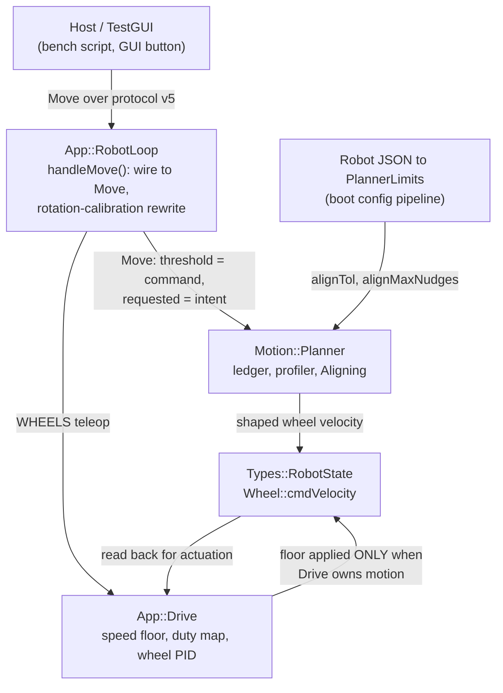

<!-- CLASI: Before changing code or making plans, review the SE process in CLAUDE.md -->

# Sprint 134: Firmware-side tour closure: intent ledger, terminal fine-align, and the speed-floor fix

## Goals

**Make the robot close the square tour by itself.** Today a host script
achieves it and the firmware cannot. This sprint moves that correction into
the robot and proves it on `tovez`.

The single governing measurement, from
[`docs/bench-reports/motion-planning-lab-2026-08-04.md`](../../../docs/bench-reports/motion-planning-lab-2026-08-04.md)
(47 bench runs, committed `85e1339b`) — the source of truth for this entire
sprint, and the document every ticket cites rather than re-deriving:

| arm | closure |
|---|---|
| planner sequential, no correction (**today's firmware**) | **64.1 mm** |
| planner + the same correction grafted on host-side | 9.4–11.5 mm |
| planner + graft, best arm (post-battery-swap) | **7.3 ± 3.6 mm** |

Nothing in firmware changed between those rows. The gap is entirely a
per-corner heading correction the host was doing and the robot was not.

**Minimality is a stakeholder directive, not a preference** (2026-08-04): "Keep
it minimal. All we want to do to get to this sprint is to get it to be able to
complete the tour on the play field. Don't put a lot more in there other than
getting this to do the square tour." Five tickets, the last explicitly
droppable. Anything not on the critical path to firmware-only tour closure was
excluded — see Out of Scope, which names the rejected candidates and the
measurement that rejected each.

## Problem

Three defects compound into the 64 mm number, and they must be fixed in
dependency order.

**1. The ledger re-anchors instead of repaying.** `App::RobotLoop::handleMove()`
(`src/firm/app/robot_loop.cpp:272-286`) rewrites `Motion::Move::threshold` with
the rotation-calibration inversion *before* `Motion::Planner` ever sees the
Move. So `threshold` stops meaning "what this Move was asked to turn" — it
becomes an actuation-sized command. Commit `af3ca435` (130-010) hit exactly
this and had to abandon intent-carry for measured-carry; its own comment in
`planner.cpp:645-659` says so. The consequence is that
`carryHeading_ = pose_.heading()` re-anchors every turn to wherever it
happened to stop, so **a residual is never repaid — it becomes the new
truth.** Measured on the sequential planner tour: +1.5 / +5.3 / +6.3 / +10.6°
cumulative drift, 64 mm closure. This is the pending issue
`A-turn-baseline-ledger-ignores-the-preceding-legs-heading-drift.md`.

**2. There is no terminal correction.** The planner's failure mode is precise
and self-cancelling: **+1.55°/corner over-rotation, −1.43°/leg curl-back**
(report §2). Total sweep looks right; the square is skewed. No mechanism
inside the Move ever measures the landing and fixes it.

**3. The speed floor makes terminal authority undeliverable.**
`App::Drive::applySpeedFloor()` (`src/firm/app/drive.cpp:293`) boosts *any*
sub-floor wheel pair up to `v_min` (20 mm/s on `tovez`). That is correct for a
standing teleop command below breakaway, and wrong for a deliberately-dying
profile tail or a low-speed alignment nudge — both get boosted into a motion
they were shaped not to make. Deferred from sprint 131 (Design Rationale
Decision 4); **both** independent bench sessions hit it today (report §5.3).

## Solution

Three firmware changes, one bench gate, one optional GUI button.

1. **Restore the cumulative-intent ledger** by carrying the caller's requested
   angle as its own field on `Motion::Move`, leaving the calibration rewrite
   where it is. The ledger then reads
   `carryHeading_ = baselineHeading + angularDirection(m) * m.requested`
   again — honest by construction, with no new calibration constant.
2. **Gate the speed floor to the teleop path**, so planner-shaped commands
   reach the wheels untouched.
3. **Add an `Aligning` phase to the Move lifecycle**, between profile-complete
   and DONE: compare measured heading against the ledger's cumulative target,
   emit bounded low-speed pivot nudges until the residual is inside
   `align_tol`, then complete. This is the host graft, in firmware.
4. **Prove it on `tovez`** with the already-committed bench script, host
   correction OFF.
5. **(Optional)** a TestGUI square-tour button.

### Why the correction belongs at the corner, not in a calibration constant

The report answers this with a measurement (§7): across a battery swap and
brick power cycle, **the planner's raw pivot delivery moved 88.89° → 90.80°**
— ~1.9° of plant-state sensitivity in the pivot itself. A fixed calibration
cannot track that; a closed-loop terminal correction does not need to. The
post-swap arm, with *less* residual for the trim to absorb, was the best of the
day at 7.3 mm.

### The property that makes an Angle-only correction sufficient

Aligning fires only on Angle Moves, yet it repays **leg** error too. A Distance
leg's intent is *zero heading change*, so the ledger carries its heading
baseline forward unchanged; the leg's −1.43° curl therefore shows up as
residual at the **next corner**, where the align phase drives it out against
the absolute cumulative target. This is exactly why the host graft — which also
only corrected at corners — reached 7.3 mm. Distance-Move alignment is
unnecessary and out of scope.

## Success Criteria

**The gate** (ticket 004), on `tovez`, on the stand, wheels free:

```
uv run python src/tests/bench/planner_square_tour.py --port <tovez> --sequential
```

with `--trim` **OFF** and no `--turn-scale`, must close **≤ 8 mm**. Today that
exact invocation measures 64 mm.

**Honest expectation, recorded up front so the bench result is read correctly.**
The report's typical trimmed-tour band is **8–11 mm** (§1, §3); 7.3 ± 3.6 mm was
the single best arm of the day, measured after a battery swap left less residual
to absorb. The ≤8 mm gate therefore sits at the optimistic edge of the measured
distribution, and §3 is explicit that "**the only road below ~8 mm is a finer
terminal actuator, not a tighter threshold**" — that finer actuator (report
§5.4, sub-breakaway duty-pulse nudges) is deliberately **out of scope** here.

So ticket 004 reports against two bars:

- **Sprint acceptance**: closure ≤ 8 mm. Met → sprint succeeds.
- **Mechanism acceptance**: closure ≤ 12 mm **and** per-corner residual inside
  `align_tol` at ≥90% of corners **and** ≥3× improvement on the 64 mm baseline.

Landing in 8–12 mm with the mechanism demonstrably converging is a **measured
shortfall of the actuator, not a defect of this sprint's design**, and the
correct response is to report it with the per-corner data — *not* to tighten
`align_tol` (measured counterproductive, §3) and not to add a calibration
fudge. Do not churn the tolerance to chase the number.

Additionally:
- Teleop is not regressed: a plain `wheels()` command still receives the
  `v_min` floor (ticket 002 must not disable it for everyone).
- Test baseline is matched **by identity, not count** — see Test Strategy.

## Scope

### In Scope

- `Motion::Move` gains a requested-angle field; the ledger carries intent.
- `Motion::Planner` gains an `Aligning` lifecycle state and two config-sourced
  landing parameters (`align_tol`, `align_max_nudges`).
- `App::Drive::applySpeedFloor()` is gated on Drive owning motion.
- Bench acceptance on `tovez` hardware.
- Optionally, a TestGUI square-tour button.

### Out of Scope — each with the measurement that excluded it

| Excluded | Why |
|---|---|
| Tighter `align_tol` than 1.0° | Report §3: 0.3° vs 1.0° indistinguishable in closure, 3× cost, convergence 93%→64%, some corners get *worse* |
| Sub-breakaway terminal authority (duty-pulse / crawl) | Report §5.4 — the real road below 8 mm, but a new actuation subsystem; excluded by "keep it minimal" |
| `alpha_decel` / turn-decel shaping | Report §4: sim sweep 5→3.5→2.5 moved turn mean 88.55/88.76/88.64° — corner residual is immune |
| Wall-clock trajectory schedules | Report §4: dead on arrival; `profileStep()` already plans from measured remaining |
| `e_shape` shape-error controller | Report §4/§7: wheel tracking already 1.000 ± 0.010; parked pending a loaded run. Its two issue files stay untouched |
| Publishing commanded wheel velocity to telemetry | Report §5.5 — cheap and wanted, but pure observability; not on the critical path |
| Boundary/completion re-sequencing | Report §6: the intent ledger converts boundary bleed from a permanent error into a repaid one, which is why it outranks re-sequencing |
| Moving rotation calibration into `Motion::Planner` | Design Rationale D1 — the expensive half of report §5.1; the cheap half achieves the same ledger honesty |
| Camera/playfield validation | Bench encoder-odometry closure is this sprint's gate; playfield is the stakeholder's own morning run |
| Fixing the known-stale parity tests | `B-gen-boot-config-parity-tests-encode-superseded-literals.md` stays open |

## Test Strategy

**Match the test baseline by IDENTITY, not by count.** Full collection on
`master` is currently **~8 failed / ~1994 passed**. The eight:
`test_move_protocol`, `test_rebaseline_pose_sanity`,
`test_gen_boot_config_planner` (×2), `test_gen_boot_config_robot_groups`,
`test_gui_button_acceptance` (×2), `test_tour_closure_gate`. Several are known-
stale parity tests pinning superseded literals
(`B-gen-boot-config-parity-tests-encode-superseded-literals.md`).

**Expected, legitimate movement in this sprint** — not regressions:

- **Ticket 003** adds two `planner.*` config fields, which *will* move
  `test_gen_boot_config_planner` (its `_EXPECTED_RAW` dict is an exact key-set
  comparison) and `test_gen_boot_config_robot_groups`. Update those expectations
  to the new literals; do not delete assertions.
- **`test_tour_closure_gate`** may move under tickets 001/003. It is a **sim**
  gate, and per report §7 the sim's corner behaviour **sign-flips** vs hardware
  (−1.4° under-rotation in sim, +1.55° over-rotation on `tovez`). Record what it
  does; do not tune firmware to satisfy it.

**The sim cannot gate this work.** Legs and loop dynamics transfer; corners do
not. **Bench is the arbiter for anything corner-related.** Sim tests are run to
detect *collateral* breakage (a leg regression, a lifecycle regression), never
to validate corner accuracy.

Per sprints 132/133 and still in force: **system tests are not required every
ticket, and functionality need not be preserved between tickets — it must work
at the END.** A full run is ~11 min; run it at ticket 003 and ticket 004.

Unit/ctest coverage owed:
- `planner_lifecycle_test` — the `Aligning` transitions, including the nudge
  cap and the timeout backstop firing *through* Aligning.
- `planner_noise_test` — alignment converges under tracking lag; and does not
  regress `testAngleDoesNotUndershootAtCompletionUnderSevereTrackingLag`
  (130-010's own guard).
- A Drive-level test that a planner-owned sub-floor command passes through
  while a teleop sub-floor command is still boosted.

## Architecture

**Sizing: Substantial/structural.** Four modules change (`src/motion/planner`,
`src/firm/app`, the config generation pipeline under
`src/protos`/`src/scripts`/`src/firm/config`, and host-side
bench/GUI), the planner's Move lifecycle state machine gains a state, a new
config→`PlannerLimits` data path is added, and the speed floor's
responsibility boundary moves. Full methodology, diagrams, and full
self-review apply.

### What Changed

**1. `Motion::Move` carries intent alongside command.** A new field records
what the caller *asked for*, distinct from `threshold`, which upstream may
rewrite into an actuation-sized command. `Move` becomes a record with two
readers that want different things: the **profiler** wants the command, the
**ledger** wants the intent.

**2. `Motion::Planner`'s ledger returns to intent-carry.** For a completed
Angle Move, `carryHeading_ = active_.baselineHeading + angularDirection(m) *
m.<requested>` instead of `pose_.heading()`. Distance carry is unchanged
(intent: zero heading change). This restores the property 130-010 had to give
up, without reintroducing the bug it was avoiding — because the operand is now
genuinely the intent.

**3. `Motion::Planner` gains a terminal `Aligning` lifecycle state.** **Twist**
Angle Moves only — the same guard the existing `arrived` event uses
(`planner.cpp:494-498`), because the ledger's `carryValid_` is itself gated on
`VelocityKind::Twist` and a Wheels-velocity Move has no heading intent to align
against. Between profile-complete/arrived and reporting completion, the
planner compares measured heading to the cumulative intent target and issues
bounded low-speed pivot nudges through the ordinary `planWheels()` path,
re-settling between each, until the residual is inside `align_tol` or
`align_max_nudges` is spent. **The completion ack is emitted after alignment**
— a Move is not done until it has landed. The Move's wall-clock `timeout`
backstop is unchanged and still fires from inside Aligning.

**4. `PlannerLimits::Landing` gains `alignTol` and `alignMaxNudges`,** sourced
from the robot JSON through the existing boot-config path. They are landing
parameters, siblings of `settleRestOmega`, and belong in the same struct.

**5. `App::Drive::applySpeedFloor()` becomes conditional on Drive owning
motion.** The floor exists to get a *standing* teleop command past breakaway.
It has no business rewriting a command another owner shaped.

### Move lifecycle — the new state

```mermaid
stateDiagram-v2
    [*] --> Idle
    Idle --> Breakaway: Move activated
    Breakaway --> Tracking: left rest
    Tracking --> Aligning: profile complete / arrived<br/>(Twist Angle Moves only)
    Aligning --> Aligning: residual > align_tol<br/>nudge + re-settle
    Tracking --> Draining: complete (Distance / Time)
    Aligning --> Draining: residual <= align_tol<br/>OR nudges spent
    Draining --> Idle: command reached zero
    Idle --> Stopping: Kind::Stop activated
    Stopping --> Idle: at rest
    Tracking --> Draining: timeout / stall
    Aligning --> Draining: timeout (backstop still fires)
```

The completion ack is emitted on the transition **out of** `Aligning`, not into
it. Every pre-existing completion path (timeout, stall, Distance, Time, Stop) is
untouched — `Aligning` is inserted on exactly one edge.

### Component and ownership view



Dependency direction is unchanged and acyclic: `App::*` → `Motion::*` →
`Types::*`. **No new cross-module dependency is introduced.** In particular
`Drive` needs no knowledge of `Planner`: it already holds `commandActive_`
(exposed as `owns()`, `drive.h:482`), which `takeover()` clears whenever
another subsystem assumes motion. The gate is a read of an existing member.

`src/motion`'s purity rule (`src/motion/DESIGN.md` §3 — no `Config::*`,
`App::*`, or `Devices::*` dependency) is preserved: the two new parameters
arrive as plain floats inside `PlannerLimits`, exactly as
`settleRestOmega` does, via `App::bootPlannerLimits()`
(`src/firm/app/boot_calibration.cpp:53-89`).

### Design Rationale

**D1 — Carry intent as its own field; do NOT move rotation calibration into
the planner.**

*Context*: Report §5.1 offers two routes to an honest ledger: "Move the
calibration to the actuation side, **or** carry intent as its own field." The
sprint brief prescribed the first.

*Alternatives*: (a) Route `rotation_gain`/`rotation_offset` per direction into
`PlannerLimits`, apply the inversion at `activateNext()`, delete the
`handleMove()` rewrite. (b) Add a `requested` field to `Move`, set it in
`handleMove()` before the rewrite, point the ledger at it.

*Choice*: **(b).** Route (a) costs four new constants through the full
config→`PlannerLimits` pipeline — proto, JSON ×3, three hand-written
`gen_boot_config.py` template sites, `config_parity_capi.cpp`'s offset table,
`boot_config.h`, `boot_calibration.cpp`, `planner_types.h`, `capi.cpp`'s flat
offset array, `planner_harness.py`'s ctypes mirror + `_LIMITS_FIELD_PATHS`,
`composition_root_parity_harness.cpp`, and four pinned-literal tests — while
also *changing what the profiler is asked to turn*, which perturbs the
calibration behaviour 125-007 established. Route (b) touches ~5 files, changes
no commanded value, adds no constant, and delivers exactly the property
ticket 003 needs. Under an explicit "keep it minimal" directive with an
overnight execution window, the cheap route that the source-of-truth document
explicitly sanctions is the correct one.

*Consequences*: The "three partial owners of one physical effect" cleanup
(`rotation_gain`, `rotational_slip`, and the bench script's
`--turn-scale 1.0363` — note `1/0.9117 = 1.097 ≠ 1.036`, not even the same
correction) is **not** completed here. Two of the three are collapsed in
effect: ticket 004 stops passing `--turn-scale`, and the terminal align phase
makes the open-loop calibration largely redundant (report §7's 1.9° pivot drift
across a power cycle is precisely what a fixed constant cannot track). The
structural consolidation is deferred, and issue
`B-rotation-calibration-vs-live-heading-hold-gain.md` — which asks whether the
calibration is needed *at all* now — stays open as its natural home.

**D2 — Gate the floor on `Drive`'s own ownership flag, not on a planner query.**

*Context*: `applySpeedFloor()` must distinguish a standing teleop command from
a shaped planner tail.

*Alternatives*: (a) Pass `planner_.active()` into `Drive::tick()`. (b) Gate on
the existing `commandActive_` member.

*Choice*: **(b).** `takeover()` already clears `commandActive_` whenever the
planner assumes motion (`drive.h:153-164`), so the flag is exactly the
predicate wanted and is already correct. (a) would create a new `Drive`→
`Planner` coupling for information `Drive` already holds. **This also avoids
adding a member to `drive.h`** — which per the standing build trap would
require `just build-clean` or encoders read a manufactured zero that looks
exactly like a dead bus.

*Consequences*: The floor's semantics become "the floor is a **teleop**
affordance." Any future non-teleop owner automatically opts out, which is the
right default. The unmanaged-drive host taper documented in
`B-one-owner-per-constant-speed-floor-and-duty-per-speed.md` is untouched.

**D3 — `align_tol` and `align_max_nudges` go in the boot-only `Planner` config
group.**

*Context*: The `Planner` proto message is boot-only; `PlannerShaper` is the
live, re-appliable half (`applyShaperLimits()` is the only live setter).

*Choice*: **boot-only `Planner`**, alongside `settle_rest_omega`, which these
are siblings of.

*Consequences*: **Retuning `align_tol` requires a rebuild and reflash.** This
is an accepted cost, not an oversight: report §3 already swept the tolerance
and found 1.0° optimal, with tighter values *measurably worse*, so this is a
measured constant rather than a bench knob. Adding it to `PlannerShaper`
instead would be semantically wrong (it is not a shaper ceiling) and would
force `applyShaperLimits()`'s signature open, touching every caller.

**D4 — `align_tol = 1.0°`, `align_max_nudges = 6`, taken from measurement.**

Report §3, from 333 per-nudge records on `tovez`: the low-speed corrective
pivot is **bimodal — 26% deliver <0.25° (no breakaway), the rest a median
1.72°** (10th pct 0.63°). A tolerance below that ~1.8° quantum is outside the
mechanism's own authority. 1.0° yields 1.3 nudges/corner, ~2 s/corner, 94%
convergence. Both values match the already-committed bench script's defaults
(`planner_square_tour.py:344-345`), so firmware and the proven host graft agree
by construction.

*(Note: the sprint brief quoted "378 nudges / 29%"; the committed report says
333 nudges / 26%. The report is the source of truth and its figures are used
throughout. The operating point — 1.0° — is identical either way.)*

### Migration Concerns

- **Wire format: unchanged.** No protocol v5 change. The new `Move` field is
  internal to firmware; the host sends the same `Move` it sends today.
- **Config schema: additive.** Two new `planner.*` keys. `gen_boot_config.py`'s
  `_require()` is **fail-closed**, so *every* robot profile that could be
  activated must gain both keys or its build breaks the moment it is selected:
  `tovez.json`, `tovez_nocal.json`, `togov.json`.
- **ABI: `PlannerLimits` grows.** `capi.cpp`'s flat offset array and
  `planner_harness.py`'s ctypes mirror + `_LIMITS_FIELD_PATHS` must be extended
  **in the same order**, or the harness's own offset guard fails. Append at the
  end of `Landing`. `align_max_nudges` as `int32` keeps the 4-byte stride, so
  no padding is introduced.
- **`Motion::Move` grows.** `planner_harness.py:149`'s `Move` ctypes mirror must
  gain the field in the same position; append at the end.
- **Build traps** (both standing, both cheap to hit): plain `just build`
  compiles the DBG channel **out** — use `uv run python build.py --clean
  --robot-debug`. A change to a shared header requires `just build-clean`.
- **Deployment sequencing**: ticket 002 (floor) must land before ticket 003
  (align), or the alignment nudges are boosted to `v_min` and the phase is
  measured against an actuator it does not actually have.
- **No data migration.** No persisted state, no stored tuning schema bump.

### Open Questions

1. **The ≤8 mm gate vs the 8–11 mm measured band.** Stated fully in Success
   Criteria. Resolution is a measurement (ticket 004), not a design change; the
   sprint records the number honestly either way.
2. **Nudge sign and the coast.** A nudge is issued after `settleReached()`, so
   the body is at rest — but the report's §6 boundary finding (next command
   lands in the *same* cycle as the previous DONE ack) means a nudge's own
   settle must be re-confirmed before measuring its effect, or the measurement
   reads a still-moving body. Ticket 003 must re-settle between nudges, not
   just between the profile and the first nudge.
3. **Does `Aligning` interact with a chained/pipelined Move?** This sprint's
   gate is `--sequential`. Aligning holds the Move active, which delays the
   next queued Move; that is correct and intended, but the pipelined path is
   **not** validated here. Ticket 003 should keep Aligning suppressed when
   `activeBoundary_ > 0` (a Move handing off at speed is not supposed to stop),
   matching the existing `arrived` guard.
4. **Heading-hold is off on `tovez`** (`heading_hold_gain = 0.0`), so the
   −1.43°/leg curl is uncorrected during legs and is repaid at the next corner
   by design. If a future profile turns heading-hold on, the interaction with
   Aligning is unexamined — see
   `B-rotation-calibration-vs-live-heading-hold-gain.md`.

## Use Cases

### SUC-001: The robot closes a square tour without host correction
Parent: UC-002 (autonomous bounded motion)

- **Actor**: Bench operator (and, tomorrow, the stakeholder from TestGUI)
- **Preconditions**: `tovez` on the stand, wheels free, firmware built with
  `--robot-debug` and flashed by UID; no host-side trim active.
- **Main Flow**:
  1. Operator runs the square tour sequentially, host correction OFF.
  2. For each of four legs, the robot drives the commanded distance.
  3. For each of four corners, the robot pivots, settles, measures its heading
     against the cumulative intent target, and nudges until inside `align_tol`.
  4. Each Move's completion ack is emitted only after its alignment finishes.
  5. The tour returns to its start pose.
- **Postconditions**: Encoder-odometry closure ≤ 8 mm; per-corner residual
  inside `align_tol`; cumulative heading residual does not grow monotonically
  across corners.
- **Acceptance Criteria**:
  - [ ] `planner_square_tour.py --sequential`, no `--trim`, no `--turn-scale`,
        closes ≤ 8 mm on `tovez`
  - [ ] Per-leg, per-turn, cumulative residual, nudges/corner and wall time are
        reported and archived
  - [ ] Cumulative residual does not show the +1.5/+5.3/+6.3/+10.6° monotonic
        growth of the 64 mm baseline

### SUC-002: A corner repays the residual it inherits
Parent: UC-002

- **Actor**: `Motion::Planner` (internal)
- **Preconditions**: A chained sequence where a preceding leg or turn has left
  a heading residual.
- **Main Flow**:
  1. A completed Angle Move carries `baseline + direction × requested` — its
     *intent* — into the ledger.
  2. A completed Distance Move carries its heading baseline unchanged.
  3. The next Angle Move adopts that carried baseline as its target origin.
  4. Its Aligning phase drives measured heading onto the cumulative target.
- **Postconditions**: A residual is repaid at the next corner rather than
  becoming the new anchor.
- **Acceptance Criteria**:
  - [ ] The ledger carries intent, not `pose_.heading()`, for a completed
        Angle Move
  - [ ] 130-010's Angle profile-complete undershoot fix is preserved and its
        regression test still passes
  - [ ] A ctest demonstrates residual repayment across a chained turn

### SUC-003: Terminal authority is deliverable
Parent: UC-002

- **Actor**: `App::Drive`
- **Preconditions**: The planner owns motion and is commanding a shaped
  sub-`v_min` tail or alignment nudge.
- **Main Flow**:
  1. The planner writes a sub-floor wheel command to `cmdVelocity`.
  2. `Drive` observes it does not own motion and applies no floor.
  3. The command reaches the wheels as shaped.
- **Postconditions**: Planner-shaped commands are delivered unmodified; teleop
  commands still receive the floor.
- **Acceptance Criteria**:
  - [ ] A planner-owned sub-floor command passes through unboosted
  - [ ] A teleop `wheels()` sub-floor command is still boosted to `v_min`
  - [ ] Verified on hardware, not only in test

## GitHub Issues

None.

## Definition of Ready

- [x] Sprint planning document is complete (sprint.md, including its
      Architecture and Use Cases sections)
- [x] Architecture review passed (self-review, recorded)
- [ ] Stakeholder has approved the sprint plan

## Tickets

| # | Title | Depends On |
|---|-------|------------|
| 001 | Carry turn intent on Move and restore the cumulative-intent ledger | — |
| 002 | Gate the speed floor to the teleop path | — |
| 003 | Terminal fine-align phase inside the Move | 001, 002 |
| 004 | Bench acceptance on tovez: firmware-only square-tour closure | 003 |
| 005 | TestGUI square-tour button (OPTIONAL, droppable) | 004 |

Tickets execute serially in the order listed.
