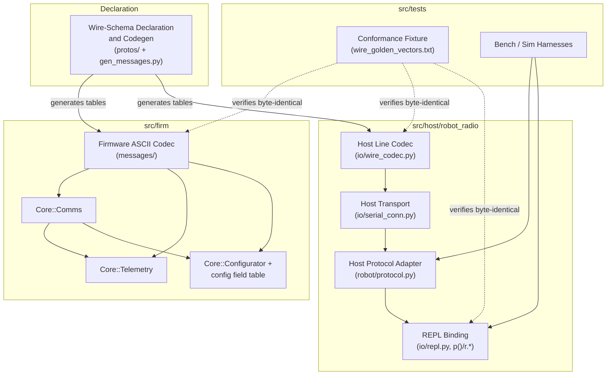

<!-- CLASI: Before changing code or making plans, review the SE process in CLAUDE.md -->

# Sprint 137: Protocol v6 cutover: one ASCII line grammar across firmware, host, and the REPL

## Goals

Replace the firmware/host wire protocol end-to-end with protocol v6: one
ASCII line grammar (`<VERB>[':' field]*'\n'`), no COBS, no CRC, no
protobuf, no binary plane, in both directions. By the end of this sprint
the robot speaks exactly one protocol — the firmware's binary command
plane, its generated protobuf codec, its ack ring, and the nine-way
configuration representation are all deleted, not merely superseded —
and the golden-vector conformance fixture, the radio bench gate, and a
hardware verification pass on `tovez` all prove it works.

## Problem

Protocol v5's wire bytes are already good (measured ~77 B/frame typical,
worst case 126 B), but its *implementation* is not: a 3852-line generator
producing 105 KB of generated C++ for a protobuf feature set nobody uses
(tolerant schema evolution, on a project that ships every rev as an
atomic, rev-locked cutover); a verb plane that grew from a claimed
"four cleartext verbs" to 25 verbs across two planes with load-bearing
parse order; and configuration expressed nine different ways with a
parity checker whose only job is noticing when two of those nine
disagree. None of this buys correctness — every real failure this
project has measured has been packet loss, which a CRC cannot detect
better than the radio hardware and USB CDC already do underneath it.
Full findings: `clasi/issues/protocol-and-implementation-simplification-review.md`.

Separately, two concrete stakeholder requirements cannot be met by any
wire format with a binary plane: (1) a JavaScript client, which has
nothing today and cannot cheaply be given a protobuf codec on
MicroPython or in a browser; and (2) a REPL binding — "when you connect
to the serial port of a MicroPython device, you get the REPL... I don't
want to have to drop into another view of that in order to implement the
protocol" (stakeholder, 2026-08-19). Both requirements point at the same
fix: an all-ASCII wire that is simultaneously human-typable and a valid
Python argument list.

## Solution

Execute the full v6 wire specification
(`clasi/issues/protocol-v6-spec.md`, promoted to `docs/protocol-v6.md`
once this sprint's cutover lands) as one sprint, internally staged so
every ticket leaves the tree buildable and testable:

1. Land `GET`/`SET` (one setter, one getter, driven by a single
   generated 80-row config field table) alongside the existing binary
   config arms.
2. Land the `TLM` subscription (`OFF`/`POSE`/`FULL`/`NOW`/`AUTO`/
   `BUFFER`) and self-describing `thdr:`/`t:` frames alongside the
   existing binary telemetry arm.
3. Land `ok`/`err`/`done` reply lines (3× repeat for loss tolerance)
   alongside the existing ack ring.
4. Execute the atomic cutover: the motion verbs (`MOVE`/`WHEELS`/
   `GOTO`/`STOP`/`ESTOP`/`SEED`/`CAL`) move onto pure ASCII, and
   direction becomes case (`UPPERCASE` commands, `lowercase` replies) —
   firmware and host together, since this is the one genuinely
   wire-breaking step.
5. Build the REPL binding (`p()`/`r.*`) on the host's existing `rogo`
   REPL/serve surface (see Design Rationale — this is a deliberate
   reinterpretation of §10 for a sprint that does not include the
   MicroPython rebuild).
6. Prove conformance: rewrite the golden-vector fixture as ASCII line
   vectors, asserted byte-for-byte by C++, Python, *and* the REPL
   binding.
7. Measure the one number that could invalidate the design (formatting
   cost, §11.2) on real hardware.
8. Delete the binary plane outright: COBS, CRC-16, the protobuf codec,
   the ack ring, `PersistedTuning`, `config_parity_capi`, the
   boot-only/live split, and the nine-way config representation.
9. Migrate bench/sim tooling, rewrite the radio bench gate, verify on
   `tovez`, then promote the doc.

## Success Criteria

- The golden-vector fixture (`src/tests/fixtures/wire_golden_vectors.txt`,
  rewritten as ASCII line vectors) passes byte-for-byte in the C++ suite,
  the Python suite, and a fourth REPL-binding vector set (`p()` output
  byte-identical to the wire form) — this is the primary gate.
- `cyb` (cycle busy) is measured before and after the ASCII telemetry
  cutover on real hardware and reported as a number, not an estimate.
- `radio_bench_gate.py`, rewritten for v6, passes over the relay: banner
  on connect, `HELLO`/`PING`/`ID`/`VER`, `WHEELS` start/stop with
  climbing encoders, `ok` and `done` both observed, the malformed
  counter clear through a clean connect, wire quality within budget.
- The robot deploys to `tovez` (UID
  `9906360200052820a8fdb5e413abb276000000006e052820`) and is seen
  working on the stand per `.claude/rules/hardware-bench-testing.md`'s
  standing gate: every sensor answers, wheels drive with encoders
  climbing in the correct direction, round trip confirmed over both USB
  and the radio relay.
- `GET`/bare `GET` read back every value a `SET` or the robot JSON pushed
  — the configuration-discipline read-back invariant, satisfied
  structurally rather than by convention.
- By the last ticket: no reference to COBS, CRC-16, protobuf codegen,
  the ack ring, or a binary command/reply arm remains reachable from a
  live code path in `src/firm` or `src/host`.
- `docs/protocol-v6.md` exists and `docs/protocol-v5.md` is marked
  superseded, both written only after hardware verification passes.

## Scope

### In Scope

- **C++ firmware** (`src/firm`): `core/` (`Comms`, `Telemetry`,
  `Configurator`), `messages/` (wire schema + new ASCII codec/tables,
  protobuf codec deleted), `config/` (`PersistedTuning`/
  `config_parity_capi`/boot-only-live split deleted; `boot_config.*`
  simplified).
- **Python host** (`src/host/robot_radio`): `io/` (`wire_codec.py`,
  `serial_conn.py`, `repl.py`, `server.py`, `client.py`, `cli.py`),
  `robot/` (`protocol.py`'s `NezhaProtocol`), `config/`
  (`robot_config.py`).
- **`src/protos/`** and **`src/scripts/`**: the schema/codegen source —
  reshaped to emit flat ASCII tables (verb table, 80-row config field
  table, telemetry column tables) instead of a protobuf codec; `gen_pb2.py`
  and the protobuf runtime dependency deleted.
- **Fixtures and tests**: `src/tests/fixtures/wire_golden_vectors.txt`
  (rewritten ASCII), the C++/Python conformance suites, the new
  REPL-binding vector assertion, `src/tests/sim/**` harnesses and their
  hand-maintained `_APP_SOURCES` lists.
- **Bench tooling** (`src/tests/bench/`): scripts touching wire framing,
  ack observation, or telemetry field shape (`tlm_log.py`,
  `twist_drive.py`, `move_protocol_bench.py`, `wire_truth.py`,
  `radio_bench_gate.py`, others as the migration ticket finds them by
  grep).
- **The REPL binding (§10)**: `p()`/`r.*`, built on the host's existing
  `rogo` REPL/serve surface (see Design Rationale) — not a new robot-side
  MicroPython REPL.
- **Docs**: promote `clasi/issues/protocol-v6-spec.md` to
  `docs/protocol-v6.md`; mark `docs/protocol-v5.md` superseded. Dispatched
  to a programmer agent — `docs/` is outside sprint-planner's and
  team-lead's write scope.
- **Configuration-discipline audit**: the five orphan robot-JSON blocks
  (`wheels`, `encoders`, `gripper`, `peripherals`, `perception`) — delete
  what has zero consumer, keep what doesn't.

### Out of Scope

- **JavaScript.** No JS host implementation exists in this repo and none
  is written this sprint. The golden-vector fixture is the enabler that
  makes a *future* JS client verifiable; building that client is
  explicitly deferred.
- **MicroPython.** The MicroPython firmware rebuild
  (`clasi/issues/micropython-first-rebuild.md`,
  `micropython-full-firmware-in-the-image-gates-3-7.md`) is not part of
  this sprint. Both issues stay `pending` and unlinked. This sprint's
  architecture notes (Migration Concerns) the sequencing consequence: v6
  landing first means that rebuild ports ~150 lines of ASCII instead of
  COBS+CRC+protobuf, and its "v5 byte-for-byte compatible" decision is
  superseded — but making that rebuild happen is not this sprint's work.
- **The dormant host motion stack** (`planner/`, `path/`, `nav/`, TestGUI
  tour/turn buttons) — untouched, stays exactly as dormant as it is
  today. Nothing about v6 revives it.
- **Inbound radio command loss** (the single-slot inbound-buffer defect,
  `clasi/issues/later/inbound-command-loss-needs-retransmit-not-a-slower-telemetry-stream.md`).
  v6 is explicitly not sold as a fix for this — it is a separate,
  untouched issue.
- **A new arc/segment motion vocabulary, trajectory profiles, or plan
  dumps.** The protocol stays "bounded velocity commands in, timestamped
  measurements out," per spec §12.

## Test Strategy

- **Conformance is the spine.** Every additive ticket (001-010) that
  introduces or changes a wire shape adds or extends golden vectors;
  ticket 011 makes that fixture the single byte-for-byte gate across
  C++, Python, and the REPL binding.
- **Per-ticket: a fast, scoped smoke test** — the specific sim/unit tests
  and, where the ticket claims it, a short bench-script run. The full
  `uv run python -m pytest` runs once, at sprint close.
- **A test baseline needs `version_generated.h` generated first**
  (`build.py`/`gen_version.py`) — a pristine tree otherwise produces
  ~23 phantom failures. Any ticket capturing a "before" baseline (ticket
  001's config-table smoke test, ticket 012's formatting-cost baseline)
  generates first.
- **New firmware `.cpp` files go into every hand-maintained source
  list**, not just CMake — several `src/tests/sim/**/test_*.py` files
  carry their own `_APP_SOURCES` list and compile a throwaway binary
  directly. Tickets 001 and 008 (the two tickets adding new firmware
  translation units) must `grep -rn "<sibling .cpp>" src --include=*.txt
  --include=*.py` to find every list at once.
- **Hardware is not optional.** This sprint touches the command
  protocol, so `.claude/rules/hardware-bench-testing.md`'s standing gate
  applies: tests alone do not close it. Ticket 012 (formatting cost) and
  ticket 016 (final verification) are both on-hardware, on `tovez`, by
  UID.
- **Clean build before any hardware verification** — an incremental
  build after a shared-header change (this sprint touches
  `messages/envelope.h`/`commands.h` repeatedly) produces a HardFault
  that looks like power loss, and incremental `build.py` ships a stale
  version string. `--clean` before tickets 012 and 016.

## Architecture

**Sizing: Substantial.** This sprint touches far more than three
modules (`core/`, `messages/`, `config/`, `src/protos`, `src/scripts`,
and the host's `io/`/`robot/`/`config/`), introduces a new cross-module
generation dependency (one flat-table generator feeding both firmware
and host, replacing per-language protobuf codegen), removes an external
dependency (the protobuf runtime, both sides), and changes the data
model for configuration (nine representations collapse to one generated
table). It gets the full 7-step methodology and the full five-category
self-review, diagrams included.

### Step 1 — Understand the problem

Restated from Problem/Solution above: the wire bytes are already good;
the *codec, verb-plane, and configuration implementation* are not, and
two hard stakeholder requirements (JavaScript, a REPL binding) are
unreachable with any binary plane. The fix is documented in full in
`clasi/issues/protocol-v6-spec.md`; this sprint executes it as one
cutover, internally staged so every ticket leaves a green, testable
tree, per this project's own "sprint end must be testable" convention
and the scope decision that the sprint must not end with two protocol
planes alive.

### Step 2 — Responsibilities this sprint introduces or changes

- **Wire-schema declaration and codegen** (currently `src/protos/*.proto`
  + `src/scripts/gen_messages.py`, protobuf-codec-generating): changes to
  "declare the verb table, the 80-row config field table, and the
  telemetry column tables once; generate matching C++ and Python data
  tables." This is the one responsibility that must not fork into two
  hand-maintained copies — that is the exact drift class
  (`pid.kff → kaff`) the review's F4 names.
- **Firmware ASCII line dispatch** (currently `Core::Comms`, COBS+CRC+
  protobuf-oneof-based): changes to "parse one `\n`-terminated ASCII
  line, look up its verb case-sensitively, dispatch by direction and
  arity." Absorbs `GET`/`SET`, `TLM` subscription control, the
  `ok`/`err`/`done` reply lines, and the motion verbs into one uniform
  grammar — no more per-verb framing decision.
- **Firmware telemetry assembly** (currently `Core::Telemetry`,
  packed-`sint32`/zigzag + always-on debug tail): changes to "emit
  `thdr:`/`t:` ASCII lines sized to the active subscription mode
  (`POSE`/`FULL`), self-describing, no schema needed by the reader."
- **Firmware configuration** (currently `Config::Robot` +
  `PersistedTuning` + `config_parity_capi` + the boot-only/live gating
  table): changes to "one generated field table; `SET` looks up,
  bounds-checks (NaN before range), and applies now-or-next-boot; `GET`
  prints." The boot-baked-from-JSON path (`Config`/`boot_config.*`) is
  unchanged in kind — configuration still arrives baked by default — but
  loses its separate live-tuning schema and its parity checker, because
  there is only one representation to check for parity against itself.
- **Host ASCII line codec** (currently `io/wire_codec.py`,
  COBS+CRC+protobuf): changes to "encode/decode one ASCII line" — pure
  bytes-in-line-out, no transport knowledge, mirroring the firmware's own
  codec/transport split (self-review finding, see below: an earlier
  draft of this section folded this together with transport delivery
  into one module; split out for cohesion).
- **Host transport** (currently `io/serial_conn.py`): unchanged
  responsibility ("deliver whole lines over serial, UDP, or the radio
  relay"), now calling the ASCII codec instead of the COBS+CRC one.
- **Host protocol adapter** (`robot/protocol.py`'s `NezhaProtocol`):
  changes to build ASCII lines instead of `CommandEnvelope`/
  `ReplyEnvelope` messages; `TLMFrame` becomes a `thdr:`/`t:` zip instead
  of a decoded protobuf message.
- **REPL binding** (new, host-side — see Design Rationale): `p(line)`
  prints reply lines and returns `None`; `r.*` is a thin ergonomic
  wrapper over the same `NezhaProtocol` table. `TLM:BUFFER` is this
  responsibility's own telemetry-handling policy (accumulate, don't
  push) — distinct from the push-by-default policy radio/UDP transports
  keep.
- **Conformance** (`src/tests/fixtures/wire_golden_vectors.txt` + its
  C++/Python/REPL harnesses): changes from validating COBS+CRC+protobuf
  composition to validating ASCII line composition across three
  implementations of the same table.

### Step 3 — Modules

| Module | Purpose (one sentence) | Boundary | Serves |
|---|---|---|---|
| **Wire-Schema Declaration & Codegen** (`src/protos/`, `src/scripts/gen_messages.py`, reshaped) | Declares the verb table, the 80-row config field table, and the telemetry column tables once, and generates the matching firmware and host data tables. | Inside: the flat-table declarations and the generator. Outside: any wire-format *encoding* logic (that's the codec modules below) — this module only produces data tables, never touches bytes. | SUC-001, SUC-002, SUC-006 |
| **Firmware ASCII Codec** (`src/firm/messages/`, new files alongside the existing generated structs) | Formats and parses one `<VERB>[:field]*\n` line against the generated tables, with no heap and no `std::string`. | Inside: `snprintf`/`strtol`/`strtof`-based line format/parse, bounded to `char[240]`. Outside: verb *semantics* (that's `Core::Comms`) and schema declaration (that's the codegen module above). | SUC-001, SUC-002, SUC-003, SUC-006 |
| **Core::Comms** (`src/firm/core/comms.{h,cpp}`) | Dispatches one parsed ASCII line to the right firmware handler by verb, case, and arity. | Inside: verb lookup, direction/case enforcement, the relay control-plane carve-out, `ok`/`err`/`done` emission. Outside: telemetry assembly, config apply, motion execution — Comms calls into those, never duplicates their logic. | SUC-001, SUC-003, SUC-005 |
| **Core::Telemetry** (`src/firm/core/telemetry.{h,cpp}`) | Assembles and emits `thdr:`/`t:` frames sized to the active `TLM` subscription mode. | Inside: `RobotState` → ASCII column projection, mode-driven column selection. Outside: transport delivery (Comms/the transports own that). | SUC-002 |
| **Core::Configurator + config field table** (`src/firm/core/configurator.{h,cpp}`, `src/firm/config/`) | Applies a `SET`/reads a `GET` against the one generated field table, now-or-next-boot. | Inside: lookup, bounds/NaN check, apply-or-store. Outside: the boot-baking path (`Config::default*()`) stays a separate, unchanged responsibility — this module governs post-boot tuning only. | SUC-001 |
| **Host Line Codec** (`src/host/robot_radio/io/wire_codec.py`, rewritten) | Encodes/decodes one ASCII line — bytes in, line out, and back. | Inside: line composition/parsing only. Outside: transport delivery (a separate module, below) and verb semantics (`NezhaProtocol`). | SUC-001, SUC-002, SUC-003, SUC-006 |
| **Host Transport** (`src/host/robot_radio/io/serial_conn.py`) | Delivers whole lines over serial, UDP, or the radio relay. | Inside: the byte stream, reconnection/banner handling, transport selection. Outside: line composition (calls the Line Codec) and verb semantics. | SUC-001, SUC-002, SUC-003, SUC-006 |
| **Host Protocol Adapter** (`src/host/robot_radio/robot/protocol.py`'s `NezhaProtocol`) | Builds and parses typed verb calls (`move`, `get`, `set`, `stop`, `estop`, …) over the ASCII codec. | Inside: the typed Python surface every host caller (bench scripts, TestGUI, MCP tools, REPL) uses. Outside: byte-level framing and delivery (delegates to the Line Codec / Transport). | SUC-001, SUC-002, SUC-003, SUC-005 |
| **REPL Binding** (new: `src/host/robot_radio/io/repl.py` extended + a thin `r.*` wrapper) | Gives an interactive host session `p(line)`/`r.*` access to the same verb table, with buffered (not pushed) telemetry. | Inside: `p()`'s print-not-return contract, `r.*`'s ergonomic wrapper, `TLM:BUFFER` accumulation/drain. Outside: the underlying wire calls (delegates to `NezhaProtocol`). | SUC-004, SUC-006 |
| **Conformance Fixture** (`src/tests/fixtures/wire_golden_vectors.txt` + harnesses) | Proves the firmware codec, host codec, and REPL binding produce byte-identical wire output from one shared vector set. | Inside: vectors and the three assertion harnesses. Outside: nothing — this module only verifies, never implements, the wire. | SUC-006 |
| **Bench/Sim Harnesses** (`src/tests/bench/`, `src/firm/platform/host/`) | Exercise the live protocol end-to-end, on the sim and on real hardware. | Inside: scenario scripts and the sim ABI's wire-facing calls. Outside: the protocol implementation itself. | SUC-003, SUC-007, SUC-008 |

### Step 4 — Diagram

A component diagram is warranted: this sprint introduces a genuinely new
cross-module dependency (one generator feeding two languages' data
tables, replacing two independent per-language protobuf codegens) and
removes an external dependency (the protobuf runtime) on both sides — a
sentence alone doesn't make that composition clear.

`COMMS --> TLM`/`COMMS --> CFG` are drawn at the responsibility level —
Comms's own dispatch decision is what routes a `TLM`/`GET`/`SET` verb to
Telemetry/Configurator. The literal call path still goes through
`RobotLoop` (unchanged this sprint, so omitted as a node: its own
per-cycle scheduling responsibility isn't touched by v6), the same way
`RobotLoop::takeCommand()` already mediates every subsystem dispatch
today. `Comms`'s one real direct dependency on `Telemetry` — reading
`flags`/`tlmMode` for the `STATUS` reply, via an explicit `const
Telemetry&` parameter — is pre-existing (`core/DESIGN.md`'s own
`updateStatus()` note) and unchanged by this sprint; it is a narrow,
forward-declared coupling, not a header cycle, and untangling it is out
of this sprint's scope.

No ERD: the configuration change (nine representations → one table) is a
schema *consolidation*, not a relational structure — the "before/after
representations" table in the review (F4) already communicates it more
directly than an entity-relationship diagram would. No separate
dependency-direction diagram beyond the component graph above: the one
dependency-direction change (both languages' codegen now shares one
upstream declaration instead of two independent generators) is fully
shown by the `SCHEMA -->` edges.

### Step 5 — What changed / why / impact / migration

**What changed.** Every module in Step 3's table either has new
responsibility (Wire-Schema Codegen, Firmware/Host ASCII Codecs, REPL
Binding) or has a responsibility deleted from it (Comms loses binary
frame decode; Telemetry loses packed-scale + always-on debug tail;
Configurator loses the boot-only/live split and its parity checker
against a second representation). `src/protos/`'s files that existed
purely to declare protobuf *messages* for the wire
(`envelope.proto`, `commands.proto`'s binary half, most of
`robot_config.proto`, `telemetry.proto`, `drivetrain.proto`,
`motor.proto`, `sensors.proto`, `communicator.proto`, `gripper.proto`,
`odometer.proto`) either shrink to declaring the three flat tables above
or are deleted — see ticket 013 for the exact deletion list, drawn
directly from the review's R1-R4 "deletes" bullets.

**Why.** Stated in Problem/Solution: the binary plane buys nothing this
project uses (no tolerant schema evolution across independently
versioned endpoints — every rev ships rev-locked) and blocks two hard
requirements (JavaScript, the REPL binding). The ASCII wire is provably
no worse on bytes once telemetry defaults to `POSE` (review F8: ~38 B
vs ~77 B typical) and removes ~3500+ lines of generator/parity/
persisted-tuning machinery (review R4) plus the 105 KB generated codec
(review F1/R1).

**Impact on existing components.**

- `Core::Comms`/`Core::Telemetry`/`Core::Configurator` — rewritten
  dispatch/assembly/apply, same responsibilities at the orchestration
  level (Step 3), no change to `RobotLoop`'s own schedule or bus
  ownership.
- `src/firm/messages/` — the generated protobuf structs/codec
  (`wire.{h,cpp}`, most of the per-proto headers) are deleted; the
  hand-written `wire_runtime.{h,cpp}` shrinks (COBS/CRC/varint/zigzag
  removed) but is not deleted outright — see ticket 013's note on the
  unrelated debug harness that still calls `base64Encode`/`Decode`.
- `src/firm/config/` — `PersistedTuning` and `config_parity_capi` are
  deleted outright; `boot_config.{h,cpp}` stays (boot-time baking from
  the robot JSON is unchanged in kind, per
  `.claude/rules/configuration-discipline.md`'s production-boot rule).
- `src/host/robot_radio/io/wire_codec.py` (Line Codec),
  `io/serial_conn.py` (Transport), and `robot/protocol.py` — rewritten
  around the ASCII codec; `TLMFrame`'s public shape (the properties bench
  scripts and TestGUI read: `.pose`, `.otos`, flag accessors) is
  preserved where the same information still exists in `POSE`/`FULL`,
  changed where it doesn't (the always-on debug tail's fields have no
  `FULL`-mode equivalent unless a live consumer needs them — ticket 004
  audits this against the review's F7 consumer table before dropping
  anything with a real caller).
- `rogo` (`io/cli.py`, `io/server.py`, `io/client.py`) — internal wire
  calls move to ASCII; the daemon's own TCP-socket-to-local-clients
  protocol (newline-delimited text/JSON) is unaffected in shape, only in
  what it calls underneath.
- TestGUI (`testgui/binary_bridge.py`) — calls `NezhaProtocol` methods by
  name, not by wire shape; expected to need no interface change, only to
  keep working once those methods' internals speak ASCII.
- The dormant host motion stack (`planner/`, `path/`, `nav/`) — no
  impact; still dormant, untouched.
- `data/robots/*.json` — no content change. Field names are carried
  verbatim from v5's `robot_config.proto` into the v6 field table (spec
  §7.3), so no robot JSON, bench script, or note needs rewriting for a
  renamed key.

**Migration concerns.**

- **No data migration.** `PersistedTuning` lived only in flash, and this
  sprint's hardware verification (ticket 016) requires a `--clean` full
  reflash anyway — there is nothing to carry forward across the cutover.
  A robot re-flashed with v6 firmware boots from its JSON exactly as it
  always has; any prior live-tuned-and-persisted value is gone, which is
  the same outcome a bench engineer already gets from any clean reflash
  today.
- **Banner case break.** The `HELLO` reply verb lowercases from
  `DEVICE:` to `device:` (spec §4.1). Since firmware and host cut over
  together in tickets 008/009 with no intermediate mixed-version
  deployment expected on this project's single-robot bench fleet, a
  full one-release case-insensitive compatibility shim is not required
  — but `serial_conn.py`'s banner classifier is kept case-insensitive as
  a cheap defensive measure (costs nothing, catches a stale client).
  `mbdeploy`'s ROLE column keys on the `NEZHA2` field text, not the
  verb, so it is unaffected either way.
- **Deployment sequencing.** Tickets 001-007 land additively (old and
  new verbs coexist); tickets 008-009 are the one genuinely
  wire-breaking pair and must land back-to-back with nothing else
  interleaved, since the host cannot talk to firmware between them.
  Ticket 013 (deletion) only runs after ticket 011 (conformance) proves
  the replacement complete.
- **MicroPython sequencing** (informational, not this sprint's work): once
  this sprint lands, `clasi/issues/micropython-first-rebuild.md`'s
  "v5 byte-for-byte compatible" decision is superseded — that future
  rebuild should target v6 instead, porting ~150 lines of ASCII rather
  than COBS+CRC+a protobuf subset. Noted in the promoted
  `docs/protocol-v6.md`; the two MicroPython issues themselves stay
  `pending` and unlinked from this sprint, per scope decision 6.

### Design Rationale

**Decision 1 — execute all four of spec §13's migration stages inside
one sprint, as internal ticket groups, rather than across multiple
sprints.**
*Context:* spec §13 and the review's §5 both describe a staged rollout;
the stakeholder's standing preference (recorded project-wide) is to gut
decisively once a replacement is proven, and this sprint's own scope
decision forbids ending with two protocol planes both live.
*Alternatives considered:* (a) one sprint per stage, carrying the binary
plane across sprint boundaries between them; (b) a single flag-day
ticket with no internal staging at all.
*Why this choice:* staging inside one sprint keeps the safety property
staging exists for (each stage's own tests catch a regression before
the next stage builds on it) without paying (a)'s cost of a
binary-plus-ASCII plane surviving between sprints, and without (b)'s
risk of one enormous, hard-to-review, all-or-nothing change.
*Consequences:* more tickets (17) than a single rewrite would need;
every one of them leaves the tree buildable and independently
testable, and the one truly breaking step (motion verbs + case flip) is
isolated to exactly two adjacent tickets instead of touching everything
at once.

**Decision 2 — generate the config-field and telemetry-column tables
from one retained declaration, rather than hand-typing independent
firmware and host copies.**
*Context:* the review's F4 root-causes a real, already-shipped bug
(`pid.kff` silently drifting from `kaff`) to "a hand-maintained name
vocabulary sitting beside the thing it set" — two copies free to drift.
*Alternatives considered:* hand-write both tables independently (less
generator machinery to keep alive, but reintroduces exactly that drift
class); keep full protobuf-based generation (rejected already by this
sprint's scope decision).
*Why this choice:* one generated source preserves the "no second copy to
drift from" property invariant, at the cost of keeping a generator
alive — but a much smaller one than today's (a lint-sized flat-table
emitter, not a nine-`FieldKind` protobuf-wire-format walker).
*Consequences:* `src/scripts/gen_messages.py` is reshaped, not deleted —
ticket 001 owns the exact new declaration syntax (a decision left open
below, since it is implementation detail, not architecture).

**Decision 3 — the REPL binding (§10) is implemented on the host's
existing `rogo` REPL/serve surface, not as a robot-side MicroPython
REPL.**
*Context:* spec §9's transport table frames "MicroPython REPL" as the
eventual robot-side surface reachable over serial; this sprint's scope
decision 6 explicitly excludes the MicroPython firmware rebuild.
*Alternatives considered:* defer the whole REPL-binding ticket to the
future MicroPython sprint (rejected — the sprint task explicitly lists
"the REPL binding (§10)" as in scope for *this* sprint); build a
from-scratch new REPL rather than extending `rogo repl`/`rogo serve`
(rejected — `rogo serve` already solves "hold the port open, share the
robot between programs," which is exactly what a REPL binding needs and
duplicating it buys nothing).
*Why this choice:* `rogo`'s existing host-side REPL surface already
gives an interactive Python prompt talking to the real robot over the
real transport; §10's `p()`/`r.*` contract formalizes what `rogo repl`
already approximates rather than describing a new subsystem.
*Consequences:* the §11.3 fourth vector set (byte-identical `p()`
output) is verified against the *host's* REPL, not a robot-embedded one.
When the MicroPython rebuild eventually happens, its own on-robot REPL
binding is new work for that sprint — but the wire format it binds to
is already proven identical by this sprint's shared conformance fixture,
so that future work is a binding exercise, not a protocol design
exercise. **This is a genuine reinterpretation of an ambiguous part of
the source spec and is flagged to the stakeholder in this sprint's
report** rather than silently assumed.

A second consequence, caught in this document's own self-review: spec
§6.1/§10.4 describe `TLM:BUFFER` as *firmware* behavior — "the control
loop appends frames to a bounded deque and prints nothing" — which
presumes a robot-side REPL that this sprint does not build. With the
REPL host-side instead, there is no robot-side "don't print" to
implement: the firmware's job stays exactly what it is for `POSE`/
`FULL` (push frames over the transport unconditionally); accumulate-
don't-print is entirely a *host*-side REPL-binding policy (ticket 010
buffers received frames client-side and drains them via `r.frames()`).
Ticket 004/008 accept `BUFFER` as a valid wire token (so the fixture and
a future MicroPython robot both have a stable value to target) but the
C++ firmware treats it identically to `POSE` — it has no different
behavior to offer without an on-robot REPL to serve. This is a scoped
implementation note for tickets 004 and 010, not a further architectural
split.

**Decision 4 — promote `docs/protocol-v6.md` and mark
`docs/protocol-v5.md` superseded as the sprint's final ticket, after
hardware verification, not immediately after the four migration stages
finish landing.**
*Context:* the task instructions say "promote when §13 completes, not
before"; `docs/protocol-vN.md` is reserved for "shipped wire truth"
(the spec's own appendix).
*Alternatives considered:* promote immediately once the deletion ticket
(013) lands — the most literal reading of "§13 completes."
*Why this choice:* "shipped" reads more naturally as hardware-proven
than merely code-complete, and this project's own standing rule treats
on-hardware verification as the acceptance gate for any protocol-touching
sprint — documenting a design before it has been proven on the stand
risks a doc that has to be walked back.
*Consequences:* one extra ticket-ordering step (docs after hardware
verification instead of right after deletion); no functional cost.

**Decision 5 — skip repairing `docs/protocol-v5.md`'s seven documented
drift points (review R5) as an early, standalone step.**
*Context:* R5 recommends fixing the v5 doc first, so the cutover has a
truthful baseline to diff against; the review's own §5 sequences it as
step 1.
*Alternatives considered:* do the repair as an early ticket (cheap per
the review, but non-zero).
*Why this choice:* `docs/protocol-v5.md` is marked superseded by this
same sprint's final ticket regardless of whether it is repaired first —
repairing a doc that is about to be retired duplicates effort this
sprint's own architecture work and the promoted v6 doc already deliver.
*Consequences:* v5's doc stays stale (as documented in its own appendix
and this sprint's linked issues) until superseded in ticket 017; nobody
mid-sprint is misled by it who wasn't already warned.

### Step 7 — Open questions

- **Exact declaration syntax for the shared table generator** (trimmed
  `.proto`-style IDL vs. a lighter declarative format) — left to
  ticket 001's implementation; not architecturally load-bearing either
  way, since the property that matters (one declaration, two generated
  outputs) holds regardless of syntax.
- **Whether `.claude/rules/hardware-bench-testing.md`'s protocol-v5-
  specific bench-flow table needs a full rewrite in this sprint or a
  fast-follow.** It documents `config()`/`otos_config()` ack-ring
  specifics that go stale once ticket 013 lands. Flagged to the
  stakeholder/team-lead rather than silently expanded into this
  sprint's scope, since it's a process doc, not source the design-doc
  validator gates.
- **Whether Design Rationale Decision 3's host-side REPL-binding
  interpretation matches stakeholder intent.** The source spec's prose
  reads as a robot-side MicroPython REPL; this sprint's own scope
  decision forces a reinterpretation. Flagged explicitly in this
  sprint's report to the team-lead.
- **Whether `src/protos/*.proto` files should be deleted outright or
  retained (trimmed) as the surviving human-readable IDL for the
  generator** — a ticket 001/013 boundary call that doesn't affect
  ticket sequencing either way; left to those tickets' own
  implementation plans.

## Use Cases

Substantial sprint — full use cases, sized to the sprint's own scope
(sprint-level `SUC-NNN`, not full product use cases). Every ticket below
traces to at least one; every one of these is covered by at least one
ticket.

### SUC-001: Bench engineer tunes one config field at a time, with a structural read-back guarantee
Parent: N/A (protocol-level capability, not a product-level UC)

- **Actor**: Bench/firmware engineer running a tuning sweep on the stand.
- **Preconditions**: Robot connected (USB or relay), boot-baked from its
  robot JSON.
- **Main Flow**:
  1. Engineer pushes `SET:<group>.<field>:<value>` for one field.
  2. Firmware validates (NaN before range), applies now-or-next-boot,
     replies `ok:<id>` or `err:<id>:<code>`.
  3. Engineer reads back via `GET:<group>.<field>` (never trusts the
     `ok` alone, per `configuration-discipline.md`).
  4. Bare `GET` dumps all 80 fields — the same dump doubles as the
     read-back-vs-file acceptance test and a plain-terminal-readable
     config listing.
- **Postconditions**: The robot's live value matches what `GET` reports;
  nothing in the robot JSON is silently unreachable (the five orphan
  blocks are audited, not left stale).
- **Acceptance Criteria**:
  - [ ] `SET` on a live field takes effect immediately; `SET` on a
        boot-only field is stored and reported by `GET` even before a
        reboot.
  - [ ] `SET` with a non-finite value is rejected `ERR_BADARG`, checked
        before range (`ERR_RANGE`), matching spec §7.1's ordering.
  - [ ] Bare `GET` returns all 80 declared fields, one line each.
  - [ ] Every field name matches its v5 `robot_config.proto` name
        verbatim (spec §7.3) — no robot JSON needs editing.

### SUC-002: Host subscribes to telemetry sized to its own need
Parent: N/A

- **Actor**: Any host client (bench script, TestGUI, `rogo`).
- **Preconditions**: Robot connected, telemetry mode defaults per
  transport (`POSE` on radio/UDP, `BUFFER` on the REPL).
- **Main Flow**:
  1. Client sends `TLM:<mode>`.
  2. Robot emits a fresh `thdr:` column header, then `t:` data lines at
     the mode's own column count (9 for `POSE`, 30 for `FULL`).
  3. A client that reconnects mid-stream and missed the header sends
     `TLM:NOW` to force one fresh frame.
- **Postconditions**: `tlm_log.py`-style consumers can write a valid CSV
  by construction (header row, then data rows) with no separate schema.
- **Acceptance Criteria**:
  - [ ] `POSE` frames are ~38 B, roughly half of today's binary frame.
  - [ ] A mode change always emits a fresh `thdr:` before the next `t:`.
  - [ ] Both pose sources (encoder odometry, OTOS) ride every frame in
        both modes, per spec §6.3's "divergence is the measurement"
        rationale.
  - [ ] `flags` bit semantics (carried forward from v5 unchanged) still
        decode correctly against the same bit table.

### SUC-003: Host issues a bounded motion command and observes its outcome reliably despite radio loss
Parent: N/A

- **Actor**: Any host client driving the wheels (bench script, TestGUI
  Unmanaged/Managed controls, `rogo`).
- **Preconditions**: Robot `ready` (has cleared `ERR_NOT_CONFIGURED`).
- **Main Flow**:
  1. Client sends `MOVE`/`WHEELS`/`GOTO` with a unique id.
  2. Robot replies `ok:<id>` (enqueued) — 3× repeat.
  3. Robot later replies `done:<id>:<reason>` (`stop` or `timeout`) — 3×
     repeat — when the move actually finishes.
  4. Client halts with `ESTOP` (never `STOP` for a panic path, per
     `.claude/rules/playfield-testing.md`) and confirms the robot
     actually stopped before trusting a single `ESTOP` call.
- **Postconditions**: The client's own outcome-tracking never blocks on
  a single lost frame — the 3× repeat plus first-copy-wins de-dup covers
  the measured ~5% radio loss.
- **Acceptance Criteria**:
  - [ ] A reused id is rejected `err:<id>:11` (`ERR_DUPLICATE_ID`), never
        silently dropped (the v5 footgun this closes).
  - [ ] `ESTOP` never carries an id and is never acked — it cannot queue
        behind anything.
  - [ ] `done`'s `reason` field distinguishes stop-condition-met from
        timeout without inspecting a flags bit.

### SUC-004: Operator drives the robot interactively from one REPL, no second protocol view
Parent: N/A

- **Actor**: Engineer at a terminal, or an on-robot-style program using
  the same `r` object.
- **Preconditions**: Host REPL connected to the robot over serial or the
  relay.
- **Main Flow**:
  1. Operator calls `p("PING")` and sees `pong:<now>` printed verbatim.
  2. Operator calls `r.move(v_x=150, stop_distance=400, timeout=5000)`
     and gets back a plain Python int (the move id).
  3. Operator calls `r.wait(<id>)` and gets `'stop'`/`'timeout'` back.
  4. Telemetry does not need managing: it buffers silently by default;
     `r.frames()` drains it on demand.
- **Postconditions**: No mode switch was needed to go from "type a raw
  wire line" to "call an ergonomic Python method" — both are views onto
  the same underlying table.
- **Acceptance Criteria**:
  - [ ] `p()` prints and returns `None` (never a quoted string a caller
        would have to strip).
  - [ ] `r.*` raises on `err`, returns typed Python values on success.
  - [ ] Telemetry never corrupts the REPL prompt (buffered, not pushed,
        by default on this transport).
  - [ ] `finally: r.estop()` around a driving loop is documented and
        demonstrated, per spec §10.5's safety note.

### SUC-005: A robot on a shared radio channel never mistakes another robot's reply for a command
Parent: N/A

- **Actor**: Any robot on a shared channel (the structural fix, not a
  per-session workaround).
- **Preconditions**: Two or more robots audible on the same radio
  channel/group.
- **Main Flow**:
  1. Robot A emits a `dbg:`/`t:`/any lowercase reply line.
  2. Robot B hears it on the shared channel.
  3. Robot B's verb lookup is case-sensitive; the lowercase line matches
     no registered UPPERCASE command and is silently dropped —
     specifically *not* counted as malformed, since it is a legitimate
     reply, just not addressed to B.
- **Postconditions**: The `DBG:`-echo self-sustaining flood documented
  in `.claude/rules/hardware-bench-testing.md` is closed structurally,
  not merely avoided by keeping the channel private.
- **Acceptance Criteria**:
  - [ ] A lowercase line never increments `malformedCount_`/the
        malformed flag bit.
  - [ ] An uppercase line with an unknown verb still increments it
        (the distinction is direction, not case per se).

### SUC-006: A conformance fixture proves C++, Python, and the REPL binding produce byte-identical wire output
Parent: N/A

- **Actor**: CI / any engineer running the test suite.
- **Preconditions**: The ASCII golden-vector fixture is populated.
- **Main Flow**:
  1. Fixture declares command-in/expected-line-out pairs (and the
     reverse) for every verb.
  2. The C++ harness asserts its encoder/decoder against every vector.
  3. The Python harness does the same.
  4. A fourth vector set asserts `p(line)`'s printed output is
     byte-identical to the corresponding wire-form vector.
- **Postconditions**: Any future JS implementation has a byte-for-byte
  gate to build against, without this sprint writing that client.
- **Acceptance Criteria**:
  - [ ] All three implementations pass 100% of the vector set.
  - [ ] The fixture lives in one file, read by all harnesses — no
        hand-copied per-language vector list (the same anti-drift
        principle as Design Rationale Decision 2).

### SUC-007: An engineer measures the real formatting cost before trusting the design
Parent: N/A

- **Actor**: Firmware engineer, on the stand.
- **Preconditions**: v6 ASCII telemetry live on `tovez`.
- **Main Flow**:
  1. Engineer captures `cyb` (cycle busy) on the last binary-telemetry
     build (baseline).
  2. Engineer captures `cyb` on the ASCII-telemetry build, same
     scenario.
  3. Result is reported as a measured number, not the spec's own
     arithmetic estimate (~100 µs / 0.3% of a 32 ms cycle).
- **Postconditions**: If the number is a problem, a hand-rolled `itoa`
  is a known, scoped fix that doesn't touch the wire design; if it
  isn't, the sprint proceeds with confidence instead of an assumption.
- **Acceptance Criteria**:
  - [ ] Before/after `cyb` both reported, same test scenario, same
        robot.
  - [ ] The comparison is called out explicitly in the sprint's closing
        report — not buried in a ticket's own notes.

### SUC-008: A maintainer verifies the robot still drives correctly after the binary plane is fully deleted
Parent: N/A

- **Actor**: Firmware/host maintainer, final sprint verification.
- **Preconditions**: All prior tickets landed; binary plane deleted;
  bench/sim tooling migrated.
- **Main Flow**:
  1. Clean build, flash `tovez` by UID.
  2. Run the standing bench-gate sequence: every sensor answers
     (encoders, OTOS, line, color), wheels drive both directions with
     encoders climbing in the expected direction, round trip confirmed
     over USB and the relay.
  3. Run the rewritten `radio_bench_gate.py` over the relay.
- **Postconditions**: The sprint's own Success Criteria are met on real
  hardware, not merely in tests.
- **Acceptance Criteria**:
  - [ ] Every check in `.claude/rules/hardware-bench-testing.md`'s
        standing gate passes.
  - [ ] `radio_bench_gate.py` exits 0.
  - [ ] No reachable reference to COBS/CRC/protobuf/the ack ring remains
        in the running image (confirmed by grep against the built
        sources, not assumed from the deletion ticket's diff alone).

## GitHub Issues

(None — this sprint tracks against `clasi/issues/` files, not GitHub
issues.)

## Definition of Ready

Before tickets can be created, all of the following must be true:

- [x] Sprint planning document is complete (sprint.md, including its
      Architecture and Use Cases sections)
- [x] Architecture review passed (or skipped, for changes with no
      architectural impact)
- [ ] Stakeholder has approved the sprint plan

## Tickets

| # | Title | Depends On |
|---|-------|------------|
| 001 | Config field table generator (shared declaration -> firmware + host tables) | — |
| 002 | Firmware `GET`/`SET` ASCII verbs (alongside existing binary config arms) | 001 |
| 003 | Host `GET`/`SET` + configuration-discipline orphan-block audit | 002 |
| 004 | Firmware telemetry column tables + `thdr:`/`t:` assembly + `TLM` subscription verb | 002 |
| 005 | Host `thdr:`/`t:` parsing + `tlm_log.py` simplification | 004 |
| 006 | Firmware `ok`/`err`/`done` reply lines (alongside existing ack ring) | 004 |
| 007 | Host ack observation migrates to line-reading | 006 |
| 008 | Firmware atomic cutover: ASCII-only dispatch, case-direction, motion verbs | 007 |
| 009 | Host atomic cutover: codec, `NezhaProtocol`, `rogo` on pure ASCII | 008 |
| 010 | REPL binding (`p()`/`r.*`, `TLM:BUFFER`) | 009 |
| 011 | Golden-vector fixture rewrite (ASCII) + REPL fourth vector set — primary conformance gate | 010 |
| 012 | Formatting-cost hardware measurement (`cyb` before/after) | 011 |
| 013 | Delete the binary plane (protobuf codec, COBS/CRC, ack ring, persisted-tuning/parity/boot-live-split, orphan proto schema) | 012 |
| 014 | Bench script + sim/test-harness migration to v6 | 013 |
| 015 | Radio bench gate rewrite (`radio_bench_gate.py`) for v6 | 014 |
| 016 | Standing hardware verification on `tovez` | 015 |
| 017 | Docs promotion (`docs/protocol-v6.md`) + supersede `docs/protocol-v5.md` | 016 |

Tickets execute serially in the order listed.
