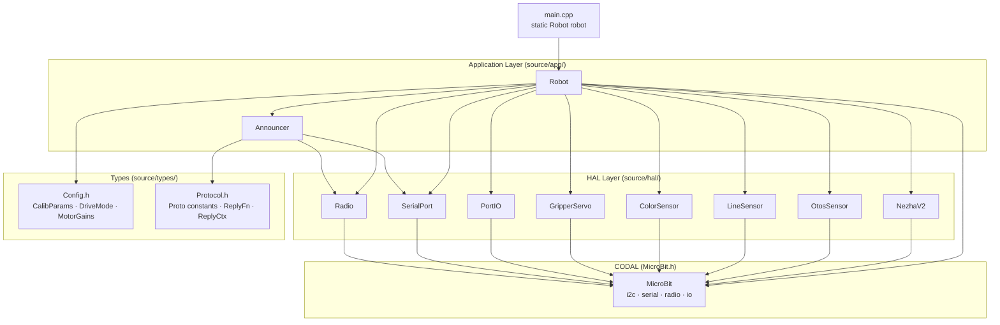

<!-- CLASI: Before changing code or making plans, review the SE process in CLAUDE.md -->

# Architecture Update — Sprint 001: HAL Layer and Project Skeleton

## What Changed

This sprint introduces the entire `source/` directory structure from scratch.
Before this sprint the project had only a placeholder `main.cpp`. After this
sprint the following modules exist and compile:

- `source/types/Config.h` — shared POD structs and enums
- `source/types/Protocol.h` — compile-time string constants and `ReplyFn` type
- `source/hal/NezhaV2.{h,cpp}` — I2C motor driver (Nezha V2, address 0x10)
- `source/hal/OtosSensor.{h,cpp}` — OTOS optical odometry (I2C 0x17)
- `source/hal/LineSensor.{h,cpp}` — 4-channel grayscale line tracker (I2C 0x1A)
- `source/hal/ColorSensor.{h,cpp}` — APDS9960-style RGBC sensor (auto-detects 0x39 vs 0x43)
- `source/hal/GripperServo.{h,cpp}` — servo output on edge connector P1
- `source/hal/PortIO.{h,cpp}` — J1–J4 digital/analog GPIO
- `source/hal/SerialPort.{h,cpp}` — line-buffered 115200 serial (no heap)
- `source/hal/Radio.{h,cpp}` — micro:bit radio, group 10, 4-slot ring buffer
- `source/app/Announcer.{h,cpp}` — boot announcement and HELLO handler
- `source/app/Robot.{h,cpp}` — top-level composer, tick loop owner
- `source/main.cpp` — ~15-line entry point (replaces placeholder)

No control layer, navigation layer, or full CommandProcessor is introduced in
this sprint. Those are deferred to sprints 2–5.

---

## Why

The CODAL build system (`CMakeLists.txt`) uses `RECURSIVE_FIND_FILE` on
`source/`, so simply adding `.cpp` files is sufficient — no CMake edits
required. The sprint goal is a firmware that compiles, boots, and responds
to `HELLO` over serial, proving the foundation is solid before any control
or navigation code is layered on top.

---

## Module Interfaces (C++ Signatures)

### Types (`source/types/`)

**`Config.h`** — Shared POD value types; no includes other than `<stdint.h>`.
Any layer may include it.

```cpp
struct CalibParams {
    float mmPerDegL;       // encoder deg → mm, left wheel  (default 0.487)
    float mmPerDegR;       // encoder deg → mm, right wheel (default 0.481)
    float kFF;             // feed-forward gain              (default 0.15)
    float kScaleLF;        // left-forward scale             (default 1.0)
    float kScaleLB;        // left-backward scale            (default 1.0)
    float kScaleRF;        // right-forward scale            (default 1.0)
    float kScaleRB;        // right-backward scale           (default 1.0)
    float kAdjThreshold;   // slower-wheel adj threshold     (default 0.5)
    float kAdjGain;        // slower-wheel adj gain          (default 0.05)
    float trackwidthMm;    // axle width                     (default 120.0)
    float ratioPidKp;      // ratio PID proportional gain    (default 300.0)
    float ratioPidKi;      // ratio PID integral gain        (default 0.0)
    float ratioPidKd;      // ratio PID derivative gain      (default 0.0)
    float ratioPidMax;     // ratio PID output clamp         (default 30.0)
    float turnThresholdMm; // threshold for turn detection
    float doneTolMm;       // done tolerance for distance/timed commands
};

struct MotorGains {
    float kp;
    float ki;
    float kff;
};

enum class DriveMode : uint8_t {
    IDLE      = 0,
    STREAMING = 1,
    TIMED     = 2,
    DISTANCE  = 3,
    GO_TO     = 4
};
```

**`Protocol.h`** — Compile-time string constants; no includes. Any layer may
include it.

```cpp
// Command prefixes (inbound)
constexpr const char* PROTO_CMD_HELLO = "HELLO";

// Reply prefixes (outbound)
constexpr const char* PROTO_REPLY_DEVICE = "DEVICE:";
constexpr const char* PROTO_REPLY_LOG    = "LOG:";
constexpr const char* PROTO_REPLY_OK     = "OK";
constexpr const char* PROTO_REPLY_ERR    = "ERR:";

// ReplyFn: called with (message, ctx). ctx carries serial-vs-radio and relay flag.
using ReplyFn = void(*)(const char* msg, void* ctx);

struct ReplyCtx {
    bool viaSerial;
    bool viaRadio;
    bool relay;      // true → prepend '<' on radio out
};
```

---

### HAL Layer (`source/hal/`)

**`NezhaV2`**

```cpp
class NezhaV2 {
public:
    explicit NezhaV2(MicroBitI2C& i2c);

    // Set raw PWM duty (-100..100) to both motors simultaneously.
    // Applies LEFT/RIGHT_FWD_SIGN so positive = forward on both wheels.
    void setPwm(int8_t leftPct, int8_t rightPct);

    // Read cumulative encoder as mm. leftWheel selects M2 (left) vs M1 (right).
    // Applies FWD_SIGN and CalibParams::mmPerDegL/R conversion.
    int32_t readEncoder(bool leftWheel, const CalibParams& cal) const;

    // Zero both encoder accumulators on the Nezha V2 chip.
    void resetEncoders();

private:
    MicroBitI2C& _i2c;
    static constexpr uint8_t ADDR         = 0x10;
    static constexpr uint8_t LEFT_MOTOR   = 2;    // M2
    static constexpr uint8_t RIGHT_MOTOR  = 1;    // M1
    static constexpr int8_t  LEFT_FWD     = +1;
    static constexpr int8_t  RIGHT_FWD    = -1;

    void    writeReg(uint8_t reg, const uint8_t* data, uint8_t len);
    int32_t readEncoderRaw(uint8_t motorId) const;
};
```

Constants from `nezha.ts`: M2 = left, M1 = right, LEFT_FWD_SIGN=+1, RIGHT_FWD_SIGN=-1.
The programmer agent must verify the exact I2C register byte layout for motor
PWM write and encoder read against the PlanetX `pxt-nezha2` extension source.

---

**`OtosSensor`**

Register map (from `otos.ts`):
```
REG_PRODUCT_ID         = 0x00  (expected value: 0x5F)
REG_HW_VERSION         = 0x01
REG_FW_VERSION         = 0x02
REG_LINEAR_SCALAR      = 0x04  (signed int8, 0.1% resolution)
REG_ANGULAR_SCALAR     = 0x05  (signed int8, 0.1% resolution)
REG_IMU_CALIBRATION    = 0x06  (write N samples; decrements to 0)
REG_RESET              = 0x07  (bit 0 = reset Kalman tracking)
REG_SIGNAL_PROCESS_CFG = 0x0E  (bits: LUT|Accel|Rotation|Variance; enable all = 0x0F)
REG_SELF_TEST          = 0x0F
REG_OFFSET_XL          = 0x10  (6 bytes: X_L X_H Y_L Y_H H_L H_H, signed int16 LE)
REG_STATUS             = 0x1F
REG_POSITION_XL        = 0x20  (6 bytes)
REG_VELOCITY_XL        = 0x26  (6 bytes)
REG_ACCELERATION_XL    = 0x2C  (6 bytes)
```

LSB conversions: 1 pos LSB ≈ 0.305 mm; 1 heading LSB ≈ 0.00549°.

```cpp
class OtosSensor {
public:
    explicit OtosSensor(MicroBitI2C& i2c);

    bool begin();                         // Returns false if PRODUCT_ID != 0x5F
    void init();                          // setSignalProcessConfig(0x0F), resetTracking()
    void calibrateImu(uint8_t samples);   // Write samples to REG_IMU_CALIBRATION
    void resetTracking();                 // Write 0x01 to REG_RESET

    void getPositionRaw(int16_t& x, int16_t& y, int16_t& h) const;
    void setPositionRaw(int16_t x, int16_t y, int16_t h);
    void getVelocityRaw(int16_t& x, int16_t& y, int16_t& h) const;

    int8_t getLinearScalar() const;
    void   setLinearScalar(int8_t val);
    int8_t getAngularScalar() const;
    void   setAngularScalar(int8_t val);

private:
    MicroBitI2C& _i2c;
    static constexpr uint8_t ADDR = 0x17;
    void    writeReg8(uint8_t reg, uint8_t val);
    uint8_t readReg8(uint8_t reg) const;
    void    readXYH(uint8_t startReg, int16_t& x, int16_t& y, int16_t& h) const;
    void    writeXYH(uint8_t startReg, int16_t x, int16_t y, int16_t h);
};
```

---

**`LineSensor`**

Protocol (from `nezha.ts` `readLineGrays()`): write 1-byte channel index (0–3)
to address 0x1A, then read 1 byte: grayscale 0–255.

```cpp
class LineSensor {
public:
    explicit LineSensor(MicroBitI2C& i2c);
    // Fills out[0..3] with grayscale values. Returns false on I2C error.
    bool readValues(uint16_t out[4]) const;
private:
    MicroBitI2C& _i2c;
    static constexpr uint8_t ADDR = 0x1A;
};
```

---

**`ColorSensor`**

Two-chip detection (from `nezha.ts` `initColor()`):
- Alt chip at 0x43: write 0x81=0xCA, 0x80=0x17; read 0xA4+0xA5×256; non-zero → use alt
- APDS9960 at 0x39: ATIME=252, CONTROL=0x03, enable sequence, set AEN bit

```cpp
class ColorSensor {
public:
    explicit ColorSensor(MicroBitI2C& i2c);
    bool begin();  // Auto-detect chip; returns false if neither responds
    // Fills r,g,b,c with raw 16-bit counts. Blocks ≤250 ms waiting for valid data.
    bool readRGBC(uint16_t& r, uint16_t& g, uint16_t& b, uint16_t& c);
private:
    MicroBitI2C& _i2c;
    bool _isAlt;
    bool _inited;
    void initApds();
    void initAlt();
};
```

---

**`GripperServo`**

CODAL pin API: `MicroBitPin::setServoValue(int degrees)` — range 0–180.

```cpp
class GripperServo {
public:
    explicit GripperServo(MicroBitPin& pin);  // pass uBit.io.P1
    void setAngle(uint8_t degrees);           // clamps to 0..180
private:
    MicroBitPin& _pin;
};
```

---

**`PortIO`**

Pin mapping (from `nezha.ts`):
- Digital (S2): J1→P8, J2→P12, J3→P14, J4→P16
- Analog  (S1): J1→P1,  J2→P2,  J3→P13, J4→P15

```cpp
class PortIO {
public:
    explicit PortIO(MicroBitIO& io);  // pass uBit.io
    void setDigital(uint8_t port, bool high);   // port 1..4
    int  readDigital(uint8_t port) const;       // returns 0, 1, or -1 on range error
    void setAnalog(uint8_t port, uint16_t val); // 0..1023 PWM
    int  readAnalog(uint8_t port) const;        // returns 0..1023 or -1 on error
private:
    MicroBitIO& _io;
    MicroBitPin* digitalPin(uint8_t port) const;
    MicroBitPin* analogPin(uint8_t port) const;
};
```

---

**`SerialPort`**

CODAL serial API used:
- `uBit.serial.setRxBufferSize(N)`, `setTxBufferSize(N)` — before `init()`
- `uBit.serial.init(115200)` — sets baud rate
- `uBit.serial.read(ASYNC)` — returns next byte or MICROBIT_NO_DATA (-1) without blocking
- `uBit.serial.send(ManagedString)` — blocking send

```cpp
class SerialPort {
public:
    explicit SerialPort(MicroBitSerial& serial);
    void begin();  // setRxBufferSize, setTxBufferSize, init(115200)

    // Non-blocking: accumulates bytes; returns true when a complete line is ready.
    // buf is null-terminated; newline stripped. len includes NUL.
    bool readLine(char* buf, uint16_t len);

    void send(const char* msg);
    void sendf(const char* fmt, ...);  // snprintf into 128-byte stack buffer; no heap

private:
    MicroBitSerial& _serial;
    char     _rxBuf[128];
    uint16_t _rxLen;
};
```

---

**`Radio`**

CODAL radio API used:
- `uBit.radio.setGroup(10)` before `enable()`
- `uBit.radio.enable()`
- `uBit.radio.setTransmitPower(7)`
- `uBit.radio.datagram.recv()` returns `PacketBuffer`
- `uBit.radio.datagram.send(const uint8_t*, int)` or `send(ManagedString)`
- `uBit.messageBus.listen(DEVICE_ID_RADIO, MICROBIT_RADIO_EVT_DATAGRAM, handler)`

Ring buffer: 4 slots × 64 bytes = 256 bytes static. ISR handler writes into
the ring; `poll()` reads from it non-blocking. Inbound `>` prefix → strip and
set `isRelayed=true`. Outbound relay → prepend `<`.

```cpp
class Radio {
public:
    explicit Radio(MicroBitRadio& radio, MicroBitMessageBus& bus);
    void begin();  // setGroup(10), enable(), setTransmitPower(7), register ISR

    // Returns true if a packet was available; fills buf; sets isRelayed.
    bool poll(char* buf, uint16_t len, bool& isRelayed);

    // Send msg over radio. If relay=true, prepends '<'.
    void send(const char* msg, bool relay = false);

private:
    MicroBitRadio&      _radio;
    MicroBitMessageBus& _bus;

    static constexpr int SLOTS    = 4;
    static constexpr int SLOT_LEN = 64;
    char    _ring[SLOTS][SLOT_LEN];
    uint8_t _head;
    uint8_t _tail;

    static void onData(MicroBitEvent);  // ISR writes into ring
    static Radio* _instance;           // singleton pointer for ISR callback
};
```

---

### Application Layer (`source/app/`)

**`Announcer`**

Announcement format: `DEVICE:<type>:<name>:<hwName>:<serial>\n`
- `type` = `"Nezha2"` (compile-time constant)
- `name` = `uBit.getName()` — 5-letter device name from nRF52 FICR
- `hwName` = `"microbit"` (constant)
- `serial` = `uBit.getSerial()` — unique serial as decimal string

```cpp
class Announcer {
public:
    Announcer(MicroBit& uBit, SerialPort& serial, Radio& radio);

    // Emit DEVICE: announcement over serial.
    void announce();

    // Returns true if line == "HELLO", re-emits announcement.
    // Returns false if the line is not HELLO (caller processes normally).
    bool handle(const char* line);

private:
    SerialPort& _serial;
    Radio&      _radio;
    char        _announcement[96];  // built once in constructor, reused
};
```

---

**`Robot`**

Initialization order (member declaration order controls construction):
1. `MicroBit uBit` — must be first member
2. `NezhaV2 _motor` — required
3. `SerialPort _serial`
4. `Radio _radio`
5. `Announcer _announcer`
6. Optional sensor pointers (initialized in constructor body)

```cpp
class Robot {
public:
    Robot();     // Constructs all subsystems; calls uBit.init() first
    void run();  // Never returns; tick loop

private:
    MicroBit      uBit;        // MUST be first member
    NezhaV2       _motor;
    SerialPort    _serial;
    Radio         _radio;
    Announcer     _announcer;
    CalibParams   _cal;

    // Optional — nullptr if sensor not connected
    OtosSensor*   _otos;
    LineSensor*   _line;
    ColorSensor*  _color;
    GripperServo* _gripper;
    PortIO*       _portio;

    char _buf[128];  // shared tick-loop scratch buffer

    // Sprint 2+: static storage for optional sensors
    // (avoids heap; sensors are constructed in-place via placement-new or
    //  allocated from a static array in Robot.cpp)
};
```

Tick loop (20 ms period, `uBit.sleep(20)` not busy-wait):
```cpp
void Robot::run() {
    bool isRelayed;
    while (true) {
        while (_serial.readLine(_buf, sizeof(_buf)))
            if (!_announcer.handle(_buf)) { /* sprint 2: _cmd.dispatch(_buf) */ }
        while (_radio.poll(_buf, sizeof(_buf), isRelayed))
            if (!_announcer.handle(_buf)) { /* sprint 2: _cmd.dispatch(_buf) */ }
        // sprint 2+: _cmd.tick()
        uBit.sleep(20);
    }
}
```

---

**`main.cpp`** (replacement for placeholder):
```cpp
#include "app/Robot.h"

static Robot robot;

int main() {
    robot.run();
    return 0;
}
```

---

## Component Diagram



---

## Impact on Existing Components

| Existing Component | Impact |
|---|---|
| `source/main.cpp` | Replaced entirely with 15-line entry point |
| `source/samples/` | Unchanged; compiled alongside but do not affect the new modules |
| `CMakeLists.txt` | No changes needed; new `.cpp` files auto-discovered |

## Migration Concerns

None — this is a greenfield sprint. The placeholder `main.cpp` is replaced;
no prior behavior exists to preserve.

---

## Design Rationale

**`MicroBit uBit` as first member of `Robot`**
Placing `uBit` as the first member of `Robot` ensures CODAL's singleton is
initialized before any HAL driver uses `uBit.i2c`, `uBit.serial`, or
`uBit.radio`. C++ member declaration order is the construction order — this
is explicit in code rather than relying on convention. Consequence: all code
receiving `uBit` references gets them from `Robot`, not from a global.

**Static singleton pointer in `Radio` for ISR**
CODAL's `messageBus.listen()` accepts only a static function callback. The
`Radio` class sets a static `Radio* _instance` in `begin()` so the ISR can
reach the ring buffer. Only one `Radio` instance is valid at a time, which
matches the hardware constraint (one radio).

**Optional sensors as nullable raw pointers**
OTOS, LineSensor, ColorSensor, GripperServo, and PortIO may not be physically
connected. Null pointer is the most explicit "not present" signal. Sprint 2
CommandProcessor receives these via `init()` injection and null-checks before
use, making absent sensors visible at every call site.

**No heap allocation anywhere**
Static instances (NezhaV2, SerialPort, Radio, Announcer as Robot members),
stack-local buffers in `sendf()` and the tick loop `_buf[128]`, and static
ring buffers in Radio. Optional sensor objects are stack-allocated in Robot's
constructor and stored by pointer if `begin()` succeeds; alternatively they
can be declared as static members and conditionally initialized.

---

## Open Questions

1. **Nezha V2 I2C register byte layout** — `nezha.ts` calls `nezhaV2.start()`
   and `nezhaV2.readRelAngle()`, hiding the raw I2C bytes. The programmer
   agent for ticket 002 must verify the register map from the PlanetX
   `pxt-nezha2` MakeCode extension source before implementing `NezhaV2.cpp`.

2. **CODAL `MicroBitSerial::read(ASYNC)`** — Confirm this returns
   `MICROBIT_NO_DATA` without blocking when no byte is available.

3. **Servo pin API** — Confirm `MicroBitPin::setServoValue(int)` is the
   correct CODAL API for 0–180° servo control on P1 (vs. `setAnalogValue()`).
