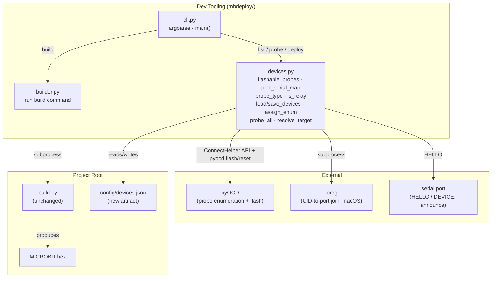
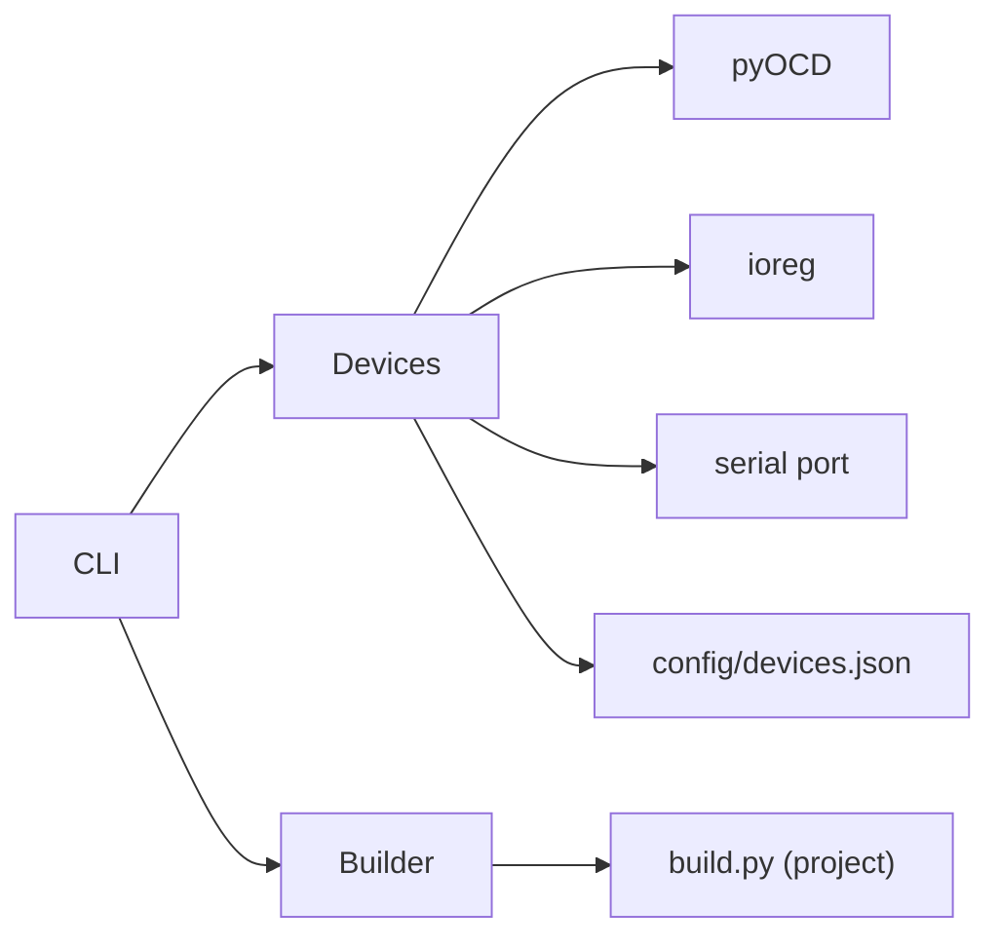

<!-- CLASI: Before changing code or making plans, review the SE process in CLAUDE.md -->

# Architecture Update — Sprint 006: mbdeploy Package

## What Changed

This sprint introduces the `mbdeploy/` developer tooling package and removes the
`scripts/` directory. The robot firmware architecture (`source/`) is entirely
unaffected.

**Added:**
- `mbdeploy/` — pipx-installable Python package (hatchling, src layout) providing
  the `mbdeploy` console command with four subcommands.
- `mbdeploy/src/mbdeploy/devices.py` — pyOCD/ioreg/serial device enumeration and the
  `config/devices.json` persistent registry.
- `mbdeploy/src/mbdeploy/builder.py` — thin wrapper that shells out to the project's
  build command.
- `mbdeploy/src/mbdeploy/cli.py` — argparse entry point wiring all subcommands.
- `config/devices.json` — project-level persistent device registry (committed to git;
  CWD-relative; `port` field is host-specific and refreshed on every probe/deploy).

**Removed:**
- `scripts/deploy.py`, `scripts/build_and_deploy.py`, `scripts/build.py` (thin wrapper)
- `scripts/lib/device_link.py`, `scripts/lib/known_devices.json`
- `scripts/lib/` directory, `scripts/` directory

**Updated (configuration only, no structural change):**
- `justfile` — `mbd-install` recipe added; old script recipes replaced with `mbdeploy`
  invocations.
- Root `pyproject.toml` — `pyocd` dependency removed (now owned by `mbdeploy`);
  `pyserial` retained (used by `tests/rogo.py`).
- `README.md` — install instructions and subcommand docs updated.

## Why

The old `scripts/` approach had three problems:

1. **No safe target selection** — deploy scripts did not have a stable way to target
   a specific board by name or number; relay protection was ad-hoc.
2. **Not installable** — scripts were invoked directly; no PATH isolation, no
   versioning, no dependency encapsulation.
3. **Fragmented state** — `known_devices.json` lived inside `scripts/lib/`, was not
   designed for cross-session persistence with stable enum numbers, and mixed
   project-specific role detection (`is_robot`/Nezha2) into a general-purpose library.

`mbdeploy` separates these concerns cleanly: the package handles enumeration and
flashing generically; the registry (`config/devices.json`) belongs to the project root;
the build shim stays project-specific by delegating to `./build.py` in CWD.

## Impact on Existing Components

| Component | Impact |
|---|---|
| `source/` firmware | None — no firmware files changed |
| `root/build.py` | None — stays at repo root; `mbdeploy build` delegates to it |
| `Dockerfile` | None — still calls `python3 build.py` |
| `tests/rogo.py` | None — still uses `pyserial` from root venv |
| `justfile` | Recipes updated; new `mbd-install` recipe added |
| Root `pyproject.toml` | `pyocd` removed from deps |
| `scripts/` | Deleted entirely |

## Migration Concerns

- Any developer who was invoking `scripts/deploy.py` or `scripts/build_and_deploy.py`
  directly must switch to `mbdeploy`. The `justfile` update covers the standard recipes.
- `pipx install --editable ./mbdeploy` must be run once per machine (or after a fresh
  clone). The `just mbd-install` recipe documents this.
- `config/devices.json` will not exist before the first `mbdeploy probe`. This is
  expected; the package creates it on first run.
- Old `scripts/lib/known_devices.json` data is not migrated automatically. It can be
  discarded; enum assignment starts fresh from `mbdeploy probe`.

## Module Descriptions

### `mbdeploy` package (`mbdeploy/src/mbdeploy/`)

Purpose: Consolidate all micro:bit deploy tooling into a single installable command.

| Module | Responsibility |
|---|---|
| `cli.py` | Argparse entry point; routes subcommands; owns `main()` |
| `devices.py` | pyOCD enumeration, ioreg port join, serial HELLO probe, registry CRUD, target resolution |
| `builder.py` | Shells out to project build command; maps `--clean`/`--verbose`/`-j` flags |

`devices.py` is the only module with external I/O side effects (subprocess calls to
pyOCD/ioreg, serial port open, file read/write of `config/devices.json`). `cli.py`
and `builder.py` are thin; they contain no device logic.

### `config/devices.json` registry

Purpose: Persistent, project-level mapping of pyOCD Unique ID to stable enum number,
port, and last-known announcement fields.

Entry schema:
```json
{
  "<uid>": {
    "enum": 1,
    "uid": "<uid>",
    "port": "/dev/cu.usbmodem...",
    "announcement": "DEVICE:Nezha2:gutov:microbit:9990001234",
    "role": "Nezha2",
    "common_name": "gutov",
    "device_name": "microbit",
    "serial": "9990001234"
  }
}
```

Key invariants:
- `enum` is assigned once and never changes for a known UID.
- `port` is host-specific and refreshed on every probe or deploy.
- Entries are never deleted (supports relay protection even when a board is not
  currently connected).
- `announcement` and derived fields are preserved from the last successful HELLO
  probe; a silent port does not clear them.

## Component Diagram



## Dependency Graph



No cycles. `Devices` and `Builder` are independent of each other. `CLI` is the only
module with fan-out (2 internal deps + stdlib argparse).

## Design Rationale

### Decision: Separate `mbdeploy/` package rather than a top-level module

**Context:** The deploy tooling needs to be pipx-installable for PATH isolation and
eventual extraction to its own repo.

**Alternatives:** (a) Keep scripts in `scripts/` with manual PATH setup. (b) Add
mbdeploy as a module inside the existing root `pyproject.toml`.

**Why this choice:** A separate `pyproject.toml` under `mbdeploy/` gives the package
its own dependency set (pyocd), its own version, and a clean boundary for future
extraction. It allows `pipx install --editable` without polluting the project venv.
Option (a) has no isolation. Option (b) couples the firmware dev environment to deploy
tool dependencies.

**Consequences:** Developers must run `pipx install --editable ./mbdeploy` once. The
`just mbd-install` recipe makes this discoverable.

---

### Decision: Drop `is_robot`/Nezha2 detection; use unique-non-relay auto-pick

**Context:** The old scripts had a project-specific `is_robot()` check for `Nezha2`.
This couples the general enumeration library to a project-specific codename.

**Alternatives:** Keep `is_robot` and the `ROBOT_ROLES` set.

**Why this choice:** Auto-pick selects the unique non-relay device — any single board
that is not a relay. This is correct for a two-board setup (robot + relay) and removes
the Nezha2 coupling. Future projects using `mbdeploy` work without customizing role sets.
When multiple non-relay boards are present, auto-pick errors with "ambiguous" rather than
guessing.

**Consequences:** If more than one non-relay board is connected without a target
argument, `deploy` errors. The developer must specify a target explicitly.

---

### Decision: Registry at `config/devices.json` (CWD-relative)

**Context:** The old `known_devices.json` lived next to `scripts/lib/device_link.py` —
a source-tree path that breaks when the package is extracted.

**Alternatives:** (a) XDG config dir per user. (b) Hard-coded absolute path.

**Why this choice:** CWD-relative with a `--config` override makes the registry
project-scoped (committed to git) and portable across machines. Option (a) loses
per-project scope. Option (b) breaks portability.

**Consequences:** `mbdeploy` must be run from the project root (or `--config` must
be passed). This matches how developers already use `build.py` and `justfile`.

---

### Decision: `mbdeploy build` delegates to `./build.py`

**Context:** The CODAL build is Docker-based and project-specific. `mbdeploy` is
intended to be generic and portable.

**Alternatives:** Inline the codal_utils build call directly in `builder.py`.

**Why this choice:** Delegation keeps the package generic. The build command is
configurable via `--build-cmd`. Root `build.py` stays as the single build entry
point for Dockerfile. Projects that don't use CODAL can substitute their own command.

**Consequences:** `mbdeploy build` requires CWD to contain `build.py` (or `--build-cmd`
to be set). An informative error should be emitted if neither is found.

## Open Questions

None. The issue is fully specified and all decisions were made by the stakeholder.
The bench rig is currently silent to HELLO; probe must not error on a silent port
(it populates enum/uid/port and leaves role/announcement blank). Tests must not
depend on a live DEVICE: announcement.
