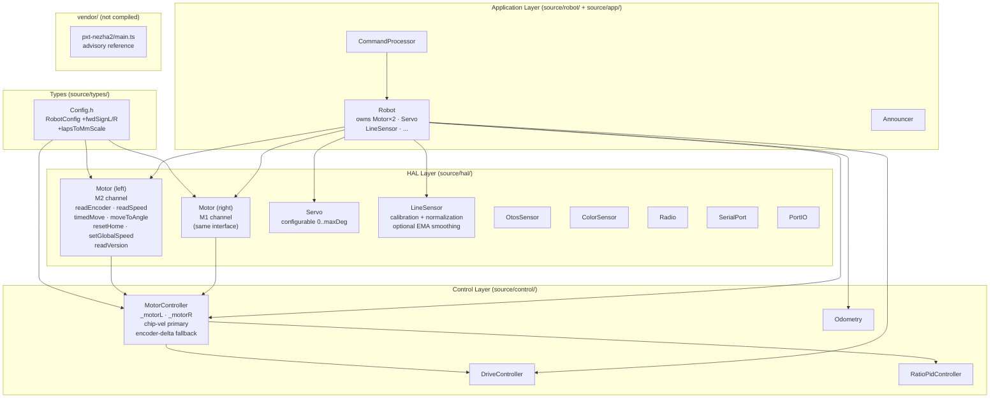

<!-- CLASI: Before changing code or making plans, review the SE process in CLAUDE.md -->

# Architecture Update — Sprint 008: Motor/HAL Layer: Vendor Coverage, Chip Velocity and Cleanup

## What Changed

### 1. `NezhaV2` renamed to `Motor` (one motor per object)

**Before:** `NezhaV2` is a single class owning both wheel channels (M1 and M2)
with hardcoded direction constants `LEFT_FWD = +1`, `RIGHT_FWD = -1`. All
encoder state lives in a single `int32_t _encOffset[4]` shared array.

**After:** `NezhaV2.{h,cpp}` → `Motor.{h,cpp}`. The class models **one motor
channel**. It is constructed with a motor ID (`M1` or `M2`), a per-motor forward
sign, and a reference to the shared `MicroBitI2C`. It owns its own encoder offset
(`int32_t _encOffset`). `RobotConfig` gains two fields: `int8_t fwdSignL` (default
`+1`) and `int8_t fwdSignR` (default `−1`).

`Robot` owns `Motor _motorL` and `Motor _motorR` instead of `NezhaV2 _motor`.
`MotorController` receives references to both `Motor` objects rather than a single
`NezhaV2` reference.

### 2. Chip-native velocity via register `0x47` (`readSpeed`)

`Motor` gains two new methods:
- `int16_t readSpeedRaw()` — private. Issues `[0xFF,0xF9,motorId,0x00,0x47,0x00,0xF5,0x00]`,
  applies 4 ms pre/post delays (same as `readEncoderRaw`), reads uint16 LE.
- `bool readSpeed(float& mmPerSec)` — public. Converts raw with
  `floor(raw/3.6)*0.01` → laps/s, applies per-motor forward sign, then scales by
  an empirically-pinned `lapsToMmScale` constant in `RobotConfig`.

`MotorController::tick()` switches velocity source:
- **Primary**: chip velocity via `Motor::readSpeed()`.
- **Fallback**: encoder-delta/dt (existing logic), activated on I2C error or an
  implausible chip reading (magnitude > 2× encoder-derived velocity).
- A `bool _usingChipVelL` / `_usingChipVelR` flag is maintained for telemetry.

### 3. Full vendor I2C command coverage

`Motor` gains five new public methods wrapping the remaining Nezha2 registers:

| Register | Method | Key constraint |
|---|---|---|
| `0x70` | `timedMove(uint8_t mode, int16_t value)` | mode: 1=turns, 2=deg, 3=sec |
| `0x5D` | `moveToAngle(uint16_t angle, uint8_t mode)` | 4 ms post-write, no task interleave |
| `0x1D` | `resetHome()` | encoder zero command |
| `0x77` | `setGlobalSpeed(uint8_t speed)` | speed×9 → 0–900 |
| `0x88` | `bool readVersion(uint8_t& maj, uint8_t& min, uint8_t& patch)` | 3-byte read |

A coverage checklist table is maintained in `Motor.h` mapping every vendor
register to its HAL method.

### 4. Vendor advisory reference copied to `vendor/pxt-nezha2/`

`vendor/pxt-nezha2/main.ts` (and `test.ts`) are copied from the scratch repo.
A `README` documents advisory-only status. The directory is excluded from all
build rules.

### 5. `GripperServo` renamed to `Servo` (configurable range)

`GripperServo.{h,cpp}` → `Servo.{h,cpp}`. Constructor gains `uint16_t maxDegrees`
(default 180). `setAngle()` clamps to `[0, maxDegrees]`. `Robot` member renamed
`_gripper` → `_servo` (type `Servo`); accessor and `CommandProcessor` updated.

### 6. `LineSensor` calibration and normalization

`LineSensor` gains:
- `uint16_t _calMin[4]`, `_calMax[4]` — per-channel calibration bounds.
- `captureCalibMin()` and `captureCalibMax()` — snapshot current raw readings
  into the calibration arrays.
- `readNormalized(uint16_t out[4])` — scales each channel: `(raw - min) * 1000 /
  (max - min)`, clamped 0–1000 (0 = white, 1000 = black).
- Optional EMA smoothing: `float _alpha` (0 = no smoothing; set via
  `setSmoothingAlpha(float)`), applied in `readNormalized`.

---

## Why

**Motor abstraction** (SUC-002): The `NezhaV2` FIXME markers called out that the
class modeled a board, not a motor, and that forward direction should not be a
compile-time constant. Making direction a `RobotConfig` value allows field-tuning
without a rebuild and keeps the robot mountable in either orientation.

**Chip velocity** (SUC-003): The Nezha2 chip measures wheel velocity internally;
using it as the primary source eliminates the dt-division instability at low speeds
and prepares the control stack for a velocity PID inner loop (sprint 010). Keeping
encoder-delta as a fallback ensures robustness against I2C noise.

**Vendor coverage** (SUC-004, SUC-001): The full `pxt-nezha2` register surface
enables timed and absolute-angle moves that are useful for classroom demos and for
validating that our encoder-based distance control agrees with the chip's own
counts. Vendoring the TS reference in-repo makes the coverage gap auditable in
code review.

**Servo / LineSensor** (SUC-005, SUC-006): Naming cleanup removes context-specific
prefixes and adds capability that lowers the barrier to using line-following in
future sprints.

---

## Impact on Existing Components

| Component | Change | Severity |
|---|---|---|
| `source/hal/NezhaV2.{h,cpp}` | Renamed to `Motor.{h,cpp}`; split to one-per-motor | Rename — all includes updated |
| `source/types/Config.h` | Gains `fwdSignL`, `fwdSignR`, `lapsToMmScale` | Additive; `defaultRobotConfig()` updated |
| `source/control/MotorController.{h,cpp}` | `NezhaV2&` replaced by `Motor& _motorL, _motorR`; velocity source switch | Interface change |
| `source/robot/Robot.{h,cpp}` | `NezhaV2 _motor` → `Motor _motorL, _motorR`; `GripperServo _gripper` → `Servo _servo` | Structural |
| `source/app/CommandProcessor.cpp` | `motor()` accessor calls updated; gripper accessor updated | Mechanical |
| `source/hal/GripperServo.{h,cpp}` | Renamed to `Servo.{h,cpp}` | Rename |
| `source/hal/LineSensor.{h,cpp}` | New calibration / normalization API added | Additive |
| `vendor/pxt-nezha2/` | New advisory directory (not compiled) | Additive |
| `docs/architecture.md` | Layer diagram and HAL section updated | Documentation |

**RAM budget note**: The two `Motor` instances replace one `NezhaV2` instance.
Each `Motor` shrinks the offset array from `[4]` to `[1]` (saves 12 bytes per
motor relative to the old shared array). `LineSensor` calibration arrays add
4×2×2 = 16 bytes + 4 floats = 32 bytes for EMA state. Net RAM impact is
approximately neutral. Programmers must report the RAM line from each build and
keep total below the ~98.3% (127 KB) watermark.

---

## Module Diagram

---

## Design Rationale

### Decision: One `Motor` object per wheel rather than a board-level `NezhaV2`

**Context**: The existing `NezhaV2` class drives two wheels. Per-motor
abstraction was a FIXME in the original code.

**Alternatives considered**:
1. Keep `NezhaV2` as a two-wheel object; add per-motor direction fields.
2. Replace with two `Motor` instances (chosen).

**Why this choice**: Option 1 leaves the cohesion problem — the class
describes two things. Option 2 makes each object responsible for one concern
(one motor channel), allows independent encoder offsets, and is the natural
fit for `MotorController` which already reasons about left and right
independently. RAM cost is neutral.

**Consequences**: `MotorController` constructor signature changes
(`Motor& left, Motor& right`). `Robot` constructs two `Motor` objects. All
callers updated in the same sprint.

---

### Decision: Chip velocity primary, encoder-delta fallback

**Context**: The chip reports velocity via `0x47`; our control stack currently
derives velocity from encoder differentiation which is noisy at low speeds.

**Alternatives considered**:
1. Encoder-delta only (current).
2. Chip only (no fallback).
3. Chip primary, encoder fallback (chosen).

**Why this choice**: Option 2 risks loss of velocity sensing on I2C errors.
Option 3 gives the best signal at normal speeds while preserving robustness.
The laps→mm/s scale must be pinned empirically on the bench before trusting
the chip reading; the fallback means a failed bench validation becomes a
documented, safe outcome rather than a broken robot.

**Consequences**: `MotorController` holds two velocity source flags. Telemetry
exposes which source is live per wheel. Bench validation is a required
acceptance gate.

---

### Decision: Keep `0x70` / `0x5D` wrapped but not wired into control loop

**Context**: The vendor chip has timed-move and absolute-angle commands;
our control stack uses PWM + encoder feedback for drive, not chip-side timed
commands.

**Why this choice**: Wrapping provides completeness and enables classroom demos
or diagnostic scripts without requiring a firmware rewrite. Not wiring them into
`DriveController` preserves the sprint scope and avoids destabilizing the
drive stack.

---

## Open Questions

1. **laps→mm/s scale for `readSpeed`**: The exact scale depends on wheel
   diameter and gear ratio. The issue specifies ~2.54 mm/s/LSB as an
   estimate; the exact value must be measured on the bench. The programmer
   should run the empirical validation (SUC-003 bench log) and commit the
   pinned constant to `defaultRobotConfig().lapsToMmScale` before merging
   the chip-velocity ticket.

2. **`readSpeed` sign convention**: The issue notes the chip returns an
   unsigned uint16 LE. The sign of velocity (forward vs reverse) must be
   derived from the commanded direction, not from the raw speed register.
   Confirm this matches the vendor TS before implementing the fallback
   plausibility check.

3. **`0x5D` post-write delay and fiber scheduling**: The vendor comments the
   4 ms delay must have no task interleave. On CODAL, `fiber_sleep(4)` yields.
   The programmer must confirm whether a busy-wait is needed here or whether
   the CODAL I2C transaction itself provides sufficient sequencing. Document
   the resolution in code comments.

4. **RAM after two `Motor` instances**: The net impact is expected neutral
   but must be confirmed by reporting the RAM line from the first build after
   the Motor split. If RAM exceeds budget, EMA smoothing in `LineSensor` is
   the first candidate to defer.
