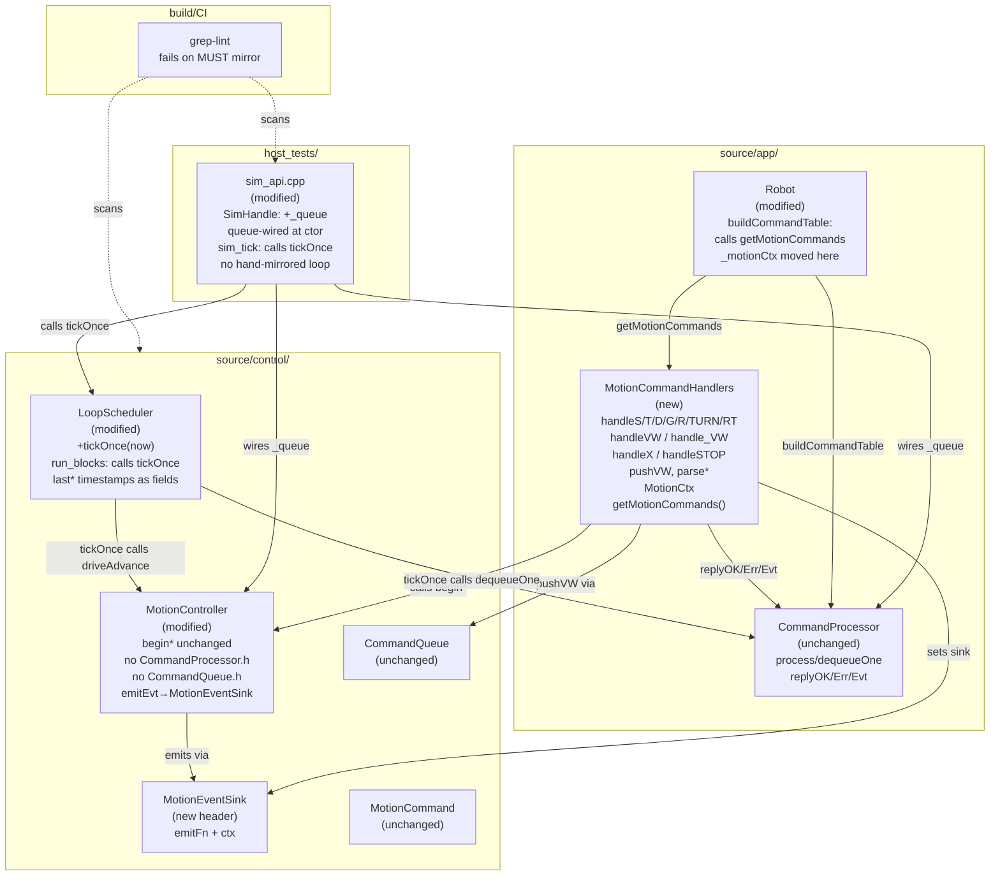
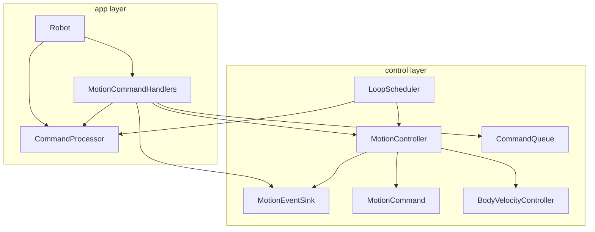

<!-- CLASI: Before changing code or making plans, review the SE process in CLAUDE.md -->

# Architecture Update — Sprint 026: One Dispatch Path

## What Changed

Sprint 026 eliminates the sim/hardware dispatch split and the protocol-inversion
in the firmware control layer. Three coordinated changes:

### 1. `LoopScheduler::tickOnce()` extracted; `sim_api.cpp` queue-wired

The body of `run_blocks()` that advances comms, queue drain, watchdog, halt,
drive, odometry, OTOS, line, color, ports, and TLM is extracted into
`LoopScheduler::tickOnce(uint32_t now)`. `run_blocks()` becomes a thin shell that
calls `tickOnce()` inside its sleep loop. `sim_tick()` replaces its hand-mirrored
copy of the same logic with a call to `tickOnce()`.

`sim_api.cpp::SimHandle` gains a `CommandQueue _queue` member. The constructor
calls `cmd.setQueue(&_queue)` and `robot.motionController.setQueue(&_queue)` —
exactly the wiring `LoopScheduler`'s constructor does on real hardware. `sim_tick()`
drains the queue via `cmd.dequeueOne(_queue)` in the same position and with the same
semantics as the firmware loop.

A CI grep-lint is added: `grep -rn "MUST mirror"` in the build system (CMakeLists or
a Makefile/script target) fails the build if the string reappears.

### 2. Protocol dispatch and reply formatting moved to `source/app/` (A2 + A3)

All converter handlers (`handleS`, `handleT`, `handleD`, `handleG`, `handleR`,
`handleTURN`, `handleRT`) and the unified `handleVW` dispatcher are moved from
`source/control/MotionController.cpp` to a new translation unit
`source/app/MotionCommandHandlers.cpp` (with matching header
`source/app/MotionCommandHandlers.h`).

`MotionController::getCommands()` is replaced by a free function
`getMotionCommands(MotionCtx*)` in `source/app/MotionCommandHandlers.cpp`.
`Robot::buildCommandTable()` calls this free function. `MotionCtx` moves to
`source/app/MotionCommandHandlers.h`.

All `CommandProcessor::replyOK/Err/Evt` calls (including `emitEvt()` in
MotionController) are eliminated from `source/control/`. `MotionController` reports
motion completion and safety events through a narrow `MotionEventSink` interface:

```cpp
// source/control/MotionEventSink.h  (new)
struct MotionEventSink {
    void (*emitFn)(const char* evt, const char* corrId, void* ctx);
    void* ctx;
};
```

`MotionController::emitEvt()` is replaced with a call to `_eventSink.emitFn(...)`.
The sink is set at `begin*()` time from the incoming reply context, exactly as the
current `TargetState::replyFn/replyCtx` pattern, but the sink type holds no
knowledge of `CommandProcessor` or the wire protocol. The `app/` layer formats the
`EVT done T` / `EVT safety_stop` strings before calling into the sink.

After this change, `source/control/MotionController.cpp` includes no
`CommandProcessor.h`, `CommandQueue.h`, or `Protocol.h`. `source/control/` files
as a whole satisfy: `grep -rl 'CommandProcessor.h\|CommandQueue.h' source/control/`
returns nothing.

A3 file-size targets are enforced as acceptance criteria for this ticket:
- `source/control/MotionController.cpp` ≤ 900 lines after handler extraction.
- `source/robot/Robot.cpp` stays flat (no structural changes this sprint;
  the command-table call site changes but no split required yet — A3 Robot split is
  deferred to a follow-on sprint if the file shrinks significantly from the handler
  extraction).

### 3. D11 fixed by construction; acceptance-gated by `test_protocol_v2.py`

After the A2 refactor, each converter command has exactly one reply-emitting site in
`app/MotionCommandHandlers.cpp`. `handleVW` (also in `app/`) calls `begin*()` but
does not emit a reply for the converter-pushed VW entry — the converter already
replied. The `quiet=true` patch is not implemented; the structural split is the fix.

`host/tests/test_protocol_v2.py` gains a `test_double_ok_absent` test that:
- Sends each converter command with a corr-id via the sim.
- Asserts the reply contains exactly one `OK` line with that id.
- Runs on the queue-wired sim so it would have caught the original D11 defect.

---

## Why

### Sim/hardware split

`sim_api.cpp` never wired a `CommandQueue`, so S/T/D/G/TURN/RT dispatched via the
direct `begin*()` fallback path in sim. On hardware they follow the converter →
queue → `handleVW` path. This divergence is why D11 (double OK) and D6
(keepalive-stomp) cannot be reproduced or regression-tested in sim. Every sim test
validates a system that does not exist on hardware. The queue wiring and
`tickOnce()` extraction eliminate this at the root.

### Protocol inversion in control layer

`source/control/` including `CommandProcessor.h` is a layering inversion: the control
layer depends upward on the app/protocol layer. This is the direct mechanism of D11:
both the converter handler (in control) and `handleVW` (in control) call
`CommandProcessor::replyOK` for the same command. It also means protocol changes
risk motion behavior and vice versa, and neither can be tested in isolation.

Moving all handler/reply code to `source/app/` restores the correct dependency
direction: `app/` → `control/`. Control becomes testable with a stub `MotionEventSink`
and no protocol headers.

### A3 god-object concern

`MotionController.cpp` is 1953 lines largely because it contains protocol handlers,
converters, and reply code that conceptually belong in `app/`. Extracting handlers to
`MotionCommandHandlers.cpp` brings `MotionController.cpp` below the ~900-line target
without any artificial splitting of the motion-law code — the extraction is cohesion
recovery, not size management.

---

## Module Definitions

### `LoopScheduler` (modified, `source/control/LoopScheduler.h/.cpp`)

**Purpose:** Provide a single reusable tick body that both the firmware loop and the
sim can call without duplication.

**Boundary (inside):** New `tickOnce(uint32_t now)` method containing: `runCommsIn`,
`cmd.dequeueOne(_queue)`, watchdog check, halt evaluation, `driveAdvance`, `odometry.predict`,
conditional OTOS/line/color/ports/TLM blocks, and the enable flags needed by each.
`run_blocks()` becomes a shell: initialize timestamps, loop: call `tickOnce(now)`,
sleep to `controlDeadline`. The timed-block last-timestamps (`lastOtos`, `lastLine`,
etc.) move to become fields of `LoopScheduler` so `tickOnce()` can update them.

**Boundary (outside):** `run_blocks()` interface unchanged (it still never returns).
`sim_tick()` gains a dependency on `LoopScheduler::tickOnce()` — this is the intended
coupling. No other callers. `run_test()` is not changed.

**Use cases:** SUC-001, SUC-002

---

### `sim_api.cpp` (modified, `host_tests/sim_api.cpp`)

**Purpose:** Run the exact same dispatch path and loop body as hardware, making sim
evidence trustworthy.

**Boundary (inside):** `SimHandle` gains `CommandQueue _queue`. Constructor calls
`cmd.setQueue(&_queue)` and `robot.motionController.setQueue(&_queue)`. `sim_tick()`
replaces its hand-mirrored block with `sched.tickOnce(now_ms)` where `sched` is a
`LoopScheduler` instance owned by `SimHandle`. The standalone `SimHandle::watchdogMs`
field is removed (watchdog now lives inside `LoopScheduler` via `tickOnce`). The
`fuseOtos`, motor-slip, encoder-noise, and OTOS-model fields remain as sim-only
configuration on top.

**Note on LoopScheduler ownership in sim:** `LoopScheduler` requires a `MicroBit&` in
its constructor. `SimHandle` already owns a `MockHAL` that supplies the mock system
timer. Two implementation paths are valid: (a) `tickOnce()` is extracted to not
require the `MicroBit&` member (refactored to accept `uint32_t now` from the caller,
which it already does), or (b) `LoopScheduler` is extended with a sim-compatible
constructor. Path (a) is preferred — `tickOnce()` should take `now` as a parameter
so the sim's clock injection (`g_sim_now_ms`) remains the time source.

**Boundary (outside):** All `sim_*` C-ABI functions (`sim_create`, `sim_tick`,
`sim_command`, `sim_get_async_evts`, etc.) preserve their signatures. Python test code
(`host_tests/*.py`) requires no changes to call sites.

**Use cases:** SUC-001, SUC-002

---

### `MotionCommandHandlers` (new, `source/app/MotionCommandHandlers.h/.cpp`)

**Purpose:** Own all motion command parsing, conversion, and reply formatting in the
app layer; expose the command descriptors to `Robot::buildCommandTable()`.

**Boundary (inside):**
- Moves from `source/control/MotionController.cpp`: `handleS`, `handleT`, `handleD`,
  `handleG`, `handleR`, `handleTURN`, `handleRT`, `handleVW`, `handle_VW`, `handleX`,
  `handleSTOP`, and their `parse*` counterparts.
- Moves `pushVW`, `vwScanKV`, `vwHasKey`, `packKVArg`, `setIntArg`,
  `mc_parseSensorToken` helper statics.
- Moves `MotionCtx` struct.
- New free function: `std::vector<CommandDescriptor> getMotionCommands(MotionCtx*)`.
- `MotionCtx::queue` pointer remains (needed for `pushVW` to enqueue the VW
  ParsedCommand). This is the only remaining controlled coupling to `CommandQueue`
  from the new app-layer file — acceptable because `MotionCommandHandlers` IS the
  app/protocol layer.
- Reply formatting via `CommandProcessor::replyOK/Err/Evt` stays here (in `app/`).

**Boundary (outside):** `MotionController.cpp` calls only `begin*()` entry points;
it no longer includes `CommandProcessor.h`, `CommandQueue.h`, or `MotionCommandHandlers.h`.
`Robot::buildCommandTable()` calls `getMotionCommands(&_motionCtx)` instead of
`motionController.getCommands()`.

**Use cases:** SUC-003, SUC-004

---

### `MotionController` (modified, `source/control/MotionController.h/.cpp`)

**Purpose:** Advance motion-phase state machines and report completion through a narrow
event sink; no protocol knowledge.

**Boundary (inside):**
- Removes: `getCommands()` (moved to `MotionCommandHandlers`), `emitEvt()` (replaced
  by `MotionEventSink` calls), all `CommandProcessor::replyOK/Err/Evt` call sites,
  `#include "CommandProcessor.h"`, `#include "CommandQueue.h"`.
- The `MotionCtx` struct moves to `source/app/MotionCommandHandlers.h`.
- `emitEvt()` becomes a call through a `MotionEventSink*` stored in `TargetState`
  (or passed at begin-time). The sink formats and emits the wire line; `MotionController`
  passes only the semantic label (`"EVT done T"`, `"EVT safety_stop"`) and corrId.
- All `begin*()` entry-point signatures are unchanged. `setQueue()` accessor removed
  (queue binding moves to `MotionCommandHandlers` via `MotionCtx`).
- Target size: ≤ 900 lines after extraction (down from 1953).

**Boundary (outside):** `Robot` calls `begin*()` unchanged. `LoopScheduler` calls
`driveAdvance()` and `hasActiveCommand()` unchanged. No new includes required by
callers. `setCtx()` is removed; `MotionCtx` initialization moves to
`MotionCommandHandlers`.

**Use cases:** SUC-003

---

### `MotionEventSink` (new, `source/control/MotionEventSink.h`)

**Purpose:** Narrow interface for MotionController to report completion events and
safety events to the app layer without any protocol-layer knowledge.

**Boundary (inside):**
```cpp
struct MotionEventSink {
    void (*emitFn)(const char* evtLine, const char* corrId, void* ctx);
    void* ctx;
};
```
Zero dependencies. Used by `MotionController` to replace all `emitEvt()` calls.
`TargetState` gains a `MotionEventSink sink` field (or the sink is passed to each
`begin*()` directly — programmer to choose the lower-churn path).

**Boundary (outside):** `app/MotionCommandHandlers.cpp` sets `sink.emitFn` to a
lambda or static that calls `CommandProcessor::replyEvt` or directly appends
`"EVT done T\n"` to the reply context. `source/control/` sees only the `MotionEventSink`
header, which has no app-layer includes.

**Use cases:** SUC-003

---

### `Robot` (modified, `source/robot/Robot.cpp`)

**Purpose:** Wire the new `MotionCommandHandlers` into the command table; expose no
new protocol logic itself.

**Boundary (inside):** `buildCommandTable()` replaces `motionController.getCommands()`
with `getMotionCommands(&_motionCtx)` (where `_motionCtx` is initialized here).
`_motionCtx` (type `MotionCtx`) moves from being a private member of `MotionController`
to a private member of `Robot`. `motionController.setCtx()` call is removed; `Robot`
initializes `MotionCtx` directly.

**Boundary (outside):** `buildCommandTable()` return type and callers unchanged.
`main.cpp` and `sim_api.cpp` construct `CommandProcessor` from the returned
descriptor vector as before.

**Use cases:** SUC-003

---

### `test_protocol_v2.py` (modified, `host/tests/test_protocol_v2.py`)

**Purpose:** Gate the D11 fix — assert exactly one OK per converter command on the
queue-wired sim path.

**Boundary (inside):** New test function `test_double_ok_absent` (or parameterized):
for each of S, T, D, G, TURN, RT, send the command with a `#id` correlation token
via the sim, collect all reply lines from `sim_get_async_evts` over several ticks,
assert exactly one line starts with `OK ... #<id>`. Direct `VW` command similarly
asserts exactly one `OK vw`.

**Boundary (outside):** Existing tests in `test_protocol_v2.py` are unaffected.

**Use cases:** SUC-004

---

### CI grep-lint (new, build system)

**Purpose:** Prevent the "MUST mirror" divergence pattern from reappearing.

**Boundary (inside):** A CI step (CMakeLists custom target or a script called from
CI) runs `grep -rn "MUST mirror" source/ host_tests/` and fails the build if any
match is found.

**Boundary (outside):** No runtime impact. Runs on every build.

**Use cases:** SUC-002

---

## Architecture Diagrams

### Component Diagram (Sprint 026 changes)



### Dependency Graph (sprint-026, after refactor)



No cycles. Dependency direction:
`app/` → `control/` → pure data types.
`control/LoopScheduler` → `app/CommandProcessor` is the one upward call — this is
the existing deliberate coupling (LoopScheduler owns the comms-in loop and drives
dispatch); it is not new in this sprint. The critical fix is that `MotionController`
no longer depends on `CommandProcessor`.

---

## Impact on Existing Components

| Component | Change |
|-----------|--------|
| `source/control/LoopScheduler.h/.cpp` | Extract `tickOnce(now)`; last* timestamps become fields; `run_blocks()` becomes a shell |
| `source/control/MotionController.h/.cpp` | Remove all protocol headers and reply calls; remove `getCommands()`, `setCtx()`, `MotionCtx`; add `MotionEventSink` usage; target ≤ 900 lines |
| `source/control/MotionEventSink.h` | New narrow event-reporting interface |
| `source/app/MotionCommandHandlers.h/.cpp` | New file: receives all handler/converter/reply code from `MotionController.cpp` |
| `source/robot/Robot.cpp` | `buildCommandTable()` calls `getMotionCommands()`; `_motionCtx` moved here; `setCtx()` call removed |
| `host_tests/sim_api.cpp` | `SimHandle` gains `CommandQueue _queue`; queue-wired at construction; `sim_tick()` calls `tickOnce()` instead of hand-mirrored body; `watchdogMs` field removed |
| `host/tests/test_protocol_v2.py` | New `test_double_ok_absent` test for D11 gate |
| Build system / CI | New grep-lint target for "MUST mirror" |

Unchanged: `MotionCommand`, `BodyVelocityController`, `Odometry`, `EKF`, `HaltController`,
`PortController`, `ServoController`, `StopCondition`, `Robot::otosCorrect()`,
`Robot::buildTlmFrame()`, `OtosSensor`, all HAL files, `main.cpp` (LoopScheduler
constructor and `run_blocks()` call site are transparent), `CommandProcessor` (no
change to its public interface), `CommandQueue` (no change), all existing
`host_tests/*.py` test files not listed above (C-ABI signatures unchanged).

---

## Migration Concerns

### `MotionCtx` relocation

`MotionCtx` moves from `source/control/MotionController.h` to
`source/app/MotionCommandHandlers.h`. The only consumers of `MotionCtx` today are the
static handler functions in `MotionController.cpp` — all of which are moving to
`MotionCommandHandlers.cpp`. No external files include `MotionController.h` for
`MotionCtx` directly. Risk: low.

### `setCtx()` / `setQueue()` removal from `MotionController`

`Robot`'s constructor currently calls `motionController.setCtx(this)`, and
`LoopScheduler`'s constructor calls `robot.motionController.setQueue(&_queue)`. After
the refactor, `setCtx()` is removed; `MotionCtx` is initialized by `Robot` directly.
`setQueue()` on `MotionController` is also removed; the queue pointer is held in
`MotionCtx` (in `Robot`) and passed to `pushVW` through the handler context. The
`LoopScheduler` constructor wires the queue into `MotionCtx` via a new setter on
`Robot` (e.g., `robot.setMotionQueue(&_queue)`) or directly into `_motionCtx.queue`.
Programmer must identify the cleanest seam.

### `run_blocks()` loop structure change

The enable flags (`enControl`, `enComms`, etc.) and per-block last-timestamps become
`LoopScheduler` fields rather than locals in `run_blocks()`. The initialize-to-NOW
stagger-offset logic moves to `LoopScheduler`'s constructor or to an `initTicks()`
call at the start of `run_blocks()`. This is a purely structural change with no
behavioral difference. Risk: low.

### `sim_api.cpp` watchdog removal

The standalone `SimHandle::watchdogMs` and its associated watchdog check block in
`sim_tick()` are removed once `tickOnce()` carries the watchdog from `LoopScheduler`.
Existing tests that depend on watchdog behavior in sim (e.g., `test_watchdog_exemption.py`)
will continue to pass because the watchdog logic is preserved in `tickOnce()` — it is
just no longer duplicated. Tests that seed `sim_command()` without ticks to arm the
watchdog must be reviewed; the timing semantics are identical because `sim_command()`
still resets `_watchdogMs` (now inside `LoopScheduler`) to `g_sim_now_ms`.

### Clean build requirement

This sprint involves moving code between translation units and removing headers from
includes. Stale incremental builds have historically produced broken binaries (see
project memory). All bench verification must be preceded by a `--clean` build. This
is a process requirement, not a code concern.

---

## Design Rationale

### Decision: Extract `tickOnce()` rather than sharing a free function

**Context:** The sim needs the same loop body as firmware. Options: (a) extract to a
free function that both call, (b) make `tickOnce()` a member of `LoopScheduler` that
both callers invoke. Option (b) requires `sim_api.cpp` to instantiate or reference
`LoopScheduler`.

**Alternatives considered:** Free function (would need all the scheduler's state
passed as parameters — effectively recreating `LoopScheduler`'s member struct);
copying state into `SimHandle` (defeats the purpose).

**Why this choice:** `LoopScheduler` already owns the per-block timestamps and the
queue. Making `tickOnce()` a member keeps all state in one owner. `SimHandle` gains
a `LoopScheduler` member (or a pointer to a shared `LoopScheduler` that `SimHandle`
owns). This is the minimal change to make the coupling explicit and testable.

**Consequences:** `SimHandle` gains a dependency on `LoopScheduler`. This is the
correct and intended coupling: the sim is testing the firmware scheduler.

### Decision: Move converters to `MotionCommandHandlers.cpp`, not inline into `Robot.cpp`

**Context:** Converter logic could move into `Robot::buildCommandTable()` lambdas or
into a new file. Option A: new file; Option B: into Robot.

**Why this choice:** `Robot.cpp` is already 1490 lines. Adding 400+ lines of converter
logic would worsen the A3 concern. A separate translation unit has a clear purpose
(protocol/app layer for motion commands), is independently testable, and keeps
`Robot.cpp` as a facade/wiring file. The a3 review criterion (Robot split) is deferred
to sprint 027 or later once the mass has been removed.

**Consequences:** One new `.cpp` / `.h` pair. `CMakeLists.txt` must add
`MotionCommandHandlers.cpp` to the firmware target and host_tests target.

### Decision: `MotionEventSink` as a plain function-pointer struct, not a virtual interface

**Context:** `MotionController` needs to call back into the app layer without knowing
`CommandProcessor`. Options: (a) `virtual MotionEventSink` base class, (b) function
pointer + context struct, (c) std::function.

**Why this choice:** The firmware target uses no RTTI and minimal C++ overhead.
Function-pointer + `void*` ctx is the existing pattern throughout this codebase
(`ReplyFn` is the same pattern). Introducing `virtual` would require vtable support
and adds no benefit. `std::function` adds heap allocation risk on embedded.

**Consequences:** `MotionEventSink` is trivially constructible and copyable. The
`app/` layer provides a static function that formats and emits the EVT line.

### Decision: D11 fixed by construction, not `quiet=true`

**Context:** The original d11 issue spec proposes a `quiet=true` flag on the
converter-pushed `ParsedCommand`. This is a narrower patch than the A2 structural
fix.

**Why this choice:** With converters moved to `app/`, the converter handler is the
sole reply-emitting site. `handleVW` in `app/` knows it is being called from a
converter push and calls `begin*()` without replying. No flag needed. The structural
separation makes the invariant self-evident and removes an entire class of "should
this be quiet?" decisions from future code.

**Consequences:** The `ParsedCommand` struct does not gain a `quiet` field.
`test_protocol_v2.py` tests the structural guarantee, not a flag value.

---

## Open Questions

1. **`LoopScheduler` in `SimHandle`:** The cleanest path for `tickOnce()` is to have
   `SimHandle` own a `LoopScheduler`. But `LoopScheduler`'s constructor takes
   `MicroBit&`. The programmer must either (a) add a sim-compatible `LoopScheduler`
   constructor that takes `uint32_t (*systemTimeFn)()` instead of `MicroBit&`, or
   (b) refactor `tickOnce()` to not call `_uBit.systemTime()` but instead accept
   `now` as a parameter throughout. Option (b) is recommended and aligns with
   `sim_tick(now_ms)`'s existing interface. Programmer to confirm and choose.

2. **`MotionCtx` queue wiring after `setCtx()` removal:** `LoopScheduler`'s
   constructor currently calls `robot.motionController.setQueue(&_queue)`. After
   `setQueue()` is removed from `MotionController`, the queue pointer must reach
   `MotionCtx` (now in `Robot`). The programmer must add a `Robot::setMotionQueue()`
   setter or expose `_motionCtx` in a controlled way. The exact seam needs a decision
   before Ticket 002 begins.

3. **`emitEvt` in `driveAdvance` vs. `TargetState.sink`:** Currently `emitEvt(base,
   target)` reads `target.replyFn` and `target.corrId` directly. Replacing this with
   a `MotionEventSink` call requires the sink to be stored in `TargetState` (or
   passed to every `begin*()`). The lower-churn path is to add a `MotionEventSink
   sink` field to `TargetState`. Programmer to verify `TargetState` ownership and
   whether the existing EVT delivery tests still pass with the reformatted sink call.

4. **`handleVW` double-dispatch suppression:** After the move to `app/`, the
   converter-pushed VW ParsedCommand is dispatched by `dequeueOne()`. `handleVW` must
   not emit a reply when it is servicing a converter push. The structural way to
   distinguish is: converter push always has stop-params in `args[2..]`; a direct
   `VW v ω` command (no stop params, open-ended) has `args.count == 2`. All stop-param
   branches in `handleVW` currently emit `OK vw ...` — these must be suppressed (the
   converter already replied). Programmer to confirm this invariant holds in all
   branches.

5. **A3 size check for `Robot.cpp`:** After handler extraction, `MotionController.cpp`
   should drop from 1953 to ~900 lines. `Robot.cpp` (1490 lines) is not structurally
   changed by this sprint beyond the `buildCommandTable` call site. A3 calls for
   `Robot.cpp` splitting — this is deferred unless the extraction reveals a natural
   seam. Sprint 027 retrospective should revisit. Note for team-lead.
