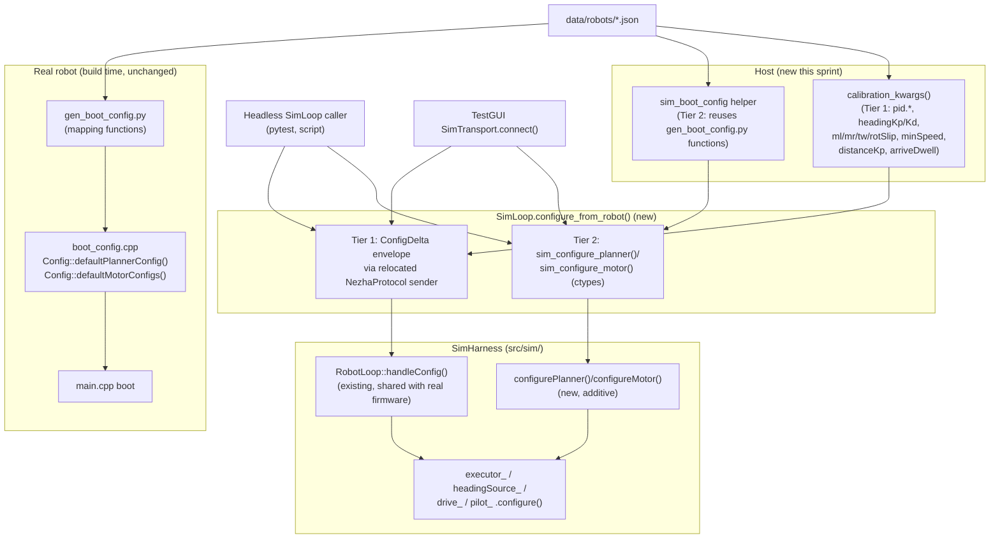

<!-- CLASI: Before changing code or making plans, review the SE process in CLAUDE.md -->

# Sprint 113: Config-as-truth: sim configures-on-open from the robot config file

## Goals

Make the sim (`firmware_host`, `src/firm/` + `src/sim/`) get its motion-control
config (`Motion::Executor` limits, the heading/distance-trim gains, `App::Pilot`'s
reference-model time constants, and the per-motor calibration/filter fields) from
the robot's own JSON file (`data/robots/*.json`) when a session opens the sim —
not from the hardcoded literals in `src/sim/sim_harness.h::makeExecutorConfig()`/
`makeMotorConfig()`. After this sprint, a headless `robot_radio.io.sim_loop.SimLoop`
run and the TestGUI's Sim transport both run the *same* configuration a real robot
reflash would get from the same file, closing the divergence that let sim-tuned
motion values disagree with what the TestGUI showed.

This is **item 2 only** of `clasi/issues/config-as-truth-sim-configure-on-open.md`.
Items 1 (delete every hardcoded behavioral default), 3 (fail-closed when
unconfigured), and 4 (version-erase persisted config) are explicitly deferred to
follow-on sprints — see Out of Scope.

## Problem

`src/sim/sim_harness.h`'s `makeExecutorConfig()`/`makeMotorConfig()` hardcode a
`msg::PlannerConfig` and per-motor `Devices::MotorConfig` as "reasonable stand-in
values... NOT bench-tuned" (the function's own doc comment). Meanwhile
`src/scripts/gen_boot_config.py` bakes a *different*, JSON-driven `PlannerConfig`
into `boot_config.cpp` for the real robot at build time. During the model-reference
motion work, `heading_kp` was simultaneously `6.0` (an old firmware default),
`2.5` (the sim's own hardcoded value), and `1.0` (an old robot-JSON value) — three
numbers, one name, no single source of truth. The validated values now live in
`data/robots/tovez_nocal.json`'s `control` section (including two brand-new keys,
`model_tau_lin`/`model_tau_ang`, that no code reads yet), but nothing pushes them
into the sim. `src/host/robot_radio/io/sim_loop.py` says so explicitly: "There is
no `config` or `set_config_binary()` simulation surface to wrap."

Investigation during planning found this is subtler than "add one wire hookup":
the project already has **two** config-delivery mechanisms, and they cover
different, non-overlapping subsets of the values a robot needs.

1. **A live wire plane** (`CommandEnvelope{config: ConfigDelta}` →
   `RobotLoop::handleConfig()`) that both real hardware and the sim already share
   identically (the sim is `src/firm/` compiled against a simulated I2C bus, so
   `RobotLoop` is literally the same code either way). This plane is deliberately
   *curated* to a handful of fields with a genuine live-retune use case:
   `MotorConfigPatch` (`pid.*`, `ml`/`mr`), `OtosConfigPatch` (`OI`/`OL`/`OA`), and
   `PlannerConfigPatch` (`minSpeed`, `headingKp`/`headingKd`, `arriveDwell`,
   `distanceKp`). The TestGUI already uses it — `calibration_commands()`
   (`src/host/robot_radio/calibration/push.py`) pushes most of these fields
   through `_SimConfigConn` (`testgui/transport.py`, 109-002's "one mechanism, not
   a Sim-specific fork") — but only as a side effect of the GUI's manual
   "robot select" action, not automatically on open, and not for a headless
   `SimLoop` caller at all. It also doesn't yet push `minSpeed`/`distanceKp`/
   `arriveDwell`, even though those three already have a live wire arm.
2. **A boot-time bake** (`gen_boot_config.py` → `Config::defaultPlannerConfig()`/
   `defaultMotorConfigs()`, called once by `main.cpp`) covering the *rest* of
   `PlannerConfig` — `a_max`/`a_decel`/`v_body_max`/`yaw_rate_max`/`yaw_acc_max`/
   `j_max`/`yaw_jerk_max`, `heading_dwell_tol`/`heading_dwell_rate`,
   `heading_lead_bias`/`plan_lead`/`terminal_lead`, `actuation_lag`,
   `distance_tol`, `heading_source`, plus per-motor `vel_filt`/`fwd_sign` — none
   of which have a live wire arm on *either* hardware or sim, by deliberate
   prior-sprint design (`config.proto`'s own `PlannerConfigPatch` header comment:
   "no live consumer to tune yet"). This is a **compile-time** mechanism: it
   works for the ARM firmware (rebuilt per robot) but the sim binary
   (`firmware_host`) is built once and reused interactively across robot
   profiles, so there is nothing for the sim to compile against.

Neither mechanism, unmodified, gets the sim fully configured on open. `App::Pilot`'s
`modelTauLin_`/`modelTauAng_` aren't even fields on `msg::PlannerConfig` today —
they're plain hardcoded member initializers with no config path of any kind.

## Solution

Two tiers, matching the two mechanisms already in the codebase, both triggered by
one new entry point so neither consumer (headless `SimLoop`, TestGUI `SimTransport`)
can get one tier without the other:

- **Tier 1 (already-wire-covered fields)**: keep using the existing
  `ConfigDelta`/`_SimConfigConn` wire plane — the same binary command path real
  hardware uses — but make it fire automatically on open (not only on a manual
  GUI robot-select), extend its coverage to the three curated `PlannerConfigPatch`
  fields it currently skips (`minSpeed`, `distanceKp`, `arriveDwell`), and relocate
  the small `SimLoop`-compatible sender (`_SimConfigConn`) out of TestGUI-only code
  so a headless caller gets it too, not just the GUI.
- **Tier 2 (boot-only fields, including the two new `model_tau_*` keys)**: give
  `SimHarness` an additive, one-shot "load a full boot config at runtime" surface —
  the same `msg::PlannerConfig`/`Devices::MotorConfig` structs and the same
  `.configure()` consumer calls `main.cpp`'s real boot and `SimHarness`'s own
  constructor already use, just supplied at *open* time from JSON instead of
  compiled in. The host computes these values by **reusing `gen_boot_config.py`'s
  own mapping functions** (imported via the sys.path pattern
  `src/tests/sim/unit/test_gen_boot_config_planner.py` already established) rather
  than re-deriving the JSON→field mapping a second time — the sim and a real
  robot's baked firmware are then guaranteed to compute identical values from
  identical JSON by construction, not by manual sync.

`SimHarness`'s existing default (no-args) construction path — the ~40 existing
C++ scenario/characterization test harnesses under `src/tests/sim/unit/` and
`src/tests/sim/system/` — is left completely unchanged; the new capability is
purely additive.

## Success Criteria

- Connecting the TestGUI's Sim transport to a robot profile, and constructing +
  connecting a headless `SimLoop` against the same robot's JSON, both result in
  the sim's `Motion::Executor`/`App::HeadingSource`/`App::Drive`/`App::Pilot`
  running the identical `PlannerConfig` (and per-motor `vel_filt`/`fwd_sign`) that
  `gen_boot_config.py` would bake for that same JSON on a real robot reflash.
- `model_tau_lin`/`model_tau_ang` are read from `data/robots/*.json`'s
  `control.model_tau_lin`/`control.model_tau_ang` for both real-firmware boot and
  sim open — no longer purely hardcoded in `App::Pilot`.
- Switching the active robot profile mid-session (TestGUI robot-select) re-pushes
  both tiers, so "tovez_nocal" vs a tuned profile visibly behaves differently in
  the sim without a rebuild.
- None of the existing ~40 C++ sim test harnesses (`src/tests/sim/unit/*.cpp`,
  `src/tests/sim/system/*.cpp`) change behavior; the full `uv run python -m
  pytest` suite (~6 min) and the TestGUI still work.

## Scope

### In Scope

- New `msg::PlannerConfig` fields `model_tau_lin`/`model_tau_ang` (`planner.proto`),
  threaded through `App::Pilot::configureHeading()`.
- `gen_boot_config.py`: a `model_tau_for_config()` mapping (mirrors
  `actuation_lag_for_config()`'s shape), reading `control.model_tau_lin`/
  `control.model_tau_ang`, defaulting to today's hardcoded Pilot values
  (0.10/0.08) when absent — this also closes the same gap for real-firmware boot,
  a natural, low-risk side effect of adding the field.
- `SimHarness` (`src/sim/sim_harness.h`): additive `configurePlanner()`/
  `configureMotor()` public methods (the default hardcoded-literal construction
  path is unchanged).
- `sim_ctypes.cpp`: new C ABI exports for the above, plus a small test-only
  readback for verifying what config actually landed.
- Host (`src/host/robot_radio/`): a mapping helper that reuses `gen_boot_config.py`'s
  pure functions to compute the Tier-2 scalar set from a `RobotConfig`; a DRY
  extraction of `calibration_commands()`'s field-selection logic into a reusable
  kwargs form; three new `_PLANNER_KEYS` wire-key entries (`minSpeed`,
  `distanceKp`, `arriveDwell`); relocating `_SimConfigConn` (or an equivalent) to
  the `io/` layer; a new `SimLoop.configure_from_robot()` entry point wired into
  both headless use and `SimTransport.connect()`/robot-change.
- Tests proving sim/real-boot parity from the same JSON, and that the existing
  `_SimConfigConn`-consuming TestGUI tests are unaffected by the relocation.

### Out of Scope (deferred to follow-on sprints per the issue)

- **Item 1** — deleting hardcoded behavioral defaults (`sim_harness.h`'s own
  remaining stand-in literals for scenario tests, `gen_boot_config.py`'s
  `*_DEFAULT` constants, `nezha_motor`'s `kDefaultOutputDeadband`/
  `kDefaultReversalDwell`). This sprint *adds* a config-reading path; it does not
  remove any existing fallback.
- **Item 3** — fail-closed / "not configured" behavior. Both tiers still land on
  a fully-populated struct today (sim's own stand-in defaults, or firmware's
  compiled boot defaults); nothing in this sprint makes an unconfigured device
  refuse motion.
- **Item 4** — version-erase persisted config. Not touched.
- `data/robots/*.json`'s `drive.motor_deadband` (mm/s). It has no live consumer on
  *either* hardware or sim today (`gen_boot_config.py` does not read `drive.*` at
  all — `NezhaMotor::kDefaultOutputDeadband` is a firmware constant, in duty
  units). Wiring it up is item 1's shape of work (delete the hardcoded fallback,
  make the field load-bearing) — doing it only for the sim here would
  *reintroduce* a sim/hardware divergence, the exact bug this sprint exists to
  close. Flagged, not done.
- `SimTransport`'s trackwidth source. `SimLoop(track_width=...)` is currently
  sourced from `sim_prefs`' persisted "error profile," not from the robot JSON's
  `geometry.trackwidth` — a second, pre-existing divergence in the same family
  as this issue. Left alone this sprint: trackwidth is a `SimHarness`
  constructor-only value (no post-construction setter reaches `OtosPlant`/
  `Drive`/`Odometry`, all of which take it in their own constructors), and the
  "Sim Errors" panel may intentionally want an independent trackwidth for fault
  injection, distinct from "which robot am I simulating" — this needs a
  stakeholder call, not a silent pick either way. See Open Questions.
- OTOS calibration/offset config. Already solved by the existing `OI`/`OL`/`OA`
  push (109-004); this sprint only adds the three missing `PlannerConfigPatch`
  keys and the Tier-2 surface, neither of which touches OTOS.

## Test Strategy

- **Unit (C++, `src/tests/sim/unit/`)**: a regression pin for
  `gen_boot_config.py`'s new `model_tau_for_config()` (mirrors the existing
  `test_gen_boot_config_planner.py` pattern: in-process import via the
  `sys.path` shim, asserting generated source text, no build/link needed).
- **Unit (C++, new)**: a small harness exercising `SimHarness::configurePlanner()`/
  `configureMotor()` directly — construct with defaults, reconfigure, assert the
  new values took effect (via the existing `plannerConfig()` accessor and the new
  motor-config readback) — proving the additive surface works without touching
  any of the ~40 existing harnesses.
- **Unit (Python)**: `calibration_kwargs()`/mapping-helper pure-function tests
  (no sim lib required) — the JSON→kwargs and JSON→Tier-2-scalar mappings, both
  present-in-JSON and fallback-to-default cases, mirroring
  `test_gen_boot_config_planner.py`'s own present/absent coverage style.
- **System (Python, requires built sim lib)**: connect a headless `SimLoop`
  against `tovez_nocal.json` and against `tovez.json`, call
  `configure_from_robot()`, and assert the sim's live `PlannerConfig` (via the
  new ctypes readback) matches what `gen_boot_config.py` would generate for the
  same file — the direct parity proof this sprint exists to deliver.
- **Regression (Python, TestGUI)**: re-run `test_calibration_push_on_connect.py`,
  `test_tour_closure_gate.py`, `test_otos_calibration_convergence.py`,
  `test_turn_error_characterization.py` (all `_SimConfigConn` consumers) after
  its relocation — must pass unchanged.
- Full suite: `uv run python -m pytest` (~6 min gate). No hardware bench gate
  applies — this sprint touches only the sim/host config-delivery path, not the
  HAL, motor control, sensing, or the wire command protocol reaching real
  hardware (the wire *plane* itself is untouched; only which fields get pushed
  through it, and when, changes) — see `.claude/rules/hardware-bench-testing.md`'s
  own trigger list. No firmware/HAL/protocol behavior change reaches the ARM
  build in this sprint.

## Architecture

**Substantial** — 3+ modules touched (`src/protos/planner.proto`,
`src/firm/app/pilot.h`, `src/sim/sim_harness.h` + `sim_ctypes.cpp`,
`src/scripts/gen_boot_config.py`, and `src/host/robot_radio/{io,calibration,
testgui}/`), a new cross-module dependency (the host importing
`gen_boot_config.py`'s pure functions at runtime; `SimLoop` gaining protobuf
envelope-building capability it previously deliberately did not have), and a
data-model change (two new `PlannerConfig` proto fields). Full 7-step
methodology, with a diagram.

### Architecture Overview

**Step 1 — Problem.** Covered above (Problem/Solution). Two pre-existing,
non-overlapping config-delivery mechanisms; neither reaches the sim on open.

**Step 2 — Responsibilities.**

1. *Declare the new config surface* — `model_tau_lin`/`model_tau_ang` need a
   place to live on the wire-shared `msg::PlannerConfig` type before anything
   can set them.
2. *Compute config from JSON* — turning a robot's JSON into concrete
   `PlannerConfig`/`MotorConfig` field values. This responsibility already
   exists (`gen_boot_config.py`) and must not be duplicated, only reused.
3. *Deliver Tier-1 (live-wire) fields to a running sim* — build and inject the
   `ConfigDelta` envelopes the shared `RobotLoop::handleConfig()` already
   applies.
4. *Deliver Tier-2 (boot-only) fields to a running sim* — a new runtime path
   into `SimHarness`'s own consumer `.configure()` calls, since the compiled
   boot-bake mechanism cannot reach an already-built, reused-across-robots sim
   binary.
5. *Trigger both tiers on open, for both consumers* — headless `SimLoop` and
   TestGUI `SimTransport` must not diverge in when/whether config gets pushed.

**Step 3 — Modules.**

- **`planner.proto` (`PlannerConfig`)** — purpose: declare the wire/struct shape
  every consumer (real firmware, sim, host) agrees on. Boundary: message
  definitions only, no logic. Serves: all of this sprint's use cases (every
  other module depends on the two new fields existing here first).
- **`App::Pilot`** (`src/firm/app/pilot.h`) — purpose: own the reference-model
  time constants and read them from whatever `PlannerConfig` it's configured
  with. Boundary: `configureHeading()` gains two field reads; the model-lag
  arithmetic itself (`pilot.cpp`) is untouched. Serves: SUC-004.
- **`Config::` boot-bake** (`src/scripts/gen_boot_config.py`) — purpose: compute
  one robot's full `PlannerConfig`/`MotorConfig` from its JSON, at build time,
  for the ARM firmware. Boundary: pure `cfg: dict -> value` functions, no I/O
  beyond reading the JSON; already the single source of truth for the Tier-2
  field set. Serves: SUC-001, SUC-002, SUC-004 (as the REUSED mapping, not a
  new one).
- **`TestSim::SimHarness`** (`src/sim/sim_harness.h`) — purpose: compose the real
  firmware graph against a simulated I2C bus. Boundary: gains two new public
  methods (`configurePlanner`/`configureMotor`) that reapply a caller-supplied
  config to the same consumers its constructor already configures; the private
  hardcoded `makeExecutorConfig()`/`makeMotorConfig()` stay as the untouched
  default baseline. Serves: SUC-001, SUC-002, SUC-004.
- **`sim_ctypes.cpp`** — purpose: the C ABI boundary `SimLoop` binds via
  `ctypes`. Boundary: adds the exports for the two new `SimHarness` methods plus
  a diagnostic readback; no behavior of its own. Serves: SUC-001, SUC-002.
- **Host config-mapping helper** (new, `src/host/robot_radio/calibration/`) —
  purpose: turn a `RobotConfig` into the Tier-2 scalar set, by calling
  `gen_boot_config.py`'s existing functions rather than re-deriving them.
  Boundary: pure, no transport/ctypes knowledge. Serves: SUC-001, SUC-002,
  SUC-004.
- **`calibration_kwargs()` / `calibration_commands()`** (`calibration/push.py`) —
  purpose: select and format the Tier-1 field set from a `RobotConfig`.
  Boundary: `calibration_kwargs()` (new) returns a flat kwargs dict, no
  transport; `calibration_commands()` becomes a thin text-formatting wrapper
  over it (behavior-preserving for its existing hardware/CLI callers). Serves:
  SUC-001, SUC-002, SUC-003.
- **`SimLoop`** (`src/host/robot_radio/io/sim_loop.py`) — purpose: the one
  `TwistTransport`-shaped object over the sim's C ABI, usable standalone or
  wrapped by `SimTransport`. Boundary: gains `configure_from_robot()` (both
  tiers) and a small relocated `NezhaProtocol`-compatible config-sender it owns
  directly, instead of that sender living only in TestGUI code. Serves:
  SUC-001, SUC-002, SUC-003.
- **`SimTransport`** (`testgui/transport.py`) — purpose: TestGUI's Sim backend.
  Boundary: `connect()`/robot-change now call `SimLoop.configure_from_robot()`
  instead of relying solely on the GUI's manual "robot select" action; imports
  the relocated config-sender rather than defining its own copy. Serves:
  SUC-001, SUC-003.

**Step 4 — Diagram.** Two consumers (TestGUI, headless script), one shared
delivery path into the sim; the ARM firmware's own boot-bake path is shown for
contrast, sharing the *mapping* functions (not the *delivery* mechanism) with
the sim's Tier-2 path — this is the crux of the design, so the diagram is
warranted despite the sprint touching mostly host/glue code.

**Step 5 — What Changed / Why / Impact / Migration.**

*What Changed*: two new `PlannerConfig` fields; an additive `SimHarness` config
surface; a new host mapping helper reusing `gen_boot_config.py`; a DRY split of
`calibration_commands()`; three new live wire keys; a relocated config-sender;
one new `SimLoop` entry point wired into both TestGUI and headless use.

*Why*: see Problem/Solution above — closes the sim/real divergence without
touching either pre-existing delivery mechanism's own scope boundary (item 3's
"no live consumer to tune yet" decision for Tier-2 fields stands; this sprint
doesn't promote them to live-tunable, it just gets them delivered once, on
open).

*Impact on Existing Components*: `SimHarness`'s default constructor path,
and every existing C++ test harness that relies on it, is unchanged — additive
only. `calibration_commands()`'s existing hardware/CLI callers
(`cli.py`, `turn_shape.py`, `__main__.py`'s manual robot-select) see no
behavior change: it becomes a thin wrapper over the new `calibration_kwargs()`
but produces the identical text-command list. `_SimConfigConn`'s existing
TestGUI consumers (the four regression test files named above) must keep
passing after relocation — `testgui/transport.py` imports the moved class
rather than losing it.

*Migration Concerns*: None — no persisted state, no data migration. The only
behavior-visible change to an existing running system is that Sim-mode
connections now receive a fuller, JSON-sourced config automatically instead of
only on manual robot-select; this is the intended fix, not a migration risk.

### Design Rationale

**Decision 1 — Two tiers, not one unified wire extension.** *Context*: every
boot-only `PlannerConfig` field *could* be added to `PlannerConfigPatch` and
pushed over the existing wire plane, unifying delivery into one mechanism.
*Alternatives considered*: (a) widen `PlannerConfigPatch` to carry all ~15
currently-boot-only fields; (b) the two-tier split actually chosen. *Why this
choice*: (a) would give real hardware a live-SET arm for fields explicitly
decided (`config.proto`'s own PlannerConfigPatch comment, ticket 112-003/004)
to stay boot-only pending a genuine live-tuning need — scope creep on firmware
wire schema that this sprint's own boundary (item 3's fail-closed/live-surface
work is deferred) argues against, and it would double the size of this sprint
for no consumer that asked for it. *Consequences*: the sim's Tier-2 delivery is
a genuinely new, sim-only mechanism (not literally "the same wire bytes
hardware uses") — flagged explicitly rather than glossed over. It still reuses
the same struct types and the same `.configure()` C++ call shape real
firmware's own boot uses, and reuses the same JSON→value mapping functions, so
"the sim is configured exactly as the robot would be" holds at the *value*
level even though the *transport* differs for this one tier.

**Decision 2 — Reuse `gen_boot_config.py`'s functions, don't re-derive the
mapping.** *Context*: the host needs the same JSON→PlannerConfig mapping
`gen_boot_config.py` already implements. *Alternatives*: (a) hand-write a
parallel Python mapping in the host package; (b) import `gen_boot_config.py`'s
existing pure functions via the `sys.path` pattern
`test_gen_boot_config_planner.py` already established. *Why*: (a) is exactly
the "two files, two copies of the same knowledge, drift apart" bug class this
whole sprint exists to close, one level up from where the issue found it. (b)
has a working precedent in this codebase already. *Consequences*: the host
package takes a runtime dependency on `src/scripts/gen_boot_config.py` staying
import-safe (pure functions, no argv/stdout side effects at import time) — true
today, and worth a one-line comment at the import site so a future edit to that
script doesn't silently break it.

**Decision 3 — Relocate `_SimConfigConn` to the `io/` layer instead of
duplicating it.** *Context*: a headless `SimLoop` caller needs the same
Tier-1 wire-push capability `SimTransport`/TestGUI already has via
`_SimConfigConn`, but that class currently lives in `testgui/transport.py`
with no genuine Qt/GUI dependency of its own. *Alternatives*: (a) leave it in
`testgui/` and give `SimLoop` its own separate, duplicate implementation; (b)
import `testgui.transport._SimConfigConn` from `io/sim_loop.py` (a layering
inversion — `io/` is lower-level than `testgui/`); (c) move it to `io/` and
have `testgui/transport.py` import it from there. *Why*: (c) — (a) duplicates
logic this sprint's own motivation argues against; (b) inverts the existing
layering. *Consequences*: a small, low-risk file move plus an import-site
update in `testgui/transport.py`; the four existing `_SimConfigConn`-consuming
regression tests must be re-run to confirm the move is behavior-preserving
(see Test Strategy).

**Decision 4 — `model_tau_lin`/`model_tau_ang` are not added to the live
`PlannerConfigPatch`.** *Context*: these two are brand new; nothing forces
them into either tier. *Alternatives*: (a) live-wire-tunable (add to
`PlannerConfigPatch`); (b) boot-only (Tier 2), matching `distance_tol`'s own
precedent. *Why*: the robot JSON's own comment describes them as
"SIM-VALIDATED motion values" tuned via sweep, the same posture
`heading_lead_bias`/`plan_lead`/`terminal_lead` already have as boot-only,
sim-swept-then-shipped fields — no evidence of an ongoing need to retune them
without a rebuild. *Consequences*: consistent with Decision 1's tier split;
promoting them to live-tunable later is a small, isolated follow-up if a need
arises (add two `optional float` fields to `PlannerConfigPatch`, no
Tier-2-side rework needed).

### Migration Concerns

None. See Step 5 above.

### Open Questions

1. **Sim trackwidth source** (`sim_prefs` "error profile" vs. robot JSON's
   `geometry.trackwidth`) — flagged in Out of Scope. Needs a stakeholder call:
   is a sim-session trackwidth override a legitimate independent fault-injection
   knob, or should it default to the active robot's real trackwidth like every
   other Tier-2 field? Left as today's behavior (sourced from `sim_prefs`) this
   sprint.
2. **Real-hardware side effect of `model_tau_for_config()`.** Adding this
   mapping to `gen_boot_config.py` means the next real-robot reflash also picks
   up `control.model_tau_lin`/`control.model_tau_ang` from JSON for the first
   time (previously fully hardcoded in `pilot.h`, unreachable from any config).
   Since the default matches today's hardcoded value exactly, no robot's
   *behavior* changes on the next reflash unless its JSON already carries a
   different value (`tovez_nocal.json` already does — 0.1/0.08, matching the
   hardcoded default, so still a no-op in practice). Flagged so it isn't a
   surprise in a future reflash's diff.

## Use Cases

### SUC-001: TestGUI Sim connection configures from the active robot's JSON
Parent: config-as-truth-sim-configure-on-open.md (item 2)

- **Actor**: Developer using the TestGUI in Sim mode.
- **Preconditions**: The sim lib is built; a robot profile (e.g.
  `tovez_nocal.json`) is the active selection.
- **Main Flow**:
  1. Developer opens the TestGUI and connects to the Sim transport.
  2. `SimTransport.connect()` constructs and connects a `SimLoop`, then calls
     `SimLoop.configure_from_robot()` with the active robot's `RobotConfig`.
  3. Tier 1 (already-wire-covered fields) is pushed via the relocated
     `NezhaProtocol`-backed sender; Tier 2 (boot-only fields, including
     `model_tau_lin`/`model_tau_ang`) is pushed via the new ctypes exports.
  4. The sim's `Motion::Executor`/`App::HeadingSource`/`App::Drive`/
     `App::Pilot` are all reconfigured from the merged values before any
     twist/move can be injected.
- **Postconditions**: The sim's live `PlannerConfig` (and per-motor
  `vel_filt`/`fwd_sign`) matches what `gen_boot_config.py` would generate
  for the same JSON.
- **Acceptance Criteria**:
  - [ ] Connecting Sim with `tovez_nocal.json` active yields a live
        `PlannerConfig` whose fields match `gen_boot_config.py`'s output for
        that same file (asserted via the new ctypes readback).
  - [ ] No manual "robot select" GUI click is required for the push to occur
        — it happens as part of `connect()`.

### SUC-002: Headless SimLoop gets the same config as the TestGUI
Parent: config-as-truth-sim-configure-on-open.md (item 2)

- **Actor**: Developer or test author running `SimLoop` directly (no
  TestGUI), e.g. a pytest fixture or diagnostic script.
- **Preconditions**: The sim lib is built.
- **Main Flow**:
  1. Caller constructs a `SimLoop`, calls `connect()`.
  2. Caller calls `loop.configure_from_robot(config)` with a `RobotConfig`
     loaded from `data/robots/*.json`.
  3. Same Tier-1/Tier-2 push as SUC-001, driven directly (no `SimTransport`,
     no Qt).
- **Postconditions**: Identical to SUC-001 — a headless run and a TestGUI run
  against the same JSON produce the same sim configuration.
- **Acceptance Criteria**:
  - [ ] A new system test constructs a headless `SimLoop`, calls
        `configure_from_robot()`, and asserts parity with
        `gen_boot_config.py`'s output for the same file — independent of any
        TestGUI/Qt code path.
  - [ ] `configure_from_robot()` has no dependency on `testgui/` modules.

### SUC-003: Switching robot profile mid-session re-pushes both tiers
Parent: config-as-truth-sim-configure-on-open.md (item 2)

- **Actor**: Developer using the TestGUI, connected to Sim, who changes the
  active robot profile (e.g. "tovez_nocal" → "tovez").
- **Preconditions**: TestGUI is connected to Sim under one robot profile.
- **Main Flow**:
  1. Developer selects a different robot profile in the GUI.
  2. The existing "robot select pushes calibration" action fires, now also
     triggering `configure_from_robot()`'s Tier-2 push (not just Tier 1).
  3. The sim's `PlannerConfig`/motor config is fully replaced with the newly
     selected robot's values — no rebuild, no reconnect.
- **Postconditions**: The sim behaves per the newly selected robot's tuning
  (e.g. `rotSlip` neutral sentinel for "nocal", real gains for a tuned
  profile) for both the previously-covered calibration fields and the new
  motion-limit/model-tau fields.
- **Acceptance Criteria**:
  - [ ] Selecting a different robot profile while connected re-pushes both
        tiers, verified via the ctypes readback before/after the switch.

### SUC-004: model_tau_lin/model_tau_ang are config-file-driven, not hardcoded
Parent: config-as-truth-sim-configure-on-open.md (item 2)

- **Actor**: Firmware maintainer tuning `App::Pilot`'s reference-model
  time constants.
- **Preconditions**: `data/robots/*.json`'s `control` section carries
  `model_tau_lin`/`model_tau_ang` (already true for `tovez_nocal.json`).
- **Main Flow**:
  1. `planner.proto` declares `model_tau_lin`/`model_tau_ang` on
     `PlannerConfig`.
  2. `gen_boot_config.py` reads them from JSON (falling back to today's
     hardcoded 0.10/0.08 when absent) and bakes them into
     `Config::defaultPlannerConfig()` for real-firmware boot.
  3. `App::Pilot::configureHeading()` copies them into `modelTauLin_`/
     `modelTauAng_` whenever a `PlannerConfig` is applied.
  4. The sim's Tier-2 push (SUC-001/SUC-002) supplies the same values from
     the same JSON.
- **Postconditions**: Both real-firmware boot and sim-open source these two
  fields from the robot config file; `pilot.h`'s in-class initializers
  (0.10f/0.08f) remain only as the sim's own unconfigured-default baseline
  and `gen_boot_config.py`'s fallback constant — not the sole source of
  truth anymore.
- **Acceptance Criteria**:
  - [ ] `gen_boot_config.py`'s generated `boot_config.cpp` sets
        `PlannerConfig.model_tau_lin`/`model_tau_ang` from JSON when present.
  - [ ] `Pilot::configureHeading()` reads both fields from its `config`
        argument.
  - [ ] A regression test pins `gen_boot_config.py`'s new mapping (present-
        in-JSON and fallback-to-default cases), mirroring
        `test_gen_boot_config_planner.py`'s existing style.

### SUC-005: Existing sim test harnesses are unaffected
Parent: config-as-truth-sim-configure-on-open.md (item 2)

- **Actor**: Any of the ~40 existing C++ test files under
  `src/tests/sim/unit/` and `src/tests/sim/system/` that default-construct
  `SimHarness`.
- **Preconditions**: N/A — pre-existing tests.
- **Main Flow**: These tests continue constructing `SimHarness` with no
  arguments and never call `configurePlanner()`/`configureMotor()`.
- **Postconditions**: They observe the exact same `makeExecutorConfig()`/
  `makeMotorConfig()` stand-in values as before this sprint, byte-for-byte
  (including the two new fields, explicitly set to match `Pilot`'s prior
  hardcoded defaults).
- **Acceptance Criteria**:
  - [ ] `uv run python -m pytest` (full suite, ~6 min) passes with no
        changes to any existing `src/tests/sim/` test file's assertions.

## GitHub Issues

(None linked.)

## Definition of Ready

Before tickets can be created, all of the following must be true:

- [x] Sprint planning document is complete (sprint.md, including its
      Architecture and Use Cases sections)
- [x] Architecture review passed (or skipped, for changes with no
      architectural impact)
- [ ] Stakeholder has approved the sprint plan

## Tickets

| # | Title | Depends On |
|---|-------|------------|
| 001 | model_tau_lin/model_tau_ang: planner.proto, gen_boot_config.py, Pilot::configureHeading() | — |
| 002 | SimHarness additive config-load surface + sim_ctypes.cpp exports | 001 |
| 003 | Host: calibration_kwargs() extraction + minSpeed/distanceKp/arriveDwell wire-key coverage | — |
| 004 | Host: sim_boot_config mapping helper (reuses gen_boot_config.py for Tier 2) | 001 |
| 005 | SimLoop.configure_from_robot(): relocate config-sender to io/, wire both tiers | 002, 003, 004 |
| 006 | SimTransport/TestGUI integration: connect()/robot-change call configure_from_robot() | 005 |
| 007 | Verification: sim/real-boot parity tests + _SimConfigConn relocation regression | 006 |

Tickets execute serially in the order listed.
