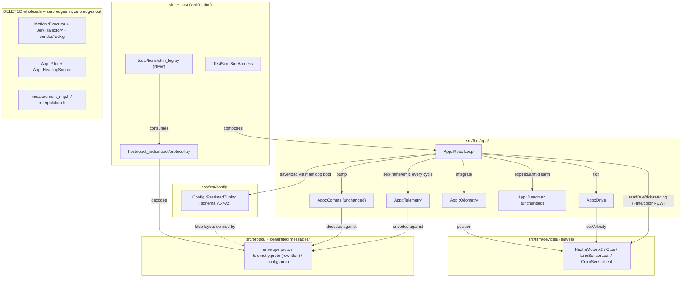
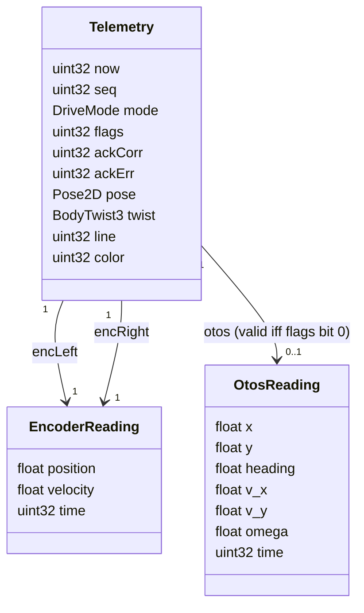

<!-- CLASI: Before changing code or making plans, review the SE process in CLAUDE.md -->

# Sprint 115: Gut S1: motion-stack excision + minimal per-cycle telemetry

## Goals

- Tag the current tree (`pre-gut-motion-stack`) and capture a baseline bench
  telemetry log (seq continuity / drop rate) for later soak comparison.
- Delete the motion stack (executor, pilot, heading_source, vendored Ruckig,
  the unused measurement-ring/interpolation scaffolding) down to a minimal
  "command controlled speed" firmware base.
- Rewrite the telemetry frame per the tightening amendment: timestamped
  `EncoderReading`/`OtosReading` objects, one `flags` bit-string, a single
  ack slot, packed `line`/`color` words — emitted **every loop iteration**
  (primary period = cycle period, 20 ms), closing the
  `kcycle-kprimaryperiod-mismatch.md` stale-label bug.
- Bump the persisted-tuning schema version 1→2 for the blob layout change
  (drop the planner slot) so old blobs don't silently misdecode.
- Do the minimum forced host touch: `protocol.py` rework, one sim-config
  file, and a new `tlm_log.py` CSV logging tool — the host-side dataset
  source all future analysis (including sprint 117's estimator) reads from.
- Verify on hardware at the stage gate: the loop runs without lockups, the
  robot drives, encoders track, and the existing deadman still neutralizes
  on host silence (S1 keeps TWIST+deadman; MOVE replaces it in sprint 116).

## Problem

Weeks of motion-control work on the executor/pilot/Ruckig stack never
produced a completing tour (turn non-termination, terminal wedge), and the
planned predict-to-now arc was pre-empted before execution. That stack —
`src/firm/motion/` (executor 914+710 lines, jerk_trajectory), `app/pilot.*`,
`app/heading_source.*`, `vendor/ruckig/` (~5,900 LOC, ~27% of the
nRF52833's flash) — is the bulk of the firmware's complexity and none of it
serves the minimal use case. Separately, the current telemetry frame is
executor-era: untimestamped flat encoder fields, a bare OTOS pose with
velocities silently dropped, nine standalone bools plus two bitmasks, an
ack ring, and a primary period that doesn't match the cycle period despite
a doc comment claiming it does — all of which undermines any future
prediction/estimation work planned on top of it.

## Solution

Delete the motion stack and ring scaffolding wholesale (the tag preserves
everything for recovery) and rebuild simplest: velocity-PID motor control,
per-cycle encoder + OTOS (+ rate-limited line/color) reads into the central
latest-value structure (`RobotLoop::frame_`), and the tightened telemetry
frame emitted every cycle. Keep the existing TWIST+deadman command surface
through this stage — it is what keeps the robot drivable at the S1 gate —
and cut it over to the bounded MOVE protocol in sprint 116. One coherent
unit (S0 tag/baseline, then S1 excision+telemetry as a single non-compiling-
in-between change), ending flashable and hardware-verified.

## Success Criteria

- Robot drives via twist commands (forward/reverse/pivot) with encoders
  tracking commanded sign and magnitude.
- The deadman still neutralizes motors within its lease after one bounded
  command then silence (unchanged in S1).
- Telemetry frame streams every cycle (~50 Hz) with per-source sample
  timestamps, OTOS velocities riding the wire, packed `line`/`color` words
  showing plausible changing values, and `flags` tracking
  status/fault/event correctly.
- `tlm_log.py` captures a drive session to CSV with per-reading timestamps.
- 10-minute soak at ≥5-10 Hz alternating commands: no reboot, seq
  monotonic at the doubled rate, drop rate at or better than the S0
  baseline, no motion-timing regression from the added sensor reads.
- Persisted-tuning version bump verified: the one-time tuning-store wipe +
  radio-channel re-pick is observed once, then a config patch survives a
  power-cycle at the new (85-byte) layout.
- `uv run python -m pytest` green on the surviving suite; `python build.py`
  builds firmware + host sim lib clean; ~164 KiB flash freed.

## Scope

### In Scope

- S0: git tag + baseline bench telemetry capture.
- S1 deletions: `src/firm/motion/`, `app/pilot.*`, `app/heading_source.*`,
  `vendor/ruckig/`, `measurement_ring.h`/`interpolation.h` + their test
  harnesses; matching CMake edits.
- Proto surgery: `envelope.proto` (delete `Move` arm 20 → reserve, delete
  `ConfigDelta.planner` → reserve 3; `Twist` arm stays through S1);
  `telemetry.proto` full rewrite per the tightening amendment; delete
  `planner.proto`/`motion.proto`; `gen_boot_config.py` planner-emission
  removal.
- Firmware: `main.cpp`/`robot_loop.{h,cpp}`/`drive.{h,cpp}`/
  `odometry.{h,cpp}`/`telemetry.{h,cpp}` reshape per the gut and amendment
  issues; rate-limited line/color reads into the frame; persisted_tuning
  version bump (1→2, 110→85-byte blob).
- Sim: strip executor/pilot/heading_source from `sim_harness.h` and the
  wire test codec.
- Host (bench-toolchain-forced minimum only): `protocol.py` decode rework,
  `sim_boot_config.py` planner-enum removal, `nezha_state.py`/
  `robot_state.py` adapter, new `src/tests/bench/tlm_log.py`.
- Test sweep: delete the ~40 executor/pilot/tour/ruckig harnesses and
  bench scripts; edit survivors (app_robot_loop, app_drive, app_telemetry,
  config_gate, persisted_tuning, sim_harness_configure, wire codec suite).
- Optional rider: `sim-loop-hook-registration-race-with-tick-thread.md` —
  a small, co-located sim-stability fix — included only if it doesn't
  jeopardize the hardware gate.

### Out of Scope

- The MOVE protocol cutover (Move arm 21, StopCondition, MoveQueue,
  deadman deletion, legacy Twist deletion) — that is sprint 116; S1
  deliberately keeps TWIST+deadman so the robot stays drivable here.
- Host motion/tour code deletion (`planner/`, `path/`, `nav/`, TestGUI
  tour/turn modules, ~30-40 files) — stays in place, dormant, as a
  separate future follow-up per the gut issue's stakeholder decision.
- Any estimator/prediction work (sprint 117) — this sprint only produces
  the dataset source (the tightened per-cycle telemetry log) that 117
  consumes.

## Test Strategy

`uv run python -m pytest` green on the surviving suite; `python build.py`
builds firmware + host sim lib clean; then the hardware gate on the stand
per `.claude/rules/hardware-bench-testing.md`: sensors alive, wheels
drive with encoders tracking, round-trip over serial, deadman
neutralize-on-silence, STOP immediate-neutral while streaming twists,
`tlm_log.py` capturing a session at ~50 Hz with plausible line/color and
OTOS velocities, a ≥10-minute soak at the doubled telemetry rate, and the
one-time tuning-store wipe + radio re-pick observed followed by a config
patch surviving a power-cycle.

## Architecture

**Substantial** — this sprint deletes four firmware subsystems
(`Motion::Executor`+`JerkTrajectory`, `vendor/ruckig`, `App::Pilot`,
`App::HeadingSource`) wholesale, rewrites the primary wire message
(`telemetry.proto`) field-for-field, removes a proto-level cross-module
dependency (`App::Drive` no longer depends on `msg::PlannerConfig`/
`Motion::*` at all), and changes the persisted-tuning data layout with a
mandatory schema-version bump. That is 3+ modules touched, a
cross-module dependency removed, and a data-model change — all three
substantial-tier signals independently, not just module count.

All facts below were verified directly against the working tree on
2026-07-21 (not inherited from the issue text unread); two small
corrections to the issues' own line-number citations are noted inline
where found.

### Architecture Overview

**Step 1 — Understand the problem.** Per
`gut-to-minimal-firmware-motion-stack-excision-move-protocol-minimal-telemetry.md`
(S0/S1) and `telemetry-frame-tightening-amendment-to-gut-s1.md`: weeks of
work on the executor/pilot/Ruckig motion stack never produced a
completing tour, and that stack is the bulk of the firmware's
complexity (~164 KiB flash, ~27% of the nRF52833) serving a use case
(closed-loop arc/segment motion) this program has decided to rebuild
later on a simpler base. Separately, the current `Telemetry` primary
frame is executor-era: untimestamped flat encoder fields, a bare OTOS
pose with velocities silently dropped, nine standalone bools plus two
bitmask fields, a 3-deep ack ring, and a primary period (40 ms) that
doesn't match the cycle period (20 ms) despite a doc comment claiming it
does. S0 (tag `pre-gut-motion-stack`) is **already done** — verified
`git merge-base --is-ancestor pre-gut-motion-stack HEAD` succeeds and
`git log pre-gut-motion-stack..HEAD -- src/` is empty: the tag points at
the current HEAD exactly, zero source drift since tagging. The other
half of S0 (a ~2-minute baseline bench telemetry capture, for later
soak drop-rate comparison) has **not** happened — it needs hardware,
which is not currently connected; it is sequenced into ticket 010 below
(see Open Questions #1).

**Step 2 — Responsibilities.** Grouped by what changes together:

- **Per-cycle orchestration** (`App::RobotLoop`) — loses the Pilot
  reference, MOVE dispatch, and pilot-event drain; gains rate-limited
  line/color polling and a reshaped telemetry-staging call. Changes for
  loop-schedule reasons only.
- **Twist-to-wheel-target conversion** (`App::Drive`) — loses its
  `PlannerConfig`-derived acceleration feedforward entirely (the whole
  reason it depended on `msg::PlannerConfig` at all); gains an ignored
  `v_y` parameter (wire-forward for sprint 116's MOVE). Changes only
  when the twist→wheel-velocity contract itself changes.
- **Dead-reckoning pose integration** (`App::Odometry`) — loses two
  Executor-only accessors (`lastDistance()`/`lastHeadingDelta()`); the
  integration math itself is untouched.
- **Wire-frame staging and emission** (`App::Telemetry`) — the data-model
  change: `Frame` reshapes around per-source timestamped readings and one
  `flags` bit-string; emission cadence changes from 40 ms to 20 ms
  (closing `kcycle-kprimaryperiod-mismatch.md`).
- **Persisted live-tuning storage** (`Config::PersistedTuning`) — the
  other data-model change: the blob drops the planner slot and the
  schema version must bump so a stale blob is detected, not
  misdecoded.
- **Wire schema** (`src/protos/*.proto` + generated `messages/*`) — the
  substrate both data-model changes ride on; also removes the `Move`
  arm (reserved, not yet used — sprint 116 reuses the number) and the
  `ConfigDelta.planner` arm, and deletes `planner.proto`/`motion.proto`
  wholesale (nothing survives S1 that needs `msg::PlannerConfig`,
  `msg::MotionSegment`, or their enums except `DriveMode`, which
  relocates into `telemetry.proto`).
- **Boot-config generation** (`src/scripts/gen_boot_config.py`) — loses
  `defaultPlannerConfig()` emission once nothing consumes
  `msg::PlannerConfig` at boot.
- **Sim lockstep** (`src/sim/sim_harness.h` +
  `src/tests/_infra/sim/support/wire_test_codec.*`) — the host-buildable
  proof that the reshaped firmware graph still runs; changes only to
  track what the app layer and wire schema removed/reshaped.
- **Host wire decode** (`src/host/robot_radio/robot/protocol.py` +
  `nezha_state.py`/`robot_state.py`) — the bench-toolchain-forced
  minimum: `pb2` regenerates from the edited protos on every build, so
  the decode side must track the new frame shape or the host doesn't
  build at all. Independent of the (dormant, untouched) host
  planner/tour code.
- **Dataset capture** (new `src/tests/bench/tlm_log.py`) — a new,
  narrowly-scoped tool: stream frames, write one CSV row per frame.
  Depends on the host decode shape above; nothing else depends on it
  (sprint 117's estimator work is a future consumer, not a peer of this
  sprint).
- **Deleted wholesale, no replacement**: `Motion::Executor` +
  `Motion::JerkTrajectory` + `vendor/ruckig`; `App::Pilot`;
  `App::HeadingSource`; the ring scaffolding
  (`measurement_ring.h`/`interpolation.h`) — never wired to a live
  consumer, permanently moot once the frame itself is the dataset.
- **Rider, co-located but functionally independent**: the `SimLoop`
  hook-registration race
  (`sim-loop-hook-registration-race-with-tick-thread.md`) — a
  same-tree-family (`sim_loop.py`/`sim_ctypes.cpp`) threading fix, zero
  dependency on the gut itself.

**Step 3 — Modules.**

#### `App::RobotLoop` — `src/firm/app/robot_loop.{h,cpp}`
**Purpose**: Orchestrates one 20 ms firmware cycle.
**Boundary**: Inside — the timing schedule (`runAndWait` blocks), the
motor request/tick interleave (verified at :579-582, unchanged — the
0x46 encoder-select latch trap this comment documents is load-bearing
and untouched by this sprint), the deadman expiry branch (verified at
:607-621, unchanged in S1 per the gut issue's own explicit carryover),
comms pump, one-command dispatch, and (new) rate-limited line/color
polling via each leaf's own `readDue()`/`tick()`/`reading()` (the same
pattern `Devices::Otos` already uses — `LineSensorLeaf`/
`ColorSensorLeaf` already implement this rate-limit internally; this
sprint only adds the call sites). Outside — PID/bus mechanics (leaves'
own job), kinematics math (`Drive`/`Odometry`'s job), wire encode/decode
(generated `messages/wire.cpp`).
**Loses**: `Pilot&` constructor param, `drainPilotEvents()`, the MOVE
dispatch case, pilot/executor/heading-source construction plumbing
(none of that lived in this file — it lived in `main.cpp`, see below).
**Serves**: SUC-045, SUC-046, SUC-047, SUC-048.

#### `App::Drive` — `src/firm/app/drive.{h,cpp}`
**Purpose**: Converts a staged body twist into per-wheel velocity
targets.
**Boundary**: Inside — `BodyKinematics::inverse()` staging onto the two
`Devices::Motor` leaves' `setVelocity()`. Outside — the kinematics math
itself, the deadman decision (the loop calls `Drive::stop()`; `Drive`
never polls `Deadman`).
**Loses**: `configure(const msg::PlannerConfig&)`, `actuationLag_`,
`a_x`/`alpha` acceleration-feedforward staging (verified: these exist
today at drive.h:41-101) — the model-feedforward term added in 112-002.
This is the module that structurally severs `App::Drive`'s dependency on
`msg::PlannerConfig`/motion machinery entirely.
**Gains**: an ignored `v_y` parameter on `setTwist()` (wire-forward;
always called with 0 through S1 — the legacy `Twist` wire message itself
is untouched, per the sprint's explicit scope boundary).
**Serves**: SUC-045.

#### `App::Odometry` — `src/firm/app/odometry.{h,cpp}`
**Purpose**: Integrates wheel motion into a world-frame dead-reckoned
pose.
**Boundary**: Unchanged except loses `lastDistance()`/
`lastHeadingDelta()` (verified at odometry.h:78-88 — doc-commented as
Executor-DISTANCE-mode-only accessors; `applyOtosSample()`, the
free-function minimal OTOS perception step in the same file pair, is
untouched).
**Serves**: SUC-045, SUC-047 (feeds the frame's always-present `pose`
field).

#### `App::Telemetry` — `src/firm/app/telemetry.{h,cpp}`
**Purpose**: Owns the outbound primary per-cycle wire frame (buffer +
cadence).
**Boundary**: Inside — `Frame` reshape (two `EncoderReading`-shaped
members, one `OtosReading` member, single `ackCorr`/`ackErr`/`ackFresh`,
one `flags` assembly point ORing status+fault+event bits, packed
`line`/`color` word staging), primary emission cadence changed from
`kPrimaryPeriod` = 40 ms to 20 ms (matching `kCycle`). Outside — deciding
*what* values go into readings (`RobotLoop`'s job via `updateTlm()`),
wire encoding itself (generated).
**Loses**: the `AckEntry` ring (depth 3), `queueDepth`/`activeId`/
`execState`/`headingSource` fields (verified present today at
telemetry.h:127-137), separate bool+bitmask staging.
**Serves**: SUC-047, SUC-048.

#### `Config::PersistedTuning` — `src/firm/config/persisted_tuning.{h,cpp}`
**Purpose**: Version-stamped, power-cycle-surviving store for the
live-pushed CFG patch fields.
**Boundary**: Unchanged shape (`TuningSnapshot`/`serializeSnapshot()`/
`deserializeSnapshot()`/`shouldWipe()`/`TuningStore`); only the field set
and byte layout change.
**Data-model change, verified**: `TuningSnapshot` drops `msg::
PlannerConfigPatch planner` (persisted_tuning.h:86). `kBlobSize` is a
computed constant (line 106-108), not a magic number: today `(2 × 6 ×
5) + (5 × 5) + (5 × 5) = 110` bytes; dropping the 5-field, 5-byte-each
planner term yields `110 − 25 = 85` bytes — **confirms the issue's own
110→85 figure exactly**. `kNumChunks` (persisted_tuning.cpp:157-158) is
`ceil((4 + kBlobSize) / 32)`: today `ceil(114/32) = 4`; after the drop,
`ceil(89/32) = 3` — **confirms the issue's own 4→3 chunk-count claim
exactly**. `kConfigSchemaVersion` (persisted_tuning.h:61) is `1` today
and must become `2` in the same commit as the blob-layout change (see
Migration Concerns).
**Serves**: SUC-049.

#### Wire schema — `src/protos/*.proto` + generated `src/firm/messages/*`
**Purpose**: Defines every wire message shape firmware and host share.
**Boundary**: `envelope.proto` — `Move` (arm 20, `CommandEnvelope.cmd`
oneof) deleted, folded into the existing `reserved 2, 3, 4, 5, 7 to 12,
14 to 18;` list on the `cmd` oneof (verified at envelope.proto:166,
176); `ConfigDelta.planner` (`PlannerConfigPatch planner = 3`, verified
at envelope.proto:150, confirming this field lives in `ConfigDelta`
inside **envelope.proto**, not config.proto, despite the issue's
prose grouping it under a "config.proto" sub-bullet — the issue's own
top-level bullet is correctly labeled "envelope.proto:" for both edits;
this is a within-issue prose-grouping note, not a factual error) deleted
and reserved. `config.proto` — the `message PlannerConfigPatch { ... }`
definition itself (verified at config.proto:155-163, the curated
5-field live-tunable subset `Config::PersistedTuning` referenced above)
deleted wholesale — this is a *different* deletion from the
`ConfigDelta.planner` *field*: one removes the oneof arm that referenced
the type, the other removes the type. `planner.proto` (verified:
defines `DriveMode`, `StopStyle`, `Origin`, `CmpOp`, `StopKind`,
`HeadingSourceMode` enums and `StopCondition`/`VelocityGoal`/`GotoGoal`/
`TurnGoal`/`DistanceGoal`/`TimedGoal`/`RotationGoal`/`StreamGoal`/
`PlannerCommand`/`PlannerState`/`PlannerConfig` messages) and
`motion.proto` (`MotionSegment` message, `MotionStatus` enum) deleted
wholesale — nothing surviving S1 needs any of it except `DriveMode`,
which relocates into `telemetry.proto` (Design Rationale D4).
`telemetry.proto` — full rewrite per the amendment issue's spec: two new
`EncoderReading`/`OtosReading` messages, a single `flags` bit-string
(absorbing all 9 booleans + `fault_bits`/`event_bits`, verified today at
telemetry.h:109-137 — matches "nine standalone bools" exactly), a single
ack slot (was depth-3 `AckEntry` ring), packed `line`/`color` `uint32`
words, clean renumber (every field ≤ 15). See the Telemetry-frame
diagram below.
**Serves**: SUC-045, SUC-047, SUC-048, SUC-049 (the substrate every one
of them rides).

#### `src/scripts/gen_boot_config.py`
**Purpose**: Generates `boot_config.cpp`'s default-value emitters from
`data/robots/*.json` against the proto-derived message shapes.
**Boundary**: Loses `defaultPlannerConfig()` emission and its planner
helper functions (verified: `msg::PlannerConfig defaultPlannerConfig()`
at gen_boot_config.py:642, plus several `PlannerConfig`-field helper
docstrings earlier in the file) — dead once `msg::PlannerConfig` no
longer exists.
**Serves**: SUC-045 (boot no longer bakes defaults for a deleted type).

#### Sim lockstep — `src/sim/sim_harness.h` + `src/tests/_infra/sim/support/wire_test_codec.*`
**Purpose**: Composes the real firmware graph against `SimPlant`
(unchanged, sprint-108-built) so the host can prove the reshaped loop
runs without hardware.
**Boundary**: `sim_harness.h` loses executor/pilot/heading-source
includes, members, `configurePlanner()`, and their accessors.
`wire_test_codec.*` loses MOVE encode/decode helpers, gains
`EncoderReading`/`OtosReading`/`flags` decode helpers matching the
rewritten frame. Optional stretch (not mandatory — see Open Questions
#4): `src/sim/sim_plant.cpp`'s `OtosPlant` models real `v_x`/`v_y`
instead of hard-zeroing them (verified: the hard-zero + explanatory
comment live at sim_plant.cpp:220-226, not exactly the issue's cited
"221-226" — off by one at the top of the comment block, same
conclusion).
**Serves**: SUC-045, SUC-047.

#### Host wire decode — `src/host/robot_radio/robot/protocol.py` + `nezha_state.py`/`robot_state.py`
**Purpose**: Decodes the wire `Telemetry` frame into the shape the rest
of the host package (TestGUI panels, tour code) already reads.
**Boundary**: Inside — nested-reading decode (`frame.enc_left.position`
etc.), single-ack gated on the `flags` bit, presence/status/fault/event
exposed as properties *derived from* `flags` (so downstream attribute
names don't change), `DriveMode` repoint from `planner_pb2` to
`telemetry_pb2`. `sim_boot_config.py` drops its
`planner_pb2.HeadingSourceMode` use (verified live today at
sim_boot_config.py:85-105). Outside — anything about what TestGUI does
with the decoded values.
**Serves**: SUC-047, SUC-048, SUC-049.

#### New: `src/tests/bench/tlm_log.py`
**Purpose**: Materializes a live telemetry stream as a CSV dataset.
**Boundary**: Inside — subscription + row assembly (every reading
field, every `time`, `flags`). Outside — how the CSV is later analyzed
(sprint 117's job).
**Serves**: SUC-047 ("the frame is the dataset").

#### Deleted wholesale (tag `pre-gut-motion-stack` preserves all of it)
- `Motion::Executor` + `Motion::JerkTrajectory` (`src/firm/motion/`) +
  `vendor/ruckig/` (~5,900 LOC, ~164 KiB flash).
- `App::Pilot` (`src/firm/app/pilot.{h,cpp}`).
- `App::HeadingSource` (`src/firm/app/heading_source.{h,cpp}`).
- Ring scaffolding: `src/firm/devices/measurement_ring.h` +
  `interpolation.h` (verified: no consumer outside their own test
  harnesses anywhere in `src/`).
- Every test harness/pytest/bench script whose only reason to exist was
  one of the above (see Tickets section for the concretely-verified
  file list; a residual grep-and-confirm is this sprint's own explicit
  acceptance step, not left to guesswork at execution time).

**Step 4 — Diagrams.**

Component/module diagram (post-S1 state; the "Deleted" cluster
carries **zero edges** to the surviving graph — that absence of edges is
the point, not an omission):

Dependency notes (the actual fan-out change, narrated since a second
before/after diagram would be redundant with the one above): today
`App::RobotLoop` depends on `Pilot&` (which itself depends on
`Executor&`/`HeadingSource&`/`Odometry&`); after this sprint that whole
chain is gone — `RobotLoop`'s fan-out drops by one direct dependency
(`Pilot`) and three transitive ones. `App::Drive` today depends on
`msg::PlannerConfig` via `configure()`; after this sprint `Drive`
depends on nothing but `Devices::Motor` and `BodyKinematics` — the one
genuine cross-module dependency *removal* in this sprint (as opposed to
deletion of a whole no-longer-referenced module). No new cross-module
dependency is introduced anywhere in this sprint; the only "new" edges
in the diagram above are `RobotLoop`→line/color leaves (already-existing
leaf classes gaining a call site, not a new module relationship) and the
sim/host verification edges (which existed in the same shape before,
just aimed at the old frame).

Telemetry-frame structure (the data-model change — not a relational
ERD, since `telemetry.proto` has no persisted entities; this shows the
message-nesting shape that replaces today's flat `enc_left`/`vel_left`/
bare-`Pose2D otos` fields):

### What Changed

- `src/firm/motion/`, `src/firm/app/pilot.{h,cpp}`,
  `src/firm/app/heading_source.{h,cpp}`, `vendor/ruckig/`,
  `src/firm/devices/measurement_ring.h`/`interpolation.h`, and their
  test harnesses deleted.
- Root `CMakeLists.txt` (ruckig `include_directories` at :245,
  `RUCKIG_SOURCES` glob/append at :303-304 — both verified exact) and
  `src/sim/CMakeLists.txt` (`RUCKIG_DIR` :26, pilot/heading_source out
  of `APP_SOURCES` :90/:92, `MOTION_SOURCES` :124-127, `RUCKIG_SOURCES`
  — verified spans lines 131-143, one line past the issue's cited
  "131-141": the issue's range covers only the 11 file entries, not the
  `set(...)`/closing-paren lines; same edit, corrected span) edited.
- `envelope.proto`, `config.proto`, `planner.proto`, `motion.proto`,
  `telemetry.proto` edited/deleted per the Modules section above.
  `src/scripts/gen_boot_config.py` loses planner emission.
- `main.cpp` (:147-161, verified exact) drops pilot/executor/
  heading-source construction. `robot_loop.{h,cpp}`, `drive.{h,cpp}`,
  `odometry.{h,cpp}`, `telemetry.{h,cpp}` reshape per the Modules
  section. Line/color reads wired into the loop at a rate-limited,
  alternating cadence using each leaf's own pre-existing `readDue()`
  pattern.
- `persisted_tuning.h`'s `TuningSnapshot`/`kBlobSize`/
  `kConfigSchemaVersion` change (85-byte blob, 3 chunks, version 2).
- `sim_harness.h`, `wire_test_codec.*` strip motion-stack references;
  optional `OtosPlant` v_x/v_y modeling.
- `protocol.py`, `nezha_state.py`/`robot_state.py`,
  `sim_boot_config.py` updated; new `tlm_log.py`.
- ~40 executor/pilot/tour/ruckig test harnesses, pytests, and bench
  scripts deleted; survivors edited for the new frame/blob shape.

### Why

Per Step 1: the deleted stack is the bulk of this firmware's complexity
and has not produced a working closed-loop motion primitive despite
sustained effort; the tag makes deletion fully recoverable, so deletion
is strictly cheaper than continued repair. The telemetry rewrite closes
a real correctness bug (the cycle/primary-period mismatch) while
reducing wire cost (~179 B worst-case → ~137 B estimated) and adding
signal (per-sample timestamps, OTOS velocities, line/color) the deleted
stack's own untimestamped, presence-flagged frame could never have fed
to future estimation work cleanly.

### Impact on Existing Components

- Every device leaf (`NezhaMotor`, `Otos`, `LineSensorLeaf`,
  `ColorSensorLeaf`) is unaffected in its own code — `LineSensorLeaf`/
  `ColorSensorLeaf` already expose the `readDue()`/`tick()`/`reading()`/
  `readingFresh()` shape this sprint's new call sites use; nothing about
  the leaves themselves changes.
- `App::Deadman`, `App::Comms`, `App::Preamble` are unaffected — the gut
  issue's own explicit carryover (deadman is the only neutralize-on-
  silence path through S1; it is deleted in S2, not here).
- `TelemetrySecondary` is untouched this sprint (Open Questions #3).
- Host `planner/`, `path/`, `nav/`, TestGUI tour/turn modules
  (~30-40 files) are **not** touched by this sprint and are expected to
  go dormant/broken (they already import `planner_pb2`/`motion_pb2`
  symbols this sprint deletes) — explicit stakeholder-scoped Out of
  Scope, tracked as a separate future follow-up, not a defect of this
  sprint.
- `docs/architecture/architecture-update-108.md`'s I2CBus/Clock
  interface split, SimPlant, and the sim ctypes ABI are all unaffected —
  this sprint's sim-tree edits are additive/subtractive within the
  established `sim_harness.h`/`SimPlant` boundary from that sprint, not
  a re-architecture of it.

### Design Rationale

**Decision 1 — Wholesale, non-compiling-in-between excision, not an
incremental strip.**
*Context*: the gut issue's own explicit framing: "S1 ... one coherent
unit; no intermediate state compiles."
*Alternatives*: (a) delete files and fix every call site as one
sequenced-but-necessarily-broken-in-the-middle unit (chosen) vs. (b)
incrementally strip call sites first (keeping the tree compiling at
every step) and delete files last.
*Why*: (b) reproduces exactly the editing surface a repair-in-place
would have needed — touching every Pilot/Executor call site carefully —
for a stack the stakeholder has already decided to discard outright, no
benefit over (a) given the tag provides full recovery. (a) is faster and
matches how this repo's own "sprint end must be testable, mid-sprint may
break anything" precedent (sprint 102's stub-main correction) already
resolved the same tension.
*Consequences*: several ticket boundaries within this sprint leave the
tree non-compiling; only ticket 009 (the green-bar/test-sweep ticket)
certifies `python build.py` clean and `pytest` green. This is
intentional, not a process gap — reviewers should not expect green CI
at every ticket boundary in this sprint.

**Decision 2 — Frame-is-the-dataset: delete ring scaffolding rather than
finish wiring it.**
*Context*: `measurement_ring.h`/`interpolation.h` exist in the tree
today but were never wired to a live consumer (verified: no reference
outside their own test harnesses).
*Alternatives*: (a) delete the rings, rely on every-cycle host-side
logging to reconstruct any window (chosen, stakeholder decision) vs. (b)
finish wiring an on-chip ring for onboard history plus a dump command.
*Why*: with a timestamped frame emitted every 20 ms, the host
reconstructs any window from the logged stream; an on-chip ring buys
nothing the wire doesn't already carry, at a real flash/complexity cost.
*Consequences*: `tlm_log.py`'s CSV becomes the sole dataset-construction
path (sprint 117 depends on it existing and being correct); there is no
on-chip diagnostic replay if a host log is lost mid-session.

**Decision 3 — The config-schema version bump is mandatory in the same
commit as the blob-layout change, never split across commits.**
*Context*: verified `kConfigSchemaVersion` (persisted_tuning.h:61) is a
version-compare-and-wipe gate; `kBlobSize` (line 106-108) is a computed
constant that would silently shrink the moment the planner term is
dropped from `TuningSnapshot`.
*Alternatives*: (a) bump `kConfigSchemaVersion` 1→2 in the same commit as
the `TuningSnapshot` field drop (chosen, mandatory per the issue) vs. (b)
land the layout change first, bump the version in a fast-follow commit.
*Why*: (b) has a real window where `load()` deserializes an old 110-byte
blob's bytes into the new 85-byte layout — the OTOS-calibration section
now reads bytes that used to be the planner term's floats: memory-safe
(fixed-size array, no OOB) but a silent, wrong config value applied on
boot, strictly worse than a clean wipe.
*Consequences*: verified, expected first-boot side effect — the version
mismatch wipes the **entire** `KeyValueStorage`, including the
co-located radio-channel key (a different subsystem's persisted value,
sharing the same 5-key store), so a one-time radio-channel re-pick is
expected and belongs in the bench checklist, not treated as a
regression if observed.

**Decision 4 — `DriveMode` relocates into `telemetry.proto`, not a new
standalone enums file.**
*Context*: `DriveMode` (verified: `planner.proto:13`) is used by
`Telemetry.mode`; once `planner.proto` is deleted wholesale, something
must still declare it.
*Alternatives*: (a) move `DriveMode` into `telemetry.proto` (chosen) vs.
(b) create a new minimal `enums.proto`.
*Why*: `telemetry.proto` is the only remaining consumer; a new file for
one small enum is unwarranted indirection with no other consumer to
justify a shared location.
*Consequences*: any future proto needing `DriveMode` imports
`telemetry.proto` for it; the host's `DriveMode` repoint
(`planner_pb2`→`telemetry_pb2`) is a forced, mechanical consequence of
this choice, not a separate design decision.

**Decision 5 — The legacy `Twist` wire message stays completely
untouched through S1; only `Drive::setTwist()`'s own C++ signature widens.**
*Context*: sprint scope explicitly keeps TWIST+deadman as the drivable
surface through S1 (S2, sprint 116, replaces it with MOVE).
*Alternatives*: (a) leave `Twist` (the proto message and its
`RobotLoop` handler) untouched, only add an ignored `v_y` parameter to
`Drive::setTwist()`'s C++ signature (chosen) vs. (b) also add a `v_y`
field to the wire `Twist` message now, ahead of MOVE.
*Why*: (b) would touch the wire contract for a value nothing on the wire
yet supplies (no host client sends it), and blurs this sprint's own
explicit Out-of-Scope boundary around the MOVE cutover.
*Consequences*: `v_y` is always 0 through every call site in S1; it
becomes live only when sprint 116's `MoveTwist` decoder wires a real
value in.

**Decision 6 — Host-side edits stay at the bench-toolchain-forced
minimum; the dormant host planner/tour code is not touched.**
*Context*: stakeholder decision (2026-07-21), and the gut issue's own
explicit Out-of-Scope framing.
*Alternatives*: (a) edit only what `pb2` regeneration structurally
forces — `protocol.py`, the two state adapters, `sim_boot_config.py`,
plus the new `tlm_log.py` (chosen) vs. (b) also delete/rewire the host
`planner/`/`path/`/`nav/`/TestGUI tour code in the same sprint, since it
is about to reference deleted proto symbols anyway.
*Why*: (b) is a materially larger, separately-scoped decision the
stakeholder has explicitly deferred; taking it on here would override
that deferral without cause — this sprint's own critical path (firmware
compiles, telemetry is correct, the robot drives) does not require it.
*Consequences*: `planner/`, `path/`, `nav/`, and TestGUI tour/turn
modules remain in the tree, dormant and likely import-broken after this
sprint (they reference `planner_pb2`/`motion_pb2` symbols this sprint
deletes) — tracked as a known, accepted, separate future follow-up, not
a defect introduced by this sprint.

**Decision 7 — The `SimLoop` hook-registration race rides this sprint as
ticket 001, not a further-deferred future sprint.**
*Context*: filed during 111-002 triage, not reproducible on demand,
touches `sim_loop.py`/`sim_ctypes.cpp` — files whose neighboring code
(`sim_harness.h`, the sim CMake list) this sprint already edits for
unrelated reasons; the issue's own frontmatter already reserves ticket
`115-001`.
*Alternatives*: (a) land the suggested fix — route
`set_read_hook()`/`set_write_hook()` through the existing
`_call_on_tick_thread()` seam, matching every other `SimLoop` mutator
(chosen) vs. (b) defer again.
*Why*: same file family as this sprint's own sim-tree edits; fixing now
avoids a future sprint re-deriving the same suspected mechanism from
scratch.
*Consequences*: fixed by code-path correctness (matches the module's own
documented threading invariant), not by reproducing the original crash
— no reliable repro exists to verify against (see Open Questions #5).

### Migration Concerns

- **Persisted-tuning blob**: verified mandatory — `kConfigSchemaVersion`
  1→2 lands in the same commit as the `TuningSnapshot` field drop (blob
  110→85 bytes, chunks 4→3). Expected, documented first-boot side
  effect: the whole `KeyValueStorage` wipes, including the radio-channel
  key, producing a one-time radio re-pick — this is the bench
  checklist's own explicit step, not a regression.
- **Wire schema**: `envelope.proto`'s `Move` (20) and `ConfigDelta.
  planner` (3) numbers are `reserved`, never reused — MOVE-era firmware
  has not shipped to real hardware yet (`Move` was declared but this
  sprint deletes it before any client used it), so this reservation is
  precautionary discipline, not recovery of a deployed contract.
  `telemetry.proto` is a **clean, non-reserved renumber** (per the
  amendment issue's own explicit decision) — firmware and this repo's
  host `pb2` co-deploy at every bench session, so there is no external
  client whose field numbers must be preserved.
- **Deployment sequencing**: none beyond the standard bench gate — S1 is
  one flashable, hardware-verified unit; there is no partial-deploy
  state a device could be caught in (firmware and its `pb2`-generated
  host counterpart are built from the same commit).
- **Flash budget**: ~164 KiB freed (Ruckig + executor + jerk-trajectory
  removal), not independently re-verified here (build-time number,
  confirmed by ticket 009's `python build.py` acceptance step).

### Open Questions

1. **S0's baseline bench telemetry capture is still pending** — the tag
   exists with zero source drift since tagging (verified), but the
   ~2-minute reference log for later soak drop-rate comparison requires
   hardware, which is absent today. Sequenced as the *first* step of
   ticket 010 (the hardware-gate ticket), captured on the current
   pre-S1 image **before** flashing the S1 build — order matters, a
   baseline captured on the post-gut image is not a baseline. If
   hardware remains absent at execution time, this step is written into
   the stakeholder checklist document in explicit before/after order.
2. **The reshaped `Telemetry` frame's real worst-case size** (the
   amendment issue's own `gen_messages.py` verification step) is not yet
   measured — ~137 B is the issue author's estimate. Ticket 003 (the
   proto-rewrite ticket) must record the real, build-measured number in
   `telemetry.proto`'s own header comment per the amendment issue's
   Verification section; not blocking, but not yet done.
3. **`TelemetrySecondary`'s `ts_left`/`ts_right` fields are now
   redundant** (velocity moved inside `EncoderReading`) but the amendment
   issue says "prune opportunistically if touched" — no ticket in this
   sprint touches `TelemetrySecondary`, so the prune is explicitly
   **deferred**, not silently dropped or forgotten.
4. **`OtosPlant`'s v_x/v_y physics modeling** (currently hard-zeroed,
   sim_plant.cpp:220-226) is an *optional* stretch item inside ticket
   006, not a mandatory deliverable — if it slips, `OtosReading.v_x`/
   `v_y` still ride the wire correctly (0 in sim, real on hardware); this
   is called out so ticket 006's acceptance criteria don't accidentally
   treat it as required.
5. **The `SimLoop` hook-race fix (ticket 001, Decision 7) has no
   reliable repro** — it is verified by code-path correctness against
   the module's own documented threading invariant, not by a before/after
   crash reproduction. If the original race mechanism turns out to be
   something other than the suspected one, this fix could land without
   actually closing the issue; flagging so a future recurrence isn't
   mistaken for "already fixed, must be something else."

## Use Cases

Five sprint-level use cases (SUC-045 through SUC-049 — the project's
prior high-water mark is SUC-044, `docs/architecture/architecture-update-108.md`,
verified by grep across `docs/architecture/*.md`), sized to a substantial
sprint. Parents are drawn from `docs/usecases.md`'s existing UC catalog,
which predates protocol v2 (its own command syntax, e.g. `S+LS+RS`, is
stale) — parented for thematic intent, not wire-syntax match.

### SUC-045: Drive via TWIST on the minimal command-controlled-speed base
Parent: UC-001

- **Actor**: Python host
- **Preconditions**: Robot firmware is running S1's rebuilt loop (no
  executor/pilot/heading-source in the call graph); serial connection
  established.
- **Main Flow**:
  1. Host sends a `Twist` command (unchanged wire message) with a
     forward, reverse, or pivot body twist.
  2. `RobotLoop` decodes it, stages it onto `App::Drive` via
     `setTwist(v_x, omega)` (`v_y` always 0 through S1).
  3. `Drive::tick()` converts the twist to per-wheel velocity targets via
     `BodyKinematics::inverse()` and stages them onto the two
     `NezhaMotor` leaves — no acceleration feedforward term (that
     depended on the now-deleted `msg::PlannerConfig`).
  4. The velocity-PID leaves drive the wheels; encoders track commanded
     sign and magnitude.
- **Postconditions**: Both wheels run at the commanded velocity;
  `App::Odometry` accumulates a dead-reckoned pose from the resulting
  encoder deltas.
- **Acceptance Criteria**:
  - [ ] Forward, reverse, and pivot twist commands each produce encoder
        tracking of the correct sign and roughly-proportional magnitude
        (sim and hardware).
  - [ ] `App::Drive` has zero remaining dependency on `msg::PlannerConfig`
        or any `Motion::*` type (grep-verifiable after ticket 003/005).
  - [ ] `python build.py` builds firmware + host sim lib clean with the
        motion stack absent.

### SUC-046: Deadman neutralizes on host silence (unchanged carryover)
Parent: UC-004

- **Actor**: Robot firmware (autonomous safety behavior, no host action)
- **Preconditions**: A bounded `Twist`/`ConfigDelta` command has been
  accepted; `App::Deadman` is armed with the fixed lease.
- **Main Flow**:
  1. Host goes silent (no further command) for longer than the deadman
     lease.
  2. `RobotLoop`'s deadman-expiry branch (verified unchanged at
     robot_loop.cpp:607-621) observes `deadman_.expired()`.
  3. `drive_.stop()` zeroes both wheel targets; `deadman_.disarm()` resets
     the one-shot latch.
- **Postconditions**: Motors are neutral; the frame's `flags` bit 10
  (event: deadman expired) is set for the transition cycle only.
- **Acceptance Criteria**:
  - [ ] One bounded command followed by silence neutralizes motors within
        the lease, on both sim and hardware.
  - [ ] This code path is verified **unchanged** by this sprint (no
        ticket touches deadman.{h,cpp} or the expiry branch's logic) —
        acceptance is regression-only, not new behavior.

### SUC-047: Per-cycle tightened telemetry is the analysis dataset
Parent: UC-005

- **Actor**: Python host (`tlm_log.py`, TestGUI panels)
- **Preconditions**: Firmware is running the rewritten `telemetry.proto`
  frame; host `protocol.py` decodes it.
- **Main Flow**:
  1. Every 20 ms loop iteration, `RobotLoop::updateTlm()` stages a fresh
     `EncoderReading` per wheel (position, velocity, collect-time) and an
     `OtosReading` (x, y, heading, v_x, v_y, omega, burst-read-time) when
     fresh.
  2. `App::Telemetry` assembles one `flags` bit-string (status + fault +
     event bits) and emits the frame — primary period now equals the
     cycle period (20 ms, was 40 ms).
  3. Host `protocol.py` decodes the nested readings and flags-derived
     properties; `tlm_log.py` appends one CSV row per frame.
- **Postconditions**: A drive session is fully reconstructable from the
  CSV log — per-reading timestamps, OTOS velocities, sequence continuity.
- **Acceptance Criteria**:
  - [ ] Frame rate ≈ 50 Hz (every cycle) on hardware.
  - [ ] `EncoderReading`/`OtosReading` sample times are monotonic and
        consistent with the frame's own `now`.
  - [ ] `tlm_log.py` captures a drive session to CSV with per-reading
        timestamps (sim round-trip test, then hardware gate).
  - [ ] `gen_messages.py`'s measured worst-case frame size is recorded in
        `telemetry.proto`'s header comment (Open Questions #2).
  - [ ] 10-minute soak: seq monotonic at the doubled rate, drop rate at
        or better than the S0 baseline, no motion-timing regression.

### SUC-048: Line/color sensors gain a live telemetry consumer
Parent: UC-008

- **Actor**: Robot firmware (`RobotLoop`), Python host (decode)
- **Preconditions**: Line/color drivers already detect presence at boot
  (`Preamble`, unchanged); their own `readDue()`/`tick()` rate-limiting
  already exists (verified: `LineSensorLeaf`/`ColorSensorLeaf` both
  implement this pattern today, mirroring `Devices::Otos`).
- **Main Flow**:
  1. `RobotLoop` calls each leaf's `tick()` at a rate-limited, alternating
     cadence (at most one of the two per cycle — never both, per the
     098-004 per-pass-read regression precedent).
  2. A fresh reading packs into the frame's `line` (4 channels, 1 byte
     each) or `color` (RGBC, 8 bits each) `uint32` word; the
     corresponding `flags` bit (13 or 14) sets for that frame.
  3. Host `protocol.py` decodes the packed words into per-channel values.
- **Postconditions**: `line`/`color` show plausible, changing values
  during a bench session; no motion-timing regression from the added
  bus reads.
- **Acceptance Criteria**:
  - [ ] `line`/`color` packed words decode to 4 plausible, changing
        channel values on hardware (bench sensors-alive gate).
  - [ ] At most one of {line, color} is read per cycle — verified by
        code inspection, not just observed behavior.
  - [ ] No motion-timing regression from the added reads (soak gate,
        shared with SUC-047).

### SUC-049: Persisted-tuning survives the schema bump and layout change
Parent: UC-014

- **Actor**: Robot firmware (boot sequence), Python host (CONFIG patch)
- **Preconditions**: A device previously ran S1-era-or-earlier firmware
  with a stored tuning blob at schema version 1.
- **Main Flow**:
  1. Boot loads the stored `(version, blob)` pair.
  2. `shouldWipe(storedVersion=1, currentVersion=2)` returns true (the
     mandatory version bump from Design Rationale, Decision 3).
  3. `MicroBitTuningStore::wipe()` erases the entire `KeyValueStorage`
     (including the co-located radio-channel key — expected side
     effect).
  4. Host observes a one-time radio re-pick; sends a live `ConfigDelta`
     patch (e.g. motor gains); firmware persists it at the new 85-byte,
     3-chunk layout.
  5. Power cycle; the patch reapplies from the new-layout blob.
- **Postconditions**: No silent misdecode of the old blob's bytes; the
  new layout round-trips across a power cycle.
- **Acceptance Criteria**:
  - [ ] `deserializeSnapshot(serializeSnapshot(s))` round-trips exactly
        for the 85-byte layout (host-testable, no hardware).
  - [ ] On hardware: the one-time wipe + radio re-pick is observed once,
        then a config patch survives a power cycle at the new layout.
  - [ ] `kConfigSchemaVersion == 2` and `kBlobSize == 85` are asserted by
        a test, not just true by inspection.

## GitHub Issues

(GitHub issues linked to this sprint's tickets. Format: `owner/repo#N`.)

## Definition of Ready

Before tickets can be created, all of the following must be true:

- [ ] Sprint planning document is complete (sprint.md, including its
      Architecture and Use Cases sections)
- [ ] Architecture review passed (or skipped, for changes with no
      architectural impact)
- [ ] Stakeholder has approved the sprint plan

## Tickets

Created (`stakeholder_approval` recorded — blanket program approval,
2026-07-21 — phase advanced to `ticketing`; all 10 tickets below exist
in `tickets/`, status `open`).

| # | Title | Depends On | Issue back-ref | Use cases |
|---|-------|------------|-----------------|-----------|
| 001 | Rider: fix `SimLoop` hook-registration race (route `set_read_hook`/`set_write_hook` through `_call_on_tick_thread`) | — | `sim-loop-hook-registration-race-with-tick-thread.md` | SUC-045 |
| 002 | Delete motion stack + ring scaffolding; build-system edits (root `CMakeLists.txt`, `src/sim/CMakeLists.txt`); delete matching unit/system test harnesses | — | — (see note below) | SUC-045 |
| 003 | Proto surgery: `envelope.proto` (Move/ConfigDelta.planner reserve), `config.proto` (delete `PlannerConfigPatch`), delete `planner.proto`/`motion.proto`, full `telemetry.proto` rewrite, `gen_boot_config.py` planner-emission removal; record measured frame size | 002 | `telemetry-frame-tightening-amendment-to-gut-s1.md` | SUC-045, SUC-047, SUC-048, SUC-049 |
| 004 | Persisted-tuning schema bump: drop planner slot from `TuningSnapshot`, bump `kConfigSchemaVersion` 1→2, update/extend `persisted_tuning_harness.cpp`/`test_persisted_tuning.py` for the 85-byte/3-chunk layout | 003 | — (see note below) | SUC-049 |
| 005 | Firmware app-layer reshape: `main.cpp`, `robot_loop.{h,cpp}`, `drive.{h,cpp}`, `odometry.{h,cpp}`, `telemetry.{h,cpp}`; wire rate-limited alternating line/color reads into the frame | 003 | `telemetry-frame-tightening-amendment-to-gut-s1.md` | SUC-045, SUC-046, SUC-047, SUC-048 |
| 006 | Sim lockstep: strip `sim_harness.h`, `wire_test_codec.*`; optional `OtosPlant` v_x/v_y modeling (stretch, Open Questions #4) | 005 | — (see note below) | SUC-045, SUC-047 |
| 007 | Host protocol touch-up: `protocol.py` decode rework + `DriveMode` repoint, `nezha_state.py`/`robot_state.py` adapters, `sim_boot_config.py` planner-enum removal | 006 | `telemetry-frame-tightening-amendment-to-gut-s1.md` | SUC-047, SUC-048, SUC-049 |
| 008 | New `src/tests/bench/tlm_log.py`: stream frames → CSV, one row per frame | 007 | — (see note below) | SUC-047 |
| 009 | Test-suite sweep + green bar: delete remaining executor/pilot/tour/ruckig-dependent harnesses/pytests/bench scripts (grep-and-confirm residual references); edit survivors for the new frame/blob shape; `uv run python -m pytest` green; `python build.py` clean; confirm ~164 KiB flash freed | 008 | `telemetry-frame-tightening-amendment-to-gut-s1.md` | SUC-045, SUC-047, SUC-048, SUC-049 |
| 010 | Hardware bench gate: capture S0 baseline (if not already captured) on the pre-S1 image, then deploy/drive/deadman/STOP/`tlm_log.py`/10-min soak/tuning-wipe+radio-repick per the gut issue's Verification list. If hardware is absent at execution time, produce `docs/bench-checklists/sprint-115-gut-s1.md` (sprint-114 precedent) instead, and say so honestly in completion notes | 009 | `telemetry-frame-tightening-amendment-to-gut-s1.md` | SUC-045, SUC-046, SUC-047, SUC-048, SUC-049 |

Tickets execute serially in the order listed.

**Linkage decision (team-lead, 2026-07-21)**: the gut issue
(`gut-to-minimal-firmware-motion-stack-excision-move-protocol-minimal-telemetry.md`)
stays linked to sprint 116 — it spans 115+116 and completes at S2 (the
MOVE cutover); linking it to 115 would archive it at 115's close,
mid-arc (known CLASI behavior: sprint close entombs linked issues).
Tickets 002/004/006/008 intentionally carry **no** `issue:` back-ref;
each ticket's own body text cites the gut issue as its spec of record
instead. `link_sprint_issues`/`add_issue_ref` were deliberately not
called against it for sprint 115.
