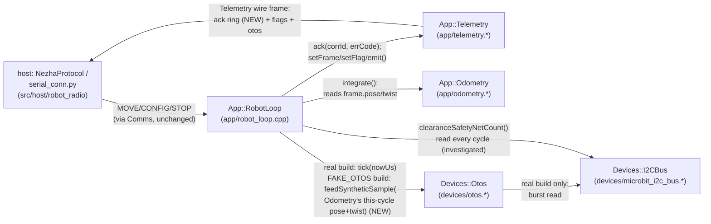

<!-- CLASI: Before changing code or making plans, review the SE process in CLAUDE.md -->

# Sprint 120: Bench tour bring-up with fake OTOS

## Goals

Stakeholder directive (2026-07-23, overnight, auto-approved): close the
gap between the current bench state (v0.20260723.2, robot on the stand)
and a tour actually closing on the bench, using the bench's own
observability and OTOS-substitution needs — not the table. Three
phase-B issues filed overnight are the sprint's exact scope: (1) the
single telemetry ack slot loses transient acks at the 40ms cycle, which
corrupts bench measurement itself; (2) there is no on-chip fake OTOS, so
`frame.otos` is useless for verifying tour closure on a stand where the
wheels spin free and the robot never translates; (3) the I2C safety-net
fault bit (`flags` bit 6) asserts every cycle, contradicting 118-001's
own predicted fix, and needs a real diagnosis. This sprint fixes (1),
builds (2) as a build-selectable bench variant (real OTOS stays the
table path, per the stakeholder's own framing: "when we put it on the
table, you're actually using the real one"), and investigates (3) to
either a fix or a corrected acceptance claim. It closes with an actual
bench tour driven and observed on the real robot, on the stand.

## Problem

Three independent bench-observability defects, each blocking or
corrupting the bench's ability to verify a tour closes:

1. **Ack observability collapses at the 40ms cycle.** `Telemetry`
   carries one ack slot (`ack_corr`/`ack_err`); a second command's ack
   inside the same primary period silently overwrites the first, and at
   ~15Hz host read against a 25Hz (40ms) emit rate, a transient
   enqueue/STOP/CONFIG ack has real, measured odds of never being
   observed. `move_protocol_bench.py` is 31/43 (every FAIL a missed
   transient ack, every functional behavior — moves, completions,
   timeout, drain, preempt, STOP-flush — correct). Worse: this actively
   corrupts bench MEASUREMENT harnesses, not just the gate (a team-lead
   turn-accuracy capture lost 3/6 enqueue acks, each miss cascading into
   a garbage heading reading).
2. **`frame.otos` is real but useless on a stand.** The real OTOS chip is
   genuinely present, connected, and read every cycle (a premise
   correction from earlier, wrong triage) — but on the stand the wheels
   spin free and the robot doesn't translate, so the real OTOS reports a
   near-static pose while the encoders count. There is no way to verify,
   through the OTOS-present path the table build actually uses, that a
   bench tour tracks its commanded path.
3. **The I2C safety-net fault bit reads wrong, or the schedule fix
   didn't take.** `kFlagFaultI2CSafetyNet` (bit 6) is set on every frame,
   idle AND driving (45/45, 23/23) — contradicting 118-001's own
   before/after acceptance claim that the loop-schedule restore would
   clear it while driving. Either the interleave fix is genuinely
   incomplete for the real bus schedule, or the bit's own derivation
   (a cumulative trip counter checked `> 0`, never reset after boot) is
   latching on a single one-shot boot-time trip and has nothing to do
   with ongoing bus health. Nobody has confirmed which.

## Solution

1. **Ack FIFO (ticket 1, first — bench measurement of everything else in
   this sprint depends on it).** Replace `Telemetry`'s single ack slot
   with a small, bounded ack ring (depth 4) so a host reading at ~15Hz
   still drains every transient ack, including rapid-fire bursts. This is
   not a new pattern for this codebase — pre-115 `Telemetry` carried a
   depth-3 `AckEntry` ring that 115-005 intentionally collapsed to one
   slot when ack cadence was assumed low; bench evidence at the current
   40ms/rapid-fire cadence shows that assumption no longer holds. The
   wire change is additive (existing `ack_corr`/`ack_err` unchanged
   for any reader that only wants the freshest ack; a new repeated field
   carries the ring).
2. **Build-selectable fake OTOS (ticket 2, the headline).** Add a
   compile-time seam so a bench-flashed image can report a synthetic
   `frame.otos` pose+twist derived from the SAME encoder-kinematics
   forward-integration `App::Odometry` already computes every cycle,
   through the identical `Devices::Otos` type and the identical
   `pose()`/`poseFresh()`/`present()`/`connected()` interface every
   downstream consumer (bench verification today; `App::StateEstimator`'s
   quarantined fusion path later) already reads. The table build is
   byte-for-byte unchanged — real `Devices::Otos` reads the real chip
   exactly as it does today.
3. **I2C safety-net investigation (ticket 3, parallel-independent).**
   Use pyOCD/DBG (`.claude/rules/debugging.md`) to determine, on real
   hardware, whether `MicroBitI2CBus::clearanceSafetyNetCount()` climbs
   DURING driving (a genuine ongoing bus-timing defect) or is flat after
   one boot-time increment (a latched, cumulative `> 0` check with
   nothing to do with runtime health — `resetStats()` exists but is
   never called in production, which is the leading candidate).
   Deliverable is a diagnosis, plus either a firmware fix or a corrected
   acceptance claim in 118-001's own record — not a guessed change.

All three tickets are exercised on the real robot, on the stand, before
this sprint closes — this sprint IS the bench session, not a deferral to
one.

## Success Criteria

- `move_protocol_bench.py` reaches 43/43 on hardware; a rapid-fire
  N-enqueue test surfaces all N acks.
- A bench tour driven through the fake-OTOS build shows `frame.otos`
  tracking the commanded path, and closes within a stated band, verified
  over the real serial link on the stand.
- The I2C safety-net fault bit's behavior is understood and documented:
  either it now clears during driving (fixed) or its steady "stuck since
  boot" behavior is confirmed benign and 118-001's acceptance claim is
  corrected to say so.
- All three tickets exercised on the real robot on the stand
  (`.claude/rules/hardware-bench-testing.md`'s standing verification
  gate), with results recorded in each ticket.

## Scope

### In Scope

- Ack FIFO: wire change (`telemetry.proto`, `docs/protocol-v4.md`),
  firmware ack-ring implementation (`app/telemetry.{h,cpp}`), host decode
  + ack-ring matcher (`src/host/robot_radio/io/serial_conn.py` and
  whatever else reads `ack_corr`/`ack_err` today).
- Build-selectable fake OTOS: a new synthetic-sample seam on
  `Devices::Otos` (`devices/otos.{h,cpp}`), a build macro, and the one
  call-site branch in `RobotLoop::cycle()` (`app/robot_loop.cpp`) that
  feeds it from that cycle's already-computed odometry pose/twist instead
  of calling the real `tick()`.
- I2C safety-net fault bit: diagnosis via on-chip debugging; a fix in
  `devices/microbit_i2c_bus.{h,cpp}` and/or `app/robot_loop.cpp` IF the
  diagnosis finds a real defect; otherwise a corrected acceptance record.
- Real-hardware bench verification of all three, robot on the stand.

### Out of Scope

- `App::StateEstimator` OTOS-fusion weights staying live-tunable but
  volatile (unrelated, already an open item in `app/DESIGN.md` §6) —
  this sprint gives the estimator a meaningful synthetic `frame.otos` to
  eventually fuse against, but does NOT raise its fusion weights off
  0.0 or wire it into motion. That is explicitly future work.
- `src/sim`/`SimPlant` — the host simulator already synthesizes an OTOS
  reading from ground truth via its own `OtosPlant` (a different, older,
  host-side mechanism serving a different purpose: no real chip exists in
  sim at all). This sprint's fake OTOS is an ARM-only, on-chip capability
  closing a gap that only exists on real hardware; no `src/sim` change is
  needed or made.
- The host-side TLM-rate issue (`tlm-rate-15-19hz-vs-50hz-nominal-serial.md`,
  `related:` on the ack-slot issue) — a real, adjacent defect (host reads
  ~15 frames/s against a 25Hz emit rate) but a distinct root cause with
  its own scope; the ack FIFO's depth (4) is sized to tolerate today's
  ~15Hz read rate without requiring that issue's fix.
- Reviving `HeadingSource`, any heading-source policy, or a trajectory
  controller consuming the estimator's predictions — all explicitly
  future work per 117's own scope note, unchanged by this sprint.
- A runtime (as opposed to build-time) real/fake OTOS toggle. Per the
  stakeholder's own framing ("when we put it on the table, you're
  actually using the real one"), this is a build variant selected before
  flashing, not a live wire command.

## Test Strategy

Unit/sim coverage where it applies (ack-ring push/drain logic, host
decode of the new repeated field, the synthetic-sample seam's pure
computation), but the sprint's real gate is hardware, per
`.claude/rules/hardware-bench-testing.md`: every ticket is deployed to
the robot on the stand and exercised over the real serial link
(`/dev/cu.usbmodem2121102`) before being called done.

- Ticket 1: `move_protocol_bench.py` (target 43/43) and a new rapid-fire
  N-enqueue scenario, both on hardware; confirm `twist_drive.py`'s
  previously-missed `stop()` ack now lands.
- Ticket 2: a bench tour run through the FAKE_OTOS build, `tlm_log.py`
  or equivalent capturing `frame.otos` alongside encoder-derived pose,
  confirming the two track each other within a stated band, and that a
  tour closes; a second confirmation that the table (real-OTOS) build's
  behavior is provably unchanged (a bit-for-bit diff of the real path's
  compiled behavior, or an equivalent unit/sim regression).
- Ticket 3: pyOCD/DBG session per `.claude/rules/debugging.md`, comparing
  `clearanceSafetyNetCount()`'s raw value idle vs. driving, boot vs.
  steady-state, and (if useful) OTOS-tick-present vs. skipped — the
  ticket 2 FAKE_OTOS build is a convenient, already-available way to
  produce that last comparison, though ticket 3 does not depend on
  ticket 2 to run its own investigation.

## Architecture

**Substantial** — this sprint touches 5 modules across two declared
design-doc roots (`App::Telemetry`, `App::Odometry`, `App::RobotLoop`,
`Devices::Otos`, `Devices::I2CBus` in `src/firm`; the host wire-decode/
ack-matcher path in `src/host/robot_radio`), introduces a new
cross-module data flow (`RobotLoop` feeding `Odometry`'s per-cycle output
into `Otos` — a call-site relationship that does not exist today), and
changes the wire data model (`Telemetry`'s ack section grows from two
scalar fields to a bounded repeated ring). Any one of these three signals
(module count, new cross-module dependency, data-model change) already
crosses the substantial threshold; all three hold here. Full 7-step
methodology, diagram included.

### Step 1 — Understand the Problem

Three independent bench-observability defects (Problem, above), each
blocking or corrupting bench verification of a tour closing. None of the
three is a new feature in the product sense — all three are instruments
the bench needs to trust its own measurements and to substitute for a
sensor the stand cannot exercise physically.

### Step 2 — Identify Responsibilities

- **Reliable per-command ack delivery under the real cadence.** Today's
  single ack slot is a lossy channel at 40ms/rapid-fire rates. Changes
  independently of the other two — pure wire/telemetry-assembly concern.
- **Reporting a bench-meaningful OTOS pose without the real chip's
  physical limitation.** The real chip is present, connected, and
  correctly read — the gap is that its physical truth (near-static on a
  stand) is not what the bench needs to verify. Changes independently —
  a device-leaf/composition concern, orthogonal to ack delivery.
- **Determining whether the I2C safety-net fault bit reflects live bus
  health or a latched boot-time artifact.** Changes independently of the
  other two, and may resolve to "no code change, corrected claim" rather
  than a fix — a genuinely different shape of outcome than the other two
  tickets.

These three responsibilities share no state and no call-site overlap
except that all three touch `App::RobotLoop::cycle()`'s per-cycle
schedule (ack emission, the Otos call, and the `flags` bit assembly are
all steps in the same existing cycle) — that shared touch point is why
`RobotLoop` appears as a module below even though none of its own
responsibilities are new.

### Step 3 — Subsystems and Modules

- **`App::Telemetry`** (`app/telemetry.{h,cpp}`) — Purpose: assembles and
  emits the robot's one outbound per-cycle status frame. Boundary: owns
  frame staging, the `flags` bit-string, and (after this sprint) a
  bounded ack ring; does not decide command semantics — `RobotLoop` still
  calls `ack(corrId, errCode)` at each dispatch site. Serves: SUC-069.
- **`Devices::Otos`** (`devices/otos.{h,cpp}`) — Purpose: reports the
  robot's OTOS-sourced pose to the rest of the firmware. Boundary: owns
  the `pose()`/`poseFresh()`/`present()`/`connected()` contract and (real
  build) the chip's register map; gains a synthetic-sample path for the
  bench build that still speaks the identical contract. Never reaches
  into `Odometry` or any `app/` type (devices isolation invariant
  unchanged). Serves: SUC-070.
- **`App::RobotLoop`** (`app/robot_loop.cpp`) — Purpose: owns the cycle's
  timing and wires device leaves to app-level state, unchanged in kind by
  this sprint. Boundary: the one place both `Odometry`'s fresh pose/twist
  and `Otos`'s feed method are simultaneously in scope — the sole new
  call site (one macro-gated branch) lives here, not in `Otos` or
  `Odometry` themselves. Also the sole reader of
  `I2CBus::clearanceSafetyNetCount()`. Serves: SUC-070 (integration
  point), SUC-071 (owns the flags-bit assembly this ticket investigates).
- **`Devices::I2CBus`** (`devices/microbit_i2c_bus.{h,cpp}`) — Purpose:
  tracks and exposes shared-bus clearance-timing health. Boundary: a
  diagnostic counter and a non-spinning wait primitive; no policy about
  what a caller does with the count (unchanged this sprint pending
  diagnosis). Serves: SUC-071.
- **`src/host/robot_radio` wire-decode/ack-matcher path**
  (`io/serial_conn.py`'s `wait_for_ack()`/frame decode,
  `robot/protocol.py`'s `NezhaProtocol`) — Purpose: decodes and
  correlates the robot's binary telemetry/ack wire format for host
  callers. Boundary: pure decode/match over the wire schema; no firmware
  knowledge beyond the schema itself. Serves: SUC-069.

The wire schema itself (`src/protos/telemetry.proto`,
`docs/protocol-v4.md`) is the contract these last two modules implement,
not a module with its own behavior — shown as an edge label below, not a
box.

### Step 4 — Diagrams

Component diagram required: 3+ modules touched AND a new cross-module
data flow (`RobotLoop` → `Otos`, synthetic feed) are both present.

No ERD: no relational/persisted entity changes (the wire ring is a
bounded in-memory buffer, not a stored entity). No separate dependency
graph: the diagram above already shows every touched edge, and no
dependency DIRECTION changes this sprint — `Otos` still never depends on
`Odometry` or any `app/` type; `RobotLoop` still depends downward on
`devices/` only, never the reverse.

### Step 5 — What Changed / Why / Impact / Migration Concerns

**What Changed**

- `App::Telemetry`: single `ackCorr_`/`ackErr_` pair replaced by a small
  bounded ring (depth 4); `ack()` pushes, `emit()` serializes the ring's
  current contents.
- `src/protos/telemetry.proto` / `docs/protocol-v4.md`: `Telemetry`
  message gains a new repeated ack-entry field (additive — existing
  `ack_corr`/`ack_err`/`flags` bit 5 keep their current meaning as "the
  freshest ack," unchanged for any reader that only ever looked at
  those).
- `src/host/robot_radio`: wire decode gains the new repeated field;
  `wait_for_ack()`'s matching core scans the ring instead of one scalar
  pair.
- `Devices::Otos`: gains a synthetic-sample method with the identical
  freshness/present/connected contract real reads already populate; the
  real read path (`tick()`, `begin()`) is untouched.
- `App::RobotLoop::cycle()`: one macro-gated branch at the existing Otos
  call site (real `tick()` vs. `FAKE_OTOS` synthetic feed sourced from
  that cycle's own `Odometry` output).
- Build config: a new compile-time option selecting the `FAKE_OTOS`
  variant, threaded through the firmware CMake target.
- `Devices::I2CBus` / `App::RobotLoop`: changed IF AND ONLY IF ticket 3's
  diagnosis finds a real, live bus-timing defect; otherwise no code
  change, only a corrected claim in 118-001's own record.

**Why** — see Problem/Solution above; each change closes exactly one of
the three filed phase-B issues.

**Impact on Existing Components**

- `App::MoveQueue`, `Motion::StopCondition`, `App::Drive`: untouched —
  none of the three tickets changes motion/stop-condition logic.
- `App::StateEstimator`: unaffected in behavior (fusion weights stay
  0.0, unchanged), but ticket 2 makes its one quarantined input
  (`frame.otos`) meaningful on a stand for the first time since 119-004
  quarantined it — sets up, but does not perform, future fusion work.
- Every existing consumer of `ack_corr`/`ack_err`/`flags` bit 5 (host
  scripts, TestGUI, bench scripts) keeps working unchanged — the ring is
  additive.
- `src/sim`/`SimPlant`: no change (Scope, Out of Scope above) — the
  simulator's own `OtosPlant` already synthesizes OTOS from ground truth
  for a different reason (no physical chip exists in sim at all).

**Migration Concerns**

- Wire compatibility: additive only. A host built against the OLD schema
  still decodes `ack_corr`/`ack_err`/`flags` correctly against a NEW
  firmware image (it just doesn't see the extra ring entries) — no
  flag-day required, but the bench session should still rebuild both
  sides together per the project's existing wire-compat practice.
  Firmware and host protos are co-generated from the same `.proto`
  source and typically rebuilt/reflashed together at each bench session,
  so this is a low-risk migration in practice.
- Deployment sequencing: per the HARD process notes, all three tickets
  are built, flashed, and bench-verified on the real robot before this
  sprint closes — there is no "ship now, verify later" step.
- No data migration: nothing persisted (flash-stored calibration/tuning)
  changes shape.

### Step 6 — Design Rationale

**Decision 1: Ack ring depth 4, additive wire field, not a slot
replacement.** Context: the single ack slot loses transient acks at the
current 40ms/~15Hz-host-read cadence; the issue's own suggested fix is
"a small ack FIFO... e.g. 4." Alternatives considered: (a) a host-side
guarantee that every frame is read — rejected, this only treats the
symptom and couples to a separate, already-filed, differently-scoped
issue (`tlm-rate-15-19hz-vs-50hz-nominal-serial.md`); (b) widen the
single slot's semantics (e.g., latch until explicitly acknowledged by the
host) — rejected, this changes the "always the freshest value" contract
every other `Telemetry` field relies on and would need its own
handshake; (c) reuse the pre-115 depth-3 `AckEntry` ring exactly —
rejected, the issue's own rapid-fire scenario (`ERR_FULL`'s 3rd-5th
enqueue) is 5 attempts and today's host read rate is lower than pre-115's
assumption, so 3 is no longer clearly enough; the issue's own "e.g. 4"
suggestion is taken as the sprint's default, revisit only if ticket 1's
own rapid-fire test shows 4 insufficient; (d) reuse
`Devices::MeasurementRing<T>` — rejected, that type's `bracket()`/lerp
machinery exists for continuous, interpolatable physical samples between
timestamps; an ack is a discrete, one-shot event with nothing to
interpolate, so reusing it would bend an unrelated leaf-layer type into
an app-layer role for no benefit. Chosen: a small, purpose-built FIFO
(push/drain, no interpolation) with a new additive wire field, keeping
`ack_corr`/`ack_err`/bit 5 as "the freshest ack" unchanged for any
existing reader. Consequences: the ring is a small, bounded, in-memory
buffer inside `Telemetry` — no persisted state, no new failure mode
beyond "ring saturates under a burst larger than 4," which the rapid-fire
test is designed to catch.

**Decision 2: the fake OTOS is a new method on the SAME `Devices::Otos`
type, not a second, polymorphic implementation.** Context: `Devices::Otos`
is a concrete, non-virtual class; `RobotLoop`'s constructor and
`main.cpp`'s construction both bind to it by concrete reference, and
`devices/DESIGN.md` §4 explicitly documents that device leaves
"follow the same shape by convention, not by inheritance" (unlike the
`Clock`/`I2CBus` seams, which ARE virtual bases). Alternatives
considered: (a) make `Otos` an interface with `Otos`/`FakeOtos`
implementations — rejected, this breaks the established leaf pattern for
every leaf, ripples through `RobotLoop`'s constructor signature and
`main.cpp`'s construction for a capability that doesn't need
polymorphism (build-time selection, not runtime); (b) let the fake
variant read raw encoder ticks directly off `I2CBus` itself — rejected,
this would require `Otos` to know `NezhaMotor`'s register map and
duplicate `BodyKinematics`, violating the "one leaf, one physical
device's register map" boundary; (c) feed synthetic data through the
EXISTING `setPose()` staged re-anchor seam — rejected, `setPose()`
deliberately marks its result NOT fresh and carries no velocity (correct
for its own rare "reset to origin" purpose, wrong contract for "every
cycle, fresh, with twist"). Chosen: a new, narrow method on `Devices::Otos`
that mirrors `setPose()`'s existing "staged, drained by the next call"
shape, but reports fresh and carries the full pose+twist the real
`pose()`/`poseFresh()` contract already promises downstream. Consequences:
zero change to `Otos`'s public contract for any existing caller; the real
build's `tick()`/`begin()` are provably byte-identical to today.

**Decision 3: the build-variant branch lives in `RobotLoop::cycle()`
(`app/robot_loop.cpp`), not in `main.cpp`'s construction.** Context: the
source issue suggested "a compile-time build variant... at the
composition root, `main.cpp`." Alternatives considered: constructing a
different concrete type or passing a different flag at
`main.cpp`'s `Devices::Otos otos(bus, otosConfig)` line — rejected as the
SOLE seam, because the actual behavioral difference (skip the real burst
read; feed synthetic pose+twist instead) needs that cycle's freshly
computed `Odometry` output, which is only in scope inside
`RobotLoop::cycle()`, not at construction time. Chosen: one macro-gated
branch at the existing per-cycle Otos call site, which keeps `main.cpp`'s
construction line IDENTICAL between the real and bench builds (an even
narrower diff than the issue anticipated) and centralizes the seam where
the data it needs already lives. `main.cpp` still gains the build
option's plumbing (a CMake define), but not a construction-time fork.
Consequences: the diff footprint for ticket 2 is smaller and more
contained than the issue's own suggested design; `Devices::Otos` keeps
zero dependency on `App::Odometry` (devices isolation invariant, and
dependency direction, both preserved).

**Decision 4: the I2C safety-net ticket is scoped as diagnosis-first,
with a fix as a conditional, not guaranteed, outcome.** Context: reading
`clearanceSafetyNetCount()`'s implementation shows `resetStats()` (which
zeroes it) is declared but never called anywhere in production firmware —
and the bit is derived as `count() > 0`, a check against a monotonically
non-decreasing counter. This is a strong, testable hypothesis (a single
boot-time trip latches the bit for the rest of the session, with no
ongoing bus-health signal at all) but not yet confirmed against real
hardware timing. Alternative considered: guess a fix now (e.g., have
`RobotLoop` call `resetStats()` after `Preamble::done()`'s transition) —
rejected without on-chip confirmation, because 118-001 already made one
unconfirmed prediction about this exact bit ("the interleave restore
will clear it") that turned out wrong; repeating that pattern without
tracing the real counter first risks a second wrong acceptance claim.
Chosen: ticket 3 traces the raw counter value (not just the derived bit)
idle vs. driving, boot vs. steady-state, via pyOCD/DBG, and only then
decides between a fix (if the count keeps climbing during driving) or a
corrected claim (if it is flat after one boot-time increment — the
`resetStats()`-never-called theory). Consequences: ticket 3's acceptance
criteria (below) name both possible outcomes explicitly, so "diagnosis
only, no code change" is a valid, planned closure, not a shortfall.

### Step 7 — Open Questions

- **Ack-ring host-side matcher contract.** Whether
  `NezhaProtocol.wait_for_ack()`/`SerialConnection.wait_for_ack()` should
  return the first ring entry matching `corr_id` or scan all entries
  present in a frame is an implementation choice for ticket 1, not
  decided here — either satisfies this sprint's acceptance criteria
  (every enqueued ack surfaces), but the ticket should document which it
  chose and why, since bench scripts and the tour-capture harness both
  depend on the exact matching behavior.
- **Feeding the synthetic OTOS twist into `StateEstimator`'s fusion
  input.** `StateEstimator` already reads `frame.otos` every cycle (its
  fusion weights are 0.0, so this is inert today). This sprint
  deliberately does NOT raise those weights or wire fusion into motion
  (Scope, Out of Scope) — flagged here only because ticket 2 is the
  natural trigger for that follow-on sprint, once this one is
  bench-proven.
- **Ticket 3's outcome (fix vs. corrected claim) is genuinely open**
  until the ticket runs its on-chip trace — both are acceptable, planned
  closures per Decision 4 above, not a sign of incomplete planning.
- **Exact ack-ring depth (4) may need revisiting** if ticket 1's own
  rapid-fire N-enqueue test (N > 4 in one burst) shows saturation — left
  to the ticket's own acceptance criteria to confirm or adjust.

## Design Overlay

Design-docs opt-in is enabled. Per the flat-overlay-slot precedent
established in sprints 116/117/118/119, this sprint touches (or may
touch) three subsystem `DESIGN.md` files plus the system doc but can
only overlay one.

**Overlaid** (seeded pristine via `seed_sprint_design_overlay(sprint_id="120",
doc_names=["../../src/firm/app/DESIGN.md"])`, to be edited in place
during execution to reflect the ack-ring rewrite of "Telemetry's ack
slot," the Otos synthetic-feed call-site addition to §2/§5's Interfaces,
and (once ticket 3's diagnosis is known) the bit-6 characterization in
§4's `flags` bit-string, diffed via `clasi.design.overlay.generate_diffs`
and validated via `clasi design validate --overlay` before handoff to
architecture-review):
- `src/firm/app/DESIGN.md` — chosen over the alternatives below because
  it is the one file all three tickets' contract changes land in
  simultaneously (ack ring, Otos call-site, flags-bit note), matching the
  "most contract change" tie-breaker this project's overlay convention
  uses. Owner: tickets 1, 2, 3 (each ticket edits its own subsection;
  see each ticket's own acceptance criteria for the exact edit).

**Not overlaid — edited directly on the canonical doc during execution,
by the ticket that owns the change** (same convention 118/119 used):
- `src/firm/devices/DESIGN.md` — a new row/paragraph describing
  `Devices::Otos`'s synthetic-sample method and the `FAKE_OTOS` build
  seam (owner: ticket 2); IF ticket 3 finds and fixes a real defect, its
  own characterization of `clearanceSafetyNetCount()`/`resetStats()`
  (owner: ticket 3).
- `src/host/robot_radio/DESIGN.md` — the ack-ring decode/matcher change
  to `io/serial_conn.py`'s `wait_for_ack()` description (owner: ticket 1).
- `docs/protocol-v4.md` — the wire-level ack-section bump, §7's ack
  description, and the new `flags`-bit-table entry if ticket 3 adds one
  (owners: ticket 1 primarily; ticket 3 only if it wires a new bit,
  which is not expected — bit 6 already exists and is not being
  renumbered, only re-characterized).
- `docs/design/design.md` — NOT overlaid this sprint (same call 119 made
  for the same reason): verified during Architecture planning that its
  own system-level prose contains no existing claim this sprint's
  tickets contradict; a short summary bullet for "120 (ack FIFO, bench
  fake OTOS, i2c safety-net diagnosis)" may be appended directly by
  whichever ticket lands last, mirroring how 117/118/119's own summary
  bullets were added, but this is a small addition, not a correction, so
  it does not need the overlay lifecycle.

## Use Cases

### SUC-069: Every transient command ack survives the 40ms bench cadence
Parent: none (cross-cutting reliability property underlying every UC's
own "firmware sends acknowledgment" step — UC-002/UC-003/UC-004/UC-007/
UC-013/UC-014, etc.)

- **Actor**: Bench operator / host script (`move_protocol_bench.py`,
  `twist_drive.py`, any tour/turn-accuracy capture) reading telemetry
  over the real serial link.
- **Preconditions**: Robot booted, command loop running; host polling
  `Telemetry` frames at its normal (~15Hz) rate.
- **Main Flow**:
  1. Host sends a MOVE/CONFIG/STOP command with a correlation id.
  2. Firmware dispatches it the same cycle and calls
     `Telemetry::ack(corrId, errCode)`, pushing onto the ack ring.
  3. One or more subsequent commands (rapid-fire, e.g. an `ERR_FULL`
     probe or a multi-leg tour) push additional acks onto the same ring
     within the next few cycles.
  4. Host reads a `Telemetry` frame at its own cadence and drains every
     ack entry present, matching each against its own outstanding
     `wait_for_ack()` calls by `corr_id`.
- **Postconditions**: Every ack the firmware ever pushed is observed by
  some host read before being evicted by the ring filling further —
  no transient ack is lost to a single-slot overwrite race.
- **Acceptance Criteria**:
  - [ ] `move_protocol_bench.py` is 43/43 on hardware.
  - [ ] A rapid-fire N-enqueue test (N up to the queue's own 5-deep
        `ERR_FULL` limit) surfaces all N acks over the real link.
  - [ ] `twist_drive.py`'s `stop()` ack lands every run.
  - [ ] A captured turn/accuracy bench run shows zero missed enqueue
        acks across its own command sequence.

### SUC-070: Bench tour closure verified through a synthetic, bench-only OTOS pose
Parent: UC-012 (Initialize and Read OTOS Sensor)

- **Actor**: Bench operator, robot mounted on the stand (wheels free,
  no physical translation).
- **Preconditions**: Firmware built with the bench (`FAKE_OTOS`)
  variant; robot booted, `Devices::Otos::present()`/`connected()` report
  true (synthetic, no dependency on the real chip in this build); a
  multi-leg tour is queued via MOVE commands.
- **Main Flow**:
  1. Each cycle, `App::Odometry` integrates the cycle's encoder deltas
     into a fresh world pose + body twist, exactly as it does in the real
     build.
  2. `App::RobotLoop`, built with the bench variant, feeds that same
     cycle's pose+twist into `Devices::Otos` instead of issuing a real
     I2C burst read.
  3. `Devices::Otos` reports it back through its unchanged
     `pose()`/`poseFresh()`/`present()`/`connected()` contract; `flags`
     bits 0/1 (`otos_present`/`otos_connected`) and `frame.otos` are
     populated exactly as a real, connected chip would populate them.
  4. The host observes `frame.otos` tracking the commanded tour path over
     the real serial link, leg by leg, and the tour completes.
- **Postconditions**: `frame.otos` on the bench build reads a pose that
  tracks the robot's commanded motion (via encoders), not a near-static
  real-chip reading — the same OTOS-present code path the table build
  uses is exercised end-to-end on the stand. The table (real-OTOS) build
  is provably unchanged.
- **Acceptance Criteria**:
  - [ ] A bench tour driven on the FAKE_OTOS build shows `frame.otos`
        tracking the commanded path within a stated band, captured over
        the real serial link on the stand.
  - [ ] The tour closes (completes all legs) on this build.
  - [ ] The real (table) build's `Devices::Otos::tick()`/`begin()` are
        confirmed unchanged (diff review, and/or an existing unit/sim
        regression covering the real path still passes unmodified).
  - [ ] Build selection is compile-time only (a documented build flag),
        not a runtime/wire toggle.

### SUC-071: I2C safety-net fault bit reflects real bus health, not a latched boot artifact
Parent: none (internal diagnostic correctness property; no host-visible
UC of its own — observed via the `flags` bit-string every UC's telemetry
already carries).

- **Actor**: `App::RobotLoop`/`Devices::I2CBus` (internal) and the bench
  operator reading `flags` bit 6 over telemetry.
- **Preconditions**: Robot booted (118-001's schedule restore already
  landed); robot idle, then driving, both observed over the real link.
- **Main Flow**:
  1. Operator captures `flags` bit 6 (`kFlagFaultI2CSafetyNet`) across an
     idle window and a driving window.
  2. Via pyOCD/DBG, the raw `clearanceSafetyNetCount()` value is traced
     across the same two windows — does it climb during driving, or sit
     flat after one early (boot/Preamble) increment?
  3. Based on the trace: EITHER a real schedule/timing defect is found
     and fixed (count keeps climbing during driving), OR the bit is
     confirmed a latched one-shot artifact of a counter that is never
     reset (`resetStats()` exists, is never called) and 118-001's
     acceptance claim is corrected to say so.
- **Postconditions**: The bit's behavior is understood and documented —
  either genuinely clear during driving (fixed) or confirmed benign with
  the record corrected; no more unverified claims about this bit stand.
- **Acceptance Criteria**:
  - [ ] Raw `clearanceSafetyNetCount()` traced idle vs. driving, boot vs.
        steady-state, via pyOCD/DBG, with the trace recorded in the
        ticket.
  - [ ] Either: the bit clears during driving on hardware after a fix
        lands; OR: 118-001's acceptance claim is corrected in its own
        record, with the diagnosis (this ticket's trace) cited as
        evidence.
  - [ ] No guessed fix ships without the on-chip trace confirming the
        hypothesis it's aimed at.

## GitHub Issues

None — this sprint's three issues are tracked via `clasi/issues/` only
(see the `issues:` frontmatter above); no GitHub issue is linked.

## Definition of Ready

Before tickets can be created, all of the following must be true:

- [ ] Sprint planning document is complete (sprint.md, including its
      Architecture and Use Cases sections)
- [ ] Architecture review passed (or skipped, for changes with no
      architectural impact)
- [ ] Stakeholder has approved the sprint plan

## Tickets

| # | Title | Depends On | Issue(s) |
|---|-------|------------|----------|
| 001 | Ack FIFO: replace the single telemetry ack slot with a bounded ack ring | — | bench-single-ack-slot-observability-collapses-at-40ms.md |
| 002 | Build-selectable fake OTOS: synthesize frame.otos from encoder kinematics on the stand | 001 | on-chip-fake-otos-test-device.md |
| 003 | I2C safety-net fault bit: diagnose whether bit 6 reflects live bus health or a latched boot artifact | — | bench-i2c-safety-net-fault-asserts-every-cycle.md |

Tickets execute serially in the order listed. Ticket 003 has no
dependency on 001/002 and could in principle run first or interleaved,
but this sprint has `worktree: false` (serial execution) — it runs last
here purely as a matter of listed order, not a real dependency; a
programmer picking this sprint up may reorder 003 ahead of 001/002 if
that's more convenient, since nothing in 003's own plan requires either
of the other two to have landed first.
