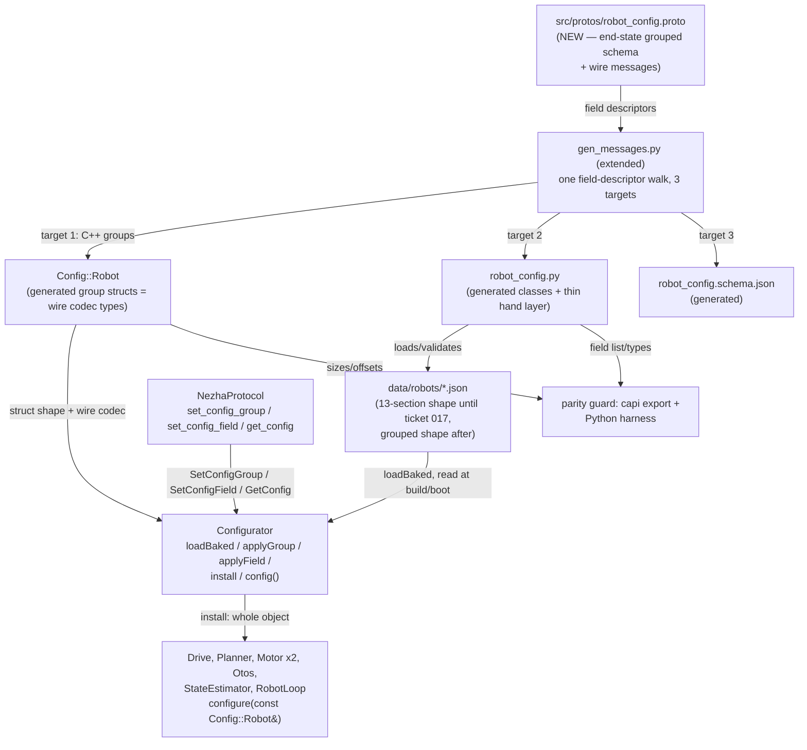
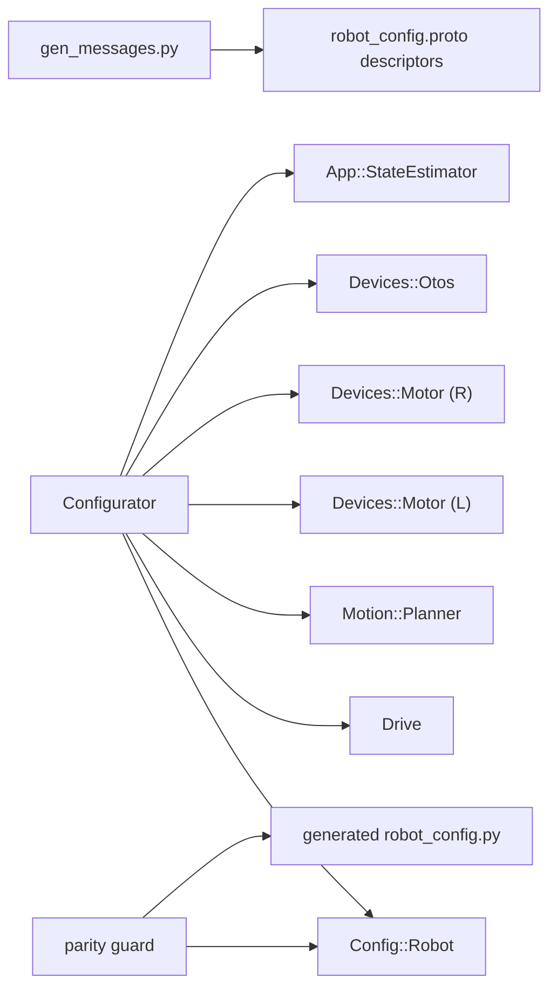

<!-- CLASI: Before changing code or making plans, review the SE process in CLAUDE.md -->

# Sprint 132: Configuration discipline — one owned object, live wire config with read-back, patch-surface retirement, JSON reshape, and per-wheel drive calibration on tovez

**Re-planned in place a second time, 2026-08-03.** This sprint was first
planned as read-back + per-wheel-over-the-wire, then narrowed to
[[the-configuration-object]]'s Step 1 only ("one schema, three generated
targets") the same day, with Steps 2-6 explicitly deferred to a follow-on
sprint and the `architecture_review` gate recorded against that narrower
design. The stakeholder has now overridden that scope cut, verbatim:

> Go ahead and break the JSON. This sprint, take care of the whole
> problem. You can schedule that ticket at the end. Go through, because
> you're just going to do it on another sprint, so why not do it on this
> sprint? Go save the JSON reshaping until the end, but make it happen
> this sprint.
>
> Look, everything's broken right now, right? You're not preserving
> anything in general, and I want you to be explicit on this: you do not
> have to run system tests every single ticket, okay? You do not have to
> preserve functionality across tickets. I want this to work at the end.
> It doesn't have to work in the middle. I don't want you spending a huge
> amount of time trying to make it work in the middle. Just get it done,
> and by the end of it, I want the whole thing finished.

This document replaces the Step-1-only plan with the full scope: all six
of [[the-configuration-object]]'s sequencing steps, including the JSON
reshape (scheduled as the second-to-last ticket, exactly as directed) and
the hardware acceptance this unlocks — pushing tovez's measured 11.1-point
L/R plateau-tracking gap closed live, over the new wire, from a cold boot.
Nothing from the Step-1-only plan is discarded; its schema-unification
design (one `.proto`, generated C++/pydantic/JSON-Schema, a parity guard
replacing `check_config_sync.py`) is Tickets 001-004 below, essentially
unchanged. Everything past that is new. The `architecture_review` gate
recorded against the Step-1-only design is superseded and re-run below
against this full-scope architecture, per this round's explicit
instruction. `stakeholder_approval` is intentionally left unrecorded —
that gate is the stakeholder's own, not the sprint-planner's, even though
the direction above already reads as approval-in-substance for the scope
itself.

## Goals

- Build the one configuration object end to end: a single `.proto` schema
  generates the C++ `Config::Robot` struct, the host pydantic model, the
  JSON Schema, **and** the wire messages for a whole-group CONFIG plane —
  collapsing today's four independent, already-drifted definitions into
  one, and closing the measured 18-field host pydantic gap as a structural
  consequence rather than a hand patch.
- Give `Configurator` sole ownership of `Config::Robot`: `loadBaked()` at
  boot, `install()`/`install(target)` fan-out, `config()` read-back — and
  delete `RobotGraph::Resolved`, the private, never-read struct that
  currently duplicates it.
- Land the wire capability that has been the whole point since
  [[A-no-firmware-to-host-config-readback]]: whole-group set **and get**,
  a `ConfigSnapshot` reply, per-target re-appliability declared, and
  boot-only groups **rejected loudly** (`ERR_NOT_LIVE`), never silently
  no-op'd — closing today's two live no-ops (`PatchKind::DRIVETRAIN` is
  wired on the host and unimplemented on the firmware; `EstimatorConfigPatch`
  acks `0` and lands nowhere) as part of building the honest version.
- Land the generic `(target, field number, value)` single-value setter on
  top of the already-generic, table-driven wire decoder
  (`wire.cpp:546-597`), retiring the hand-maintained string-key vocabulary
  that let `pid.kff` silently mean the wrong thing for years.
- **Retire the patch surface completely**: delete the `*ConfigPatch`
  messages, `PatchKind`, the merge accumulator, and every string wire key;
  migrate OTOS calibration and TestGUI onto the new group/field surface.
- **Reshape the robot JSON**, last: retire `control`'s 53-field dumping
  ground into `Config::Robot`'s consumer-grouped layout, with a one-time
  migration script for all three robot JSONs (`tovez`/`togov`/`tovez_nocal`)
  and a re-bake.
- Sweep the cleanups the issue's own audit surfaced: the pre-`begin()` OTOS
  ordering bug that silently discards persisted tuning, the
  `scaleToRegister()` multiplier-vs-register domain mismatch, `extra='forbid'`
  on the host model, the 17 unread `control` keys, dead `ShaperBootConfig`,
  dead `CONFIG_PLANNER`/`CONFIG_WATCHDOG`, and the unasserted
  `kEncodeScratchCap = 220` ceiling that makes `encode()` return 0 silently.
- **Headline hardware acceptance**: with the wire landed, push per-wheel
  Stage-A drive correction live on `tovez` and re-run
  `src/tests/bench/velocity_profile_gate.py`, showing the measured L/R
  plateau-tracking gap (L 96.0% / R 84.9%, an 11.1-point split) close —
  from a cold boot, on the stand, addressed by UID.
- **Explicitly not a goal**: keeping the tree green between tickets. Mid-sprint
  breakage is expected and accepted; see Test Strategy.

## Problem

Configuration is defined four times, owned twice, and none of the three
truth layers (the robot JSON baked at build time; firmware constants that
deliberately ignore it; flash-persisted `pid.*` that silently overrides it
at boot) is observable from the host. Concretely, verified on disk this
round:

- **Four definitions, one hand-curated lint.** `.proto` generates only wire
  messages; `gen_boot_config.py` targets a hand-declared `boot_config.h`;
  `data/robots/robot_config.schema.json` is hand-maintained and its own
  `$comment` names a baking pipeline deleted in the 077 rebuild;
  `robot_config.py` is hand-written and silently drops 18 of the JSON's 53
  `control` fields via pydantic's default `extra='ignore'` (confirmed: no
  `model_config`/`ConfigDict` override exists in `robot_config.py` today) —
  including `output_deadband`/`reversal_dwell_ms`, which
  `gen_boot_config.py`'s own `_require()` calls make mandatory for a
  firmware build. `check_config_sync.py` (58-entry allowlist,
  `.github/workflows/build.yml:8-19`'s "Config registry sync lint" job)
  exists only to notice drift it was told to look for, and missed this one.
- **Owned twice, and one of the two owners is already dead code.**
  `RobotGraph::Resolved` (`boot_wiring.h:185-196`) is a private nested
  struct assembled once in `resolve()` and never read again after the
  constructor body finishes (confirmed by reading `boot_wiring.cpp` in
  full: every `resolved_.*` reference is inside the constructor's own
  member-initializer list or the three `install*Calibration` calls
  immediately after it). `Configurator::persistedTuning_`
  (`configurator.h:77`) holds the wire-side truth, in a
  `msg::MotorConfigPatch`/`msg::OtosConfigPatch`-shaped snapshot, not a
  `Config::Robot`-shaped one.
- **A live wire arm that is already broken, not merely absent.** Confirmed
  by reading `envelope.h` and `configurator.cpp` together:
  `ConfigDelta::PatchKind::DRIVETRAIN` is declared on the wire (`= 1`) and
  the host's `NezhaProtocol.config()` sends `DrivetrainConfigPatch`
  through it (`protocol.py:1086`) — but `Configurator::apply()` has no
  `DRIVETRAIN` branch at all; it falls through to
  `ERR_UNIMPLEMENTED`. `trackwidth`/`rotational_slip`/the EKF noise pair
  have had no working wire path for some unknown span of sprints. This is
  the same disease as trap 2 (`EstimatorConfigPatch` acks `0` and lands
  nowhere) — an *observable* failure (at least it errors) sitting next to a
  *silent* one, both symptoms of "send config to subsystems" never having
  had a structural boundary for what is and is not actually wired.
- **`ConfigTarget` — the enum this design's whole re-appliability/read-back
  story depends on — is declared and used nowhere in current firmware or
  host code** (confirmed by repo-wide grep: it appears only in
  `config.proto`/`config.h`'s own declarations). The `GetConfig`/
  `ConfigSnapshot` machinery `config.proto`'s comments describe was never
  built. This sprint builds it for the first time, not retrofits it.
- **Traps 1 and 3, confirmed on disk.** `main.cpp:166` calls
  `graph.loadPersistedTuning()` before `graph.robotLoop().boot()` at
  `:171`; `RealOtos::begin()` (`otos.cpp:35-46`) is the only place
  `initialized_` becomes true, and every `RealOtos` setter no-ops until
  then — so persisted OTOS tuning loaded before `boot()` is silently
  discarded, then `begin()` overwrites the scalars with baked values
  anyway. Separately, `begin()` converts the baked *multiplier* through
  `scaleToRegister()` before calling `setLinearScalar()` (`otos.cpp:45-46`),
  which takes the chip's raw int8 register value directly — but the live
  wire path (`configurator.cpp:159-160`) passes the patch value straight
  through with no conversion. A `Config::Robot.otos.linearScale = 1.0`
  pushed live installs a 1-LSB scalar, not unity.
- **`kEncodeScratchCap = 220`** (`wire.cpp:684`) has no `static_assert`
  against it; a nested message that grows past it makes `encode()` return
  `0` — the frame silently never sends, at runtime, with a clean compile.
  `HOST_BUILD` cannot see this: it is invisible until an ARM build.

This is not a list of independent nits — every item above is a different
face of "no one file for it, and that file is used for baking," the
stakeholder's own framing. Building `Config::Robot` on top of a still-drifted
four-definition schema, or wiring a whole-group push without also fixing the
one already-broken wire arm and the two silent-no-op traps sitting right
next to it, would just relocate the disease. That is the case for doing all
six of the issue's steps in one sprint rather than stopping at Step 1: the
traps are IN the code this sprint touches regardless of where the scope line
is drawn.

## Solution

Author one `.proto` (`robot_config.proto`) in `Config::Robot`'s **end-state**
consumer-grouped shape — Identity/Connection/Vision (host-only) plus
Geometry/Motors/Drive/WheelControl/Planner/Otos/Estimator (robot-config,
one `ConfigTarget`/wire message/`configure()` consumer each) — not today's
13-section JSON shape. Extend the existing wire-message generator
(`gen_messages.py`, already a schema-generic field-descriptor walker) with
two new emission modes — a pydantic `BaseModel` hierarchy and a JSON Schema
document — so the **same** generated C++ group types serve three roles at
once: wire codec target (`decodeInto`/`encodeInto` already write through an
arbitrary `base + offset`, so a `Config::Robot.drive` sub-struct is a valid
decode target with no adapter), in-memory `Config::Robot` field storage, and
the schema the host/JSON targets are generated from. One schema, one
generator, no separate "boot-config struct" type competing with the wire
type for the same job.

Give `Configurator` sole ownership: `loadBaked()` populates `Config::Robot`
from the (temporarily still old-shaped) robot JSON; `applyGroup(target,
wire, len)` decodes straight into `config_` with no patch, no presence
flags, no merge; `install(target)` fans out to whichever subsystems own that
group's values, guarded by a per-target re-appliability table that rejects
a push to a boot-only group with `ERR_NOT_LIVE` instead of acking `OK` and
doing nothing; `config()` returns the whole object for read-back. Delete
`RobotGraph::Resolved`; its one remaining job — building the *initial*
object before any subsystem is constructed — becomes `loadBaked()` itself.
Give every configurable subsystem a `configure(const Config::Robot&)` entry
point so nothing outside `Drive` needs to know what `Drive` reads.

Land the wire surface this unlocks: `GetConfig`/`ConfigSnapshot` per
`ConfigTarget` (the 240 B envelope cannot carry the whole object in one
frame — read-back iterates targets the same way a whole-group push already
must, aggregated host-side into the full picture), and the generic
`applyField(target, fieldNumber, value)` setter, exposing the wire decoder's
existing field-lookup/bounds-check/write-scalar loop (`wire.cpp:546-597`,
currently sealed in an anonymous namespace) as a callable surface. Then
delete the entire patch surface it replaces — `*ConfigPatch` messages,
`PatchKind`, the merge accumulator (`mergeMotorGainsPatch`/`mergeOtosPatch`)
— and migrate OTOS calibration and TestGUI onto the new surface. Sweep the
cleanups: the ordering fix for trap 1, the domain fix for trap 3, the
`kEncodeScratchCap` assert, dead-code deletion, `extra='forbid'`.

**Last**, exactly as directed: reshape the three robot JSONs to match
`Config::Robot`'s already-built grouped shape via a one-time migration
script, dropping the 17 dead `control` keys in the same pass, and retarget
the baking step's field paths from the old `control.*` section names to the
new grouped ones. Every ticket before this one builds against the
**target** shape and bridges from the **current** JSON shape via the same
kind of path-mapping `gen_boot_config.py`'s `_require()` calls already do —
so nothing needs a temporary translation layer invented for this sprint
alone; the bridge is the baking step's ordinary job, just pointed at the old
paths until the last ticket repoints it. Host-side JSON *loading* is
expected to be broken from the point the pydantic model regenerates in the
new shape until the reshape ticket lands — this is the sprint's one
deliberate, up-front-flagged instance of "broken in the middle," authorized
explicitly by the stakeholder direction above.

Close with the two acceptance-concentrated tickets: full-system
verification (sim baseline, ARM build, both parity harnesses, the
read-back/bake-push/no-silent-no-op properties, the 16→2 touchpoint
demonstration), then the hardware headline on `tovez`.

## Success Criteria

(The stakeholder's final-state acceptance list, verbatim in substance —
this is the only place all of it must be simultaneously true; no individual
ticket is judged against this list.)

- **Full default-collection suite at or above the established baseline,
  with no NEW failures beyond the seven already known.** Measured on
  `master` immediately pre-sprint, 2026-08-03, against the project's full
  default test collection (`testpaths = ["src/tests/sim",
  "src/tests/unit", "src/tests/testgui"]`, i.e. plain `uv run python -m
  pytest`, not the `src/tests/sim`-only slice): **7 failed, 1757 passed,
  3 skipped, 9 xfailed, 4 xpassed**. This corrects TWO figures this
  document previously carried in error: the earlier "484 passed / 2 known
  failures" count (stale — 22 tests were removed by the `src/tests/dev/`
  reorganization since that figure was recorded), and a subsequent
  correction pass that reported "462 passed / 0 failed" — that number was
  only the `src/tests/sim` SLICE, not the full default collection, and
  its accompanying claim that
  [[A-seven-untriaged-failing-tests-poison-every-no-regressions-claim]]
  is stale was itself wrong: that issue is exactly accurate. The seven
  failures are: 3× `test_gen_boot_config_planner.py` (a stale
  `headingHoldGain` expectation, `2.0f` vs. the current `0.0`), 2×
  `test_gui_button_acceptance.py` (tour 1/2), 1× `test_sim_loop.py::
  test_flags_bit16_shaping_disabled_asserts_when_push_stripped`, 1×
  `test_tour_closure_gate.py` (a 90° commanded turn achieving 76.92°).
  These seven are the accepted baseline, not a target to fix as part of
  this sprint — "no regressions" means the sprint introduces no EIGHTH
  failure, not that these seven become zero. Ticket 018 asserts this
  precisely, against the full default collection, not a slice of it.
- **ARM build succeeds.** Several constraints here are `HOST_BUILD`-invisible,
  including `kEncodeScratchCap = 220` (`wire.cpp:684`) making `encode()`
  return 0 silently with no assert — add the `static_assert` and prove it
  fires under a deliberately oversized message in a throwaway branch,
  reverted before landing.
- **Read-back equals the file.** `config()` serialized diffs clean against
  the robot JSON it was baked from — the headline property, and the one
  [[A-no-firmware-to-host-config-readback]] has been waiting on.
- **Bake/push parity.** Build an image from one robot JSON, push that same
  JSON to a robot running a *different* baked config, confirm identical
  behaviour.
- **No silent no-ops.** Push to a boot-only target and assert a rejection,
  not an OK. Regression-test trap 1 (persisted OTOS tuning) specifically —
  it must either land or report, never be silently discarded.
- **16 touchpoints → 2, demonstrated.** Add a throwaway config field; show
  only the proto and a robot JSON changed. Stronger than the Step-1-only
  version of this claim: because the wire messages are now generated from
  the same schema too, there is no separate hand-maintained Patch message
  to also touch.
- **Generated parity guard**, modelled on
  `plannerStructSizes()`/`plannerLimitsOffsets()` (`src/motion/planner/capi.cpp:69,93`)
  + `planner_harness.py:207-212`: proves the generated `Config::Robot` and
  the generated pydantic model have not structurally drifted, and is
  demonstrated to actually catch a drift (a deliberately introduced
  mismatch on a throwaway branch, reverted before landing).
- **`composition_root_parity_harness.cpp` still passes**, with the sim's
  seven enumerated `BootOverrides` divergences (`boot_wiring.h:76-101`)
  preserved or explicitly retired, not silently dropped.
- **Bench, the headline**: `tovez`, on the stand, addressed by UID
  (`.claude/rules/hardware-bench-testing.md`). Push per-wheel Stage-A
  correction live over the new wire; `velocity_profile_gate.py`
  before/after; the measured 11.1-point L/R plateau-tracking gap (L 96.0% /
  R 84.9%) closes, including from a **cold boot** (not just a warm,
  already-tuned session).

## Scope

### In Scope

This sprint is now [[the-configuration-object]] in full — all six
sequencing steps, plus the JSON reshape and the hardware acceptance it
unlocks:

- **Step 1 — one schema.** `robot_config.proto` (new), generating the C++
  `Config::Robot` group structs (doubling as the wire codec types), the
  host pydantic model, and `robot_config.schema.json`, all from one
  field-descriptor walk in an extended `gen_messages.py`. Generated parity
  guard. Deletion of `check_config_sync.py` and its allowlist, including
  the CI job (`.github/workflows/build.yml:8-19`).
- **Step 2 — `Config::Robot` + `Configurator` ownership.** `loadBaked()`,
  `install()`/`install(target)`, `config()` read-back. Deletion of
  `RobotGraph::Resolved`. `configure(const Config::Robot&)` on every
  configurable subsystem. Derived-value methods on `Config::Robot`
  (`effectiveTrackWidth()`, `rotationOffsetPos()`) replacing today's
  four-way-fanned-out, un-checkable duplicate derivation
  (`boot_calibration.cpp:25-29`).
- **Step 3 — whole-group set/get + read-back.** `applyGroup()`, the
  per-target re-appliability table with `ERR_NOT_LIVE` boot-only rejection,
  `GetConfig`/`ConfigSnapshot`. Per-wheel Stage-A drive correction (the
  original sprint's headline feature) lands here, as fields of the
  `Drive` group — the underlying setter (`Drive::setWheelCorrection`)
  already exists; this sprint gives it a wire arm. Closing trap 2
  (Estimator weights land nowhere) and trap 3 (OTOS scale domain mismatch)
  are part of building this honestly, not optional polish.
- **Step 4 — generic single-value setter.** `applyField(target,
  fieldNumber, value)`, exposing `wire.cpp`'s existing field-lookup/bounds
  loop; `SetConfigField` on the wire; host `set_config_field(target,
  field_name)` resolving the name to a number via real protobuf
  descriptors.
- **Step 5 — retire the patch surface.** Delete `*ConfigPatch`,
  `PatchKind`, `ConfigDelta`'s union, the merge accumulator. Migrate
  `NezhaProtocol`'s `config()`/`otos_config()`/`estimator_config()`,
  `calibration/push.py`, and TestGUI's `binary_bridge.py`
  (`_handle_otos_patch`/`_handle_set_patch`) onto the new surface.
- **Step 6 — cleanups.** Trap 1 ordering fix (persisted tuning applied
  after `begin()`, not before `boot()`), trap 3 domain fix
  (`scaleToRegister()` applied on the live path too), `kEncodeScratchCap`
  static_assert, dead `ShaperBootConfig` deletion, dead
  `CONFIG_PLANNER`/`CONFIG_WATCHDOG` removal (after confirming no live
  consumer — `CONFIG_WATCHDOG`'s documented routing target,
  `config_commands.cpp`/`BinaryChannel`, no longer exists in this tree;
  confirmed by grep), `extra='forbid'` on the host model, the 17 unread
  `control` keys.
- **The JSON reshape, scheduled last per stakeholder direction**: a
  one-time migration script reshaping `control`'s 53-field dumping ground
  (and the rest of the file) into `Config::Robot`'s grouped layout, run
  against `tovez.json`/`togov.json`/`tovez_nocal.json`, plus the re-bake
  that follows from it.
- **Hardware acceptance on `tovez`**, addressed by UID: the headline L/R
  gap closure, from a cold boot.

### Out of Scope

- **`ColorConfig`/`LineConfig`.** Both are on the issue's own "no setter at
  all" list and, confirmed by reading `boot_wiring.cpp:28-33`, neither root
  has ever baked a robot-JSON override for either — they stay at
  `Devices::ColorConfig{}`/`LineConfig{}`'s all-default construction,
  outside `Config::Robot` entirely. Adding them as unused groups nobody
  currently reads or overrides would be exactly the speculative generality
  the architecture principles warn against.
- **Extending `options.proto` with a general `(min)`/`(max)`-style
  cross-field validation mechanism** beyond what individual fields already
  need this sprint (the issue's own Open Question 2). `rotational_slip`'s
  non-contiguous `{0} ∪ [0.5,1.0]` domain and similar cases stay in the
  thin hand-written validation layer around the generated pydantic model,
  same split the C++ side already has (generated struct SHAPE,
  hand-written baking BEHAVIOR).
- **The cleartext verb surface** (`HELLO`/`PING`/`ID`/`VER`) and the
  **MOVE/STOP binary arms** — untouched. Only the CONFIG binary arm's
  internal shape changes; it remains one of protocol v5's three binary
  arms, not a fourth.
- **Persistence policy for newly-live-configurable groups beyond today's
  precedent.** Today, Motor gains/`travel_calib` and OTOS scale/offset
  persist to flash; `EstimatorConfigPatch` explicitly never has
  (`config.proto`'s own comment: "a reboot always reverts to the baked
  JSON default, never the last-live-tuned value"). Ticket 013 (patch
  surface retirement) must document which `Config::Robot` groups persist
  under the new `TuningStore` shape, following this existing precedent
  rather than silently expanding or contracting what persists — an
  explicit ticket-013 acceptance criterion, not decided in this document.

## Test Strategy

**No per-ticket "no regressions" gate, and no per-ticket system-test run.**
This is a deliberate, stakeholder-directed departure from this project's
usual per-ticket discipline: mid-sprint breakage is expected and accepted.
If deleting the patch surface (ticket 013) leaves TestGUI unable to push
OTOS calibration until ticket 014 migrates it, that is fine. If the JSON
files fail to validate against the regenerated pydantic model from ticket
002 until the reshape lands at ticket 017, that is fine and expected, not a
regression to chase down mid-sprint. Do not add compatibility shims,
transition layers, or dual-path support whose only purpose is keeping
something green between tickets — none are designed into the architecture
below, and none should be improvised during execution either.

Each ticket's own acceptance is light: it compiles (`HOST_BUILD` at
minimum; ARM where the ticket touches ARM-only code), its own unit coverage
passes, its own artifact exists (a generated file, a new method, a deleted
file actually gone). **The baseline is already established**, measured on
`master` immediately pre-sprint (2026-08-03) against the full default test
collection (plain `uv run python -m pytest`, `testpaths =
["src/tests/sim", "src/tests/unit", "src/tests/testgui"]` — NOT the
`src/tests/sim`-only slice, which undercounts what "no regressions" must
actually cover): **7 failed, 1757 passed, 3 skipped, 9 xfailed, 4
xpassed**. The seven failures are known and accepted going in — 3×
`test_gen_boot_config_planner.py` (stale `headingHoldGain` expectation),
2× `test_gui_button_acceptance.py` (tour 1/2), 1× `test_sim_loop.py::
test_flags_bit16_shaping_disabled_asserts_when_push_stripped`, 1×
`test_tour_closure_gate.py` (90° commanded → 76.92° achieved) — do not
re-run the full suite after every ticket to chase them; that is what
tickets 018-019 are for, and their job is proving no EIGHTH failure
appears, not that these seven disappear. Ticket 018 additionally triages
the 4 `xpassed` tests (a test marked expected-to-fail that now passes is
a quiet lie about what the suite proves) — either the `xfail` marker is
stale and should come off, or there is a reason it stays that ticket 018
must state, not silently re-inherit.

**Verification concentrates in the last three tickets**, exactly as
directed:

- **Ticket 017 (JSON reshape)**: this is the moment host-side JSON loading,
  broken since ticket 002, starts working again. Its own acceptance is that
  all three robot JSONs validate against the regenerated pydantic model and
  a fresh ARM build boots.
- **Ticket 018 (full-system verification)**: sim suite at or above
  baseline; `composition_root_parity_harness.cpp`; the generated parity
  guard, both passing AND demonstrated to catch an induced drift; the
  read-back-equals-file property; bake/push parity; the boot-only-rejection
  regression test (trap 1 specifically); the 16→2 touchpoint demonstration;
  the `kEncodeScratchCap` assert firing on an oversized message.
- **Ticket 019 (hardware, the headline)**: `velocity_profile_gate.py`
  before/after on `tovez`, by UID, from a cold boot, showing the 11.1-point
  L/R gap close.

## Architecture

**Substantial** — this is now the full issue: a new cross-module dependency
(`Config::Robot` becomes something nearly every subsystem depends on for
its own configuration, replacing constructor-injected narrow structs), a
data-model change (the host pydantic model's shape changes twice — once to
the generated form, once to the reshaped grouping — and three robot JSONs
change shape), a new external-facing wire capability (whole-group
get/read-back, a generic field setter), and 6+ modules touched across
`src/protos`, `src/scripts`, `src/firm/config`, `src/firm/app`,
`src/firm/messages`, `src/firm/devices`, `src/host/robot_radio/config`,
`src/host/robot_radio/robot`, `src/host/robot_radio/testgui`, and
`data/robots`. The full 7-step methodology applies, diagrams included.

### Step 1: Understand the Problem

See Problem above. In architectural terms, three things are true at once
and the design has to hold all three simultaneously:

1. **The object must be complete before construction.** Confirmed by the
   issue's own audit and re-confirmed by reading `boot_wiring.cpp`: ~14
   values (`trackWidth` in Drive/Odometry/Planner, most of `PlannerLimits`,
   the OTOS lever arm and scales, `ColorConfig`, `LineConfig`) have no
   post-construction setter at all. `Config::Robot` cannot be assembled
   incrementally after subsystems exist; subsystems are constructed *from*
   it, exactly as `RobotGraph`'s constructor already does today with
   `Resolved`.
2. **The wire cannot carry the whole object in one frame.** 240 B envelope,
   largest single group ~80 B, whole object ~590 B. Every wire-facing
   operation — whole-group set, whole-group get, the field setter — is
   necessarily per-`ConfigTarget`, never per-object. `config()`'s "one call,
   whole truth" is a same-process C++ read; the *wire* surface built on top
   of it still iterates targets, aggregated host-side.
3. **Two live wire arms are already broken** (trap 2: silent; the
   `DRIVETRAIN` patch: an honest `ERR_UNIMPLEMENTED`, still a functional
   gap) **and one is silently wrong** (trap 3: domain mismatch). None of
   these can be deferred to "later cleanup" without leaving the sprint's
   own new whole-group push sitting on top of the same unfixed traps —
   Step 3's own honesty requirement (boot-only groups rejected loudly)
   is the same discipline traps 2 and 3 are missing.

### Step 2: Identify Responsibilities

- **Declaring the schema** — `Config::Robot`'s end-state field set, types,
  nesting, defaults, and which groups are host-only vs. robot-config vs.
  wire-addressable. Changes only when a field is added/removed/retyped or a
  group's wire-addressability changes.
- **Generating three targets from one walk** — C++ group structs (also the
  wire codec type), the host pydantic model, the JSON Schema. Independent
  per target; shared field-descriptor walk.
- **Baking per-robot VALUES into `Config::Robot`'s boot instance**
  (`loadBaked()`) — reads the active robot JSON (old shape until ticket
  017, new shape after) and populates a `Config::Robot`. Same responsibility
  `gen_boot_config.py` already owns; only its target type and (at ticket
  017) its source paths move.
- **Owning the live object and dispatching changes to it** —
  `Configurator`: `applyGroup()`/`applyField()` decode into `config_`;
  `install(target)` fans out; `config()` reads back. Changes only when a
  new `ConfigTarget` is added or an existing one's re-appliability changes.
- **Declaring, per target, whether it is safely re-appliable at runtime** —
  the boundary that makes "send config to subsystems" honest instead of a
  silent-no-op generator. A new responsibility; today this boundary does
  not exist as a declared table anywhere.
- **Pulling values out of the whole object** — each configurable
  subsystem's own `configure(const Config::Robot&)`. Independent per
  subsystem; each changes only when that subsystem's own configuration
  needs change.
- **Deriving computed values from raw ones** — `Config::Robot` methods
  (`effectiveTrackWidth()`, `rotationOffsetPos()`), replacing today's
  fan-out-to-four-places duplicate derivation.
- **Carrying whole-group and single-field changes and reads over the
  wire** — the CONFIG binary arm's new internal shape:
  `SetConfigGroup`/`GetConfig`/`ConfigSnapshot`/`SetConfigField`.
  Independent of the in-process `Configurator` API; a thin wire adapter
  onto it.
- **Presenting a host-side ergonomic surface** — `NezhaProtocol`'s new
  methods (`set_config_group`, `set_config_field`, `get_config`), replacing
  the retired `config()`/`otos_config()`/`estimator_config()` Patch
  builders. Independent of `calibration/push.py`/TestGUI, which are
  consumers of it.
- **Migrating existing host consumers** — `calibration/push.py`, TestGUI's
  `binary_bridge.py`. Each changes independently once the new surface
  exists under it.
- **Ceasing to exist** — the patch surface (`*ConfigPatch`, `PatchKind`,
  the merge accumulator) and `check_config_sync.py`/its allowlist. Both are
  deletions, not live responsibilities, once their replacements land.
- **Reshaping the persisted artifact** — the three robot JSONs, migrated by
  a one-time script from the 13-section shape to `Config::Robot`'s grouped
  shape, dropping 17 dead `control` keys in the same pass. A one-time,
  last-scheduled responsibility, not a recurring one.
- **Proving no structural drift** — the generated parity guard (capi
  export + Python harness), mirroring `capi.cpp`'s existing pattern.
  Independent of every other responsibility above; consumes the outputs of
  the schema-generation responsibility only.

### Step 3: Define Subsystems and Modules

**`robot_config.proto`** (new, `src/protos/`, replaces `config.proto`'s
curated Patch messages)
Purpose: declares `Config::Robot`'s complete end-state field set and its
wire-facing group messages.
Boundary: inside — `Identity`/`Connection`/`Vision` (host-only, no
`ConfigTarget`, never generate a C++ group or cross the wire) and
`Geometry`/`Motors`/`Drive`/`WheelControl`/`Planner`/`Otos`/`Estimator`
(robot-config, each with a `ConfigTarget` value, a generated C++ group
struct that doubles as its wire message, and one `configure()` consumer);
the `ConfigTarget` enum itself; `SetConfigGroup`/`GetConfig`/
`ConfigSnapshot`/`SetConfigField` wire envelope messages. A per-group
`(host_only)` proto option (added to the existing `options.proto`
extension mechanism, which already carries `(min)`/`(max)`/`(abs_max)`)
marks which groups the C++/wire targets skip. Outside — `ColorConfig`/
`LineConfig` (Out of Scope), and the reshaped JSON's own section names
(a ticket-017 concern; the schema is authored in the target shape from
this module's first ticket, ahead of the file that will eventually match
it).
Serves: SUC-001, SUC-005, SUC-006, SUC-008.

**Extended `gen_messages.py`** (existing, new emission modes — supersedes
the Step-1-only plan's "separate new generator" decision; see Design
Rationale Decision 1)
Purpose: turns one schema walk into three generated artifacts.
Boundary: inside — the existing wire C++ emission (unchanged mechanism;
its output now also serves as `Config::Robot`'s own group storage), plus
two new emission modes sharing the same field-descriptor walk: a pydantic
`BaseModel` hierarchy (all 10 groups, host-only included) and a JSON
Schema document (all 10 groups). Outside — baking per-robot VALUES
(`loadBaked()`'s job) and anything about *which* messages are wire-
addressable at runtime (the `ConfigTarget`/re-appliability table's job,
declared in the schema but *enforced* by `Configurator`).
Serves: SUC-001, SUC-005.

**Generated parity guard** (new `extern "C"` export in `src/firm/config/` +
Python harness)
Purpose: mechanically proves the generated `Config::Robot` and the
generated pydantic model have not structurally drifted.
Boundary: inside — struct sizes/per-field offsets exported the same way
`plannerStructSizes()`/`plannerLimitsOffsets()` already do
(`capi.cpp:69,93`), and a Python harness walking them against the pydantic
model's own field list/types (mirroring `planner_harness.py:207-212`).
Outside — everything `check_config_sync.py` used to check, deleted
outright once this guard is in place (Design Rationale Decision 5, carried
from the Step-1-only round, unchanged).
Serves: SUC-001.

**`Config::Robot`** (new, `src/firm/config/`, generated group structs
assembled into one struct; `<cstdint>`-only dependency floor, precedented
by `types/robot_state.h`)
Purpose: holds the complete, raw, per-robot configuration.
Boundary: inside — the 7 robot-config groups' raw fields (mirroring the
robot JSON's eventual grouped shape exactly — no derived quantities
stored) plus derived-value methods (`effectiveTrackWidth()`,
`rotationOffsetPos()`) computing what today's `boot_calibration.cpp:25-29`
computes once and fans out unchecked to four places. Outside — the
host-only groups (declared in the schema, generated into the pydantic
model, never into this struct) and anything about how the object gets
populated or dispatched (`Configurator`'s job).
Serves: SUC-002, SUC-006.

**`Configurator`** (existing, `src/firm/app/`, rebuilt around ownership)
Purpose: owns the one `Config::Robot` instance and dispatches every change
to it.
Boundary: inside — `loadBaked()`, `applyGroup(target, wire, len)`,
`applyField(target, field, value)`, `install()`/`install(target)`,
`config()`. The per-`ConfigTarget` re-appliability table and the
`ERR_NOT_LIVE` boot-only rejection. Outside — decoding the wire envelope
into a `(target, bytes)`/`(target, field, value)` call (the CONFIG binary
arm's job, `robot_loop.cpp`'s existing `processMessage()` dispatch,
unchanged in mechanism) and what each subsystem does with a value once
handed the whole object (each subsystem's own `configure()`).
Serves: SUC-002, SUC-003, SUC-004, SUC-006, SUC-007.

**Subsystem `configure()` consumers** (`Drive`, `Motion::Planner`,
`Devices::Motor` ×2, `Devices::Otos`, `App::StateEstimator`, `RobotLoop`
for geometry/rotation — existing types, one new method each)
Purpose: each subsystem pulls the fields it owns out of the whole object.
Boundary: inside — `configure(const Config::Robot&)`, reusing the setters
that already exist (`Drive::setWheelCorrection`/`setControlGains`/
`setAdaptationBounds`/`setCrawlPulse`, `Motor::applyTravelCalib`,
`RobotLoop::setRotationCalibration`) — this sprint gives them a wire path,
it does not invent new firmware logic. `Devices::Motor::configure()`
additionally carries the one guarded case: returns `false` (⇒
`Configurator` returns `ERR_BUSY`) while the robot is moving. Outside —
knowledge of any OTHER subsystem's own configuration, and knowledge of
where the object came from (boot vs. wire).
Serves: SUC-002, SUC-006.

**CONFIG binary arm** (existing wire plane, `src/firm/messages/`,
internal shape rebuilt)
Purpose: carries whole-group set/get and single-field set over the wire.
Boundary: inside — `SetConfigGroup`/`GetConfig`/`ConfigSnapshot`/
`SetConfigField`, each keyed by `ConfigTarget`; the generic field-setter
path exposing `wire.cpp`'s existing `findField`/`validateBounds`/
write-scalar loop (currently sealed in an anonymous namespace) to
`Configurator::applyField()`. Outside — the cleartext verb surface and the
MOVE/STOP binary arms, both untouched; the *meaning* of any field (that is
`Config::Robot`/`Configurator`'s job, one layer down).
Serves: SUC-003, SUC-004, SUC-005.

**Host `NezhaProtocol`** (existing, `src/host/robot_radio/robot/protocol.py`,
patch-builder methods replaced)
Purpose: the host's typed entry point onto the CONFIG binary arm.
Boundary: inside — `set_config_group(target, **fields)`,
`set_config_field(target, field_name, value)` (resolving the name to a
wire field number via real protobuf descriptors — "a human still types a
name, the wire still carries a number"), `get_config(target)`. Outside —
`config()`/`otos_config()`/`estimator_config()` (deleted with the patch
surface) and any caller-specific convenience (`calibration/push.py`'s and
TestGUI's own job).
Serves: SUC-003, SUC-004, SUC-005, SUC-007.

**`calibration/push.py` + TestGUI `binary_bridge.py`** (existing, migrated)
Purpose: existing host consumers of the config wire surface.
Boundary: inside — retargeting every `*ConfigPatch` construction onto
`set_config_group`/`set_config_field`; `_handle_otos_patch`/
`_handle_set_patch`'s own dispatch logic stays, only what it calls
underneath changes. Outside — anything about the CONFIG binary arm's own
shape (owned by the module above).
Serves: SUC-005, SUC-007.

**Robot JSONs + one-time reshape script** (`data/robots/*.json` +
new `src/scripts/` migration script, last-scheduled)
Purpose: migrates the three existing robot JSONs from the 13-section shape
to `Config::Robot`'s grouped shape.
Boundary: inside — the migration script itself (one-time, not part of the
build pipeline afterward) and the resulting reshaped JSON files, with the
17 dead `control` keys dropped. Outside — every other module above, all of
which are built against the TARGET shape from their own first ticket, not
this one.
Serves: SUC-008.

**`*ConfigPatch` messages, `PatchKind`, `check_config_sync.py` +
`config_sync_allowlist.json`** (deleted)
Purpose (historical): the surface and the lint this sprint replaces.
Boundary: N/A — deleted, including the CI job reference.
Serves: SUC-005, SUC-007 (by ceasing to exist).

Quality check: every module traces to at least one SUC below. Cohesion —
each module's purpose sentence above has no "and" except where a
consumer's role is inherently a dispatch point (`Configurator`, discussed
under fan-out below). No cycles: the schema is the shared leaf every
generation target depends on; `Configurator` depends on `Config::Robot` and
the wire codec and is depended on by nothing above it in this graph; the
subsystem `configure()` consumers depend on `Config::Robot` only, never on
`Configurator` or each other.

### Step 4: Diagrams

**Component diagram.** 10 nodes, within the 5-12 range for a schema this
size touching this many layers.

The old Patch surface (`*ConfigPatch`, `PatchKind`) and `check_config_sync.py`
are not drawn — both are deleted, not live components.

**Dependency graph** (fan-out check):

`Configurator`'s fan-out is 7, above the 4-5 no-justification bound — a
**deliberate, justified** exception, not an oversight: `Configurator`'s
one-sentence purpose IS being the fan-out point ("owns the one config
object and dispatches every change to it"), the same reasoning that already
lets `RobotGraph` — this codebase's composition root — have comparably high
fan-out without being a god component. The alternative (each subsystem
reaching into `Configurator` to pull its own slice) would invert the
dependency direction the whole design exists to establish (push, not pull —
see the issue's own "Why push, not pull" section) and does not reduce the
number of relationships, only which end owns them. No cycles: `Config::Robot`
and the subsystems depend on nothing in this graph; `Configurator` is a leaf
consumer of `Config::Robot`'s shape and a source for every subsystem;
nothing depends on the parity guard.

An ERD is not warranted — `Config::Robot`'s internal nesting is a struct
hierarchy generated from one schema, not a relational/entity model with new
tables or relationships; same reasoning sprint 124 and the Step-1-only round
of this sprint both used for the same call.

### Step 5: What Changed / Why / Impact / Migration

**What Changed**

- `src/protos/robot_config.proto` (new): `Config::Robot`'s end-state
  10-group schema (3 host-only, 7 robot-config), plus
  `SetConfigGroup`/`GetConfig`/`ConfigSnapshot`/`SetConfigField`. Replaces
  `config.proto`'s curated `*ConfigPatch` messages.
  A `(host_only)` proto option added to `options.proto`.
- `gen_messages.py`: two new emission modes (pydantic, JSON Schema) beside
  its existing wire-C++ mode.
- `src/firm/config/`: `Config::Robot` (new, generated), a capi parity-guard
  export (new).
- `src/firm/app/configurator.{h,cpp}`: rebuilt around `Config::Robot`
  ownership — `loadBaked`/`applyGroup`/`applyField`/`install`/`config()`
  replace `apply()`/the patch-merge helpers/`persistedTuning_`'s
  patch-shaped storage.
- `src/firm/app/boot_wiring.{h,cpp}`: `RobotGraph::Resolved` deleted;
  `resolve()`'s job becomes `Configurator::loadBaked()`.
- `Drive`, `Motion::Planner`, `Devices::Motor` (×2), `Devices::Otos`,
  `App::StateEstimator`, `RobotLoop`: each gains
  `configure(const Config::Robot&)`.
- `src/firm/messages/`: CONFIG binary arm's internal shape rebuilt;
  `*ConfigPatch`/`PatchKind`/the merge accumulator deleted.
- `src/host/robot_radio/config/robot_config.py`: generated classes + thin
  hand-written loader/validator layer, `extra='forbid'`.
- `data/robots/robot_config.schema.json`: generated, replacing the
  hand-maintained file.
- `src/host/robot_radio/robot/protocol.py`: `set_config_group`/
  `set_config_field`/`get_config` replace `config()`/`otos_config()`/
  `estimator_config()`.
- `src/host/robot_radio/calibration/push.py`,
  `src/host/robot_radio/testgui/binary_bridge.py`: migrated onto the new
  surface.
- `src/scripts/`: `check_config_sync.py` + `config_sync_allowlist.json`
  deleted; `gen_boot_config.py`'s baking logic absorbed into
  `loadBaked()`'s generation path; a new one-time JSON-reshape migration
  script (used once, at ticket 017, not part of the ongoing build
  pipeline).
- `data/robots/tovez.json`/`togov.json`/`tovez_nocal.json`: reshaped into
  `Config::Robot`'s grouped layout; 17 dead `control` keys dropped.
- `.github/workflows/build.yml`: the "Config registry sync lint" job
  (lines 8-19) removed.

**Why**

Per the stakeholder's own framing: one file for it, used for baking, and
the whole problem taken care of in one pass rather than staged across
sprints that each have to re-establish context on a design this
interconnected. The traps (1, 2, 3) sit inside the exact code this sprint
touches regardless of scope; fixing them as part of building the honest
version is cheaper than building the honest version next to unfixed ones
and coming back for a second pass.

**Impact on Existing Components**

- `RobotGraph`: `Resolved` deleted; `resolve()`'s logic moves into
  `Configurator::loadBaked()`.
- `Configurator`: rebuilt (see What Changed).
- `Drive`/`Motion::Planner`/`Devices::Motor`/`Devices::Otos`/
  `App::StateEstimator`/`RobotLoop`: each gains one new method; no existing
  method signature changes (every setter this sprint wires already exists).
- `check_config_sync.py`/`config_sync_allowlist.json`: deleted.
- `robot_config.py`: replaced twice over — once to the generated
  (still-old-shape-compatible... briefly) form, again when ticket 017's
  reshape lands. Public API (`get_robot_config()`, `list_robots()`) is
  preserved; consumers (TestGUI, bench scripts) are unaffected as long as
  import paths/attribute names stay identical — a ticket-level acceptance
  criterion, not assumed.
- `data/robots/robot_config.schema.json`: replaced (generated).
- `data/robots/*.json`: **shape changes** — the one deliberate, up-front-
  flagged behavior/format change this sprint makes to persisted data,
  explicitly authorized by the stakeholder and scheduled last.
- Wire `config.proto` (`*ConfigPatch` and siblings): deleted outright, not
  "untouched" — this reverses the Step-1-only round's framing, because this
  round's scope now includes Step 5.
- `.github/workflows/build.yml`: one job removed.

**Migration Concerns**

- **Firmware/host deployment must be coordinated at the end of this
  sprint, not mid-sprint.** Unlike the Step-1-only round, this sprint DOES
  change the wire. Because per-ticket greenness is not required, a
  firmware image and a host build from the middle of this sprint are not
  expected to be compatible with each other — only the END of the sprint
  needs a matched pair. Ticket 019 (hardware) is the first point a real
  firmware/host pair needs to actually talk over the wire.
- **Boot behaviour is NOT required to be byte-identical this round** — this
  also reverses the Step-1-only round's own constraint, because
  `Config::Robot`'s shape and the JSON's shape both change. What must hold
  is the END-state property: `config()` diffs clean against the (reshaped)
  file, and bake/push parity holds.
- **ARM build must succeed** with `Config::Robot`'s generated header under
  the CODAL/`-fno-rtti`/`-fno-exceptions` constraint, and with the new
  `kEncodeScratchCap` assert in place.
- **The JSON reshape is destructive to the working tree's data files** —
  ticket 017 must actually run the migration script against all three
  robot JSONs and commit the result; it is not a design document, it is a
  file-rewriting step.
- **CI wiring**: `check_config_sync.py` is referenced directly in
  `.github/workflows/build.yml` — ticket 004 removes both the script and
  the job, not just the script.
- **Persistence-scope decision** (see Out of Scope) — ticket 013 must
  document which `Config::Robot` groups persist to flash under the new
  shape, following today's precedent rather than deciding it implicitly.

### Step 6: Design Rationale

**Decision 1 — `gen_messages.py` is extended with new emission modes,
reversing the Step-1-only round's "separate generator" decision.**
Context: the Step-1-only plan's own Decision 1 argued for a brand-new,
separate codegen script, on cohesion grounds — `gen_messages.py`'s wire
concerns (CRC/COBS framing, chainable setters) have "nothing to do with"
emitting a plain POD struct, a pydantic model, and a JSON Schema. That
reasoning held when the C++ target was a *separate* boot-config struct type
from the wire message type. This round's design collapses that separation:
`Config::Robot`'s group members ARE the generated wire message types
(`decodeInto`/`encodeInto` already write through `base + offset`, so a
`Config::Robot.drive` sub-struct is a valid decode target with zero
adapter code). Once the "C++ target" IS the wire target, a second generator
producing a competing C++ type would just reintroduce the two-definitions
disease this whole design exists to kill — the generated C++ struct would
need to be kept in sync with the wire struct by hand, exactly the drift
`check_config_sync.py` used to chase.
Alternatives: (a) extend `gen_messages.py` with two new emission modes,
sharing its existing field-descriptor walk [chosen]; (b) keep the
Step-1-only round's separate generator and a `Config::Robot` type distinct
from the wire message types, with a translation layer between them.
Why: (b) is the two-definitions problem, reintroduced by this sprint
itself, for the specific purpose of avoiding a ~150-line addition to an
already-3000-line file — a worse trade than the one Decision 1 made
originally, now that Steps 2-4 make the collapse the natural design rather
than an optional simplification.
Consequences: `gen_messages.py` grows further; `Configurator`'s
`applyField()` needs the field-lookup/bounds-check machinery
(`wire.cpp:546-597`) exposed outside its current anonymous namespace,
which this decision makes necessary regardless of emission-mode structure.

**Decision 2 — `Config::Robot`/the schema is authored in the END-STATE
consumer-grouped shape immediately; only the JSON FILES lag, until ticket
017.**
Context: the Step-1-only round's Decision 2 deliberately mirrored the old
13-section JSON shape exactly, to hold "no behaviour change" while the
schema unified. That constraint is explicitly lifted this round
("everything's broken right now... I don't want you spending a huge amount
of time trying to make it work in the middle").
Alternatives: (a) author the schema in the target grouped shape from
ticket 001, and let JSON *loading* be broken until ticket 017 reshapes the
files [chosen]; (b) mirror the old shape through most of the sprint (as
before) and do a SECOND schema rewrite at ticket 017 to reach the grouped
shape.
Why: (b) means designing, generating, and wiring the same object TWICE —
once in a shape that gets thrown away — for the sole purpose of keeping
something working in the middle that the stakeholder has explicitly said
does not need to work. (a) means every ticket before 017 builds against
the shape that survives to the end of the sprint; `loadBaked()`'s mapping
from old JSON paths to new struct fields is not new machinery invented for
this transition — it is the same job `gen_boot_config.py`'s `_require()`
calls already do (map a JSON path to a typed field), just pointed at old
paths until ticket 017 repoints it at new ones.
Consequences: `data/robots/*.json` does not validate against the generated
pydantic model from ticket 002 until ticket 017 lands — an explicitly
accepted, up-front-flagged gap, not a regression to chase mid-sprint.

**Decision 3 — the read-back/get wire surface is per-`ConfigTarget`, never
whole-object, matching the whole-group SET surface's own envelope-size
constraint.**
Context: the issue's own sizing note — largest group ~80 B, whole object
~590 B against a 240 B envelope — already forced whole-group SET to be
per-target. `GetConfig`/`ConfigSnapshot` face the identical constraint.
Alternatives: (a) `GetConfig`/`ConfigSnapshot` per `ConfigTarget`, host
aggregates a full picture by iterating targets [chosen]; (b) invent
fragmentation/pagination for a single whole-object reply.
Why: (b) is explicitly rejected by the issue itself ("there is no
fragmentation anywhere in the wire layer") and would be new wire-protocol
machinery built for a problem (b) doesn't actually need to solve — the
host already needs to iterate targets for SET; GET is symmetric.
Consequences: "config() serialized diffs clean against the file" (the
headline read-back test) is proven at the in-process C++ level directly;
proving the SAME property reachable from the host requires the host to
poll every `ConfigTarget` and assemble them — an explicit ticket-018
acceptance criterion, not a given.

**Decision 4 — traps 2 and 3 are fixed as part of Step 3's own honesty
requirement, not deferred to the Step 6 cleanup sweep.**
Context: trap 2 (Estimator weights ack `0`, land nowhere) and trap 3 (OTOS
scale domain mismatch) are literally the failure mode Step 3's own
"boot-only groups rejected loudly, never silently no-op'd" principle
exists to eliminate — they are silent/wrong right now, on the exact code
path `install(OTOS)`/`install(ESTIMATOR)` this sprint builds.
Alternatives: (a) fix both as part of building `install(OTOS)`/
`install(ESTIMATOR)` [chosen]; (b) build the honest whole-group push
first, leave traps 2/3 for the Step 6 cleanup tickets, same as the issue's
own step numbering suggests.
Why: (b) would ship `install(ESTIMATOR)` that still acks `OK` while
landing nowhere, and `install(OTOS)` that installs the wrong scale — the
NEW mechanism inheriting the OLD bugs, which defeats the point of building
`install()` as the place re-appliability is finally enforced honestly.
Fixing them in the same ticket that builds the dispatch path is not scope
creep; it is that dispatch path's own correctness.
Consequences: ticket 010 (`install(OTOS)`/`install(ESTIMATOR)`) is larger
than a pure wiring ticket would be, but its acceptance criteria are
concrete and testable (Estimator weights reach a real `setWeights()` call;
a live OTOS scale push round-trips through `scaleToRegister()` the same
way `begin()` already does).

**Decision 5 — `check_config_sync.py` is deleted outright, unchanged from
the Step-1-only round's Decision 5.**
Context/Alternatives/Why/Consequences: unchanged from the prior round — the
generated parity guard is a strictly stronger guarantee; nothing about
this round's scope expansion weakens that argument.

### Step 7: Open Questions

1. **Exact set of `Config::Robot` groups that persist to flash** under the
   new `TuningStore` shape — left to ticket 013, following today's
   precedent (Motor/Otos persist, Estimator does not) unless a ticket-013
   finding says otherwise (see Out of Scope).
2. **Whether `(min)`/`(max)`-style proto options should be extended for
   cross-field validation** beyond this sprint's needs — left open, per
   the issue's own Open Question 2; not blocking.
3. **Exact migration-script mechanics for the JSON reshape** (in-place
   rewrite vs. new-file-then-swap, how `_note` comment-keys are handled) —
   left to ticket 017's own implementation call.
4. **Whether `CONFIG_WATCHDOG`'s enum value is fully dead or needs a
   narrow replacement.** `config.proto`'s own comments describe it routing
   to `bb.streamWatchdogWindowIn` via a `BinaryChannel`/`config_commands.cpp`
   path that no longer exists in this tree (confirmed by grep — protocol
   v5 superseded it). If the stream watchdog window still needs SOME live
   configuration path, ticket 015 must either find its current one or flag
   that this is a genuine gap, not assume the enum value's mere presence
   means the capability still works.

## Use Cases

### SUC-001: One schema change reaches every generated representation and the wire
Parent: None — foundational capability, carried from the Step-1-only round.

- **Actor**: Firmware/host developer
- **Preconditions**: Tickets 001-002 landed.
- **Main Flow**:
  1. Developer adds a field to `robot_config.proto`, in the group it
     belongs to.
  2. Developer regenerates (`gen_messages.py`).
  3. The generated `Config::Robot` group struct, the wire codec for that
     group, the pydantic model, and the JSON Schema all reflect the new
     field with no other source file touched.
  4. Developer adds the field's value to the relevant robot JSON(s).
- **Postconditions**: The field is fully wired through every projection
  AND the wire, from exactly two edits.
- **Acceptance Criteria**:
  - [ ] Adding a throwaway config field touches exactly the `.proto` and a
        robot JSON (ticket 018).
  - [ ] No separate hand-maintained wire Patch message needs a matching
        edit — there isn't one any more (ticket 013).

### SUC-002: `Config::Robot` is the one owned object, complete before construction
Parent: None — the object/ownership capability (issue Step 2).

- **Actor**: Firmware boot sequence
- **Preconditions**: Tickets 005-007 landed.
- **Main Flow**:
  1. `Configurator::loadBaked()` populates a `Config::Robot` from the
     active robot JSON.
  2. Every subsystem is constructed, then `configure(const Config::Robot&)`
     is called (or receives it via the composition root, for values with
     no post-construction setter).
  3. `RobotGraph::Resolved` no longer exists — nothing else duplicates
     this object.
- **Postconditions**: Exactly one populated `Config::Robot` exists; every
  subsystem's configuration is traceable to it.
- **Acceptance Criteria**:
  - [ ] `RobotGraph::Resolved` is deleted (ticket 006).
  - [ ] Every configurable subsystem has a `configure(const Config::Robot&)`
        method (ticket 007).
  - [ ] `effectiveTrackWidth()`/`rotationOffsetPos()` are methods on
        `Config::Robot`, not duplicated fields (ticket 007).

### SUC-003: Whole-group push, honest boot-only rejection, and read-back
Parent: None — the wire capability [[A-no-firmware-to-host-config-readback]] has been waiting on.

- **Actor**: Bench operator / calibration tooling
- **Preconditions**: Tickets 008-011 landed.
- **Main Flow**:
  1. Operator pushes a whole `Drive` group over the wire.
  2. `Configurator::applyGroup()` decodes it straight into `config_` and
     `install(DRIVE)` fans it to `Drive::configure()` — no merge, no
     presence flags.
  3. Operator pushes to a boot-only group (e.g. `GEOMETRY`).
  4. The firmware returns `ERR_NOT_LIVE`, not `OK`.
  5. Operator calls `get_config(DRIVE)` and receives a `ConfigSnapshot`
     matching what was just pushed.
- **Postconditions**: A push either takes effect and is observable, or is
  rejected with a reason — never silently absorbed.
- **Acceptance Criteria**:
  - [ ] A `DRIVE`/`WHEEL_CONTROL` push changes live wheel-controller
        behavior, verified in sim (ticket 009).
  - [ ] A push to a boot-only target returns `ERR_NOT_LIVE` (ticket 008).
  - [ ] `get_config(target)` round-trips a value just pushed to that same
        target (ticket 011).
  - [ ] Trap 2 (Estimator weights) and trap 3 (OTOS scale domain) are
        closed, not just avoided (ticket 010).

### SUC-004: Generic field setter replaces the string-key vocabulary
Parent: None — issue Step 4.

- **Actor**: Firmware/host developer, bench tooling
- **Preconditions**: Ticket 012 landed.
- **Main Flow**:
  1. Host code calls `set_config_field(ConfigTarget.DRIVE,
     "wheel_gain_left_decel", 1.043)`.
  2. `NezhaProtocol` resolves the field name to its wire number via the
     real protobuf descriptor and sends `SetConfigField`.
  3. Firmware's `Configurator::applyField()` looks the field up by number
     in the same table `applyGroup()`'s decoder already uses, validates
     bounds, writes it, and fans out via `install(target)`.
- **Postconditions**: A single value changes with no string key crossing
  the wire.
- **Acceptance Criteria**:
  - [ ] The wire payload for a single-field set carries a field NUMBER,
        not a string (ticket 012).
  - [ ] A NaN value is rejected (`isfinite` check ahead of
        `validateBounds()`), not silently passed (ticket 012).

### SUC-005: The patch surface is gone, not just superseded
Parent: None — issue Step 5, deletion use case.

- **Actor**: Developer/CI
- **Preconditions**: Tickets 013-014 landed.
- **Main Flow**:
  1. `*ConfigPatch` messages, `PatchKind`, and the merge accumulator are
     deleted from the wire schema and firmware.
  2. `NezhaProtocol.config()`/`otos_config()`/`estimator_config()` no
     longer exist; `calibration/push.py` and TestGUI's `binary_bridge.py`
     use the new surface exclusively.
  3. A repo-wide search confirms no remaining reference outside git
     history.
- **Postconditions**: One config wire surface exists, not two.
- **Acceptance Criteria**:
  - [ ] `grep` for `ConfigPatch`/`PatchKind` outside git history returns
        nothing (ticket 013).
  - [ ] TestGUI's OTOS calibration controls work end-to-end against the
        new surface (ticket 014) — even though they were broken for the
        span between ticket 013 and ticket 014, by design.

### SUC-006: Per-wheel Stage-A drive correction, live over the wire, closes the measured L/R gap
Parent: None — the sprint's original headline goal, now landing as Drive-group fields.

- **Actor**: Bench operator, `tovez`
- **Preconditions**: Tickets 007, 009 landed; hardware ticket 019.
- **Main Flow**:
  1. Operator measures `tovez`'s L/R plateau-tracking split via
     `velocity_profile_gate.py` (baseline: L 96.0% / R 84.9%).
  2. Operator pushes corrected per-wheel Stage-A gain/intercept values to
     the `DRIVE` group over the wire.
  3. `Drive::configure()`/`install(DRIVE)` applies them live via the
     existing `setWheelCorrection()`.
  4. Operator re-runs `velocity_profile_gate.py` from a cold boot.
- **Postconditions**: The L/R gap measurably closes.
- **Acceptance Criteria**:
  - [ ] `velocity_profile_gate.py` before/after comparison, on `tovez`, by
        UID, shows the 11.1-point gap closing (ticket 019).
  - [ ] The correction survives a cold boot (baked value or persisted
        value, not only the live-pushed session) (ticket 019).

### SUC-007: Read-back equals the file, and bake/push parity holds
Parent: None — the headline structural property.

- **Actor**: CI / developer
- **Preconditions**: Ticket 017 (JSON reshape) landed; ticket 018.
- **Main Flow**:
  1. Build firmware from `tovez.json` (reshaped).
  2. Read `config()` back (aggregated over every `ConfigTarget` via
     `get_config`).
  3. Diff the read-back against `tovez.json`.
  4. Separately, push `tovez.json`'s values to a robot BAKED from
     `togov.json`; confirm identical resulting behavior to a robot baked
     from `tovez.json` directly.
- **Postconditions**: No hidden state — what the robot reports IS what the
  file says, and pushing = baking for behavior purposes.
- **Acceptance Criteria**:
  - [ ] Read-back diffs clean against the file (ticket 018).
  - [ ] Bake/push parity holds (ticket 018).

### SUC-008: The robot JSON matches the object it configures
Parent: None — issue's JSON reshape, scheduled last.

- **Actor**: Developer, firmware build
- **Preconditions**: Tickets 001-016 landed (schema, object, wire, and
  cleanups all built against the target shape already).
- **Main Flow**:
  1. Run the one-time migration script against `tovez.json`/`togov.json`/
     `tovez_nocal.json`.
  2. The 53-field `control` dumping ground is regrouped into
     `Config::Robot`'s 7 consumer groups; 17 dead keys are dropped.
  3. `gen_boot_config.py`'s (now `loadBaked()`'s) field paths are
     retargeted from `control.*` to the new grouped section names.
  4. Re-bake; confirm the generated pydantic model now validates all three
     files with no errors.
- **Postconditions**: The file, the schema, and the object all agree on
  shape — the reshape this sprint's whole design was building toward.
- **Acceptance Criteria**:
  - [ ] All three robot JSONs validate against the generated pydantic
        model with zero errors (ticket 017).
  - [ ] The 17 previously-dead `control` keys are absent from the
        reshaped files (ticket 017).
  - [ ] A fresh ARM build from a reshaped JSON boots (ticket 017/018).

## GitHub Issues

(GitHub issues linked to this sprint's tickets. Format: `owner/repo#N`.)

## Definition of Ready

Before tickets can be created, all of the following must be true:

- [x] Sprint planning document is complete (sprint.md, including its
      Architecture and Use Cases sections)
- [x] Architecture review passed (re-run against this full-scope design;
      see the recorded gate result)
- [ ] Stakeholder has approved the sprint plan

## Tickets

| # | Title | Depends On |
|---|-------|------------|
| 001 | `robot_config.proto` — the one schema, end-state grouped shape + wire messages | — |
| 002 | Extend `gen_messages.py` with pydantic + JSON Schema emission | 001 |
| 020 | Wire `robot_config_generated.py`'s model into `robot_config.py` — keep behaviour, adopt the generated shape | 002 |
| 003 | Generated parity guard (capi export + Python harness) | 002 |
| 004 | Delete `check_config_sync.py` + allowlist + CI job | 003 |
| 005 | Retarget baking — populate `Config::Robot` defaults from today's JSON shape | 002 |
| 006 | `Configurator` owns `Config::Robot` — `config()`, `loadBaked()`, `install()`; delete `RobotGraph::Resolved` | 005 |
| 007 | Subsystem `configure(const Config::Robot&)` entry points + derived-value methods | 006 |
| 008 | `applyGroup()` + per-target re-appliability table + boot-only `ERR_NOT_LIVE` rejection | 007 |
| 009 | `install(DRIVE)`/`install(WHEEL_CONTROL)` — per-wheel Stage-A correction live over the wire | 008 |
| 010 | `install(OTOS)`/`install(ESTIMATOR)` — close traps 2 and 3 | 008 |
| 011 | `GetConfig`/`ConfigSnapshot` wire read-back + host `get_config()` | 007 |
| 012 | Generic `applyField(target, field, value)` setter + `SetConfigField` wire command | 007 |
| 013 | Delete the `*ConfigPatch` surface, `PatchKind`, merge accumulator; reshape persisted tuning | 009, 010, 011, 012 |
| 014 | Migrate host `NezhaProtocol` + `calibration/push.py` + TestGUI onto the new surface | 013 |
| 015 | Firmware cleanup sweep (`kEncodeScratchCap` assert, trap 1 ordering fix, dead `ShaperBootConfig`/`CONFIG_PLANNER`/`CONFIG_WATCHDOG`) | 013 |
| 016 | Host cleanup (`extra='forbid'`, drift assertions) | 013, 020 |
| 017 | JSON reshape — migration script + re-bake all three robot JSONs (scheduled last, per stakeholder direction) | 015, 016 |
| 018 | Full-system verification (sim baseline, ARM build, both parity harnesses, read-back/bake-push/no-silent-no-op properties, 16→2 demo) | 017 |
| 019 | Hardware bench acceptance on `tovez` — headline L/R gap closure, cold boot | 018 |

Tickets execute serially in the order listed (ticket 020's row sits where
its dependency requires — right after 002 — not at the numeric end of the
table; its number is an artifact of when it was created, not its
execution position). This is a large ticket count for one sprint (20,
against a typical handful) — deliberate and expected per this round's
direction, not a planning oversight. Flagged honestly: this is the single
largest sprint this project has planned, spanning firmware C++, Python
codegen, host Python, the wire protocol, and hardware bench time; if
execution finds the serial-dependency chain above unworkable in one
continuous run, that is an execution-time judgment for whoever runs it,
not a reason to have cut scope here against explicit stakeholder
direction to the contrary.

**Ticket 020 added mid-execution (coverage-gap fix).** Ticket 002's
programmer generated the pydantic model into a new file,
`robot_config_generated.py`, rather than replacing the hand-written
`robot_config.py` — correct under 002's own acceptance criterion ("generate
correctly in isolation"), but it left nothing importing the generated
module and no ticket owning that wiring; only ticket 016 referenced the
generated model at all, and it assumed the wiring already existed. Ticket
020 closes that gap: `robot_config.py` keeps its behaviour (`get_robot_config()`,
`list_robots()`, derived-field computation, env-var resolution) but its
model classes now come from `robot_config_generated.py` — the same
generated-shape/hand-written-behaviour split Design Rationale Decision 4
already specifies. Ticket 016 (`extra='forbid'`) now depends on it, since
`extra='forbid'` only makes sense once the generated model is the one
actually in use. Tickets 001-002 were already done/committed and ticket
003 was in progress when this gap surfaced; neither ticket 003's files
nor any other `src/` code were touched making this correction — the fix
is scoped to `clasi/` planning artifacts only.
