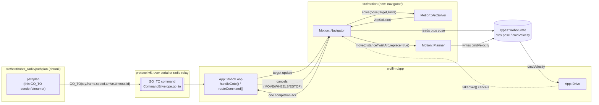

<!-- CLASI: Before changing code or making plans, review the SE process in CLAUDE.md -->

# Sprint 135: Go-To Navigator in the Motion Library

## Goals

Make point-target ("go-to") motion first-class in the motion library, so
proper path planning (pure pursuit and other path followers) has a real
foundation instead of two independent, drifting host-side implementations.
Concretely:

- A new `Motion::Navigator` (`src/motion/navigator/`), layered above
  `Motion::Planner`, that drives a world-frame or robot-frame (x, y) target
  to rest by re-solving a tangent arc every 50 ms cycle and issuing internal
  `planner_.move(distanceTwistArc, replace=true)` calls — the same
  velocity-preserving replace mechanism the host loop already proves out.
- A new `GO_TO` wire arm (protocol v5 addition) that serves BOTH usage modes
  the stakeholder requires with the same mechanism: INTERNAL (the
  Navigator's own per-tick re-solve) and EXTERNAL (a host pure-pursuit
  loop streaming updated targets down the wire).
- A measured, sourced number for inbound command loss, replacing an
  unsourced "~20%" folklore figure that has been silently informing
  EXTERNAL-mode retry-policy assumptions.
- A shrunken host `pathplan` package: once firmware owns arc-solving and
  replace-throttling, `gotoWorld`/`gotoRobot` become thin `GO_TO` senders
  and `followPath` streams targets instead of driving arcs itself.
- The sprint ends runnable and testable: sim-verified end-to-end (both
  frames, both usage modes) plus a hardware smoke test on `tovez` over
  direct serial, satisfying the standing hardware-verification gate.

## Problem

The firmware has no point-target concept today — `Motion::Planner` executes
only scalar-bounded Moves (Time/Distance/Angle/Stop × Twist/Wheels); there is
no x/y target anywhere on the wire or in `Motion::Move`.
`Types::Mode::GoTo = 4` is declared but has zero readers or writers.

The goto loop that DOES exist lives twice, independently, on the host:
`src/host/robot_radio/pathplan/` (the sprint-127 general-purpose
implementation: `solveArcToPoint`, `gotoWorld`/`gotoRobot`/`followPath`,
`ReplaceThreshold`, ack-verified retry) and `src/tests/bench/goto_otos.py`
(a 2026-08-05 OTOS-navigated bench script with its own TURN_FIRST/
fine-approach policy). Both re-derive the same arc-solving and
replace-throttling logic; nothing forces them to agree, and they don't fully
today.

Running the goto loop host-side, rather than firmware-internal, costs real
things: terminal granularity drops from ~7.5 mm (20 Hz internal re-solve at
150 mm/s) to ~80 mm (host cadence, one replan's travel); the loop inherits
an ack-verify/retry/dedup surface that has caused real production failures
(a one-move-sent-in-264-solve-iterations playfield incident; retry-stretched
cycles overshooting a waypoint); and it depends on link quality, host
liveness, and telemetry-silence gating (`TlmMode::kAuto` stops frames when
the robot is idle) for correctness it should not need to depend on.
`Planner::move(..., replace=true)` already preserves velocity across a
replacement (`cmdLeft_`/`cmdRight_`/`cmdLeftPrevious_`/`profileVelocity_`
survive a flush, planner.cpp:243-282) — the proven mechanism this sprint
builds on, not a new one.

## Solution

Layer `Motion::Navigator` above `Motion::Planner`, fed by
`App::RobotLoop::cycle()` just before `planner_.tick()`. It owns one goto
target (x, y, frame, speed, arrival tolerance, timeout, id); each cycle it
reads `Types::RobotState` (OTOS world pose), runs `Motion::ArcSolver` (a
pure C++ port of the host's `solveArcToPoint`), and — only on material
change or at the mandatory half-arc refresh point — issues an internal
`planner_.move(distanceTwistArc, replace=true)`. Both usage modes fall out
of this one mechanism: INTERNAL mode IS the Navigator's own per-tick
re-solve against its last-accepted target; EXTERNAL mode is just a new
target arriving over the wire (a target update, not a new code path). Pure
pursuit itself (path → lookahead point) stays host-side; a lost or late
target update is benign — the robot keeps converging on the previous point
and lands at rest there.

Explicitly rejected: GoTo as a new `Move::Kind` inside the Planner (variable
curvature re-solved within one Move). The Planner's discrete-exact-landing
proof assumes a fixed left:right ratio captured once at Move activation
(planner.cpp:1012-1017, 1689-1699); per-tick re-solved curvature would make
the ratio-handoff hazard the steady state rather than a rare edge case, and
would force OTOS x/y fusion into `PoseTracker` — deliberately deferred to
estimator-v2. A 20 Hz replace stream approximates continuous curvature well
under actuation lag, at far lower risk. See Design Rationale below for the
full alternatives analysis.

## Success Criteria

- `planner_tests`-style ctests: arc-solver parity with `solver.py`;
  Navigator+Planner velocity continuity across N replacements (no
  zero-command tick, bounded per-wheel step); target-behind/pivot handling;
  OTOS staleness and disconnect handling — all green.
- Sim system tests: end-to-end `GO_TO` over the wire codec (both
  world-frame and robot-frame), a streamed-target EXTERNAL-mode scenario —
  all green.
- Stand verification on `tovez` (by UID, never port or default target):
  `GO_TO` smoke over direct serial — enqueue ack, encoders climbing in the
  expected direction, single completion ack — satisfying the standing
  hardware-verification gate for a sprint touching motion and the command
  protocol.
- A measured, dated inbound-command-loss number exists (direct-serial;
  relay leg only if a relay happens to be attached this session), and the
  unsourced "~20%" docstring claims are updated or marked superseded.
- `pathplan.gotoWorld`/`gotoRobot` are thin `GO_TO` senders; `followPath`
  streams `GO_TO` targets; the host's own `solveArcToPoint`/
  `ReplaceThreshold`/curvature-slew-clamp logic is deleted as dead code.

## Scope

### In Scope

- `Motion::ArcSolver` (`src/motion/navigator/arc_solver.{h,cpp}`):
  pure-geometry C++ port of `solveArcToPoint` + omega slew clamp +
  behind-guard; `NavigatorLimits` struct.
- `Motion::Navigator` (`src/motion/navigator/navigator.{h,cpp}`): the
  Idle → (Pivot | Cruise) → FineApproach → Done/Aborted state machine;
  material-change replace throttle; stop-then-pivot sequencing; timeouts;
  OTOS staleness/disconnect policy; TickResult consumption; one completion
  ack per goto.
- Wire: `src/protos/envelope.proto`'s new `GoTo` message + `CommandEnvelope`
  oneof arm `go_to = 26`; `src/protos/commands.proto`'s new
  `Verb.GO_TO = 24`; codegen re-run.
- `App::RobotLoop::handleGoto()`, `routeCommand()` GOTO case, Navigator
  wired into `cycle()`, TickResult routing so internal segment Moves never
  reach the unconditional MOVE-completion ack path, estop/MOVE/WHEELS
  cancellation of an active goto and vice versa.
- `NavigatorLimits` in the robot JSON (`data/robots/*.json`,
  `robot_config.schema.json`) and the bake path (`boot_config.cpp`),
  matching the existing `planner`/`planner_shaper` config-group pattern —
  configuration-discipline invariant (runtime push and bake read the same
  file).
- Every build-list touch point for the two new `.cpp` files: the motion
  library's own CMake project, `src/sim/CMakeLists.txt`'s
  `MOTION_SOURCES`, and every one of the 22 `src/tests/sim/*` pytest files
  whose `_APP_SOURCES` names planner sources.
- Sim system tests (`src/tests/sim/system/`): end-to-end `GO_TO` over the
  wire codec, streamed-target EXTERNAL-mode scenario.
- Bench/HITL: `goto_otos.py` ported to emit `GO_TO`; stand smoke test on
  `tovez` over direct serial.
- A standalone inbound-command-loss measurement script
  (`src/tests/bench/`), serial always, relay conditional on
  `mbdeploy list` showing one attached.
- Host shrink: `pathplan.gotoWorld`/`gotoRobot`/`followPath` become thin
  `GO_TO` senders/streamers; dead arc-solving/throttle code deleted.
- Marking `clasi/issues/later/otos-sampled-only-at-rest-not-integrated-
  during-motion.md` superseded (this directive supersedes it, per the
  issue's own Open Point 2).

### Out of Scope

- `PoseTracker` OTOS x/y fusion (estimator-v2) — the Navigator reads
  `state.otos` directly; no change to how `Motion::Planner`'s internal pose
  estimate is computed. Tracked:
  `clasi/issues/later/estimator-v2-otos-fusion-sim-first.md`.
- GoTo as a `Move::Kind` (rejected design — see Design Rationale).
- Terminal heading targets on `GoTo` (deferred, proto3-additive later).
- Path-curvature feed-forward at the target (deferred; tracked in
  `clasi/issues/later/path-following-hardware-gaps.md`, which also carries
  the still-undiagnosed cloverleaf hardware failure — not this sprint's
  concern).
- Pure pursuit's own lookahead-point selection algorithm — stays host-side,
  unchanged in its own logic (`pursuitTarget()` is kept, not re-implemented
  firmware-side).
- The full camera-supervised playfield A/B (host loop vs. firmware
  Navigator) and the relay leg of the command-loss measurement — both
  need equipment unavailable this session (tovez is disconnected from the
  Raspberry Pi; no relay path) and must not block this sprint; scoped down
  to what direct-serial stand testing can show, with the fuller
  measurement flagged as follow-up in the relevant ticket bodies.

## Test Strategy

Sim-first, per this sprint's stakeholder directive: the arc solver and the
Navigator state machine get standalone ctest coverage (mirroring
`planner/`'s existing `planner_tests` convention — construct with hand-fed
`RobotState`/target values, no hardware, no Python), and the wire-level
behavior gets `src/tests/sim/system/` pytest coverage exercising the real
codec end to end. This is the primary verification tier and is expected to
carry most of this sprint's confidence.

Hardware is available but constrained this session: `tovez` is on the
stand, reachable over DIRECT SERIAL ONLY (disconnected from the Raspberry
Pi; no relay path). The standing hardware-verification gate
(`.claude/rules/hardware-bench-testing.md`) still applies — this is a
firmware sprint touching motion and the command protocol — so acceptance
includes deploying to `tovez` (by UID, never port or default target) and
exercising `GO_TO` on the stand: sensors alive, encoders climbing in the
expected direction under a commanded arc, and a full command/reply
round-trip over the real serial link. The playfield camera-supervised A/B
against the host loop, and the relay leg of the command-loss measurement,
are conditional/deferred — see Scope and ticket 001/006 bodies for the
exact conditions.

## Architecture

**Substantial** — introduces a new subsystem (`Motion::Navigator`, plus its
own `Motion::ArcSolver` collaborator) layered above `Motion::Planner`, a new
cross-module dependency (`App::RobotLoop` → `Motion::Navigator` →
`Motion::Planner`), a new wire message and command-plane arm
(`CommandEnvelope.go_to`, `Verb.GO_TO`), and a new configuration group
(`NavigatorLimits`) with both a runtime push path and a bake path. Four or
more modules are touched (RobotLoop, the two new navigator files, the proto
schema, the config bake path, the host `pathplan` package) and a genuinely
new cross-module dependency is introduced, so this sprint uses the full
7-step methodology with diagrams, not the compact variant.

### Architecture Overview

**Responsibilities this sprint introduces or changes** (Step 2 — grouped by
what changes independently of what):

1. **Arc geometry** — given a current pose and a target point, compute the
   one tangent arc through the target (curvature, length, cruise velocity),
   with a curvature slew clamp and a target-behind guard. Pure math; changes
   only when the geometry itself needs correcting, independent of any
   navigation policy.
2. **Navigation policy** — own the current goal, decide each cycle whether
   to re-solve, replace, hold, pivot, stop-then-pivot, or declare arrival/
   abort; own the one-completion-ack contract. Changes independently of the
   arc math (policy vs. geometry) and independently of wire framing.
3. **Wire ingestion and ownership routing** — get a `GO_TO` command off the
   wire to the Navigator; keep the existing one-owner rule (Drive teleop /
   Planner Move / Navigator goto) intact; keep internal segment Moves from
   leaking a spurious completion ack. Glue that changes with the wire
   schema, not with navigation math.
4. **Configuration** — `NavigatorLimits` values sourced from the robot JSON
   through both the runtime config-push path and the bake path. Changes
   independently of the Navigator's own logic (it's a data-sourcing
   concern, not a behavior concern).
5. **Host-side path following** — pick the next lookahead point from a path
   and stream it as a thin `GO_TO` command with ack-verified retry (link
   loss is real and stays a host-loop concern regardless of where arc-
   solving runs). Changes independently of firmware internals.
6. **Diagnostic measurement** — measure actual inbound command loss over a
   known transport at a known rate. Fully independent of everything else in
   this list; an enabling measurement, not a behavior.

**Modules** (Step 3 — one module per responsibility group above; purpose in
one sentence, no "and"):

- **`Motion::ArcSolver`** (`src/motion/navigator/arc_solver.{h,cpp}`) —
  Purpose: compute the tangent arc from a pose to a target point. Boundary:
  inside — the geometry solve, the curvature slew clamp, the behind-guard,
  the `NavigatorLimits` struct; outside — when to call it, the Planner, the
  wire. No held state across calls except what's threaded explicitly
  (`previousOmega`), matching `solver.py`'s own design. Serves SUC-001,
  SUC-002, SUC-004 (all three exercise the same solve).
- **`Motion::Navigator`** (`src/motion/navigator/navigator.{h,cpp}`) —
  Purpose: drive one goto target to completion by repeatedly re-solving and
  replacing the Planner's active Move. Boundary: inside — the state
  machine, material-change throttling, stop-then-pivot sequencing, OTOS
  staleness/dropout policy, one-ack-per-goto bookkeeping; outside — wire
  parsing, config sourcing, the arc math itself (delegates to `ArcSolver`),
  Planner internals. Depends on `Motion::Planner` (`move()`, `TickResult`)
  and `Types::RobotState` (OTOS pose) — no other `src/firm` dependency,
  matching `planner/`'s own narrower dependency rule (§3,
  `src/motion/DESIGN.md`). Serves SUC-001, SUC-002, SUC-003, SUC-004,
  SUC-005.
- **Wire + routing glue in `App::RobotLoop`** (`src/firm/app/robot_loop.
  {h,cpp}`, plus the proto schema) — Purpose: get a `GO_TO` command from
  the wire to the Navigator without breaking the one-owner rule. Boundary:
  inside — `handleGoto()`, the `routeCommand()` GOTO case, TickResult
  routing around the existing unconditional-ack path, estop/MOVE/WHEELS
  cancellation of an active goto, the `drive_.takeover()` call; outside —
  navigation policy, arc math. Serves SUC-001, SUC-002, SUC-003.
- **`NavigatorLimits` configuration group** (`data/robots/*.json`'s new
  `navigator` block, `robot_config.proto`'s new message, `boot_config.cpp`'s
  `defaultNavigatorGroup()`) — Purpose: supply the Navigator's tunable
  bounds from the one file both the runtime push path and the bake path
  read. Boundary: inside — the JSON schema entry, the proto message, the
  bake function; outside — the Navigator's own runtime behavior. Serves
  every SUC below (every gated behavior is configuration-driven, per
  configuration-discipline).
- **Host `pathplan` package, shrunk** (`src/host/robot_radio/pathplan/
  planner.py`) — Purpose: stream the next lookahead target as a thin
  `GO_TO` command with ack-verified retry. Boundary: inside — `
  pursuitTarget()` (kept unchanged), `MoveIdAllocator`, retry/dedup against
  the accepted-id ring; outside — arc solving, replace-throttling,
  curvature-slew clamping (all now firmware-side, deleted here). Serves
  SUC-002.
- **Command-loss bench script** (`src/tests/bench/`) — Purpose: measure the
  fraction of commands the firmware never acks, over a known transport, at
  a known rate. Boundary: inside — the measurement harness, its use of
  `commandsDroppedCount`/flags bit 18; outside — anything about goto
  itself. Serves SUC-006; an enabling measurement for sizing SUC-002's
  retry policy honestly, not a goto behavior itself.

**Diagram** (Step 4 — required: a new cross-module dependency is
introduced and 4+ modules are touched). One component diagram; its
directional edges also serve as the dependency graph, so a separate
dependency-graph diagram would repeat the same information and is omitted.
No ERD: neither `GoTo` (a wire message) nor `NavigatorLimits` (a flat
config struct) is a relational/persisted entity — both are already fully
specified by this diagram's data flow plus the wire schema in the linked
issue.

### What Changed

- New `src/motion/navigator/` module: `arc_solver.{h,cpp}` (pure geometry,
  C++ port of `solver.py`'s `solveArcToPoint`), `navigator.{h,cpp}` (state
  machine), each with standalone ctest coverage per the motion library's
  existing convention (constructible and testable with hand-fed numbers
  alone, no hardware, no Python).
- `src/protos/envelope.proto`: new `GoTo` message; `CommandEnvelope.cmd`
  oneof gains `go_to = 26` (the next genuinely free field number — verified
  against the file directly: 1-25 are all used or reserved, see Migration
  Concerns).
- `src/protos/commands.proto`: `Verb` enum gains `GO_TO = 24 [(binary) =
  true]` (0-23 are all in use with no gaps — also verified directly, not
  assumed from the linked issue).
- `src/firm/app/robot_loop.{h,cpp}`: `handleGoto()`, a `routeCommand()`
  GOTO case (same shape as the existing MOVE/WHEELS/STOP/ESTOP cases),
  `Navigator` wired into `cycle()` just before `planner_.tick()`, and
  TickResult routing so an internal segment Move (id=0) never reaches
  `publishMoveResult()`'s unconditional ack (robot_loop.cpp:449-451 acks
  unconditionally on `moveResult.completed` today — this is the landmine
  ticket 004 must close). ESTOP/MOVE/WHEELS gain a Navigator-cancel step;
  a `GO_TO` gains a `drive_.takeover()` call, the same one MOVE already
  makes (robot_loop.cpp:228).
- `data/robots/*.json`, `robot_config.schema.json`, `robot_config.proto`:
  new `navigator` config group (`NavigatorLimits`), plumbed through both
  `boot_config.cpp`'s bake path and the existing runtime config-push
  machinery (`GET_CONFIG`/`SET_FIELD`/`CONFIG`), matching the `planner`/
  `planner_shaper` groups' existing pattern exactly.
- Build lists: `src/motion`'s own CMake project (or a sibling, per ticket
  002's own decision — see Open Questions), `src/sim/CMakeLists.txt`'s
  `MOTION_SOURCES`, and all 22 `src/tests/sim/*` pytest files whose
  `_APP_SOURCES` names planner sources (enumerated via `grep -rln
  "planner.cpp" src/tests/sim/` — verified count as of this planning pass).
- `src/tests/sim/system/`: new end-to-end `GO_TO` wire-codec tests, a
  streamed-target EXTERNAL-mode scenario.
- `src/tests/bench/`: `goto_otos.py` ported to emit `GO_TO` instead of
  driving the loop itself; a new standalone inbound-command-loss script.
- `src/host/robot_radio/pathplan/planner.py`: `gotoWorld`/`gotoRobot`
  shrink to thin `GO_TO` senders (ack-verified retry kept); `followPath`
  keeps `pursuitTarget()` and streams `GO_TO` targets instead of driving
  arcs itself; `solveArcToPoint`/`ReplaceThreshold`/the curvature-slew
  clamp become dead code, deleted.
- `clasi/issues/later/otos-sampled-only-at-rest-not-integrated-during-
  motion.md`: marked superseded (this directive, plus already-shipped
  practice, supersedes it — issue's own Open Point 2).

### Why

Terminal granularity: one replan's travel drops from ~80 mm (host cadence)
to ~7.5 mm (20 Hz internal re-solve at 150 mm/s), so settling tolerance
tightens accordingly. The inner loop sheds the ack-verify/retry/dedup
machinery entirely — a surface that has caused real, specific failures (the
one-move-sent-in-264-solve-iterations playfield incident; retry-stretched
cycles overshooting a waypoint, `solver.py:385-389`). It also buys
independence from link quality, host liveness, and telemetry-silence
gating (`TlmMode::kAuto` stops frames while idle). NOT bought: actuation
lag — the 150 ms dead time and 230 ms plant time constant are plant
properties, identical whichever loop closes the arc.

### Impact on Existing Components

- **`Motion::Planner`**: no interface change. `Navigator` is a new caller
  of the existing `move(..., replace=true)` mechanism — the same one host
  code already exercises, and the same one 134-006/`replace-rescales-
  carried-profile-velocity-by-new-shape.md` already fixed to preserve
  velocity correctly across a replacement. Zero changes to `Move` or
  `PlannerLimits` (an explicit design decision — see Migration Concerns),
  so `planner_harness.py`'s append-only ctypes mirror needs no edits.
- **`App::RobotLoop`**: gains one more per-cycle collaborator (`Navigator`)
  and one more `routeCommand()` case, following the exact shape MOVE/
  WHEELS/STOP/ESTOP already use. `publishMoveResult()` needs a filter (id
  != 0, or equivalent) so internal Navigator-issued segments never trigger
  the existing unconditional-ack path — see the Landmines carried into
  ticket 004's body.
- **`App::Drive`**: unaffected in its own control law (the three-timescale
  wheel-speed controller is untouched); its ownership contract
  (`takeover()`) gains one more caller class — a Navigator-issued arc or
  pivot counts as "motion" exactly like any Planner Move does today.
- **`src/host/robot_radio/pathplan/`**: shrinks materially.
  `solveArcToPoint`, `ReplaceThreshold`, the replace-throttle logic inside
  `_sendVerifiedTwist`, and the curvature-slew clamp all become dead code
  once `GO_TO` exists and are deleted in ticket 007. `pursuitTarget()`
  (waypoint lookahead) and the ack-verified retry/dedup machinery survive,
  because they solve problems firmware-internal goto does not: picking the
  next point on a path, and coping with real link loss.
- **`src/tests/bench/goto_otos.py`**: ported to a thin `GO_TO`-emitting
  script; its TURN_FIRST/fine-approach/YAW_SIGN policy knowledge moves
  into `Motion::Navigator` (ticket 003) — the script becomes a driver and
  scorer, not a policy owner.

### Design Rationale

**Decision 1 — Navigator as a layer above the Planner, not a new
`Move::Kind`.**
*Context*: a goto could instead be built as a new Planner Move kind
carrying a live, per-tick-updatable target.
*Alternatives considered*: (a) `GoTo` `Move::Kind` with curvature re-solved
inside the Planner every tick; (b) a `Navigator` layered above the Planner,
issuing ordinary `replace=true` Moves (chosen).
*Why this choice*: the Planner's discrete-exact-landing proof assumes a
fixed left:right ratio captured once at Move activation
(planner.cpp:1012-1017, 1689-1699); per-tick re-solved curvature would make
the ratio-handoff hazard — currently a rare edge case — the steady state,
and would force OTOS x/y fusion into `PoseTracker` (explicitly deferred to
estimator-v2). A 20 Hz replace stream approximates continuous curvature
well under actuation lag, at a fraction of the risk. The trajectory-manager
design of record (`clasi/issues/later/build-a-position-driven-online-
trajectory-manager-after-wheel-positions-are-available.md`) already defers
"variable-curvature geometry within one Move" for the same reason.
*Consequences*: no `Move`/`PlannerLimits` schema change (ticket 002-004
never touch the ctypes mirror); `Navigator` carries its own state machine
and its own config group; `RobotLoop` gains one more per-cycle collaborator
rather than the Planner growing a new internal mode.

**Decision 2 — one mechanism serves both EXTERNAL and INTERNAL usage
modes.**
*Context*: the stakeholder directive requires both a host-streamed mode and
a firmware-autonomous mode.
*Alternatives considered*: (a) two separate implementations — a "just
forward the target" wire path plus a fully separate closed-loop internal
solver; (b) one `Navigator` where INTERNAL is the degenerate case of
re-solving against its own last-accepted target every cycle, and EXTERNAL
is simply a new target arriving over the wire (chosen).
*Why this choice*: both modes need identical feasibility/pivot/stop/arrival
policy. Splitting them risks exactly the drift this sprint already exists
to fix — `pathplan/` and `goto_otos.py` are two independent implementations
of the same policy today, and they don't fully agree.
*Consequences*: `Navigator` has no "who sent this" branch anywhere in its
state machine; a lost or late EXTERNAL target update is benign by
construction — the robot keeps converging on the last-accepted point and
lands at rest there.

**Decision 3 — sim-first verification this sprint; the relay leg and the
full playfield A/B are explicitly conditional, not blocking.**
*Context*: this sprint's own stakeholder directive restricts hardware to
`tovez` on direct serial only (disconnected from the Raspberry Pi, no relay
path this session); the linked issue's verification plan includes a
camera-supervised playfield A/B against the host loop, which needs the
camera and, for an untethered run, the relay.
*Alternatives considered*: (a) defer all hardware verification to a future
sprint; (b) block this sprint on relay/camera access; (c) verify primarily
in sim plus ctests, run a serial-tethered stand smoke test to satisfy the
standing hardware-verification gate, and make the command-loss script's
relay leg and the full playfield A/B explicitly conditional/deferred
(chosen).
*Why this choice*: the standing gate
(`.claude/rules/hardware-bench-testing.md`) requires deploying and
exercising on the stand for any firmware sprint touching motion/protocol —
satisfiable over direct serial alone. The playfield A/B and the relay
measurement need equipment genuinely unavailable this session and must not
block sprint completion.
*Consequences*: ticket 006's stand verification is scoped to what
direct-serial testing can show (enqueue ack, encoders climbing, single
completion ack, `GO_TO` W/R smoke); ticket 001's relay leg runs only if
`mbdeploy list` shows one attached; the full camera-supervised A/B is
carried forward as flagged follow-up in ticket 006's body if not exercised
this session — not silently dropped.

### Migration Concerns

- **Wire is additive.** `go_to`/`GO_TO` are new numbers on top of the
  existing closed set — no existing verb changes meaning, no existing
  client breaks. Confirmed directly against the current proto files (not
  assumed from the linked issue): `CommandEnvelope.cmd`'s next free field
  number is **26** (1, 6, 13, 21, 22, 23, 24, 25 are in use; 2-5, 7-12,
  14-20 are `reserved` from retired pre-102 arms) — the issue's proposed
  `go_to = 26` is correct as written. `Verb`'s next free number is **24**
  (0-23 are all in use with no gaps) — ticket 004 must assign `GO_TO = 24`
  exactly, a number the issue does not itself spell out numerically.
- **`Move`/`PlannerLimits` are unchanged** (explicit design decision, see
  Decision 1) — `planner_harness.py`'s append-only ctypes mirror needs no
  edits this sprint.
- **Config is additive.** A robot JSON with no `navigator` block gets
  `boot_config.cpp`'s defaults, matching the `additionalProperties: false`
  pattern the `planner` group already uses — no existing JSON needs editing
  to keep booting. `tovez.json` (and `gopiv.json`/`togov.json` as
  convenient) should still gain tuned values before ticket 006's bench pass
  so the bake and the pushed config genuinely agree
  (configuration-discipline invariant 2).
- **Deleting host-side `solveArcToPoint`/`ReplaceThreshold` (ticket 007) is
  a breaking change for any OTHER caller** of `pathplan.planner` beyond
  `gotoWorld`/`gotoRobot`/`followPath` — ticket 007 must grep the whole
  repo (including `src/tests/bench/`) for other callers before deleting,
  not just the three functions the linked issue names.
- **Sequencing**: ticket 007 (host shrink) is the sprint's one breaking
  change and is sequenced last among the feature tickets, after ticket 005
  (sim tests) and ticket 006 (bench/HITL) have exercised `GO_TO`
  end-to-end and on hardware — deleting the host loop before `GO_TO` is
  provably solid would leave no way to drive a goto at all.

### Open Questions

1. **Frame convention.** The stakeholder's verbal directive described
   robot-frame targets with "y in the direction of heading"; the codebase
   convention everywhere else (`solver.py`, `goto_otos.py`) is **+x
   forward, +y left**. The linked issue adopts the codebase convention and
   flags this for stakeholder confirmation — carried forward here
   unresolved. Ticket 003/004 implement the codebase convention; revisit if
   the stakeholder says otherwise.
2. **Navigator's own CMake wiring** — whether it becomes its own sibling
   standalone project (matching `planner/`'s pattern) or a lib inside the
   existing `src/motion/CMakeLists.txt` `motion_tests` target. Left to
   ticket 002 to decide against the four-build-list constraint; either
   satisfies the same test/build contract, so this is not decided at the
   architecture level.
3. **Terminal heading targets and curvature feed-forward are explicit v1
   non-goals** (proto3-additive later; feed-forward tracked separately in
   `clasi/issues/later/path-following-hardware-gaps.md`) — not open,
   recorded here so a future ticket doesn't re-litigate why they're
   missing.
4. **Wire error code for OTOS-not-connected goto rejection.** The linked
   issue says goto acceptance is "gated on `otos.connected`" but does not
   name a specific `ErrCode`. Ticket 004 should pick from the existing
   `ErrCode` enum (`ERR_NOT_CONFIGURED` looks closest in spirit — "the
   composition root refused this command because a precondition isn't
   met") rather than inventing a new code, and record the choice in the
   ticket's completion notes.

## Use Cases

### SUC-001: Internal goto navigates to a world- or robot-frame point
Parent: UC-015 (Drive to Relative XY Position)

- **Actor**: `Motion::Navigator` (firmware, autonomous)
- **Preconditions**: OTOS connected and providing a world pose
  (`state.otos.connected`); no MOVE/WHEELS/ESTOP currently owns `App::Drive`.
- **Main Flow**:
  1. A `GO_TO` command (frame = WORLD or ROBOT) is accepted by
     `RobotLoop::handleGoto()`; a robot-frame target is resolved to world
     once, at acceptance (so it does not chase the robot as it turns).
  2. Navigator takes Drive ownership (`drive_.takeover()`) and clears any
     active Planner Move/queue via `replace=true`.
  3. Each 50 ms cycle, Navigator reads `state.otos.{x,y,heading}` and calls
     `ArcSolver::solve()` against the target and the previous cycle's
     `omega`.
  4. When the new solution differs materially from the last one issued (or
     half the in-flight arc has been consumed), Navigator issues
     `planner_.move(distanceTwistArc, replace=true)`.
  5. `Motion::Planner` profiles and actuates the arc exactly as it would
     any other Distance+Twist Move.
  6. Steps 3-5 repeat until the in-flight Move lands within the target's
     arrival tolerance, at rest.
  7. Navigator emits exactly one completion ack, keyed on the `GO_TO`'s id.
- **Postconditions**: robot is at rest within arrival tolerance of the
  target; exactly one completion ack has been sent for this goto id;
  `Motion::Planner` is idle.
- **Acceptance Criteria**:
  - [ ] A world-frame goto sent from rest converges to within the
        configured arrival tolerance and comes to rest, verified in a
        `planner_tests` scenario ctest.
  - [ ] Across N re-solves against a stable target, no tick commands a
        step discontinuity larger than the configured per-cycle bound
        (velocity continuity, asserted numerically, not just plausibly).
  - [ ] Exactly one completion ack is observed for the goto's id; zero
        spurious acks are observed for any internal id=0 segment Move.

### SUC-002: External goto — host streams a moving target (pure pursuit)
Parent: UC-016 (Path Following with PurePursuit)

- **Actor**: Host `pathplan` package, via the Navigator
- **Preconditions**: A waypoint path is loaded host-side; the robot is idle
  or already navigating a goto.
- **Main Flow**:
  1. Host computes the next lookahead point (`pursuitTarget()`, unchanged
     logic) and sends it as a `GO_TO` command.
  2. `RobotLoop::handleGoto()` accepts it, replacing whatever target — a
     prior EXTERNAL target or the Navigator's own INTERNAL re-solve — was
     previously active. There is no code-path distinction between "who
     sent this."
  3. Navigator converges toward the new target exactly as in SUC-001.
  4. Host streams updated targets as `pursuitTarget()` advances along the
     path, at whatever cadence the host loop runs.
  5. If a target update is lost or arrives late, Navigator continues
     converging on the last-accepted target and lands at rest there —
     never stalling or faulting on a missed update.
  6. When the path's final waypoint is reached, the host stops streaming
     and the final goto completes normally (SUC-001's postcondition).
- **Postconditions**: robot has traced the path via a sequence of goto
  targets, arriving at the final waypoint at rest.
- **Acceptance Criteria**:
  - [ ] A sim system test streams a multi-waypoint path over the wire codec
        and the simulated trajectory passes within the lookahead tolerance
        of each intermediate waypoint without coming to rest before the
        final one.
  - [ ] A simulated dropped/delayed target update does not fault or halt
        the Navigator; the robot continues converging on the last-accepted
        target.

### SUC-003: Ownership handoff between goto, teleop, and queued motion
Parent: UC-015

- **Actor**: `App::RobotLoop`, on behalf of any wire client
- **Preconditions**: A goto is active (Navigator owns Drive), or a MOVE/
  WHEELS/ESTOP arrives while a goto is active — or vice versa.
- **Main Flow**:
  1. A MOVE, WHEELS, or ESTOP arrives while a goto is in progress.
  2. `RobotLoop` cancels the active Navigator target — no completion ack
     is emitted, the goto was preempted, not completed — and hands
     ownership to the new command's normal handler, the same way MOVE and
     WHEELS already preempt each other today.
  3. Conversely, a `GO_TO` arriving while WHEELS teleop is active cancels
     the teleop hold and takes ownership via `drive_.takeover()`, the same
     call MOVE already makes.
  4. An ESTOP always wins immediately regardless of current owner: wheel
     targets zero and both the Planner's queue and any active Navigator
     target clear in the same cycle.
- **Postconditions**: exactly one subsystem owns Drive at any time; a
  preempted goto emits no completion ack; ESTOP always takes effect within
  one cycle regardless of what it preempts.
- **Acceptance Criteria**:
  - [ ] Scenario: `GO_TO` then MOVE mid-goto — the goto is abandoned with
        no completion ack and the MOVE executes normally.
  - [ ] Scenario: WHEELS then `GO_TO` mid-teleop — Drive ownership
        transfers and the goto proceeds.
  - [ ] Scenario: `GO_TO` then ESTOP — wheel targets zero and the
        Navigator's target clears within one cycle.

### SUC-004: Target behind, or requiring a large heading change
Parent: UC-015

- **Actor**: `Motion::Navigator`
- **Preconditions**: A goto target's body-frame bearing exceeds the
  behind-guard angle (~90°, no tangent arc exists) or the pivot-first
  threshold (TURN_FIRST, ~50°) while the robot is moving.
- **Main Flow**:
  1. Navigator's per-cycle solve detects the bearing exceeds TURN_FIRST, or
     that the target is fully behind.
  2. If the robot is currently moving, Navigator enqueues a planned stop
     (`plannedStop()`) followed by a queued pivot Move, rather than
     replacing the in-flight arc at speed — which would ratio-lock
     hard-brake the reversing wheel.
  3. Once at rest, Navigator issues the pivot Move to face the target.
  4. Once the pivot lands, Navigator resumes normal per-cycle re-solving
     (SUC-001) toward the target.
  5. For bearings under TURN_FIRST, Navigator never pivots — the error is
     steered out with curvature alone, by construction (a measured
     limit-cycle otherwise).
- **Postconditions**: the robot reaches the target without ever attempting
  an infeasible or unsafe arc; no pivot/curvature oscillation for small
  bearings.
- **Acceptance Criteria**:
  - [ ] A ctest scenario with a target initially behind the robot exercises
        stop-then-pivot-then-arc and completes without an infeasible-arc
        fault.
  - [ ] A ctest scenario sweeping bearing angles just under and over
        TURN_FIRST confirms no pivot fires below the threshold and no
        persistent oscillation occurs at or near it.

### SUC-005: OTOS staleness or disconnect during an active goto
Parent: UC-015

- **Actor**: `Motion::Navigator`
- **Preconditions**: A goto is active; the OTOS sample becomes stale (no
  fresh update for longer than a configured window) or
  `state.otos.connected` drops.
- **Main Flow**:
  1. On staleness (update overdue but still connected), Navigator skips
     that cycle's re-solve and lets the already-issued, in-flight Move
     continue to its own landing — no blind replace is issued.
  2. On a real disconnect (`connected` becomes false), Navigator propagates
     position from `state.pose` (encoder odometry) deltas for a bounded
     window, continuing to converge approximately.
  3. If the disconnect persists past that bounded window, Navigator aborts
     the goto: zeroes the Move, emits a fault-flagged completion ack, and
     releases Drive ownership.
- **Postconditions**: transient staleness never causes an abrupt stop or a
  wild re-solve; a persistent disconnect ends the goto safely and
  observably (fault flag set, not silently stuck).
- **Acceptance Criteria**:
  - [ ] A ctest scenario with a single-cycle stale OTOS sample shows the
        in-flight Move continues unchanged that cycle.
  - [ ] A ctest scenario with a sustained OTOS disconnect shows the goto
        aborts within the configured bounded window, with a fault-flagged
        completion ack observed and Drive ownership released.

### SUC-006: Inbound command loss is measured, not assumed
Parent: UC-019 (Radio Relay Mode)

- **Actor**: Bench engineer running the ticket-001 measurement script
- **Preconditions**: `tovez` is connected and identified by UID; a relay
  may or may not be attached (`mbdeploy list`).
- **Main Flow**:
  1. Script streams N id-distinct commands at a known rate over direct USB
     serial.
  2. Script counts enqueue acks received and reads `commandsDroppedCount`/
     telemetry flags bit 18 (never consulted by any prior bench script) to
     split link loss from firmware ring overflow.
  3. If `mbdeploy list` shows a relay attached this session, the script
     repeats the measurement over the relay leg; if not, that leg is
     reported skipped, not failed, and the sprint is not blocked on it.
  4. Script reports a measured loss percentage (direct-serial, and relay if
     available) with raw counts, replacing the unsourced "~20%" folklore
     figure in `speed_map.py`/`square_tour.py`/`planner_square_tour.py`'s
     docstrings.
- **Postconditions**: a sourced, dated measurement exists for inbound
  command loss; ticket 007's EXTERNAL-mode retry policy is sized against a
  real number, not folklore.
- **Acceptance Criteria**:
  - [ ] Script runs standalone against `tovez` (by UID) over direct serial
        and reports a measured loss percentage plus a
        `commandsDroppedCount` reading.
  - [ ] The relay leg is attempted only when `mbdeploy list` shows a relay
        attached this session; its absence does not fail the script or
        block the sprint.
  - [ ] The unsourced "~20%" docstring claims are updated to cite this
        measurement (or explicitly marked superseded) in the same ticket.

## GitHub Issues

(None — this sprint is scoped from `clasi/issues/replaceable-go-to-moves-
in-the-motion-library.md`, not a GitHub issue.)

## Definition of Ready

Before tickets can be created, all of the following must be true:

- [x] Sprint planning document is complete (sprint.md, including its
      Architecture and Use Cases sections)
- [ ] Architecture review passed (or skipped, for changes with no
      architectural impact)
- [ ] Stakeholder has approved the sprint plan

## Tickets

| # | Title | Depends On |
|---|-------|------------|
| 001 | Measure inbound command loss (serial always, relay conditional) | — |
| 002 | Arc-solver core (Motion::ArcSolver, NavigatorLimits) | — |
| 003 | Navigator state machine (Motion::Navigator) | 002 |
| 004 | Wire + routing: GO_TO proto arm, RobotLoop integration, NavigatorLimits config | 003 |
| 005 | Sim system tests: GO_TO end-to-end over the wire codec | 004 |
| 006 | Bench/HITL: port goto_otos.py to GO_TO, stand verification on tovez | 005 |
| 007 | Host shrink: pathplan gotoWorld/gotoRobot/followPath become thin GO_TO senders | 004 |

Tickets execute serially in the order listed. Ticket 001 has no code
dependency on any other ticket and may run at any point in the sequence —
listed first because it is foundational per the linked issue's own
staging, not because anything blocks on it. Ticket 007 depends technically
only on 004, but is sequenced last (after 005 and 006) because it is this
sprint's one breaking change — see sprint.md's Migration Concerns and
ticket 007's own Sequencing section.
