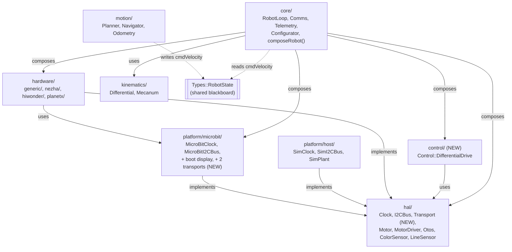

<!-- CLASI: Before changing code or making plans, review the SE process in CLAUDE.md -->

# Sprint 136: Green baseline and firmware layering: interfaces to hal, com dissolved, control law out of core

## Goals

1. **Establish a trustworthy test baseline** (Half A) — every currently-failing
   unit/sim test either fixed or formally, explicitly accepted with a tracked
   reason, so that "no new regressions" is a claim Half B can actually make.
2. **Execute the firmware-layering cleanup** (Half B) — move `platform/clock.h`
   and `platform/i2c_bus.h`'s interfaces into `hal/`, dissolve `com/` into
   `Hal::Transport` implementors under `platform/microbit/`, pull the
   wheel-speed control law out of `core/` into a new `control/` layer, rename
   `kinematics/`'s stuttering type names and the `Board`-named motor-driver
   classes, delete confirmed dead code (`Core::FakeOtos`, `com/radio_channel.h`,
   stale `src/motion`/`src/sim` build residue), and reduce `main.cpp` to boot
   sequencing only by relocating its three non-entry-point helpers.
3. **Close out the reorganization proposal's remaining open item** — verify
   (not just assert) that the proposal's steps 1-6 are genuinely landed, and
   that this sprint's own work resolves step 6 (`FakeOtos` placement, by
   deletion).

## Problem

**Half A.** Measured today on clean HEAD (`5cf125f0`): `src/tests/unit` runs
14 failed / 961 passed; `src/tests/sim` runs 39 failed / 455 passed / 2
xfailed / 1 xpassed. None of these are triaged in a way a sprint can rely on.
Half B moves roughly 10 source files across roughly 49 hardcoded
build/test source-list references (see Architecture, Impact section) — pytest
is the *only* mechanism that catches a missed one, and a red baseline makes a
broken harness indistinguishable from pre-existing noise. This has already
cost two prior sprints (130, 131) exactly this way — see
`clasi/issues/later/A-seven-untriaged-failing-tests-poison-every-no-
regressions-claim.md`.

Direct investigation during planning root-caused the dominant cluster
precisely (not estimated): `data/robots/tovez_nocal.json` and
`data/robots/togov.json` are both missing the `wheel_control.stall_speed` /
`stall_demand` / `stall_window` keys that `gen_boot_config.py` has required,
fail-closed, since the 2026-08-08 stall-detection directive (the same gap
`.claude/rules/hardware-bench-testing.md` already documents for `gopiv.json`,
fixed there 2026-08-09). One missing key group cascades into **37** failures
in `src/tests/sim/unit/test_gen_boot_config_required_keys.py` alone (measured
directly: the fixture's own missing-key error masks every parametrized
case's intended assertion) plus 5 more in
`src/tests/unit/test_pos_err_max_config_surface.py`. A second, independent
cluster — 9 tests across `test_gen_boot_config_otos.py`,
`test_gen_boot_config_planner.py`, `test_gen_boot_config_robot_groups.py`,
and `test_calibration_kwargs.py` — asserts generated boot config against
hardcoded literals (`cfg.linear_scale = 1.0275f`, `cfg.v_min = 99.7f`, ...)
that `tovez.json`'s legitimate re-measurement history has since superseded
(current values: `1.0188`, `20.0`, ...) — exactly the pattern
`clasi/issues/later/B-gen-boot-config-parity-tests-encode-superseded-
literals.md` already names for 3 of these 9. Two more failures are
independent, genuine test/doc lag, not config gaps: `test_command_registry.py
::test_verb_inventory_matches_the_issue_spec` doesn't know about the
`CALIBRATE` verb (added `3a05bab9`, never back-filled into the test's
expected set or `docs/protocol-v5.md`'s §4 table), and
`test_pos_err_max_config_surface.py::test_no_wheel_control_field_was_
renumbered_or_reused` doesn't know about wire field numbers 13-15
(`stall_speed`/`stall_demand`/`stall_window`, the same feature). Together
these two clusters plus the two singletons account for roughly 45-50 of the
53 measured failures. The remainder — turn-accuracy/tour-completion tests in
`src/tests/testgui/` (`test_tour_closure_gate.py`,
`test_gui_button_acceptance.py`'s two tour tests, `test_otos_calibration_
convergence.py`, `test_camera_combo.py`) — is real, previously-flagged,
unresolved firmware behavior (`decelLatched`/shaping-band territory,
`clasi/issues/later/A-tour2-146-degree-turn-still-undershoots-after-130-
010.md`) that is out of proportion to fix inside a baseline-and-layering
sprint; ticket 002 formally accepts these with strict, issue-referenced
`xfail` marks rather than attempting a fix.

**Half B.** `src/firm`'s August 2026 platform/hardware/hal reorganization
created the layer *directories* but left several files in the wrong one:
`platform/clock.h`/`i2c_bus.h` are pure interfaces (`namespace Platform`)
sitting in the directory whose job is per-target *implementations*; `com/`
holds concrete CODAL byte pipes in the *global namespace* — the only
firmware symbols with none — outside the layering entirely, with the
`Hal`-shaped interface they want (`Core::Transport`) buried inside
`core/comms.h` behind `#ifndef HOST_BUILD`; `core/differential_drive.{h,cpp}`
is the wheel-speed *control law* (PID, Stage A/B/C correction, bias
adaptation, stall latches), not orchestration; `Kinematics::
DifferentialKinematics`/`MecanumKinematics` stutter against their own
namespace; and `src/motion`/`src/sim` are stale, gitignored build residue
whose CMake targets build files sprint 128 already deleted. Separately,
`main.cpp` — whose own header claims "no cycle logic and no graph-
construction logic" — still carries `versionTag()` (pure string logic,
untested because it's ARM-only), `showBootIdentity()` (a CODAL-bound
boot-time UI routine misplaced in the entry point), and the `ID:` wire-line
`snprintf` (inconsistent with its own sibling, `formatBanner()`, which
already lives outside `main`).

## Solution

Two halves, hard-gated: Half A (tickets 001-002) must complete before any
Half B ticket (003-009) starts. Half A root-causes and either fixes or
formally accepts every current test failure, establishing a baseline Half B
can trust. Half B executes the layering cleanup's six phases plus the
board-to-motor-driver rename and the main.cpp de-junking (riding with the
com/-dissolution phase, since both land files in the same place), in
dependency order, each phase smoke-verified (`just build-sim` + layer
isolation test) rather than full-suite-gated per ticket. The sprint's final
ticket runs the one full-suite regression pass, bench-verifies on `gopiv`
(the only robot on this session's hub), and restores `tovez` as the active
robot before the sprint can close.

## Success Criteria

- [ ] Every test failing on clean HEAD is either fixed or carries a strict
      `xfail` with a reason naming a tracked issue; a fresh
      `uv run python -m pytest` run's failure set contains only entries
      named in a tracked issue.
- [ ] `clasi/issues/later/B-gen-boot-config-parity-tests-encode-superseded-
      literals.md` is resolved and moved to done.
- [ ] `test_layer_isolation.py` enforces `platform/` → `hal/` as an allowed
      include (in addition to the pre-existing rules) and all three layers'
      rules still pass against the moved tree.
- [ ] `com/` no longer exists; `Hal::Transport` and its two `platform/
      microbit/` implementors compile on both the ARM and host targets.
- [ ] `src/firm/control/` exists, holds `Control::DifferentialDrive`
      (relocated, not rewritten), and has a co-located `DESIGN.md`.
- [ ] `Kinematics::Differential`/`Mecanum` and `Hal::MotorDriver`/
      `Hardware::HiwonderDriver`/`Hardware::MotorDriverChannel` replace their
      pre-sprint names repo-wide (excluding
      `.claude/worktrees/rogo-revival/`).
- [ ] `main.cpp` carries boot sequencing only; `versionTag()` has a host-side
      unit test it never had before.
- [ ] `proposal-platform-hardware-hal-core-reorganization.md`'s steps 1-6 are
      independently re-verified (not re-asserted) and the issue is updated to
      reflect steps 7-8 as the only remaining open work, owned elsewhere.
- [ ] `uv run python3 build.py --clean` (ARM + host) and a full
      `uv run python -m pytest` are both clean against the Half A baseline.
- [ ] `gopiv` (UID `9906360200052820049d38a46da36a83000000006e052820`)
      bench-verified per the standing hardware gate (sensors respond,
      wheels drive with climbing encoders, round-trip over direct USB) —
      OTOS/line/colour excluded, per its known non-population.
- [ ] `data/robots/active_robot.json` points back at `tovez.json` and
      `src/firm/config/boot_config.cpp` is rebuilt from it before close.

## Scope

### In Scope

- Root-causing and resolving (fix or formally-accepted `xfail`) the current
  unit/sim test failure set.
- The firmware-layering cleanup's six phases (dead code; interfaces to
  `hal/`; dissolve `com/`; control law to `control/`; kinematics rename;
  documentation) plus phase 5b (board → motor-driver rename).
- The `main.cpp` de-junking (`showBootIdentity`, `versionTag`, the `ID:`
  line), landing alongside phase 3 since it shares the same destination
  files.
- Verifying and closing out the reorganization proposal's remaining item.
- The standing hardware bench gate on `gopiv`, and restoring `tovez` as the
  active robot before close.

### Out of Scope

- **`Hal::Wheel`** (the closed-loop-velocity actuator abstraction the control
  law will eventually migrate onto) — explicitly deferred, `hal/DESIGN.md`
  §4; this sprint relocates the control law verbatim, it does not redesign
  it.
- **Transport generalization** (N transports, `WifiTransport`) — proposal
  step 7, a separate, additive future sprint.
- **`Robot`/`RobotState` formalization** (bus arbitration ownership,
  extensible `RobotState`) — proposal step 8, its own design pass.
- **Turn-accuracy / tour-completion behavioral fixes** — the
  `decelLatched`/shaping-band family surfaced in Half A's investigation is
  formally accepted (tracked `xfail`), not fixed, this sprint.
- **`togov.json` drive characterization** — this sprint adds the three
  required `wheel_control.stall_*` keys at the documented inert value (`0`,
  matching `gopiv.json`'s 2026-08-09 precedent) so the generator and its
  tests stop failing; it does not run a duty sweep or otherwise calibrate
  `togov`.
- **`ColorSensorLeaf`/`LineSensorLeaf`'s generic-vs-project-specific
  classification** — the proposal's own Hardware section flags this check
  as not yet done; this sprint does not do it.

## Test Strategy

- **Half A (001-002):** the tickets' entire job is running and triaging the
  full three-suite `uv run python -m pytest` — no smoke-test shortcut
  applies here.
- **Half B, per ticket (003-008):** `just build-sim` (~8s) plus
  `uv run python -m pytest src/tests/sim/unit/test_layer_isolation.py` —
  fast smoke only, per the standing per-ticket-verification directive. No
  ticket in this range runs the full suite.
- **Once, at sprint end (009):** the full regression pass —
  `uv run python3 build.py --clean` (ARM `MICROBIT.hex` + host sim library)
  and `uv run python -m pytest` across `src/tests/{unit,sim,testgui}` —
  plus the standing hardware bench gate on `gopiv`
  (`src/tests/bench/twist_drive.py`, `src/tests/bench/move_protocol_bench.py`)
  and the `tovez` restore.

## Architecture

**Substantial** — this sprint touches 7+ existing modules
(`platform/`, `hal/`, `hardware/`, `com/` [deleted], `core/`, `kinematics/`,
`main.cpp`), introduces one new module (`control/`), changes a
cross-module dependency direction (`platform/` gains a dependency on
`hal/`, which it did not have before), and dissolves an entire
previously-unlayered module (`com/`) into two other layers. This clears
every "substantial" trigger in the sizing rubric on its own; the full
7-step methodology applies, with a required component diagram (a
cross-module dependency-direction change on its own would already require
one).

### Step 1 — Understand the Problem

Covered above (Problem section). In one sentence: the reorg's directories
exist but several files don't yet live where their own stated purpose says
they should, and `main.cpp` accreted helpers that were never entry-point
work.

### Step 2 — Identify Responsibilities

Distinct responsibilities this sprint touches, grouped by what changes
together:

1. **Bus/clock/timing primitives** (`platform/clock.h`, `platform/i2c_bus.h`)
   — currently misfiled as `Platform::`-namespaced interfaces; they change
   for the same reason every other `hal/` interface changes (a new consumer
   needs a new capability), not for platform-primitive reasons.
2. **Byte-pipe transports** (`com/serial_port.*`, `com/radio.*`,
   `com/banner.*`) — CODAL-bound concrete implementations with no
   abstraction and no namespace today; they change when the wire framing or
   the physical link changes, which is a `platform/microbit/` concern once
   `Hal::Transport` exists to implement.
3. **The wheel-speed control law** (`core/differential_drive.*`) — changes
   when tuning, stall policy, or the correction/adaptation machinery
   changes; none of those are orchestration concerns.
4. **Kinematics naming** (`kinematics/differential_kinematics.*`,
   `mecanum_kinematics.*`) — no behavior change, pure naming cohesion with
   the enclosing `Kinematics::` namespace.
5. **Motor-driver naming** (`hal/motor_board.h`, `hardware/hiwonder/
   hiwonder_board.*`, `hardware/generic/board_motor.*`) — stakeholder-
   directed rename, no behavior change.
6. **Dead code** (`Core::FakeOtos`, `com/radio_channel.h`, stale
   `src/motion`/`src/sim` build residue) — removal, not relocation; these
   have zero live consumers (verified during planning: `--fake-otos`
   defaults `False` everywhere, no robot JSON or CI script sets it;
   `radio_channel.h` has zero includers repo-wide).
7. **`main.cpp`'s non-entry-point helpers** (`versionTag()`,
   `showBootIdentity()`, the `ID:` line) — three unrelated concerns
   (pure string logic, boot-time CODAL UI, wire-format identity string)
   that happen to currently share a file only because that file had every
   symbol they needed in scope.
8. **Documentation** — catching up `CLAUDE.md`, `docs/design/design.md` §2,
   every touched subsystem's `DESIGN.md`, and two stale cross-references
   (`.claude/rules/hardware-bench-testing.md`'s `radiochan::kDefault` claim,
   `src/protos/robot_config.proto`'s stale `src/motion` paths) to the
   post-move tree.
9. **Test-harness config gap + stale-literal test cluster** (Half A) —
   changes for a different reason than any of the above: it's the
   precondition, not a layering concern, which is why it is gated ahead of
   1-8 rather than interleaved with them.

### Step 3 — Define Subsystems and Modules

Each existing module's purpose, boundary, and use cases it serves, focused
on what this sprint changes about it (full existing responsibilities are in
each module's own `DESIGN.md`; this section covers deltas only):

| Module | Purpose (one sentence, no "and") | Boundary after this sprint | Serves |
|---|---|---|---|
| `platform/` | Supply per-target implementations of the primitive interfaces `hal/` declares. | Gains zero new interfaces of its own; instead *implements* `hal/`'s `Clock`/`I2CBus`/`Transport`, and gains `microbit/`'s boot-display file and the two relocated transport pipes. May now include `hal/` (new). | SUC-002 |
| `hal/` | Declare the interfaces composable devices and platform primitives are written against. | Gains `Clock`, `I2CBus`, `Transport` (moved in from `platform/`/`core/`); `MotorBoard` renamed `MotorDriver`. Still interfaces-only, no chip knowledge, no implementations. | SUC-002 |
| `hardware/` | Hold concrete device drivers, filed by who else could reuse them. | `hiwonder_board.*`/`board_motor.*` renamed to name what they are (a driver, a driver's channel); no file moves between `generic/`/`nezha/`/`hiwonder/`/`planetx/`. | SUC-002 |
| `com/` | **Deleted.** | Its two responsibilities (the `Transport` interface, the two concrete pipes) move to `hal/` and `platform/microbit/` respectively; `com/DESIGN.md` and the directory are removed. | SUC-002 |
| `control/` (new) | Own the closed-loop wheel-speed control law. | Sits between `hal/` and `core/`: may reach down into `hal/` and `firm/types/`, may not reach `core/`, `motion/`, or `kinematics/`. Holds `Control::DifferentialDrive` only — a pure relocation of `core/differential_drive.*`, behavior untouched. | SUC-002 |
| `kinematics/` | Provide the swappable twist↔wheel-speed map. | Same interface and behavior; `DifferentialKinematics`/`MecanumKinematics` renamed `Differential`/`Mecanum`, files renamed to match. | SUC-002 |
| `core/` | Orchestrate: the cooperative tick loop, composition root, and the passive modules the loop owns. | Loses the control law (now composes a `Control::DifferentialDrive` instead of owning one) and `FakeOtos` (deleted). Otherwise unchanged. | SUC-002 |
| `main.cpp` | Sequence boot: construct the graph, bring up buses in order, start the loop. | Loses `versionTag()`, `showBootIdentity()`, and the `ID:` line's construction; keeps *calling* them (or their replacements) in the same order, which is a genuine behavioral invariant, not incidental. | SUC-003 |

### Step 4 — Diagrams

A component diagram is required (cross-module dependency-direction change,
multiple modules touched). A separate dependency graph is not included as a
second diagram: this system has exactly one edge type end to end
(compile-time `#include` dependency), so a dependency graph would repeat
the component diagram's own nodes and edges with no additional information
— the same reasoning sprint 020 used to justify omitting a diagram it
judged redundant, applied here to omitting a *second* one instead of the
first. No ERD: no persisted data model changes (the two robot JSONs gain
values for fields their schema already declares; no new field, no new
message, no new table).

Two callouts the diagram alone doesn't carry:

- **`com/` is not a node** — it is deleted; its former responsibilities are
  the `Hal::Transport` edge into `platform/microbit/` and the `hal/` node's
  new `Transport` interface. There is no node-for-node replacement because
  the whole point of the change is that a fourth, un-layered directory
  becomes two things two *existing* layers already know how to hold.
- **`platform/` → `hal/` is the one dependency-direction change.** Before
  this sprint, `test_layer_isolation.py` allowed `platform/` to include
  only `platform/`. After, `platform/` may also include `hal/` — because
  `platform/microbit/` now *implements* `hal/`'s `Clock`/`I2CBus`/
  `Transport` rather than declaring its own. `hardware/`'s allowed prefixes
  (`hardware/`, `hal/`, `platform/`) are unchanged.

### Step 5 — Complete the Document

**What Changed** — see Step 3's table plus the dead-code removals (Step 2,
item 6) and the `main.cpp` relocations (Step 2, item 7).

**Why** — see Problem, above: the directories existed but several files'
actual location didn't match the purpose their own `DESIGN.md` already
claimed for them; this sprint closes that gap mechanically, with the one
already-decided exception (`Hal::Wheel`) explicitly deferred.

**Impact on Existing Components** — concretely, this sprint moves or
deletes these files:

- Moved: `platform/clock.h`, `platform/i2c_bus.h` → `hal/`.
- Moved: `com/serial_port.*` → `platform/microbit/microbit_serial_port.*`;
  `com/radio.*` → `platform/microbit/microbit_radio_link.*`;
  `com/banner.*` → `platform/microbit/microbit_banner.*`.
- New: `hal/transport.h` (extracted from `core/comms.h`).
- Deleted: `com/radio_channel.h`, `com/DESIGN.md`, the `com/` directory;
  `core/fake_otos.{h,cpp}` and every `#ifdef FAKE_OTOS` site; `src/motion`,
  `src/sim` (gitignored build residue) and their dead CMake target
  references.
- Moved: `core/differential_drive.*` → `control/differential_drive.*`
  (new `control/DESIGN.md` required).
- Renamed: `kinematics/differential_kinematics.*` →
  `kinematics/differential.*`; `kinematics/mecanum_kinematics.*` →
  `kinematics/mecanum.*`; `hal/motor_board.h` → `hal/motor_driver.h`;
  `hardware/hiwonder/hiwonder_board.*` → `hiwonder_driver.*`;
  `hardware/generic/board_motor.*` → `motor_driver_channel.*`
  (see Design Rationale for the name).
- Relocated (not moved as files, extracted as new ones):
  `main.cpp`'s `showBootIdentity()` → a new `platform/microbit/` file;
  `versionTag()` → a new testable home (host-buildable); the `ID:` line's
  construction → alongside `formatBanner()` in `platform/microbit/
  microbit_banner.*`.

Every one of the moved/renamed `.cpp` files is currently named explicitly
in at least one non-ARM build target — `src/firm/platform/host/
CMakeLists.txt` (confirmed directly during planning: it names
`core/differential_drive.cpp` and `kinematics/differential_kinematics.cpp`
literally, by path) and some subset of the 24 pytest files carrying
`_APP_SOURCES`-family lists plus ~20 more naming individual `_*_SRC` paths
(49 total files, confirmed by repo-wide grep during planning, excluding
`.claude/worktrees/rogo-revival/`). The ARM image itself globs
`src/firm/**/*.cpp` and needs no update for any move *inside* `src/firm` —
but `hardware/generic/board_motor.cpp` and `hardware/hiwonder/
hiwonder_board.cpp` reach that image **glob-only** (confirmed: they appear
in no explicit list anywhere), so their rename is the one move in this
sprint with no explicit-list safety net at all — a missed reference there
would show up as nothing, not a build error, unless the ARM build itself is
actually run.

**Migration Concerns** — no persisted data migration: `Types::RobotState`
is untouched, and the two robot JSONs (`tovez_nocal.json`, `togov.json`)
gain values for `wheel_control.stall_speed`/`stall_demand`/`stall_window`
keys their schema already declares (protobuf field numbers 13-15 already
exist; only the JSON values and the two lagging tests are new). Nothing in
this sprint changes the wire protocol — no message field, no verb, no
frame shape. Deployment sequencing: `gopiv` is the only robot on this
session's hub, so hardware verification happens there instead of `tovez`;
building for `gopiv` rewrites the tracked `data/robots/active_robot.json`
pointer and regenerates `src/firm/config/boot_config.cpp` from `gopiv.json`
— both must be restored to `tovez.json` and rebuilt before the sprint
closes (ticket 009), or the next session inherits a tree that silently
boots `tovez` hardware from `gopiv`'s baked config. `FAKE_OTOS`'s removal
is confirmed safe (not merely assumed): grepped during planning for every
`fake-otos`/`FAKE_OTOS` reference outside `src/firm/core/fake_otos.*` and
its own doc mentions — the flag defaults `False`/`OFF` everywhere and no
robot JSON, CI script, or `justfile` recipe ever sets it.

### Step 6 — Design Rationale

**Decision: `Hardware::BoardMotor` → `Hardware::MotorDriverChannel`, not
`DriverMotor`.**
- *Context*: the source issue names the rename as directed but leaves the
  new name for `board_motor.*` explicitly open ("name it at sprint time;
  `DriverMotor` is the mechanical answer but reads poorly").
- *Alternatives considered*: `Hardware::DriverMotor` (the issue's own
  candidate — rejected: reads as "a motor that drives," not "one channel of
  a driver," which is backwards); a bare `Hardware::GenericMotor`
  (rejected: loses the fact that it's a *channel* of a `MotorDriver`, and
  invites confusion with `hal/`'s own `Hal::Motor` interface it
  implements); `Hardware::MotorDriverLeaf` (considered, matching this
  codebase's existing `ColorSensorLeaf`/`LineSensorLeaf` convention —
  rejected because those two are standalone I2C devices, not one channel of
  a multi-channel board, so "leaf" would imply a device this class isn't).
- *Why this choice*: `MotorDriverChannel` states exactly what the object
  is — one channel of a `Hal::MotorDriver`-family board, presented as a
  `Hal::Motor` — matching its actual role without colliding with an
  existing name.
- *Consequences*: file becomes `hardware/generic/motor_driver_channel.{h,
  cpp}`. Confirmed zero callers outside its own file (per the source issue;
  re-verified during planning), so the rename's blast radius is the class's
  own two files plus prose references in `hardware/DESIGN.md` and
  `hal/DESIGN.md`.

**Decision: the control law gets a brand-new `control/` layer, not folded
into `kinematics/` or left in `core/`.**
- *Context*: `Core::DifferentialDrive` (`fastPid()` plus Stage A/B/C
  correction, bias adaptation, stall latches) is neither pure geometry
  (kinematics' job: a stateless twist↔wheel-speed map, no PID, no stall
  state) nor pure orchestration (core's job: composition and the
  cooperative tick loop) — it is closed-loop control, a distinct concern
  with its own state that changes for reasons neither of the other two
  do.
- *Alternatives considered*: (a) leave it in `core/` — rejected, because
  `core/`'s own purpose is orchestration, and the issue this sprint
  resolves says exactly that; (b) fold it into `hal/` as logic behind an
  interface — rejected, `hal/` is interfaces-only with no chip knowledge
  and no stateful control logic anywhere else in it; adding one file that
  isn't an interface would break the one invariant every other `hal/` file
  honors; (c) fold it into `kinematics/` — rejected, kinematics is
  stateless geometry, and PID/stall state would break its cohesion exactly
  the way leaving it in `core/` breaks core's.
- *Why this choice*: a new, single-purpose `control/` layer keeps every
  existing layer's one-sentence purpose intact, and gives the control law
  a home whose only reason to change is the control law itself.
- *Consequences*: one new top-level directory; a new co-located
  `control/DESIGN.md` is required (ticket 006). No `test_layer_isolation.py`
  entry is needed — same treatment as `core/`, `kinematics/`, and
  `motion/`, none of which are in that test's three-layer table today.
  Layer position: `hal/` → `control/` → `core/`; `control/` may reach
  `hal/` and `firm/types/`, not `core/` or `motion/`.

**Decision: `com/`'s two transports move into `platform/microbit/`, not a
new top-level `transport/` directory.**
- *Context*: the interface they want (`Core::Transport`, to become
  `Hal::Transport`) already exists, buried in `core/comms.h`; the two
  concrete pipes (`SerialPort`, `Radio`) are CODAL-bound with no namespace
  today.
- *Alternatives considered*: a new top-level `transport/` layer paralleling
  `hardware/` — rejected as unneeded indirection: these two are CODAL-bound
  exactly the way `MicroBitClock`/`MicroBitI2CBus` already are, so they
  pass the same "compute-platform-intrinsic" test the reorg proposal
  already applied to clock and bus, and `platform/microbit/` already exists
  as their natural neighbor at zero new-directory cost; leaving `com/` as a
  fourth cross-cutting floor beside `config/`/`messages/`/`types/` —
  rejected, because once `Hal::Transport` is extracted it *is*
  `hal/`-shaped, and leaving its implementors outside the layering is
  exactly the mismatch this sprint exists to close.
- *Why this choice*: matches the reorg's own established pattern
  (`platform/<target>/` holds every target-bound primitive) instead of
  inventing a fifth layer for two files.
- *Consequences*: `Core::Transport` renames to `Hal::Transport` repo-wide —
  every call site that names the type (`TestSupport::FakeTransport`,
  `Core::Comms`'s two named slots, `main.cpp`'s composition) is touched;
  `com/` and its `DESIGN.md` are deleted outright, not archived.

**Decision (stakeholder-directed, recorded for traceability, not
re-litigated): `Hal::MotorBoard` → `Hal::MotorDriver`, `Hardware::
HiwonderBoard` → `Hardware::HiwonderDriver`.** Per the 2026-08-11 directive
quoted in the source issue ("Everything's a board" — these two are
specifically motor-driver ICs, not the generic PCB sense). No alternative
was weighed; this decision was made upstream of this sprint.

### Step 7 — Open Questions

- **`Hardware::MotorDriverChannel`** is this plan's own naming call (not
  stakeholder-directed, unlike the other three renames in this sprint) —
  worth a quick confirmation before ticket 007 lands it, since it's the one
  name in this sprint nobody but the sprint-planner picked.
- **`ColorSensorLeaf`/`LineSensorLeaf`'s generic-vs-project-specific
  classification** stays unresolved after this sprint, by design (Out of
  Scope) — noted here so it isn't mistaken for an oversight when the next
  reorg-adjacent sprint picks it up.
- **`togov.json`'s new `stall_*` = `0` keys** are the documented *inert*
  state (matching `gopiv.json`'s 2026-08-09 precedent), not a
  characterization — flagged so a future session doesn't read "togov
  builds now" as "togov's stall detection works."
- **The fix-vs-formally-accept line for any test failure surfacing during
  ticket 002 that wasn't already root-caused during planning** (this
  planning pass root-caused the two dominant clusters directly — the
  `stall_*` config gap and the stale-literal cluster — but did not
  exhaustively re-run and triage every one of the 53 measured failures
  line by line before ticket work begins) is a per-failure judgment call
  left to ticket 002's own execution, per the Success Criteria's "fixed or
  formally accepted with a tracked reason" standard.

## Use Cases

### SUC-001: Trustworthy pre-refactor test baseline
Parent: (none — process precondition, no user-facing UC)

- **Actor**: Firmware maintainer (human or agent) about to run a
  mechanical, multi-file refactor.
- **Preconditions**: `src/tests/{unit,sim}` have untriaged failures on
  clean HEAD.
- **Main Flow**:
  1. Root-cause the dominant failure clusters (config-generation gap,
     stale-literal parity tests) directly, not by estimation.
  2. Fix what's cheaply and clearly fixable at the root cause.
  3. Run the full three-suite pytest pass fresh.
  4. For every remaining failure, either fix it or mark it `xfail(strict=
     True, reason=...)` referencing a tracked issue.
  5. Record the resulting baseline (failure count, date, commit) somewhere
     a later sprint reads at start.
- **Postconditions**: A fresh pytest run's failure set (if any) is entirely
  accounted for by tracked issues; no non-strict `xfail` remains.
- **Acceptance Criteria**:
  - [ ] `data/robots/tovez_nocal.json` and `data/robots/togov.json` both
        carry `wheel_control.stall_speed`/`stall_demand`/`stall_window`.
  - [ ] The 9-test stale-literal cluster asserts against JSON-read values
        or is deleted as a spent one-time refactor guard, per test.
  - [ ] `test_verb_inventory_matches_the_issue_spec` and
        `test_no_wheel_control_field_was_renumbered_or_reused` reflect the
        current verb set / field-number set.
  - [ ] Every surviving failure carries a strict `xfail` naming a tracked
        issue.
  - [ ] `clasi/issues/later/B-gen-boot-config-parity-tests-encode-
        superseded-literals.md` is closed.

### SUC-002: Firmware layer boundaries match documented purpose
Parent: (none — internal structural use case)

- **Actor**: Firmware maintainer extending or porting the firmware to a
  new device or target.
- **Preconditions**: Half A's baseline (SUC-001) is established.
- **Main Flow**:
  1. Move `platform/clock.h`/`i2c_bus.h`'s interfaces into `hal/`, renaming
     `Platform::` → `Hal::` for those two.
  2. Update `test_layer_isolation.py`'s rule table so `platform/` may
     include `hal/`.
  3. Extract `Hal::Transport` from `core/comms.h` into `hal/transport.h`;
     move `com/`'s two concrete pipes into `platform/microbit/` as direct
     `Hal::Transport` implementors; delete `com/`.
  4. Relocate the control law from `core/differential_drive.*` into a new
     `control/` layer, verbatim.
  5. Rename `kinematics/`'s stuttering types and the `Board`-named
     motor-driver classes.
  6. Delete confirmed dead code: `Core::FakeOtos`, `com/radio_channel.h`,
     stale `src/motion`/`src/sim` residue.
  7. Update every touched module's `DESIGN.md` plus `CLAUDE.md` and
     `docs/design/design.md` §2.
- **Postconditions**: `platform/` → `hal/` → `hardware/` → `control/` →
  `kinematics/` → `motion/` → `core/` is enforceable by
  `test_layer_isolation.py` where that test applies, and every file's
  location matches its own `DESIGN.md`'s stated purpose.
- **Acceptance Criteria**:
  - [ ] `com/` no longer exists.
  - [ ] `src/firm/control/differential_drive.{h,cpp}` exists with a
        co-located `DESIGN.md`; `core/` no longer contains it.
  - [ ] `test_layer_isolation.py` passes with `hal/` added to `platform/`'s
        allowed-include prefixes.
  - [ ] `Kinematics::Differential`/`Mecanum`, `Hal::MotorDriver`,
        `Hardware::HiwonderDriver`, `Hardware::MotorDriverChannel` replace
        their pre-sprint names, repo-wide (excluding
        `.claude/worktrees/rogo-revival/`).
  - [ ] `just build-sim` and the ARM build (`build.py --clean`) are both
        clean after every phase.

### SUC-003: `main.cpp` holds boot sequencing only
Parent: (none — internal structural use case)

- **Actor**: Firmware maintainer reading or extending `main.cpp`.
- **Preconditions**: `platform/microbit/` exists as a landing zone (from
  SUC-002's work).
- **Main Flow**:
  1. Move `showBootIdentity()` into `platform/microbit/`; `main()` still
     calls it at the same point in the boot sequence.
  2. Move `versionTag()` into a host-buildable, testable home; add its
     first-ever unit test (normal case, `"?"` fallback case).
  3. Move the `ID:` line's construction alongside `formatBanner()` in
     `platform/microbit/microbit_banner.*`.
- **Postconditions**: `main.cpp` matches its own header's claim ("no cycle
  logic and no graph-construction logic," extended to "no non-entry-point
  logic at all"); the boot-identity display ordering (identity before the
  buses, display disabled after boot) is unchanged.
- **Acceptance Criteria**:
  - [ ] `versionTag()` has a passing host-side unit test.
  - [ ] The boot-time LED sequence (heart → digits → heart-stays-lit →
        dark at loop start) is bench-confirmed unchanged.
  - [ ] The `DEVICE:NEZHA2:...` banner and `ID:...` line are byte-identical
        to pre-sprint, confirmed over the real link.
  - [ ] No string content changes — this is a relocation, not a redesign.

### SUC-004: Reorganization proposal status reflects reality
Parent: (none — process/tracking use case)

- **Actor**: Project maintainer reviewing open issues.
- **Preconditions**: SUC-002's work is complete.
- **Main Flow**:
  1. Independently re-verify (grep/read, not re-assert) that
     `proposal-platform-hardware-hal-core-reorganization.md`'s steps 1-6
     are landed.
  2. Confirm step 6 (`FakeOtos` placement) is resolved by this sprint's
     deletion.
  3. Update the issue to state steps 7-8 are the only remaining open work,
     each owned by a named future sprint/issue, not by this one.
- **Postconditions**: The issue's status is not stale relative to the tree.
- **Acceptance Criteria**:
  - [ ] The verification is evidenced (commands run, output referenced),
        not merely asserted.
  - [ ] The issue is updated or moved to done, whichever its post-
        verification state warrants.

### SUC-005: The refactored firmware still drives a real robot
Parent: (none — standing hardware-bench-testing gate, applied to this
sprint)

- **Actor**: Bench operator verifying the sprint on hardware.
- **Preconditions**: SUC-001 through SUC-004 complete; `gopiv` connected by
  direct USB, on the stand.
- **Main Flow**:
  1. Point `data/robots/active_robot.json` at `gopiv.json`; build and flash
     by UID (`9906360200052820049d38a46da36a83000000006e052820`).
  2. Sleep ~5s; run `twist_drive.py` and `move_protocol_bench.py`.
  3. Confirm sensors respond (excluding OTOS/line/colour — `gopiv` has
     none), wheels drive both directions with climbing encoders, and
     round-trip command/reply works over direct USB.
  4. Restore `active_robot.json` to `tovez.json`; rebuild.
- **Postconditions**: The layering cleanup is proven behavior-preserving on
  real hardware, not just in tests; the tree is left pointed at `tovez` for
  the next session.
- **Acceptance Criteria**:
  - [ ] `gopiv` bench gate passes (sensors, wheel drive + encoders,
        round-trip) per `.claude/rules/hardware-bench-testing.md`.
  - [ ] `data/robots/active_robot.json` and `src/firm/config/
        boot_config.cpp` both reflect `tovez` again before sprint close.

## GitHub Issues

(None — this sprint's four linked issues are CLASI-tracked, not GitHub.)

## Definition of Ready

Before tickets can be created, all of the following must be true:

- [x] Sprint planning document is complete (sprint.md, including its
      Architecture and Use Cases sections)
- [ ] Architecture review passed (or skipped, for changes with no
      architectural impact)
- [ ] Stakeholder has approved the sprint plan

## Tickets

| # | Title | Depends On |
|---|-------|------------|
| 001 | Fix the config-generation test cluster (stall-key gap, stale literals, verb/field-number lag) | — |
| 002 | Full-suite baseline sweep — triage, formally accept, and record | 001 |
| 003 | Dead code removal — FakeOtos, radio_channel.h, stale motion/sim build residue | 002 |
| 004 | Interfaces to hal/ — Platform::Clock/I2CBus → Hal::Clock/I2CBus | 003 |
| 005 | Dissolve com/ into Hal::Transport + platform/microbit/, and de-junk main.cpp | 004 |
| 006 | Control law out of core/ — new control/ layer | 005 |
| 007 | Kinematics rename + board-to-motor-driver rename | 006 |
| 008 | Documentation sweep + reorganization-proposal verification and closure | 007 |
| 009 | Final regression gate — full pytest, gopiv bench verification, tovez restore | 008 |

Tickets execute serially in the order listed.
