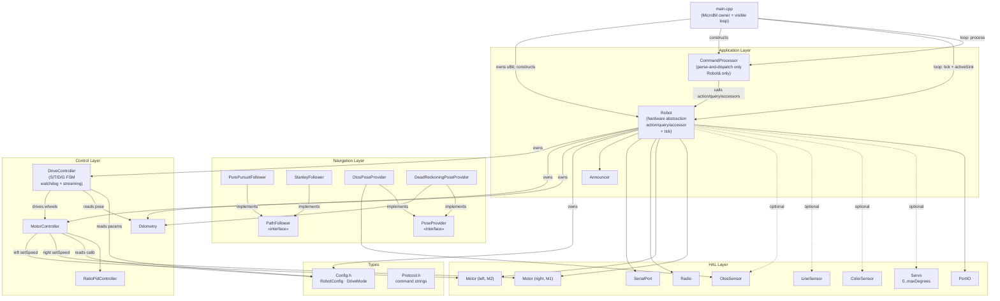

# radio-robot-c Architecture

## Layers

The firmware is organized into five layers. Each layer depends only on layers below it.
No heap allocation occurs in any layer during normal operation.

```
┌─────────────────────────────────────────────────────┐
│  Application Layer  (source/app/)                   │
│  Robot · CommandProcessor · Announcer               │
├─────────────────────────────────────────────────────┤
│  Navigation Layer   (source/nav/)                   │
│  PathFollower · PoseProvider · PurePursuit          │
│  Stanley · OtosPoseProvider · DeadReckoning         │
├─────────────────────────────────────────────────────┤
│  Control Layer      (source/control/)               │
│  DriveController · MotorController                  │
│  RatioPidController · Odometry                      │
├─────────────────────────────────────────────────────┤
│  HAL Layer          (source/hal/)                   │
│  Motor · OtosSensor · LineSensor · ColorSensor      │
│  Servo · PortIO · SerialPort · Radio                │
├─────────────────────────────────────────────────────┤
│  Types              (source/types/)                 │
│  Config.h · Protocol.h                              │
└─────────────────────────────────────────────────────┘
```

---

## Subsystem Descriptions

### Types (`source/types/`)

**`Config.h`** — Shared plain-old-data structs with no dependencies.
- `RobotConfig` — single unified config for all runtime-tunable parameters
  (`wheelTravelCalibL/R`, `kFF`, `kScaleLF/LB/RF/RB`, `ratioPid` gains, adj threshold/gain,
  `trackwidth`, `turnInPlaceGate`, `arriveTolerance`, timing/speed params).
  Owned by `Robot`; held as `const RobotConfig&` by subsystems.
  `defaultRobotConfig()` is the factory function.
- `MotorGains` — feed-forward and PI gains for MotorController
- `DriveMode` enum — IDLE | STREAMING | TIMED | DISTANCE | GO_TO

**`Protocol.h`** — Compile-time string constants for command prefixes and reply formats.
No logic; eliminates magic strings throughout CommandProcessor.

---

### HAL Layer (`source/hal/`)

Thin wrappers over CODAL hardware. Each class receives its hardware reference at construction
(dependency injection). No cross-HAL dependencies.

**`Motor`** — Single-channel Nezha V2 motor driver over I2C.
- Constructed with `(MicroBitI2C&, uint8_t motorId, int8_t fwdSign)`.
  motorId: 1=M1/right, 2=M2/left. fwdSign: +1 or -1 from `RobotConfig`.
- `setSpeed(pct)` — signed PWM (-100..100). Positive = logical forward; `fwdSign` applied internally.
- `readEncoder(cfg)` → mm — uses `cfg.wheelTravelCalibL` (M2) or `cfg.wheelTravelCalibR` (M1); `fwdSign` ensures forward = positive.
- `resetEncoder()` — software encoder zero for this motor's channel.
- `Robot` owns two `Motor` instances: `_motorL` (M2, fwdSign=+1) and `_motorR` (M1, fwdSign=−1).

**`OtosSensor`** — SparkFun OTOS optical odometry at I2C 0x17.
- Burst I2C read/write for position (REG 0x20) and velocity (REG 0x26)
- Signal processing config, IMU calibration, Kalman reset
- LSB conversions: 1 pos LSB ≈ 0.305 mm; 1 heading LSB ≈ 0.00549°

**`SerialPort`** — Line-buffered 115200-baud serial.
- `readLine(buf, len)` → bool — accumulates bytes; returns true on newline
- `send(msg)`, `sendf(fmt, ...)` — snprintf into stack-local buffer, no heap

**`Radio`** — micro:bit radio, group 10, channel 0, power 7.
- 4-slot ring buffer absorbs burst packets between 20 ms ticks
- `poll(buf, len)` → bool
- Relay mode: strips `>` prefix inbound, prepends `<` prefix outbound

**`LineSensor`** — 4-channel I2C grayscale sensor at 0x1A. Supports per-channel
calibration (`captureCalibMin()` / `captureCalibMax()`) and normalized output
(`readNormalized(out[4])`) returning 0–1000 per channel (0 = white, 1000 = black).
Optional EMA smoothing via `setSmoothingAlpha(float)`. Raw reads remain available
via `readValues()`.

**`ColorSensor`** — APDS9960-style 16-bit RGBC sensor at 0x39 or 0x43.

**`Servo`** — Servo output on P1. Constructor takes `maxDegrees` (default 180) for configurable range; supports both standard 180° and continuous-rotation 360° servos.

**`PortIO`** — J1–J4 digital and analog GPIO, port-to-pin mapping table.

---

### Control Layer (`source/control/`)

**`RatioPidController`** — Discrete PID with anti-windup integral clamp.
- Public `integral` field — read directly by MotorController for slower-wheel adjustment
- `update(error, dtS)` → float; `reset()`
- Used only by MotorController; not exposed above the control layer

**`MotorController`** — Cumulative-distance ratio PID drive loop.
- Holds `const RobotConfig&` — no null-guard paths; config is always present
- `startDriveClean(leftMms, rightMms)` — T/D/G arc commands; hard reset PID state
- `startDrive(leftMms, rightMms)` — S command keepalive; re-seeds encoder snapshot to prevent
  startup spike without discarding accumulated ratio history
- `tick(dt_s)` — reads encoders → cumulative deltas → normalized error → PID correction →
  per-direction FF scale → slower-wheel adjustment → co-clamp → setPwm()

**`DriveController`** — Owns and advances the S/T/D/G drive state machines, S-mode watchdog,
streaming encoder counter, and odometry delta tracking.
- Migrated from CommandProcessor in Sprint 007
- Holds per-drive reply-sink capture: async completions (T+DONE, D+DONE, G+DONE,
  SAFETY_STOP) route back to the channel that originated the command
- `beginStream()` / `beginTimed()` / `beginDistance()` / `beginGoTo()` — entry points from Robot
- `tick(now_ms, fn, ctx)` — advances all state machines; called from Robot::tick()
- `computeArc()` — private static pure geometry helper

**`Odometry`** — Dead-reckoning pose from encoder increments.
- `update(dL_mm, dR_mm, trackwidth_mm)` — differential-drive heading integration (float)
- `getPose(x_mm, y_mm, h_cdeg)` / `setPose(...)` / `zero()` — int32_t protocol output

---

### Navigation Layer (`source/nav/`)

**`PoseProvider`** *(pure virtual)* — Decouples pose source from navigation algorithms.
```
virtual void        update()  = 0;
virtual bool        getPose(Pose& out) = 0;
virtual const char* sourceName() const = 0;
```
`Pose` = `{int32_t x_mm, y_mm, h_cdeg; bool valid}`

- **`OtosPoseProvider`** — reads OTOS, converts LSB → mm/centidegrees, tracks staleness
- **`DeadReckoningPoseProvider`** — wraps Odometry; always valid; lowest-fidelity
- *(Future)* **`ExternalCameraPoseProvider`** — pose injected via SI command with staleness timeout

**`PathFollower`** *(pure virtual)* — Decouples path algorithm from command layer.
```
virtual void setPath(const Waypoint* wps, uint8_t count) = 0;
virtual bool compute(const Pose& pose, int16_t& leftMms, int16_t& rightMms) = 0;
virtual void reset() = 0;
virtual bool isFinished() const = 0;
virtual const char* name() const = 0;
```
`Waypoint` = `{int32_t x_mm, y_mm}`. Each concrete follower holds a static `Waypoint _path[32]`
copy — no heap, no lifetime dependency on caller's buffer.

- **`PurePursuitFollower`** — lookahead κ = 2×d_lateral/Lf²; tunable lookahead, trackwidth, base speed, stop dist
- **`StanleyFollower`** — δ = θ_e + atan2(k×e, v_soft+v); tunable k, omega_gain, goal tolerance

---

### Application Layer (`source/app/`)

**`Announcer`** — Emits `DEVICE:<type>:<name>:<hwName>:<serial>` on startup.
Intercepts `HELLO` before CommandProcessor and re-emits the announcement (relay rediscovery).
Constructor takes `MicroBit&`, `SerialPort&`, `Radio&`; receives these from `main.cpp` via `Robot`.

**`CommandProcessor`** — Pure wire-protocol parser and dispatcher.
- Single member `Robot& _robot`; no hardware pointers, no config copy, no drive state.
- `process(line, replyFn, ctx)` — tokenizes command lines and calls Robot public methods or
  component accessors. No `init()`, no `tick()`, no `setCalib()`/`setConfig()`.
- K*/O* setters write through `_robot.config()`, `_robot.motor()`, etc.
- Query commands call `_robot.getEncoders()`, `_robot.getPose()`, etc.
- Static helpers: `parseSignedArgs()`, `clampInt()`, `clampMinSpeed()`.

**`Robot`** — Hardware abstraction layer; owns all subsystem instances (no heap).
- `MicroBit` is NOT a member. `Robot` receives CODAL peripheral references at construction
  (`uBit.i2c`, `uBit.serial`, `uBit.radio`, `uBit.io`, `uBit.messageBus`, `uBit`).
- Owns `RobotConfig` (single source of truth for all tunable parameters).
- Public action methods: `stop()`, `streamDrive()`, `timedDrive()`, `distanceDrive()`, `goTo()`,
  `setGripperAngle()`, `zeroEncoders()`, `setPose()`, `zeroOdometry()`.
- Public query methods: `getEncoders()` → `EncoderReading`, `getPose()` → `Pose`.
- Component accessors: `config()`, `motor()`, `driveController()`, `odometry()`, `serialPort()`,
  `radioPort()`, `announcer()`, `otos()`, `lineSensor()`, `colorSensor()`, `gripper()`, `portIO()`.
- `tick(now_ms, fn, ctx)` — advances DriveController; no while loop inside.
- `Robot::run()` was removed in Sprint 007; the main loop is now visible in `main.cpp`.

---

### `main.cpp`

**Purpose**: Owns the `MicroBit` hardware singleton and the visible main loop.
- Declares `static MicroBit uBit;` as file-scope; calls `uBit.init()` before constructing Robot.
- Constructs `static Robot robot(...)` and `static CommandProcessor cmd(robot)`.
- Visible loop: drain serial with serial sink → drain radio with radio sink →
  `robot.tick(uBit.systemTime(), activeFn, activeCtx)` → `uBit.sleep(tick)`.
- Tracks `activeFn`/`activeCtx` — updated each time a command is dispatched so that
  `robot.tick()` sends async completions (T+DONE, D+DONE, etc.) back to the originating channel.

---

## Dependency and Ownership Diagram



---

## Key Design Constraints

| Constraint | Rationale |
|---|---|
| No heap allocation in hot path | CODAL nRF52833, 128 KB RAM; predictable timing |
| All instances static in `Robot` | Controlled init order; no static-init-order fiasco |
| Virtual dispatch only in nav layer | `MotorController::tick()` is hot; PathFollower::compute() is not |
| `ReplyFn` = `void(*)(const char*, void*)` | No `std::function`; no heap for closures |
| `MicroBit` in `main.cpp`, not `Robot` | Idiomatic CODAL pattern; makes hardware deps explicit |
| `RobotConfig` by const ref, never null | Owned by Robot; no null-cal guard paths anywhere |
| Per-drive sink capture in DriveController | Async completions route to originating channel |
| OTOS injected as nullable pointer | Robot works without OTOS; optional peripherals use null-check |
| PathFollower copies waypoints (MAX=32) | No lifetime dependency on caller buffer; 256 bytes/follower static cost |
| `uBit.sleep(tick)` not busy-wait | Yields fiber so CODAL radio event handler runs between ticks |
| Integrators survive S-command keepalive | `resetIntegrators()` on mode change only; no step response on re-send |

## Navigation Architecture & Pose Authority

(Established by the pose-authority decision, `docs/decisions/029-pose-authority.md`,
sprint 035 / issue a1.)

**Pose authority.** The **firmware EKF** (`source/control/Odometry.cpp` +
`EKF.cpp`, fusing OTOS and encoder odometry) is the single authoritative pose
source for short-horizon motion. The host does **not** run a parallel steering
loop — there is no host-side pose estimator or controller racing the firmware.
All closed-loop steering happens on the robot.

**Camera corrections.** The camera (aprilcam daemon) provides an absolute,
drift-free fix. The host reads the daemon pose and seeds the firmware EKF with
`OV`/`SI` commands (a discrete pose reset, not a continuous loop). `rogo sync pose`
is the manual trigger. Between corrections the firmware dead-reckons; corrections
are occasional re-baselines, not a steering feedback path.

**The firmware `G` (go-to) command** is the navigation primitive. It takes
**robot-relative** coordinates `(forward_mm, left_mm)` and transforms them to a
world target using the current pose (`MotionController::beginGoTo`); it
pre-rotates toward the bearing then pursues, stopping at the world target. Hosts
that hold a *world* target must convert to robot-relative first.

**Two host navigation entry points, both thin over the firmware:**

- **CLI point-to-point** (`rogo goto <x> <y>`, `rogo turnto <deg>`) →
  `host/robot_radio/nav/camera_goto.py` (`go_to_world_camera`,
  `spin_to_yaw_camera`). Uses real-time camera feedback for precise single-target
  convergence. This is the one intentional host-side feedback path (camera-closed,
  not a duplicate odometry/steering stack), kept because it leans on the camera
  as truth, not a host pose estimate.
- **Route planning / MCP** (`navigate_to`, `follow_path`) →
  `host/robot_radio/nav/navigator.py`. `navigate()` reads the camera world pose,
  converts the world target to robot-relative mm, and issues a single firmware
  `G` command, blocking on `EVT done G`. `follow_path()` sequences one `navigate()`
  per waypoint. The navigator is a **route planner**, not a steering loop.

**Deleted (sprint 035, a1b).** The host-side steering controllers
(`controllers/pure_pursuit.py`, `stanley.py`, `ltv.py`) and the dual-PID
`Navigator.navigate`/`follow_path`/`follow_pose_path`/`_run_controller`/
`ChaseController` steering loops were removed — they duplicated firmware
responsibilities and competed with the EKF for pose authority. The
`follow_pose_path` MCP tool was removed (no clean `G` equivalent).

**Out of scope (future).** The `NezhaKinematic.go_to_world` (G4) host path, and
automatic camera correction *during* a traversal (today corrections are between
moves).
