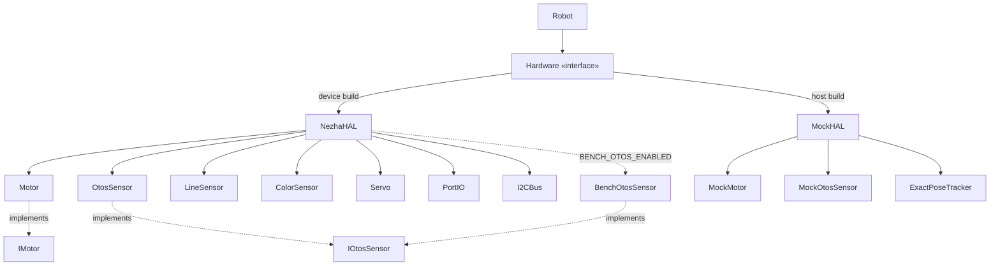
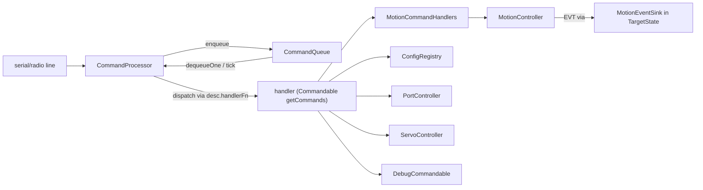

<!-- CLASI: Before changing code or making plans, review the SE process in CLAUDE.md -->

# Consolidated Architecture — radio-robot-c (through Sprint 034 / 035-a1)

This is the current consolidated CLASI architecture baseline. It supersedes
`architecture-update-001.md` through `architecture-update-034.md` (33 docs,
incorporated and archived to `done/`). It is the firmware/host architecture as
it actually exists in the source tree, cross-checked against the code — not a
changelog. For the human-facing prose companion see `docs/architecture.md`.

Naming/structure has churned heavily since the sprint-001 skeleton. The
authoritative facts: the firmware is an **interface-driven HAL** behind an
**abstract `Hardware` factory** (real `NezhaHAL`, host `MockHAL`); a **single
cooperative loop** (`LoopScheduler` → `loopTickOnce`) drives a **state-blob**
(`RobotStateContainer`); pose is fused by a **5-state EKF** owned by `Odometry`;
motion is a **command-queue + MotionCommand engine**; commands dispatch through a
**registration-based `CommandDescriptor` table**; and the **firmware EKF is the
authoritative pose source** with the host as a route-planner / camera-corrector.

---

## 1. Layered structure

Five layers under `source/`. Each layer depends only on layers below it. No heap
allocation in the hot path; all subsystem instances are static or value members.

```
┌────────────────────────────────────────────────────────────────────┐
│  Application Layer   (source/app/)                                  │
│  CommandProcessor · MotionCommandHandlers · DebugCommandable        │
│  CommandQueue · WedgeTest · Icons                                   │
├────────────────────────────────────────────────────────────────────┤
│  Robot / Composition (source/robot/)                                │
│  Robot (open struct) · ConfigRegistry · DefaultConfig (generated)   │
├────────────────────────────────────────────────────────────────────┤
│  Control Layer       (source/control/)                              │
│  LoopScheduler · LoopTickOnce · MotionController · MotionCommand     │
│  StopCondition · HaltController · BodyVelocityController             │
│  BodyKinematics · VelocityController · MotorController · Odometry    │
│  EKF · PortController · ServoController · MotionEventSink            │
│  RobotState (state structs)                                          │
├────────────────────────────────────────────────────────────────────┤
│  HAL Layer           (source/hal/, source/hal/mock/)                │
│  Hardware «iface» · NezhaHAL · MockHAL                               │
│  IMotor/Motor · IOtosSensor/OtosSensor · ILineSensor/LineSensor     │
│  IColorSensor/ColorSensor · IServo/Servo · IPortIO/PortIO           │
│  I2CBus · BenchOtosSensor · Communicator · SerialPort · Radio       │
├────────────────────────────────────────────────────────────────────┤
│  Types               (source/types/)                                │
│  Config.h (RobotConfig, DriveMode, TLM flags) · Protocol.h          │
│  CommandTypes.h (CommandDescriptor, Commandable, ParsedCommand)     │
└────────────────────────────────────────────────────────────────────┘
```

`source/main.cpp` sits above all layers: it owns the `MicroBit uBit` singleton
and the file-scope statics, and wires everything together (see §9).

> Note: some early update docs (030/031) speculatively referenced a flatter
> `source/config/`, `source/ekf/`, `source/odometry/`, `source/motor/` layout.
> That layout was never adopted — the code uses `control/` and `hal/` as above.

---

## 2. HAL layer — interface-driven, dual-implementation

The HAL is the project's central abstraction. Every device sits behind a
pure-virtual interface, and an abstract `Hardware` registry/factory owns the
concrete device objects.

**`Hardware`** (`hal/Hardware.h`) — abstract base. Accessors return interface
references: `motorL()/motorR()` → `IMotor&`, `otos()` → `IOtosSensor&`,
`lineSensor()`, `colorSensor()`, `portIO()`, `gripper()`. Plus:
- `begin()` — initialise all owned devices.
- `tick(now_ms)` — periodic device tick (no-op for self-contained devices).
- `tick(now_ms, const MotorCommands&)` — actuator-state tick; delivers commanded
  wheel velocities so a bench-mode sensor plant can integrate them. Default
  no-op; `NezhaHAL`/`MockHAL` override.
- `setOtosBench(bool)` / `isBenchMode()` — bench-OTOS swap (default no-op / false).

**Device interfaces** (`hal/I*.h`): `IMotor`, `IOtosSensor`, `ILineSensor`,
`IColorSensor`, `IServo`, `IPortIO`. Concrete devices inherit these.

**`NezhaHAL`** (`hal/NezhaHAL.{h,cpp}`) — the physical-robot HAL. Owns all seven
devices as value members plus the shared `I2CBus _bus`. `bus()` is exposed so
`main.cpp` wires it into `MotorController` for the enc-wedge diagnostic. CODAL-
dependent; never included from host translation units.

**`MockHAL`** (`hal/mock/`) — host-test HAL. Owns mock devices (`MockMotor`,
`MockOtosSensor`, …) with a slip + Gaussian-noise plant model and an
`ExactPoseTracker` noiseless oracle ("the camera") for ground-truth validation.

**Concrete devices** (`hal/`):
- `Motor` — single-channel Nezha V2 driver over I2C 0x10. One object per wheel
  (`_encOffset` per channel). Forward sign from `RobotConfig.fwdSignL/R`.
  Split-phase encoder reads (`requestEncoder()`/`collectEncoder()`) — no
  busy-wait. Chip-velocity (0x47) path exists but is **disabled** (throb fix,
  sprint 013); encoder-delta is the sole velocity source.
- `OtosSensor` — SparkFun OTOS optical odometry at I2C 0x17 (**mandatory** — the
  robot's purpose). `readTransformed(cfg, headingRad)` returns `OtosPose`
  applying LSB→mm/rad, flip, mounting rotation, and lever-arm offset.
  `readVelocityTransformed`/`readAccelTransformed`, `readStatus()`/`lastReadOk()`
  for validity gating.
- `LineSensor` (0x1A, 4-channel grayscale, calibration + EMA), `ColorSensor`
  (APDS9960 0x39/0x43), `Servo` (P1, configurable `maxDegrees`), `PortIO`
  (J1–J4 digital/analog).
- `I2CBus` (`hal/I2CBus.{h,cpp}`) — wraps `MicroBitI2C&` with per-device txn/error
  counters and an **IRQ-mask re-entrancy guard**. The IRQ guard is the fix for
  the nRF52 TWIM encoder-wedge silicon errata (masks IRQs for the full
  transaction). Bus runs at **100 kHz** (not CODAL's 400 kHz default) — also a
  wedge mitigation (see `main.cpp` and `WedgeTest`).
- `BenchOtosSensor` (`hal/BenchOtosSensor.{h,cpp}`) — `IOtosSensor` that
  synthesizes pose by integrating **commanded** wheel velocity into dual
  accumulators (noiseless ideal + errored). For stand testing without motion.
  Compiled only when `BENCH_OTOS_ENABLED` is set (see §10).

**Comms** (`hal/`): `Communicator` (owns serial + radio, `begin(channel)`),
`SerialPort` (line-buffered 115200, no-heap `sendf`), `Radio` /
`RadioChannel` (micro:bit radio; channel persisted in storage, boot-selectable
via A/B buttons; reassembly buffer 512 B).



---

## 3. State blob — single authoritative state

`control/RobotState.h` defines the state spine that replaced per-subsystem
private caches. `Robot` owns one `RobotStateContainer state` value member,
passed by reference through the loop.

- **`MotorCommands`** — actuator outputs: `tgtLMms/tgtRMms` (mm/s targets),
  `pwmL/pwmR`, digital/analog outputs + dirty flags.
- **`HardwareState`** (a.k.a. `inputs`) — all sensor readings with `ValueSet`
  freshness envelopes (`lagMs`, `lastUpdMs`, `valid`): encoder distances
  `encLMm/R`, wheel velocities, dead-reckon pose `poseX/Y/poseHrad`, **EKF fused
  `fusedV`/`fusedOmega`**, OTOS pose/accel, line, color, GPIO.
- **`TargetState`** — active `DriveMode`, world target, speed, deadline, the
  per-command reply sink (`replyFn`/`replyCtx`), `corrId[16]`, and a
  `MotionEventSink sink` for async EVT completions.
- `defaultInputs(cfg)` zero-inits the container and seeds each `ValueSet.lagMs`
  from the matching `RobotConfig` lag field.

---

## 4. Control layer

### 4.1 Cooperative loop

**`LoopScheduler`** (`control/LoopScheduler.{h,cpp}`) — owns the single
cooperative main loop, the `CommandQueue _queue`, and the per-tick mutable state
(`LoopTickState`: watchdog timestamp, last-run timestamps, active reply sink).
`run_blocks()` is the production loop; `run_test()` is a serial-only,
hardware-free test loop that skips `CMD_ACCESS_HARDWARE` commands. It exposes
`activeFn`/`activeTlmFn`/`activeCtx` (live reference members) so EVT/TLM route
back to the originating channel.

**`loopTickOnce`** (`control/LoopTickOnce.{h,cpp}`) — the **single shared loop
body**, called by both `run_blocks()` (device) and `sim_tick()` (sim), ending the
hardware/sim dispatch divergence. Each iteration, in order:
1. `cmd.dequeueOne(queue)` — dispatch one queued command.
2. System watchdog — `EVT safety_stop` + internal `X` after `sTimeoutMs` of host
   silence. **Signed-delta** time math (never plain-subtract two uint32 ms
   stamps). **TIME-stop exemption**: self-terminating commands carrying a TIME
   stop (T/D/G/TURN/RT, G PRE_ROTATE) skip the keepalive requirement; open-ended
   S/VW/R remain keepalive-bound.
3. `HaltController.evaluate()` — user-registered named stop conditions → inject
   `X` / `X soft`.
4. `motionController.driveAdvance()` — advance the active MotionCommand / G FSM.
5. `odometry.predict()` — dead-reckon + EKF predict.
6. `hal.tick(now, commands)` — actuator tick (feeds bench plant; near-no-op
   otherwise). **Must precede the OTOS block** so the plant advances before
   `otosCorrect` reads.
7. Timed sensor reads gated on `ValueSet` lag: `otosCorrect` (OTOS + EKF
   correct), `lineRead`, `colorRead`, `portsRead`.
8. `telemetryEmit()` — periodic TLM frame on the STREAM-bound channel.

Note: the encoder collect (`controlCollectSplitPhase` → `MotorController::
controlTick`) runs **before** `loopTickOnce` in both `run_blocks()` and
`sim_tick()`, preserving the collect→compute→request split-phase ordering.

### 4.2 Motion stack

**`MotionController`** (`control/MotionController.{h,cpp}`; renamed from the old
`DriveController` in sprint 019) — owns the drive state machines and the single
active `MotionCommand`. Entry points (all called from `Robot`, all with
cancel-if-active guards and SAFE-one-shot re-arm):
`beginStream` (S), `beginVelocity` (VW), `beginRawVelocity` (`_VW`),
`beginArc` (R), `beginTimed` (T), `beginDistance` (D), `beginGoTo` (G),
`beginTurn` (TURN, absolute heading), `beginRotation` (RT, relative encoder-arc
spin). `driveAdvance()` is the single task entry point; completions
(`EVT done <verb>`, `EVT safety_stop`) emit inline via `TargetState.sink`.
The **G command** runs a `GPhase {IDLE, PRE_ROTATE, PURSUE}` machine:
PRE_ROTATE is itself a supervised MotionCommand (HEADING+TIME stops); PURSUE
recomputes curvature each tick from the live fused pose and re-gates to
PRE_ROTATE after 3 backtrack ticks. (This supervision is the wild-spin fix.)

**`MotionCommand`** (`control/MotionCommand.{h,cpp}`) — the active-command object:
target twist + up to 4 `StopCondition`s + reply sink + lifecycle
(configure→start→tick→terminate), SOFT/HARD stop styles, `enum class Origin
{VW,TURN,G,T,D,R,RT}`. `hasTimeStop()` drives the watchdog exemption.

**`StopCondition`** (`control/StopCondition.{h,cpp}`) — POD tagged condition:
`Kind {NONE, TIME, DISTANCE, HEADING, POSITION, SENSOR, COLOR, LINE_ANY}`,
`evaluate()` against `HardwareState` + a `MotionBaseline`. The `sensor=` command
modifier appends a SENSOR condition.

**`HaltController`** (`control/HaltController.{h,cpp}`) — up to 8 named,
host-queryable stop conditions (`HALT *` verb family); baselined at `add()`.

**`BodyVelocityController`** (`control/BodyVelocityController.{h,cpp}`) — body
`(v, ω)` trapezoid/S-curve profiler. **The sole path to the motor**: produces
wheel setpoints via `BodyKinematics::inverse()` + `saturate()`. Ordering invariant
`profile → inverse → saturate → setTarget`; advanced exactly once per tick.

**`BodyKinematics`** (`control/BodyKinematics.{h,cpp}`) — stateless `(v,ω)↔(vL,vR)`
map + equal-scaling saturation with `steerHeadroom`. The single twist↔wheel
formula.

**`MotorController`** (`control/MotorController.{h,cpp}`) — per-wheel velocity
inner loop: two `VelocityController` (PI+FF, anti-windup, low-speed deadband)
instances tracking mm/s setpoints. `controlTick()` computes per-wheel ZOH
velocity from split-phase encoder reads using per-wheel timestamps and the
**measured** PID dt (not the nominal period). Also owns the **encoder-wedge
detector** (N-identical-reads-while-commanded → `EVT enc_wedged`, with arming
grace, raw-read disambiguation, and `wheelWedgedL/R()` exposed for odometry
defense). `RatioPidController` is **deleted** (its `pid.*` config keys are kept
in `ConfigRegistry` only for host compatibility).

**`VelocityController`** (`control/VelocityController.{h,cpp}`) — single-wheel PI+FF.

**`ServoController`** / **`PortController`** — `Commandable` subsystems for
GRIP and P/PA commands.

### 4.3 Estimation — Odometry + EKF

**`Odometry`** (`control/Odometry.{h,cpp}`) — differential-drive dead-reckoning
(midpoint/exact-arc integration; heading 0 = +X, CCW positive; output
centidegrees). Owns the **`EKF`** as a value member. `predict(s, trackwidth,
rotationalSlip, now_ms)`:
- midpoint-integrates encoder deltas, applies `effectiveSlip(rotationalSlip)`,
- drives `EKF::predict()` and writes the EKF state back as the authoritative
  pose, including `fusedV`/`fusedOmega`,
- **fuses encoder-derived velocity unconditionally** (sprint 033 un-gating, so
  `fusedV/Omega` are non-zero even when OTOS is invalid),
- suppresses phantom dTheta when a wheel is flagged wedged (`setWedgeActive` /
  `setEncOmegaHealthy`, driven from `MotorController::wheelWedgedL/R()`).

`correctEKF(s, x_otos, y_otos, theta_otos, v_otos, omega_otos)` — OTOS-gated;
call order `updatePosition → updateHeading → updateVelocity`. Encoder velocity is
NOT re-fused here (it is fused in `predict`) to avoid double-counting.
`setPose()` re-baselines the encoder snapshot (prevents post-camera-fix jumps).

**`EKF`** (`control/EKF.{h,cpp}`) — self-contained **5-state CTRV-ish filter**
`x = [x, y, θ, v, ω]`, `_P[5][5]`, fully-unrolled float math, no heap/STL/Eigen.
Position block is arc-segment; velocity block is random-walk, **block-decoupled**
from position. Update channels (each Mahalanobis-gated): `updatePosition`
(2-DOF, 5.99), `updateHeading` (1-DOF, 3.84, wrap-safe innovation),
`updateVelocity` (two 1-DOF scalar updates). `setPose()` sets a sane diagonal
P-prior (≈100 mm², (5°)²) rather than zeroing P. **Gate-recovery deviation:** a
permanently-rejecting channel is recovered by **P-inflation** (P→large, widening
S so the standard gate passes and K≈1), not the originally-designed R×10
(R×10 alone still rejects). Q is scaled by `dt_s` so behaviour is loop-rate
invariant.

---

## 5. Command system

**`CommandTypes.h`** (`types/`) — the registration-based dispatch foundation
(C++11, `-fno-exceptions -fno-rtti`, no heap): tagged `Argument`/`ArgList`,
`ParseResult`, `ParseFn`, `HandlerFn`, `ForceReply {NONE, SERIAL}`, command
`flags` (`CMD_NONE`, `CMD_ACCESS_HARDWARE`), **`CommandDescriptor`** (the table
entry), **`Commandable`** (interface for self-registering subsystems),
`makeCmd()` helper, and **`ParsedCommand`** (`corrId[16]`).

**`CommandProcessor`** (`app/CommandProcessor.{h,cpp}`) — protocol-v2 tokenizer +
dispatcher. Holds the `std::vector<CommandDescriptor>` table.
`process(line, fn, ctx)`: tokenize (only verb upcased), extract optional
`#<id>` correlation, parse `key=value`, then either enqueue into the attached
`CommandQueue` (normal path) or dispatch directly. `dequeueOne()` dispatches one
queued command per tick. Static reply formatters `replyOK`/`replyErr`/`replyEvt`.
The processor knows nothing of subsystems — it dispatches table entries.

**`CommandQueue`** (`app/CommandQueue.h`) — fixed ring buffer (cap 16) of
`ParsedCommand`. One command dispatched per loop tick; `ERR full`/`ERR busy` on
overflow/contention. Owned by `LoopScheduler`, wired to both `CommandProcessor`
and the converter handlers.

**`MotionCommandHandlers`** (`app/MotionCommandHandlers.{h,cpp}`) — all motion
verb handlers (S/T/D/G/R/TURN/RT/VW/_VW/X/STOP) and the `getMotionCommands()`
free function. S/T/D/G/R/TURN are **VW converters** (`push_front` a VW
`ParsedCommand`). Lives in `app/` so the protocol/reply formatting stays out of
`control/`.

**`MotionEventSink`** (`control/MotionEventSink.h`) — narrow `fn*` + `void*`
struct stored in `TargetState`. `MotionController` emits events through it; the
app layer formats the `EVT done`/`EVT safety_stop` strings. This is what keeps
`control/` free of any `CommandProcessor`/`CommandQueue`/`Protocol` include —
the layering inversion is gone (dependency direction: `app/` → `control/` →
data types).

**`ConfigRegistry`** (`robot/ConfigRegistry.{h,cpp}`) — owns the static
`{key,type,offset}` registry over `RobotConfig`; implements GET/SET with
end-pointer-checked parsing, per-field + cross-field validation, atomic apply,
`ERR badval <key>=<val> reason=<msg>` on failure.

**`DebugCommandable`** (`app/DebugCommandable.{h,cpp}`) — all DBG subcommands +
I2CW/I2CR, `ForceReply::SERIAL` (DBG replies on serial by design). Firmware-only
(excluded from host builds). Holds a `NezhaHAL*` directly for bench/I2C
diagnostics — the concrete-type knowledge is intentionally confined to this one
TU. `DBG OTOS` emits integer-scaled (mm/cdeg) fields (no float printf on CODAL).



---

## 6. Robot composition

**`Robot`** (`robot/Robot.{h,cpp}`) — an **open struct** (sprint 016 deleted the
old facade class; sprint 019/020 reinstated it as a struct with a `Hardware&`
constructor). All members public — each subsystem protects its own invariants.
Member declaration order is load-bearing (HAL ref → owned `config`/`state` →
device interface refs bound from `hal` → control-layer value members).

Owns: `RobotConfig config` (SET-mutable copy), `RobotStateContainer state`,
the device interface refs, and the control subsystems as value members
(`motorController`, `odometry`, `motionController`, `portController`,
`servoController`, `haltController`). Kept cross-cutting orchestration methods:
`controlCollectSplitPhase`, `otosCorrect`, `lineRead`/`colorRead`/`portsRead`,
`resetEncoders` (single atomic reset of hw accumulators + velocity baselines +
filter baseline + odometry snapshot), `distanceDrive`, `buildTlmFrame`,
`telemetryEmit`, and `buildCommandTable(dbg, sched)` which aggregates every
`Commandable`'s `getCommands()` plus the system commands.

**`DefaultConfig.cpp`** (`robot/`) — auto-generated from `tovez.json` by
`gen_default_config.py` every build. **Never hand-edit.** `defaultRobotConfig()`
returns it.

---

## 7. Telemetry & wire protocol

Protocol **v2** (sprint 009; v1 `K*`/sign-prefix/`Announcer`/`HELLO` is fully
gone). Response taxonomy: `OK <verb> <body> [#id]`, `ERR <code> <detail> [#id]`,
`EVT <name> <body>`, `TLM …`, `CFG …`, `ID …`.

**Telemetry** is one unified `TLM` frame (`Robot::buildTlmFrame`) shared by
`STREAM <ms>` and `SNAP`, gated by `tlmPeriodMs`. Field bitmask (`Config.h`
`TLM_FIELD_*`): `enc`, `pose`, `vel`, `line`, `color`, `twist` (fused v,ω),
`otos` (raw), `ekf_rej`. Every frame carries `seq=<n>` (uint16 wrapping) and a
sample-time `t=`. TLM binds to the STREAM-issuing channel
(`_tlmBoundFn/_tlmBoundCtx`), independent of which channel later commands arrive
on. EVT/command replies route via the per-command captured sink so async
completions return to the originating channel.

---

## 8. Navigation & pose authority

(Pose-authority decision: `docs/decisions/029-pose-authority.md`, sprint 029/035.)

**The firmware EKF is the single authoritative pose source for short-horizon
motion.** All closed-loop steering happens on the robot. The host runs **no
parallel pose estimator or steering loop** racing the firmware.

- **Firmware `G` (go-to)** is the navigation primitive. It takes
  **robot-relative** `(forward_mm, left_mm)`, transforms to a world target via
  the current pose (`MotionController::beginGoTo`), pre-rotates then pursues,
  stopping at the world target. Hosts holding a *world* target convert to
  robot-relative first.
- **Camera corrections** are discrete pose resets, not a steering loop: the host
  reads the aprilcam daemon pose and seeds the firmware EKF via `OV`/`SI`
  commands. `rogo sync pose` is the manual trigger. Between corrections the
  firmware dead-reckons.

**Host entry points (`host/robot_radio/nav/`), both thin over firmware:**
- **CLI point-to-point** (`rogo goto`, `rogo turnto`) → `nav/camera_goto.py`
  (`go_to_world_camera`, `spin_to_yaw_camera`, `crawl_drive_distance`). The one
  intentional host-side closed loop — and it closes on the **camera** as truth,
  not a host pose estimate.
- **Route planning / MCP** (`navigate_to`, `follow_path`) → `nav/navigator.py`.
  `Navigator` is a **route planner**: `navigate()` reads the camera world pose,
  converts the world target to robot-relative mm, issues one firmware `G`, and
  blocks on `EVT done G`; `follow_path()` sequences one `navigate()` per
  waypoint. It also offers camera-closed helpers (`approach`, `grab_at`,
  `adaptive_turn`) built on calibrated `speed_for_time` pulses.

**Deleted host steering** (sprint 029/035): `nav/controllers/{pure_pursuit,
stanley,ltv}.py` and the dual-PID `ChaseController`/`_run_controller`/
`follow_pose_path` steering loops — they duplicated firmware responsibilities and
competed with the EKF. (`controllers/base.py` and `controllers/pid.py` remain:
`pid.py` is still used for angle helpers; `base.py` is the now-unused abstract
`Controller`.) The `follow_pose_path` MCP tool was removed.

Other host packages (`host/robot_radio/`): `robot/` (the `Nezha` driver,
`NezhaProtocol` v2, `connection.py` shared `make_robot()`, `clock_sync.py`,
`nezha_kinematic.py`), `io/` (threaded-reader `SerialConnection`, `cli.py`,
`robot_mcp.py`, `sim_conn.py`), `calibration/` (consolidated linear/angular/push),
`config/` (pydantic per-robot `RobotConfig`, source of truth in
`data/robots/<name>.json`), `path/`, `sensors/`, `kinematics/`.

---

## 9. main.cpp wiring (boot sequence)

`main.cpp` owns `static MicroBit uBit` and constructs everything as file-scope
statics in dependency order:
1. `uBit.init()`, then `bootSelectRadioChannel()` (A/B-button channel edit).
2. `static RobotConfig cfg = defaultRobotConfig()`.
3. `uBit.i2c.setFrequency(100000)` (wedge mitigation), then
   `static NezhaHAL hardware(uBit.i2c, uBit.io, cfg)`.
4. `static Communicator comm(...)`; `comm.begin(rfChannel)`.
5. Settle delay (sensors power up), `hardware.begin()`, OTOS probe-retry loop.
6. `static Robot robot(hardware, cfg)`.
7. Two-phase command table: build `CommandProcessor` without DBG, construct
   `LoopScheduler sched` + `DbgCtx` + `DebugCommandable`, then rebuild the table
   with DBG. Wire `MotorController::setI2CBus`/`setEvtSink`. `sched.run_blocks()`.

The **sim** path (`sim_api.cpp`, host build) constructs `MockHAL` + the same
`Robot`/`CommandQueue` and calls `hal.tick(t, cmds)` then
`controlCollectSplitPhase` then `loopTickOnce` — identical body to the device.

---

## 10. Build variants

| Macro / flag | Build | Effect |
|---|---|---|
| (none) | Production firmware | Real `NezhaHAL`, no bench sensor. |
| `BENCH_OTOS_ENABLED` | Bench-debug firmware (CMake `PRODUCTION_BUILD=OFF`) | Compiles `BenchOtosSensor`, the `NezhaHAL` active-OTOS swap, and the `DBG OTOS [BENCH]` handlers. |
| `HOST_BUILD` | Host/sim tests | `MockHAL` + `sim_api.cpp`; excludes CODAL-dependent TUs (`DebugCommandable`, `NezhaHAL`). |

The bench plant is fed through `Hardware::tick(now, cmds)` from `loopTickOnce`
(sprint 034) — `Robot.cpp` no longer downcasts to `NezhaHAL` and includes no
`NezhaHAL.h` or build guards.

---

## 11. Key design constraints

| Constraint | Rationale |
|---|---|
| No heap in hot path; static/value instances | nRF52833, ~128 KB RAM; predictable timing, no static-init fiasco |
| Devices behind interfaces; `Hardware` factory | Real/mock swap → offline host testing of the whole control stack |
| Single shared `loopTickOnce` for device + sim | One dispatch path; sim and hardware cannot diverge |
| One `RobotStateContainer`, passed by ref | No per-subsystem caches; one source of truth per tick |
| `control/` includes no protocol headers | Layering: `app/` → `control/` → data types; events via `MotionEventSink` |
| Registration-based command table | No 1700-line switch; subsystems self-register via `Commandable` |
| BVC is the sole path to the motor | Single profiling/saturation point; all verbs converge on VW |
| Firmware EKF authoritative; host = planner/corrector | No host loop races the firmware for pose |
| Signed-delta on all uint32 ms math | Avoids watchdog/notch underflow bugs |
| `RobotConfig` by const ref, never null | Owned by `Robot`; no null-guard paths |
| I2C at 100 kHz + IRQ-guarded transactions | nRF52 TWIM errata / encoder-wedge defense |
| OTOS mandatory, never disabled | It is the robot's whole purpose |
| `DefaultConfig.cpp` generated from `tovez.json` | Never hand-edited; schema keyword maps JSON→C field + SET key |
| Encoder-velocity fused unconditionally | `fusedV/Omega` valid even on OTOS dropout (sprint 033) |
| TIME-stop commands exempt from keepalive watchdog | Self-bounded T/D/G/TURN/RT don't need host streaming |

---

## Appendix — superseded names (for readers of old docs)

| Old (update docs) | Current |
|---|---|
| `NezhaV2` / `GripperServo` | `Motor` (per-wheel) / `Servo` |
| `CalibParams` | `RobotConfig` |
| `Announcer` + `HELLO` intercept | `ID` command (protocol v2) |
| `DriveController` | `MotionController` |
| `struct AppContext` (sprint 016) | `struct Robot` (open struct) |
| `RatioPidController` (inner loop) | `VelocityController` ×2 (deleted; `pid.*` keys kept for compat) |
| complementary OTOS filter (`alphaPos`/`alphaYaw`/`otosGate`) | 5-state `EKF` (legacy `correct()` + keys retained, unused) |
| chip-velocity (0x47) primary | encoder-delta sole source (0x47 disabled) |
| `DriveMode::TIMED`, `lapsToMmScale`, `encReportEvery` | removed |
| host `controllers/{pure_pursuit,stanley,ltv}.py`, `ChaseController` | deleted; firmware `G` is the steering loop |
| `BENCH_BUILD` (named in update-034) | actual macro is **`BENCH_OTOS_ENABLED`** (CMake `PRODUCTION_BUILD=OFF`) |
