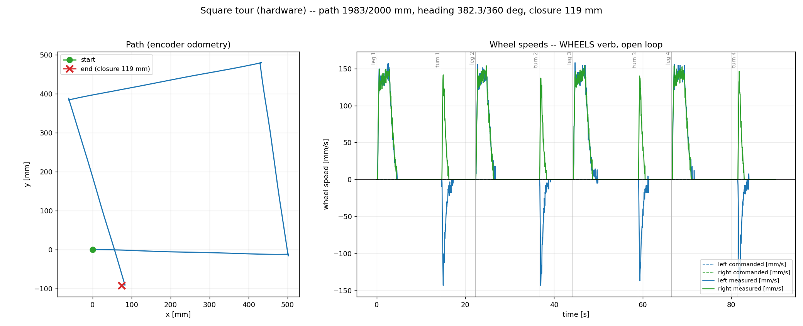
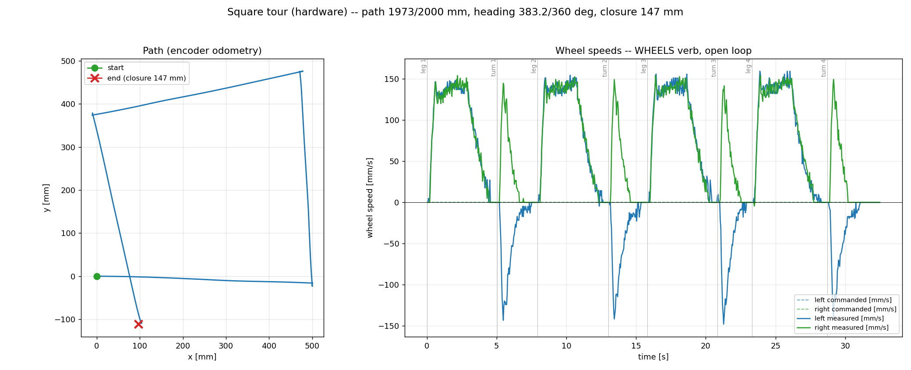
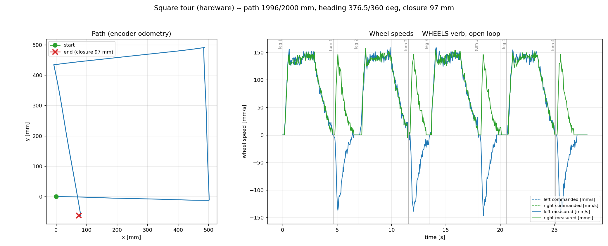
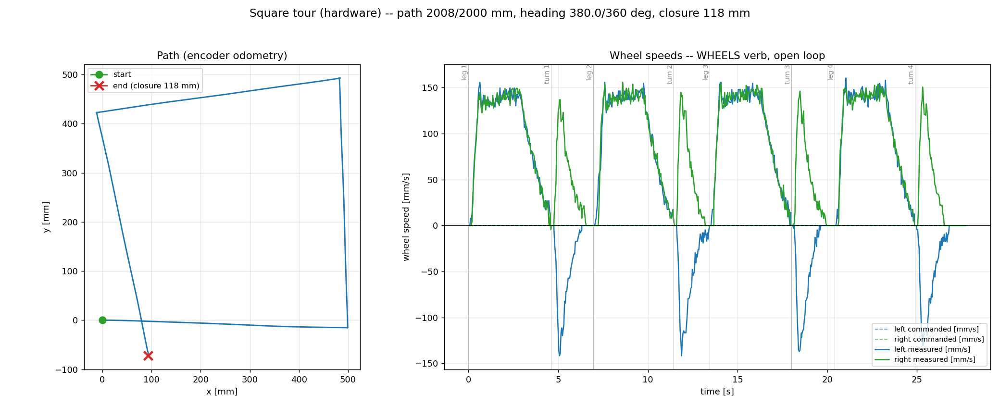

# Square tour: where the dead time went

**2026-07-30 · tovez on the stand, wheels free, direct USB
(`/dev/cu.usbmodem2121102`)**

A bench square tour was spending two thirds of its runtime motionless. This is
what it was, how it was found, and what it looks like now.

Read the **right panel** of each chart for dead time — flat stretches between
segments are the robot doing nothing. Left panel is the path from encoder
odometry; blue is the left wheel, green the right.

---

## 1. Baseline — ~85 s tour



| | |
|---|---|
| wall clock | ~85 s tour |
| path | 1983 / 2000 mm |
| heading | 382.3° / 360 |
| closure | 118.8 mm |

Eight segments, roughly 28 s of actual motion, ~57 s of nothing. Two separate
causes, stacked:

**The tour's completion check was unreachable code.** `Tour.advance()` recorded
its drained frames and returned `None`, but `Tour._awaitMove()` used the return
value as the frame list:

```python
frames = self.advance(0.1)   # always None
if frames:                    # always False
    ...break...               # unreachable
```

So every segment rode out its full safety timeout — 15 s for a leg, ~7 s for a
turn — regardless of having finished seconds earlier. `_awaitMove` hit its
deadline on all eight segments of every run and **printed nothing**, which is
why it survived so long.

**And the firmware wasn't reporting completion promptly either** — see §3.

## 2. Host fixes — 52.9 s



| | |
|---|---|
| wall clock | 52.9 s |
| path | 1973 / 2000 mm |
| heading | 383.2° / 360 |
| closure | 147.4 mm |

Three host-side changes: the unreachable branch fixed; `SEGMENT_REST` split into
`INTER_SEGMENT_DWELL` (0.1 s, no camera) and `CAMERA_FIX_DWELL` (0.9 s,
preserved because a playfield camera fix must be taken at rest); and segments
chained through the planner's queue instead of one round-trip per segment.

A loud timeout message was added at the same time, distinguishing the two
failure modes — `active` never rose (command lost, move never started) versus
rose but never fell (move started, never finished).

Per-boundary dead time was still ~0.4 s, and no amount of host work would move
it: that part lives in firmware.

## 3. Arrival fix — 50.9 s, and better on every accuracy axis



| | |
|---|---|
| wall clock | 50.9 s |
| path | **1996.5 / 2000 mm** (0.18% error) |
| heading | 376.5° / 360 |
| closure | 97.1 mm |

**Root cause: every Distance/Angle Move was completing by *stalling out*, not by
arriving.**

`kDoneEpsilon{Linear,Angular}` are float noise floors — 1e-3 mm, 1e-5 rad — not
tolerances a real wheel can reach. The profile's terminal step falls under the
motor write-suppression deadband (`output_deadband: 0.03`), so the wheel parks a
fraction of a millimetre short. Once the wheels are stopped, the in-flight ZOH
prediction that would carry the residual negative is *also* zero — so the
residual is **pinned**, and the Move sits until `kStallWindow` (0.5 s) expires.

Proven in the planner harness — residual pinned for exactly 11 consecutive
ticks, 11 × 47 ms = 0.517 s = `kStallWindow`:

```
  4.653      4.37      0.00    0.8764     0.6708       0       1
  4.700      4.37      0.00    0.8764     0.6708       1       1
   ...        (identical for 11 consecutive ticks)     ...
  5.123      4.37      0.00    0.8764     0.6708      10       1
  5.170      0.00      0.00    0.8764     0.6708      11       0
  -> COMPLETED by STALL | wheels stopped t=4.230 | landed 0.858 mm short
```

The fix (`src/motion/planner/planner.cpp`, commit `7a5da18b`) adds one
completion condition: a Distance/Angle Twist Move inside the robot's own
configured arrival tolerance (`settleEpsilonLinear` 4 mm /
`settleEpsilonAngular` 0.035 rad) **and at rest** is finished. `settleReached()`
was already computed on that path and already reported as `TickResult::settled`
— it simply never *ended* a Move.

It cannot fire early (requires at rest, so unreachable at cruise), is suppressed
for a Move handing off at speed (`activeBoundary_ > 0`), and is gated on
`hasMoved`. A wheel that wedges short of tolerance still falls through to the
stall backstop, so that safety net is unchanged.

| | before | after |
|---|---|---|
| sequential tour | 33.07 s | 28.59 s |
| chained (depth 5) | 29.96 s | **24.93 s** |
| dead time per boundary | 0.397 s | **0.079 s** |

`planner_square_tour.py`: pre-fix median 30.1 s (n=9, 29.4–31.1), post-fix
24.2 s (n=6, 24.2–24.5) — disjoint ranges.

Accuracy improved as well, which was not the goal and is not yet explained. A
plausible reading is that Moves previously ended via the stall backstop at
whatever residual happened to be pinned, and now end on a defined arrival
condition, so the terminal state is consistent rather than incidental. **One run
does not distinguish that from the ~28 mm run-to-run spread**, so treat it as a
hypothesis.

## 4. Arrival fix, repeat run



| | |
|---|---|
| path | 2008 / 2000 mm (0.40% error) |
| heading | 380.0° / 360 |
| closure | 118 mm |

A second capture at the same configuration as §3 (arrival fix), run
back-to-back on the same stand setup. Wall clock is not printed in this
chart's title, so it is not reported here.

This is the second sample §3 flagged as missing when weighing whether the
accuracy improvement in §3 is real or just where that run's residual happened
to land within the ~28 mm run-to-run spread. Path length lands close to §3's
run (2008 mm vs 1996.5 mm, both near the 2000 mm target), but closure (118 mm)
and heading (380.0° vs 376.5°) both land closer to the §1 baseline than to §3.
Two samples still is not enough to separate "accuracy improved" from "this
run's residual landed favorably" — the hypothesis in §3 stays open.

---

## Why closure and heading fail on the stand

Every run above FAILs its closure (60 mm) and heading (±15°) bounds, and that is
expected here rather than a defect.

`rotational_slip = 0.9117` (effective track 140.4 mm vs physical 128) and the
affine turn calibration (`rotation_gain 1.061`, `rotation_offset_deg -5.54`) are
both annotated in `data/robots/tovez.json` as *camera-measured on the playfield,
robot untethered*. They compensate for skid-steer scrub — a turning robot drags
its wheels sideways and under-rotates. On a stand there is no traction, no
scrub, and the compensation becomes pure over-rotation: ~+5.6° per turn, ~+22°
over four.

**So the bench tier cannot assert closure or heading.** What it *can* assert:
path length, command/ack integrity, wheel symmetry, turn structure, and dead
time. That answers open question #2 in
[`square-tour-is-the-one-system-test-sim-bench-playfield.md`](../../clasi/issues/square-tour-is-the-one-system-test-sim-bench-playfield.md).

## Established along the way, and still open

- **The firmware queue does chain today.** At depth 5, `active` fell exactly
  once across an 8-move tour (vs 8 times sequential) — no host round-trip
  between segments.
- **Chaining does not hurt accuracy.** Measured against a bare `Motion::Planner`
  with the real `DutyPlant`: depth 2/3/5 gives −0.01 mm / −0.01°, versus
  +2.21 mm / +1.98° at depth 1. The `carryPath_`/`carryHeading_` ledger cancels
  per-move residuals exactly as designed.
- **STILL OPEN:** a 322° / 246 mm geometry regression seen once through
  `square_tour.py --sim` at chain depth 2 was **not** reproduced against the
  planner and is not the carry ledger. It lives above the planner — host
  bookkeeping, the 16-slot move-id dedup ring, or `SimLoop`. Unexplained.
- **NOT FIXED:** the robot still stops at every corner. `shapesCompatible()`
  permits an at-speed hand-off only between Moves with an identical wheel ratio,
  and straight→pivot reverses a wheel. Making a square *flow* needs blended arc
  corners — the host emitting corner arcs instead of pivot-in-place, plus
  changes to `shapesCompatible`/`boundaryLambda`. Its own ticket.

## Reproducing

```bash
uv run python src/tests/bench/square_tour.py \
    --port /dev/cu.usbmodem2121102 --no-geofence \
    --chart src/tests/bench/square_tour_bench.png
```

`--no-geofence` is required on the stand: the geofence fails closed when it
cannot see tag 100, and it cannot see a robot that is not on the playfield.
