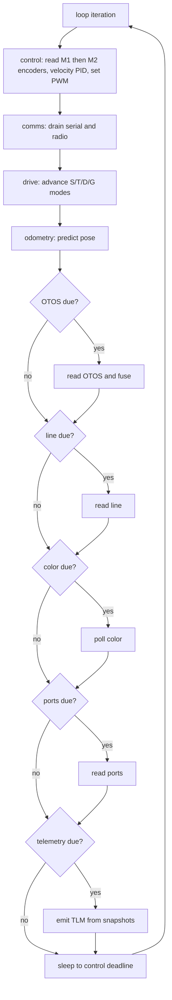
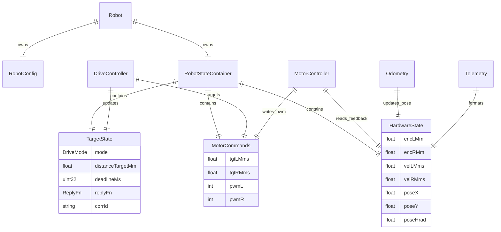
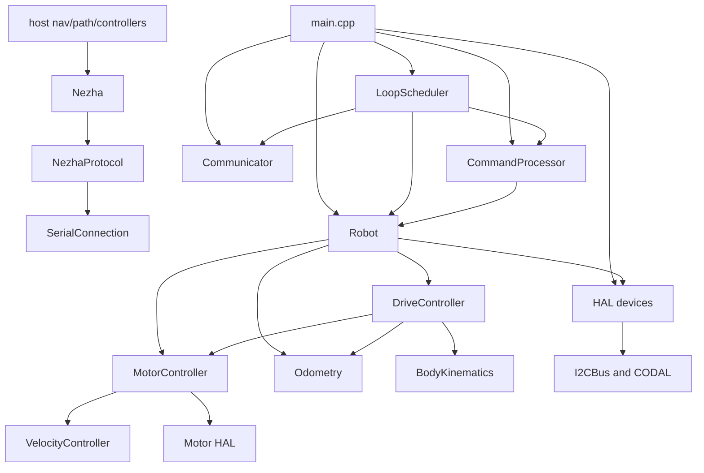
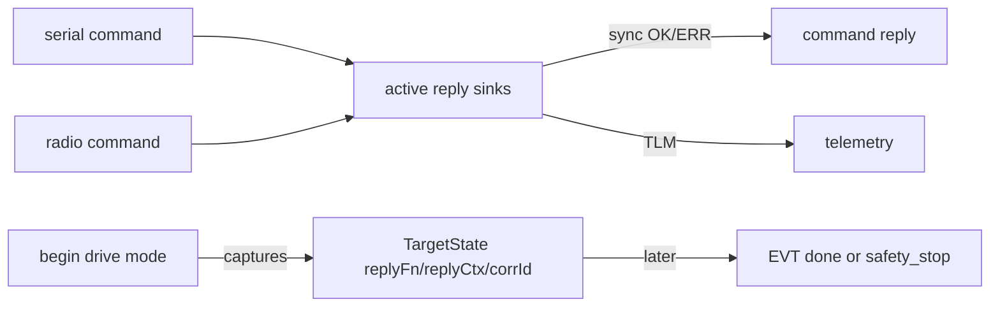

# Code Review Architecture

This document describes the current host and firmware architecture for review.
It focuses on the live command path, the firmware control loop, and two review
scenarios: distance driving and streaming driving.

The current firmware entry point is `source/main.cpp`. It constructs static
hardware wrappers, initializes communication and sensors, wires `Robot`,
`CommandProcessor`, and `LoopScheduler`, then starts `LoopScheduler::run_blocks()`.
The scheduler also contains `run_tasks()` and `run_all()`, but those are not the
active runtime path in the current `main.cpp`.

## Architecture Overview

The system is split by the protocol-v2 text line:

- The Python host package under `host/robot_radio/` owns serial connection
  management, protocol formatting/parsing, high-level robot APIs, calibration,
  path, navigation, and controller helpers.
- The CODAL firmware under `source/` owns protocol dispatch, robot state,
  cooperative scheduling, drive state machines, motor control, odometry,
  telemetry assembly, and hardware access.

```mermaid
flowchart LR
    subgraph Host["Host Python"]
        App["scripts, calibration, nav"]
        Nezha["Nezha driver"]
        Proto["NezhaProtocol"]
        Conn["SerialConnection"]
    end

    subgraph Transport["USB serial or relay"]
        Direct["direct serial"]
        Relay["RadioRelay RAW250"]
    end

    subgraph Firmware["Firmware"]
        Comm["Communicator"]
        Cmd["CommandProcessor"]
        Sched["LoopScheduler run_blocks"]
        Robot["Robot facade"]
        Drive["DriveController"]
        MotorCtl["MotorController"]
        State["RobotStateContainer"]
        HAL["HAL devices"]
    end

    App -->|"calls"| Nezha
    Nezha -->|"delegates"| Proto
    Proto -->|"formats/parses v2"| Conn
    Conn -->|"direct mode"| Direct
    Conn -->|"relay mode >cmd"| Relay
    Direct -->|"line"| Comm
    Relay -->|"reassembled line"| Comm
    Comm -->|"polled by"| Sched
    Sched -->|"dispatches"| Cmd
    Cmd -->|"calls public API"| Robot
    Sched -->|"runs task blocks"| Robot
    Robot -->|"owns"| State
    Robot -->|"starts/advances"| Drive
    Robot -->|"control tick"| MotorCtl
    Drive -->|"sets targets"| MotorCtl
    MotorCtl -->|"PWM and encoders"| HAL
    Robot -->|"sensor snapshots"| HAL
```



## Technology Stack

- Firmware: C++14 on CODAL for micro:bit V2 / nRF52833.
- Hardware: micro:bit V2, Nezha V2 motor board, optional OTOS, line, color,
  servo, and J-port I/O devices.
- Build: CODAL/CMake through `uv run python3 build.py`.
- Host: Python package with pyserial and protocol-v2 parsers.
- Wire format: newline-terminated ASCII commands and tagged responses: `OK`,
  `ERR`, `EVT`, `TLM`, `CFG`, and `ID`.

## Module Design

### Host Modules

`SerialConnection` owns pyserial. It prefixes commands with `>` in relay mode,
polls readiness with `PING`, sends commands, and reads response lines.

`NezhaProtocol` is the host wire adapter. It formats protocol-v2 commands,
parses response and telemetry lines, exposes low-level command methods, blocks
for `EVT done` through `wait_for_evt_done()`, and implements the streaming-drive
generator.

`Nezha` is the high-level robot driver. It performs liveness checks, clamps
motion speeds, provides blocking and streaming motion helpers, and updates cached
encoder/sensor state from `TLM` frames.

Host navigation, path, controller, calibration, and sensor helpers depend on the
robot/protocol layer. They should not touch pyserial directly.

### Firmware Modules

`main.cpp` is the firmware composition root. It owns CODAL initialization,
radio-channel selection, static device construction, sensor `begin()` calls, and
the final `sched.run_blocks()` call.

`Communicator`, `SerialPort`, and `Radio` isolate transport details. `SerialPort`
has a drop-tolerant async send path for telemetry and a bounded reliable path for
command replies/events. `Radio` reassembles and fragments RAW250 frames.

`CommandProcessor` is a protocol parser and dispatcher. It tokenizes lines,
extracts optional correlation IDs, validates arguments, handles `GET`/`SET`, and
calls `Robot`. It should not own hardware, loop timing, or drive state.

`Robot` is the firmware facade below `main.cpp`. It owns `RobotConfig`,
`RobotStateContainer`, `MotorController`, `Odometry`, and `DriveController`. It
also exposes task entry points used by the scheduler and formats telemetry from
state snapshots.

`DriveController` owns drive modes: `IDLE`, `STREAMING`, `TIMED`, `DISTANCE`,
and `GO_TO`. It captures the originating reply sink for asynchronous drive
events and advances watchdog/completion logic in `driveAdvance()`.

`MotorController` owns per-wheel velocity control, velocity estimation, cross-
wheel synchronization, PWM output, stuck-encoder detection, and encoder resets.

HAL classes wrap CODAL and hardware-specific details: `Motor`, `I2CBus`,
`OtosSensor`, `LineSensor`, `ColorSensor`, `Servo`, and `PortIO`.

## Runtime Loop

`run_blocks()` makes loop order explicit. The control block runs first as the
metronome; communications and drive advancement run after that; slower sensors
and telemetry are gated by configured periods.



## Data Model

Firmware runtime data is centralized in `RobotStateContainer`.



## Dependency Graph



The desired direction is host behavior -> host protocol -> transport -> firmware
command parser -> robot facade -> control/HAL. Reviewers should be skeptical of
changes that move hardware ownership or scheduler policy into `CommandProcessor`.

## Scenario: Distance Driving

Distance driving uses the bounded `D <l> <r> <mm>` command. The host sends a hop,
the firmware owns completion, and the host waits for `EVT done D`.

```mermaid
sequenceDiagram
    participant Caller as Host caller
    participant Nezha as Nezha
    participant Proto as NezhaProtocol
    participant Conn as SerialConnection
    participant Cmd as CommandProcessor
    participant Robot as Robot
    participant Drive as DriveController
    participant Loop as run_blocks loop
    participant MotorCtl as MotorController
    participant Motor as Motor HAL

    Caller->>Nezha: speed_for_distance(l, r, mm)
    Nezha->>Nezha: clamp speeds and split into hops
    Nezha->>Proto: distance(l, r, hop_mm)
    Proto->>Conn: send "D l r hop_mm"
    Conn->>Cmd: protocol line
    Cmd->>Robot: distanceDrive(l, r, hop_mm, replyFn, ctx, corrId)
    Robot->>Drive: beginDistance(...)
    Drive->>MotorCtl: startDriveClean and setTarget
    Drive->>MotorCtl: resetEncoderAccumulators
    Cmd-->>Proto: OK drive l=... r=... mm=...
    Proto->>Proto: wait_for_evt_done("D")

    loop firmware ticks
        Loop->>Robot: controlCollectSplitPhase(now)
        Robot->>Motor: read M1 then M2 encoders
        Robot->>MotorCtl: controlTick(inputs, commands, now, refreshed=3)
        MotorCtl->>Motor: setSpeed(pwmL), setSpeed(pwmR)
        Loop->>Robot: driveAdvance(now)
        Robot->>Drive: driveAdvance(inputs, commands, target, now)
        Drive->>MotorCtl: getEncoderPositions()
    end

    Drive-->>Conn: EVT done D
    Conn-->>Proto: parsed EVT done D
    Proto-->>Nezha: outcome done
    Nezha-->>Caller: cached encoder tuple
```

Distance-drive details for review:

- `Nezha.speed_for_distance()` clamps non-zero speeds, splits long requests into
  hops with `hop_mm_max = max(40, int(cruise_mms * 1.5))`, sends one `D` per hop,
  and waits for completion.
- `CommandProcessor` validates wheel speeds and distance before calling `Robot`.
- `DriveController::beginDistance()` saturates wheel speeds, starts a clean
  motor drive, resets encoder accumulators, snapshots start positions, computes a
  distance-based timeout, captures the reply sink, and enters `DISTANCE` mode.
- `Robot::distanceDrive()` also clears filtered encoder baselines in
  `HardwareState`, preventing the post-reset encoder jump from being rejected as
  an outlier.
- `DriveController::driveAdvance()` uses fresh encoder reads through
  `MotorController::getEncoderPositions()` for completion, rather than relying on
  the filtered control-loop cache.
- A `D` move is not watchdoged by host keepalives. Once accepted, firmware target
  or timeout logic stops it.

## Scenario: Streaming Driving

Streaming driving uses repeated `S <l> <r>` commands. The host owns ongoing
velocity updates; the firmware watchdog stops the robot if updates stop.

```mermaid
sequenceDiagram
    participant Caller as Host caller
    participant Nezha as Nezha
    participant Proto as NezhaProtocol
    participant Conn as SerialConnection
    participant Cmd as CommandProcessor
    participant Robot as Robot
    participant Drive as DriveController
    participant Loop as run_blocks loop
    participant MotorCtl as MotorController

    Caller->>Nezha: stream_drive(speeds)
    Nezha->>Proto: stream_drive(speeds, period_ms, watchdog_ms)
    Proto->>Conn: send "STREAM period_ms"
    Conn-->>Proto: OK stream period=...
    Proto->>Conn: send_fast "S l r"
    Conn->>Cmd: protocol line
    Cmd->>Robot: streamDrive(l, r, replyFn, ctx)
    Robot->>Drive: beginStream(l, r, now, target, replyFn, ctx)
    Drive->>MotorCtl: startDrive and setTarget
    Cmd-->>Conn: OK drive l=... r=...

    loop while generator is consumed
        Loop->>Robot: controlCollectSplitPhase(now)
        Robot->>MotorCtl: controlTick(inputs, commands, now, refreshed=3)
        Loop->>Robot: driveAdvance(now)
        Robot->>Drive: check streaming watchdog
        Loop->>Robot: telemetryEmit(now, activeTlmFn, activeCtx)
        Robot-->>Conn: TLM t=... mode=S enc=... vel=...
        Conn-->>Proto: raw response lines
        Proto-->>Nezha: ParsedResponse
        Nezha-->>Caller: yield response
        Proto->>Conn: resend S when keepalive due
    end

    alt caller closes generator
        Proto->>Conn: send_fast "STOP"
        Proto->>Conn: send "STREAM 0"
    else keepalive missed
        Drive-->>Conn: EVT safety_stop
    end
```

Streaming-drive details for review:

- `NezhaProtocol.stream_drive()` enables telemetry, sends an initial `S`, reads
  response bursts, yields parsed responses, and resends `S` when 30 percent of
  `watchdog_ms` has elapsed.
- With default `watchdog_ms=500`, the resend interval is about 150 ms. `Nezha.speed()`
  passes `watchdog_ms=200`, so its resend interval is about 60 ms.
- `DriveController::beginStream()` refreshes `_lastSMs`, applies saturation,
  starts/reseeds motor control, sets wheel targets, and enters `STREAMING` mode.
- Each accepted `S` updates targets and refreshes the watchdog. If elapsed time
  exceeds `RobotConfig::sTimeoutMs`, `driveAdvance()` stops the motors and emits
  `EVT safety_stop`.
- Plain `S` clears `TargetState.corrId`; `VW` uses the same streaming mode but
  can preserve a correlation ID for `EVT safety_stop`.
- On generator close, the host attempts `STOP` followed by `STREAM 0`.

## Reply and Telemetry Routing

`LoopScheduler` updates `activeFn`, `activeTlmFn`, and `activeCtx` when a command
arrives. Command replies use the command's transport. Telemetry uses the current
telemetry sink. Drive completions are different: drive start methods copy the
originating reply sink into `TargetState`, so later `EVT done T/D/G` or
`EVT safety_stop` returns to the channel that started the motion.



## Security and Safety Considerations

- There is no authentication on USB serial or radio. Physical/transport access
  is command authority.
- `CommandProcessor` range checks are the main input safety boundary.
- Streaming motion is watchdoged; bounded `T`, `D`, and `G` modes use firmware
  completion and timeout logic.
- Telemetry is intentionally drop-tolerant so it does not stall the control loop.
- I2C timing is safety-critical. The active motor path uses 100 kHz I2C,
  right-first encoder reads, settle delays, outlier rejection, write-on-change,
  and motor-write rate limiting to reduce Nezha encoder wedges.

## Design Rationale

- Single cooperative loop: makes I2C ordering and blocking behavior reviewable.
- Parser/facade split: keeps protocol validation in `CommandProcessor` and robot
  behavior in `Robot` plus control modules.
- Snapshot telemetry: avoids sensor I/O during telemetry formatting.
- Separate bounded and streaming primitives: `D` completes locally in firmware;
  `S` fails safe when host updates stop.

## Review Focus Areas

- Confirm `main.cpp` still calls the intended scheduler loop.
- Trace command changes from `CommandProcessor` into `Robot`, then into
  `DriveController` or `MotorController`.
- Check async event routing through `TargetState` when serial and radio commands
  interleave.
- Review the timing cost of fresh encoder reads in distance completion.
- Watch for stale references to a firmware `source/nav/` layer. The live firmware
  tree has host-side navigation modules plus firmware `BodyKinematics`,
  `DriveController`, and `Odometry`, but no `source/nav/` directory.
- Reconcile host README wording around streaming keepalive timing if docs are in
  scope: current code resends `S` at 30 percent of `watchdog_ms`, not directly at
  the telemetry period.

## Open Questions

- Should `run_blocks()` remain the production loop permanently, or should
  `run_tasks()` become active again after timing work settles?
- Should `Nezha.speed_for_distance()` explicitly refresh final encoder state
  after each hop instead of returning the cached telemetry tuple?
- Should plain `S` support correlation IDs like `VW`, or are bare streaming
  safety events preferred?
- Should `docs/architecture.md` be refreshed to match this live-code review doc?