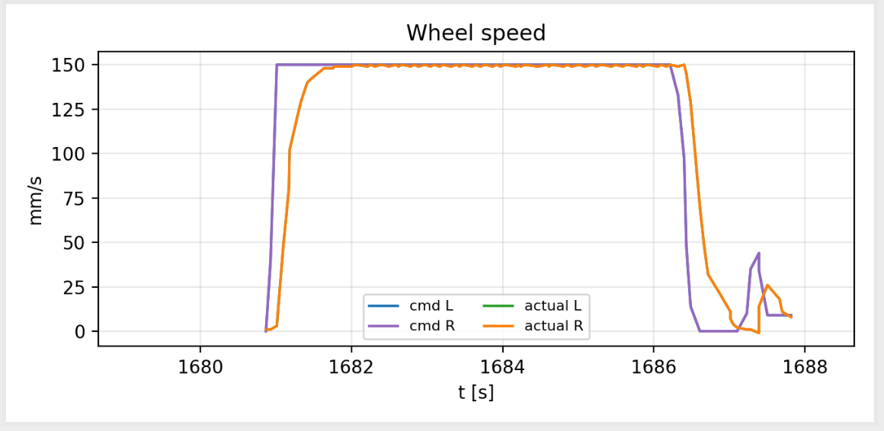
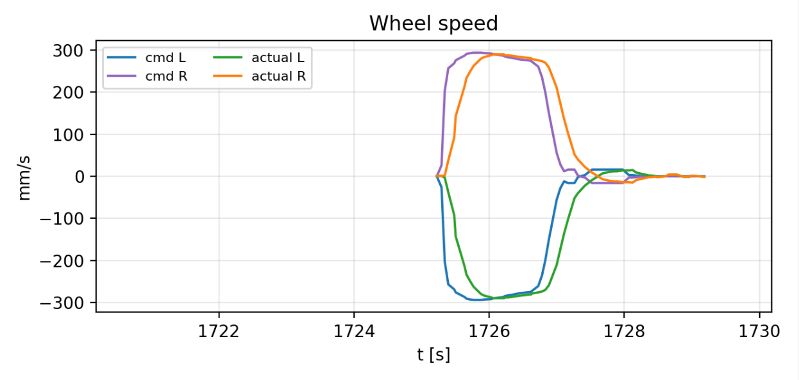

# Motion Control Architecture Review

**Project:** `radio-robot-elite`  
**Repository state:** `pid-debugging` branch; read-only review  
**Review date:** 2026-07-18  
**Scope:** 700 mm straight motion, 360° pivot, trajectory generation, wheel control, simulator behavior, and configuration surface  
**Disposition:** Architecture correction recommended before further tuning

> **Primary conclusion:** The endpoint pulses are software-generated behavior, not unavoidable simulator noise. The one-dimensional Ruckig solve is broadly appropriate; scheduling, time-shifted sampling, empirical target padding, terminal replanning, heading corrections, and output shaping alter the motion after the trajectory has been solved.

## Executive summary

- Fix the control-cycle order before tuning anything else. A new Pilot reference currently waits about two 50 ms simulation cycles before the wheel PID consumes it.
- Stop sampling ahead in trajectory time. The lead-ramp transformation invalidates the end-to-end acceleration and jerk guarantees.
- Remove straight target padding, terminal top-up trajectories, pivot lead slopes, and minimum-speed heading nudges from ideal motion execution.
- Separate an ideal trajectory simulator from a hardware-parity simulator. The current simulator intentionally includes 130 ms wheel lag, duty quantization, deadband, slew limiting, write throttling, and reversal dwell.
- Pass Ruckig acceleration into the wheel controller and use model-based feedforward. Velocity-only feedforward must lag during acceleration and braking.
- Remove the 18 `PlannerConfig` fields that have no live firmware consumer, and do not promote the turn-windage lookup table into production.

This report is based on a read-only inspection of the current source tree, the two supplied wheel-velocity plots, and the checked-in turn-windage sweep results. No repository files were modified.

## 1. Evidence from the supplied traces

The commanded traces themselves contain the terminal behavior under dispute. These are not merely noisy measurements reacting to a clean reference.

### 1.1 Straight-line trace



*Figure 1. Supplied straight-motion wheel-speed trace. The command returns to zero and then issues a distinct positive top-up lobe.*

- The second lobe is present in the command, so it is generated by the controller rather than by measurement noise.
- At a 150 mm/s ceiling, the straight-target formula adds `1.5 + 0.102 × 150 = 16.8 mm` to the planned target.
- If measured position still stops short, the executor launches another jerk trajectory and aims one settle epsilon—3 mm—past the remaining distance.

**Source:** `src/firm/motion/executor.cpp:639-645, 666-685, 937-970`

### 1.2 360° pivot trace



*Figure 2. Supplied 360° pivot wheel-speed trace. Both commanded and measured wheel velocities show a sign-changing terminal correction.*

- The main pivot ends with residual angular motion, after which heading feedback adds a separate correction phase.
- When planned angular velocity is near zero and heading remains outside tolerance, Pilot enforces a 16 mm/s minimum wheel-speed equivalent.
- The resulting coast, tolerance crossing, and possible reversal explain the visible sign-changing tail.

**Source:** `src/firm/app/pilot.cpp:25-65`; `src/firm/motion/executor.cpp:973-1165`

## 2. Review findings

| ID | Severity | Finding | Primary effect |
|---|---|---|---|
| F1 | High | Control stages execute in the wrong order | Two-cycle command latency and compensating lead parameters |
| F2 | High | Lead sampling time-warps the Ruckig output | End-to-end command is not jerk-limited |
| F3 | High | Endpoint compensation creates new motion | Straight top-up pulse and pivot correction tail |
| F4 | High | Simulator mixes ideal and hardware-parity goals | Exact tracking is impossible under current shaping |
| F5 | High | Wheel feedforward omits acceleration | Predictable ramp lag and braking error |
| F6 | Medium | Planner configuration contains dead fields | Large tuning surface with no behavioral value |
| F7 | High | Windage fits a delay artifact; repeated pivots retain bad state | Biased final turns and a hidden reliability defect |

### 2.1 F1 — Control-cycle scheduling defect

The executable sequence does not match the nearby comments. Both motor ticks run first and consume existing wheel targets; Drive then converts the previously staged twist; Pilot produces the current twist later in the cycle; and the Ruckig solve runs at the end of the cycle.

In the 50 ms simulator, a newly sampled reference therefore takes approximately 100 ms to reach the wheel PID.

```text
current:  motor PID → Drive(previous twist) → Pilot(new twist) → plan
required: read sensors → odometry → Pilot → Drive → wheel control → write duty
```

The configured 0.20 s plan lead is being used as a timing patch for this pipeline plus the 0.13 s wheel lag. Correcting the stage order removes the need for trajectory-time compensation and makes latency explicit.

**Source:** `src/firm/app/robot_loop.cpp:432-438, 479-485, 510-519`; `src/sim/sim_harness.h:360-364, 459-461`

### 2.2 F2 — Lead sampling breaks the jerk guarantee

The executor samples each trajectory at `elapsed + lead` rather than at `elapsed`. During lead ramp-in, lead equals elapsed, so the reference is effectively evaluated at `2t`.

```text
v_cmd(t) = v_plan(t + min(L, t))

for t < L:
    v_cmd(t) = v_plan(2t)

therefore:
    a_cmd = 2 · a_plan
    j_cmd = 4 · j_plan
```

When the lead stops growing, the time-map derivative changes from two to one. Unless planned acceleration happens to be zero at that instant, commanded acceleration changes discontinuously. The Ruckig trajectory remains valid internally; the emitted command is not the trajectory Ruckig certified.

**Source:** `src/firm/motion/executor.cpp:873-916`

### 2.3 F3 — Endpoint behavior is explicitly synthesized

Straight motion is altered twice:

1. A terminal straight is planned longer using an empirical speed-dependent distance lead.
2. A stopped shortfall starts a new forward-only trajectory with a further 3 mm cross-bias.

The visible straight-line pulse is the expected output of that logic.

Pivot motion receives an additional rate-dependent velocity lead. After the planned motion, heading PD and the minimum-speed floor are allowed to continue commanding the wheels. The correction tail is therefore outside the original jerk-limited trajectory.

**Source:** `src/firm/motion/executor.cpp:104-138, 617-650, 681-685, 904-916, 937-970`; `src/firm/app/pilot.cpp:35-65`

### 2.4 F4 — Deterministic does not mean ideal

The plotted command is the `NezhaMotor` velocity setpoint, not applied power. The simulated wheel plant applies the previous duty command through a first-order model with a 0.13 s time constant and 500 mm/s per unit duty.

The production-like motor path then:

- quantizes duty to integer percent;
- limits nonzero writes to 25 Hz;
- applies slew limiting;
- retains production deadband and reversal-dwell defaults.

```text
plant: dv/dt = (K·u - v) / τ

K = 500 mm/s per unit duty
τ = 0.13 s
```

The velocity update is analytically discretized, but position is advanced with `position += newVelocity × dt`, which is Euler integration. The simulator is repeatable, but it is neither an ideal actuator nor a fully exact continuous-state plant.

**Source:** `src/sim/sim_ctypes.cpp:210-217`; `src/tests/sim/plant/wheel_plant.h:40-45`; `src/tests/sim/plant/wheel_plant.cpp:10-17`; `src/firm/devices/nezha_motor.cpp:486-516`

### 2.5 F5 — The controller lacks model feedforward

The current wheel controller feeds forward velocity only, then relies on proportional and integral feedback to correct transient error. For the exact first-order plant used by the simulator, the missing acceleration term is known analytically.

```text
continuous inverse:
    u_ff = (v_ref + τ·a_ref) / K

exact discrete inverse:
    A = exp(-dt/τ)
    u[k] = (v_ref[k+1] - A·v[k]) / ((1-A)·K)
```

Ruckig already calculates acceleration, but that state is discarded before the wheel-control layer. Passing reference acceleration through Drive would allow predictable feedforward, leaving feedback to handle model error rather than the nominal ramp itself.

**Source:** `src/firm/devices/velocity_pid.cpp:30-91`; `src/firm/motion/jerk_trajectory.cpp:212-239`

### 2.6 F6 — Configuration surface exceeds live behavior

`PlannerConfig` contains 35 fields. Eighteen appear in generated schemas and patch-copying code but have no live firmware consumer:

```text
arrive_tol              turn_in_place_gate     v_wheel_max
steer_headroom          wheel_step_max          track_k_s
track_k_theta           track_k_cross           trim_v_max
trim_omega_max          replan_err_pos          replan_err_theta
replan_hold             replan_min_period       replan_max
handoff_tol_pos         handoff_tol_v           arrive_vel_tol
```

Keeping these names suggests adjustable behavior that no longer exists and makes every diagnosis look like a tuning problem.

**Source:** `src/firm/messages/planner.h:227-262`; `src/firm/app/pilot.h:98-131`

### 2.7 F7 — Windage addresses the hump, not the target

The checked-in windage experiment fits deterministic overshoot across 480 fresh-boot runs. Its comments acknowledge that the firmware still rings toward the biased command.

At 360° and 4 rad/s, the baseline final heading is closer to the requested target than the compensated final heading:

| Run | Command | Peak heading | Final heading | Assessment |
|---|---:|---:|---:|---|
| Baseline | 360.000° | 362.825° | 360.108° | Overshoot hump; accurate final |
| Windage | 357.175° | 358.078° | 357.310° | Smaller hump; biased final |

The sweep also creates a fresh `SimLoop` for every run because repeated pivots accumulate executor state and can reach solve failure after roughly five commands. That is a separate reliability defect and should be exposed by a permanent same-boot regression test rather than hidden by test isolation.

**Source:** `src/tests/sim/turn_windage_sweep.py:61-68, 222-273`; `src/tests/notebooks/out/turn_windage_baseline.csv`; `src/tests/notebooks/out/turn_windage_compensated.csv`

## 3. Simpler target architecture

> **Design rule:** Plan once, sample once, map once. A discrete move should have one scalar trajectory and one terminal zero—not a primary plan followed by correction trajectories.

### 3.1 One scalar progress variable

Represent every move by scalar path progress `q(t)`. Straight motion uses distance as `q`; an in-place pivot uses heading as `q`. Wheel references are a deterministic geometric mapping from `q̇` and `q̈`.

```text
straight:
    v_left  = q̇
    v_right = q̇

pivot:
    v_left  = -(trackWidth/2)·q̇
    v_right = +(trackWidth/2)·q̇
```

Solve from `(q, q̇, q̈) = (0, 0, 0)` to `(target, 0, 0)`, subject to velocity, acceleration, and jerk limits. Sample `q`, `q̇`, and `q̈` at exactly the current trajectory time.

### 3.2 Explicit control pipeline

```text
sense wheels and heading
        ↓
update odometry
        ↓
sample q, q̇, q̈ at time t
        ↓
map reference to left/right wheels
        ↓
model feedforward + small state feedback
        ↓
write duty → advance plant
```

Latency belongs in timestamps and the actuator model. It should not be represented by independently tunable trajectory leads, target windage, or post-plan corrective motion.

### 3.3 Separate simulator purposes

- **Ideal motion mode:** Apply the planned wheel state directly, or use an exact discrete inverse without quantization and shaping. Use this mode for trajectory and geometry acceptance.
- **Hardware-parity mode:** Preserve lag, duty quantization, write rate, deadband, slew, and reversal protection. Use this mode to validate controller robustness and realistic settling.
- Do not require the hardware-parity plot to show actual velocity exactly overlaying the velocity setpoint. Require bounded, monotonic, non-ringing tracking instead.

### 3.4 Completion semantics

At `t >= trajectory duration`, command zero once.

- In ideal mode, completion follows the solved terminal state.
- In hardware-parity mode, measured tolerances may delay the completion event, but they should not silently authorize another motion trajectory.
- A large endpoint disagreement is a tracking failure or fault, not a reason to rewrite the request.

## 4. Simplification and parameter reduction

### 4.1 Remove from normal motion execution

- `plan_lead`, `terminal_lead`, and independent heading-age bias tuning once the cycle schedule is corrected;
- straight lead bias and speed slope;
- pivot overshoot lead slope;
- terminal shortfall top-up trajectory and its 3 mm cross-bias;
- normal-operation retarget and reanchor solves;
- frame-offset and pending-correction flags that exist only to support those replans;
- minimum-speed heading floor in ideal simulation;
- turn-windage lookup tables;
- the 18 unconsumed `PlannerConfig` fields and their wire-patch plumbing.

### 4.2 Preserve

- Ruckig's position-control solve with explicit current and target position, velocity, and acceleration;
- linear and angular velocity, acceleration, and jerk constraints;
- the motion queue and command lifecycle, provided they do not alter an active trajectory;
- gross divergence, timeout, and emergency-stop protection as explicit safety and fault mechanisms;
- hardware-only deadband and reversal protection where the Nezha device requires them.

### 4.3 Reduced parameter model

| Domain | Recommended parameters | Comment |
|---|---|---|
| Planner | Linear `vmax`, `amax`, `jmax`; angular `vmax`, `amax`, `jmax` | Six physical constraints; retain separate linear deceleration only if it is a real requirement |
| Geometry | Track width | Robot geometry, not trajectory tuning |
| Actuator | Gain `K`, time constant `τ`, optional small feedback gain | Identifies the simulated or measured plant |
| Completion | Position/heading tolerance, rate tolerance, hold time | Hardware verification only; not permission to replan |
| Safety | Timeout and gross-divergence threshold | Fault policy kept separate from nominal tracking |

### 4.4 Reduce executor responsibility

`executor.cpp` is 1,171 lines and `executor.h` is 637 lines. Executor currently owns queueing, solving, chaining, time compensation, measurement frames, divergence correction, terminal heading control, dwell logic, timeout, and emergency behavior.

The goal should be deletion first, followed by four narrow responsibilities:

1. **Pure trajectory:** Solve and sample one scalar path.
2. **Reference mapper:** Convert `q`, `q̇`, and `q̈` into wheel references.
3. **Wheel controller:** Convert wheel references and measurements into duty.
4. **Lifecycle and safety:** Queue, completion event, timeout, stop, and explicit faults.

## 5. Acceptance criteria

### 5.1 700 mm straight

- Exactly one velocity lobe per wheel.
- No nonzero command after the first terminal zero.
- No reversal, top-up, or second solve.
- Emitted acceleration and jerk remain within configured bounds, including start and stop.
- Final left and right wheel position equals 700 mm within the declared numerical tolerance.
- Final wheel velocity and acceleration are zero.

### 5.2 360° pivot

- Wheel distances equal `±π × trackWidth` for an in-place `2π` rotation.
- Heading equals `2π` within the declared numerical tolerance.
- One positive and one negative wheel-velocity lobe.
- No wheel sign change after terminal deceleration begins.
- No heading-PD or minimum-speed tail after the planned endpoint in ideal mode.

### 5.3 Cross-cutting tests

- Numerically differentiate the emitted wheel setpoints and assert velocity, acceleration, and jerk limits—not merely the absence of a one-tick jump.
- Test the pure trajectory, ideal actuator, and hardware-parity actuator as separate layers.
- Run dozens of consecutive straight and pivot commands in the same boot to expose stale executor state.
- Fail when a correction lobe, direction reversal, second solve, or solve-failure event appears.
- Record requested endpoint, planned endpoint, measured endpoint, and reason for completion as separate telemetry values.

## 6. Recommended refactoring sequence

1. Lock the behavior down with end-to-end numerical jerk and single-lobe tests for the 700 mm straight and 360° pivot.
2. Correct the cycle order by separating motor sensor collection from control/output application.
3. Pass acceleration references through the mapping layer and add model-based wheel feedforward.
4. Add an explicit ideal simulator mode and correct the analytical position update in the hardware-parity plant.
5. Delete plan leads, target padding, terminal top-ups, pivot lead slopes, and ideal-mode heading nudges; rerun the acceptance tests after each removal.
6. Remove dead `PlannerConfig` fields and shrink Executor around one active scalar plan plus lifecycle and safety.
7. Only after the architecture is stable, tune the small number of physical plant and hardware-completion parameters on the real robot.

> **Review judgment:** Further tuning of the existing lead, top-up, dwell, minimum-speed, and windage parameters is unlikely to produce a clean and general motion system. It will continue moving the correction artifacts between the main lobe and the terminal tail. The appropriate next step is architectural simplification.

## Appendix A — Source map

Line numbers refer to the repository state reviewed on 2026-07-18.

| Location | Relevance |
|---|---|
| `src/firm/app/robot_loop.cpp:420-520` | Actual motor, Drive, Pilot, odometry, and planning cycle order |
| `src/firm/motion/executor.cpp:39-138` | Settle, top-up, straight-lead, and pivot-lead constants |
| `src/firm/motion/executor.cpp:617-695` | Straight retarget and empirical target padding |
| `src/firm/motion/executor.cpp:873-970` | Time-shifted sampling and terminal top-up trigger |
| `src/firm/app/pilot.cpp:25-65` | Heading PD and minimum-speed terminal floor |
| `src/firm/motion/jerk_trajectory.cpp:84-169` | Ruckig position solve, retarget, and reanchor behavior |
| `src/firm/devices/velocity_pid.cpp:30-91` | Velocity-only feedforward and PI feedback |
| `src/firm/devices/nezha_motor.cpp:420-551` | Deadband, reversal dwell, quantization, write throttling, and slew |
| `src/tests/sim/plant/wheel_plant.cpp:7-18` | First-order velocity plant and Euler position integration |
| `src/sim/sim_harness.h:360-461` | 50 ms cycle, motor gains, production-parity shaping, and lead configuration |
| `src/firm/messages/planner.h:227-262` | Thirty-five-field `PlannerConfig` |
| `src/firm/app/pilot.h:98-131` | Patch copying for fields without live consumers |
| `src/tests/sim/turn_windage_sweep.py:61-68` | Fresh-boot workaround for accumulated rotational solve state |
| `src/tests/notebooks/out/turn_windage_*.csv` | Baseline and compensated turn outcomes |

## Appendix B — Final assessment

A deterministic simulator can produce exact, presentation-quality straight and pivot trajectories, but only when the simulator's purpose is explicit. The trajectory reference can be mathematically exact; an ideal actuator can follow it exactly; and a hardware-parity actuator can be required to follow it cleanly within a stated tolerance.

The present design conflates those layers and compensates for its own scheduling and plant dynamics by modifying the requested trajectory. Removing those compensations is both the shortest path to clean motion and the largest available simplification of the codebase.
